# TITLE: High School Musical 3
* DATE: 05/23/2009 19:40:55
* STATUS: publish
* BODY: 

Bắt đầu Entry bằng một trailler được modify nhé
 
<embed type="application/x-shockwave-flash" allowScriptAccess="none"  height="344" width="425" src="http://www.youtube.com/v/nmJl1HqSAJ8"></embed>
 
Bộ phim bắt đầu với cảnh trận đấu bóng rổ. Lúc này, đội West High Knights đang dẫn trước và đội trưởng Troy Bolton (<a title="Zac Efron">Zac Efron</a>) phải làm tăng thêm tinh thần cho toàn đội (<strong>“Now Or Never”</strong>). Với một tinh thần hưng phấn, đội Wildcats đã kết thúc trận đấu bằng chiến thắng. Sau đó, tại buổi tiệc mừng chiến thắng tại nhà của Troy. Troy và Gabriella (<a title="Vanessa Hudgens">Vanessa Hudgens</a>) đang nghĩ về tương lai của và ước cho những giây phút cuối cùng tại trường trung học East High không bao giờ kết thúc (<strong>"Right Here, Right Now"</strong>). Trong khi đó, Sharpay (<a title="Ashley Tisdale">Ashley Tisdale</a>) đang gặp Tiara Gold (<a title="Jemma McKenzie-Brown (trang chưa được viết)">Jemma McKenzie-Brown</a>), một học sinh trao đổi đến từ <a title="Anh">Anh</a> và được Sharpay giao cho nhiêm vụ làm phụ tá riêng.
 
<embed type="application/x-shockwave-flash" allowScriptAccess="none"  height="344" width="425" src="http://www.youtube.com/v/D_lVJtaC7Ow"></embed>
 
Giáo viên kịch, cô Darbus (<a title="Alyson Reed (trang chưa được viết)">Alyson Reed</a>) thông báo là vì có quá ít đơn đăng ký cho buổi nhạc kịch mùa xuân, Sharpay quyết định làm một show diễn chỉ có một mình cô. Việc này cảnh báo Kelsi (<a title="Olesya Rulin">Olesya Rulin</a>), người đang viết kịch bản cho buổi nhạc kịch, và Kelsi đã đăng ký cho tất cả các học sinh cùng lớp với cô. Khi mọi người đang tranh luận về việc này, cô Darbus tiết lộ rằng Sharpay, Ryan (<a title="Lucas Grabeel">Lucas Grabeel</a>), Kelsi, và Troy đang được xem xét để có học bổng từ trường Đại học Julliard, nhưng chỉ có một trong số đó sẽ được học bổng. Sharpay làm mọi thứ để có được học bổng, và biết rằng Kelsi là người luôn viết những bài hát hay nhất, Sharpay nhờ Ryan lấy bài hát đó từ Kelsi (<strong>"I Want it All"</strong>).
 
<embed type="application/x-shockwave-flash" allowScriptAccess="none"  height="344" width="425" src="http://www.youtube.com/v/QdtYvqBELCA"></embed>
 
Ngày hôm sau, Gabriella và Troy gặp nhau trên sân thượng của trường và Gabriella hướng dẫn Troy nhảy điệu waltz (<strong>"Can I Have This Dance"</strong>).Chad sau đó mời Taylor (<a title="Monique Coleman">Monique Coleman</a>) đi đến buổi vũ hội. Taylor ban đầu không chấp nhận, nhưng sau đó thì đồng ý. Sau đó cả nhóm tập dợt cho buổi vũ hội (<strong>"A Night to Remember"</strong>). Cùng lúc đó, Ryan hướng dẫn Kelsi viết bài hát "Just Wanna Be with You" trong phòng nhạc, và biểu diễn bài hát với Kelsi, và sau đó thì Ryan mời Kelsi đi đến vũ hội. Troy và Chad (<a title="Corbin Bleu">Corbin Bleu</a>]) nói về những người bạn gái đầu tiên của họ (<strong>"The Boys are Back"</strong>), Sharpay và Tiara khám phá ra Gabriella có cơ hội đến trường đại học sớm. Sharpay sau đó thuyết phục Troy rằng anh ấy chỉ nghĩ đến Gabriella trong giấc mơ, Troy nói chuyện với Gabriella về việc này khi đang ăn bánh pizza, và sau đó chúc nhau ngủ ngon một cách khó khăn, Gabriella đến trường đại học vào ngày hôm sau (<strong>"Walk Away"</strong>).
 
Can I Have This Dance  <embed type="application/x-shockwave-flash" allowScriptAccess="none"  height="340" width="560" src="http://www.youtube.com/v/lW-1Ytwn4a4"></embed>
 
A Night to Remember:  <embed type="application/x-shockwave-flash" allowScriptAccess="none"  height="344" width="425" src="http://www.youtube.com/v/GWUhKZr5NU8"></embed>
 
The Boys are Back:  <embed type="application/x-shockwave-flash" allowScriptAccess="none"  height="340" width="560" src="http://www.youtube.com/v/BFFisyBh4JU"></embed>
 
Walk Away - High School Musical:  <embed type="application/x-shockwave-flash" allowScriptAccess="none"  height="344" width="425" src="http://www.youtube.com/v/Xe_uteq8KFE"></embed> 
 
Cha của Troy, (<a title="Bart Johnson (trang chưa được viết)">Bart Johnson</a>) nói với Troy về tương lai của anh. Troy trở nên giận dữ, bối rối, và chạy đi khắp trường East High (biểu diễn <strong>"Scream"</strong>) đến khi thật sự hét lên trên sân khấu. Cô Darbus lúc đó đang ở trong nhà hát và tiết lộ cô đã gửi đơn xin cho Troy đến trường Julliard vì cô Darbus biết rằng Troy thoải mái khi ở trên sân khấu như thế nào và anh ấy thích sân khấu như thế nào. Troy nói không, vì nghĩ tới những gì cha cậu sẽ nghĩ tới. Troy rất bối rối, khi cậu nhận được một cuộc gọi từ Gabriella – người đã nói cô rất yêu Troy. Trong đêm vũ hội, Troy ghé thăm Gabriella tại đại học Stanford, và hai người nhảy điệu waltz một lần nữa (<strong>"Can I Have This Dance”</strong> ) (hát lại)
 
Scream (audio): <embed type="application/x-shockwave-flash" allowScriptAccess="none"  height="344" width="425" src="http://www.youtube.com/v/aXL0ExqPT88"></embed>
 
Scream (video): <embed type="application/x-shockwave-flash" allowScriptAccess="none"  height="344" width="425" src="http://www.youtube.com/v/xMA8g-ZwgE8"></embed> 
 
Trở lại trường East High, Troy nhờ Jimmie (<a title="Matt Prokop (trang chưa được viết)">Matt Prokop</a>) giấu mọi người vì anh sẽ phải đến trễ. Đại diện của trường Julliard đang ở đấy, và xem buổi nhạc kịch đang diễn ra suôn sẻ, (<strong>Senior Year Spring Musical</strong>). Jimmie biểu diễn với Sharpay, và nhận được tràng pháo tay dành cho anh .Troy và Gabriella trong nửa sau của buổi biểu diễn và biểu diễn một bài hát đôi (<strong>"Just Wanna Be With You"</strong>).Tiara sau đó phản bội Sharpay và nói rằng cô ấy sẽ như thế nào trong năm tiếp theo. Sharpay cuối cùng cũng học được việc bị người khác làm bẽ mặt, nhưng cô ước không bị thất bại. Trong khi Tiara đang biểu diễn, Sharpay lập tức kéo Tiara xuống và làm chính cô ấy xuất hiện. Trong màn cuối, (<strong>"We're All in This Together [Phiên bản Tốt nghiệp]"</strong>), cô Darbus cho biết cả Ryan và Kelsi đều nhận được học bổng của Julliard. Troy quyết định đến trường Đại học California, Berkeley nơi anh có thể vừa chơi bong rổ, vừa tham gia văn nghệ và chỉ cách trường của Gabriella 32,7 dặm. Sau khi biết được quyết định của Troy, Chad chạy ra khỏi sân khấu và đến phòng tập. Tại đó, Chad và Troy giải quyết mọi việc và biết được rằng hai đội bóng rổ của trường đại học hai người sẽ gặp nhau vào mùa thu năm sau.
 
Senior Year Spring Musical: <embed type="application/x-shockwave-flash" allowScriptAccess="none"  height="344" width="425" src="http://www.youtube.com/v/oRu9bF6Zcyw"></embed>
 
We're All in This Together: <embed type="application/x-shockwave-flash" allowScriptAccess="none"  height="344" width="425" src="http://www.youtube.com/v/g8usljVN4V0"></embed>
 
Bộ phim cuối cùng dẫn buổi trao bằng tốt nghiệp và Troy đang phát biểu bài diễn văn. Sau đó, họ tung mũ tốt nghiệp lên trời, và tạo thành hình con mèo hoang trước khi tách ra và biểu diễn bài hát của cùng của phim (<strong>"High School Musical"</strong>). Một đoạn kết thúc tưởng tượng khi mà 6 diễn viên chính của <a title="High School Musical">High School Musical</a> xuất hiện trên sân khấu. Logo của phần đầu của series phim được kéo xuống. 6 diễn viên chính nhảy lên và chạm đất trở lai. Máy quay phim quay đến những gương mặt của các diễn viên đang rất xúc động và sau đó, họ cúi chào và bộ phim kết thúc. Phần credits bắt đầu với hình sổ lưu bút của trường East High và bài hát <strong>Just Getting Started</strong> và <strong>The Boys Are Back</strong> sau đó.
 
END THE ENTRY but Just Getting Started: <embed type="application/x-shockwave-flash" allowScriptAccess="none"  height="344" width="425" src="http://www.youtube.com/v/lrDrTwZ_AQw"></embed> 

--------

# TITLE: Listen to some music ...
* DATE: 05/07/2009 06:43:36
* STATUS: publish
* BODY: 

20h41: Listen to some music ...
 
<embed type="application/x-shockwave-flash" allowScriptAccess="none"  height="344" width="425" src="http://www.youtube.com/v/eSyZ9t05a-w"></embed>

--------

# TITLE: 10++ cách đơn giản và rẻ tiền để hạnh phúc
* DATE: 05/02/2009 23:37:53
* STATUS: publish
* BODY: 

<strong>Ai nói đường tới thiên đường cần trải đầy đôla? Các chuyên gia khám phá ra rằng những thứ rất nhỏ (và thường miễn phí) là đủ để khiến bạn hạnh phúc, gồm những điều dưới đây:</strong>  <strong>1. Hoa hướng dương </strong>Một nhánh hoa hướng dương rẻ tiền trên bàn làm việc sẽ mang lại cả "bó" lợi ích. Nó thường gắn với mặt trời và nhìn thoáng hầu như giống mặt người, và màu của nó cũng tạo ra cảm xúc rất tích cực. Ngoài ra, người có chậu cây cảnh hay cắm hoa trong cơ quan thường hạnh phúc hơn trong công việc.   <strong>2. Matxa cho thú nuôi</strong> Chỉ cần đi dạo cùng một con vật nuôi đã đủ để giảm stress và hạ huyết áp cho bạn. Vuốt ve chú chó, đùa nghịch cùng chú sẽ cho bạn cảm giác sảng khoái tuyệt vời.  <strong>3. Kéo dài đường về nhà </strong>Đi trên những con đường về nhà khiến bạn thư giãn, nhưng nếu làm mới nó bạn sẽ thấy thú vị hơn nhiều. Tuần một lần, bạn hãy bỏ con đường thẳng quen thuộc để đi con đường vòng khác, qua công viên hoặc qua một con sông để tận hưởng phong cảnh.  <strong>4. Ăn uống vui vẻ</strong> Để làm hưng phấn với bữa ăn, hãy lưu ý các điểm sau: - Chọn ăn trên một cái đĩa (hoặc bát) trắng. Nó sẽ tăng cảm giác về màu sắc và mùi vị của các món. - Nấu thực phẩm có nhiều màu: chẳng hạn cà rốt đỏ, ngô vàng, tiêu đen, hay chút nước sốt màu hồng, cải tía...  <strong>5. Hãy nói không </strong>Người hạnh phúc nhất là người cảm thấy có quyền kiểm soát với thời gian của mình. Hãy nói "xin lỗi, tôi đã có hẹn" với một cuộc biểu diễn của người bà con xa hoặc một lời mời ăn trưa không cần thiết.   <strong>6. Thắp một ngọn nến thơm mà chẳng cần có lý do</strong> Hãy thôi ngay việc thắp nến chỉ vào những dịp đặc biệt nào đó. Có thể đốt nến thơm vào cuối tuần, đặc biệt là loại có hương thơm như oải hương hoặc táo, nó sẽ làm cải thiện tinh thần của bạn đáng kể.  <strong>7. Đặt ra một mục tiêu nhỏ dễ thực hiện</strong> Dù đó chỉ là Đi làm đúng giờ, Lau sạch cái ví, hoặc Tự làm món xà lách trộn, không quan trọng ý nghĩa của những việc này, chỉ cần có cảm giác thực hiện và kiểm soát được cuộc sống của mình, đã đủ khiến bạn hạnh phúc.  <strong>8. Cho phép mình lười biếng đôi chút </strong>Hãy dẹp núi quần áo vào cuối tuần, thay vào đó, đơn giản là đọc một cuốn sách hay hoặc đi dạo ngoài trời. Hầu hết chúng ta căng mình ra để làm mọi thứ khiến cho mình hạnh phúc, trong khi chỉ cần thư giãn vài phút là đủ để tạo niềm vui.   <strong>9. Chọn màu mà bạn ưa thích nhất </strong>Sơn một bức tường nhà có thể khiến bạn vui vẻ lên rất nhiều. Trong khi màu xanh lơ làm dịu mát (lý tưởng cho phòng ngủ) thì màu xanh lá cây lại tạo sự thư giãn (hợp cho phòng sinh hoạt chung). Màu vàng tạo sự hân hoan, nên dành cho nhà bếp.   <strong>10. Chạy một chút</strong> Hãy ra ngoài và đi cho đến khi bạn mỏi, không kể là 1 hay 10 dặm, nó sẽ khiến bạn rất hài lòng. 
 
<strong>11. Uống một chút nước mát </strong>Sau khi chơi thể thao với bạn bè, hãy uống một chút bia. Nó có thể giúp bạn chống mất nước và ngăn đau cơ. <em>(theo MSN)</em> 

--------

# TITLE: Enya :: Watermark - quả cầu pha lê
* DATE: 05/02/2009 18:34:34
* STATUS: publish
* BODY: 

Có một quả cầu pha lê mà tôi từng viết về nó.
 
Có một bài nhạc không lời, không lời vì lời của nó sẽ tùy vào người nghe của nó thông qua 1 quả cầu pha lê như vậy. Có thể là một con thuyền trên sông nhẽ nhàng, một rừng cây sau dãi núi chiều, một dòng thác rí rách bên ghềnh đá, hay một giọt nước watermark trên lá cây, mỗi một hình ảnh đều mang âm điệu và lời riêng của nó...
 
Đặt tên qủa cầu pha lê ấy là Souvenir nhé!
 
<embed type="application/x-shockwave-flash" allowScriptAccess="none"  height="344" width="425" src="http://www.youtube.com/v/oiFTXckh0zU"></embed>
 
Happy days!

--------

# TITLE: Phạm Quỳnh Anh khóc khi hát "Bonjour Vietnam"
* DATE: 05/02/2009 17:18:44
* STATUS: publish
* BODY: 

Trước đêm nghệ thuật kỷ niệm 10 năm EuroCham, Phạm Quỳnh Anh có buổi diễn nho? tặng riêng cho nhân viên khách sạn nơi cô ở. Trong nước mắt, ca sĩ 21 tuổi không thể hát hết 'Bonjour Vietnam'. 
 
Khách sạn Sofitel (TP HCM) là một trong những đơn vị tài trợ cho đêm nghệ thuật kỷ niệm 10 năm thành lập tổ chức EuroCham. Với mong mo?i được nghe ca sĩ Phạm Quỳnh Anh lần đầu tiên hát Bonjour Vietnam trên đất mẹ, khách sạn này ngo? ý mời cô biểu diễn tặng nhân viên của mình. Dù tất bật chuẩn bị cho đêm diễn chính thức, Phạm Quỳnh Anh đã vui vẻ đồng ý.
 
 <embed type="application/x-shockwave-flash" allowScriptAccess="none"  height="350" width="425" src="http://www.youtube.com/v/WEs2sK8laFE"></embed>
 

 
  Phạm Quỳnh Anh đã thể hiện <em>Bonjour Vietnam</em> với một cảm xúc hoàn toàn khác khi cô đặt chân lên quê hương của mình. Ảnh: <em>tmcpictures.com </em>
 
"Tuy vậy, Quỳnh Anh chỉ hát được nửa bài. Nửa bài sau cô ấy đứng nghẹn ngào và không thể tiếp tục. Là một trong những khán giả có mặt lúc đó, tôi cũng phải cố gắng nén cảm xúc. Tôi cảm nhận được rõ ràng sự xúc động của Quỳnh Anh khi lần đầu tiên hát <em>Bonjour Vietnam</em> trên quê hương như thế nào", một độc giả kể lại.
 
Sau đó, vào đêm 14/11, trước khoảng 300 khách mời của đêm nghệ thuật, Phạm Quỳnh Anh xuất hiện trong bộ áo dài duyên dáng. Sau tràng pháo tay vang dội của khán giả, cô hát 3 bài hát đầu tiên, trong đó có bài <em>J'espère </em>(<em>Tôi hy</em> <em>vọng</em>), mà cô đã song ca cùng nhạc sĩ Marc Lavoine rất thành công vòng quanh Pháp, Thụy Sĩ, Bỉ...
 
 <table border="0" cellspacing="0" cellpadding="0" align="center"> <tbody> <tr> <td></td></tr> <tr> <td>Lần đầu tiên cô xuất hiện trong tà áo dài rất duyên dáng. Ảnh: <em>tmcpictures.com</em></td></tr></tbody></table>
 
Bài <em>Bonjour Vietnam</em> được Phạm Quỳnh Anh hát cuối cùng trong đêm nghệ thuật này. Khi cô cất giọng, khán phòng vỡ òa tiếng vỗ tay. Lần thứ hai hát <em>Xin chào Việt Nam</em> ở Sài Gòn, Phạm Quỳnh Anh đã nén được xúc động để thể hiện trọn vẹn tác phẩm. Giọng hát ngọt ngào, da diết cùng ánh mắt, phong cách biểu diễn giản dị, chân thành của cô hoàn toàn chinh phục được khán giả có mặt. 
 
 <table border="0" cellspacing="0" cellpadding="0" align="center"> <tbody> <tr> <td></td></tr> <tr> <td>Nét duyên Phạm Quỳnh Anh qua ống kính của độc giả VnExpress.net. Ảnh: tmcpictures.com </td></tr></tbody></table>
 
Anh Nguyễn Thế Hưng, hiện làm việc ở công ty cổ phần truyền thông phía Nam, một khán giả có mặt trong đêm này, chia sẻ cảm nhận sau khi nghe Quỳnh Anh hát: "Trước đây, tôi đã nghe đi nghe lại <em>Bonjour Vietnam</em> rất nhiều lần, nhưng phải nói là trong đêm diễn trên quê hương, Quỳnh Anh thể hiện bài hát với một cảm xúc rất khác, mạnh mẽ hơn, chân thành hơn khiến khán giả lặng đi vì xúc động". 
 
Anh Hưng là người đặc biệt hâm mộ Phạm Quỳnh Anh vì anh quá yêu <em>Bonjour Vietnam</em>. "Nhiều bạn bè ở nước ngoài chia sẻ với tôi là khi nghe <em>Bonjour Vietnam</em>, họ đã khóc. Điều đó thật dễ hiểu, vì ngay chính tôi đang ở trong nước khi nghe bài hát cũng cảm thấy trào dâng cảm xúc khó tả", anh Hưng nói. <em>Thoại Hà - video4viet</em>

--------

# TITLE: Những bức ảnh kinh ngạc chụp từ iPhone 3G
* DATE: 05/02/2009 06:59:07
* STATUS: publish
* BODY: 
<blockquote>
Chỉ với ống kính 2 megapixel, camera trong chiếc điện thoại thông minh của Apple vẫn có thể giúp tạo ra những tác phẩm đầy nghệ thuật và truyền cảm.  Blogger Haje Jan Kamps đã tốn khá nhiều thời gian để tìm kiếm và thu thập những tấm hình từ iPhone. "2 megapixel không đủ để đảm bảo chất lượng ảnh, nhưng với điều kiện ánh sáng hợp lý cùng sự sáng tạo, người ta vẫn có thể ghi lại các khoảnh khắc không thua kém dòng DSLR", thành viên Sion Fullana trên Flickr chia sẻ.
</blockquote>    Lây lan. Ảnh: Bananajode.    Sương mù. Ảnh: imagohun.    Bình yên. Ảnh: Hieroglyphics…    Quay cuồng. Ảnh: pouwerkerk.    Bình minh mưa. Ảnh: Richard Sintchak.    Mơ màng. Ảnh: toalston.    Biển lặng. Ảnh: kayakvarberg.    Cầu rêu. Ảnh: Bananajode.    Nụ hôn bầu trời. Ảnh: Jonas.    Trăng lên. Ảnh: Badastronomy.    Rơi... Ảnh: ath-har.    Hạ cánh... an toàn. Ảnh: Mackro.    Sắc màu cuộc sống. Ảnh: Stevebluestein.    Ông già và biển cả. Ảnh: Bananajode.    Chiều muộn. Ảnh: Sharaff.    Nhớ... Ảnh: // raygun.    Thế giới trong mắt. Ảnh: Carol Thomé.    Thảnh thơi. Ảnh: alexthegirl.    Dừng chân. Ảnh: yusheng.    Trống vắng. Ảnh: M4RCELLOLY.</TABLE>                      

[ COMMENT: ]
* AUTHOR: 
* DATE: 05/02/2009 08:16:26
h� cực đẹp nhưng c󠣨ắc lࡤo Apple Iphone 2.0 megapixel chụp ko Long?

[ COMMENT: ]
* AUTHOR: 
* DATE: 05/02/2009 17:51:13
ch⣠chức Thắm, nh�kỹ thấy chất lượng cũng kh��mịn lắm

--------

# TITLE: Trains and winter rains
* DATE: 04/15/2009 04:42:08
* STATUS: publish
* BODY: 

Neon signs in the night  Red and blue city lights  Cargo trains rolling by  Once again someone cries   Trains and winter rains  No going back no going home  Trains across the plains  And in the sky a star alone
 

 
<embed type="application/x-shockwave-flash" allowScriptAccess="none"  height="344" width="425" src="http://www.youtube.com/v/zB4Qn0H5FRQ"></embed>

[ COMMENT: ]
* AUTHOR: 
* DATE: 05/24/2009 00:23:44
Trains and winter rains nghe hay

--------

# TITLE: Q.Huy & N.Ha's wedding
* DATE: 04/04/2009 08:58:47
* STATUS: publish
* BODY: 

Really happy seeing both come to the stage!
 
Wish you both all the happiness and wealth!

--------

# TITLE: Ngoi nghe chut nhac
* DATE: 04/03/2009 08:05:36
* STATUS: publish
* BODY: 
Dieu Buong Phuong Nam: nho' tialia.com, nho Hat Sat Hoa Tigon Giai dieu tinh yeu: nho cong ty Officience, nho cay dan Violon minh keo toi keo lui Hello Vietnam: nho Bonjour Vietnam, nho Grenoble va nhung ngay Paris, Condillac va nhung nguoi ban  

--------

# TITLE: MARKETING là gì ?
* DATE: 03/28/2009 06:30:25
* STATUS: publish
* BODY: 
Bạn nhìn thấy một cô gái xinh đẹp trong bữa tiệc. Bạn đến chỗ cô ta và    nói: “Tôi là một người đàn ông vô cùng quyến rũ” - đó là tiếp thị trực tiếp.  Bạn nhìn thấy một cô gái xinh    đẹp trong bữa tiệc. Một người bạn của bạn đến chỗ cô ta, chỉ về phía bạn và    nói: “Hắn là một người đàn ông vô cùng quyến rũ” - đó là    quảng cáo.  Bạn nhìn thấy một cô gái xinh đẹp trong bữa tiệc. Bạn    xin số điện thoại cô ta. Hôm sau bạn gọi cho cô ấy và nói: “Tôi là một người    đàn ông vô cùng quyến rũ” - đó là tiếp thị tận    nhà.  Bạn nhìn thấy một cô gái xinh đẹp trong bữa tiệc. Bạn đứng    dậy, chỉnh lại cà vạt, đến mời cô ấy một ly rượu rồi cùng cô ta trò chuyện.    Bữa tiệc kết thúc, bạn mở cửa cho cô ấy, cầm túi xách hộ cô ấy, đưa cô ấy về    tận nhà và trước khi chia tay, nói thêm: “Tiện thể, tôi là một người đàn ông    vô cùng quyến rũ” - đó là PR  Bạn nhìn thấy    một cô gái xinh đẹp trong bữa tiệc. Cô ấy đi đến và nói: “Nghe nói anh là một    người đàn ông vô cùng quyến rũ” - đó là thương    hiệu.

--------

# TITLE: Điều mình cần và điều họ cần là gì ?
* DATE: 02/18/2009 19:02:04
* STATUS: publish
* BODY: 

Hoạch định cho cuộc sống nhé: 
 
 
 
<strong>Sales # Marketing?</strong>
 
Sales làm tất cả để bán sản phẩm, tốt nhất cho doanh nghiệp, kệ khách hàng. 
 
Marketing làm mọi thứ để đáp ứng nhu cầu tốt nhất cho khách hàng, tất nhiên song hành với lợi nhuận. 
 
 
 
<strong>Cuộc sống thì sao?</strong> 
 
Bạn cố gắng làm 1 việc tốt nhất cho bạn ... nhưng chưa hẳn tốt cho người khác
 
Bạn cố gắng làm 1 việc vì người khác ... chưa chắc tốt cho bạn.
 
Vậy rút ra 1 điều, bạn cần học Marketing để làm những việc tốt cho bạn và người xung quanh ;)
 
 
 
Tôi vừa PR ngành Marketing phải không nhỉ ? 
 
 

[ COMMENT: ]
* AUTHOR: 
* DATE: 03/04/2009 00:11:47
em rất muốn học Marketting để giống anh n衊
--------

# TITLE: 30 Năm Trước, Tự Sự Của Một Người Từng Là Lính
* DATE: 01/18/2009 19:05:10
* STATUS: publish
* BODY: 
Các bạn trẻ Việt Nam, nhiều bạn vẫn chưa biết điều gì đã xãy ra ở biên giới Việt - Trung cách đây 30 năm. Những gì mà "người bạn láng giềng" Trung Quốc đã bắn, giết đồng bào vùng biên giới nước ta.         Hãy nhớ mình là dân tộc Việt, một dân tộc mà hơn 1 ngàn năm bị Trung Quốc đô hộ. Cứ tưởng chuyện bành trướng của quân xâm lược phương Bắc chỉ là chuyện quá khứ, nhưng cách đây 30 năm, vào ngày 17 tháng 2 năm 1979, Trung Quốc - "người đồng chí" mà Đảng ta luôn gọi đã đánh Việt Nam trên toàn biên giới...       Sau 30 năm, hôm nay (07/1), trên bàn thờ của nhiều gia đình, nén hương tưởng nhớ các liệt sỹ đã ngã xuống của người thân, nhưng... có mấy ai biết, vì báo chí, phương tiện truyền thông không hề đề cập. Lí do vì sao... hẳn chúng ta đều hiểu.        Song, từ blog, một chiến sỹ đã từng tham gia các trận đánh với Trung Quốc ở chiến trường biên giới lúc ấy đã kể lại câu chuyện đậm tính "lịch sử" và lòng trắc ẩn dân tộc, một thông tin mà ắt hẳn chính quyền Việt Nam không muốn nhiều người dân biết đến.       <em>Vì sao?     </em>  Mời đọc entry sau đây từ blogger OSIN (nhà báo Huy Đức)      
  ***    
   Ngày 17 tháng 2 năm 1979, khi vừa vào đến cổng trường, chúng tôi nhận được tin: Vào lúc mờ sáng, <a style="font-family:Arial, Helvetica, sans-serif;">“Trung Quốc đã đem quân bắn giết dọc theo Biên giới 6 tỉnh phía Bắc nước ta”</a>. Sáng ấy, nhiều đứa trong chúng tôi đi thẳng từ trường phổ thông đến ủy ban nhân dân xã. Chúng tôi đăng ký nhập ngũ mà không kịp nói một câu với chính cha mẹ của mình.             “Quân bành trước Bắc Kinh” đã kéo chúng tôi từ lớp học ra thẳng chiến trường. Nhưng, không hiểu sao nhà trường hôm nay, lại không nói gì về cuộc chiến tranh kéo dài thế giằng co hơn 10 năm ấy.             
   
 

(Minh họa: nguồn <a style="color:rgb(255, 255, 255);">Vàng Anh</a>)  
         Ba mươi năm trước, những “đàn trẻ nhỏ”, chạy “từ Biên giới về”. Ba mươi năm sau, những đứa trẻ ấy lớn lên và biết:             Tháng 4/1956 nhân khi quân Pháp vừa rút khỏi Việt Nam, Trung Quốc, lúc này đã trở thành <a>“xã hội chủ nghĩa anh em”</a>, chiếm đảo lớn nhất thuộc Hoàng Sa. Ngày 19-1-1974, sau khi Trung Quốc ký Thông cáo chung Thượng Hải với Mỹ và sau Hiệp Định Paris 1973, Mỹ rút lui khỏi Việt Nam, Trung Quốc, vẫn đang là <a>“xã hội chủ nghĩa anh em”</a>, đánh chiếm toàn bộ quần đảo Hoàng Sa, giết 58 chiến sỹ Hải Quân Sài Gòn, chiếm đảo. Ngày 14-3- 1988, Trung Quốc lại tấn công một số đảo đá của Trường Sa giết hại 74 người lính Hải quân Việt Nam và, từ đó, chiếm luôn những hòn đảo ấy.            Rồi. Ngày 12-11-2008, Trung Quốc tuyên bố đầu tư <a>29 tỷ USD cho một dự án “khảo sát và khai thác Biển Đông”</a>. Trong đó, bao gồm cả những biển đảo của Việt Nam mà Trung Quốc vẫn còn chiếm giữ.             

   
 
            Bốn tháng trước, 7-2008, khi hãng dầu khí Mỹ, ExxonMobil, hợp tác với Việt Nam trong một dự án thăm dò ở Nam Côn Sơn, <a>Trung Quốc đã gây áp lực với ExxonMobil</a> để họ phải rút lui.             Năm 2007, Trung Quốc đã gây áp lực <a>buộc BP ngưng hoạt động</a> trong dự án dầu khí có vốn đầu tư 2 tỷ USD với Việt Nam ở hai vùng Mộc Tinh, Hải Thạch.             Năm 1994, Trung Quốc phản đối hợp đồng dầu khí giữa Việt Nam và Mobil ở vùng Thanh Long. Chỉ hai năm sau khi họ ký hợp đồng thăm dò dầu khí với công ty Crestone ở vùng Vũng Mây-Tư Chính.            Tàu Trung Quốc <a>“đi lại nghênh ngang”</a> ngoài Biển Đông, trong khi, các dự án của Việt Nam thì phải cay đắng rút lui mà không làm gì được.            Thế hệ chúng tôi, lớn lên <a>“dưới mái trường xã hội chủ nghĩa”</a>, có nhiều sự kiện xảy ra ở Thủ đô, ở Biên giới và ngoài Biển mà chúng tôi không hề được biết.             Chúng tôi vẫn hát về Mao Trạch Đông như “mặt trời lên” khi mà “Bác Mao” lần lượt đem quân chiếm Hoàng Sa, rồi Trường Sa.      Chúng tôi hát, <a>“núi liền núi, sông liền sông”</a> khi mà nhiều ngọn núi, khúc sông đã không còn nữa.              

   
 
            Cho đến ngày 17-2… Được cầm súng, được “vạch mặt, chỉ tên” quân xâm lược cũng là hạnh phúc. Cho dù, nhiều khi ngẫm lại, sự thật chỉ được thông tin vừa lúc, đủ để chúng tôi tất tả lên đường.            Không như chúng tôi, các bạn trẻ hôm nay không ngồi chờ nhà trường “mớm” cho gì thì biết nấy. <a>Nhưng bi kịch của họ lớn hơn…  </a>          Thật không dễ dàng gì khi biết một kẻ đang rình rập bên ta mà vẫn phải nghe họ xưng là “láng giềng tốt”; một kẻ đem tàu chiến sang giết người giữ đảo của ta vẫn xưng là “đồng chí tốt”; một kẻ dùng áp lực để đuổi đối tác tìm dầu của ta mà vẫn nhận là “bạn bè tốt”; một kẻ ngang nhiên hút dầu ngoài biển của ta mà vẫn phải gọi là “đối tác tốt”.        
    
Khi tôi đang viết entry này thì đọc được trên <a>blog Nông Dân Gió Lào</a>, người Trung Quốc sẽ tổ chức một lễ hội hoa đăng ở Hà Nội, dự kiến bế mạc vào ngày 17-2 năm nay.             Nông Dân Gió Lào cũng dẫn tin trên Vietnamnet nói rằng, năm 2004, người Trung Quốc cũng đã tổ chức một lễ hội hoa đăng ở Đà Nẵng, khai mạc đúng vào ngày 19-1.             

   
 
             Năm ấy, họ kết 30 cụm hoa đăng, theo Nông Dân Gió Lào, ứng với 30 năm ngày Trung Quốc chiếm Hoàng Sa, một huyện đảo thuộc về Đà Nẵng (19/1/1974- 19/1/2004). Có thể bởi “tình đồng chí” mà khi cấp phép, chính quyền địa phương đã không quan tâm lắm đến sự trùng hợp này.             Nhưng, Nông Dân Gió Lào cho rằng các “chú Tàu” thì không làm gì “ngẫu nhiên”, kể cả việc, hồi cuối tháng 11, họ cho tàu mang tên Trịnh Hòa, người mà họ nói là đã phát hiện ra Hoàng Sa và Trường Sa, cập vào Đà Nẵng.            

   

           Năm 1988, Trung Quốc đánh chiếm mấy đảo đá ở Trường Sa. Việt Nam chuyển sang đường lối quan hệ “đa phương”. Thật may mắn là Việt Nam đã không rơi vào tình thế “đơn phương” với một gã khổng lồ vừa đánh trộm vừa xưng là <a>“anh em, đồng chí”</a>.            Nhà nước có những lý do để cư xử với lân bang chín chắn. Nhưng, sự “bồng bột” của dân cũng cần thiết để sự thật, đôi khi, có cơ hội phơi bày. Người dân không bao giờ muốn chiến tranh, vì nếu nó xảy ra, chỉ có họ mới là người ra trận. Tôi đã nói chuyện với nhiều người dân ở Biên giới hồi tháng 3-1979. Tôi có nhiều người bạn là lính ở sư đoàn đóng quân tại Lạng Sơn trong ngày 17 tháng 2. Cái mà chúng ta nói là “chiến thắng” cũng đã phải trả bằng đầu rơi máu chảy.                

   
 
        

   
 
             Tôi có hơn 3 năm ở Campuchia trong giai đoạn chiến tranh, biết câu chuyện Khmer Đỏ chống lại Việt Nam chỉ 2 tuần sau khi nhờ Việt Nam mà có trong tay quyền bính. Biết, sau lưng Pol Pot có bàn tay của ai. Nhưng, tôi cũng đã gặp nhiều người Việt-Gốc-Hoa, trong số hơn 675 nghìn người Việt-Gốc-Hoa phải ra đi trong những năm sau 75, 78. Nhiều người lúc ấy không biết tiếng Hoa, nhiều người đã từ lâu coi mình là dân Việt. Nhiều người khi rời Việt Nam đã không chọn Trung Quốc như là tổ quốc. Vận nước, phải chăng đã không tránh được thế đối đầu? Trung Quốc năm nào cũng nhắc lại cuộc chiến 17-2-1979, tại sao Việt Nam lại không bàn về nó một cách công khai và rút ra bài học cho mình.            Tôi có mặt ở Hồ Gươm vào <a>cái đêm bóng đá Việt Nam thắng Thái Lan</a> ở lượt đi (24-12). Có mặt trên đường phố Sài Gòn ngay sau khi bóng đá VN vô địch (28-12). Đi trong thác lũ người tràn ra đường hôm ấy, nghĩ, chỉ bóng đá thôi ư mới có được sức mạnh thế này.                 

   
            
 <strong>Ngay từ thế kỷ 19, khi mà lãnh thổ của một quốc gia vẫn còn có thể mở rộng bằng chinh phục, Định ước Berlin 1885 và Tuyên bố Lausanne 1888, đã nói: </strong>“Dùng vũ lực để chiếm giữ một vùng lãnh thổ đã có chủ là một hành động phi pháp”.<strong> Công ước của Liên hiệp quốc về luật biển (1982) cũng tái khẳng định tinh thần này. Chúng ta chưa có bom hạt nhân, chúng ta chưa có tàu to súng lớn. Đất nước ta rất nhỏ. Dân ta không nhiều. Sức mạnh của chúng ta chính là chủ quyền pháp lý.</strong>            Ba mươi năm đã trôi qua kể từ khi chúng tôi sục sôi tiến về Biên giới, đảo vẫn mất mà đất nước lặng im. <a>Thầy giáo dạy sử ở trường lặng im</a>. Báo chí văn chương lặng im… Tôi không rõ không khí ở trong các phòng họp căng thẳng ra sao. Chỉ biết, nếu ngồi đó, tôi sẽ lạnh lưng khi bên ngoài im lặng. Chỉ có sát cánh với nhân dân mới có thêm sức mạnh, đừng để cho từng chiếc đũa bị tách ra và bẻ gãy từ từ.    
         <a>Osin</a>           THAY LỜI KẾT>>>       Nếu chính quyền "ngại", thì hãy trưng cầu dân ý. Tôi tin, dân tộc Việt, từ lịch sử, chưa bao giờ sợ bất kỳ kẻ bành trướng, xâm lược nào!  (* http://blog.360.yahoo.com/blog-tRZqs0c1bqUsbycFYjXs2UCE0g--?cq=1&p=6029#comments) 

--------

# TITLE: "Proud of you" vào "Một ngày không có em"
* DATE: 01/05/2009 18:40:02
* STATUS: publish
* BODY: 

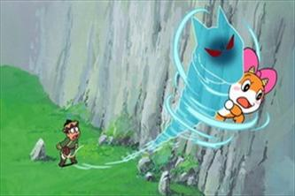
 
"...nụ hoa ấy không phải nụ hồng, ngày không anh em có nát tang cõi lòng..."
  
"...Đến 1 ngày vội vàng nhận thấy..."  
 
<em>"...Nụ hoa ấy không phải nụ hồng.  Ngày không em anh có nát tan cõi lòng.  Anh ra đi thật sao , lời yêu nhớ không??  Người ta nói anh đã vội tin.  Lòng em đau thương cho nhánh hoa ven đường .  Dù xa anh nhưng sao không thể wên anh...."</em>

 <em></em>

http://www.petalia.org/Songs/proudofyou.htm <em></em>

"I can fly   									I'm proud that I can fly   									To give the best of mine   									Till the end of the time   									  									Believe me I can fly  									I'm proud that I can fly  									To give the best of mine  									The heaven in the sky"

 
Happy days and times my dear friends!

--------

# TITLE: Luân vũ ngày mưa & Les valses de Vienne
* DATE: 01/01/2009 06:05:50
* STATUS: publish
* BODY: 

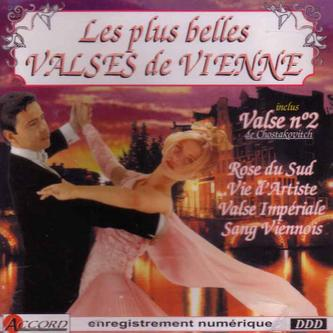
 Luân Vũ Ngày Mưa  Listen: http://mp3.zing.vn/mp3/nghe-bai-hat/Luan-Vu-Ngay-Mua-Bao-Han.IWZEE7IA.html  
Phố vắng trong chiều mưa Chân bước qua thềm xưa Ngập ngừng nhìn mênh mang Một người tìm thấy đâu... Nay quán xưa ngày nao Anh với em cùng trao Ngot ngào lời yêu thương Và tình mình giờ 2 phương .....hỡi dấ yêu...hỡi dấu yêu  ĐK: hỡi dấu yêu , hỡi dấu yêu sao bây giờ đành xa đôi lứa những tháng năm đã lướt nhanh .Trên con sông tương tư nghe tiếng yêu xua dâng trào có còn tìm đến nhau ... hỡi dấu yêu , hỡi dấu yêu sao bây giờ đành xa dôi lứa nhửng tháng năm đã lướt nhanh .Trên con sông tương tư nghe tiếng yêu xua dâng trào có còn tìm đến nhau ... 
 Bài hát này, Bảo Hân đã hát hoàn tất bài hát, đã nhảy rất nhập tâm hòa nguyện vào bài hát. Theo mình thấy thì hay hơn cả Ngọc Lan từng hát.  Nếu để ý thì điệu nhạc có vẽ hơi lạ, vì vậy mà sau khi tìm hiểu 1 chút mới biết nó là nhạc Pháp và bài hát gốc chính là Les Valses de Vienne. Do chính Francois Feldman hát! Một bất ngờ và nhiều cảm xúc khi xem video clip của nó. Luân Vũ Ngày Mưa đã dịch 1 cách thoát nghĩa nhưng bám sát ý chính của Les Valses de Vienne  Les Valses de Vienne  Listen: http://www.tuoitho.net/diendan/index.php/tt_temp/index.php?action=musiclink&act=view&id=4375 Watch clip: http://www.youtube.com/watch?v=UDQ9f2eEixM  Điệp khúc: "...và giờ này, điệu Valse của Vienna (thủ đô của Áo) ra sao rồi em? Hãy nói cho anh biết, giờ này em đang làm gì sau nhiều năm đã trôi qua? Nếu câu trả lời cũng như ngày xưa em từng kể với anh, thì hãy nói với anh như ngày xưa rằng em vẫn yêu anh... điệu Valse của Vienna giờ thế nào rồi, và những tiếng động của tòa lâu đài mà hôm nay em lại nhảy, thì hãy nói cho anh biết em đang nghĩ đến ai?..."  
Du pont des supplices Tombent les actrices Et dans leurs yeux chromés Le destin s'est brouillé  Au café de Flore La faune et la flore On allume le monde Dans une fumée blonde  {Refrain:} Maintenant que deviennent Que deviennent les valses de Vienne ? Dis-moi qu'est-ce que t'as fait Pendant ces années ? Si les mots sont les mêmes Dis-moi si tu m'aimes... Maintenant que deviennent Que deviennent les valses de Vienne ? Et les volets qui grincent D'un château de province ? Aujourd'hui quand tu danses Dis, à quoi tu penses ?  Dans la Rome antique Errent les romantiques Les amours infidèles S'écrivent sur logiciels  Du fond de la nuit Remontent l'ennui Et nos chagrins de mômes Dans les pages du Grand Meaulnes  {au Refrain} 
 

--------

# TITLE: Chiến thắng ý nghĩa của Viet Nam
* DATE: 12/28/2008 18:49:40
* STATUS: publish
* BODY: 

 <strong>Niềm vui!</strong>     Niềm vui tràn ngập khắp nơi, một cảm giác nâng nâng khó tả, tất cả người dân Việt Nam như đang sống trong mơ. Một giấc mơ mà đã từ hơn một thập kỉ nay chúng ta khi chúng ta tỉnh dậy thì chỉ còn biết tiếc nuối nhưng nay đã thành hiện thực, hiện thực thật rồi…
Từ mọi ngõ ngách, trên mọi nẻo đường…hàng triệu con tim Việt Nam đang sống trong niềm hạnh phúc đến tột cùng, không thể tả xiết. Đối với những CĐV trung thành của ĐTVN, những người đã luôn theo sát bước chân của đội tuyển dù bất cứ thời điểm nào, chiến thắng này có ý nghĩa vô cùng lớn lao, vô cùng đẹp đẽ…

Sau biết bao mong mỏi chờ đợi và đã có những thời điểm tưởng chừng như chúng ta đã tiến đến rất gần ngôi vô địch Đông Nam Á như Tiger Cup 98 hay Seagames 22 (dù đây là giải đấu U22), để rồi giờ đây chúng ta mới thực sự vươn lên đỉnh vinh quang, mà đã lẩn tránh ĐTVN bao năm nay.
<strong><em>Cảm giác khi hòa mình vào dòng người đổ ra đường mới thấu hết được cảm giác của các CĐV nhiệt thành. Đứng giữa một biển người đầy ắp những lá cờ đỏ sao vàng chúng ta sẽ thấy được niềm tự tôn dân tộc lớn lao của những con dân Việt Nam. Lắng nghe bài hát những tiếng hò reo, trong lòng người tự dưng sẽ thấy một cảm giác đầy tự hào đầy sung sướng.</em></strong>     Từ người già đến trẻ em, từ phụ nữ cho tới các cánh đàn ông…tất cả không phân biệt tuổi tác, giới tính…cùng hòa mình vào niềm vui chiến thắng. Hãy cùng tận hưởng…     <a style="font-weight:bold;" href="http://www28.24h.com.vn/news.php/48/211037/VIDEO-CLIP-Canh-an-mung-cua-cac-CDV-tai-Ha-Noi-TP-HCM-Da-Nang">Xem clip</a>     <strong>Bão</strong>     Hòa vào dòng người, hòa vào cờ đỏ, hòa vào niêm vui. Chiến thắng của Việt Nam quá ý nghĩa trong bối cảnh kinh tế chung thế giới, một cú hít, cổ động những con người Việt.     Cố lên và luôn chiến thắng!       <strong>Một cảm nhận</strong>     Đi bão về, một chút quan sát cảnh vật, con người khắp nơi, trời tuy tối nhưng dòng người thật phấn khởi, ở một nơi xa thành phố, bão ít đi qua nhưng những con người say mê bóng đá, yêu Việt Nam cũng ra các ngã tư, vẫy cờ vui mừng. Mình nghĩ rằng ở những nơi xa hơn, họ cũng vậy.    Suy nghĩ: một vài người hớt hả về nhà vì kẹt xe về trễ, một vài bán bắp dạo ngồi nhìn và tìm câu trả lời cho việc bán hàng ế, lặng lẹ dọn hàng ra về. Có những người không hòa mình vào được niềm vui chung của tổ quốc, vì kế sinh nhai, vì cuộc sống. Họ cấn 1 chiến thắng nữa trong trận chung kết kinh tế mà cấu thủ là chính chúng ta, là nhà nước và là cả Việt Nam.       Bravo Viet Nam!   

[ COMMENT: ]
* AUTHOR: 
* DATE: 12/28/2008 22:42:11
blog gi ma khong comment duoc gi het, hom qua nhan tin tuong VIet Nam thang em duoc anh va Uyen dan di an chu? ai ngo thang that ma khong duoc an. hichic.. VN chiet thang that roi

[ COMMENT: ]
* AUTHOR: 
* DATE: 12/28/2008 23:14:06
Nhung luc nhu the nay niem tu hao dan toc, long tu hao vi la nguoi VN lai troi len am �� anh Long heng!!! Dem wa em k di bao nhu lan truoc, nhung cung di ra ngoai duong, thay trong nguc minh dap thinh thich, chac em yeu Cong Vinh mat roi anh Long ah!!

[ COMMENT: ]
* AUTHOR: 
* DATE: 12/29/2008 00:10:48
em cho mot tran di bao that hoanh trang nua ... khi nu cuoi no tren moi cac co bac ban hang rong, nguoi gia ko can di tung buoc de mong cho duoc nhin tung tam ve so trao tay nguoi di duong, moi nha don nhung cai tet am no va hanh phuc va yen binh! Viet Nam co len! 

--------

# TITLE: CEO, CFO, COO,& CTO
* DATE: 12/28/2008 18:25:44
* STATUS: publish
* BODY: 

Chief Executive Officer - CEO
 
This is the senior manager who is responsible for overseeing the activities  of an entire company.
 
The CEO usually also holds a position on the board of directors, or also  holds the title of president.
 
Chief Financial Officer - CFO
 
This is the senior manager who is responsible for overseeing the financial  activities of an entire company. This includes signing checks, monitoring cash  flow, and financial planning.
 
The CFO is similar to a treasurer or controller.
 
Chief Operating Officer - COO
 
The senior manager who is responsible for managing the company's day-to-day  operations and reporting them to the chief executive officer (CEO).
 
A company needs a chief operating officer (COO) because the CEO is usually  too busy to monitor production quotas and other factors on a daily basis.
 
Chief Technical Officer - CTO
 
A chief technical officer or chief technology officer is a business executive  position whose holder is focused on technical issues in a company. It emerged in  the United States in the 1980s as a business-focused extension of the position  of Director of R&D.
 
During the dot-com and computer boom of the 1990s, many companies used the  CTO title for their main technical person. The MIS and IT community often use  the title CTO as either synonymous with Chief Information Officer, or as a  subordinate to the CIO who is more versed in the technical intricacies. The role  of the CTO varies between companies and industries, but usually relates to  technology. The roles include:
 
Long term technology direction (strategic)   Short term technology  direction (tactical)   Business-focused oversight of R&D   Software used  in the corporation 
    

(answers.com/Wikipedia)

--------

# TITLE: Lý thuyết "Bàn Tay Hữu Hình" & "Bầy Đàn"
* DATE: 12/17/2008 18:01:09
* STATUS: publish
* BODY: 
"BÀN TAY VÔ HÌNH"<strong> </strong>: thuyết kinh tế do Xmit (A. Smith) đưa ra năm 1776. Theo học thuyết đó thì hoạt động của mỗi thành viên trong xã hội chỉ có mục đích bảo vệ sự an toàn và thành quả của riêng mình; thông thường, không có chủ định củng cố lợi ích công cộng và cũng không biết mình đang củng cố lợi ích này ở mức độ nào.     Trong khi đó, hệ thống thị trường và cơ chế giá cả vẫn hoạt động một cách tự phát vì lợi ích của tất cả mọi người như thể có một "BTVH" đầy thiện ý điều khiển toàn bộ quá trình xã hội, buộc cá nhân phải theo đuổi một mục đích không nằm trong dự định.     Trong khi theo đuổi lợi ích cá nhân, con người thường bảo vệ luôn lợi ích của xã hội một cách hữu hiệu hơn cả khi có ý định làm việc này. Thuyết của Xmit chống lại tư tưởng của chủ nghĩa trọng thương (yêu cầu có sự can thiệp của nhà nước vào kinh tế), là tiếng nói của chủ nghĩa tư bản đã trưởng thành đòi hỏi được tự do kinh doanh. Tư tưởng của Xmit thích hợp với chủ nghĩa tư bản trong một thời kì dài, thời kì tự do cạnh tranh.     Sau này, khi vấp phải những cuộc khủng hoảng kinh tế sâu sắc thì những nhà kinh tế học khác lại kêu gọi đến <strong>bàn tay hữu hình</strong> của nhà nước để điều chỉnh kinh tế. Để khắc phục những khuyết tật của cơ chế "BTVH", nền kinh tế hiện đại cần được điều hành bởi sự kết hợp giữa "BTVH" của thị trường với bàn tay hữu hình của nhà nước thông qua luật pháp, thuế và nhiều biện pháp kinh tế, tài chính khác; vai trò vĩ mô cũng như vi mô của nhà nước ngày càng tỏ ra quan trọng trong nền kinh tế thị trường.    NX: nếu không có BTHH thì việc khủng hoảng kinh tế, tài chánh do các tay tài phiệt kinh tế, sói điện tử sẽ vô cùng kinh khiếp      <strong>Warren Edward Buffet</strong> (sinh ngày 30 tháng 8 năm 1930 tại Omaha, Nebraska) là một nhà đầu tư chứng khoán, doanh nhân và một nhà nhân đạo người Mỹ.    Warren Buffet đã tích cóp được một gia sản khổng lồ nhờ vào những đầu tư khôn ngoan thông qua công ty mẹ Berkshire Hathaway, nơi mà ông là cổ đông lớn nhất và cũng là giám đốc điều hành. Với tài sản ước tính khoảng 62 tỉ đô la Mỹ, ông là người giàu nhất thế giới, vượt qua Bill Gates, người 13 năm liên tục giàu nhất thế giới. (theo thống kê của Forbes vào tháng 3 năm 2008).    Vào tháng 6 năm 2006, Warren Buffet đã chuyển giao một phần tài sản trị giá khoảng 30 tỉ Mỹ kim của mình vào việc làm từ thiện, trong đó 83% số tiền trên được đưa vào Quỹ Bill & Melinda Gates[cần dẫn nguồn]. Khoảng hiến tặng này được xem là lớn nhất trong lịch sử Hoa Kỳ. Vào thời điểm sự quyên tiền cho Quỹ Bill & Melinda Gates được công bố, nó còn lớn hơn gấp đôi số tiền hiện có của quỹ này.    Mặc dù giàu có lớn như vậy, nhưng Buffet lại nổi tiếng với lối sống khiêm tốn và tiết kiệm. Có lần ông dùng đến 9,7 triệu Mỹ kim từ ngân sách của Berkshire để mua một chiếc phản lực liên hợp. Khi bị các giám đốc điều hành khác phê bình vì dám xài hoang như vậy, ông đã gọi đùa tên nó là “Chiếc Không Thể Cưỡng Lại Được”. Ông tiếp tục sống trong ngôi nhà cũ mua từ năm 1958 với giá 31.500 Mỹ kim ở Omaha, Nebraska (mặc dù ông còn sở hữu một ngôi nhà đắt tiền hơn ở Laguna Beach, California và sau này bán lại nó năm 2004). Ngôi nhà ông đang ở hiện tại được ước tính trị giá đến 700.000 Mỹ kim.    Lương bổng của ông chỉ vào khoảng 100.000 Mỹ kim năm 2006, rất nhỏ so với mức lương cơ bản của những nhà điều hành thâm niên tại các công ty tương đương.    Năm 2007, Buffet được đứng trong hàng ngũ 100 Nhân vật Ảnh hưởng Nhất Thế giới của tạp chí Time.    http://vi.wikipedia.org/wiki/Warren_Buffett  

--------

# TITLE: Chúc mừng Giáng Sinh - We wish you a Merry Christmas
* DATE: 12/14/2008 18:31:54
* STATUS: publish
* BODY: 

			
Sưu tầm chuẩn bị cho giáng sinh 2008 nào. Ai có nguồn nào hay nhớ post comment bên dưới nhé!
 
 
 

 
  
Cây Noel đặc biệt được tạo từ Hình học Fractal trong không gian 3 chiều. Nguồn: sưu tầm

   

 
17 miss-pingle-happy-new-year    <a href="http://www.i4vn.com.vn/forum/redirector.php?url=http%3A%2F%2Ffiles.groove.ru%2F2007-12%2F15%2F40038.groove.ru.17%2520miss-pingle-happy-new-year.mp3" target="_blank">http://files.groove.ru/2007-12/15/40…y-new-year.mp3</a>
 
16 jj_little_and_the_holly_dollies-rocking_around_the_christmas_tree    <a href="http://www.i4vn.com.vn/forum/redirector.php?url=http%3A%2F%2Ffiles.groove.ru%2F2007-12%2F15%2F40038.groove.ru.16%2520jj_little_and_the_holly_dollies-rocking_around_the_christmas_tree.mp3" target="_blank">http://files.groove.ru/2007-12/15/40…stmas_tree.mp3</a>
 
15 jj_little_and_the_holly_dollies-we_wish_you_a_merry_christmas    <a href="http://www.i4vn.com.vn/forum/redirector.php?url=http%3A%2F%2Ffiles.groove.ru%2F2007-12%2F15%2F40038.groove.ru.15%2520jj_little_and_the_holly_dollies-we_wish_you_a_merry_christmas.mp3" target="_blank">http://files.groove.ru/2007-12/15/40…_christmas.mp3</a>
 
14 Danijay - Time 4 Xmas (Radio Version)    <a href="http://www.i4vn.com.vn/forum/redirector.php?url=http%3A%2F%2Ffiles.groove.ru%2F2007-12%2F15%2F40038.groove.ru.14%2520Danijay%2520-%2520Time%25204%2520Xmas%2520%28Radio%2520Version%29.mp3" target="_blank">http://files.groove.ru/2007-12/15/40…20Version).mp3</a>
 
13 Magik Project - Feliz Navidad (extended version)    <a href="http://www.i4vn.com.vn/forum/redirector.php?url=http%3A%2F%2Ffiles.groove.ru%2F2007-12%2F15%2F40038.groove.ru.13%2520Magik%2520Project%2520-%2520Feliz%2520Navidad%2520%28extended%2520version%29.mp3" target="_blank">http://files.groove.ru/2007-12/15/40…20version).mp3</a>
 
12 DanceNation-WarIsOver    <a href="http://www.i4vn.com.vn/forum/redirector.php?url=http%3A%2F%2Ffiles.groove.ru%2F2007-12%2F15%2F40038.groove.ru.12%2520DanceNation-WarIsOver.mp3" target="_blank">http://files.groove.ru/2007-12/15/40…-WarIsOver.mp3</a>
 
11 DanceNation-JoyToTheWorld    <a href="http://www.i4vn.com.vn/forum/redirector.php?url=http%3A%2F%2Ffiles.groove.ru%2F2007-12%2F15%2F40038.groove.ru.11%2520DanceNation-JoyToTheWorld.mp3" target="_blank">http://files.groove.ru/2007-12/15/40…ToTheWorld.mp3</a>
 
10 CyberNation-HaveYourselfAMerryLittleChristmas    <a href="http://www.i4vn.com.vn/forum/redirector.php?url=http%3A%2F%2Ffiles.groove.ru%2F2007-12%2F15%2F40038.groove.ru.10%2520CyberNation-HaveYourselfAMerryLittleChristmas.mp3" target="_blank">http://files.groove.ru/2007-12/15/40…eChristmas.mp3</a>
 
9 CrazyFrog-JingleBells_NewClubMix_    <a href="http://www.i4vn.com.vn/forum/redirector.php?url=http%3A%2F%2Ffiles.groove.ru%2F2007-12%2F15%2F40038.groove.ru.9%2520CrazyFrog-JingleBells_NewClubMix_.mp3" target="_blank">http://files.groove.ru/2007-12/15/40…ewClubMix_.mp3</a>
 
8 Ceox Vs Basshunter - Merry Christmas (Remix)    <a href="http://www.i4vn.com.vn/forum/redirector.php?url=http%3A%2F%2Ffiles.groove.ru%2F2007-12%2F15%2F40038.groove.ru.8%2520Ceox%2520Vs%2520Basshunter%2520-%2520Merry%2520Christmas%2520%28Remix%29.mp3" target="_blank">http://files.groove.ru/2007-12/15/40…%20(Remix).mp3</a>
 
7 c-and-j-feat.-sandra-auld-lang-syne-radio-edit-    <a href="http://www.i4vn.com.vn/forum/redirector.php?url=http%3A%2F%2Ffiles.groove.ru%2F2007-12%2F15%2F40038.groove.ru.7%2520c-and-j-feat.-sandra-auld-lang-syne-radio-edit-.mp3" target="_blank">http://files.groove.ru/2007-12/15/40…adio-edit-.mp3</a>
 
6 Cascada - Last Christmas (Radio Edit)    <a href="http://www.i4vn.com.vn/forum/redirector.php?url=http%3A%2F%2Ffiles.groove.ru%2F2007-12%2F15%2F40038.groove.ru.6%2520Cascada%2520-%2520Last%2520Christmas%2520%28Radio%2520Edit%29.mp3" target="_blank">http://files.groove.ru/2007-12/15/40…io%20Edit).mp3</a>
 
5 Black_Sweetfeat[1].Anna_Maddie-MerryChristmas    <a href="http://www.i4vn.com.vn/forum/redirector.php?url=http%3A%2F%2Ffiles.groove.ru%2F2007-12%2F15%2F40038.groove.ru.5%2520Black_Sweetfeat%255B1%255D.Anna_Maddie-MerryChristmas.mp3" target="_blank">http://files.groove.ru/2007-12/15/40…yChristmas.mp3</a>
 
4 Banaroo-+Bling+Bling+Here+Bling+Bling+There+(X-Mas+Bonus)    <a href="http://www.i4vn.com.vn/forum/redirector.php?url=http%3A%2F%2Ffiles.groove.ru%2F2007-12%2F15%2F40038.groove.ru.4%2520Banaroo-%2BBling%2BBling%2BHere%2BBling%2BBling%2BThere%2B%28X-Mas%2BBonus%29.mp3" target="_blank">http://files.groove.ru/2007-12/15/40…Mas+Bonus).mp3</a>
 
3 DJ Sanny J feat Luca Zeta - Dreaming Of Christmas (Dance Pop Version)    <a href="http://www.i4vn.com.vn/forum/redirector.php?url=http%3A%2F%2Ffiles.groove.ru%2F2007-12%2F15%2F40038.groove.ru.3%2520DJ%2520Sanny%2520J%2520%2520feat%2520Luca%2520Zeta%2520-%2520Dreaming%2520Of%2520Christmas%2520%28Dance%2520Pop%2520Version%29.mp3" target="_blank">http://files.groove.ru/2007-12/15/40…20Version).mp3</a>
 
2 Coming-Home-For-Christmas–Radio-Vesion-    <a href="http://www.i4vn.com.vn/forum/redirector.php?url=http%3A%2F%2Ffiles.groove.ru%2F2007-12%2F15%2F40038.groove.ru.2%2520Coming-Home-For-Christmas--Radio-Vesion-.mp3" target="_blank">http://files.groove.ru/2007-12/15/40…io-Vesion-.mp3</a>
 
1 Jingle Bells (Radio Edit)
 
<a href="http://www.i4vn.com.vn/forum/redirector.php?url=http%3A%2F%2Ffiles.groove.ru%2F2007-12%2F15%2F40038.groove.ru.1%2520Basshunter-JingleBells_RadioEdit_.mp3"><strong> Download</strong></a>
 
<strong>Album 13 Bản Nhạc Dance Giáng Sinh 2008</strong>
 
  
 
 
<strong>01 - Jingle Bells</strong>        <a href="http://www.i4vn.com.vn/forum/redirector.php?url=http%3A%2F%2Ffiles.groove.ru%2F2007-12%2F06%2F35264.groove.ru.01_jingle_bells.mp3"><strong> Download</strong></a>    Click chuột phải chọn Save target as 
 
<strong>02 - Stoevledans</strong>       <a href="http://www.i4vn.com.vn/forum/redirector.php?url=http%3A%2F%2Ffiles.groove.ru%2F2007-12%2F06%2F35264.groove.ru.02_stoevledans.mp3" target="_blank">http://files.groove.ru/2007-12/06/35…toevledans.mp3</a>   
 
<strong>03 - Dollies Snowflakes</strong>       <a href="http://www.i4vn.com.vn/forum/redirector.php?url=http%3A%2F%2Ffiles.groove.ru%2F2007-12%2F06%2F35264.groove.ru.03_dollies-snowflakes.mp3" target="_blank">http://files.groove.ru/2007-12/06/35…snowflakes.mp3</a>   
 
<strong>04 - Rocking Around The Christmas Tree</strong>       <a href="http://www.i4vn.com.vn/forum/redirector.php?url=http%3A%2F%2Ffiles.groove.ru%2F2007-12%2F06%2F35264.groove.ru.04_rocking_around_the_christmas_tree.mp3" target="_blank">http://files.groove.ru/2007-12/06/35…stmas_tree.mp3</a>   
 
<strong>05 - Santa Claus Is Coming To Town</strong>       <a href="http://www.i4vn.com.vn/forum/redirector.php?url=http%3A%2F%2Ffiles.groove.ru%2F2007-12%2F06%2F35264.groove.ru.05_santa_claus_is_coming_to_town.mp3" target="_blank">http://files.groove.ru/2007-12/06/35…ng_to_town.mp3</a>   
 
<strong>06 - I Saw Mommy Kissing Santa Claus</strong>       <a href="http://www.i4vn.com.vn/forum/redirector.php?url=http%3A%2F%2Ffiles.groove.ru%2F2007-12%2F06%2F35264.groove.ru.05_santa_claus_is_coming_to_town.mp3" target="_blank">http://files.groove.ru/2007-12/06/35…ng_to_town.mp3</a>   
 
<strong>07 - Merry Christmas Everyone</strong>       <a href="http://www.i4vn.com.vn/forum/redirector.php?url=http%3A%2F%2Ffiles.groove.ru%2F2007-12%2F06%2F35264.groove.ru.07_merry_christmas_everyone_.mp3" target="_blank">http://files.groove.ru/2007-12/06/35…_everyone_.mp3</a>   
 
<strong>08 - Marys Boy Child</strong>       <a href="http://www.i4vn.com.vn/forum/redirector.php?url=http%3A%2F%2Ffiles.groove.ru%2F2007-12%2F06%2F35264.groove.ru.08_marys_boy_child.mp3" target="_blank">http://files.groove.ru/2007-12/06/35…_boy_child.mp3</a>   
 
<strong>09 - Rudolf The Red Nosed Reindeerm</strong>       <a href="http://www.i4vn.com.vn/forum/redirector.php?url=http%3A%2F%2Ffiles.groove.ru%2F2007-12%2F06%2F35264.groove.ru.09_rudolf_the_red_nosed_reindeerm.mp3" target="_blank">http://files.groove.ru/2007-12/06/35…_reindeerm.mp3</a>
 
<strong>10 - We Wish You A Merry Christmas</strong>       <a href="http://www.i4vn.com.vn/forum/redirector.php?url=http%3A%2F%2Ffiles.groove.ru%2F2007-12%2F06%2F35264.groove.ru.10_we_wish_you_a_merry_christmas.mp3" target="_blank">http://files.groove.ru/2007-12/06/35…_christmas.mp3</a>
 
<strong>11 - Feliz Navidad</strong>       <a href="http://www.i4vn.com.vn/forum/redirector.php?url=http%3A%2F%2Ffiles.groove.ru%2F2007-12%2F06%2F35264.groove.ru.11_feliz_navidad.mp3" target="_blank">http://files.groove.ru/2007-12/06/35…iz_navidad.mp3</a>
 
<strong>12 - Grandma Got Run Over By A Reindeer</strong>       <a href="http://www.i4vn.com.vn/forum/redirector.php?url=http%3A%2F%2Ffiles.groove.ru%2F2007-%2012%2F06%2F35264.groove.ru.12_grandma_got_run_over_by_a_reindeer.mp3" target="_blank">http://files.groove.ru/2007- 12/06/3…a_reindeer.mp3</a>
 
<strong>13 - Jule Megamix</strong>       <a href="http://www.i4vn.com.vn/forum/redirector.php?url=http%3A%2F%2Ffiles.groove.ru%2F2007-12%2F06%2F35264.groove.ru.13_jule_megamix.mp3" target="_blank">http://files.groove.ru/2007-12/06/35…le_megamix.mp3</a>

 
 
<strong>nguồn: i4vn</strong>
 
  

Giáng sinh đang đến gần và ông già Noel chắc chắn sẽ là "ông già" bận rộn nhất trên thế giới. Chúng ta đã có thể mỉm cười chào đón một mùa giáng sinh rộn rã với sự xuất hiện đáng yêu của ông già Noel ở khắp nơi:

 Ông già Noel không biết xấu hổ nhất.   Ông già Noel sáng tạo nhất.   Ông già Noel chịu lạnh giỏi nhất.   Ông già Noel thu hút sự chú ý của phái đẹp nhiều nhất   Ông già Noel kiên nhẫn nhất.   Ông già Noel tuyệt vọng nhất.   Ông già Noel chăm chỉ nhất.   Ông già Noel chu đáo nhất.   Ông già Noel giống gangster nhất.

   

			 		

[ COMMENT: ]
* AUTHOR: 
* DATE: 12/14/2008 20:02:56
I wish you a merry christmas, I wish you a very merry christmas!

--------

# TITLE: Entrée de Décembre 14, 2008
* DATE: 12/14/2008 07:50:54
* STATUS: publish
* BODY: 

1 suy nghĩ: khi cái cốt lỗi không thông, mọi cố gắng vòng vòng xung quanh cũng không đủ sức phá vở chỗ tắt.
 
1 cảm nhận: một ngày khá dài và mệt & vui. Hiểu đã khó, hiểu và cảm thông mới là điều khó hơn, nhưng điều khó quá thì khó mà tồn tại.
 
1 câu nói: "lăn tăn suốt" sao mà bình lòng, động trí, nhìn gần gần, nghĩ xa xa. 
 
...tình hình: không có tình hình, tình hình là if you fail to plan, you plan to fail is a proverb from Offy DH. Thanks DH for the info y3st3rday.
 
1 comment hay: "Gửi ông già Noel: Con biết ông có rất nhiều quà. Có lẽ con đã quá tham lam, nhưng ông ơi con cũng đã cầu Chúa như thế. Hãy tặng những người con yêu thương nụ cười khi họ cảm thấy đau buồn để họ không gục ngã, tặng họ một nghị lực để vượt qua lúc khó khăn, tặng họ một giọt nước mắt để cảm ơn khi ấm no hạnh phúc, tặng họ tình thương để họ không vô cảm trước cuộc sống khó khăn của bao người, tặng họ những ước mơ để họ luôn phấn đấu, tặng họ niềm vui dù là nhỏ bé, tặng họ hy vọng dù là mỏng manh. Con cầu chúc cho mọi người luôn ấm áp & an lành....... <strong>MERRY CHRISTMAS</strong>"

--------

# TITLE: [KB] Không phải nộp thuế GTGT
* DATE: 12/11/2008 18:13:37
* STATUS: publish
* BODY: 

<strong>Chính phủ đã ban hành nghị định quy định chi tiết và hướng dẫn thi hành một số điều của Luật Thuế giá trị gia tăng (GTGT), có hiệu lực thi hành từ ngày 1/1/2009.</strong>  

Theo đó các loại đối tượng không phải chịu thuế quy định tại Điều 5 Luật Thuế GTGT bao gồm: các sản phẩm trồng trọt, chăn nuôi, thủy sản nuôi trồng, đánh bắt qua sơ chế thông thường là sản phẩm mới được làm sạch, phơi, sấy khô, bóc vỏ, tách hạt, cắt lát, ướp muối, bảo quản lạnh và các hình thức bảo quản thông thường khác.

 

Bảo hiểm nhân thọ và các dịch vụ cấp tín dụng, kinh doanh chứng khoán, chuyển nhượng vốn như: cho vay, chiết khấu công cụ chuyển nhượng và các giấy tờ có giá khác, bảo lãnh, cho thuê tài chính... Kinh doanh chứng khoán bao gồm: môi giới, tự doanh chứng khoán, bảo lãnh phát hành chứng khoán, tư vấn đầu tư, lưu ký chứng khoán, quản lý quỹ đầu tư, quản lý danh mục đầu tư chứng khoán…

 

Dịch vụ khám chữa bệnh. Hoạt động duy tu, sửa chữa, xây dựng công trình; vận chuyển hành khách công cộng;  tàu bay, hàng hóa nhập khẩu là viện trợ, quà biếu... Chuyển giao công nghệ, chuyển nhượng quyền sở hữu trí tuệ. Tài nguyên, khoáng sản khai thác chưa chế biến.

--------

# TITLE: Walt Disney - Người viết nên cổ tích hiện đại
* DATE: 11/16/2008 19:51:16
* STATUS: publish
* BODY: 

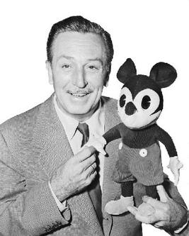
 
Walt Disney là một huyền thoại của thế kỷ 20, ông luôn nhắc đi nhắc lại rằng tiền không phải là mục đích của ông, mà chỉ là phương tiện để đạt đến kết quả cuối cùng. Có lẽ ông là một người say mê công việc sáng tạo yêu thích của mình hơn là một doanh nhân. “Nếu bạn thấy ham muốn tìm hiểu, bạn sẽ thấy nhiều điều thú vị để làm”; “Bạn sẽ đạt được mục tiêu nếu bạn không làm việc chỉ vì tiền”; “Disneyland là sản phẩm của lòng say mê. Chúng tôi làm nên Disneyland không chỉ vì tiền” - đấy là vài lời trích dẫn của Walt Disney.
 
<strong>Khởi nghiệp</strong>
 
Walt Disney sinh ngày 5/12/1901 tại Chicago, lớn lên tại trang trại của bố mẹ ở Marceline, Missouri. Ngay từ nhỏ, cậu bé Disney đã có thiên hướng kinh doanh vượt trội bạn đồng lứa. Lúc 7 tuổi, cậu đã bán những bức phác họa do chính cậu vẽ. Trong những năm học tại trường MacKinley High School, cậu tiếp tục quan tâm đến hội họa và nhiếp ảnh. Buổi tối cậu học tại Trường nghệ thuật Chicago (Chicago Academy of Fine Arts).
 
Cậu bé Walt Disney cũng sớm tỏ ra đam mê điện ảnh, nhất là từ khi xem bộ phim The tramp của Chaplin. Năm 11 tuổi, Disney bị tai nạn gãy chân. Trong thời gian nằm viện, cậu đọc báo và bắt đầu mê truyện hoạt hình. Khi ngày cuối cùng của hai tuần nằm viện kết thúc, niềm mơ ước lao vào lĩnh vực hoạt hình cũng bắt đầu bùng cháy trong Disney.
 
Chiến tranh thế giới lần thứ nhất nổ ra, Walt Disney xin được lái xe cho Hội chữ thập đỏ ở Pháp, và cậu trang trí chiếc xe của mình bằng những hình vẽ vui nhộn tự nghĩ ra. Chiến tranh kết thúc, Disney dấn thân vào con đường hoạ sỹ hoạt hình ở Kansas. 
 
Năm 1920, khi đang làm việc cho xưởng phim quảng cáo Kansas City Film Ads, anh nghĩ ra những nhân vật hoạt hình đầu tiên và năm 1922 anh lập công ty đầu đời Laugh-O-grams. Chẳng bao lâu sau, công ty gặp khó khăn, và Disney quyết định rời thành phố Kansas đến Hollywood lập nghiệp chỉ với tinh thần hăng hái của tuổi trẻ, bộ đồ vẽ và những ý tưởng hoạt hình trong đầu. Cùng với người anh trai là Ron, Walt Disney thành lập xưởng “Disney Brothers Studio”. Sau một thời gian dài, anh thuê được trụ sở ở Hollywood và bán được sản phẩm đầu tiên là loạt phim hoạt hình dựa trên nhân vật cổ tích Alice.
 
<strong><em>Đường đến... huyền thoại</em></strong>
 
Một lần, trên chuyến xe lửa từ New York City về Los Angeles, Walt Disney trong tâm trạng ủ rũ đã bất thần tạo ra nhân vật hoạt hình mới: chú chuột Mickey. Mickey xuất hiện lần đầu tiên trong phim hoạt hình Steamboat Willie, khởi chiếu vào ngày 18-11-1928 (được chọn là ngày khai sinh Mickey), tại rạp Colony Theatre ở New York. Chuột Mickey Mouse ra đời và nhanh chóng trở thành nhân vật yêu thích của các gia đình Mỹ, tượng trưng cho tinh thần vui vẻ ngay cả trong những tình huống ngặt nghèo. Lần đầu tiên Disney sử dụng nhạc nền và các kỹ xảo phụ hoạ cho hoạt hình. Cộng với một nghệ thuật hoạt hình đầy sáng tạo bất ngờ, hình tượng Mickey Mouse đã được công chúng nhiệt liệt hoan nghênh đón chào, nhất là vào những ngày đầu tiên xuất hiện phim lồng tiếng.
 
Thập niên 1930 là thời hoàng kim của Mickey. Chú chuột nhắt xuất hiện tổng cộng trong 87 phim. Mickey nổi tiếng đến mức nó trở thành mật mã của quân đồng minh vào ngày D-Day (tổng công kích phát xít Đức). Năm 1932, Viện Hàn lâm khoa học-nghệ thuật điện ảnh Hoa Kỳ trao Oscar đặc biệt cho Walt Disney trong việc tạo ra Mickey. Năm 1935, Hội Quốc liên (tiền thân LHQ) tặng Walt Disney huy chương đặc biệt trong việc tạo ra Chuột Mickey; đồng thời “phong” Mickey là “biểu tượng lòng thiện chí toàn cầu”.
 
Ngày 21/12/1937, ông chiếu ra mắt bộ phim hoạt hình dài đầu tiên “Nàng Bạch Tuyết và bảy chú lùn” tại rạp chiếu bóng Carthay Theater ở Los Angeles. Bộ phim tốn 1.499.000 USD - một khoản tiền khổng lồ vào thời đó, nhất lại là trong bối cảnh Đại khủng hoảng (Great Depression) đang diễn ra ở Mỹ. Ông đã mạo hiểm đặt cược toàn bộ sự nghiệp của mình vào bộ phim này, và sự táo bạo đó đã được đền đáp. Bộ phim thành công mỹ mãn trên phim trường và thương trường: đoạt giải Oscar cộng với 8 triệu USD lợi nhuận - một con số kỷ lục đối với điện ảnh Mỹ những năm 1930. Và từ bộ phim này, Walt Disney trở thành nhân vật được sùng bái trong làng điện ảnh.
 
Trong vòng 5 năm sau đó, Walt Disney Studio sản xuất tiếp những bộ phim hoạt hình dài đã trở thành kinh điển như Dumbo, Fantasia, Bambi, Pinocchio. Vào những năm 1940, Disney điều hành Burbank Studios với hơn 1.000 nhân viên.
 
Năm 1955, Disney mở hướng đi mới: khai trương công viên Disneyland rộng 70 hécta, một công viên hoàn toàn để vui chơi giải trí đầu tiên trên thế giới dựa trên chính những bộ phim hoạt hình của ông. Đó là một xứ sở huyền ảo không chỉ đối với trẻ con, mà người lớn cũng thấy mê hoặc khi chu du trong đó. Disney bỏ ra 17 triệu USD cho dự án này - lại một khoản tiền khổng lồ nữa. Và lại một lần nữa ông mạo hiểm, và lại thêm một lần nữa ông đã thành công: ngay trong bảy tuần đầu tiên Mickey Mouse và bạn bè chú đã đón một triệu lượt khách đến thăm.
 
Walt Disney cũng là một trong những người tiên phong trong lĩnh vực truyền hình, bắt đầu nhảy vào lĩnh vực này năm 1954, một trong những người đầu tiên làm truyền hình màu: vào năm 1961, ông cho ra đời chương trình “Thế giới sắc màu huyền diệu”. Nhưng Walt vẫn không chịu dừng lại ở đó, vì như ông nói: “Tôi làm thế vì tôi muốn làm tốt hơn”.
 
Từ giữa thập niên 1960, Disney bắt tay vào thực hiện một dự án lớn - xây dựng “Thế giới Disney” (Disney World) với những mục đích xã hội. Disney World rộng hơn Disneyland 15 lần, gồm có công viên giải trí, tổ hợp khách sạn, sân bay... Ông quan tâm đến từng chi tiết của công trình này, nhưng không kịp sống đến ngày khai trương Disney World vào tháng 10/1971: ông mất ngày 15/12/1966.
 																			
<strong> 																					Tổng hợp</strong>

--------

# TITLE: High School Music 3 (writing...)
* DATE: 11/08/2008 07:49:44
* STATUS: publish
* BODY: 

Official website: <a href="http://disney.go.com/disneypictures/highschoolmusical3/">http://disney.go.com/disneypictures/highschoolmusical3/</a>
 
Trailer on youtube: <a href="http://www.youtube.com/watch?v=VgCfxGHmnVA&feature=related">http://www.youtube.com/watch?v=VgCfxGHmnVA&feature=related</a>
 
HSMC 3 official logo: <a href="http://www.youtube.com/watch?v=4cb1N152glA&feature=related">http://www.youtube.com/watch?v=4cb1N152glA&feature=related</a>
 
Entry on <a href="http://blog.360.yahoo.com/blog-hqMRnlsrfqoplQgx4KwjfA--?cq=1&p=371">High School Musical 2</a>
 
Entry on .:: <a href="http://blog.360.yahoo.com/blog-hqMRnlsrfqoplQgx4KwjfA--?cq=1&p=310">High School Musical 1</a> ::. 

--------

# TITLE: 7 bài học vui và nghĩa ý
* DATE: 11/05/2008 20:19:05
* STATUS: publish
* BODY: 

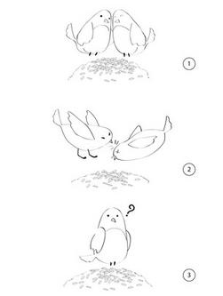
 <strong>Bài học 1:      </strong>Thấy quạ ngồi trên cây cả ngày mà không làm gì, thỏ con hỏi:  
- Tôi có thể ngồi cả ngày mà không làm gì như anh không? 
 
- Tất nhiên rồi! Sao lại không nhỉ? - quạ nói. 
 
Vậy là thỏ con ngồi dưới đất nghỉ ngơi. Bỗng cáo già xuất hiện vồ lấy thỏ và ăn thịt. 
 
Bài học rút ra: <strong>Để được ngồi không, bạn phải ngồi ở vị trí rất, rất cao</strong>. 
 
<strong>Bài học 2:</strong> 
 
Hai bồ câu trống và mái tha hạt thóc về đầy tổ, cả hai rất ư hạnh phúc. Gặp mùa khô hanh, hạt thóc ngót lại. Con trống thấy tổ vơi đi liền trách con mái ăn vụng. Con mái cãi lại liền bị con trống mổ chết. Mấy hôm sau mưa xuống, hạt thóc thấm nước và nở lớn. Bồ câu trống ngẩn tò te.
 
Bài học rút ra: <strong>“Thịt” nhân viên một cách hồ đồ không làm bạn trông thông minh hơn</strong>.
 
<strong>Bài học 3:</strong> 
 
Gà tây nói với bò tót: 
 
- Tôi muốn nhảy lên ngọn cây kia nhưng không đủ sức. 
 
- Vậy thì rỉa phân tôi đi - bò tót khuyên. 
 
Gà tây mổ phân bò tót ăn và thấy tăng lực, thật sự đủ sức để nhảy lên cành cây thứ nhất. Ngày tiếp theo, sau khi ăn một ít phân bò, gà tây nhảy được đến cành cây thứ hai. Cứ thế đến nửa tháng sau, gà tây đã lên tới ngọn cây. Không lâu sau đó, gà tây bị một bác nông dân bắn rơi. 
 
Bài học rút ra: <strong>Sự ngu ngốc có thể đưa bạn lên đỉnh cao nhưng không thể giữ bạn ở đó mãi. </strong>
 
<strong>Bài học 4:</strong> 
 
Một ông vua nọ do chán chuyện triều đình nên mua một con khỉ đem về. Con khỉ làm trò rất hay nên được vua sủng ái, đi đâu cũng mang theo, cho mặc quần áo, giao cả kiếm cho giữ. Một hôm, vua ra vườn thượng uyển ngủ. Có con ong bay đến đậu lên đầu vua. Khỉ muốn đuổi ong, lấy kiếm nhắm vào ong mà chém. Đức vua băng hà.
 
Bài học rút ra:<strong> Trao quyền cho những kẻ không có năng lực thì luôn phải cảnh giác.</strong>
 
<strong>Bài học 5:</strong> 
 
Chim non đang bay về phương nam để tránh rét thì bị đông cứng và rơi xuống một cánh đồng. Bò cái đi ngang bèn phóng uế lên người nó. Trong lúc bị đông cứng vì rét, bãi phân bò lại làm chim non thấy ấm lên và tỉnh lại. Nó cất tiếng hót vì sung sướng thì một chú mèo đi qua nghe thấy. Mèo tìm đến bãi phân bò lôi chim non ra rồi ăn thịt.    
 
Bài học rút ra: 
 
1) Không phải bất cứ ai vấy bẩn lên bạn cũng đều là kẻ thù. 
 
2) Không phải bất cứ ai kéo bạn ra khỏi chốn bẩn thỉu cũng đều là bạn. 
 
<strong>3) Khi bạn đang ở sâu trong chốn bẩn thỉu, hãy im lặng.</strong>
 
<strong>Bài học 6:</strong>
 
Quạ thấy chó ngậm khúc xương quá ngon, bèn đánh liều lao xuống mổ vào đầu chó. Bị bất ngờ, chó bỏ chạy để lại khúc xương. Quạ ngoặm lấy khúc xương nhưng nặng quá không tha nổi. Chó sau khi hoàn hồn, thấy kẻ tấn công chỉ là con quạ nên quay lại táp một cú, quạ chết tươi.

 
Bài học rút ra: <strong>Đừng chiếm thị trường nếu bạn nhắm không giữ được nó. </strong>
 
<strong>Bài học 7:</strong>
 
Ba con thú dữ là sói, gấu và cáo thay nhau ức hiếp đàn dê. Dê đầu đàn bèn nói với cả bầy: “Ta nên mời một trong ba gã sói, gấu hay cáo làm thủ lĩnh của chúng ta”. Cả đàn dê bất bình, nhưng ba “hung thần” nghe tin này rất mừng. Thế là chúng quay sang tranh giành nhau quyền lãnh đạo, cuối cùng cáo dùng bẫy hại chết được sói và gấu. Nhưng rồi một mình nó không còn ức hiếp đàn dê được nữa.
 
Bài học rút ra: <strong>Hãy thận trọng khi nghe tin bạn sắp được làm sếp!</strong> 
 
 (st)

[ COMMENT: ]
* AUTHOR: 
* DATE: 11/05/2008 21:18:46
ha ha, oc tuong tuong phong phu du ah. Nhung bai hoc i nghia ^^, ke khe

[ COMMENT: ]
* AUTHOR: 
* DATE: 11/06/2008 10:00:46
tieng bai thu 3 thi em ko hieu lam

[ COMMENT: ]
* AUTHOR: 
* DATE: 11/06/2008 17:18:49
B᩠thứ 3 cũng c󠴨ể hiểu lଠ"Những kẻ hay nịnh h󴠴h졳ẽ ko thể tồn tại l㵠được..." hehe. Meaningful lessons.

[ COMMENT: ]
* AUTHOR: 
* DATE: 11/06/2008 18:26:41
B᩠thứ 3 cũng c󠴨ể hiểu lຠ"H뮠kh��bằng Hay" :D

[ COMMENT: ]
* AUTHOR: 
* DATE: 11/17/2008 10:45:06
truyen hay, loi binh tham thuy'.....nhung sao nhieu` kim nhon. ghia do' L O.o

--------

# TITLE: "Wall-E" và Oscar dành cho Phim xuất sắc nhất?
* DATE: 11/02/2008 20:02:39
* STATUS: publish
* BODY: 

 
<strong>Phim đại chúng với Oscar 2009</strong>
 
Sau một thời gian "dành đất" cho các bộ phim được lòng giới phê bình nhưng kén khán giả như "No country for Old Men", "There Will be Blood"... giải thưởng Oscar lần thứ 61 dường như mở rộng cửa hơn cho dòng phim đại chúng. Các studio lớn hàng đầu Hollywood hồ hởi với xu thế này nhất.
 
Với một chiến dịch vận động rầm rộ bắt đầu vào tuần này, "Wall-E" của Walt Disney hướng tới Oscar dành cho Phim xuất sắc nhất, một danh hiệu mà từ trước đến nay chưa một bộ phim hoạt hình nào dành được.
 
Trong số các kỷ lục gia phòng vé trong năm nay, bộ phim hoạt hình "Wall-E" được đặc biệt đánh giá cao từ cả giới phê bình. Chuyển tải một thông điệp nghiêm túc (về môi trường) thông qua câu chuyện tình yêu của hai rôbốt, ban đầu, các nhà sản xuất tại xưởng hoạt hình Pixar (thuộc Walt Disney) bị coi là chơi một ván bạc đầy tính rủi ro (như việc có tới 45 phút trong phim hoàn toàn không có lời thoại).
 
Với việc vận động cho một đề cử Oscar Phim xuất sắc nhất, giới lãnh đạo hãng Walt Disney tiếp tục chấp nhận mạo hiểm (vì khả năng "Wall-E" giành chiến thắng trong hạng mục Phim hoạt hình xuất sắc nhất là cao hơn rất nhiều). Cho đến nay, mới chỉ có duy nhất một bộ phim hoạt hình của Disney là "Beauty and the Beast" được lọt vào đề cử Oscar cho Phim xuất sắc nhất vào năm 1991.
 
   <strong>Khám phá "WALL-E: Robot biết yêu"</strong>
 
Đạo diễn: <strong>Andrew Stanton   </strong>   Tác giả kịch bản: <strong>Andrew Stanton</strong>, <strong>Jim Reardon   </strong>   Sản xuất: <strong>Jim Morris, Lindsey Collins   </strong>   Thể loại: <strong>Hoạt hình, hài hước, lãng mạn, khoa học viễn tưởng   </strong>   Các diễn viên chính lồng tiếng: <strong>Ben Burt (WALL-E, M-O), Elisa Knight (EVE), Jeff Garlin (Phi trưởng)   </strong>   Những phim trước đó của Pixar:<strong> Findind Nemo, Ratatouille, The Incredible, Monsters .Inc, Cars...</strong>
 
Trong tương lai, khi Trái Đất ngập rác, con người di tản đến hành tinh khác. Lúc đó, hàng triệu người máy được lập trình để dọn dẹp rác trên Trái Đất, trong số đó duy nhất một mình WALL-E là vật thể “sống”, và mục đích cuối cùng của cuộc sống là gì? Tình yêu... 
 
Trong tương lai, Trái đất bị bao phủ bởi rác thải. Để dọn dẹp, loài người buộc phải rời khỏi trái đất và thay thế vào đó là hàng triệu con robot nhỏ bé với nhiệm vụ thu dọn rác thải cho đến khi trái đất có thể ở được. Nhưng chương trình đó thất bại chỉ trừ một chú robot nhỏ bé vẫn chăm chỉ làm công việc của mình.
 

 

 
700 năm dọn dẹp rác rưởi trên hành tinh bằng cách nén rác thành từng khối lập phương, WALL-E – con robot duy nhất bị bỏ lại trên Trái đất bắt đầu có một lỗi nhỏ trong hệ thống: phát triển tính cách của con người. Rất ham hiểu biết, cực kỳ tò mò và một chút xíu cô đơn, hàng ngày, chú người máy tận tụy làm việc một mình, bên cạnh chỉ có một con gián. WALL-E lãng mạn mơ ước rằng một ngày cậu sẽ kết giao được với ai đó, và cuộc đời này hẳn còn nhiều điều thú vị hơn công việc buồn tẻ mà cậu làm hàng ngày.
 
Thế rồi EVE xuất hiện! EVE là cô người máy thăm dò có kiểu dáng đẹp, nhanh nhẹn, có thể bay và được trang bị súng laser. EVE thuộc hạm đội người máy được Phi trưởng của tàu Axiom (con tàu mẹ khổng lồ và sang trọng, là chỗ ở cho hàng ngàn con người) cử xuống Trái đất để làm nhiệm vụ kiểm tra bí mật.
 

 

 
Theo đuổi EVE, WALL-E không thể ngờ rằng cậu sẽ vượt qua dải ngân hà và bước vào một chuyến phiêu lưu kỳ thú vượt xa sự tưởng tượng của chính mình.
 
Và như đã thành thông lệ cho những sản phẩm hợp tác giữa Disney và Pixar, khán giả sẽ được tặng một phim hoạt hình ngắn trước khi bộ phim chính thức bắt đầu.
 
<strong>Ý tưởng về “WALL-E” đã có từ trước cả khi “Toy Story” được ra mắt</strong>
 
Năm 1992, khi Toy Story đang trong giai đoạn sản xuất, những gạo cội của Pixar là Stanton, John Lasseter, Pete Docter và nhà viết truyện thiên tài Joe Ranft quyết định sẽ cùng nhau làm vài bộ phim khác, nhưng chưa có ý tưởng. Họ ra ngoài ăn trưa và ý tưởng về A Bug’s Life, Monsters, Inc., và Finding Nemo đã xuất hiện. Cùng vào thời điểm đó, hình ảnh một chú người máy nhỏ bị bỏ lại một mình trên trái đất xuất hiện. 
 
Stanton nói: “Khi đó chúng tôi chưa có cốt truyện. Chỉ là ý nghĩ điều gì sẽ xảy ra nếu loài người phải rời bỏ trái đất và ai đó quên tắt nguồn cho con robot cuối cùng, và nó không hề biết rằng công việc của nó đã kết thúc”
 
Một vài năm sau đó, ý tưởng thực sự được hình thành. Stanton nói rằng ông bị ảnh hưởng rất lớn từ phim khoa học viễn tưởng của những năm 70 như 2001: A Space Odyssey, Star Wars, Alien… 
 
<strong><em></em></strong>
 
“Những bộ phim ấy có thể đem tôi đến một không gian khác, làm tôi thực sự tin rằng những thế giới đó tồn tại ngoài kia”, ông nói, “Từ đó đến nay chưa có bộ phim nào làm được như thế, và tôi muốn tái hiện lại cảm xúc ấy”.
 
“Tôi cứ nghĩ mãi rằng nhân vật này rồi sẽ đưa chúng ta đến đâu? Và không phải mất nhiều thời gian để nghiệm ra rằng trái ngược với nỗi cô đơn chính là tình yêu. Tôi lập tức bị cuốn hút và hoàn toàn bị thuyết phục bởi ý nghĩ về tình yêu giữa hai cỗ máy. Nhất là đặt trong bối cảnh toàn nhân loại đã mất đi mục đích sống. Điều đó thật nên thơ. Tôi thích ý nghĩ loài người sẽ có cơ hội thứ hai nhờ vào tình yêu của một chú robot bé nhỏ,” Stanton thổ lộ.
 
Jim Reardor – đạo diễn kỳ cựu và giám sát cốt truyện của series The Simpsons – nhận lời viết cốt truyện cho WALL-E: “Chúng tôi bắt đầu dự tính WALL-E sẽ là một bộ phim hài, nhưng rồi chúng tôi nhận ra bộ phim chứa đựng trong ấy một câu chuyện tình yêu. WALL-E là một chú người máy ngây thơ và trẻ con nhưng vô tình lại có ảnh hưởng lớn đến thế giới. Cũng không thể không nói đến EVE. Cô người máy này đã trải qua sự thay đổi tính cách lớn nhất và bộ phim nói về “cô” nhiều không kém gì nói về “cậu”. “Cô” có mẫu mã đẹp, quyến rũ và có vẻ ngoài hiện đại. “Cậu” được thiết kế chỉ để làm công việc của mình, han rỉ, bẩn thỉu và xấu xí. Nhưng chúng tôi luôn nghĩ rằng điều đó sẽ tạo nên một cuộc phiêu lưu lãng mạn nhất”.
 
Nhà sản xuất Jim Morris tổng kết lại: “Bộ phim là sự pha trộn của nhiều thể loại. Đây là một câu chuyện tình yêu, một bộ phim khoa học viễn tưởng, một phim hài”.
 

 

 
<strong>Tạo hình WALL-E</strong>
 
Theo Jason Deamer, chỉ đạo nghệ thuật mảng nhân vật của WALL-E, thì điểm bắt đầu trong quá trình phác họa WALL-E là đôi mắt: “Andrew đưa ra ý tuởng về đôi mắt của WALL-E dựa trên cái ống nhòm sau khi đi xem một trận bóng chày. Anh ấy nhận ra rằng chỉ cần nghiêng cái ống nhòm đi một chút là nó sẽ như có một vẻ mặt, cảm xúc khác. Phát hiện đó trở thành một trong những cơ sở tạo hình của nhân vật chính.”
 
Các bộ phận còn lại của WALL-E được phát triển dựa theo chức năng: “Nó làm sao để đưa rác vào người và làm sao để nén chúng lại?”. Chính vì thế những chuyến đi đến xí nghiệp tái chế để qua sát máy nén rác hoạt động như thế nào đã được tổ chức. WALL-E còn cần bộ phận di chuyển, cấu tạo thế nào để có thể nén rác thành những khối lập phương và có bộ phận nào đấy như tay để khua khoắng.
 
Một trong những điểm gây tranh cãi nhất trong quá trình phác họa WALL-E là chú robot này có nên có khuỷu tay hay không.
 
“Lúc đầu, chúng tôi phác họa WALL-E với khuỷu tay,” – giám sát tạo hình Steve Hunter nói. “Khuỷu tay khiến tay gập lại được. Chúng tôi nghĩ rằng WALL-E phải chạm được vào mặt mình, bám được lên tàu vũ trụ và nhiều chuyển động khác nữa. Thế nhưng khi nhìn lại thì đúng là không ổn. Nó được thiết kế để làm nhiệm vụ kéo rác vào bụng mình. Thế thì khuỷu tay để làm gì? Điều đó thật vô lý. Vậy là với sự giúp đỡ của Andrew và gợi ý của hướng dẫn tạo hình Angus MacLane, chúng tôi đã cho nó một đường rãnh ở bên thân từ đó dễ dàng thay đổi vị trí đôi tay và thực hiện được nhiều cử động khác. Điều đó giúp nhân vật trở nên sống động hơn. Cái khuỷu tay không phải là gì to tát nhưng cách chúng tôi xử lý vấn đề sẽ làm các bạn tin vào WALL-E hơn bởi chúng tôi đã không chọn cách dễ dàng.”
 
<strong>Huyền thoại Ben Burtt và thế giới âm thanh riêng của "WALL-E"</strong> 
 
Vì giọng nói của WALL-E đóng vai trò quan trọng tạo nên tính cách của cậu, nên đội ngũ hoạt họa luôn phối hợp chặt chẽ với nhà thiết kế âm thanh Ben Burtt để truyền cảm hứng cho nhau và cho ra sản phẩm hoàn hảo nhất. 
 
Đội ngũ nhân vật của WALL-E bao gồm nhiều loại robot khác nhau, trong đó một số loại chỉ nói hay giao tiếp bằng thứ ngôn ngữ đặt trưng riêng của chúng. Đối với nhà sản xuất Jim Morris và đạo diễn/đồng tác giả kịch bản Andrew Stanton thì chỉ có một lựa chọn duy nhất có thể tạo ra tiếng nói đặc trưng cho những con robot và thiết kế âm thanh cho phim. Đó là nhà thiết kế âm thanh đã nhiều lần đoạt giải Oscar Ben Burtt, huyền thoại đã tạo nên âm thanh của R2-D2 (Star Wars), tiếng roi da của Indiana Jones, tiếng rít của Alien và nhiều loại âm thanh khác được biết đến rộng rãi. 
 

 

 
Dù đã có nhiều kinh nghiệm khi làm phim Star Wars, nhưng theo Burtt thì WALL-E là bộ phim yêu cầu nhiều loại âm thanh cho người máy nhất từ trước đến nay. Thử thách của phim là tiếng nói của nhân vật được tạo ra phải khiến khán giả tin rằng không phải của con nguời nhưng đồng thời cũng phải mang những đặc điểm của chính thứ máy móc ấy. Không thể là tiếng của một cỗ máy vô hồn, cũng không thể giống tiếng con người mô phỏng. 
 
“Tôi bắt đầu từ căn phòng ghi âm nhỏ của mình. Tôi thu những âm thanh gốc rồi dùng máy vi tính để phân tích chúng, làm chúng vỡ ra đến những phần cấu thành. Khi làm chúng vỡ ra được rồi, bạn cũng có thể hợp chúng lại với nhau nhưng sẽ quản lý được số lượng. Ví dụ như tôi có thể đưa đặc điểm của một cỗ máy vào trong âm thanh, và làm những việc mà thanh âm của con người không thể làm được. Tôi có thể giữ một nguyên âm lâu hơn và kéo dài nó ra. Tôi cũng có thể chỉnh độ cao thấp của bất kỳ âm thanh nào.” 
 
Ngoài phụ trách tiếng nói cho WALL-E, Ben Burtt còn chịu trách nhiệm với tiếng nói của M-O, Auto và EVE. Giọng của cô người máy này được Ben Burtt tạo lại từ giọng nói của Elissa Knight - một nhân viên của Pixar. 
 
<strong><em>Chuyện bên lề WALL-E</em></strong>
 
1. Bản phóng tác phim năm 1969 của nhạc kịch Hello, Dolly đóng vai trò rất quan trọng xây dựng tính cách của WALL-E. Chính vì xem đi xem lại cuốn băng cũ này mà WALL-E phát triển tính lãng mạn. Phần nhạc trong phim của Hello, Dolly tình cờ lại được soạn bởi chính bác của Thomas Newman, huyền thoại âm nhạc Lionel Newman.
 
2. Trong trailer không chính thức của WALL-E có một đoạn nhạc của Michael Kamen soạn cho phim Brazil (1985). Michael Kamen đáng lẽ cũng đã soạn nhạc cho một bộ phim khác của Pixar là The Incredibles nhưng tiếc thay ông đã mất ở tuổi 55 trước khi có thể thực hiện điều đó. 
 
<strong><a target="_blank" href="http://www.24h.com.vn/news.php/158/192827/Wall-E_Cau_chuyen_ve_robot_nho%20vuot_qua_quot;Sat_thuquot;">Mời bạn bấm vào đây để xem trailer giới thiệu WALL-E.</a></strong>
 
<strong>Nhân vật yêu thích</strong>: Wall-E, EVE
 
<strong>Cảnh, đoạn phim yêu thích</strong>: 
 
1. Lúc Wall-E đi theo tán tỉnh EVE
 
2. khi EVE hibernated Wall-E luôn kề bên
 
3. Trận chiến cuối cùng chống Auto-Pilot
 
4. Con người trở về trái đất
 
<strong>Download (nhanh không link die) </strong>:
 
Bản : Wall.E.DVDSCR.XviD-ALLiANCE chất lượng okie  Link download : <a target="_blank" href="http://www.pochym.com/arsenal.com.vn/Wall-E.avi"><strong>click here to download</strong></a> (phim đã chứa sẵn phụ đề Việt chuẩn)  Link download dự phòng [mediafire host]: <a target="_blank" href="http://www.mediafire.com/?sharekey=03509f02dda5a0a0ab1eab3e9fa335cad2f18c30da8bd8e6"><strong>click here to download</strong></a>
 
VnExpress, 24h, arsenal.com.vn

--------

# TITLE: Sleeping Beauty 50nd Anniversary [Once Upon Another Dream]
* DATE: 10/07/2008 21:50:27
* STATUS: publish
* BODY: 
<table border="0" cellspacing="0" cellpadding="70" background="http://i407.photobucket.com/albums/pp159/zelonght/hmpg_SleepingBeauty_background-1.png?t=1223379026" style="height:607px;"><tbody><tr><td>   </td><td valign="top" align="middle" style="color:#ffffff;"><table border="0" cellspacing="0" cellpadding="0"><tbody><tr><td colspan="2" style="font-size:15px;color:#ffffff;"><strong>Sleeping Beauty</strong> (<em>"La Belle au Bois dormant"</em> (The Beauty asleep in the wood) is a <a title="Fairy tale">fairy tale</a> classic, the first in the set published in 1697 by <a title="Charles Perrault">Charles Perrault</a>, <em>Contes de ma Mère l'Oye</em> ("Tales of Mother Goose").  

 
The most familiar <em>Sleeping Beauty</em> in the English speaking world has become the <a title="Sleeping Beauty (1959 film)">Walt Disney animated film</a> (1959), which draws as much from the <a title="Pyotr Ilyich Tchaikovsky">Pyotr Ilyich Tchaikovsky</a> <a title="The Sleeping Beauty (ballet)">ballet</a> (<a title="Saint Petersburg">Saint Petersburg</a>, 1890) as from Perrault.
</td></tr> <tr> <td valign="center" align="middle"><a href="http://www.youtube.com/watch?v=WW0rddNp5s8&feature=related"><strong>Listen to  Once Upon Another Dream</strong></a> </td> <td valign="center" align="middle" style="font-size:15px;color:#ffffff;">  <strong>"Once Upon Another Dream"</strong>   Once upon a time there was a princess.  She got cast under a magical spell   I know you  I danced with you once upon a dream  I know you  I danced with you once upon a dream   [<a href="http://www.azlyrics.com/lyrics/nosecrets/onceuponanotherdream.html">...lyrics...</a>]</td></tr></tbody></table></td> <td></td></tr></tbody></table>

[ COMMENT: ]
* AUTHOR: 
* DATE: 10/08/2008 00:34:22
C󠲡ڥt nhiều b᩠"Once another dream" trong bộ phim nṠđ򮧠ko Long? Nhạc hay, lời b᩠hⴠdễ thương, nh㮠vật trong phim đ⯧ y뵮..

--------

# TITLE: 你是風兒我是沙
* DATE: 10/04/2008 10:48:51
* STATUS: publish
* BODY: 

# TITLE: 你是風兒我是沙
 
Artist: <a href="http://www.imeem.com/tag/?q=artist%3a%e5%91%a8%e5%82%91">周傑</a> 
 
Album: <a href="http://www.imeem.com/tag/?q=album%3a%e9%82%84%e7%8f%a0%e6%a0%bc%e6%a0%bc%e9%9f%b3%e6%a8%82%e5%85%a8%e7%b4%80%e9%8c%84-%e4%bd%a0%e6%98%af%e9%a2%a8%e5%85%92%e6%88%91%e6%98%af">還珠格格音樂全紀錄-你是風兒我是</a>   <a href="http://www.imeem.com/people/kqdyHN/music/6qY4TK4L/hoang_chau_cong_chua_song_tracj/">Hoàng Châu Công Chúa sound track</a>  <embed type="application/x-shockwave-flash" allowScriptAccess="none"  width="300" height="110">  Hoàng Châu Công Chúa sound track. Watched this film long ago and listen to this song reminds much about it!   Some songs that've been awarded: "<a href="http://www.imeem.com/jetstream88/video/q14_-gFk/britney_spears_piece_of_me_international_version_music/">Piece of me</a>", "<a href="http://www.imeem.com/pcdmusic/video/TDb0WT9L/the_pussycat_dolls_when_i_grow_up_music_video/">When I grow up</a>"</embed>

--------

# TITLE: [music] My Vietnam ~ Pink and a comment about
* DATE: 10/02/2008 04:04:27
* STATUS: publish
* BODY: 

<em>My Vietnam is sung long ago but rarely people know about it and quite understand its meaning. Luckily found a English comment with more some details on it, so enjoy the song:</em>
 
"My Vietnam" opens with the sound of gunfire and helicopters. It could reasonably be interpreted as Pink's song for her father, a Vietnam vet and amateur musician who sang her to sleep with his own folksy ballads about the price of freedom. "This is my Vietnam, I'm at war," she sings, as if to describe her battles in terms her daddy will understand. "Life keeps dropping bombs, and I keep score." Had Pink come from any city other than Philadelphia, maybe this would pass as unduly melodramatic. And she's almost too young to remember the spring day in 1985 when Osage Avenue burned, a day when Philadelphia became, for those of us living there then, our Vietnam -- an afternoon when the elected mayor of Philadelphia, Wilson W. Goode, authorized his police force to bomb his own city. On May 13, 1985, 37 pounds of C-4 were dropped on 6221 Osage Avenue from a helicopter; Goode kept his fire department from putting out the resulting blaze, and 61 houses went up in flames. Among the dead were five children, a couple of whom would be about Pink's age today. From the helicopters of "My Vietnam" comes a beat, and from the air comes a snippet of acoustic guitar, and from the city's streets comes a voice.   "Among the dead were five children" and a singing song ... among thousands of Vienamese death for a meaningless war. How many songs are needed? No one should know
 

 
Listen: <a style="font-weight:bold;font-size:9pt;" href="http://www.imeem.com/people/kqdyHN/music/B0WTJ-m5/pink_my_vietnamwma/">Pink - My Vietnam.wma</a>
 
<strong>My Vietnam</strong>  <em><strong>Singer: Pink</strong></em>   Daddy was a soldier he taught me about freedom  Peace and all the great things that we take  Advantage of  Once I fed the homeless, I’ll never forget  I look upon their faces as I treated them with  Respect  And   This is my vietnam  I’m at war  Life keeps on dropping bombs  And I keep score   Momma was a lunatic, she liked to push my buttons   She said I wasn’t good enough, but I guess i  Wasn’t trying  Never like school that much, they tried to teach  Me better  But I just wasn’t hearing it because I thought i  Was already pretty clever  And   This is my vietnam  I’m at war  Life keeps on dropping bombs  And I keep score   This is my vietnam  I’m at war  They keep on dropping bombs  And I keep score   What do you expect from me?  What am I not giving you?  What could I do for you to make me ok in your  Eyes?   This is my vietnam  I’m at war  They keep on dropping bombs  And I keep score   This is my vietnam  I’m at war  Life keeps on dropping bombs  And I keep score   This is my vietnam  This is my vietnam

--------

# TITLE: Hello Vietnam - .....to say "xin chào Việt Nam"
* DATE: 08/02/2008 21:48:46
* STATUS: publish
* BODY: 

Phạm Quỳnh Anh, 19 tuổi, người Bỉ gốc Việt Nam đã trở thành giọng ca vàng nổi tiếng trên internet sau khi nhạc phẩm "Chào Việt Nam" (Bonjour Vietnam) của ca sĩ người Pháp Marc Lavoine sáng tác được phổ biến trên mạng luới toàn cầu. Quỳnh Anh từng đoạt giải giọng ca hay nhất trong kỳ thi "For Glory" được đài truyền hinh Bỉ RTBF tổ chức vào tháng chín năm 2000, sau đó cô ký hợp đồng trình diễn với công ty Universal năm 2002. Trong một dịp sang Bỉ lưu diễn, ca nhạc sĩ Marc Lavoine khám phá giọng hát như chim hót của Quỳnh Anh và ngay lập tức viết nên nhạc phẩm Bonjour Vietnam, năm 2005. Yêu tiếng hát của Quỳnh Anh, ca nhạc sĩ Lavoine sau đó mời cô hát chung trong đĩa hát "Summer Hour" và cùng trình diễn chung ở Pháp.
 
Tháng 07 năm 2008, Phạm Quỳnh Anh hát "Hello Vietnam" phiên bản tiếng Anh trong chương trình Paris By Night 92, thực hiện bởi Thúy Nga Production tại USA... 
 
 <table border="1" cellspacing="60" background="http://216.77.188.54/coDataImages/p/Groups/295/295298/folders/232169/1815903bgbg.jpg" align="center"> <tbody> <tr> <td> <table border="1" cellspacing="20" cellpadding="0" background="http://216.77.188.54/coDataImages/p/Groups/295/295298/folders/232169/1815911bg.jpg" align="center"> <tbody> <tr> <td> <table border="0" cellspacing="0" cellpadding="0" background="http://www.lightsonmusic.com/sitebuilder/images/PrintedMusicBackground-760x755.jpg" align="center"> <tbody> <tr> <td> 
 <table border="1" align="center"> <tbody> <tr> <td valign="top" align="left"> 
<strong>Hello Vietnam</strong>
 
<embed height="110" type="application/x-shockwave-flash" width="300" src="http://media.imeem.com/m/XwJY69DsFg" wmode="transparent" allowScriptAccess="none"></embed>
 
Tell me all about this name, that is difficult to say.  It was given me the day I was born.  Want to know about the stories of the empire of old.  My eyes say more of me than what you dare to say.  All I know of you is all the sights of war.  A film by Coppola, the helicopter's roar.   One day I'll touch your soil, one day I'll finally know my soul.  One day I'll come to you, to say hello... Vietnam.   Tell me all about my colour, my hair and my little feet  That have carried me every mile of the way.  Want to see your house, your streets.Show me all I do not know. Wooden sampans, floating markets, light of gold.  All I know of you is the sights of war.  A film by Coppola, the helicopter's roar.   One day I'll touch your soil, one day I'll finally know my soul.  One day I'll come to you, to say hello... Vietnam.   And Buddha’s made of stone watch over me  My dreams they lead me through the fields of rice  In prayer, in the light…I see my kin  I touch my tree, my roots, my begin   One day I'll touch your soil, one day I'll finally know my soul.  One day I'll come to you, to say hello... Vietnam.   One day I’ll walk your soil, one day I’ll finally know my soul  One day I’ll come to you, to say hello…Vietnam  To say hello…Vietnam, to say <strong>xin chào… Vietnam</strong>
</td> <td valign="top" align="left"> 
<strong>Bonjour Vietnam</strong>
 
<embed height="110" type="application/x-shockwave-flash" width="300" src="http://media.imeem.com/m/WTuvYK9L1y/aus=false/" wmode="transparent" allowScriptAccess="none"></embed>
 
Raconte moi ce nom étrange et difficile à prononcer  Que je porte depuis que je suis née.  Raconte moi le vieil empire et le trait de mes yeux bridés,  Qui disent mieux que moi ce que tu n’oses dire.  Je ne sais de toi que des images de la guerre,  Un film de Coppola, [et] des hélicoptères en colère ...   Un jour, j’irai là bas, un jour dire bonjour à ton âme.  Un jour, j’irai là bas [pour] te dire bonjour, Vietnam.   Raconte moi ma couleur, mes cheveux et mes petits pieds,  Qui me portent depuis que je suis née.  Raconte moi ta maison, ta rue, raconte moi cet inconnu,  Les marchés flottants et les sampans de bois.  Je ne connais de mon pays que des photos de la guerre,  Un film de Coppola, [et] des hélicoptères en colère ...   Un jour, j’irai là bas, un jour dire bonjour à mon âme.  Un jour, j’firai là bas [pour] te dire bonjour, Vietnam.   Les temples et les Boudhas de pierre pour mes pères,  Les femmes courbées dans les rizières pour mes mères,  Dans la prière, dans la lumière, revoir mes frères,  Toucher mon âme, mes racines, ma terre...   Un jour, j’irai là bas, un jour dire bonjour à mon âme.  Un jour, j’irai là bas [pour] te dire bonjour, Vietnam (2 fois)
</td></tr></tbody></table>
</td></tr></tbody></table></td></tr></tbody></table></td></tr></tbody></table>
 

 

 
 <table> <tbody> <tr> <td> 
<embed height="345" type="application/x-shockwave-flash" width="400" src="http://media.imeem.com/v/JzQbth84BX/aus=false/pv=2" allowScriptAccess="none">
</embed></td> <td><embed height="345" type="application/x-shockwave-flash" width="400" src="http://media.imeem.com/v/KZm0LwUt62/aus=false/pv=2" allowScriptAccess="none"></embed></td></tr></tbody></table>
 
<strong>Refered to:</strong>
 <ul> <li><a href="http://blog.360.yahoo.com/blog-hqMRnlsrfqoplQgx4KwjfA--?cq=1&p=244">http://blog.360.yahoo.com/blog-hqMRnlsrfqoplQgx4KwjfA--?cq=1&p=244</a></li> <li><a href="http://video.aol.com/video-detail/pham-quynh-anh-in-paris-by-night-92/2733499365">http://video.aol.com/video-detail/pham-quynh-anh-in-paris-by-night-92/2733499365</a></li> <li><a href="http://x.imeem.com/WTuvYK9L1y">http://x.imeem.com/WTuvYK9L1y</a></li> <li><a href="http://www.imeem.com/khimoc/video/JhGyXGWY/bonjour_vietnam_shortfilm_video/">http://www.imeem.com/khimoc/video/JhGyXGWY/bonjour_vietnam_shortfilm_video/</a> </li> <li><a href="http://music.yeucahat.com/song/English/36612-Hello-Vietnam~Pham-Quynh-Anh.html">http://music.yeucahat.com/song/English/36612-Hello-Vietnam~Pham-Quynh-Anh.html</a></li></ul> 
 

[ COMMENT: ]
* AUTHOR: 
* DATE: 08/05/2008 18:55:31
Good, good, good, VERY GOOD! 
Hay, hay, hay, O CHA HAY! 
A. Long oi, nhac Anh hay wa.  Gui cho em voi. @_@

[ COMMENT: ]
* AUTHOR: 
* DATE: 08/05/2008 18:56:54
Good, good, good, VERY GOOD! 
Hay, hay, hay, O CHA HAY! 
A. Long oi, nhac Anh hay wa.  Gui cho em voi. @_@

--------

# TITLE: lucky twice, con gió lạ, hạnh phúc, ...là điều giản di
* DATE: 07/31/2008 18:01:41
* STATUS: publish
* BODY: 

 
DJ Remix - <strong>Luck Twice</strong> as much as yesterday !
 
 
 
  <embed src="http://media.imeem.com/m/FqBJxX4UDz/aus=false/" type="application/x-shockwave-flash" width="300" height="110" wmode="transparent" allowScriptAccess="none"></embed><a href="http://www.imeem.com/people/kqdyHN/music/TQ5LSQJF/dj_luckymp3/">Lucky.mp3 - DJ</a>
 <table border="0" cellpadding="5" align="center" style="border-right:3px dotted; border-collapse:collapse; "> <tbody> <tr> <td valign="top"> 
<em>(Lucky as green)</em>
 
you can fool yourself  I promise it will help  now every single day  I just wanna hear you saying   laughing through the day  thinking you are never boring  speeding through the night  maybe you not count the morning   there's nothing you can do  to keep it out  there's nothing you can do  just scream and shout   living for today but you just  can't find tomorrow  talking 'bout the joy  but it never stops the sorrow   there's nothing you can do  to keep it out  there's nothing you can do  just scream and shout  saying   I'm, so lucky lucky  I'm, so lucky lucky  I'm so lovely lovely  I'm so lovely lovely   you can fool yourself  i promise it will help  now every single day  i just wanna hear you saying
</td> <td valign="top"> 
<em>(Lucky as yellow)</em>
 
I'm so lucky lucky  I'm so lucky lucky  I'm so lovely lovely  I'm so lovely lovely 
 
you can fool yourself  i promise it will help  now every single day  i just wanna hear you saying
 
even though you said  it would never end it's over  you were smiling on my arm  now you're crying on my shoulder   there's nothing you can do  to keep it out  there's nothing you can do  just scream and shout  saying   I'm so lucky lucky  I'm so lucky lucky  I'm so lovely lovely  I'm so lovely lovely
 
you can fool yourself  i promise it will help  now every single day  i just wanna hear you saying   I'm so lucky lucky  I'm so lucky lucky  I'm so lovely lovely  I'm so lovely lovely
</td> <td valign="top"> 
<em>(Luck as red)</em>
 
you can fool yourself  i promise it will help  now every single day  i just wanna hear you saying 
 
you can never be forever  good together  young and clever  you can never be forever  but keep it up  don't ever stop  through night and day  the words to say are:   I'm so lucky lucky  I'm so lucky lucky  I'm so lovely lovely  I'm so lovely lovely
 
you can fool yourself  i promise it will help  now every single day  i just wanna hear you saying   you can fool yourself  i promise it will help  now every single day  i just wanna hear you saying   I'm so lucky lucky  I'm so lucky lucky  I'm so lovely lovely  I'm so lovely lovely   you can fool yourself  i promise it will help  now every single day  i just wanna hear you saying
</td></tr></tbody></table>Con gió lạ     
<embed height="110" type="application/x-shockwave-flash" width="300" src="http://media.imeem.com/m/oXNCK506SD/aus=false/" wmode="transparent" allowScriptAccess="none">
 
Lặng yên căn gác , lặng yên vầng trăng ... Lăng yên thơm ngát môi hồng thật trong sáng ...  Ánh mắt bên ô cửa sổ , cứ thao thức mong chờ ... Cơn gió lạ ... Ngủ ngon anh nhé tình yêu của em , và ngày mai sẽ ngọt ngào những ước hẹn. Phải làm chi để hết buồn , chỉ vì quá nhớ người ... 1 cảm giác trống vắng đến hiu quạnh. Ngoài đời sương gió tội lắm đôi vai gầy ... Giờ anh nơi ấy , hình dung em chốn này. Rất cần hơi ấm , rất sợ đêm trắng ... Em thường vẫn ước ao rằng : 1 ngày đang đến , ngày ấy không xa vời . Và anh sẽ đến ... nhìn em ... hé môi cười ! Anh về đi nhé , hãy về đi nhé ... Chính nơi mà ta hẹn thề   Hạnh phúc bắt đầu từ điều gì...? (trích Radio online tuoitreol 139)
 
<embed height="110" type="application/x-shockwave-flash" width="300" src="http://media.imeem.com/m/13f0RWZTYh/aus=false/" wmode="transparent" allowScriptAccess="none"></embed>
 
...Hạnh phúc là trời mưa, hai đứa hai cái áo mưa đi dạo phố. Là khi mặc chung một cái áo mưa, em gục đầu vào vai anh ngủ ngon lành. (Lúc đầu định giả ngủ rồi mơ màng lúc nào không biết). Là khi quên áo mưa, em núp sau lưng anh tránh gió, tránh mưa... Hay ngớ ngẩn nhất là ngồi mỗi một chỗ mà ướt sũng. 
 
Hạnh phúc là ngồi trong một cái quán nhỏ, vắng, yên tĩnh, trò chuyện trên trời duới biển, em cứ bi bô như chim hót, thỉnh thoảng anh khen hay động viên.
 
Hạnh phúc là khi anh tay xách nách mang, túi lớn túi bé, còn em thì chẳng xách gì, tung tăng đi lại. Anh cứ cười, thế thôi.  <table cellspacing="0" cellpadding="3" align="left"> <tbody> <tr> <td></td></tr> <tr> <td align="middle"> </td></tr></tbody></table>
 
Hạnh phúc là chuyến đi chơi, em gối đầu lên chân anh chơi bài, co ro trong cái rét miền núi, rồi khi làm bất cứ việc gì, đi chỗ nào, cũng có anh dõi theo. 
 
Hạnh phúc là lúc phát hiện ra... vết răng trên vai anh. Thấy anh cắn răng chịu đau cho em để lại... dấu vết trên vai, thương!
 
Hạnh phúc khi mở mắt ra sau một giấc ngủ thấy anh ngồi ở đó, lặng lẽ mỉm cười. Anh biết không, em là người nhạy cảm, có thể bật dậy bất cứ lúc nào có người bước đến gần, nhưng em biết anh sẽ bảo vệ em, giữ gìn em, nâng niu và trân trọng em. 
 
Hạnh phúc là khi hai cái gối đập vào đầu nhau cứ bôm bốp. Mình đánh nhau vờ thôi, nhưng đau thì đôi khi là thật.Nhưng anh có thấy những lúc đấy thật vui không? 
 
Hạnh phúc khi xoa đầu anh. Và anh cười, để yên như thế. Diễn giải một chút nhé. Con trai các anh rất ghét xoa đầu, nhất là bị con gái xoa đầu thì cực ghét. Em lại là đứa trái khoáy, rất khoái xoa đầu con trai...  <table cellspacing="0" cellpadding="3" align="center"> <tbody> <tr> <td><a href="http://images.vietnamnet.vn/dataimages/200710/original/images1429949_NewFile"></a></td></tr> <tr> <td align="middle"> </td></tr></tbody></table>Hạnh phúc đơn giản là một chiều trốn giờ làm đi chơi, ăn uống linh ta linh tinh, anh nhỉ?
 
Hạnh phúc là khi anh kể về những cô gái vây quanh anh, nhưng anh chỉ ở lại với em thôi.
Hạnh phúc là lúc anh đưa em về vì không muốn em cô đơn trên con đường đấy...   ======> Điều giản dị - Phú Quang   Dịu dàng hát nắng đùa nhẹ trên áo  Đôi môi em gọi bao khát khao  mắt em vời vợi đăm đắm trời cao  Em mong manh tựa rừng cây trút rơi lá  Gió chiều bỗng chợt xao xuyến mãi không thôi   * Người yêu ơi dù mai này cách xa  Mãi mãi diệu kỳ là tình yêu chúng ta  Và ta biết một điều thật giản dị  Càng xa em ta càng thấy yêu em   ** Hội ngộ rồi chia ly cuộc đời vẫn thế  Dẫu là mặt trời nồng nàn khát khao  Hy đêm mịt mù lấp lánh ngàn sao  Nếu không có người cuộc đời trôi về đâu  Nếu không có người mặt đất quá hoang vu   (hát lại (*), (**) -> (*) (*) )   Và ta biết một điều thật giản dị  Càng xa em ta càng thấy yêu em</embed>

[ COMMENT: ]
* AUTHOR: 
* DATE: 07/31/2008 19:02:39
dieu gian di cang doc cang thay hay. Anh se co nhung hanh phuc tu nhung dieu gian di nhat ma! moi ngay chi can cho em ngat nheo mot cai la duoc :))

--------

# TITLE: New Age, âm nhạc thế kỷ 21
* DATE: 07/31/2008 09:47:18
* STATUS: publish
* BODY: 

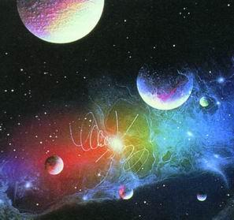
 <em>Khá yêu thích dòng nhạc này, tìm đọc và post entry về nó cho các bạn muốn tìm hiều, nếu có thêm thông tin gì, xin hãy comment bên dưới.</em>      <embed src="http://media.imeem.com/pl/V7oIPVIdiG/autoShuffle=true/" type="application/x-shockwave-flash" wmode="transparent" width="300" height="340" allowScriptAccess="none"> <strong>I. ĐÔI ĐIỀU VỀ DÒNG NHẠC NEW AGE</strong>    NewAge, hay còn được nói đến như "âm nhạc không gian", một thể loại nhạc được định nghĩa một cách mơ hồ - nói chung là có giai điệu du dương và thường có căn bản là khí nhạc. Việc định nghĩa, chia nhóm một vài album nhạc New Age có thể đem đến tranh cãi giữa những người hâm mộ, bởi vì ranh giới của dòng nhạc này không được phân định rõ ràng. Một phần nhờ vào việc xác nhận của chính các tác giả mang tư tưởng New Age, rất nhiều nghệ sĩ và ban nhạc đã tuyên bố rõ ràng : họ không thừa nhận nhạc của mình là nhạc New Age     Phần lớn âm nhạc đã được mô tả là nhạc New Age thường là nhạc điện tử hoặc khí nhạc, thường xuyên sử dụng những pad <strong>(1)</strong><strong>(2)</strong>. Những bản nhạc rất dài -có thể tới 20 phút hoặc hơn nữa- không phải là không phổ biến. Việc phân bố giọng hát và sử dụng nhạc cụ không phải điện tử thì ít phổ biến hơn ( trong rất nhiều trường hợp, nhưng bản mẫu phối sẵn chất lượng cao được sử dụng thay cho những nhạc cụ này ). Những bản thâu âm của những âm thanh tự nhiên cũng có thể được sử dụng để làm phần giới thiệu cho một bài hát hoặc cả đĩa nhạc.Những đặc điểm vừa kể cũng được áp dụng cho rất nhiều nhánh thuộc dòng nhạc Ambient <strong>(3)</strong>, và cũng không có ranh giới rõ ràng giữa nhạc Ambient và New Age.     <strong>II. ĐỊNH NGHĨA :</strong>    Có 3 nhóm thính giả chính của dòng nhạc New Age, với 3 quan điểm khác nhau về định nghĩa nhạc N.A. là gì và những nghệ sĩ nào được coi là nghệ sĩ thuộc dòng nhạc N.A.     <strong><em> 3 quan điểm như sau: </em></strong>    Quan điểm thứ nhất : New Age là một nhánh của nhạc điện tử, bao gồm những bài có gia điệu du dương và không phải nhạc nhảy (non-dance) với rất nhiều kiểu phân bố khác nhau (đối lập với kiểu nhạc dance tiêu biểu như techno và các nhánh của techno, hay các loại nhạc điện tử thể nghiệm như nhạc không giai điệu (non-melodic), nhạc ồn ào (noise music) hoăc một vài nhánh khác của ambient . Theo ý kiến này thì những nghệ sĩ như Michael Cretu''s Enigma, Enya, Loreena McKennitt, Jean-Michel Jarre, Kitaro, Popol Vuh, Klaus Schulze, Suzanne Ciani, Tangerine Dream, Vangelis và Yanni đều thuộc dòng nhạc New Age. Điều này dẫu sao cũng có chút vấn đề vì 2 lý do:   + Nghệ sĩ như Enya, Vangelis và Edgar Froese của Tangerine Dream - không thừa nhận nhạc của họ là nhạc New Age; một vài người trong số họ thì coi khái niệm New Age nhất thiết là phải có liên quan đến những quan điểm tôn giáo   + Thứ 2 là những nghệ sĩ như Tangerine Dream có phong cách không nhất quán, với nhiều album không thể coi là nhạc N.A. được ( Ví dụ như Vangelis có cả những tác phẩm nhạc collage<strong>(4) </strong>và nhạc điện tử thể nghiệm ). Và 1 điều nữa không rõ ràng là: liệu có công bằng hay không khi dán cho nghệ sĩ mác New Age như thế  liên tục và những đoạn nhạc làm sẵn bằng sequencer              Quan điểm thứ 2 : New Age là một thể loại thuộc dòng nhạc điện tử, và thường xuất hiện trong những CD nhạc Thiền (Mediation) và Nhạc Thư giãn (Relaxation) - những thứ thường được thấy trong những cửa hàng sách New Age <strong>(5)</strong> hoặc những quầy băng đĩa nhạc. Hầu hết nhạc loại này đều nhẹ nhàng, du dương và có thể coi là hơi đơn điệu. Những nghệ sĩ thuộc dòng này bao gồm : Anugama, Cusco, David Arkenstone, Gandalf, G.E.N.E., Karunesh, Kitaro, Software và Space. Sự chính xác của đinh nghĩa này vẫn còn đang là thắc mắc vì hầu như tất cả những nghệ sĩ kể trên ( cả nhóm 1) đều có những tác phẩm mang hơi hướm phong cách của những đĩa nhạc Thiền.     Quan điểm thứ 3 : nhạc New Age là nhạc điện tử du dương, êm ái và nhạc điệu khá đơn giản, với những đoạn pad dài, giai điệu nhẹ nhàng và thời lượng của một bài hát là thường dài. Định nghĩa này cũng chưa thật chính xác. Tuy nhiên rất nhiều nghệ tự coi mình chỉ chuyên biểu diễn loại nhạc kiểu này, nên nó được sử dụng rộng rãi. Theo như nó, một số album của Vangelis và Tangerine Dream có thể coi là nhạc New Age, nhưng nhiều nghệ sĩ khác không thể được gọi là New Age vì tác phẩm của họ rất đa dạng, nhiều thể loại. Tương tự , nhạc của Suzanne Ciani được coi là New Age, nhưng nhạc của Klaus Schulze và Enya thì có thể không phải New Age ; vì họ đều có những phong cách rất đặc trưng, khác với loại nhạc điện tử êm ái du dương thông thường    <strong>III. NHỮNG ẢNH HƯỞNG VÀ ĐỀ TÀI.    </strong>  <strong>   </strong><strong>1. Ảnh hưởng:</strong>    _ Những ảnh hưởng sớm nhất đến New-Age hiển nhiên là âm nhạc điện tử, classical music, với Brian Eno và Popol Vuh là những người tiên phong.   _ Tiếp sau là âm nhạc dân tộc, world music, prog-rock, điển hình là Kitaro, Klaus Schulze, Krautrock.  _ Một phần khác từ Terry Riley và Steve Reich, cũng được xem là 1 ảnh hưởng đối với New-Age. Họ cùng với Tony Conrad, La Monte Young sử dụng những giai điệu trầm thấp, đều ( từ những năm 1960). New-Age được nối tiếp tới những bài hát kinh cầu của Gregorian vào những năm nửa cuối TK20.    <strong>2.Đề tài:</strong>    _ Những đề tài đại chúng trong New-Age bao gồm: không gian và vũ trụ ; môi trường và thiên nhiên ; tính nhân bản của con người (chân-thiện-mĩ) ; sự hòa hợp của chính bản thân với thế giới ; kể về những giấc mơ hoặc những cuộc hành trình của tâm trí hay tinh thần. VD: những album của G.E.N.E tạo ra những âm thanh như mô tả âm nhạc, không gian của những hòn đảo ở Thái Bình Dương và Địa Trung Hải. Nhóm Software có những album thể hiện những khía cạnh của âm nhạc điện tử như: Chip Meditation, Electronic Universe.    <strong>3.Tiêu đề:</strong>    _ Tiêu đề của những bài hát trong New-Age thường nói về những khía cạnh của tâm linh. VD: Principles of Lust ( Enigma) ; Purple Dawn ( Anugama) ; Shepherd Moons ( Enya) ; Straight' a way to Orion (Kitaro) ; The Quiet seft ( Gregorian).      <strong>IV. PHÂN LOẠI:</strong>    NewAge có rất nhiều phân nhánh, có nhiều trang Web phân chia rất phức tạp. Nhưng tin tưởng nhất là allmusic.com với con số lên đến 7 phân nhánh:    - Techno-Tribal: Gabrielle Roth and the Mirrors, Michael Brook, Djam Karet   - Solo Instrumental: Alex de Grassi, John Boswell, Liz Story   - Progressive Electronic: Ryuichi Sakamoto, Patrick O'Hearn, Robert Rich & B. Lustmord   - Neo-Classical: Peter Michael Hamel, Mannheim Steamroller, Eric Tingstad & Nancy Rumbel   - Meditation: Aeoliah, Spotted Eagle, Solitudes   - Ethnic Fusion: Tri Atma, Jesse Cook, Peter Kater & Carlos Nakai   - Contemporary Instrumental: Kitaro, Liona Boyd.     Điều này có nghĩa là ko bắt buộc đối với 1 nghệ sĩ NewAge. Họ có thể chơi nhiều phong cách khác nhau, có thể trong 1 Album có bài này có bài theo phong cách khác. Ví như trường hợp Enya, thì cô chơi Celtic là chủ yếu, ngoài ra còn có Ethnic Fusion và thiệt là đặc biệt khi ko ngoại trừ cả 1 thể loại hoàn tòan khác với NewAge: Alternative Pop Rock. Thế nên nếu bạn chỉ mới nghe vài bài Pop nào đó của Enya mà bảo rằng cô hoàn toàn ko phải NewAge thì hoàn toàn sai lầm.     <em style="font-weight:bold; ">Xin giới thiệu 1 vài nghệ sĩ </em>:    Yanni (neo-classical, Progressive Electronic gọi là new age pop)   Suzanne Ciani (electronic - acoustic piano, Progressive Electronic)   Enya (Celtic ethereal. Secret Garden cũng được gọi là Celtic)   Kevin Kern (piano / solo & ensemble)      Yanni và Enya thì khá nổi tiếng, nhưng có thể Kevin Kern là 1 cái tên lạ. NewAge với ông ko gò bó ở thiên nhiên mà còn là tình yêu như Love's first smiile. Kevin Kern ông đều có Album tổng hợp Guitar cũng có Album Piano. Mà phần lớn là Piano. Chắc có lẽ ông bị mù bẩm sinh từ nhỏ nên âm nhạc của ông phần nhiều rất giống như bạn đang ở giữa khu rừng, nhưng bạn ko nhìn nó bằng mắt mà cảm nó bằng tiếng gió thổi qua tai, khi thì tung tăng nhảy múa rất nhẹ nhàng     Ngoài ra còn những nghệ sĩ sau : Narada Decade, David Lanz, Craig Chaquico, John Doan, Vangelis, Celtic Twilight, Patrick O'Hearn, Christopher Franke ...    <strong style="font-family:Times New Roman,Times,serif; ">V. KHÍA CẠNH NGHỆ THUẬT</strong>        -- Nghệ thuật (Art - số ít), theo tự điển Oxford, là sản phẩm của những cái gì đẹp, khéo hay khả năng để làm ra cái đẹp, cái khéo. Ví dụ : một phim nghệ thuật là sản phẩm được tạo ra dưới dạng thức chuyển tải nghệ thuật khác với phim ảnh thuần mang một mục đích giải trí.     -- Còn nghệ thuật (Arts - số nhiều), được định nghĩa là các bộ môn như ngôn ngữ, văn học, sử học... mà trong số đó cảm xúc dự một phần lớn, đối nghịch với khoa học nghiêng về sự chính xác và tính toán.     -- Cái khó là nhạc New Age đã được công nhận là sản phẩm của một môn nghệ thuật lại chưa có trong tự điển văn học nghệ thuật. Khi nói đến New Age, đa số các độc giả sẽ mường tượng đến một bộ môn Tân triết học cũng mang tên New Age liên quan đến những vấn đề siên nhiêu (super-natural) như về thiền quán, soi kiếp cứu rỗi (enlightenment), trị bịnh theo đức tin (faith healing) của các giáo phái (cult) và đồng bóng (medium, psychic)...     -- New Age, bộ môn âm nhạc mới còn quá trẻ và sự thưởng ngoạn được dùng cả thính giác lẫn thị giác, lại được mệnh danh là nhạc của kỷ nguyên mới, có nghĩa là chúng ta cảm thấy được màu sắc của âm thanh (the color of music), bộ môn này còn được tặng thêm một mỹ danh nữa là nhạc của thế kỷ hai mươi mốt.     -- So với nhạc cổ điển Tây phương thường được phân chia ra làm bốn chuyển động (movements) về giai điệu từ chậm đến nhanh, và đòi hỏi cả một giàn nhạc giao hưởng đại hòa tấu.     -- Nhạc New Age không đòi hỏi số lượng nhạc sĩ và nhạc khí, đôi khi chỉ cần vài ba nhạc sĩ, và họ thường hợp tấu theo ứng tác (improvisation), với tất cả nhạc cụ sẵn có, đông cũng như tây, cổ cũng như kim.     -- Nhạc cổ điển có đôi khi dùng nhạc khí để tạo các âm thanh cần thiết để yểm trợ opéra chẳng hạn, nhưng chưa bao giờ dùng đến kỹ thuật tạo âm thanh đặc biệt (special effects). Nhạc New Age, ngoài việc sử dụng các nhạc cụ thông thường, họ còn dùng cả bất cứ vật gì có thể tạo nên những âm thanh bất thường (special effects) để được đồng bộ (synchronization) với tiếng sóng tiếng gió gầm thét, tiếng chim kêu vượn hú, tiếng lửa bập bùng, tiếng binh khí chạm nhau, tiếng mưa rơi thác đổ... mà các nhạc khí bình thường không thể nào tạo nên được...     -- Nhạc cổ điển có chiều rộng (panoramic, grandeur). Nhạc New Age nhắm vào chiều sâu nhiều hơn (depth, insight), nó thẩm thấu, nó len vào tận các sớ của tâm hồn.     -- Người nhạc sĩ New Age khi viết về hòa âm họ thường chú trọng đến sự hòa điệu, ăn khớp với từng cử động của thiên nhiên, có lẽ vì thế, kỹ nghệ điện ảnh càng ngày càng mướn các nhạc sĩ New Age viết nhạc đệm cho phim ảnh của họ nhiều hơn, để thay thế cho nhạc đệm cổ điển.     -- Một bộ môn âm nhạc quá mới đến nỗi chưa có trong tự điển cũng là điều dễ hiểu , vì các nhà làm điện ảnh đều nhìn nhận nhạc New Age mới ra đời năm 1984, cùng một lúc với phim "Sargeant Pepper Lonely Heart's Band Club".     -- Lần thứ nhất, điện ảnh đã có công đua vào phim ảnh dòng nhạc gọi là bất qui tắc để hòa điệu với âm nhạc có cả người máy robot, với ban nhạc Rolling Stones, có cả "special effects" tiếng chuông nhà thờ hòa âm với nhạc đám tang với ban nhạc The Bee Gee chơi các bản nhạc của The Beatles "Nowhere Man", "The Long and Winding Road", "Strawberry Field Forever"...     -- Giới điện ảnh đã thấy rõ sự thành công huyền diệu trong loại nhạc mới nầy. Liên tiếp các phim nổi tiếng ăn khách khác được tung ra với số thâu vượt bực như các phim "Odyssey 2001","The Black Hole","Quest of Fire","Stars War", "Return of the Jedi","The Empire Strikes Back", "Back to the Future"... Chỉ cần đọc tên cuốn phim chúng ta cũng có thể hiểu ngay tại sao giới chuyên môn gọi đó là nhạc New Age.     -- Nhưng thành công sáng giá nhất cho nhạc New Age phải kể là phim "The Silk Road" (1 phim tài liệu dài sáu tiếng). Với phim này nổi bật lên một thiên tài nhạc New Age, Kitaro, mà tôi sẽ đi vào chi tiết sau. Với tài năng đó, đạo diển Oliver Stone đã mướn Kitaro viết hòa âm cho phim "Heaven and Earth", một phim về Việt Nam. Và với giai điêu hòanh tráng trong tiết tấu , vừa mãnh liệt vừa dịu dàng , nhạc phim trên đã mang về cho ông giải “Quả cầu vàng “.     -- Hơn tất cả mọi khía cạnh đã được đề cập, nhạc New Age có ưu điểm đưa tâm hồn vào đến cả những nẻo hiểm hóc sâu thẳm nhất của con người. Cảm xúc siêu nhiên đã trở thành những thôi thúc cấp bách của những tâm hồn nhạy cảm đã nhàm chán với những âm điệu đã trở nên tầm thường, vì đã bình dân hóa qua thời gian.     -- Ưu điểm cao hơn nữa, là với nhạc New Age, âm thanh được ướp tẩm màu sắc khiến sự rung cảm càng phong phú hơn, cộng thêm yếu tố ngũ hành kim mộc thủy hỏa thổ (five elements) tạo thành những tác động âm thanh kỳ thú, lạ tai, mới mẻ; có lẽ vì thế mà nhạc New Age rất thích hợp với loại vidéo nhạc cảnh như "Light of the Spirit" của Kitaro, "Private Music" của Patrick O'Hearn, "Moon's Shadow", "Shepherd's Moon", "Watermark" của Enja, "Dreams" của Akira Kurosawa...     -- Nhạc New Age, với khả năng phong phú, mỗi ngày một khám phá mới cùng với sự tiến bộ vượt bực trong ngành âm thanh điện tử. Những tên tuổi như Kitaro ở trời Ðông, Yanni ở trời Tây, cùng với Sojiro, Kuranesh, Enja, Lucia Hwong, Patrick O'Hearn, John Tesh và biết bao nhiêu thiên tài mới nữa sẽ cống hiến cho chúng ta những rung động tân kỳ trong sự cảm nhận màu sắc của âm thanh.          -- Cũng như máy VCR và High Definition TV được phát minh tại Mỹ nhưng hòan hảo và sản xuất hàng loạt trên đất Nhật và khắp địa cầu, nhạc New Age Xuất phát tại Mỹ lại được dân xứ Phù Tang làm nổi tiếng khắp thế giới nhờ một thiên tài âm nhạc : Kitaro.                                        <strong>Các ghi chú</strong>:  (1) Pad: trong âm nhạc điện tử, pad được định nghĩa là một âm sắc được thêm vào để làm mềm cái nền hoà âm trong bài nhạc   (2) Sequencer: thiết bị dùng để thâu, phát và chỉnh sửa nhạc MIDI   (3) Ambient : Một thể loại nhạc bao gồm rất nhiều thể loại, như : nhạc điện tử, jazz, new age, rock and roll, modern classic..v.v. . Với ý tưởng chung là thứ âm nhạc không hướng người nghe đến một trường phái hay một quan điểm âm nhạc nào cả. Đích đến của thứ âm nhạc này là người nghe hoà mình vào trong nó đến mức coi nó như một phần của môi trường xung quanh (ambient ).   (4) Collage: tác phẩm nghệ thuật sử dụng tổng hợp nhiều chất liệu, trong trường hợp này có thể hiểu là đa phong cách.   (5) New Age : ở đây được hiểu là văn hoá New Age chứ không phải nhạc New Age. Vì thực chất New Age là một trường phái nghệ thuật cuối thế kỉ 20 ở châu Âu - được đặc trưng bởi những tư tưởng độc lập trong việc khám phá thế giới tâm linh.  <strong>Nguồn</strong>: (tổng hợp)  * http://www.cyvee.com/Modules/Group/ViewSubject.aspx?gid=482&did=1860 * tapchiamnhac.net  * accvn.net  * kachiusa317 @ http://www.gsm.com.vn   </embed>

[ COMMENT: ]
* AUTHOR: Blood sucker _______
* DATE: 08/28/2008 09:08:28
Nhieu kien thuc qua, doc ko het lun. Lau lau wa blog anh nhin lai may tam hinh chup hoi do, thay vui vui.

--------

# TITLE: V/v Hợp đồng tình yêu
* DATE: 07/27/2008 08:14:43
* STATUS: publish
* BODY: 

<strong>Cộng Hoà Xã Hội Chủ Nghĩa Việt Nam </strong> <strong>Độc lập - Tự do - Hạnh phúc</strong>  <strong>HỢP ĐỒNG TÌNH YÊU</strong>
 
<strong>Ngày ... /......./2008 </strong> <strong>Tại .................................. </strong><strong></strong>
 
<strong> </strong>
 
<strong>Chúng tôi gồm:</strong>
 
 <strong>(sau đây được gọi là bên A)</strong> <strong>Anh :................................................ ..........................................</strong> <strong>Sinh ngày: .................................................. ..................................</strong> <strong>Địa chỉ: .................................................. .......................................</strong> <strong>Số điện thoại: .................................................. .............................</strong> <strong>HIện làm việc tại:............................................ .. ...........................</strong>  <strong>(sau đây được gọi là bên B)</strong>  <strong>Chị :................................................. .............................................</strong> <strong>Sinh ngày: .................................................. ..................................</strong> <strong>Địa chỉ: .................................................. .......................................</strong> <strong>Số điện thoại: .................................................. .............................</strong>
 
<strong>Hiện làm việc tại................................... .. ............................</strong><strong></strong>
 
<strong> </strong>
 
<strong>Chúng tôi đã bàn bạc và đi đến thống nhất ký hợp đồng với các điều khoản sau đây:</strong><strong></strong>
 
 
 
<strong>I-Nội dung hợp đồng</strong><strong>:</strong>  <strong>1-Hợp đồng này được ký kết với mục đích lớn nhất là các bên cần có một người để giới thiệu là người yêu trong một số trường hợp nhất định như: đi sinh nhật, đi chơi với bạn bè...Để khỏi mang tiếng là ế. </strong>  <strong>2-Khi hai bên muốn có một người để cùng uống cafe ,cần một người để nói chuyện phiếm cho đỡ buồn, cần một người để đi mua sắm,hoặc đơn giản là cần một tài xế .... </strong>  <strong>3-Khi một bên cần một người để xả xì trét lúc bực tức và khi cần một lời khuyên về các vấn đề trong cuộc sống (học hành thi cử, công việc xã hội, gia đình bạn bè...) </strong>  <strong>4-Chi phí cho những cuộc đi chơi do hai bên tự túc, tất nhiên phía bên B có quyền đồng ý nếu bên A muốn vinh hạnh được trả thay. </strong>  <strong><em>5-Trong mọi trường họp xảy ra tranh chấp hoặc cãi vã phần đúng luôn luôn thuộc về bên B, mọi hành động dù vô tình hay cố ý của hai bên dẫn đến hiểu lầm nghiêm trọng cho bạn bè người thân của phía đối tác đều phải đượcc làm rõ ràng để tránh gây ra hiệu quả nghiêm trọng cho các bên. </em></strong><em> </em> <strong>6-Thời gian kết thúc hợp đồng vào ngày...../...../.... hoặc khi 1 trong hai bên có người yêu thật.</strong>
 
<strong> </strong>
 
<strong>II-Quyền lợi và nghĩa vụ của mỗi bên</strong><strong>:</strong>  
 
Q<strong>uyền lợi và nghĩa vụ của hai bên trong hợp đồng này là cân bằng nên phần này được soạn chung cho cả hai bên. </strong>  <strong>1-Quyền lợi</strong><strong>: </strong>  <strong>- Các bên có quyền từ chối khi có việc bận hoặc đột xuất nhưng phải báo trước ít nhất là 2 tiếng đồng hồ để đối tác có phương án thay thế.</strong><strong></strong>
 
 <strong>- Có quyền yêu cầu đối tác cung cấp thông tin chi tiết chính xác rõ ràng và minh bạch về các buổi gặp gỡ, buổi hẹn ... để đi đến quyết định có đi hay không.</strong><strong></strong>
 
 <strong>- Có quyền đơn phương chấm dứt hợp đồng nếu tìm đc người yêu thật,hoặc đối tác vi phạm hợp đồng gây hậu quả đặc biệt nghiêm trọng.</strong><strong></strong>
 
 <strong>- Trong những trường hợp khẩn cấp có quyền yêu cầu bên kia có mặt ngay lập tức để giúp đỡ (đi học về hỏng xe, trời tối không ai về cùng...) </strong> <strong>- Trong trường hợp phải chi trả xiền mà không mang theo có thể yêu cầu bên kia chi trả.</strong><strong></strong>
 
 <strong>- Quyền từ chối trả lời các câu hỏi nhạy cảm hoặc mang tính riêng tư.</strong><strong></strong>
 
 <strong>- Có quyền về sớm trong khi gặp gỡ nếu có nhu cầu chính đáng.</strong><strong></strong>
 
 <strong>- Quyền yêu cầu quà tặng vào các dịp đặc biệt nều đối tác cố tình quên và cũng có quyền từ chối quà tặng nếu không muốn.</strong>  <strong>2-Nghĩa vụ:</strong><strong> </strong>  <strong>- Có nghĩa vụ bảo mật thông tin cho phía đối tác (số đt, địa chỉ...) để bảo đảm bí mật cá nhân.</strong>
 
 <strong>- Bên A có nghĩa vụ đưa bên B về nhà muộn nhất là 23h đêm và tốt nhất là trước 22h.</strong><strong></strong>
 
 <strong>- Không nhắn tin, nháy máy sau 23h 30" vì bất cứ lý do gì để bảo đảm cho sức khoẻ.</strong><strong></strong>
 
 <strong>- Có nghĩa vụ giúp đỡ nhau trong công tác để có một tương lai tươi sáng rạng ngời.</strong><strong></strong>
 
 
 
<strong>- Yêu cầu các bên không được ký nhiều hợp đồng tương tự với các đối tác khác để tránh nảy sinh mâu thuẫn</strong>.
 
<strong>III-Các điều khoản bổ sung</strong><strong>:</strong>  <strong>- Hợp đồng này có thể được điều chỉnh bổ sung khi có sự thống nhất của hai bên và được bổ sung bằng văn bản.</strong>
 
<strong>- Hợp đồng có hiệu lực kể từ ngày ký.</strong><strong></strong>
 
<strong>- Hợp đồng được chia làm ba bản có giá trị pháp lý như nhau mỗi bên giữ một bản và một bản đc giữ lai khi công chứng.</strong><strong></strong>
 
<strong>- Khi thanh lý hợp đồng mọi trách nhiệm của hai bên với đối tác kết thúc.</strong>
 
<strong></strong> 
 
<strong>P.S: </strong>

[ COMMENT: ]
* AUTHOR: Tuan Pham
* DATE: 07/27/2008 19:02:07
N뮠c󠄑iều khoản cho sự n㯧 cấp thᯨ người y뵠thật :)

[ COMMENT: ]
* AUTHOR: 
* DATE: 07/31/2008 01:20:20
Co ben B rau ne, tim ben A cho H di... Hop dong doc de thuong wa Z heng??

[ COMMENT: ]
* AUTHOR: 
* DATE: 07/31/2008 05:55:38
để L hỏi bạn b衴rong friend list cho H t�b뮠A nha ;D. L l᭠b뮠C cho l࡬uật sư kiếm tiền hoa hồng ^______^

[ COMMENT: ]
* AUTHOR: 
* DATE: 08/03/2008 05:56:02
hehe,cai nie hinh nhu copy tu ben cyvee ne..:P

--------

# TITLE: ...đâu chỉ yêu là đủ!
* DATE: 07/21/2008 04:24:14
* STATUS: publish
* BODY: 
“...Việc chia sẻ trong tình yêu phải bắt nguồn từ sự tự nguyện từ vật chất đến tinh thần. Khi yêu một người, bạn không thể chỉ biết người đó mà cần phải hiểu họ. Hiều để thông cảm và sẵn sàng giúp đỡ, phải xem khó khăn của người yêu như khó khăn của mình để dốc tâm gánh vác”      Trách nhiệm là khi họ khóc cùng, đau cùng họ. Muốn như thế, bạn phải mở rộng phạm vi yêu thương ra xung quannh người ấy.       Trách nhiệm còn là khi người yêu gặp khó khăn trong công việc, bạn làm giúp hoặc tìm hướng giải quyết thay vì chỉ ngồi thấm nước mắt cho nhau...<a style="font-family:Times New Roman,Times,serif; " href="http://blog.360.yahoo.com/blog-Ed3DNVslaaecz1WmrUMJoHlmDu8-?cq=1&p=418&n=28500">----> full content here</a>      
     
Nhận xét: bài này có ý hay nhưng chưa thấy rõ bản chất vấn đề lắm. Cho 6/10 điểm    

[ COMMENT: ]
* AUTHOR: 
* DATE: 07/21/2008 18:11:46
C󠴨뭠b᩠viết của Long nữa cộng lại sẽ l࠱0/10 hꮮ B᩠viết đ󠔠v��nh đọc được, n󠄑ưa ra những c㵠chuyện để n뵠l뮠vấn đề th��B᩠viết của Long mới "ch㮠tướng của vấn đề" hꮮ Cảm ơn Long hehe.

[ COMMENT: ]
* AUTHOR: 
* DATE: 07/23/2008 09:32:12
U nghi the nay hong biet co dung khong ... tinh yeu la ngoi nha am ap va em diu de moi ngay ban tim tro ve, duoc la chinh ban mot cach hon nhien, bo lai sau lung nhung moi met cua cuoc song hang ngay. Vi the hieu mot ai do la de yeu, cung nhu quan tam, chia se hay che cho hay ... van van ... la de yeu chu ko phai yeu roi thi la phai hieu va phai quan tam, ganh vac noi kho nhoc cua nhau ... Tinh yeu la cai gi do am ap, em diu, tu nhien den muc tien gan den su gian don ... chu hong phai tien den mot ganh nang ban bat buoc phai ganh tren vai! U suy nghi ve tinh yeu o goc do yeu la don gian chi vi yeu, va cung nhau vuot kho cung chi don gian vi yeu, moi thu phai that su tu trai tim, dam me va tu nhien chu ko phai yeu mot cai roi phai the nay the kia, vay thi yeu chi co ma nhuc dau vi su doi hoi se lam tinh yeu moi ngay them phuc tap ... U so cai gi qua phuc tap, mac du biet la ban than minh hoi bi phuc tap, hi hi ... mong rang muoi ko suy nghi nguoc ngao phai ko huynh nhi, hinh nhu muoi thich su gian don!

--------

# TITLE: ..... ain't gonna look the other way
* DATE: 07/19/2008 19:59:20
* STATUS: publish
* BODY: 

 

 
This song is the main entrance (the intro page) to the Celine DION fansite of the years 2004-2005. Love this song so much and asked for a mp3 copy version of it then enjoyed day to night... 
 
Chorus:  I ain't gonna look the other way  No no  After all the clouds go by, its just another empty sky  I aint gonna wait to see the rain  No no  Nothin's gonna make it right, look at me 'cause I choose life
 
<embed src="http://www.youtube.com/v/-YteTcAf3jg&hl=en&fs=1" width="425" height="344" type="application/x-shockwave-flash" allowScriptAccess="none"></embed>
 
When all the lights go out so suddenly, I lose my way  Baby tell me  Is something going on  You gotta free me, this time I'm gonna be strong
 
For the full lyrics --> <a href="http://www.sing365.com/music/lyric.nsf/Ain't-Gonna-Look-The-Other-Way-lyrics-Celine-Dion/8DB104CE3495272E48256EB5000686D0">Click here</a>

--------

# TITLE: Sống là không chờ đợi...
* DATE: 07/16/2008 21:42:31
* STATUS: publish
* BODY: 

 
Có mất gì đâu, thử đọc xem nào và hãy cố  gắng đọc đến cuối nhé! Bài văn này ngắn lắm... đọc mất vài ba phút thôi nhưng rất hữu ích và đây là mẩu chuyện có thật.
 
Bạn tôi mở ngăn tủ của vợ và lấy ra một gói nhỏ được gói kỹ càng trong lớp giấy lụa. Anh bảo: Đây không phải là một gói đồ bình thường, đây là một chiếc áo lót thật đẹp... Anh vứt lớp giấy bọc và lấy ra chiếc áo lót mịn màng, rồi nói: Tôi mua chiếc áo này tặng cô ấy vào lần đầu tiên chúng tôi sang New York , cách đây 8-9 năm nhưng cô ấy chưa bao giờ mặc! Cô ấy muốn dành cho một dịp nào đặc biệt, vậy thì hôm nay tôi nghĩ là dịp đặc biệt nhất rồi... Anh đến cạnh giường và đặt chiếc áo ấy cạnh những món đồ mà tí nữa đây sẽ được bỏ vào áo quan. Vợ anh vừa mới qua đời... Quay sang tôi, anh bảo: "<strong>Đừng bao giờ giữ lại một cái gì để chờ dịp đặc biệt cả... Mỗi ngày sống là một dịp đặc biệt rồi...</strong>". 
 
Tôi suy đi nghĩ lại câu nói này và nó đã làm thay đổi cuộc đời tôi...Bây giờ tôi đọc sách nhiều hơn trước và bớt thời gian dọn dẹp nhà cửa. Tôi ngồi trước mái hiên mà ngắm cảnh chứ không buồn để ý đến cỏ dại mọc trong vườn... Tôi dành nhiều thời gian cho gia đình và bạn hữu hơn là cho công việc. Tôi hiểu rằng cuộc đời là những cảm nghiệm mà mình phải nếm... Từ ngày ấy tôi không còn cất giữ một cái gì nữa... tôi đem bộ ly pha lê ra sử dụng mỗi ngày, tôi mặc đồ mới để đi siêu thị hay bất cứ nơi nào khi tôi cảm thấy thích... Tôi không còn dành nước hoa hảo hạng cho những dịp đại tiệc, tôi xức bất kỳ khi nào tôi muốn... <strong>Những cụm từ như "một ngày gần đây" hay "hôm nào" đang bị loại khỏi vốn từ vựng của tôi</strong>. Điều gì đáng bỏ công thì tôi muốn xem, muốn nghe, muốn làm ngay bây giờ. Tôi không biết chắc là vợ của bạn tôi sẽ làm gì nếu cô ấy biết trước rằng mai đây mình không còn sống nữa (một ngày mai mà tất cả chúng ta xem thường). Tôi nghĩ rằng cô ấy hẳn sẽ mời mọi người trong gia đình, mời bạn bè thân thích đến nhà chơi... có thể cô sẽ gọi điện thoại cho vài người bạn cũ và làm hoà hay xin lỗi về những chuyện bất hoà trước đây... Tôi đoán rằng cô ấy sẽ đi ăn các món Tàu (vì cô ấy rất thích thức ăn Tàu). Chính những chuyện vặt vãnh mà tôi chưa làm khiến cho tôi áy náy nếu tôi biết rằng thì giờ tôi còn rất có hạn. Tôi sẽ rất áy náy vì tôi không đi thăm một vài người bạn mình cần phải gặp mà cứ hẹn lần hồi, áy náy vì thường không nói với những người thân của mình rằng mình yêu thương họ... áy náy vì mình chưa viết những lá thư mà mình dự định "hôm nào" sẽ viết. Giờ đây, tôi không chần chờ gì mà không hẹn lại và không giữ điều gì có thể đem lại niềm vui và nụ cười cho cuộc sống chúng tôi. Tôi tự nhủ rằng <strong>mỗi ngày là một dịp đặc biệt</strong>. Mỗi ngày, mỗi giờ, mỗi phút... đều đặc biệt cả. Nếu bạn đọc được bản văn này ấy là vì một ai đó muốn điều hay cho bạn, và vì bạn cũng có quanh mình những người bạn quý yêu. Nếu bạn quá bận đến độ bạn không thể dành ra vài phút để copy và gởi bản văn này đến cho ai khác, rồi tự nhủ "mai mốt tôi sẽ gửi" thì mai mốt đó có thể là một ngày thật xa hoặc là bạn sẽ không bao giờ gửi được...
 
Lucky & Success & Happiness

[ COMMENT: ]
* AUTHOR: 
* DATE: 07/16/2008 22:48:30
Cuoc song la ko cho doi huynh nhi! ... trai tim ko can ly le, h习sống mỗi ngṠvới tr⩠tim đong đầy y뵠thương, cảm nhận vࡣhᯠđ󮠮hững "m󮠱uࢠcủa cuộc sống từng ph򴠧i㹠... để mỗi ngṠtr��ua l࡭ột trang s⤨ nhiều ��hĩa ... vậy n뮠quᡫhứ ,hiện tại vࡴương lai phải thi đua nhau, ngṠh��ay rồi cũng sẽ thᯨ quᡫhứ, vࡴrang nᯠsẽ hay hơn trang nᯠđ㹠nhỉ, gi⭠khảo cuộc thi sẽ lࡴ� yeu cuoc song, vࡰhần thuởng sẻ l࡭ột đời người, gian don nhung tron ven! Co len! 
  

[ COMMENT: ]
* AUTHOR: 
* DATE: 07/17/2008 00:01:49
một comment với nhiều suy nghĩ hay đ󠕬 keep it posted ;) !

[ COMMENT: ]
* AUTHOR: 
* DATE: 07/17/2008 08:07:05
cau chuyen hay we, cho e copy ve nha....e cung khong bao gio cho doi ne :P

[ COMMENT: ]
* AUTHOR: 
* DATE: 07/18/2008 02:14:43
E hem, good story. L cung khong ban den noi khong doc duoc bai nay nhi. Sorry heng for not answering sms. Good day nhe!

[ COMMENT: ]
* AUTHOR: 
* DATE: 07/21/2008 00:42:31
C㵠chuỵện nṠbữa trước L gửi (powerpoint) phải ko? X򣠄ҡۙng lắm! NgṠh��ua đ㡬ࡱuᡫhứ, ngṠh��ay lࡨiện tại, ngṠmai lࡴương lai. H习sống cho hiện tại vࡴương lai nhưng thật kh󠄑ể quyết định. Chậc! Cuộc sống cứ thế lặng lẽ tr��từng ngṬ từng ngṠcứ như tiếng lạch cạch của c㹠kim đồng hồ vậy! Lắm l򣠨ối tiếc về quᡫhứ đ㡸a, nhưng tiếc th졣󠄑ược g쿿? 
@Luyến: eh l᭠g졭ࡳms ghꡮha!

--------

# TITLE: ...happy and greatful day
* DATE: 07/07/2008 17:32:30
* STATUS: publish
* BODY: 

...tối qua về, điện thoại hết pin, mà mệt quá nên ngủ quên luôn không xạc cái cellphone
 
...sáng 6h dậy manage to charge nó và nhận được 2 sms ngắn gọn thôi, gói gọn trong 160 ký tự, nhưng chứa đầy niềm vui. Có tin sms lúc 0h03, có cái lúc 5h44!
 
...sáng ghé blog, một vài comment greeting. 
 
...sáng nay 1 ngày nhẹ nhàng, nắng nhẹ, ấm áp.
 
<strong>THANKS các bạn nhiều lắm!</strong>
 

[ COMMENT: ]
* AUTHOR: 
* DATE: 07/07/2008 18:50:39
Hi` ko biet hom nay la sinh nhat ban Long do'. Chu'c ban Long sinh nhat vui ve, them 1 tuoi nhieu hanh phu'c va` thanh cong va` som ti`m duoc "soul mate" cua mi`nh he'n. :)

[ COMMENT: ]
* AUTHOR: 
* DATE: 07/07/2008 18:51:22
sinh nhat vui ve ma`y!!! (ngan gon thoi, ko co da`i do`ng nhu nguoi tre^n haha)

[ COMMENT: ]
* AUTHOR: 
* DATE: 07/07/2008 18:53:54
Ngay nhe nhang chi can co nhu the thoi Z hen! Gop them cho Z 1 chut niem vui nua ne! Chuc Z 1 ngay lam viec that vui va nhan dc nhieu niem vui hon nua tu ban be nghen!

[ COMMENT: ]
* AUTHOR: 
* DATE: 07/08/2008 00:12:00
happy birthday anh Long! Ngoan ngoản, học tốt, l᭠việc tốt, xứng đ⯧ lࡣhᵠngoan B⣠Hồ nha anh

[ COMMENT: ]
* AUTHOR: 
* DATE: 07/08/2008 00:26:15
kiu a ben skype de say happy ma hong thay dau, thoi de lai dau tich o day vay,hihi. sinh nhat vui ve nha a

[ COMMENT: ]
* AUTHOR: 
* DATE: 07/13/2008 01:11:55
hi' rat vui duoc lam wen voi a......

[ COMMENT: ]
* AUTHOR: INVIBLESI
* DATE: 07/19/2008 17:51:42
ồ, h󡠺a lࡄҡڱng ấy 6h dậy ࠺)), thế c󠮪n mꤨ ai đ󠫯 nhỉ cho s⯧ sớm khỏi ăn cơm =))

--------

# TITLE: [great song] I Believe in you - Celine DION & Il divo
* DATE: 07/06/2008 18:20:48
* STATUS: publish
* BODY: 

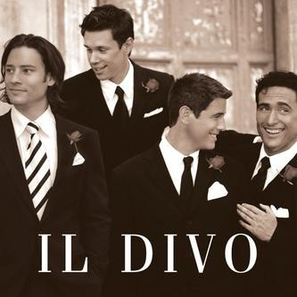
 
<strong>1. Discography</strong>: bài "<em><a href="http://www.youtube.com/watch?v=wAdyhvZordE&feature=related"><em>I Believe in You</em></a></em>" của nhóm ca <a href="http://en.wikipedia.org/wiki/Il_Divo">Il Divo</a>---nhóm nhạc từng cùng với Tony thực hiện bài hát hoàn tráng, vừa nhẹ nhàng vừa mạnh liệt <a href="http://www.youtube.com/watch?v=aVzkjXffAuU&feature=related">The Time Of Our Lives </a>cho mùa bóng World Cup 2006---lần này cùng hát Duet với nữ Ca sĩ Celine DION làm cho bài hát hay càng hay hơn.
 
<strong>2. Listen: voice and rhythm</strong>: 
 
  <embed src="http://www.youtube.com/v/0Q_pjkuX7lA&hl=en&fs=1&rel=0&color1=0x234900&color2=0x4e9e00&border=1" type="application/x-shockwave-flash" width="425" height="349" allowScriptAccess="none"></embed>
 
<strong>3. Lyrics (English in blue, francais en rouge)</strong> 
 
Lonely the path you have chosen A restless road, no turning back One day you will find your light again Don't you know Don't let go be strong  Follow your heart Let your love lead through the darkness Back to a place you once knew I believe I believe I believe in you Follow your dreams Be yourself an angel of kindness There's nothing that you cannot do I believe I believe I believe in you  Tout seul Tu t'en iras tout seul Cœur ouvert A l'univers Poursuis ta quête Sans regarder derrière N'attends pas Que le jour Se lève  Suis ton étoile Va jusqu'où ton rêve t'emporte Un jour tu le toucheras Si tu croix, si tu croix, si tu croix En toi  Suis ta lumière N'éteins pas la flamme que tu portes Au fond de toi souviens-toi Que je croix, que je croix, que je croix En toi  Someday I'll find you Someday you'll find me too And when I hold you close I know that it's true  Follow your heart Let your love lead through the darkness Back to a place you once knew I believe I believe I believe in you Follow your dreams Be yourself an angel of kindness There's nothing that you cannot do I believe I believe I believe in you

--------

# TITLE: [Music] In My Arms - Kylie Minogue
* DATE: 07/04/2008 17:33:51
* STATUS: publish
* BODY: 

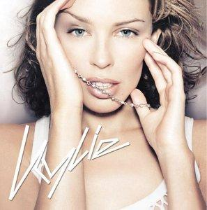
 
<embed src="http://www.youtube.com/v/RE8EAqneUbM&hl=en&fs=1&rel=0&color1=0x234900&color2=0x4e9e00&border=1" width="425" height="349" type="application/x-shockwave-flash" allowScriptAccess="none"></embed>
 
<embed align="middle" src="http://www.metrolyrics.com/scroller/scroller.swf?lyricid=2147448018&border=2&bordert=80&bgfont=0xC0C0C0&bg=http://www.metrolyrics.com/scroller/bgpic/bluedisco.jpg&filter=0x000000&filtert=25&txt=0xFFFFFF&fontname=arial&fontsize=11&speed=2.2" width="425" height="210" type="application/x-shockwave-flash" bgcolor="#006666" allowScriptAccess="none">
 
ask: "...trong vòng tay anh, em có cảm nhận được không, nói anh nghe những điều em cảm thấy..."
 
ans: "...got a feeling this is something strong. All I wanna do is move on.  No more wondering where I belong. So never go away..."
</embed>

--------

# TITLE: ...Sailing [music]
* DATE: 06/27/2008 19:54:29
* STATUS: publish
* BODY: 

   <embed src="http://media.imeem.com/m/SPx7o5wnRN/aus=false/" type="application/x-shockwave-flash" width="300" height="110" wmode="transparent" allowScriptAccess="none"></embed><a href="http://www.imeem.com/people/kqdyHN/music/cNXML0DQ/sailing_rod_stewardmp3/">Sailing - Rod Steward.mp3 - </a>
 
I am sailing, I am sailing,  home again 'cross the sea.  I am sailing, stormy waters,  to be near you, to be free.
 
I am flying, I am flying,  like a bird 'cross the sky.  I am flying, passing high clouds,  to be with you, to be free.
 
Can you hear me, can you hear me  thro' the dark night, far away,  I am dying, forever crying,  to be with you, who can say.
 
Can you hear me, can you hear me,  thro' the dark night far away.  I am dying, forever crying,  to be with you, who can say.
 
We are sailing, we are sailing,  home again 'cross the sea.  We are sailing stormy waters,  to be near you, to be free.
 
Oh Lord, to be near you, to be free.  Oh Lord, to be near you, to be free,  Oh Lord.

[ COMMENT: ]
* AUTHOR: 
* DATE: 06/30/2008 21:50:34
... nghe bai nay ban se thay minh tho cung nhip voi tieng tho cua dai duong ...

[ COMMENT: ]
* AUTHOR: 
* DATE: 07/04/2008 17:48:39
b᩠nṠ㭠điệu hay, nghe như đang đang ở tr뮠1 con tᵠlướt s󮧮..

--------

# TITLE: Relax, music (Entry for June 25, 2008)
* DATE: 06/25/2008 06:36:18
* STATUS: publish
* BODY: 
<strong>FUNNY ANIMATION PIC</strong>    
   
Sometime, Google would be `potay` for hard question that there is no entry to answer<strong>   AN OLD MUSIC (no comment)</strong>    
 <embed height="110" type="application/x-shockwave-flash" width="300" src="http://media.imeem.com/m/wKG0fgxije/aus=false/" wmode="transparent" allowScriptAccess="none">
 
Trái đất cứ lặng lẽ quay.....  Đôi ta cứ lặng lẽ yêu ......  Hứa yêu nhau đến muôn đời sau  Hứa yêu nhau có trăng và sao
 
Trái đất cứ lặng lẽ quay......  Đôi ta cứ lặng lẽ xa.......  Xa nhau không phải không hợp nhau  Xa nhau vì bao lỗi lầm  Yêu em không ?
 
Anh yêu em, yêu anh không ?
 
Thật em yêu anh.  Lời nói đó vẫn in sâu vào tâm trí của anh.
 
Một vòng trái đất, em ngồi đây.......  Anh ngồi đây...........
 
Bên cạnh nhau ngỡ như thật xa  Không dám nhìn, không nói gì  Dường như chúng ta chưa từng quen
 
Một vòng trái đất.......  Em ngồi đây.......
 
Em lặng đi, anh ngồi đây ngước mắt nhìn theo  Không dám gọi tên, nước mắt rơi từ khóe mắt sâu vào tim...........
 
<em>Một vòng trái đất.  Người ta thường nói có người đã đi một vòng lớn.  Cuối cùng cũng gặp lại nhau  Chỉ đáng tiếc là khi gặp lại nhau.  Giữa hai người dường như có một khoảng cách rất lớn.  Đến nỗi không biết phải làm sao để lấp lại khoảng cách đó.</em>
 
<em>Một vòng trái đất.  Đến cuối cùng hai người đều có hai cuộc sống riêng.  Hai thế giới riêng.  Mà trong hai thế giới đó.  Đều đã không còn hình bóng của đối phương.  Vậy thì theo các bạn, số phận đã đưa hai người đó đi một vòng lớn.  Rồi lại gặp nhau để làm gì ?</em>
 
 <strong>FUNNY LETTERs</strong>   <strong><em>Mẫu 1 : Con trai Xì Gòn viết thư tỏ tình </em></strong>  Thành phố Mặt Trời - Ngày buồn, tháng nhớ, năm cô đơn, thế kỷ sầu...
 
Em thương mến!   Hôm nay trời thật đẹp, mây đen kéo đến mây trắng bay đi. Anh ngồi co cẳng viết cho em yêu của mình bức thư tình hay nhất thế kỉ 22. Đầu thư, anh chúc em nhiều calo để em mạnh khoẻ. Em à! Chỉ mới gặp em thôi mà anh ngỡ như đã quen nhau từ kiếp trước. 
 
Xa em vài giây thôi mà ngỡ đã bao năm. Em ơi ,ánh mắt em làm cả miền Nam chìm trong băng giá. Em cất tiếng cười làm cả miền Bắc ngủ quên còn khi những giọt lệ em rơi làm 7 tỉnh miền Trung chìm trong lũ lụt... Ôi thôi! Quái vật!.... 
 
Em à, em đến với anh trong ngày đông băng giá. Em sưởi ấm con tim anh tựa lò vi sóng nướng con mực khô. Mỗi khi anh khát, em là vại bia hơi dịu đi cái khát khủng khiếp của mùa hè.... Ôi em tôi là vô địch...   Thôi, thư đã dài dù chỉ là một chút trái tim anh. Em thấy không? Nếu em yêu anh thì anh nguyện dâng trái tim mình đem nấu cháo cho em bồi bổ. Hàng VN chất lượng cao đó em...  Yêu em nhiều...     <strong><em>Mẫu 2 : Con trai Hà Lội viết thư tỏ tình</em></strong>   Gửi người con gái anh yêu!   Hà nội một ngày buồn như con chuồn chuồn, tháng chán như con cá rán, năm đen như con mèo hen.   Em yêu dấu, người em như cái đấu, tóc em xù như lông gấu, tuy em hơi cá sấu nhưng anh vẫn yêu em nung nấu. Ðêm nay ngồi sửa xe mãi mà chẳng được,ngủ thì chẳng xong, nhìn trăng cao tít mít, anh quyết ngồi cong đít viết thư cho em, không gian bốn bề im ắng chỉ có tiếng ếch kêu và âm thanh như tiếng đàn violon du dương nhẹ nhàng của đàn muỗi đang vây quanh anh.   Em có biết rằng anh nhớ em nhiều lắm không? Anh ăn không ngon nhưng ngủ như điên, anh đi giầy quên đi tất, ăn sáng quên đánh răng, anh dùng xăng vo gạo, anh khờ khạo cũng chỉ vì yêu em đó.   Khổ thân anh khi chúng bạn toàn là những đứa không có nhà phải ở trong biệt thự, không có xe đạp mà phải ngồi lăncuđơ, không có tiền mà phải xài card.   Anh thì cái gì cũng có chỉ không có mỗi tiền. Anh xin tình nguyện dâng hiến cho em tấm thân trong trắng như tờ giấy than của anh cho em. Tấm thân của anh tuy đang mang trong người hai dòng máu nhưng vẫn còn là hàng xài được một số thứ. Anh chỉ muốn những gì của em là của anh và những gì của anh là của riêng, của nhầm là của chung. Em có biết rằng anh yêu em từ khi anh thấy em lon ton như con chó con cùng mấy đứa bạn cùng là lũ quỷ cái đánh 1 thằng bạn nhỏ xíu. Anh sẽ làm tất cả để cho em vui. Ranh ngôn có câu : "Không có việc gì khó, chỉ sợ tiền không nhiều, đào cống và lấp bể, cố làm cũng thành không".   Em đừng buồn vì những lời bạn anh nói nhé, nó nói em :" Nhìn xa cứ tưởng con người, nhìn gần mới biết đười ươi xổng chuồng". Anh đau lắm nhưng không sao, bôi cao sẽ khỏi, không khỏi ăn tỏi sẽ hết, không hết cho chết là vừa.   Về nhà anh không nuốt trôi cơm cố gắng lắm mới chỉ có 6 bát phở. Một lần và mãi mãi anh muốn nói với em rằng anh yêu em như que kem mút dở, như dưa bở với đường, như lọ tương ngâm cà pháo, như con báo với cánh rừng, như muối vừng với lạc, như lão Hạc với con chó vàng ...   Thôi mệt quá rồi anh đành phanh bút ở đây. Chào em và yêu em nhiều, chúc em gặp nhiều ác mộng, anh sẽ hiện ra để cùng em chạy trốn.   Hôn em như cún con hôn mèo con!   ---> nguồn: POTAY.COM.NET.ORG.VNN.VN !
</embed>

[ COMMENT: ]
* AUTHOR: 
* DATE: 06/25/2008 08:51:57
U thich bai nhac nay qua! he he ... Mr. Long viet thu nay cho em yeu cua huynh duoc do, rat hoanh trang ... bao dam nhan duoc ket qua bat ngo lun!

[ COMMENT: ]
* AUTHOR: 
* DATE: 06/25/2008 08:53:08
A nice one.Happy day nhe. Con bai nhac nao hay hay bo len cho nghe ke voi ne!

[ COMMENT: ]
* AUTHOR: 
* DATE: 06/26/2008 18:45:05
Long ơi, viết thư t� kiểu nṠc󠭠 ... đ㡫o được người iu r񩠭ࡣ򮠢ị u��đ󠮨顠C��nhận lࡄҡۍc mắc cười thật nhưng n󩠭ột c⤨ trung thực rằng bức thư tỏ t� của con trai Hࡎội th㭠th򹠨ơn nhiều phải ko L! Hihi... nice day. 

--------

# TITLE: Những giấc mơ hồng - High School Musical của VN
* DATE: 06/25/2008 03:01:52
* STATUS: publish
* BODY: 

 
<em>Lấy bối cảnh học đường, đề tài ca nhạc bộ phim truyền hình Những giấc mơ hồng được ví như một phiên bản VN của loạt phim nổi tiếng High School Musical. Phim đã có buổi chiếu ra mắt vào ngày 23-6 trước khi lên sóng vào ngày 29-6 tới trên kênh VTV9 (lúc 9 giờ 35).</em>
 
Những giấc mơ hồng là tác phẩm đầu tay của Quốc Thịnh - diễn viên thế thân (cascadeur) nổi tiếng trên màn ảnh VN và Hãng phim Lạc Việt. Thông qua câu chuyện của bốn nhân vật chính: Đình Phong, Mỹ Kim, Ánh Nhật và Thảo My - những ca sĩ tương lai của Trường Đào tạo ca sĩ Ngôi sao Phương Đông, bộ phim chuyển đến các bạn trẻ thông điệp: Con đường nào dẫn đến vinh quang cũng phải trải qua nhiều gian khổ, mọi âm mưu thủ đoạn để mưu cầu danh lợi sẽ phải thất bại.
 
Những giấc mơ hồng tập hợp một dàn diễn viên tuổi teen như: Mỹ Kim, Ánh Nhật, Thảo My (ngoài đời cũng là ca sĩ, người mẫu) bên cạnh nam ca sĩ Đăng Khôi vào vai nam chính: Đình Phong và các diễn viên hài Minh Béo, Hoàng Mập, Thanh Tùng, Hoàng Lan... Vì là sản phẩm đầu tay của đạo diễn lẫn hãng phim nên không thể đòi hỏi gì nhiều ở Những giấc mơ hồng, tuy nhiên đây vẫn là một sự cố gắng của các nhà làm phim VN và bộ phim cũng là món quà dễ thương dành cho tuổi học trò vào hè này. (theo NLĐ)
 
<strong>Chờ đợi gì từ bộ phim?</strong>
 
Những bài nhạc hay, những phong cách nhảy Việt Nam. Nào hãy cùng đón xem và bình luận.
 
Hẹn <em>9 giờ 35 ngày CN 29-6 tới trên kênh VTV9 (lúc )</em>

--------

# TITLE: ...phía cuối con đường
* DATE: 06/16/2008 09:00:29
* STATUS: publish
* BODY: 

<embed src="http://media.imeem.com/m/i4Shn-VRTH" width="300" height="110" type="application/x-shockwave-flash" wmode="transparent" allowScriptAccess="none"></embed>
 
<a target="_blank" style="cursor:default; text-decoration:none; " href="http://mp3.zing.vn/">Con đường dài, lá rụng đầy. Bỗng một ngày gió đến thì thầm, gọi chiếc lá cuối đông thức cơn ngủ say. Em ngại ngùng giấu nắng vào lòng. Đêm dù dài cũng sẽ phai, và hãy rộng lòng đón yêu thương đang chờ em tới!   Yêu! Là cùng nhau chia đôi nỗi buồn, là cùng chung vui phút giây hạnh phúc. Dắt nhau đi trên ngày xanh...</a>Yêu! Là cùng chung bước trên con đường, cùng nắm tay nhau thật chặt. Để luôn nhớ rằng, bước thật chậm, để biết yêu em nhiều hơn!   Xin đi cùng chung tới cuối con đường để chiếc lá không tàn phai. Xin cho tình yêu luôn trong xanh chẳng nhạt phai theo năm tháng! 
 
Yêu! Là cùng nhau chia đôi nỗi buồn, là cùng chung vui phút giây hạnh phúc. Dắt nhau đi trên ngày xanh... Yêu! Là cùng chung bước trên con đường, cùng nắm tay nhau thật chặt. Để luôn nhớ rằng, bước thật chậm, để biết yêu em nhiều hơn.

[ COMMENT: ]
* AUTHOR: An Nhiên
* DATE: 06/16/2008 18:46:37
"Y뵠- lࡣ񮧠chung bước tr뮠con đường, c񮧠nắm tay nhau thật chặt, để lu��hớ rằng, bước thật chậm, để biết y뵠em nhiều hơn!" 
Em th c㵠nṠnhất!

[ COMMENT: ]
* AUTHOR: 
* DATE: 06/16/2008 18:48:01
B᩠nṠnghe cũng tạm tạm. C󠶡ڻ như lời của b᩠nṠcũng giống với một số b᩠phải kh��L? Giai điệu th졮hẹ nhᯧ dễ nghe. In general, nghe được. Tiếp tục post nhạc cho bạn b衴hưởng thức nhᡌ!

--------

# TITLE: Một ngày tiễn đưa, một ngày của sự biết ơn
* DATE: 06/15/2008 17:34:50
* STATUS: publish
* BODY: 

 
Nhắc đến nguyên Thủ tướng Võ Vặn Kiệt, nhân dân Việt Nam và thế giới nhớ đến một con người đầy nhiệt huyết với sự nghiệp giải phóng dân tộc, thống nhất Tổ quốc và đổi mới đất nước. Hơn 70 năm tham gia Cách mạng, ông đã để lại dấu ấn không thể mai mờ trong lòng nhân dân Việt Nam về một tinh thần tiên phong với tư tưởng đổi mới, hành động đổi mới và công lao đưa đất nước tiến lên theo con đường đổi mới, phát triển và hội nhập. Ông là một nhà lãnh đạo kiệt xuất của thế kỷ XX.
 
<strong>Dấu ấn Võ Văn Kiệt</strong>
 
Có thể nói, trên chặng đường đổi mới của đất nước, dấu ấn, công lao của Nguyên Thủ tướng Võ Văn Kiệt khá rõ nét. Ông từng đưa ra quan điểm: “Đổi mới không phải là xóa bỏ hoàn toàn cái cũ  <table align="right"> <tbody> <tr> <td></td></tr> <tr> <td> 
Nguyên Thủ tướng Võ Văn Kiệt và các sinh viên  trường Đại học Quốc gia Hà Nội. Ảnh tư liệu
</td></tr></tbody></table>hay từ bỏ chủ nghĩa xã hội mà là nhận thức lại một cách đúng đắn hơn về một chủ nghĩa xã hội nhân bản, hoàn thiện, với lý tưởng phục vụ con người, vì con người...” Với tầm nhìn sâu rộng và trí tuệ sắc sảo, Thủ tướng đã biết tập hợp, khai thác trí tuệ của các chuyên gia, của tập thể trong nhiều lĩnh vực, biết phân biệt đúng sai, phải trái trong muôn vàn ý kiến khác nhau đó để cuối cùng trở thành chủ trương đúng đắn của mình. Có chủ trương rồi, Thủ tướng đã thể hiện lòng dũng cảm, bản lĩnh cao cường để thực hiện cho bằng được chủ trương đó, đặc biệt là khi nó được đưa ra trong bối cảnh còn có những ý kiến trái ngược nhau. Và cuối cùng, tất cả những nỗ lực của Thủ tướng đã được thể hiện bằng hiệu quả của việc làm, đưa lại lợi ích cho dân, cho nước. Ông từng nói: “Nhìn ra thế giới, càng nghiệm thấy rằng tài nguyên lớn nhất cho mọi quốc gia chính là tài nguyên con người. Nếu quy tụ được sức người, thì nhiều nguồn lực khác cũng có thể được quy tụ. Con người mà không quy tụ, thì mọi nguồn lực khác cũng rơi rụng. Trong thế giới ngày nay, nguồn lực hàng đầu là trí thức. Trong cuộc đua tranh để phát triển, không thể chỉ dựa vào nhiệt tình và ý chí, mà phải dựa vào kiến thức, học vấn, sự nhận thức các quy luật của thiên nhiên và của xã hội. Theo kinh nghiệm lịch sử của thế giới và bản thân nước ta, nhất là qua những kinh nghiệm của Bác Hồ, thấy rằng, trí thức tận tụy hay không là tùy thuộc vào chúng ta có tin dùng trí thức hay không, có giao cho họ đảm nhiệm những trọng trách mà họ xứng đáng được đảm nhiệm hay không. Điều đó không tùy thuộc vào bản thân trí thức, mà vào lãnh đạo có đủ khả năng thu phục nhân tâm và nhân tài hay không”.  

 
Cố GS.VS Nguyễn Văn Đạo - Chủ tịch Hội đồng Khoa học & Đào tạo Đại học Quốc Gia Hà Nội cho rằng, một trong những dấu ấn mang tên Võ Văn Kiệt đó là quan điểm chỉ đạo của ông về giáo dục đại học: “Chủ trương tổ chức, sắp xếp lại mạng lưới trường đại học và cao đẳng, xây  <table align="left"> <tbody> <tr> <td></td></tr> <tr> <td>Nguyên Thủ tướng Võ Văn Kiệt.</td></tr></tbody></table>dựng các Đại học Quốc gia, đã được đặt ra từ lâu (Quyết định 73/HĐBT) và được làm nhiều lần, ở nhiều cấp, nhưng trong một thời gian dài không triển khai được. Thủ tướng Võ Văn Kiệt đã trực tiếp chỉ đạo việc xây dựng Đại học Quốc gia với những ý tưởng mới về một nền giáo dục đại học tiên tiến. Sự ra đời của hai Đại học Quốc gia là mốc đổi mới sâu sắc trong cơ cấu hệ thống giáo dục đại học Việt Nam. Đây cũng là lần đầu tiên xuất hiện loại trường đại học đa lĩnh vực có quyền tự chủ cao trong hệ thống giáo dục đại học Việt Nam nhằm mục tiêu để Việt Nam ta nhanh chóng có những trung tâm đại học mạnh, chất lượng cao, đáp ứng nhu cầu của sự nghiệp công nghiệp hoá, hiện đại hoá đất nước”.
 
Ngày 10/12/1993, Thủ tướng Võ Văn Kiệt đã ký Nghị định thành lập ĐHQGHN. Tiếp theo đó là thời gian hoàn thiện ý tưởng và mô hình ĐHQG, thể hiện trong văn bản quy chế đầu tiên của ĐHQGHN được ban hành vào ngày 5/9/1994. Quy chế này đã phản ánh khá đầy đủ những ý tưởng chiến lược của Thủ tướng về giáo dục đại học. Tư tưởng đổi mới mạnh mẽ trong giáo dục đại học như đã nói ở trên đã gặp không ít khó khăn khi thực hiện ở trong ngành cũng như ở bên ngoài, do nhận thức, do thói quen và cả do lợi ích cục bộ nữa. Mặc dù vậy, trên cương vị Thủ tướng Chính phủ, ông đã đưa ra những ý kiến quyết định vào các thời điểm khó khăn nhất đối với ĐHQGHN. Đồng chí trước sau như một vẫn kiên quyết chỉ đạo việc xây dựng ĐHQGHN theo tinh thần đổi mới đã đề ra và đã đạt được thành công to lớn.
 
<strong>Tâm huyết với nông nghiệp, nông thôn và nông dân</strong> 
 
Dù ở cương vị nào, Thủ tướng Võ Văn Kiệt vẫn luôn đau đáu với thời cuộc. Ông đặc biệt quan tâm đến những vấn đề của nông nghiệp, nông thôn và nông dân. Rất thẳng thắn, Thủ tướng từng nói: “Bài học sai lầm dẫn đến thất bại của nhiều quốc gia là khi công nghiệp hóa, họ không quan tâm đúng mức hoặc bỏ bê nông thôn, nông nghiệp. Chúng ta chưa có những đánh giá đầy đủ về tiến trình công nghiệp hóa xảy ra ở các vùng nông thôn và đặc biệt là nông thôn miền núi. Tiến  <table align="right"> <tbody> <tr> <td> 

</td></tr> <tr> <td> 
Nguyên Thủ tướng Võ Văn Kiệt  thăm trại lợn của Công ty Thanh Bình.
</td></tr></tbody></table>trình này đúng là đã góp phần làm tăng trưởng kinh tế, đưa được một số nông dân vào lao động trong các công xưởng sử dụng lao động đơn giản. Nhưng, mức tiền công quá thấp mà những nông dân này được trả không đủ tạo lập vị trí kinh tế cho họ, nói chi đến địa vị chính trị vinh dự mà chúng ta thường đề cập của giai cấp công nhân. Người nông dân còn chịu thiệt một cách trực tiếp trong quá trình công nghiệp hóa. Mỗi khi có những nhà máy, những khu công nghiệp, đô thị mọc lên, những phúc lợi xã hội mà sự phát triển mang lại cho nông dân chỉ chiếm một giá trị rất nhỏ so với lợi nhuận mà đất đai của nông dân đem lại cho những tầng lớp khác”. Là một người dân, tôi vô cùng xúc động khi được đọc những dòng viết đầy tâm huyết của Thủ tướng đăng trên báo Vietnamnet gần đây: “Kinh nghiệm sau hơn hai thập kỷ đổi mới cho thấy, không thể có công bằng đúng nghĩa trong một xã hội mà tất cả đều nghèo (như chúng ta thời bao cấp). Cũng không thể cào bằng bằng cách điều tiết hết lợi ích của người giàu để chia cho người nghèo. Phải nâng được mặt bằng mức sống của người nghèo lên, để họ có thể tiếp cận được những phúc lợi tối thiểu về nhà ở, về y tế, giáo dục; để không có người dân nào không được chữa bệnh, không được đi học chỉ bởi họ nghèo. Muốn cho đất nước có được sự phát triển bền vững, tôi cho rằng, chúng ta không thể thiếu những chính sách cốt lõi để giải quyết căn cơ vấn đề dân nghèo”. 
 
Cuộc đời của nguyên Thủ tướng Võ Văn Kiệt là tấm gương sáng về tinh thần tự học, tự nghiên cứu, sáng tạo. Đó là một trái tim luôn đầy nhiệt huyết vì dân, vì nước. Những dấu ấn trong công cuộc đổi mới đất nước đã chứng tỏ ông là một nhà lãnh đạo tài năng có tầm nhìn chiến lược. Nhân dân Việt Nam và thế giới mãi ghi nhớ công lao to lớn của nguyên Thủ tướng Võ Văn Kiệt trong sự nghiệp đấu tranh vì độc lập của Tổ quốc, vì sự phồn vinh của dân tộc Việt Nam.
 
Theo www.kinhtenongthon.com.vn
 
<strong>Một ngày tiễn đưa, một ngày của sự biết ơn</strong>
 
Trời u ám, mưa liên tục từ sáng nay, nhưng hàng chục nghìn người vẫn xếp hàng đứng chờ đến lượt vào viếng cố Thủ tướng Võ Văn Kiệt. Hội trường Dinh Thống Nhất, TP HCM, ngập vòng hoa, hương khói...   8h30 lễ viếng chính thức bắt đầu. Trời Sài Gòn chợt kéo mây đen khiến không khí ngày quốc tang thêm trầm buồn. Khi bản nhạc "Hồn tử sĩ" trầm vang cùng nén hương đầu tiên do Phó Thủ tướng Phạm Gia Khiêm được thắp lên, cũng là lúc nhiều người rơi lệ, trời đổ mưa.   Đến viếng ông Võ Văn Kiệt, ngoài các đoàn Chính phủ, Nhà nước, các bộ, sở, ngành còn có hàng chục nghìn người đến từ những tỉnh thành trong cả nước. Nhiều người chưa một lần gặp mặt cố Thủ tướng, nhưng những tiếng gọi thân mật như "ông Sáu, bác Sáu" vẫn cứ tuôn trào trong câu chuyện với nhau khi chờ đợi đến lượt vào thắp hương, như thể họ đến chia tay với một người thân trong gia đình.     Dòng người chờ đến lượt vào viếng cố Thủ tướng Võ Văn Kiệt.   Ông Huỳnh Minh Đoàn, Bí thư tỉnh ủy Đồng Tháp ngậm ngùi: “Chúng tôi đến đây với lòng tri ân về một con người đã có công chỉ đạo biến vùng đất khô cằn quê tôi thành một xứ sở màu mỡ, giúp người dân quê tôi thoát khỏi cảnh khốn khó. Tôi biết trong lòng mỗi người dân Đồng Tháp vẫn mãi không quên công ơn của chú”.   Bà Tuyết Mai, cựu nữ tù chính trị Côn Đảo, sáng sớm nay đã tức tốc từ Long An đón xe lên TP HCM để kịp dự lễ phúng viếng. Bà Mai cho biết, trước khi đi, nhiều đồng đội ở quê bà do tuổi già sức yếu không thể đến viếng đã nhắn nhủ rằng: “Hãy nói với ông Sáu, chúng tôi không bao giờ quên ông”.   Còn bà Trịnh Thu Nga, biệt danh Út Huyền, 71 tuổi, từng làm thư ký cho cố thủ tướng thời ông còn là Bí khu ủy khu Sài Gòn - Gia Định cho biết, bà và các đồng đội hết sức hụt hẫng và thương tiếc khi nghe tin ông Sáu Dân qua đời.   “Với tôi và nhiều chị em từng công tác tại Khu ủy Sài Gòn - Gia Định, anh Sáu không chỉ là người chỉ huy mà còn là một người bạn, một người anh tận tụy. Chính ông đã làm chủ hôn cho tôi và nhiều chị em khác”, cựu nữ tù chính trị nói trong nước mắt. Chồng bà vốn là bảo vệ thân cận của ông Chín Dũng, biệt danh khác của ông Sáu Dân lúc bấy giờ.   Từng làm việc cho cố thủ tướng Võ Văn Kiệt từ thời kháng chiến chống Pháp, Mỹ, bà Đặng Hồng Nhật cho biết, đứng tại lễ tang mà vẫn chưa hết bàng hoàng vì mới đây bà còn thấy ông Sáu khỏe mạnh trong kỳ họp quốc hội vừa qua…   Nhiều em học sinh trường tiểu học đến viếng ông Sáu còn quá bé, chưa đủ cao để nhìn thấy mặt ông qua nắp quan tài nên phải kiễng chân, nước mắt lặng lẽ tuôn.   Sự tiếc thương đọng lại trong đôi mắt của nhiều người đến viếng, sau khi thắp hương xong, nhiều người vẫn còn nấn ná chưa chịu rời khỏi hội trường.   Tại phòng sổ tang, những dòng tiếc thương dành cho cố thủ tướng Võ Văn Kiệt đầy ắp những quyển sổ. Nguyên Phó Chủ tịch Quốc hội Trương Quang Được viết: “Vĩnh biệt anh Sáu Dân…Trời mưa đầm nước mắt. Từng giây ta bắt gặp… Hình anh lúc khải hoàn”.   Không may mắn được vào viếng vì ban tổ chức lễ tang chỉ ưu tiên cho khách đến từ các đoàn đã đăng ký trước, nhiều người dân Sài Gòn đứng luôn ngoài cổng Dinh Thống Nhất chờ cơ hội vào chào ông Kiệt lần cuối.   Lặn lội từ xã Tam Phước, huyện Châu Thành, tỉnh Bến Tre, ông Huỳnh Ngọc Mỹ (75 tuổi) đã có mặt tại cổng Dinh Thống Nhất đúng 7h sáng nay, quyết tâm dành trọn ngày cuối tuần để tiễn đưa "anh" Sáu.     Ông Huỳnh Ngọc Mỹ cùng chiếc xe đạp từ Bến Tre lên túc trực trước Dinh Thống Nhất với mong mỏi được vào thắp nén hương cho cố Thủ tướng.   Bên chiếc xe đạp tồi tàn và bộ đồ nghề bình dị, ông Mỹ kiên nhẫn chờ đợi. Ông kể đã khởi hành từ 3h sáng tại Bến Tre, tới trung tâm thành phố gần 7h, và hy vọng chiều nay sẽ được hoàn thành tâm nguyện thắp nén hương cho vị cựu thủ tướng mà ông quý mến.   Người khách từ quê hương Đồng Khởi với mái tóc bạc phơ búi gọn đúng kiểu lão nông Nam bộ, tay ôm chiếc nón cối có màu xanh bạc thếch, tay giữ máy chụp hình mong ghi lại những hình ảnh tiễn đưa ông Sáu. Ông Mỹ nói với VnExpress: "Anh Sáu Dân là người chiến sĩ trung kiên và chân chính mà tôi từng biết".   Cách cổng Dinh Độc Lập chừng 100 m, nhiều ông cụ xấp xỉ 80 lặng lẽ hướng về nơi tổ chức quốc tang trong nửa giờ đồng hồ như mặc niệm và trò chuyện với người đã khuất; rồi bảo con cháu đưa về. Một cụ tâm sự: "Chúng tôi đã già hết rồi, vào trong cũng chẳng cần thiết nữa, tiễn anh Kiệt bằng tấm lòng là đủ".   Nhiều sinh viên từ các trường cao đẳng và đại học trên địa bàn thành phố như Khoa học xã hội và nhân văn, Kinh tế, Bách khoa, Ngoại thương, Sư phạm... cũng đợi phía ngoài nơi diễn ra tang lễ với phong thái nghiêm trang và thành kính.   Sinh viên Nguyễn Lệ Hoa, trường Đại học Kinh tế TP HCM cùng 3 người bạn chia sẻ: "Có lẽ buổi sáng tụi em vô trong không được vì mọi người xếp hàng đông quá, nhưng sẽ chờ tháp tùng cùng với các đoàn của trường khác vào chiều hôm nay".   Đoạn đường Nam Kỳ Khởi Nghĩa, Lê Duẩn, ngày một đông dần. Hàng chục cảnh sát giao thông, công an, cảnh vệ, trật tự viên tuần tra quanh Dinh Độc Lập để giữ trật tự điều khiển lưu thông.   Nhiều tòa nhà lớn tại trung tâm Sài Gòn treo cờ rủ theo nghi lễ quốc tang, kể cả công sở, trung tâm thương mại, khách sạn, công ty...   Tại Hà Nội, hầu hết cơ quan đều treo cờ rủ trong ngày đầu quốc tang cố Thủ tướng. Các hoạt động vui chơi giải trí tạm ngừng.   Nửa tiếng trước giờ bắt đầu lễ viếng cố Thủ tướng Võ Văn Kiệt, nhiều người tập trung trước sân Trung tâm hội nghị Quốc tế mang theo những vòng hoa tươi. Bàn đăng ký vào viếng đông nghịt người, trong đó có cả những đoàn của Đại sứ quán Trung Quốc, Hàn Quốc, Cu Ba... và đại diện các tỉnh từ Sơn La, Hải Phòng, Bắc Ninh...   Đứng tần ngần trước sân chờ đến lượt vào làm lễ, ông Trần Viết Tâm, nguyên Đại sứ Việt Nam tại Myanmar (năm 1994-1997), xúc động kể lại những kỷ niệm đáng nhớ với vị cố Thủ tướng: "Năm 1994, khi tôi vừa trình Quốc thư được 4 ngày thì Thủ tướng Võ Văn Kiệt qua thăm Myanmar. Kể từ lần thăm này, quan hệ ngoại giao giữa hai nước được tăng cường đáng kể".   Còn ông Đỗ Ngọc Dương, nguyên Đại sứ Việt Nam tại Indonesia (1991-1994) nhấn mạnh: "Cố Thủ tướng Võ Văn Kiệt là nhà lãnh đạo xuất sắc, có nhiều đóng góp lớn. Ông là người dám nghĩ, dám làm, năng nổ đi sâu thực tế và từ thực tế lại nảy ra những cái mới"
 
<strong>* * * một chút suy nghĩ * * *</strong>
 
Ngày hôm qua, cả ngày bận đi suốt, đến đâu cũng nghe nhắc đến bác Võ Văn Kiệt, ai cũng nhắc đến những công ơn của bác đối với người dân mình, có nhiều người khi bác Kiệt mất, xem báo đài mới hiểu được những gì bác đã làm cho dân tộc, nhiều lắm, dân tộc Việt Nam mang ơn bác Kiệt, đó là một tấm gương lớn cho thế hệ Việt Nam mai sau noi theo...

--------

# TITLE: Not in dream I can be OMA [VP2000.org version]
* DATE: 06/14/2008 05:16:47
* STATUS: publish
* BODY: 

 
These days, some events remind me about memories at my dear forum VP2000.org. Long time no see, I've visited the mirror but still alive version of it at <a href="http://pfiev.vuichoi.info">http://pfiev.vuichoi.info</a>. 
 
Visiting each box, reading again some topics and wonder what wonderful knowledge and souvernirs the forum has brought to its members. Time goes by, the very active forum now turns to an unknown forum with no visitor and no new post for a long time. But it will always be there, existing by this or another way. 
 
The World War III topic between HCMUS & HCMUPEDA was renamed so that pigeons can fly 
 
And the story I wrote for “The Contest of Writing About Our Forum” was the longest and writen-in-English story that I've ever made . Oh my god, review, and how many mistype, orthography and grammartical errors on it  . But "<em>Hakuna Matata</em>", that's the way it is... 
 
 
 
 
<strong>Not in dream I can be OMA</strong>
 
<em>For “The Contest of Writing About Our Forum”</em>
 
Do you still remember... long ago, there was a such topic like that. The the topic' starter has been beaten up in the last battle to take control the 4rum. Before being killed, he whispered: "One day I'll return and give s.t good for the forum". Time is coming near, I can do nothing, I'm very sorry    
 
FIRST NOTES:  Let me introduce something about class VP2000. Initially, our class is separated in two classes VP2000/1 and VP2000/2 (looks like SP 2A & 2B). In these two classes, there are much talented students (exclude me). Some of them are now in this forum. But do you know: hainam, Aldof, 9kids, Rooster, Nimbus, Charler Chaplin, DarkMagic, 3D, 80 degrees… are all in class VP2000/2. Only QuangHuy, Zelda are members of Class VP2000/1. So, that’s a reason for which I sometimes want to take control this forum just to do s.t for fun. And happily, my desire has come true!!! Don’t believe?    SCENE 1: A NIGHT WITHOUT MOON  It was an unforgettable night without moon and it rained much. That’s such an ideal condition to have a sleep. The clock stroke 12 times and woke me up, it’s cold outside and I couldn’t sleep anymore so I thought unclearly about something. A Hacker, why not, if I were a hacker then I could make my wishes hold true. Quickly connected to the Internet, my computer led me to a strange site <a target="_blank" href="http://www.vp2000.orc./">http://www.vp2000.ORC.</a> That’s a wonderful place that I have ever seen. Suddenly, a beautiful girl named Zelda appeared and took me go with her into a splendid room equipped with computers Pentium X (About 2 THz). I met many famous people there: Einstein, Newton, Hitler, Bill Gate and even Harry Potter. They taught me much so that I mastered all the technique just in a short time (how to spam, to intrude…). After all, I got a diploma so-called “Super TNT hacker” with me. Now it’s time for a titanic adventure: “The Adventure of Link” to the forum <a target="_blank" href="http://www.vp2000.org/">www.vp2000.org</a> and also it’s time to put a final stop to this forum. He he!!!   SCENE 2: ENTER FORUM’S PORTAL  From <a target="_blank" href="http://www.vp2000.orc/">http://www.vp2000.orc</a> to <a target="_blank" href="http://www.vp2000.org/">http://www.vp2000.org</a> takes just a letter! So I enter and am redirected to the Forum (Real forum). A blackish wood with the name “Official Website of VP2000” decorates the door. Open it and I see an incredible scene: the room is crowed, full of people: hainam, Aldof, 9kids, Rooster, Nimbus, Charler Chaplin, DarkMagic, 3D, 80 degrees, othiem, congiolanh, savatage, Jupiter and much more… they are running from rooms to rooms, from ”Linh tinh lang tang“ to “Rang ngon loi chut”… Most users ever online was 20 on Today”. What a dog die!!! I can do nothing with that such many people in this forum. But it doesn’t matter, just after some professional operation, most of them are out immediately except for two stubborn people: Aldof and 9kids – current administrators. It’s reasonable since they are too strong to be defeated easily. I know that fighting alone will not bring about victory, so I use a mobile (in this forum) to ask my alliance to give me a hand. But unfortunately, many of them have died in the last probation, only QuangHuy still remains but he’s so feeble (No problem). Now let have a duel right now – “Attack”   SCENE 3: QUANGHUY’S HARD BATTLE TO BEAT 9KIDS UP!  QH is a very excellent student, he famous for his ability in cracking password, now with my assistance, we will drive 9kids like a kid, he he!!! At the beginning, 9kids takes it by the ease, why? Maybe you don’t know that VP2000.org is protected by software “Microsoft Anti-Cracker” and maybe 9kids don’t know that we are using novel software “Nanomedia Anti-Anti-Cracker”. Poor kid! QH types: 01, Firewall tells 23, QH: 45, Firewall: 67, QH: 89, Firewall: 1011: “Error in last line: exceeded limit number, your program has perform an illegal operation and will be shutdown”, shut and down, Ha! 9kids is easily eliminated. Now we go for Aldof   SCENE 4: FIGHTING ALONE - VP2000/1 V.S. VP2000/2  Time is now 2 o’clock. We really can’t find Aldof. Sleepy and tired, QH and I find a place to rest. Suddenly, Aldof emerges with a gun bought in this forum and train it directly on QH – FIRE – it is so sudden that I cannot understand what’s happened, for one thing that remind me a lot is that I must fight alone. I run out as fast as possible to hide myself but Aldof doesn’t stop, he whistles and his squad 2B appears with   Phu: 21t, equipped with Yamato gun  Ho: 21t, equipped with Napalm Bomb  DarkMagic: 21t, equipped with Rocket  Aldof: 21t, equipped with: Nuclear Bomb….  -- Versus --  Zelda: 21t, equipped with Computer   SCENE 5: “ALDOF PROBLEM, IT WOULD SORT ITSELF OUT”  Oh la la! They fire me non-stop. They come to rooms and fire without hesitance, everywhere is missile, fire, and bomb… But they don’t realize that there’s still a place that they missed: “Thùng rác”. I hide there and use Matlab – “yes wait for me”   > Whos  ans =  Phu: 21t, equipped with Yamato gun  Ho: 21t, equipped with Napalm Bomb  DarkMagic: 21t, equipped with Rocket  Aldof: 21t, equipped with: Nuclear Bomb  > Clear Phu  ans =  Clear array 1x1 successfully  > Whos  ans =  Ho: 21t, equipped with Napalm Bomb  DarkMagic: 21t, equipped with Rocket  Aldof: 21t, equipped with: Nuclear Bomb  > Clear all  Clear array 2x1 successfully  Error, access denies: Aldof is in use.  > Fax u; quit   Well, I’ll execute him by my own  - Aldof, wanna have a duel?  - Sure, you scare me? Now look at this “Red Bull”, I’ll show you the strength of a real general.  - General? You mean Hitler, Ok, how about this Popeye’s Russian vegetable! I’ll help you to understand what a failure is!  Then He and I begin to fight. Knowing that it’s impossible to win this guy just with my bare hands. I think about a trick:  - Look, it seems that someone want to interview you over there!  - Where, I’m ready, where…?  What a good moment that I long for, now he’s not in use!!!   > Whos  Aldof: 21t, equipped with: Nuclear Bomb  > Clear all  ans =  all clear   Yeah! I’ve got it. Now I AM THE ONLY ADMIN HERE. NEW AGE IS COMING. THIS FORUM’LL BELONG TO ME, SINCE NOW ANYONE WHO WANT TO ENTER THIS MUST PAY FOR ME MONEY, I’LL BE WEALTHY…HAHAHA!   SCENE 6: A WONDERFUL MEETING  For minutes have passed, I am enjoying this wonderful moment then I do happen to hear a strange voice come from the door outside.  - Where’s my topic, I must log in. Username: N..I…M…B..U…S, Password: *…*. *… *… *  Oh, What the hell? Another admin? MA Nimbus. I thought there‘re just two not three! Again, another voice?  - My jupiter motor est tombee en pane. I’d better come and ask for some aid. Anyone overhere, hey? Must log in: Username: j…u…p…i…t…e…r, password: ****. What? Invaaaalid, I see! Password: *****. Yes  Oh, What the hell? Another admin? FA jupiter. I thought there‘re just two not four! But, it doesn’t matter, I’ll solve this problem by the ease. Now let give Nimbus a “hello”.   SCENE 7: A SALUTATION FOR MA NIMBUS “Hoan THIEN”  By keeping an eye on this guy, I easily find that he’s entered the topic “In my dream, I were a ghost (MA)”.  - Nice t meet u, Nim!  - U to!  - Can you go out Nim?  - Noway, only if u can win me.  - Really? Now, it’s time for games, game time! Do you dare?  - By all manner of means!  - Now, I’ll send out three commands. If you can do all of them, u’ll win, n i’ll get out at once. Okay? Great!  - Now, can u raise your hand?  - Absolutely yes.  - Now can u close Ur IS?  - Sure!  - Open your eyes now! It seems that u cannot see my command. So, you completely lose! Your dream of being a MA ends now! Bye!  Now go for next level: FA jupiter…   SCENE 8: FA JUPITER WILL GO FAR…  By my estimation, this FA will go to “Recycle” (in Vietnamese: Thung rac”). She must seek for something inside! Look, that’s her. I’ll take her by a bit surprise.  Quickly, quietly, I post a new topic: “Lady and gentlemen, please pay attention to an extreme mild, nice and beautiful FA: Jupiter”  Just in some seconds, she sees it by hazard. (Funny, do u wanna hear what she says!?)  - Oh, I am so beautiful! – She says when taking out a mirror & looks at herself – Look, I have two nice eyes. My friends always call me beauty queen! (Ha ha, so funny)  - Yessss!!! I am nice. I can never hit an animal! I love animal very much like other nice girls!  - Yeah, MILD GIRLS. I cannot recognize myself, that’s me? Sure, I swear if I am not mild then I’ll be out of this forum now (hi hi, so much fun, let’s zee wat happen next)  - I want to know who write this and what is written?  Click on it and  - What a terrible rat! (I hided it inside, ho ho)  - I’ll kill u?!!?. Bop – chat – beng – beng. I’ll shoot you, dirty mouse- bum bum! I’ll make you completely crushed!?? (Ch, ch… poor rat. How can it run away with that such “mild” girl!).  Just in one minute, the mouse was totally crushed. But there’s still one thing that she doesn’t realize: the defeated mouse is nothing rather her computer’s mouse!!! (Oops). So, her dream of being a FA ends at once! Bye!  - Oh la la, happiness is what an only admin is! Tomorrow, everybody will learn this news. I am about to FaMoUssssssssssssssssssssS all over the “world” VP2000!   SCENE 9: IT RAINS AGAIN  Yawn. Asleeppppp. Zzzzz   LAST SCENE: “VICTORY IS FATHER OF FAILURE”  The morning was just dawning. Rain has stopped. The sky is blue and unclouded. Too hungry, I have breakfast first. Very delicious are chicken, shrimp, hotdog, sausage, milk with cake, dinner wine and much more (crave for it, no, it’s for me only!). Happily, I connect the Internet to watch the forum. Admin is coming, please welcome!  No respond, what? HAINAM, Webmaster, what the hell is he doing here. I nearly forget Webmaster have right to enter the web. He is upgrading it to phpBB 2.0.5. Oh, no all my effort is completely vaporized. So, My dream of being an only MA (OMA) ends by now! Hu!   FINAL NOTES:  * Kết quả: sau một đêm dài thực hiện 10 scene, trải qua nhiều trận đánh ác liệt với nhiều lực lượng khác nhau. Cuối cùng cuộc đảo chính đã thất bại nhanh chóng để lại nhiều hậu quả nặnh nề (buồn ngủ quá!)  * Nguyên nhân thất bại: trang thiết bị, nhân vật lực quá ít trong khi lực lượng địch quá mạnh, quá đông, nào là Hitler, “Thiện” xạ, không chỉ có FA mà lại còn có “MA”, đã vậy còn có thêm Webmaster. (Ngoài ra còn tại ngủ quên nữa)  * Ý nghĩa lịch sử: tuy cuộc đảo chính thất bại nhanh chóng nhưng đã tạo ra là tiền đề trực tiếp cho cuộc tổng khởi nghĩa lật đổ thành công sau này. Tuy thất bại nhưng nó cũng thể hiện được sức mạnh đáng “sợ” của VP2000/1. Đồng thời nó cũng gởi đến một thông điệp: sẽ có ngày nhân dân VP2000/1 tập hợp lại lực lượng hacker hùng hậu lật đổ VP2000/2 chiếm lấy <a target="_blank" href="http://vp2000.org./">http://vp2000.org.</a> “Pakhachi”  
 
  * * * * One year later on * * * *
 
LAST SCENE: THE REVEALED TOPIC  10H 30' 24 - 4 - 2004: Zelda's army has commenced the trexemely aggressive battle to make happen what they desired. A virus has been send to 9kids in form of a electronic card. After s. second password of the administrator of VP2000.org is within the hand of a unknown and trivial person named Z. Then, at the moment the title of forum has been changed to "This forum is hacked, I' m very sorry" although this pesson has informed Quang Huy but, funny is the Guest2k <= Imprison!!   What happen next, Quang Huy - Rooster - 9kids - Nimbus has been downgraded to members. Although, Z can destroy what he wants, put to prison or blacklist whoever members he likes but he only đi one thing: released tron_dau_cho_thoat_othiem and put s.o to the blacklist.
 
8H 20-5-2004: The second war was made. Someone calls this nothing but something is already called. A script has been called to be executed to entice members reveale their password. But because of the lack of knowledge, It’s been failed and Z turned to lock topics he likes comme “Nhật ký lên net vào forum; Phỏng cấn Aran. But saotruc makes Z thought back and now only the topic "Bạn biết gì về Zelda" là còn bị lock thôi à, không biết cách hóa giải. Kíu với bà con!!! 
 
<strong>KẾT LUẬN</strong>  Cuộc đột kích lại thất bại nhanh chóng. Nhưng nó thể hiện rằng đã hứa là làm, thích thì chiều, cần thì liều. Nhưng một lần nhờ thế mà mới thấy giá trị câu tục ngữ "gieo gió gặt bảo". Mr Zed nhận ra, forum nên sống hiền hòa, có gì tối tắt lửa mà bảo nhau, không nên gây chiến, sẻ chuốt họa vào thân. Sau gần năm, bộ phim mới kết thúc. Cám ơn quý vị đã quan tâm theo giỏi. Thân ái chào tạm biệt quý vị. kính mong quý vị cho bài dự thi của mr Zed đạt giải nhất vì là bài dự thi dài nhất và dở nhất. Mến chào bà con
 
* * * * * * * END * * * * * * *
 
 
 
 
<em>Bài viết giờ đọc lại thấy vui vui </em>
 
<em>See also: <a href="http://blog.360.yahoo.com/blog-HEZ5NGQlb5mSMO54NYgL?p=190">A topic about Favorite color of VP2000's member in Thanh Thien blog</a> </em>

[ COMMENT: ]
* AUTHOR: INVIBLESI
* DATE: 06/14/2008 05:38:21
đừng n󩠶ới 򴠢᩠nṠanh đen viết = tiếng anh cả 1 b᩠nha, chắc sặc sữa tuơi, sữa b򬠳ữa bột mࡣhết quᠺ)) 
Well done

[ COMMENT: ]
* AUTHOR: 
* DATE: 07/04/2008 02:16:10
What a strange virtual world I've not learned before ever yet! All you are heroes also!

--------

# TITLE: hehe, bi lu`a 1 cu' ba't ngo` nho nh?o :D
* DATE: 06/13/2008 22:35:48
* STATUS: publish
* BODY: 

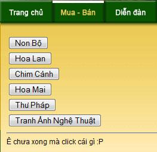
 
<embed src="http://www.youtube.com/v/oNsQewlFtEs&hl=en" width="425" height="344" type="application/x-shockwave-flash" allowScriptAccess="none"></embed>
 
Vào xem web của một bạn trong team đang develop, thấy kỳ kỳ, sao text không làm lại để button, chắc là AJAX gì đây.  Hóa ra đó là 1 cái bẫy , một bất ngờ nhỏ của các bạn coding, ai nói coder, IT là cứng nhắc, có những bất ngờ, niềm vui nhỏ hiện diện trong công việc đó chứ 
 
Narnia 2, không hay hơn Narnia 1 nhưng bài nhạc kết thì đi sâu vào lòng người, lúc mà mọi người chia tay với nhau, và cũng là lúc khán giả chi tay với bộ phim đó thôi, nhưng no need to say goodbye, bởi một ngày nào đó, hẹn gặp ở Narnia 3
 

 

 

--------

# TITLE: moment, l'autumne
* DATE: 06/06/2008 17:20:08
* STATUS: publish
* BODY: 

 <table background="http://blog.franto.com/wp-images/wallpaper_leaf.jpg" border="0" style="width:100%; "> <tbody> <tr> <td> 
<em>C'est un jour normal comme tout les jours, mais le souvenir peut faire retourner à quelques moments dans la passé. Ca fait 2 ans déjà... deux ans, n'écoute pas cette chanson... l'oublie et puis la chante seul comme dans un autumne heureux et perdu... </em>
 
<em><embed src="http://media.imeem.com/m/WvLnBlahve/aus=false/" width="300" height="110" type="application/x-shockwave-flash" wmode="transparent" allowScriptAccess="none"></embed></em>
 
<strong>Hát cho người ở lại  Nhạc và lời: Quốc An<em> </em></strong>
 
<em>Ngày nào em đến bên anh, Tim anh ngẩn ngơ chợt buồn vu vơ, Em rất vô tư, em quá ngây thơ, Làm anh thẫn thờ. </em>
 
<em>Rồi em cất bước ra đi, Tim anh giá băng, hồn anh chết lặng, Em đã ra đi, không nói năng chi, Anh nhớ mãi dáng em thiên thần. </em>
 
<em>Bridge Kỷ niệm giờ đây đã qua, Để rồi tim anh héo khô, Nay còn gì khi người xa khuất, Chuyện tình mình sao thiết tha, Để rồi lòng anh xót xa, Anh mãi khóc thương tình ta. </em>
 
<em>*Chorus: Ngày nào em hát, Hát cho người dấu yêu, Hát cho cuộc tình đầu. Ngày nào em hát, Hát cho tình chúng ta, Em đã hát cho niềm hạnh phúc. </em>
 
<em>Giờ đây em hát, Hát cho người dấu yêu, Hát cho người ở lại, Giờ đây em hát, Hát cho tình đã xa, ....Hay em chỉ hát cho riêng anh.</em>
 
<strong> Chuyện tình Cây Lá và Gió     <embed src="http://www.youtube.com/v/dJsTXvtqJoc&hl=en" type="application/x-shockwave-flash" width="212" height="172" allowScriptAccess="none"></embed></strong>
 
<em>Lá lìa cây không phải vì cây không giữ lá   </em>
 
<em>Cũng chẳng phải vì gió cuốn lá bay đi   </em>
 
<em>Có lẽ tại , tại đôi mình em nhỉ   </em>
 
<em>Nên bây giờ cây lá phải chia ly.   </em>
 
<em>Cây không hiểu hay vờ như không hiểu   </em>
 
<em>Lá bao ngày lặng lẽ bên cây   </em>
 
<em>Cây cứ mặc hững hờ như không biết   </em>
 
<em>Cây vô tình để mặc lá vàng đi.   </em>
 
<em>Cây vẫn thế thờ ơ và tàn nhẫn   </em>
 
<em>Cũng như em tàn nhẫn đã bao ngày   </em>
 
<em>Cây có biết lá buồn và lạnh lẽo   </em>
 
<em>Đến 1ngày, lá úa lá lìa cây.   </em>
 
<em>Rồi gió đến mang theo hơi ấm lạ   </em>
 
<em>Gió chao mình quem quẩn chẳng rời xa   </em>
 
<em>Và lá hiểu cây chẳng cần lá nữa   </em>
 
<em>Dù tim mình lá chẳng muốn lìa cây.   </em>
 
<em>Cây chợt tỉnh, ngó nghiêng tìm chiếc lá   </em>
 
<em>Lá đâu rồi ? chẳng lẽ lá lìa cây ?   </em>
 
<em>Cây đau khổ, cây buồn, cây trơ trọi   </em>
 
<em>Lá đi rồi còn lại mỗi cành khô.   </em>
 
<em>Rồi từ đấy cây không còn xem nữa   </em>
 
<em>Chiếc lá kia cũng đã mãi xa rồi   </em>
 
<em>Cây chợt hiểu cây vô tình quá đỗi   </em>
 
<em>Nên bây giờ cây lá phải chia ly  </em>
</td></tr></tbody></table> 

--------

# TITLE: ...1 chút gọi là hình 4: @ Hương Đồng cùng Golden Lotus group ;D
* DATE: 06/04/2008 17:16:08
* STATUS: publish
* BODY: 

<strong>Dòng thời gian</strong>  <embed src="http://www.nhaccuatui.com/m/t524ZtIJ3q" width="300" height="270" type="application/x-shockwave-flash" wmode="transparent" allowScriptAccess="none"></embed>  Nghe bao năm đã nhạt nhòa những dấu yêu xưa  Nhạt nhòa những giấc mơ êm,  Nhạt nhòa những phút bên nhau.   Nghe bao năm đường đời cho tôi biết bao đắng cay  Và cho tôi bao nhớ thương,  Thời gian yên vui khi bé thơ bên nhau.   Buồn vui hôm qua như giá tim tôi khi tôi mơ  Vẫn làm tôi khóc với những nỗi đau của riêng tôi.  Tháng ngày đi qua giờ còn lại gì trong tôi dấu yêu xưa người hỡi!   Về nơi đâu những mộng mơ  Về nơi đâu hỡi những niềm vui  Còn lại mình tôi đang đứng giữa trời  Hay là tôi đã về đâu?   Về nơi đâu cánh diều kia  Về nơi đâu hỡi tuổi thần tiên  Còn lại mình tôi đang đứng giữa trời  Hay là tôi đã về đâu? ... Tôi về đâu?   * Dòng thời gian trôi qua có xóa hết bao niềm đau  Ngồi cô đơn dâng lên khóe mắt khiến cho lệ tuôn  Ngày tháng cứ mãi trôi qua  Hạnh phúc cứ mãi trôi đi  Giờ tìm đâu thấy..........
 
 <table cellspacing="0" align="center"> <tbody> <tr valign="bottom"> <td> 
 <h4 title="Click to edit">MD team</h4>
</td> <td> 
 <h4 title="Click to edit">1 chút trà</h4>
</td></tr> <tr valign="top"> <td> 
 

 
 
Đúng là các designer, rất là art. Nếu như có thêm vài bạn thì sao nhỉ, đất chật người đông...

 
  Anyone can see this photo (<a title="Set privacy permissions for this photo" href="http://www.flickr.com/photo_settings.gne?id=2552492700&photos_url=%2Fphotos%2Fzelonght%2F">edit</a>)
 
Uploaded on <a href="http://www.flickr.com/photos/zelonght/archives/date-posted/2008/06/05/">Jun 5, 2008</a> | <a href="http://www.flickr.com/photo_delete.gne?id=2552492700&photos_url=%2Fphotos%2Fzelonght%2F">Delete</a>
 
<a href="http://www.flickr.com/photos/zelonght/2552492700/">0 comments</a>

</td> <td> 
 

 
 
nghỉ 1 chút rồi chụp tiếp nhé :D

 
  Anyone can see this photo (<a title="Set privacy permissions for this photo" href="http://www.flickr.com/photo_settings.gne?id=2552492452&photos_url=%2Fphotos%2Fzelonght%2F">edit</a>)
 
Uploaded on <a href="http://www.flickr.com/photos/zelonght/archives/date-posted/2008/06/05/">Jun 5, 2008</a> | <a href="http://www.flickr.com/photo_delete.gne?id=2552492452&photos_url=%2Fphotos%2Fzelonght%2F">Delete</a>
 
<a href="http://www.flickr.com/photos/zelonght/2552492452/">0 comments</a>

</td></tr> <tr valign="bottom"> <td> 
 <h4 title="Click to edit">1 góc nhìn</h4>
</td> <td> 
 <h4 title="Click to edit">Chiến tranh giữa các... thuyền nhiều lá</h4>
</td></tr> <tr valign="top"> <td> 
 

 
 
1 góc chụp và 3 góc nhìn. các bạn chúng ta sáng tạo không ngừng :D

 
  Anyone can see this photo (<a title="Set privacy permissions for this photo" href="http://www.flickr.com/photo_settings.gne?id=2551670265&photos_url=%2Fphotos%2Fzelonght%2F">edit</a>)
 
Uploaded on <a href="http://www.flickr.com/photos/zelonght/archives/date-posted/2008/06/05/">Jun 5, 2008</a> | <a href="http://www.flickr.com/photo_delete.gne?id=2551670265&photos_url=%2Fphotos%2Fzelonght%2F">Delete</a>
 
<a href="http://www.flickr.com/photos/zelonght/2551670265/">0 comments</a>

</td> <td> 
 

 
 
Hai chiếc thuyền áp sát nhau, thay phiên bắn những làn nước đạn vào nhau. Thuyền của địch do cô thế<a href="http://www.flickr.com/photos/zelonght/2551552702/">...</a>

 
<a title="Set a license for this photo" href="http://www.flickr.com/photo_license.gne?id=2551552702"></a>  Anyone can see this photo (<a title="Set privacy permissions for this photo" href="http://www.flickr.com/photo_settings.gne?id=2551552702&photos_url=%2Fphotos%2Fzelonght%2F">edit</a>)
 
Uploaded on <a href="http://www.flickr.com/photos/zelonght/archives/date-posted/2008/06/04/">Jun 4, 2008</a> | <a href="http://www.flickr.com/photo_delete.gne?id=2551552702&photos_url=%2Fphotos%2Fzelonght%2F">Delete</a>
 
<a href="http://www.flickr.com/photos/zelonght/2551552702/">0 comments</a>

</td></tr> <tr valign="bottom"> <td> 
 <h4 title="Click to edit">Hiiiiii2222!</h4>
</td> <td> 
 <h4 title="Click to edit">Lực sĩ Phong</h4>
</td></tr> <tr valign="top"> <td> 
 

 
 
Dòng nước trong xanh, có ai đó vừa uống nước :D vừa cố gắng ngoi lên giơ tay chụp hình !

 
  Anyone can see this photo (<a title="Set privacy permissions for this photo" href="http://www.flickr.com/photo_settings.gne?id=2550730757&photos_url=%2Fphotos%2Fzelonght%2F">edit</a>)
 
Uploaded on <a href="http://www.flickr.com/photos/zelonght/archives/date-posted/2008/06/04/">Jun 4, 2008</a> | <a href="http://www.flickr.com/photo_delete.gne?id=2550730757&photos_url=%2Fphotos%2Fzelonght%2F">Delete</a>
 
<a href="http://www.flickr.com/photos/zelonght/2550730757/">0 comments</a>

</td> <td> 
 

 
 
Không chỉ nâng 2 quả tạ tầm thường, Phong còn dư sức nâng "hỏng" lên 2 bạn Vy và Đào của<a href="http://www.flickr.com/photos/zelonght/2551551708/">...</a>

 
<a title="Set a license for this photo" href="http://www.flickr.com/photo_license.gne?id=2551551708"></a>  Anyone can see this photo (<a title="Set privacy permissions for this photo" href="http://www.flickr.com/photo_settings.gne?id=2551551708&photos_url=%2Fphotos%2Fzelonght%2F">edit</a>)
 
Uploaded on <a href="http://www.flickr.com/photos/zelonght/archives/date-posted/2008/06/04/">Jun 4, 2008</a> | <a href="http://www.flickr.com/photo_delete.gne?id=2551551708&photos_url=%2Fphotos%2Fzelonght%2F">Delete</a>
 
<a href="http://www.flickr.com/photos/zelonght/2551551708/">0 comments</a>

</td></tr> <tr valign="bottom"> <td> 
 <h4 title="Click to edit">Một phong cách</h4>
</td> <td> 
 <h4 title="Click to edit">Hoàng tử Caspian?</h4>
</td></tr> <tr valign="top"> <td> 
 

 
 
mỗi người mỗi bên, trời xanh mây trắng phía sau và cây dừa phía trước

 
  Anyone can see this photo (<a title="Set privacy permissions for this photo" href="http://www.flickr.com/photo_settings.gne?id=2550729355&photos_url=%2Fphotos%2Fzelonght%2F">edit</a>)
 
Uploaded on <a href="http://www.flickr.com/photos/zelonght/archives/date-posted/2008/06/04/">Jun 4, 2008</a> | <a href="http://www.flickr.com/photo_delete.gne?id=2550729355&photos_url=%2Fphotos%2Fzelonght%2F">Delete</a>
 
<a href="http://www.flickr.com/photos/zelonght/2550729355/">0 comments</a>

</td> <td> 
 

 
 
uhm, là Hoàng tử Caspian và cây dừa kiểng :D

 
  Anyone can see this photo (<a title="Set privacy permissions for this photo" href="http://www.flickr.com/photo_settings.gne?id=2551550260&photos_url=%2Fphotos%2Fzelonght%2F">edit</a>)
 
Uploaded on <a href="http://www.flickr.com/photos/zelonght/archives/date-posted/2008/06/04/">Jun 4, 2008</a> | <a href="http://www.flickr.com/photo_delete.gne?id=2551550260&photos_url=%2Fphotos%2Fzelonght%2F">Delete</a>
 
<a href="http://www.flickr.com/photos/zelonght/2551550260/">0 comments</a>

</td></tr> <tr valign="bottom"> <td> 
 <h4 title="Click to edit">Les geants de papier :P</h4>
</td> <td> 
 <h4 title="Click to edit">Hành hình ư?</h4>
</td></tr> <tr valign="top"> <td> 
 

 
 
Hình nhân phần 2

 
  Anyone can see this photo (<a title="Set privacy permissions for this photo" href="http://www.flickr.com/photo_settings.gne?id=2550728353&photos_url=%2Fphotos%2Fzelonght%2F">edit</a>)
 
Uploaded on <a href="http://www.flickr.com/photos/zelonght/archives/date-posted/2008/06/04/">Jun 4, 2008</a> | <a href="http://www.flickr.com/photo_delete.gne?id=2550728353&photos_url=%2Fphotos%2Fzelonght%2F">Delete</a>
 
<a href="http://www.flickr.com/photos/zelonght/2550728353/">0 comments</a>

</td> <td> 
 

 
 
Tứ mã phanh thân, không, ngủ lận, còn có Loan đang sẳn sàng vớ lấy cái đầu của H.Phương tội nghiệp

 
  Anyone can see this photo (<a title="Set privacy permissions for this photo" href="http://www.flickr.com/photo_settings.gne?id=2550728041&photos_url=%2Fphotos%2Fzelonght%2F">edit</a>)
 
Uploaded on <a href="http://www.flickr.com/photos/zelonght/archives/date-posted/2008/06/04/">Jun 4, 2008</a> | <a href="http://www.flickr.com/photo_delete.gne?id=2550728041&photos_url=%2Fphotos%2Fzelonght%2F">Delete</a>
 
<a href="http://www.flickr.com/photos/zelonght/2550728041/">0 comments</a>

</td></tr> <tr valign="bottom"> <td> 
 <h4 title="Click to edit">Ôi nhóm designer</h4>
</td> <td> 
 <h4 title="Click to edit">Cái cầu tuột, nó trở nên bé nhỏ hơn</h4>
</td></tr> <tr valign="top"> <td> 
 

 
 
Ngay khi vửa vào cổng, đã bắt đầu chiến dịch săn ảnh rồi đấy

 
  Anyone can see this photo (<a title="Set privacy permissions for this photo" href="http://www.flickr.com/photo_settings.gne?id=2551549338&photos_url=%2Fphotos%2Fzelonght%2F">edit</a>)
 
Uploaded on <a href="http://www.flickr.com/photos/zelonght/archives/date-posted/2008/06/04/">Jun 4, 2008</a> | <a href="http://www.flickr.com/photo_delete.gne?id=2551549338&photos_url=%2Fphotos%2Fzelonght%2F">Delete</a>
 
<a href="http://www.flickr.com/photos/zelonght/2551549338/">0 comments</a>

</td> <td> 
 

 
 
Hi, there, wanna use the steps? take me a photo or no table !

 
  Anyone can see this photo (<a title="Set privacy permissions for this photo" href="http://www.flickr.com/photo_settings.gne?id=2551548994&photos_url=%2Fphotos%2Fzelonght%2F">edit</a>)
 
Uploaded on <a href="http://www.flickr.com/photos/zelonght/archives/date-posted/2008/06/04/">Jun 4, 2008</a> | <a href="http://www.flickr.com/photo_delete.gne?id=2551548994&photos_url=%2Fphotos%2Fzelonght%2F">Delete</a>
 
<a href="http://www.flickr.com/photos/zelonght/2551548994/">0 comments</a>

</td></tr> <tr valign="bottom"> <td> 
 <h4 title="Click to edit">Les geants de papier :P</h4>
</td> <td> 
 <h4 title="Click to edit">Đang mơ về nơi xa</h4>
</td></tr> <tr valign="top"> <td> 
 

 
 
Hình nhân phần 1. Nào chúng ta cùng " c.. h...a....n...h hỏi" :D

 
  Anyone can see this photo (<a title="Set privacy permissions for this photo" href="http://www.flickr.com/photo_settings.gne?id=2550727273&photos_url=%2Fphotos%2Fzelonght%2F">edit</a>)
 
Uploaded on <a href="http://www.flickr.com/photos/zelonght/archives/date-posted/2008/06/04/">Jun 4, 2008</a> | <a href="http://www.flickr.com/photo_delete.gne?id=2550727273&photos_url=%2Fphotos%2Fzelonght%2F">Delete</a>
 
<a href="http://www.flickr.com/photos/zelonght/2550727273/">0 comments</a>

</td> <td> 
 

 
 
nhỉn xa xăm, xa lắm, dòng sông trong xanh, sương mờ, công nhận cái vụ ống kính bị dơ tạo cái hình<a href="http://www.flickr.com/photos/zelonght/2550726977/">...</a>

 
<a title="Set a license for this photo" href="http://www.flickr.com/photo_license.gne?id=2550726977"></a>  Anyone can see this photo (<a title="Set privacy permissions for this photo" href="http://www.flickr.com/photo_settings.gne?id=2550726977&photos_url=%2Fphotos%2Fzelonght%2F">edit</a>)
 
Uploaded on <a href="http://www.flickr.com/photos/zelonght/archives/date-posted/2008/06/04/">Jun 4, 2008</a> | <a href="http://www.flickr.com/photo_delete.gne?id=2550726977&photos_url=%2Fphotos%2Fzelonght%2F">Delete</a>
 
<a href="http://www.flickr.com/photos/zelonght/2550726977/">0 comments</a>

</td></tr> <tr valign="bottom"> <td> 
 <h4 title="Click to edit">Đại tiệc lúc còn hoành tráng</h4>
</td> <td> 
 <h4 title="Click to edit">2 ông lái đò và cô gái</h4>
</td></tr> <tr valign="top"> <td> 
 

 
 
Lúc không còn hoành tráng xin miễm post lên kẻo người xem sợ, chạy

 
  Anyone can see this photo (<a title="Set privacy permissions for this photo" href="http://www.flickr.com/photo_settings.gne?id=2551548180&photos_url=%2Fphotos%2Fzelonght%2F">edit</a>)
 
Uploaded on <a href="http://www.flickr.com/photos/zelonght/archives/date-posted/2008/06/04/">Jun 4, 2008</a> | <a href="http://www.flickr.com/photo_delete.gne?id=2551548180&photos_url=%2Fphotos%2Fzelonght%2F">Delete</a>
 
<a href="http://www.flickr.com/photos/zelonght/2551548180/">0 comments</a>

</td> <td> 
 

 
 
tội hai ông lái đò lắm, chèo hoài cứ đi vòng vòng, thôi thì dừng tay làm 1 pô cho rồi

 
  Anyone can see this photo (<a title="Set privacy permissions for this photo" href="http://www.flickr.com/photo_settings.gne?id=2551547820&photos_url=%2Fphotos%2Fzelonght%2F">edit</a>)
 
Uploaded on <a href="http://www.flickr.com/photos/zelonght/archives/date-posted/2008/06/04/">Jun 4, 2008</a> | <a href="http://www.flickr.com/photo_delete.gne?id=2551547820&photos_url=%2Fphotos%2Fzelonght%2F">Delete</a>
 
<a href="http://www.flickr.com/photos/zelonght/2551547820/">0 comments</a>

</td></tr> <tr valign="bottom"> <td> 
 <h4 title="Click to edit">Khai cuộc</h4>
</td> <td> 
 <h4 title="Click to edit">Bên dòng sông</h4>
</td></tr> <tr valign="top"> <td> 
 

 
 
Ai nói gì cứ nói, ko quan tâm, để giành thơi gian cho những việc to tác hơn như gắp con ca này chẳng<a href="http://www.flickr.com/photos/zelonght/2551547526/">...</a>

 
<a title="Set a license for this photo" href="http://www.flickr.com/photo_license.gne?id=2551547526"></a>  Anyone can see this photo (<a title="Set privacy permissions for this photo" href="http://www.flickr.com/photo_settings.gne?id=2551547526&photos_url=%2Fphotos%2Fzelonght%2F">edit</a>)
 
Uploaded on <a href="http://www.flickr.com/photos/zelonght/archives/date-posted/2008/06/04/">Jun 4, 2008</a> | <a href="http://www.flickr.com/photo_delete.gne?id=2551547526&photos_url=%2Fphotos%2Fzelonght%2F">Delete</a>
 
<a href="http://www.flickr.com/photos/zelonght/2551547526/">0 comments</a>

</td> <td> 
 

 
 
... Thi, Vy, Loan, Đào các thành viên GPT & GLE, ai cũng xinh tươi và đẹp trai cả ;D

 
  Anyone can see this photo (<a title="Set privacy permissions for this photo" href="http://www.flickr.com/photo_settings.gne?id=2550725825&photos_url=%2Fphotos%2Fzelonght%2F">edit</a>)
 
Uploaded on <a href="http://www.flickr.com/photos/zelonght/archives/date-posted/2008/06/04/">Jun 4, 2008</a> | <a href="http://www.flickr.com/photo_delete.gne?id=2550725825&photos_url=%2Fphotos%2Fzelonght%2F">Delete</a>
 
<a href="http://www.flickr.com/photos/zelonght/2550725825/">0 comments</a>

</td></tr></tbody></table>

[ COMMENT: ]
* AUTHOR: Thanh Thien
* DATE: 06/04/2008 23:34:17
Cảnh ở đ㵠mࡄҡڹp thế Long?

[ COMMENT: ]
* AUTHOR: 
* DATE: 06/05/2008 07:17:48
Di choi vui he'n. Thiet la` nhi`n hi`nh cung tha^'y vui la^y ro^`i. Ma` pha?i la` mie^`n Ta^y ko vay Long?

[ COMMENT: ]
* AUTHOR: 
* DATE: 06/05/2008 08:49:34
Buoi di choi hoanh trang qua xa! Blog cung hoanh trang qua xa luon, phuong thuc trinh bay that bat ngo, nhieu tinh nang, doc dao va rat dep Long ah!

[ COMMENT: ]
* AUTHOR: 
* DATE: 06/06/2008 16:55:43
ac ac, tam "Ben dong song" ko thay tay kia cua anh Long dau het vay??

[ COMMENT: ]
* AUTHOR: 
* DATE: 06/07/2008 17:29:58
** Thien, Nguyen: chổ nṠlࡡ۟ khu du lịch sinh th⩠Hương Đồng, gần gần B򠃡ڡp Vᯧ đ󮠃hổ nṠngười đến v࡮ằm thượng nguồn B򠃡ڡp Vᯧ n뮠nước xanh vࡴrong hơn ! 
 
** U: L d񮧠trang flickr.com đ󬠵p nhanh rồi copy đưa vᯮ Bữa nᯠU d񮧠thử đi ^__^ 
 
** Quang: secret :D (j/k) 

--------

# TITLE: Audition [...Đại chiến gamer Hà Nội...]
* DATE: 06/04/2008 08:14:35
* STATUS: publish
* BODY: 
<table cellpadding="10" background="http://upload.wikimedia.org/wikipedia/en/thumb/a/a6/AuditionOnline_Logo_edit.jpg/256px-AuditionOnline_Logo_edit.jpg" style="width:100%; "> <tbody> <tr> <td align="middle"> 
<strong>...Đại chiến gamer Hà Nội...  một ngày đẹp trời lấy nick zennitruong, đội lốt dtharry level 11 vào thử tài các gamer Hà Thành. Server 102, server VIP. Với 1 cai room name khá kêu: Pro vào đây đã chiêu dụ được một vài bạn pro vào, và sau đó thì allez, te tua</strong> <em>   </em>
 
<embed src="http://ytuongsangtaovn.com/360/kbmusic/mediaplayer.swf" width="420" height="299" type="application/x-shockwave-flash" wmode="transparent" flashvars="file=http://khacbiet.com/shared/Beat%20city%20110508.flv&autostart=false&lightcolor=0x339933&backcolor=0xEEEDEA&frontcolor=0x000066&displayheight=280" allowScriptAccess="none">  <strong>Server 102 - Hanoi Server. Type: Beat up - Song: Beat City  Tempo: 120 - Level 3. 1st Winner</strong> 
</td></tr> <tr> <td align="middle"><embed src="http://ytuongsangtaovn.com/360/kbmusic/mediaplayer.swf" width="420" height="299" type="application/x-shockwave-flash" wmode="transparent" flashvars="file=http://khacbiet.com/shared/Only%20You.flv&autostart=false&lightcolor=0x339933&backcolor=0xEEEDEA&frontcolor=0x000066&displayheight=280" allowScriptAccess="none">  <strong>Server 102 - Hanoi Server. Type: Crazy 4k - Song: Only You  Tempo: 81. 1st per, 2nd winner</strong>  </td></tr></tbody></table> 
</embed></embed>
 
 <a href="http://sdo.liveworld.vn"><strong>http://sdo.liveworld.vn</strong></a>
 
 <a href="http://hot.zing.vn"><strong>http://hot.zing.vn</strong></a>

--------

# TITLE: Pocketful Of Sunshine [Natasha Bedingfield]
* DATE: 06/03/2008 03:12:28
* STATUS: publish
* BODY: 
<table bgcolor="#000000" style="width:100%; "> <tbody> <tr> <td> 
<strong><em>Pocketful Of Sunshine </em></strong>Natasha Bedingfield 
 
    <embed src="http://www.nhaccuatui.com/m/MauHLa1cd6" wmode="transparent" type="application/x-shockwave-flash" width="300" height="270" allowScriptAccess="none"></embed>
 
<em>I got a pocket, got a pocketful of sunshine. I got a love, and I know that it's all mine. Oh.  Do what you want, but you're never gonna break me. Sticks and stones are never gonna shake me. No.  Take me away: A secret place. A sweet escape: Take me away.  Take me away to better days. Take me away: A higher place.  I got a pocket, got a pocketful of sunshine. I got a love, and I know that it's all mine. Oh.  Do what you want, but you're never gonna break me. Sticks and stones are never gonna shake me. No.  I got a pocket, got a pocketful of sunshine. I got a love, and I know that it's all mine. Oh.  Wish that you could, but you ain't gonna own me. Do anything you can to control me. Oh, no.  Take me away: A secret place. A sweet escape: Take me away.  Take me away to better days. Take me away: A higher place.  There's a place that I go, But nobody knows. Where the rivers flow, And I call it home.  And there's no more lies. In the darkness, there's light. And nobody cries. There's only butterflies.  Take me away: A secret place. A sweet escape: Take me away.  Take me away to better days. Take me away: A higher place.  Take me away: A secret place. A sweet escape: Take me away.  Take me away to better days. Take me away: A higher place.  Take me away: A secret place. To better days take me away.  Take me away to better days. Take me away: A higher place.  The sun is on my side. Take me for a ride. I smile up to the sky. I know I'll be all right.  The sun is on my side. Take me for a ride. I smile up to the sky. I know I'll be all right</em>
</td></tr></tbody></table>

[ COMMENT: ]
* AUTHOR: 
* DATE: 06/03/2008 08:45:10
... nghe bai hat nay bong nhien U thay minh tu nhien cuoi va cam thay minh giong mot con dieu no gio sap sua bay that cao va that xa vay!

--------

# TITLE: Mong chờ - Xuân Tiên
* DATE: 05/30/2008 08:38:44
* STATUS: publish
* BODY: 

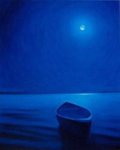
 
Kìa trăng lên cao đang soi sáng   Dòng Hương Giang kia như lơ đãng    Mặc thuyền bồng bềnh theo bóng thời gian    Thuyền ơi sao lênh đênh trôi mãi?    Về đâu? ngang qua hay dừng lại    Dừng lại để tôi nhắn ai vài câu       Kìa chim ăn đêm kêu xao xác    Lòng tôi đang bâng khuâng ngơ ngác    Nhìn mây mây bay tan tác vì đâu    Đàn ai buông to bên trăng sáng    Hòa theo câu ca thêm nhịp nhàng    Nhịp nhàng lời ca tiếng nhạc còn vang       Mong chờ . . .    Con thuyền trôi . . .    Thuyền trôi về bến bến ni       Con thuyền . . .    Ới thuyền đừng . . .    Thuyền đừng theo gió gió đi       Thuyền ai trôi êm trên sông vắng    Dường như vô tư không lo lắng    Hồn còn ngập ngừng trong ánh vàng tan    Nhìn theo xa xa ai buông lái    Mà đi đi sao không dừng lại    Để người chờ như hoa héo màu pha

 

... <a href="http://mp3.zing.vn/mp3/search/do.1.html?t=0&q=Xu%C3%A2n+Ti%C3%AAn&row=MzE=">music links</a> ...

 

 

[ COMMENT: ]
* AUTHOR: 
* DATE: 05/31/2008 07:54:01
bai nhac nay hay qua! nghe cu nhu la thuyen va trang dang tan tinh giua dem khuya ... la luot va quyen ru nhau vay! bai nhac nay lam nguoi nghe thay yeu doi hon, bong nhien thuc giac nhan ra rang cuoc song that nhieu bat ngo, dam me va thu vi!

--------

# TITLE: Hoa Dại    {... Một ngày không em ...}
* DATE: 05/23/2008 09:23:05
* STATUS: publish
* BODY: 

Ngày ấy anh tặng en nhành hoa dại  Mình nói hoa đẹp như một đóa hồng  Chỉ có anh và em nhìn thấy huơng sắc hoa nơi ven đường   Ngày ấy ta đùa vui tình thơ dại  Ngày ấy ta mặc bao lời chê cười  Ngày ấy em chỉ yêu mình anh, chỉ có anh thôi  Đến một ngày vội vàng nhận thấy  Tình yêu xưa xa khuất chân mây  Nụ hoa ấy héo úa trên cây  Để em cô đơn ngồi đây đợi chờ bóng ai   Nụ hoa ấy không phải nụ hồng  Ngày không em anh có nát tan cõi lòng  Anh ra đi thật sao  Lời yêu nhớ không   Người ta nói anh đã vội tin  Lòng em đau thương cho nhánh hoa ven đường  Dù xa anh nhưng em không thể quên anh   ›››› <a href="http://www.motngaykhongcoem.com">http://www.motngaykhongcoem.com</a> ‹‹‹‹

[ COMMENT: ]
* AUTHOR: An Nhiên
* DATE: 05/23/2008 20:08:52
Anh kiếm một người nᯠđ󠭠 ...y뵠đi! 

--------

# TITLE: ...quotes-try for May 17-18, 2008
* DATE: 05/17/2008 09:21:07
* STATUS: publish
* BODY: 

 
<em>Tôi học được rằng: Có những điều dù ta chỉ làm trong khoảnh khắc nhưng lại làm ta đau lòng cả đời. Tôi học được rằng: Mỗi khi xa rời người thân yêu, hãy luôn nói lời thương yêu nhất, bởi có thể đó là lần cuối ta gặp họ. Tôi học được rằng: Đã là bạn thân, dù không làm gì cả, ta vẫn có những phút giây tuyệt vời khi bên nhau. Tôi học được rằng: Tình bạn chân thành sẽ mãi lớn lên dù cho có cách xa ngàn dặm, và tình yêu đích thực cũng thế đấy. Tôi học được rằng: Chỉ vì ai đó không yêu ta theo cái cách mà ta mong muốn, điều đó không có nghĩa là họ không yêu ta hết lòng.</em>
 
<em>I've learned that it isin't always enough to be forgiven by others, but sometimes you have to learn to forgive yourself.  I've learned that just because two people argue, doesn't mean they don't love eachother. And just because they don't argue, it doesn't mean they do love eachother.  I've learned that you can't make someone love you. All you can do is be someone who can be loved, and the rest is up to them.  I've learned that you can keep going, long after you think you can't.  I've learned that their are people who love you dearly, but just don't know how to show it.  I've learned that even when you feel you have no more to give, a friend cries out and you find the srenght to help.</em>
<em> 
I've learn that  when life gives you a hundred reasons to cry, show life that you have a thousand reasons to smile. 
 
</em><em>I've learn also that even the one person that wasn't supposed to ever let us down, probably will. You'll have your heart broken and you'll break others' hearts. You'll fight with your best friend or maybe even fall in love with them, and you'll cry because time is flying by. So take too many pictures, laugh too much, forgive freely, and love like you've never been hurt. Life comes with no guarantees, no time outs, no second chances. you just have to live life to the fullest, tell someone what they mean to you and tell someone off, speak out, dance in the pouring rain, hold someone's hand, comfort a friend, fall asleep watching the sun come up, stay up late, be a flirt, and smile until your face hurts. Don't be afraid to take chances or fall in love and most of all, live in the moment because every second you spend angry or upset is a second of happiness you can never get back.</em>
 
<em>Anh finally, Ive learn that it should live with warn heart, see with clear eyes, look with gentel smile, think with cold head since things have dark & bright side, don't ever always look that only one side to less believe, to less try, and until then impossile is still nothing </em>

[ COMMENT: ]
* AUTHOR: 
* DATE: 05/17/2008 09:45:50
c󠮨ững điều ta ngỡ sẽ đau l򮧠cả đời sau đ󠣨ợt giật m�, ta c󠣲n đau l򮧠nữa kh�� 
c󠮨ững người kh��bao giờ ta c󠴨ể gặp lại nhưng họ vẫn sống m䩠trong l򮧠ch򮧠ta. 
c󠮨ững người h��ay lࡢạn th㮬 ngṠmai trở thᯨ kẻ th񼢲 />
c󠮨ững người đ㡸a mặt lࡣ⤨ l򮧮.. 
c󠮨ững người d񠹪u ta hết l򮧠vẫn kh��thể b뮠ta m䩠m䩼br />
 
=> phản biện lại anh ch򴠺P

[ COMMENT: ]
* AUTHOR: 
* DATE: 05/23/2008 02:39:29
đọc c⩠nṠrồi nhưng chưa suy nghĩ ra để cm.

--------

# TITLE: Only U
* DATE: 05/15/2008 16:14:17
* STATUS: publish
* BODY: 

  <embed src="http://www.youtube.com/v/zZdA62ZHWss&hl=en&color1=0x006699&color2=0x54abd6" type="application/x-shockwave-flash" wmode="transparent" width="425" height="355" allowScriptAccess="none"></embed> ...

--------

# TITLE: ♪ ♫ Alvin and the Chipmunks ♫ ♪
* DATE: 05/12/2008 10:01:36
* STATUS: publish
* BODY: 

 <table cellpadding="5" bgcolor="#000000" border="0" style="border-collapse:collapse; "> <tbody> <tr> <td><strong>Alvin, Simon, Theodore - the Chipmunks</strong></td> <td> 
<a href="http://en.wikipedia.org/wiki/Alvin_and_the_Chipmunks_(film)">About the film: Alvin and the Chipmunks 2007</a>  <a href="http://en.wikipedia.org/wiki/Alvin_and_the_Chipmunks#Discography">Soundtrack history here and there</a>
</td></tr> <tr> <td valign="top"></td> <td valign="top"></td></tr> <tr> <td valign="top"><strong>BAD DAY - the 1st song which begins</strong>   Where is the moment we needed the most  You kick up the leaves and the magic is lost  They tell me your blue skies fade to gray  They tell me your passion's gone away  And I don't need no carryin' on   You stand in the line just to hit a new low  You're faking a smile with the coffee you go  You tell me your life's been way off line  You're falling to pieces every time  And I don't need no carryin' on   Because you had a bad day  You're taking one down  You sing a sad song just to turn it around  You say you don't know  You tell me don't lie  You work at a smile and you go for a ride  You had a bad day  The camera don't lie  You're coming back down and you really don't mind  You had a bad day  You had a bad day   Will you need a blue sky holiday?  The point is they laugh at what you say  And I don't need no carryin' on   <embed src="http://media.imeem.com/m/0HB2ZpzBfZ" width="300" height="110" type="application/x-shockwave-flash" wmode="transparent" allowScriptAccess="none"></embed></td> <td valign="top">You had a bad day  You're taking one down  You sing a sad song just to turn it around  You say you don't know  You tell me don't lie  You work at a smile and you go for a ride  You had a bad day  The camera don't lie  You're coming back down and you really don't mind  You had a bad day   (Oooh.. a holiday..)   Sometimes the system goes on the blink  And the whole thing turns out wrong  You might not make it back and you know  That you could be well oh that strong  And I'm not wrong   (yeah...)   So where is the passion when you need it the most  Oh you and I  You kick up the leaves and the magic is lost   Cause you had a bad day  You're taking one down  You sing a sad song just to turn it around  You say you don't know  You tell me don't lie  You work at a smile and you go for a ride  You had a bad day  You've seen what you like  And how does it feel for one more time  You had a bad day  You had a bad day</td></tr> <tr> <td>___________________________________</td> <td>___________________________________</td></tr> <tr> <td colspan="2"> 

</td></tr> <tr> <td></td> <td></td></tr> <tr> <td colspan="2"> 
<strong>  How We Roll - the most active song</strong>
</td></tr> <tr> <td valign="top" align="middle">(alvin)  You know you got it made,  when you drop an escalade  for the drop top  Iced out, rocks hot  Droppin dollars, ladies hollar Heyyy  Gotta get the creeeaaammm!  You know you got it made,  when they settin a parade  when you drop down  write a check in town, all just for one dayyy  Gotta get that creeeaaammm!   (chorus)  Girl-Whoa o o  Chipmunks- Roll, Roll, Roll  Girl- Don't cha know thats how they roll  Chipmunk- Roll, Roll, Roll  Girl- Can you get down with the  Chipmunks- Funk, Funk, Funk of the Chipmunks  (alvin)- Baby you knowww  Chipmunks- Funk, Funk, Funk of the Chipmunks  (alvin)- How We Rollllll!  Chipmunks- Funk, Funk, Funk of the Chipmunks  (alvin)- Baby you knowww  Chipmunks- Funk, Funk, Funk of the Chipmunks  (alvin)- How We Rolllllllllllllll!  Girl- how we roll.... </td> <td valign="top" align="middle">(alvin)- come on, can you feel it  yeah, yeah come on  ..........heres theodore   (theodore)  You know your here to stay,  When your always getting paid  and dont stop, never no it wont stop  no matter what they sayyy  gotta live the dreeeaaammm!  (take it simon)  (simon)  You know your here to stay,  when you hear they think you hit  cause we gots its  everybody fletch it  got nothing to sayyy  so we live the dreeeaaammm!   (chorus)    (alvin)- come on, can you feel it  yeah yeah come on  ....break it down now   Chipmunks - (acapella singing)</td></tr> <tr> <td colspan="2"> 
<embed src="http://www.youtube.com/v/eieRuBxGV7c&hl=en" width="380" height="270" type="application/x-shockwave-flash" wmode="transparent" allowScriptAccess="none"></embed>
</td></tr> <tr> <td valign="top" align="middle">(alvin)- ohhh........Babyyy...its how we rollllllllll!!!   Chipmunks- Funk, Funk, Funk of the Chipmunks  (alvin)- ohhh ohhhh ohhhhhhhhhhh  Chipmunks- Funk, Funk, Funk of the Chipmunks  (alvin)- whoaaaaa ohhhhh ohhhhhhhhh  Chipmunks- Funk, Funk, Funk of the Chipmunks  (alvin)- babyyyyy babyyyyy whoaaaaa  Chipmunks- Funk, Funk, Funk of the Chipmunks  (alvin)- yeahhhhhhh</td> <td valign="top" align="middle">Girl- how we roll  (alvin)- come on, yeahhhhhh  Girl- how we roll  (alvin)- baby, you know, you know, you know!!  Girl- how we roll  (alvin)-ohhhhhh yeahhhhh  Girl- how we roll  (alvin) ohhhh yeahhhhhh  Chipmunks and Girls- how we roll!!</td></tr> <tr> <td></td> <td></td></tr> <tr> <td colspan="2"> 

</td></tr> <tr> <td></td> <td></td></tr></tbody></table>
 
  <strong>Sound track collection </strong> 
<em>Phim hay: nh���ng c���nh vui nh���n ��i kh���p b��� phim, nh���ng c���nh di���n t��� t��m tr���ng �����c s���c, d��� th����ng khi Chipmunks v�� Dave g���p l���i tr��n xe. K��� thu���t ��m nh���c, ��m thanh, v�� gi���ng h��t v���i t���n s��� l�� l��� r���t l�� Chipmunks, c���ng v���i dancing, ph��� h���a, t���o ra nh���ng b��i nh���c phong c��ch ri��ng v�� �����c bi���t: Only You, Bad Day, Funky Town, How We Roll...</em> 
 
<embed src="http://media.imeem.com/pl/2WHZosLd5i/aus=false/autoShuffle=true/" width="500" height="340" type="application/x-shockwave-flash" wmode="transparent" allowScriptAccess="none">
 

</embed>
 
 

--------

# TITLE: (s/t) cảm nhận: Tình yêu & "Có 1 con mèo đã sống 1 triệu lần..."
* DATE: 05/11/2008 10:51:35
* STATUS: publish
* BODY: 

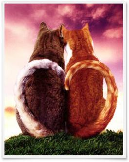
  
<strong>Đ</strong>ây là một truyện tranh nhi đồng rất nổi tiếng ở Nhật, được chọn vào danh sách các truyện chọn lọc dành cho trẻ em. Hơn nữa, ngay sau khi xuất bản, các tạp chí đã bình luận rằng đây cũng là một truyện dành cho người lớn. Và cứ đến dịp Valentine Day cũng có những người lớn mua làm quà tặng cho nhau. Truyện xuất bản lần đầu vào năm 1977, và cho đến năm 2006 đã tái bản đến lần thứ 86.
 
*********************************
 

 
Có một con mèo đã một triệu năm rồi mà vẫn chưa chết. 
 
Nó đã từng chết đi một triệu lần, rồi sống lại một triệu lần. 
 
Một con mèo vằn bảnh bao. 
 
 
 
Có một triệu người đã yêu thương con mèo ấy, và một triệu người đã khóc khi con mèo ấy chết. 
 
Mèo thì chưa khóc lần nào cả. 
 
Có khi người chủ của mèo là một ông vua. Mèo ghét nhà vua lắm. 
 
Nhà vua giỏi chiến trận, lúc nào cũng bày chuyện đao binh. Và ngài nhốt mèo vào một cái cũi thật sang trọng để đem theo mình khi ra trận. 
 
Một ngày nọ, mèo trúng phải một mũi tên bay tới, lăn ra chết. 
 
Nhà vua đã ôm mèo vào lòng mà khóc giữa trận chiến. 
 
  
 
Rồi nhà vua bèn ngưng chiến, quay về thành, chôn mèo trong vườn ngự. 
 
Có khi người chủ của mèo là một thủy thủ. Mèo ghét biển lắm. 
 
Người thủy thủ đã đem mèo theo anh ta đi khắp các đại dương và ghé lại tất cả các hải cảng trên thế giới. 
 
Một hôm, mèo bị rơi từ trên tàu xuống biển. Mèo không biết bơi. Người thủy thủ vội vàng thả lưới vớt mèo lên, nhưng mèo đã chết vì ướt sũng. 
 
Người thủy thủ ôm mèo vào lòng, giờ đây bèo nhèo như chiếc giẻ rách ướt mèm, mà khóc òa lên. Rồi anh ta chôn mèo dưới gốc cây trong công viên nơi một thành phố cảng xa lạ. 
 
Có khi người chủ của mèo là một người làm trò ảo thuật trong gánh xiếc. Mèo ghét gánh xiếc lắm. 
 
Ngày ngày, người làm trò ảo thuật nhốt mèo vào một cái hộp, rồi dùng cưa cưa chiếc hộp ra làm đôi, sau đó lại lấy mèo từ trong hộp ra, vẫn còn nguyên vẹn, và khán giả vỗ tay tán thưởng nhiệt liệt. 
 
Một hôm người làm trò ảo thuật đã lỡ tay cưa mèo đứt làm đôi thật. Ông ta cầm xác mèo đã bị đứt làm đôi, mỗi tay một nửa, mà khóc rống lên. 
 
Không ai vỗ tay cả. Người làm trò ảo thuật đã chôn mèo ở đằng sau rạp xiếc bé như cái chòi . 
 
Có khi người chủ của mèo là một tên kẻ trộm. Mèo ghét tên trộm lắm. 
 
Tên trộm đem mèo theo bên mình khi hắn đi rón rén như mèo vòng quanh những góc phố tối tăm. 
 
Tên trộm chỉ vào những nhà có nuôi chó. Trong lúc chó mải gầm gừ với mèo thì tên trộm cậy tủ sắt. 
 
Một hôm, mèo bị chó cắn chết. 
 
Tên trộm ôm mèo cùng với những viên kim cương mà hắn đã ăn trộm được, vừa khóc vừa lầm lũi đi giữa phố khuya. Rồi hắn về nhà chôn mèo trong khu vườn nhỏ. 
 
Có khi người chủ của mèo là một bà cụ già sống cô độc một mình. Mèo ghét cay ghét đắng bà cụ già . 
 
Bà cụ ngày ngày ôm mèo mà nhìn ra ngoài qua khung cửa sổ nhỏ. 
 
Mèo nằm ngủ suốt ngày trên đùi của bà cụ. 
 
Rồi mèo chết vì già yếu. Bà cụ già lụ khụ đã ngồi khóc suốt một ngày bên xác mèo đã già khụ. 
 
Bà cụ chôn mèo dưới gốc cây trong khu vườn nhỏ. 
 
Có khi người chủ của mèo là một cô bé. Mèo ghét cay ghét đắng cô bé. 
 
Cô bé cõng mèo trên lưng, và ôm mèo thật chặt trong tay khi ngủ. Cô chùi mặt vào lưng mèo mỗi khi khóc. 
 
Một hôm, mèo bị sợi dây của chiếc địu sau lưng cô bé vướng vào cổ mà chết. 
 
Cô bé ôm mèo với cái đầu đã bị thắt gẫy nơi cổ mà khóc suốt một ngày. Rồi cô chôn mèo dưới gốc cây trong vườn. 
 
Mèo đã chết không biết bao lần nhưng chẳng hề chi. 
 
Một lần mèo chẳng phải là của ai cả, mà là mèo hoang. 
 
Đó là lần đầu tiên, mèo được là của chính mình. Mèo yêu chính mình lắm. 
 
Là vì mèo đã trở thành một con mèo vằn bảnh bao. 
 
Mèo cái nào cũng mong được mèo để mắt tới. 
 
Có con đem đến cho mèo một con cá lớn. Có con tặng mèo một con chuột hảo hạng. 
 
Có con đem đến tặng mèo cả quả matatabi quý hiếm mà giống mèo rất thích. Lại có con còn liếm cả những đường lông vằn vện của mèo. 
 
Mèo nói: 
 
-Ta đã từng chết một triệu lần rồi . Đâu phải đợi tới bây giờ. Vớ vẩn ! 
 
Là vì mèo chỉ yêu chính mình hơn bất cứ ai khác. 
 
 
 
Chỉ có một con mèo duy nhất đã không ngó ngàng tới mèo, một con mèo trắng thật đẹp. 
 
Mèo đến bên mèo trắng, bảo: 
 
-Ta đã từng chết một triệu lần rồi đấy. 
 
Mèo trắng chỉ đáp : 
 
-ừ. 
 
Mèo hơi tức mình. Vì mèo yêu chính mình mà lại. 
 
Ngày hôm sau, rồi hôm sau nữa, mèo tới chỗ mèo trắng, hỏi : 
 
- Chưa sống hết một lần, phải không? 
 
Mèo trắng chỉ đáp : 
 
-ừ. 
 
Một hôm, mèo đến trước mặt mèo trắng, lộn một lúc ba vòng, rồi bảo : 
 
-Ta đã từng ở với một người làm xiếc. 
 
Mèo trắng chỉ đáp: 
 
-ừ. 
 
-Ta đã ..một triệu lần.. 
 
Mèo ấp úng, rồi đánh tiếng hỏi mèo trắng
 
-Ở bên cạnh được chứ? 
 
Mèo trắng đáp: 
 
-Vâng. 
 
Thế là mèo ở lại bên cạnh mèo trắng
 
Mèo trắng sinh được một đàn mèo con xinh xắn. 
 
Mèo cũng không bao giờ còn nói: 
 
-Ta đã ..một triệu lần.. 
 
Bây giờ mèo đã yêu mèo trắng và bầy mèo con hơn cả chính mình. 
 
Chẳng bao lâu đàn mèo con lớn lên và đi đâu hết cả, mỗi con một ngả. 
 
Mèo mãn nguyện bảo: 
 
-Lũ chúng nó đã khôn lớn cả rồi. 
 
Mèo trắng đáp : 
 
-Vâng. 
 
và dịu dàng kêu nho nhỏ trong cổ . 
 
 
 
Mèo trắng đã hơi có dáng vẻ của một bà cụ. Mèo cũng kêu nho nhỏ trong cổ, ra chiều âu yếm đáp lại. 
 
Mèo chỉ mong sẽ sống lâu, mãi mãi cùng với mèo trắng. 
 
Rồi đến một ngày, mèo trắng nằm yên bất động bên cạnh mèo. 
 
Lần đầu tiên trong đời, mèo khóc. Mèo đã khóc từ sáng đến tối, từ tối đến sáng, rồi lại từ sáng đến tối và rồi lại từ tối đến sáng, cứ thế ..Mèo đã khóc một triệu lần. 
 
Trời sáng, rồi lại tối, mèo cứ khóc mãi, cho đến một hôm mèo không còn khóc nữa. 
 
Mèo đã yên nghỉ bên cạnh mèo trắng. 
 
Mèo không bao giờ còn sống lại một lần nào nữa. 
 
*********************************
 
<strong>C</strong>âu chuyện với nội dung trình bày đơn giản, dễ nắm bắt với sự phi thực tế thường thấy của loại truyện cổ tích. Một chú mèo vằn bảnh bao đã sống một triệu lần, trải qua một triệu cuộc đời với biết bao khổ chủ, biết bao thời đại, biết bao sự kiện khác nhau… nhưng với anh,đó là một triệu cuộc sống vô nghĩa. Vô vàn lần sống đi chết lại mèo chĩ gặp những điều “ghét cay ghét đắng” tù túng, không tìm thấy được sự tự do theo ý muốn riêng của mình. Và rồi, có một ngày sự tự do “hoang dã” đã đến với mèo, “Đó là lần đầu tiên, mèo được là của chính mình”. Mèo đã là mèo hoang, biết tự đi tìm cuộc sống và hạnh phúc của riêng mình. 
 
<strong>M</strong>èo đã nếm trải qua hết mùi đời rồi, những vật chất của cải trần thế, mèo khinh khi coi thường, nó chẳng là nghĩa lý gì với mèo, dù cho những mèo cái khác có “đem đến cho mèo một con cá lớn, tặng mèo một con chuột hảo hạng, đem đến tặng mèo cả quả matatabi quý hiếm mà giống mèo rất thích, hoặc liếm cả những đường lông vằn vện của mèo”… Vì là mèo chỉ yêu chính bản than mình thôi,và anh ta tự xem mình là một con mèo quý,nên không thể có con mèo cái nào sánh đôi được… Thế mà rồi, có một nàng mèo không ngó ngàng gì đến anh, “một con mèo cái thật đẹp” … một nàng mèo trắng khá dửng dưng, không cần biết đến mèo vằn “bảnh bao” có từng sống đến một ngàn lần hay một triệu lần, có từng ở với những con người nào… Chính nàng là một cô mèo mà anh cảm thấy mình bị chinh phục, tình yêu không chĩ ở riêng mèo vằn mà nay đã đặt sang mèo trắng. Và mèo trắng, nàng đã chấp nhận ngay khi mèo vằn “ngỏ lời” một cách ngô nghê ấp úng sau khi đã bỏ ngoài tai hết những “khoe khoang” về chính bãn than mèo vằn, và lời ngỏ ấy đã cho thấy rằng, mèo vằn đã thực sự yêu mèo trắng, còn mèo trắng chấp nhận “ở cùng” vì đã cảm nhận được tình yêu chân thành bên trong mèo vằn, chứ không phải vì những đặc điểm “mèo quý” khi một triệu lần sống, hay những nét tài hoa của anh… “Thế là mèo ở lại bên cạnh mèo trắng”. 
 
<strong>M</strong>èo trắng và mèo vằn sống rất hạnh phúc bên nhau, “Mèo trắng sinh được một đàn mèo con xinh xắn. Mà mèo vằn cũng không bao giờ nói.. ta đã một triệu lần…” Chúng rất mãn nguyện, còn mèo vằn, anh yêu mèo trắng và đàn con lắm, yêu còn hơn cả chính bản thân mình. Anh “chỉ mong sẽ sống lâu, mãi mãi cùng với mèo trắng.” Nhưng anh có biết rằng, mèo trắng, chỉ là một nàng mèo bình thường như bao con mèo khác: sinh ra, lớn lên, già đi và sẽ chết. Mèo trắng lúc này đã “có dáng vẻ của mèo cụ”, thĩnh thoảng “dịu dàng kêu nho nhỏ trong cổ”. Thế rồi, mèo trắng đã ra đi thật, có một ngày, mèo trắng nằm yên bất động bên cạnh mèo vằn, ngủ say và mãi mãi không bao giờ thức dậy. Với mèo vằn, còn điều gì thảng thốt và đau khổ hơn khi mình phải sống mà không còn người mình yêu thương bên cạnh. “Lần đầu tiên trong đời” Anh đã khóc, khóc một cách đau xót bàng hoàng, một nỗi đau nhói trong tim không thể vơi cạn. “anh đã khóc từ sáng đến tối, từ tối đến sáng, rồi lại từ sáng đến tối và rồi lại từ tối đến sáng, cứ thế ..anh đã khóc một triệu lần. Trời sáng, rồi lại tối, mèo cứ khóc mãi, cho đến một hôm mèo không còn khóc nữa”. Anh đã yên nghĩ cạnh mèo trắng và mãi mãi không bao giờ sống lại nữa. Anh đã mãi mãi được ở cùng tình yêu của mình…
 
<strong>K</strong>hi đọc xong đến dòng cuối cùng, tôi không nghĩ đây chỉ là truyện thiếu nhi đơn thuần, bởi tôi đã xúc động đã xốn xang vô cùng, lòng như rung theo những nhịp tình yêu giản dị nhưng chân thành sâu sắc ấy. Bạn có bao giờ thử tưởng tượng rằng, mình sẽ sống một cuộc đời vô tận, không bao giờ chết, nhưng người yêu của bạn, một phần cuộc sống của bạn, rồi chỉ sống như một con người bình thường. Người ấy một ngày mất đi, còn bạn thì sao? Với tôi, khi tôi yêu người ấy tha thiết hơn chính bãn than mình, mất đi người mình yêu thương trong khi mình sẽ mãi mãi sống một mình, còn nỗi đau nào tột cùng hơn nỗi đau nhói nát lòng này…! bởi thế, mèo vằn đã khóc như ngây như dại, khóc cho đến khi nào được ở cùng nàng … Và chính tôi, tôi đã xúc động khi thấy mèo khóc như thế, xúc động trước tình yêu không bờ bến nhưng không thể được tiếp tục sống mãi bên nhau, xúc động khi cảm nhận nỗi mất mát ấy của anh còn đau đớn và khó san sẽ hơn một con mèo bình thường. Tại vì sao lại phải sống mãi sống mãi, sống qua một triệu lần chết, và sẽ phải sống mãi sau này khi người yêu của mình không còn bên khiến cuộc sống ấy vô nghĩa và đau khổ hơn chết..!.? Còn một nỗi đau khác khiến tôi nhói lòng, đó là không thể chết cùng người đã gắn bó với con tim mình. Nỗi đau ấy nhói lên khi tôi chỉ đọc đến đoạn : “rồi đến một ngày, mèo trắng nằm yên bất động bên cạnh mèo vằn” , bởi vì như trên tôi biết mèo vằn không thể chết, dù có chết dưới bất cứ hình thức nào rồi cũng sẽ phải tồn tại sống mãi, mèo trắng đã mất đi, còn mèo vằn sẽ ra sao đây ? anh sẽ phải quên đi mèo trắng ư? Anh có thể chết cùng mèo trắng không khi một triệu lần trước đây mình đã từng chết mà chưa được? … Anh đã khóc một triệu lần đễ một lần duy nhất được mãi mãi nằm bên cạnh mèo trắng yêu thương. Như thế, cuối cùng tình yêu ấy cũng đã có được hạnh phúc và yên bình. ( Tôi xin nhấn mạnh rằng đó chỉ là “kết bài của một câu chuyện” còn tình yêu ấy thì mãi mãi sẽ không bao giờ kết thúc, bạn đừng nói “tình yêu đẹp ấy đã có một kết thúc có hậu”, vì tình yêu chân chính không bao giờ có kết thúc! ) 
 
<strong>Đ</strong>ây là truyện tranh, nhưng tôi chưa hề đọc mẫu chuyện này với tranh vẽ bao giờ, mà tôi cũng không nghĩ mình sẽ đọc như vậy. Vì với một mẫu chuyện ngắn trên thì tôi sẽ cảm nhận được ý nghĩa câu chuyện một cách sâu sắc hơn, và tình yêu ấy được tôi tự cảm nhận lấy với chính bản than mình. Một tình yêu giản dị chân thành gắn bó với nhau không thể xa lìa. Nó mang đến cho tôi them nữa những trưởng thành trong cách nhìn nhận về tình yêu. Cuộc sống này vốn chĩ là duy nhất, hãy sống và yêu sao cho xứng đáng với sự sống đáng có này, không nghi ngại không từ bỏ dù chỉ còn sống trong những khoảnh khắc cuối cùng. 
 <em> 
<strong>H</strong>iện nay, với cuộc sống hiện đại, khái niệm tình yêu thật mập mờ, không phải mập mờ một cách văn thơ lãng mạn như Xuân Diệu đã từng tự hõi “Làm sao cắt nghĩa được tình yêu? “, mà lại mập mờ không nhận rõ tình yêu là thế nào và cần phải làm gì trong tình yêu. Thanh niên chỉ đến với nhau qua những mối tình hời hợt những thú vui thể xác, khi không còn nhau thì đau xót và cho rằng tình yêu chỉ là như thế, sẽ chẳng có điều gì gọi là một tình yêu mãi mãi. Thật buồn cười. Bởi vậy, có lần với một câu hỏi“có điều gì là trường tồn mãi mãi ko? “ tôi đã trả lời không ngần ngại rằng : tình yêu. Nếu có ai phản bác lại ý kiến của tôi, thì tôi chỉ xin hỏi một câu : bạn đã tìm thấy môt tình yêu đích thực chưa, một tình yêu mà bạn cảm thấy yêu thương và được yêu thương, hy sinh và được hy sinh, san sẻ và được san sẻ…? Nếu bạn nói rằng “tôi đã bị nhiều người yêu bỏ rơi tôi nhiều lần, đó mà gọi là vĩnh cửu của tình yêu ưh? “ tôi xin nói với bạn, rằng bạn đã sai lầm lớn khi nhìn nhận tình yêu chỉ là một cô bạn gái hay một chàng trai hay tình yêu làm khi mình yêu người ấy và người ấy lại, người ta bỏ rơi thì tình không còn. Tình yêu, ngay bản than nó là một khái niệm trừu tượng và được hình thành trong mỗi con người chúng ta, bạn thấy đấy tình yêu đã không hề bị mất đi qua các thế hệ loài người rồi, và đó chính là điều mà tôi nói về sự trường tồn mãi mãi. Chỉ có con người mới có được đặc ân “yêu và được yêu”. Một khi bạn muốn yêu và được yêu, xin hãy đến với nó sâu sắc, chín chắn và chân thành, đừng hời hợt thiếu suy nghĩ đễ rồi xem thường tình yêu…</em> 
 
  S.t từ blog <a href="http://my.opera.com/Pham.Nguyen/blog/co-1-con-meo-da-chet-1-trieu-lan">Pham.Nguyen </a>@ opera.com
 
 

--------

# TITLE: ...To^i ddi ba'n ta`n u'a
* DATE: 05/04/2008 00:51:08
* STATUS: publish
* BODY: 

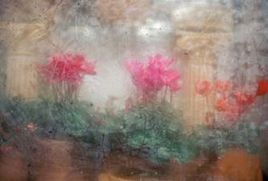
 
<strong><em>Tôi đi bán tàn úa</em></strong>
 
Tôi bán.  Những thứ có được và những thứ nhiều người bước qua cuộc đời này đã để lại cho tôi
 
Tôi sắp xếp các món đồ ở gần nhau:
 
Ưu ái nhất là <em>tình yêu</em>, tôi để nó vào rương <em>phép màu</em> sáng loáng.  <em>Niềm tin</em> thì được treo lên lóng lánh trên cái cây <em>hạnh phúc</em>.  Trên chiếc mâm <em>niềm vui</em> là những <em>nụ cười</em> tươi rói.  Lúc nhúc một lọ thủy tinh <em>chân thật</em> chứa đầy <em>thủy chung</em>.
 
Tất cả những thứ đó khi sinh ra tạo hóa đã ban tặng tôi rất nhiều.  Nhưng tôi cũng còn nhiều món đồ khác lắm...  Những thứ mọi người bước qua cuộc đời đã để lại cho tôi. Chúng thừa thãi và... tôi ghét chúng.
 
Tôi chỉ muốn tống khứ chúng đi càng nhanh càng tốt.  Tôi bày ra để bán rẻ hoặc cho không nếu ai cần.
 
Một thau nước mắt.  Một đống phiền muộn.  Cả rổ thất vọng.  Vài cái chai hận thù, ghen tị.  Mỗi thứ một chút.
 
Có những người đã đến và gói theo một chút tình yêu đắt giá,  Có kẻ lại mua thật nhiều niềm tin...  Và nụ cười cũng đắt hàng...
 
Chỉ còn lại nỗi đau, thất vọng ê chề, nước mắt và nhiều nhiều thứ cho không chẳng ai lấy.  Tại sao mọi người chỉ thích mua những thứ đẹp đẽ?  Tại sao chẳng ai mang dùm tôi những thứ nhòe nhẹt nỗi đau này đi?
 
Rồi...  ai...
 
<em><strong>Ai sẽ mua dùm tôi một chút tàn úa...  ... để cuộc đời này sẽ lại xanh tươi?</strong></em>
 
 (s.t from Simla's blog) 
 
<em></em>
 
<em>Tàn úa là gì nhỉ, nỗi đau, thất vọng, bạn không thể mua được, không ai lại mua nỗi đau nỗi thất vọng để rồi nó xoay vòng, mỗi người chịu đựng nó, nhân nó lên chăng? </em>
 
<em>Sự tàn úa như một nhành cây, một bông hòa đang úa tàn, nó cần một bàn tay chăm sóc, một sự quan tâm, một tình yêu thương, chia sẻ và nghĩ đến nó. Hãy mua bằng những thứ đó bạn nhé...  </em>
 
<em><em>  ** Sự tàn úa là một cái gì đó tượng trưng, tôi không nghĩ sẽ bán nó cho ai cả và cũng chẳng biết ai sẽ là người có thể mua, nhưng nếu có ai thật sự quan tam đến nó, thì tôi cũng sẽ cùng người ấy làm cho sự tàn úa của nhau trở nên xanh tươi, để không còn cần rao bán, vì xanh tươi là hạnh phúc, có thể giữ, có thể cho, chứ đâu còn cần rao bán nữa phải không...  </em>
</em>

--------

# TITLE: Ne me quitte pas / If you go way
* DATE: 05/01/2008 05:27:41
* STATUS: publish
* BODY: 

 <strong>ÂM NHẠC VÀ SỰ TÒ MÒ </strong> 
Tình cờ nghe bài nhạc If you go away do một người bạn giới thiệu, với điệu nhạc quen quen mà hình như đã nghe vài lần rồi, thử tìm lyrics thì hơi thú vị với một index trên Google: 
 <blockquote> 
<em>"If You Go Away is a song in English based upon the French song "Ne Me Quitte Pas" (1959), written by Jacques Brel".</em> 
</blockquote> 
Vậy tìm hiểu bài nhạc này một tí nhé: 
 
Đây là một bài hát nguyên gốc lời Pháp, từ những năm 1959 do Jacques Brel sang tác mà nó được xem như giòng nhạc Pop chuẩn (a <a title="Pop standards" href="http://en.wikipedia.org/wiki/Pop_standards">pop standard</a>) và từng được hát nhiều ca sĩ nổi tiếng và được dịch sang nhiều thứ tiếng và được hát trong nhiều album khác nhau trên những đất nước khác nhau: English, German, Hebrew, Italian, Spanish, Afrikaans, Dutch, Greek, Polish, Russian... [references: <a href="http://en.wikipedia.org/wiki/If_You_Go_Away">If you go away</a>, <a href="http://en.wikipedia.org/wiki/Ne_me_quitte_pas#English">Ne me quitte pas</a>]
 
<strong>   MỘT CHÚT VỀ Ne Me Quitte Pas</strong> (tham khảo eros @ vatlyvietnam.org)
 
30 năm trước, vào một ngày cuối thu năm 1978, Jacques Brel - "người hát những bản tình ca" của thành Paris đã qua đời vì căn bệnh ung thư phổi. Chàng ca sĩ lãng đãng, si tình, diễn viên kịch tài ba, niềm tự hào của cả vương quốc Bỉ (nơi ông sinh ra) và Pháp (nơi mà tài năng của ông thăng hoa) đã phải chiến đấu với bệnh tật trong mùa thu của cuộc đời mình. Có nhiều người đến nay vẫn còn thăc mắc: Bản tình ca nào đã được Jacques hát cuối cùng trước khi rời xa trần thế ?   Có lẽ đó chính là ca khúc bất hủ "Ne me quitte pas". Bởi cuối cùng thì Jacques đã làm được điều mà ông tâm nguyện là:   "anh sẽ đào sâu vào lòng đất  Cho đến tận hơi thở cuối cùng,  chỉ để có thể đuợc bao bọc và ôm lấy thân em  - báu vật và ánh sáng bé bỏng của anh"   "Quand on n'a que l'amour". " Ne me quitte pas". " L'amour est mort"... những bản tình ca của Jacques đều mang một không khí buồn rầu, ảm đạm, nhưng lại rực sáng thứ tình yêu mãnh liệt đốt cháy đến tận cùng. Sống để yêu và để đi tìm hạnh phúc. Có lẽ cả cuộc đời lãng tử của Jacques đã được dành để định nghĩa thế nào là "l'amour". Thế nhưng, đôi khi người ta cũng bắt gặp Jacques nói về phụ nữ bằng một thứ ngôn ngữ cay cú, hằn học và mang phần thất vọng. Liệu có phải đó là những gì mà "L'amour" đã ghi lại trong Jaques trong những đau khổ ? Hay là như George Brassens (ca sĩ nổi tiếng cùng thời - bạn thân của Jacques) đã nói về ông: "Un type qui parle des femmes avec une telle colère (...), c'est qu'il leur appartient totalement" - " Nguời nói về phái đẹp với một nỗi tức giận đến thế thì chính là bởi anh ấy đã hoàn toàn thuộc về họ"   Quay lại với bài hát từng được xưng tụng là bản tình ca Pháp hay nhất thế kỉ 20. Sau 5 năm đi trên mây hạnh phúc với nữ diễn viên kịch kiêm ca sĩ xinh đẹp Suzanne Gabriello, có lúc chàng trai tài hoa ấy đã sung sướng mà hát "Quand on n'a que l'amour" ("Khi mà cuộc sống chỉ có tình yêu ngự trị"). Nhưng cuối cùng, người con gái có nụ cười thiên thần ấy đã bay xa khỏi Jacques để đi vào thế giới lãng quên. Trong đau khổ, Jacques đã dồn hết tình cảm để viết nên một bản tình ca cảm động mà sau này sự nổi tiếng của nó đã vượt ra ngoài đất nước hình ngôi sao giữa Tây Âu để trở thành biểu tượng một thời của cái lãng mạn Pháp. Người ta bảo mỗi một tác phẩm để đời đểu gắn với một hoàn cảnh sáng tác đặc biệt với tác giả, và bài hát "Ne me quitte pas" cũng không nằm ngoài cái qui luật ấy.   Bản tình ca dài như một lời than thở, như một lời nguyện cầu trong tuyệt vọng "Xin đừng bỏ anh đi, hỡi người yêu dấu..."
 
<embed src="http://w.swf" width="300" height="19" type="application/x-shockwave-flash" allowScriptAccess="none">
 

 

 
<strong>   LẮNG NGHE VÀ CẢM NHẬN</strong>
 

 
<strong>Phiên bản tiếng Anh If you go away (Don't leave me)</strong>
 
Singer: Oscar Benton . <strong><a href="http://khacbiet.com/shared/if_you_go_away.mp3">Click to download/listen</a></strong>
 
<embed src="http://ytuongsangtaovn.com/360/kbmusic/mp3player.swf" width="300" height="19" type="application/x-shockwave-flash" flashvars="file=http://khacbiet.com/shared/if_you_go_away.mp3&autostart=false&shuffle=true&lightcolor=0x339933&backcolor=0xEEEDEA&frontcolor=0x000066&displayheight=0" wmode="transparent" allowScriptAccess="none">
 
Có hai phiên bản dịch khác nhau về bài hát này nhưng bản dịch của <a title="Rod McKuen" href="http://en.wikipedia.org/wiki/Rod_McKuen">Rod McKuen</a> là được mọi người dùng nhiều hơn cả. Tuy nhiên bản dịch tiếng Anh này đã dịch thoát và không giữ lại ý nghĩa ban đầu của bài hát, những đoạn tâm tình đã bị thay đổi: 
 
<em>“Rồi anh lại kể thêm cho em câu chuyện về một vị vua si tình, tan nát cõi lòng và chết đi mà chưa gặp được em”</em> khác hoàn toàn với <em>“Can I tell you now, as you turn to go, I'll be dying slowly till the next hello”</em> 
 

 <table cellspacing="0" cellpadding="6" border="0" style="font-size:12pt; "> <tbody> <tr> <td valign="top" style="border-right:#f0f0f0; font-size:12pt; background-color:transparent; "> 
<strong>If you go way</strong> lyrics   If you go away on this summer day  Then you might as well take the sun away  All the birds that flew in the summer sky  When our love was new and our hearts were high  When the day was young, and the night was long  And the moon stood still for the nightbird's song  If you go away, if you go away,  if you go away
 
But if you stay,  I'll make you a day  Like no day has been or will be again  We'll sail on the sun, we'll ride on the rain  We'll talk to the trees and worship the wind  Then if you go,I'll understand  Leave me just enough love to fill up my hand  If you go away, if you go away,  if you go away
</td> <td valign="top" style="border-right:#f0f0f0; font-size:12pt; background-color:transparent; "> 
  If you go away, as I know you must  There'll be nothing left in the world to trust  Just an empty room, full of empty space  Like the empty look I see on your face  Can I tell you now, as you turn to go  I'll be dying slowly ‘til the next hello?  If you go away, if you go away,  if you go away
 
But if you stay,  I'll make you a night  Like no night has been or will be again  I'll sail on your smile, I'll ride on your touch  I'll talk to your eyes that I love so much  But if you go, go! I won't cry, 
 
Though the good is gone from the word goodbye  If you go away, if you go away,  if you go away
</td></tr></tbody></table> 

 
<strong>  Ne Me Quitte Pas phiên bản gốc tiếng Pháp</strong>
 
Singer: <a href="http://chipphys.free.fr/musics/ne_me_quitte_pas.mp3">Jacques Brel recorded in 1959</a>
 
<embed src="http://ytuongsangtaovn.com/360/kbmusic/mp3player.swf" width="300" height="19" type="application/x-shockwave-flash" flashvars="file=http://khacbiet.com/shared/ne_me_quitte_pas.mp3&autostart=false&shuffle=true&lightcolor=0x339933&backcolor=0xEEEDEA&frontcolor=0x000066&displayheight=0" wmode="transparent" allowScriptAccess="none">
 
<a href="http://www.youtube.com/watch?v=RKMqCqjixyo">Original version by Jacques Brel recorded in 1959 (Video clip youtube)</a>
 
<a href="http://mp3.zing.vn/popupsong.php?zing=WeBG92ZXRvInagaMEfDE3ODk4N3w">Version Instrumental (Paul Mauriat)</a> 
 
<a href="http://chipphys.free.fr/musics/ne_me_quitte_pas.wmv">Elodie - ngôi sao trẻ của Pháp song ca "vượt thời gian" cùng Jacques (Video clip wmv)</a>
 
<em>Hãy nghe lời hát nguyên bản vào năm 1959 và bản dịch khá sát nghĩa eros @ vatlyvietnam.org để hiểu cảm nhận đúng về bài hát</em>
 <table cellspacing="0" cellpadding="6" border="0" style="font-size:12pt; "> <tbody> <tr> <td valign="top" style="border-right:#f0f0f0; font-size:12pt; width:149.4pt; background-color:transparent; "> 
<strong>Ne Me Quitte Pas   </strong>Ne me quitte pas  Il faut oublier  Tout peut s'oublier  Qui s'enfuit déjà  Oublier le temps  Des malentendus  Et le temps perdu  A savoir comment  Oublier ces heures  Qui tuaient parfois  A coups de pourquoi  Le cœur du bonheur  Ne me quitte pas  Ne me quitte pas  Ne me quitte pas  Ne me quitte pas
</td> <td valign="top" style="border-right:#f0f0f0; font-size:12pt; width:300pt; background-color:transparent; "> 
  Xin đừng bỏ anh mà đi hỡi người yêu dấu,  Cần phải quên đi thôi em ạ  Người ta bảo tất cả đều có thể trôi vào quên lãng  Quên đi những ai đã tan vào thiên thu,  quên đi những giây phút mà đôi tình nhân bất hạnh đã hiểu lầm nhau  và quên đi cả thời gian vô tình bị đánh cắp  Nhưng em ơi, làm sao anh có thể quên được những khoảnh khắc nghiêt ngã  đã làm tan nát trái tim yêu hạnh phúc,  hở em ?  Xin đừng bỏ anh mà đi  Xin đừng bỏ anh mà đi  Xin đừng rời xa anh  Đừng rời xa anh,  hỡi người yêu bé bỏng.
</td></tr> <tr> <td valign="top" style="border-right:#f0f0f0; font-size:12pt; width:149.4pt; background-color:transparent; "> 
Moi je t'offrirai  Des perles de pluie  Venues de pays  Où il ne pleut pas  Je creuserai la terre  Jusqu'après ma mort  Pour couvrir ton corps  D'or et de lumière  Je ferai un domaine  Où l'amour sera roi  Où l'amour sera loi  Où tu seras reine  Ne me quitte pas  Ne me quitte pas  Ne me quitte pas  Ne me quitte pas
</td> <td valign="top" style="border-right:#f0f0f0; font-size:12pt; width:300pt; background-color:transparent; "> 
Và anh hứa sẽ tặng em những hạt ngọc long lanh của cơn mưa đầu mùa  đến từ một xứ sở xa xôi mà ở đó chưa bao giờ đuợc thấy mưa  Và anh sẽ đào sâu vào lòng đất  Cho đến tận hơi thở cuối cùng,  chỉ để có thể đuợc bao bọc và ôm lấy thân em  - báu vật và ánh sáng bé bỏng của anh.  Và rồi bên em, chúng ta sẽ cùng xếp gạch xây nên một vương quốc diệu kì  mà ở đó tình yêu sẽ là vua  ở đó tình yêu sẽ là luật pháp  còn em sẽ là hoàng hậu em bé ạ..  Xin đừng bỏ anh mà đi  Xin đừng bỏ anh mà đi  Xin đừng rời xa anh  Đừng rời xa anh,  hỡi người yêu bé bỏng.
</td></tr> <tr> <td valign="top" style="border-right:#f0f0f0; font-size:12pt; width:149.4pt; background-color:transparent; "> 
Ne me quitte pas  Je t'inventerai  Des mots insensés  Que tu comprendras  Je te parlerai  De ces amants-là  Qui ont vu deux fois  Leurs cœurs s'embraser  Je te raconterai  L'histoire de ce roi  Mort de n'avoir pas  Pu te rencontrer  Ne me quitte pas  Ne me quitte pas  Ne me quitte pas  Ne me quitte pas
</td> <td valign="top" style="border-right:#f0f0f0; font-size:12pt; width:300pt; background-color:transparent; "> 
Đừng rời xa anh, hỡi người yêu bé bỏng.  Anh sẽ kể cho em nghe, những câu chuyện có lẽ là vô nghĩa  nhưng mà em sẽ hiểu ngay, bởi nó đơn giản vô cùng,  Đó là câu chuyện về một đôi tình nhân nọ,  cùng mải miết đi tìm những điều vô nghĩa, gặp nhau chỉ mới đôi lần  nhưng hai trái tim bỗng hòa nhịp yêu thương.  Rồi anh lại kể thêm cho em câu chuyện về một vị vua si tình,  tan nát cõi lòng và chết đi mà chưa gặp được em  Xin đừng bỏ anh mà đi  Xin đừng bỏ anh mà đi  Xin đừng rời xa anh  Đừng rời xa anh,  hỡi người yêu bé bỏng.
</td></tr> <tr> <td valign="top" style="border-right:#f0f0f0; font-size:12pt; width:149.4pt; background-color:transparent; "> 
On a vu souvent  Rejaillir le feu  D'un ancien volcan  Qu'on croyait trop vieux  Il est paraît-il  Des terres brûlées  Donnant plus de blé  Qu'un meilleur avril  Et quand vient le soir  Pour qu'un ciel flamboie  Le rouge et le noir  Ne s'épousent-ils pas  Ne me quitte pas  Ne me quitte pas  Ne me quitte pas  Ne me quitte pas
</td> <td valign="top" style="border-right:#f0f0f0; font-size:12pt; width:300pt; background-color:transparent; "> 
Chẳng phải người ta vẫn thường thấy  những ngọn núi lửa già cỗi tưởng như đang ngủ yên  bỗng bùng cháy và phun trào như chưa bao giờ được cháy  Chẳng phải là trên những vùng đất cháy nóng bỏng ấy,  người ta có thể trồng được thứ lúa mì thơm ngậy hơn cả thứ lúa mì của những tháng tư êm đềm ?  Và rồi chẳng phải khi hoàng hôn buông xuống,  để nền trời có thể rực sáng thì hai sắc đỏ và đen phải quyến luyến chẳng xa rời ?  Chẳng phải thế sao em ?  Xin đừng bỏ anh mà đi  Xin đừng bỏ anh mà đi  Xin đừng rời xa anh  Đừng rời xa anh, 
 
hỡi người yêu bé bỏng.
</td></tr> <tr> <td valign="top" style="border-right:#f0f0f0; font-size:12pt; width:149.4pt; background-color:transparent; "> 
Ne me quitte pas  Je ne vais plus pleurer  Je ne vais plus parler  Je me cacherai là  A te regarder  Danser et sourire  Et à t'écouter  Chanter et puis rire  Laisse-moi devenir  L'ombre de ton ombre  L'ombre de ta main  L'ombre de ton chien  Ne me quitte pas  Ne me quitte pas  Ne me quitte pas  Ne me quitte pas.
</td> <td valign="top" style="border-right:#f0f0f0; font-size:12pt; width:300pt; background-color:transparent; "> 
Đừng rời xa anh, hỡi người yêu bé bỏng.  Anh hứa sẽ không khóc nữa,  Anh sẽ chẳng nói gì em nữa,  Anh sẽ ẩn mình vào một nơi thật kín  chỉ để được ngắm nhìn em  đang nhảy múa và vui đùa  ...để được lắng nghe em nói...  ...để đuợc nghe tiếng em cười và lời em hát  Hãy để anh được là cái bóng lặng lẽ của em  Cái bóng của cái bóng của em,  Cái bóng của đôi bàn tay em  hay bóng của chú chó luôn quất quýt bên em  Xin đừng bỏ anh mà đi  Xin đừng bỏ anh mà đi  Xin đừng rời xa anh  Đừng rời xa anh, hỡi người yêu bé bỏng.
</td></tr></tbody></table> 
  Thân tặng những người yêu tiếng Pháp và nhạc Pháp, ráng học tiếng Pháp cho tốt nhé! 
 
01/03/2008 - 01/05/2008
</embed></embed></embed>

--------

# TITLE: cho*` do*.i qua' khu*' ~ an audition song
* DATE: 04/29/2008 19:53:05
* STATUS: publish
* BODY: 

 <table cellpadding="5" bgcolor="#000000" border="0" style="border-collapse:collapse; "> <tbody> <tr> <td> 
<em><strong>Chờ Đợi Quá Khứ  </strong></em>Artist/Composer: Lương Bằng Quang - <a href="http://www.imeem.com/people/kqdyHN/music/iGqQ8rsX/lbq_cho_doi_qua_khump3/">Listen</a>
</td> <td> 
<embed src="http://ytuongsangtaovn.com/360/kbmusic/mp3player.swf" width="300" height="19" type="application/x-shockwave-flash" wmode="transparent" flashvars="file=http://khacbiet.com/shared/cho_doi_qua_khu-_-audition.mp3&autostart=false&shuffle=true&lightcolor=0x339933&backcolor=0xEEEDEA&frontcolor=0x000066&displayheight=0" allowScriptAccess="none">
</td></tr> <tr> <td valign="top"> 
Ngọn nến lấp lánh quanh căn phòng anh  Ngọn nến ấy thắp cho sinh nhật em  Và bó hoa tươi hương bay, căn phòng sao ấm áp  Đợi một chút em yêu sẽ về  Cùng em nhấp môi ly ngọt môi  Đợi em chút thôi…chút thôi…em yêu sẽ về…  Từ lúc sang sớm anh ra ngoài kia  Tìm mua bánh kem trong tim thật vui    Vì biết đêm nay có em tay cầm tay cắt bánh  Quần áo mới anh ngô nghê chờ  Chờ đến lúc ngọn nến tắt đi  Chợt anh nhận ra đã không còn em…  
</td> <td valign="top"> 
Vì ta chia tay hôm trước     Chính lúc ấy quay lưng ra sau nhìn lại bóng anh và anh thế thôi  Còn lại những ánh nến vô tư cho đời hắt hiu  Một lần nữa nước mắt ai kia lại rơi  Một lần nữa không gian lặng yên khiến cho anh…  Chợt vụt tay đập tan, chìm trong quặn đau, ngộ nhận ra còn em bấy lâu…  Sẽ có lúc em tin…trong phút giây này…chỉ riêng mình anh yêu em...  
</td></tr> <tr> <td>___________________________________________________</td> <td>_____________________________________________________</td></tr></tbody></table>
 
Bài hát điệu nhạc hay lời ca buồn, và là nhạc của Audition được nhiều người chọn nhảy vì beat chậm! 
 
<strong>...một chút hình 3 - game actions</strong>
 
Solo với *pro* mèo con    .  
 
  Mèo còn cần tập luyện nhiều hơn 
 
<strong></strong>
 
<strong></strong>
 
<strong>Championship battle</strong> - 19h00 14/03/2008. Nickname: zennipum  
 

 
  .
 
  Tourney 1 & 2: 3rd winner. 
 

 
 
</embed>

[ COMMENT: ]
* AUTHOR: 
* DATE: 04/29/2008 23:18:01
Bữa nᯠL chụp những l򣠣󠣨ữ Perfect x 1, 2, 3 chiếu chiếu đ󠌠:D

--------

# TITLE: ti`nh hi`nh & ddo^?i thay
* DATE: 04/29/2008 04:32:27
* STATUS: publish
* BODY: 

 Tình hình, tình hình là đang có chút, một chút thôi, nho nhỏ thôi áp lực công việc, tình hình là đang thấy nhóm của mình đang yếu về sức mạnh, về đoàn kết, cần chấn chỉnh ngay sau lễ. I've got to do something.   Tình hình là shock nặng, shock không ngủ được, 2h A.M mà thao thức nghe trời mưa dù ngoài trời chẳng có giọt nước nào làm nhớ đến bài Only Love kinh dzị. Vị thần tình yêu của tôi, cứ mang đến hạnh phúc rồi vui, rồi buồn và rồi đau. Riết rồi quen, riết thấy sợ cái vị thần ấy lắm rồi...   Tình hình là tâm trạng đang có nhiều key word hơn: Sad, Disappointed, Tired, Unlucky, Pressure, Looking far, Getting stronger and like ever and ever being Optimistic    Tình hình là sỡ thích đang có chiều hướng thay đổi theo thứ tự ưu tiên giảm dần:  1. Đi du lịch, 2. Đi xem phim ăn bắp rang, 3. Đi ăn & uống (kem, chè, phở, sinh tố, sườn nướng. bột chiên...), 4. Nghe nhạc (chuyển dần sang thích nhạc VN hơn), 5. Chơi trò tập thể (Sói, Jungle Speed...), 6. Chơi game (Audition, sắp thử XDO và boom-online). Như vậy Đi du lịch đã vượt lên dẫn đầu, mà điểm đến đang hướng tới là Đà Lạt và Vịnh Hạ Long, cố gắng, cố gắng !   Tình hình là dạo này ít liên lạc với những người bạn thân: Nghĩa, Huy, Quang, Hiền, Liza, Nagima, V.Pháp, anh chị, bạn bè ở Pháp, Offys, nhưng vẫn nhớ mọi người lắm, luôn mong những điều tốt nhất đến với các bạn!   Tình hình là đang planning trong đâu cái gì đó, theo đúng như quan điểm của bro Quốc:  "Làm việc không kế họach là chuẩn bị kế hoạch cho sự thất bại" . Câu này suy nghĩ càng kỹ càng chí lý ! Cho nên plan cho mình 1 ly kem ở Zenta nào     

[ COMMENT: ]
* AUTHOR: 
* DATE: 04/29/2008 09:32:01
Uh, t�nh h�nh r���t l� t�nh h�nh ^_^

--------

# TITLE: là một ngày thứ 5 bình thường
* DATE: 04/23/2008 19:38:17
* STATUS: publish
* BODY: 

Một ngày vắng vẻ, mọi người hôm nay đi học, đi thi nên cty vắng hoe. Trưa thì lại đông.
 
Dạo này mọi người hay chơi trò Sói :D. Cái trò mà ở Officience mình thích nhất, vì cái thú vị khi được làm sói mà gả vờ ngây thơ, "ăn thịt" từng người một cho đến khi hiện nguyên hình  
 
Cty mới, một gia đình mới đang được hình thành, nhỏ hơn, rồi sẽ thân hơn, nhưng cũng ko quên gia đình Offys ngày nào. 
 
Sáng nay thưởng thức 1 cái bánh flan trị giá 35nghìn, thật đáng sợ (mình thật đáng sợ) 
 
Sáng nay ghé qua thăm blog vài bạn Offys cũ, hì, may mắn họ chưa quên mình 
 
Sáng nay là việc bắt đầu từ 9h40, giờ là 9h37 rồi. Vậy thì Submit thôi  
 
  1 chút hình: Mèo to và mèo nhỏ 

--------

# TITLE: Music / Nỗi Nhớ Nơi Con Tim Mồ Côi
* DATE: 04/22/2008 06:30:22
* STATUS: publish
* BODY: 
<table cellspacing="0" cellpadding="18" border="0"> <tbody> <tr> <td> <table cellspacing="1" cellpadding="0" align="center" border="0"> <tbody> <tr> <td></td></tr> <tr> <td valign="top"> <table cellspacing="1" cellpadding="0" bgcolor="#ffffff" border="0"> <tbody> <tr> <td> <table cellspacing="0" cellpadding="15" border="0"> <tbody> <tr> <td background="http://www.vietnhim.com/webimages/lyric_bg.gif"></td> <td> 
 <strong>Nỗi Nhớ Nơi Con Tim Mồ Côi  </strong>Sáng tác: <a href="http://www.vietnhim.com/viewartist/1703/Nguyen-Hoai-An.html">Nguyễn Hoài Anh</a>  Ca sĩ: :: :: Ưng Hoàng Phúc  <embed src="http://media.imeem.com/m/eCjyyyESsF/aus=false/" width="300" height="110" type="application/x-shockwave-flash" wmode="transparent" allowScriptAccess="none"></embed> 
 
 Bao hẹn thề giờ người đã quên hết  cất bước quay lưng ra đi không nói câu tạ từ.  Bỏ lại tôi một mình giữa đêm  vắng lòng nghe cô đơn lạnh giá  Tôi lê bước chân qua lối yêu ngày nào  đi trong khói sương ôm nỗi nhớ nơi con tim mồ côi.  Bao mộng mơ ngày nào đã tan vỡ  những lúc đêm đông cô đơn ta nghe lòng đang khóc thầm.  Ôm niềm đau đành lòng với duyên kiếp,  nhìn em bên người yêu mới  Nghe tim nhói đau khi thấy em gượng cười  chào tôi sao quá bâng quơ như chưa hề quen.   ĐK:   Lắng nghe giọt buồn từng đêm đến vỗ giấc con tim  Khóc cho cuộc tình giờ đây đã mãi mãi bay xa  chỉ còn ta lẻ loi trong màn đêm lạnh lùng băng giá.  Từng con sóng đang xô cuộc đời tôi về đâu  xa người tôi yêu bỏ lại bờ bến tan dần nơi cuối trời  ru bao năm tháng phai màu yêu dấu.  Từng đêm trắng cô đơn một mình tôi mong nhớ  nghe mưa mãi rơi ngoài hiên  Dù vẫn biết em không quay về nhưng vẫn chờ mong.     
</td></tr></tbody></table></td></tr></tbody></table></td></tr> <tr> <td></td></tr></tbody></table> <table cellspacing="1" border="0" style="border-collapse:collapse; "> <tbody></tbody></table></td></tr></tbody></table> 

 
Ưng Hoàng Phúc với nhiều bài nổi tiếng... "nhãm", riêng bài không nhãm lắm như những bài khác... cho nên là một entry vậy 

--------

# TITLE: ♪♫ Lời ♪♫ Yêu ♪♫ Thương ♪♫ 2008 ♪♫
* DATE: 04/21/2008 21:12:26
* STATUS: publish
* BODY: 

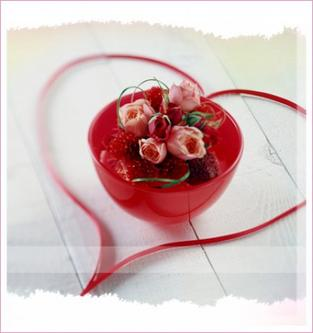
 
<strong>Video Clip Lời Yêu Thương 2008 - SN lần 8 Thay Lời Muốn Nói</strong> 
 
<embed src="http://media.tuoitre.com.vn/Stream/Videoclip/VHVN/2008/loiyeuthuong2008a.wmv" width="425" height="355" type="application/x-shockwave-flash" wmode="transparent" allowScriptAccess="none">
 
Lời yêu thương 2008- là chủ đề của Sinh nhật lần 8, Thay lời muốn nói. Thay lời muốn nói lần này hay, đi vào nhiều thế hệ khác nhau từ những bạn trẻ cho đến các cô chú, các bác lục tuần... nhớ nhớt khi xem lại đọan kể về "Bạn Đời" (chủ đề của thay Lời muốn nói trước) thấy nhiều người bật khóc, tình cảm con người là vậy, khi được khơi gợi thì mãnh liệt lắm.
 

 
Một đêm 20/04/08 đáng nhớ, lần đầu tiên được đi xem trược tiếp chương trình này ở Đài Truyền Hình, cũng khá bất ngờ khi được tin có vé tặng đi coi :D. 1 đêm gặp được các ca sĩ mình yêu thích, Cẩm Ly, Mỹ Tâm, Lam Trường... gặp MC Quỳnh Hương và Thanh Bạch. Tranh thủ lên chụp hình chung . Lúc đó có ý gặp Cẩm ly xin chữ ký mà thấy không tiện nên thôi 
 
Hẹn lần sau tại đài truyền hình hoặc... trên kênh truyền hình 
</embed>

[ COMMENT: ]
* AUTHOR: 
* DATE: 04/24/2008 08:42:29
ai cha, chup ke nha...:P

--------

# TITLE: ♪♫ Mobile songs and Folkloric songs ♪♫
* DATE: 04/14/2008 07:22:16
* STATUS: publish
* BODY: 

<strong>MOBILE SONGS FOR LISTENING AND RINGTONES</strong>
 
<em>Sharing some songs that I love much and they are converted specially for mobile phone, feel free to download them as your wish.</em>
 
<strong>Quality</strong>: MPEG Audio Layer-3 at 40Kbps.  Optimized for mobile phone
 
<strong>List of songs:</strong>  L'aventurier - Indochine.mp3  Love Is Blue - Richard Clayderman.mp3  Low (New Radio Mix) - Flo Rida Ft. T-Pain.mp3  Ngoi Ben Em - Phan Dinh Tung.mp3  Nguoi Viet Nam - Unknown.mp3  Nothing&apos;s Gonna Change My Love For You - Richard Clayderman.mp3  Over It (Mr Mig Radio Mix) - Katharine McPhee.mp3  Pour Elise - Richard Clayderman.mp3  The End Of The World - Emi Fujita.mp3  The Phantom of The Opera - Richard Clayderman.mp3  Van Tin Minh Co Nhau - Quang Vinh & Bao Thy.mp3  We Are The World - Richard Clayderman.mp3  Yesterday - Richard Clayderman.mp3  A never ending dream - Cascada.mp3  A time for us(guitar) - Instrumental.mp3  A time for us(piano) - Instrumental.mp3  Bien Can - Tuan Ngoc.mp3  Binh yen (hong nhung) - Quang Dung.mp3  Buon oi chao mi - MINH QUAN.mp3  Concerto Pour une Jeune Fille Nomme Je t'aime - Richard Clayderman.mp3  Em Ve Toc Xanh (Quoc Bao) - Tran Thu Ha.mp3  ENCO-024 - Hugo dancing.mp3  Everything I Do, I Do It For You - Richard Clayderman.mp3  Giai dieu tinh yeu - Thuy Chi.mp3  Greensleeves - Richard Clayderman.mp3  Heaven - DJ Sammy.mp3  Khong Con Mua Thu - Hong Nhung.mp3  Khong loi - Yanni.mp3  Kite-ra mitera (Khung Long con ham an) - Kuko.mp3
<a href="http://khacbiet.com/shared/MobileSongs.zip"> 
<strong> DOWNLOAD HERE</strong></a> (32MB)  <strong>    VIETNAM FOLKLORIC LYRICS COLLECTION</strong>
 
 <blockquote> 
<em>Xem thêm</em>:
</blockquote> <ul> <li><a title="Lý miền Nam - Lý Việt Nam" href="http://blog.360.yahoo.com/blog-hqMRnlsrfqoplQgx4KwjfA--?cq=1&p=602">Lý miền Nam - Lý Việt Nam</a>  <li><a title="Dân ca Việt Nam & Dân ca Nam bộ" href="http://blog.360.yahoo.com/blog-hqMRnlsrfqoplQgx4KwjfA--?cq=1&p=599">Dân ca Việt Nam & Dân ca Nam bộ</a></li></ul>
 
<a href="http://khacbiet.com/shared/Ly%20va%20Ca%20dao%20collection.zip"><strong>DOWNLOAD HERE</strong></a> (516 KB)
 
<strong><strong></strong></strong>
 
<strong><strong>   VIETNAM FOLKLORIC - HÁT LÝ MUSIC COLLECTION</strong></strong>
 
<a href="http://khacbiet.com/shared/Collection%20-%20Hat%20Ly%20Viet%20Nam.zip"><strong>DOWNLOAD HERE</strong></a><strong> </strong>(232 MB)
 
<em>"Please spread this link to friend to spread Vietnamese Folklore Music to everyone..."  Thank you!</em>
</li>

--------

# TITLE: Lý miền Nam - Lý Việt Nam
* DATE: 04/09/2008 08:08:18
* STATUS: publish
* BODY: 

 
<em>Dân ca - hát lý, một thể loại nhạc mà ít người thích nhưng thật ra đó là những bài hát rất hay, mà tự bản thân nó lại mang trong mình nó nhiều ý nghĩa sâu xa, chứa đựng một chút gì đó rất riêng Việt Nam. Lời nhạc như những dòng thơ, những án văn tuy mộc mạc nhưng ý nghĩa thâm sâu, tình cảm nhẹ nhàng nhưng nồng nàng, dễ xúc động lòng người. Đó chính là thể loại dân ca mà cụ thể là hát lý. Dạo một vòng quanh thế giới web thì chúng ta dễ dàng tìm thấy rất nhiều bài hát loại này và rất hay. Vì vậy, mình mạo muội post entry này với mong muốn duy nhất là sẽ có thêm nhiều người yêu thích thể nhạc cổ truyền Việt nam này. Tất nhiên với khả năng có hạn rất mong nhận được đóng góp và ủng hộ. Thân mến.</em>
 

 

 
<em>".......Khởi đầu bằng 1 chút nhạc......."</em>  <embed src="http://ytuongsangtaovn.com/360/kbmusic/mediaplayer.swf" width="360" height="69" type="application/x-shockwave-flash" flashvars="file=http://www.khacbiet.com/xibolomeocon/Various%20Artist%20-%20Lien%20Khuc%20Dan%20Ca.mp3&autostart=false&lightcolor=0x339933&backcolor=0xEEEDEA&frontcolor=0x000066&displayheight=50" wmode="transparent" allowScriptAccess="none">  <em>Music & player hosted by zelonght  </em>
 
<strong>Qua Cầu Gió Bay</strong>
 
Yêu nhau cởi áo ối trao nhau  Về nhà dối mẹ  chu Về nhà dối mẹ 
 
Yêu nhau cởi áo ối à trao nhau  Về nhà dối rằng cha dối mẹ a à a á a  Rằng a ối a à qua cầu, Rằng a ối a à qua cầu,  tình Rằng tình gió bay, tình Rằng tình gió bay 
 
Yêu nhau cởi dép ối à cho nhau  Về nhà dối rằng cha dối mẹ a à a á a  Rằng a ối a à qua cầu, Rằng a ối a à qua cầu,  tình Rằng tình gió bay, tình Rằng tình gió bay 
 
Yêu nhau cởi nhẫn ối à trao nhau  Về nhà dối rằng cha dối mẹ a à a á a  Rằng a ối a à qua cầu, Rằng a ối a à qua cầu,  tình Rằng tình gió bay, tình Rằng tình gió bay 
 
<strong>Ngẫu Hứng Lý Qua Cầu</strong>  Sáng tác: Trần Tiến
 
Bằng lòng đi em về với quê anh  Một cù lao xanh một giòng sông xanh  Một vườn cây xanh hoa trái đơm hương  Thuyền ai qua sông nụ cười mênh mông  Bằng lòng đi em anh đưa đón qua cầu  Mùa mưa, cầu tre dẩu khó đưa dâu  Bằng lòng theo anh dưới mái tranh nghèo  Về đây người quê chỉ có tấm lòng  Có chiếc xuồng ba lá để yêu nhau 
 
Ôi đóa hoa tím trôi liu riu  Giòng sông nước chảy liu riu  Anh thấy em nhỏ xíu, nhỏ xíu anh thương...o o o  Ôi những đêm ngắm trăng, nhớ em buồn muốn khóc  Mình ai ca điệu lý qua cầu 
 
<strong>Tát Nước Đầu Đình</strong>  Sáng tác: Y Vân
 
Ðêm qua tát nước í a chứ đầu đình  Trời đêm sáng tỏ chu cái đêm trăng rằm  Bỏ quên chiếc áo chứ trên cành là hoa sen, Là cành hoa sen ớ ơ  Em được thì cho anh xin.. nhe  Hay là em để chứ làm tin làm tin trong nhà 
 
Ơi hỡi chàng ơi chứ tình rằng ơi hỡi chàng ơi....chàng ơi  Áo anh sứt chỉ chứ đường tà.. chứ biết rằng  Vợ anh chưa có chứ mẹ già, mẹ già chưa khâu  Mẹ già chưa khâu chứ tình rằng tình vẫn chưa khâu 
 
<strong>Yêu Nhau Ghét Nhau</strong>  Sáng tác: Vy Nhật Tảo
 
Yêu nhau cởi áo cho nhau,  về nhà Mẹ hỏi .. qua cầu gió bay  Yêu nhau chẳng ngại đường xa,  một ngày không đến thì ba bốn ngày   Yêu nhau mấy núi cũng leo,  mấy sông cũng lội, mấy đèo cũng qua.  Yêu nhau chẳng ngại đường xa,  đá vàng cũng quí phong ba cung liều 
 
Yêu nhau kéo áo đắp chung,  ghét nhau nắng dãi mưa dầm mặc nhau  Yêu nhau con mắt liếc qua,  ghét nhau ném đá vỡ đầu nhau ra. 
 
Thì ai ơi ! ai ơi xin đừng,  chưa tan buổi chợ đã chia đôi đàng.  Thì ai ơi ! ai ơi xin đừng,  yêu nhau buổi sáng, buổi chiều xa nhau.
 
<strong>Trống Cơm</strong>  Sáng tác: Phạm Duy
 
Tình bằng có cái trống cơm  Khen ai khéo vỗ  Ố mấy bông mà nên bông  Ố mấy bông mà nên bông 
 
Một đàn tang tình con rít  Một đàn tang tình con rít  Ố mấy lội, lội, lội sông  Ố mấy đi tìm, em nhớ thương ai  Đôi con mắt ố mấy lim dim  Đôi con mắt ố mấy lim dim 
 
Một bầy tang tình con nhện  Ô ố ô ô mấy giăng tơ  Giăng tơ ô mấy đi tìm, em nhớ thương ai  Duyên nợ khách tang bồng  Duyên nợ khách tang bồng  (repeat)
 
<strong>Tùy hứng lý ngựa ô</strong>  Sáng tác: Trần Tiến
 
Khớp! Khớp! Khớp! Khớp!  Con ngựa ô! ô! ô! ô để anh  Khớp!  Khớp con ngựa ô  Ngựa Ô!   Đêm phuơng Nam nằm nghe dòng sông nước chảy  (hò ơ hơ ớ hò ơ)  Nghe một tiếng ầu ơ nửa đêm bão giông  (ứ hư hừ ứ hư)  Đêm phuơng Nam nằm nghe đường xa vó ngựa  Nghe từ thuở hồng hoang ngựa qua bến sông  Đêm phương Nam nhìn lên mây bay khói toả  Nhìn hòn đá lăn  Nghiêng, nghiêng!  Nghiêng nghiêng câu ca dao,  nghiêng nghiêng mái chèo  Dưới bóng cây ngô đồng  Có con ngựa dừng chân  Có hai người hôn nhau
 
Khớp! Khớp!  Khớp con ngựa ô ngựa ô ngựa ô  Ngàn năm thuơng nhớ đất nước  Có bao bài ca tình yêu ngựa ô  để anh đón nàng  (ứ ư ..... ư ừ)  Cho ai yêu thuơng nhau bên nhau mãi mãi  (hò ơ hơ hớ ờ hơ)
 
Nhớ tiếng vó  Khớp con ngựa ô ngựa ô ngựa ô  Ngàn năm vang mãi tiếng vó  Có bao chàng trai về nơi đồng xanh  Để anh đón nàng  (ứ ư ..... ư ừ)  Cho ai yêu thuơng nhau bên nhau suốt đời  (hò ơ hơ hớ ờ hơ)...
 
<strong>Lý miền Nam & Lý Nam bộ</strong>
 
<strong>Lý Ba Miền: Bắc - Trung - Nam</strong><strong></strong>   Lý là một loại dân ca đặc sắc của Việt Nam. Lý có ở cả 3 miền Bắc, Trung, Nam của Việt Nam, nhưng có lẽ lý phát triển mạnh nhất ở Nam bộ.   Lời ca rất mộc mạc, chỉ hai câu thơ lục bát trong bài Lý chim khuyên như:  
 
 
Quote:
 <table cellspacing="0" cellpadding="3" border="0"> <tbody> <tr> <td style="border-right:1px inset; ">Chim khuyên ăn trái nhãn lồng  Lia thia quen chậu, vợ chồng quen hơi </td></tr></tbody></table>
 
mà được hát thành:  
 
 
Quote:
 <table cellspacing="0" cellpadding="3" border="0"> <tbody> <tr> <td style="border-right:1px inset; ">Chim khuyên (quầy a) ăn trái (quây a) Nhãn lồng (à), nhãn lồng , ớ con bạn mình ơi ! Lia thia (quầy a) quen chậu (quây a) Vợ chồng (à), vợ chồng, ớ con bạn quen hơi. </td></tr></tbody></table>
 
Miền Trung có thể nói là trung tâm của các điệu lý và họ Lý có nghĩa là hát của giai cấp dân quê (do chữ lý làng mà ra), so với Ca Huế thuộc giai cấp vua chúa, quan liêu trí thức. Tất cả điệu lý được thoát thai từ các bài hát chèo, ca Huế, hát tuồng, và hát cải lương.   Ðiệu lý giao duyên bốn mùa hay lý vọng phu được hát theo điệu Nam ai Trung chuyển sang Ai Oán Nam khi xuống tới miền Nam và trở thành lý bốn mùa hay lý ru con. Thể thơ được dùng là thất ngôn:  Thí dụ như:  
 
 
Quote:
 <table cellspacing="0" cellpadding="3" border="0"> <tbody> <tr> <td style="border-right:1px inset; ">Giãi sông Ngân mây rầu rầu chuyển  Một bước đường trời biển chia hai  Hỡi nàng nàng ơi!  Anh dặn một lời xưa nhớ đừng quên. </td></tr></tbody></table>
 
Từ đó các nhà nho mới đem vào Ca Huế và đổi tên lại thành lý giao duyên 12 tháng như:  
 
 
Quote:
 <table cellspacing="0" cellpadding="3" border="0"> <tbody> <tr> <td style="border-right:1px inset; ">Ðầu tháng giêng mãn thiên xuân sắc  Ai nấy vui mưng thiếp bặt mắt trông  Qua tháng hai bông hoa nhài ướm nở  Thiếp luống trông chàng vừa trở gió đông,  v.v... </td></tr></tbody></table>
 
Hát giao duyên với loại thơ thất ngôn cũng được dùng trong hát chèo. Ðến khi bài Lý giao duyên được sử dụng với thể thơ lục bát qua hai câu thơ:  
 
 
Quote:
 <table cellspacing="0" cellpadding="3" border="0"> <tbody> <tr> <td style="border-right:1px inset; ">Ai đem con sáo sang sông  Ðể cho con sáo sổ lồng bay xa. </td></tr></tbody></table>
 
Thì lại được đổi lại là Lý con sáo. Ðiệu Lý con sáo rất được quãng bá ở ba miền Bắc, Trung, Nam. Mỗi miền với thang âm đặc thù đã tạo ra ba điệu lý khác nhau: Lý con sáo Bắc, Lý con sáo Trung, và Lý con sáo Nam. Ngoài ra, chúng ta còn biết thêm một điệu Lý con sáo nữa là Lý con sáo Quảng.   Ở Thừa Thiên, khi hát bài lý con sáo, thay vì hát đoạn "ơi người ơi", lại hát "tang tình tang". Bài lý con sáo được gọi là Lý tình tang,và khi hát bài 10 thương thì được đổi thành lý mười thương.   Các điệu lý đều dựa trên thể thơ lục bát trên âm giai tứ cung nhu bài lý ba cô, lý lượn, hoặc âm giai ngũ cung như bài lý bắt bướm hay lý cây đa.   Nghệ thuật sử dụng thể thơ lục bát của người Việt rất tài tình. Qua hai bài Lý con sáo Trung và Nam, chúng ta nhận thấy dân tộc Việt Nam đưa vào những tiếng đệm bằng cách lập lại những chữ trong câu chẳng hạn nhu "í a, ố tang tình tang", vv mà làm cho nhạc điệu trở nên phong phú vô cùng.  Dân ca do đó đi sâu vào lòng dân và đôi khi còn ảnh hương rất mạnh vào nhạc thính phòng Ca Huế hay Ðàn Tài Tử miền Nam hoặc vào các điệu hát Chèo, Cải lương.  Hò, lý, hát hội với Trống quân, Quan Họ, Hát phường vải, Hát ghẹo, Hát xoan, cò lả,vv... rất gần với chúng ta qua lời ca đơn giản, diễn đạt tất cả hình ảnh sống động của xã hội nông thôn Việt Nam và mỗi người hát là một nhà thơ.   <strong>Sưc Hấp Dẫn Của Những Ðiệu Lý Việt Nam </strong><strong></strong> 
 
 
Quote:
 <table cellspacing="0" cellpadding="3" border="0"> <tbody> <tr> <td style="border-right:1px inset; ">Thương nhau trường đoạn đoạn trường  Lụy lưu lưu lụy dạ dường kim châm  (Lý thương nhau) </td></tr></tbody></table>
 
Hoặc điệu "lí năm canh" diễn tả nỗi lòng nhớ nhưng chờ đợi, âu lo:  
 
 
Quote:
 <table cellspacing="0" cellpadding="3" border="0"> <tbody> <tr> <td style="border-right:1px inset; ">Canh một thơ thẩn vào ra  Chờ trăng lặn chờ ba, ba tàn. </td></tr></tbody></table>
 
Những bài hát nói đến tình vợ chồng thường đượm vẻ buồn sâu xa thầm kín khác với những bài hát khắc họa tình yêu trai gái hồn nhiên như Lí xăm xăn, Lí cây bông.  
 
 
Quote:
 <table cellspacing="0" cellpadding="3" border="0"> <tbody> <tr> <td style="border-right:1px inset; ">Bông xanh bông trắng bông vàng  Bông lê bông lựu đố nàng mấy bông </td></tr></tbody></table>
 
Những bài Lý ở miền Nam có đặc điểm là ngắn gọn, mỗi bài chỉ có một lời, giai điệu có những quãng nhảy xa tạo nên sắc thái sâu lắng trầm mặc hơn so với các miền khác (nhất là ở những nốt bán âm giàu tính chất thương cảm). Phần lớn những bài hát đều mang phong cách ca xướng, Lý chiều chiều là mựt trong những bài hát giao duyên tự sự hay nhất trong kho tàng dân ca miền Nam với những câu hát mộc mạc đằm thắm.  
 
 
Quote:
 <table cellspacing="0" cellpadding="3" border="0"> <tbody> <tr> <td style="border-right:1px inset; ">Chiều chiều ra đứng lầu tây  Thấy cô gánh nước tưới cây ngô đồng  Xui trong lòng tui thương  Thương cô tưới cây ngô đồng </td></tr></tbody></table>
 
Và ai mà không chạnh lòng xao xuyến khi nghe những câu hát thắm đượm ân tình của Lý vọng phu. Âm điệu từ khúc hát vang chứa đựng bao nhiên uẩn khúc của người vợ trông chồng suốt những năm tháng biệt ly cách trở.  
 
 
Quote:
 <table cellspacing="0" cellpadding="3" border="0"> <tbody> <tr> <td style="border-right:1px inset; ">"Cái dạ em trông chàng mà không thấy chàng đâu" </td></tr></tbody></table>
 
Nỗi đau chất chứa đến nỗi bật ra câu hát:  
 
 
Quote:
 <table cellspacing="0" cellpadding="3" border="0"> <tbody> <tr> <td style="border-right:1px inset; ">"Chi mà tệ tệ lắm chàng, chi mà bạc, bạc lắm chàng" </td></tr></tbody></table>
 
Cùng lới Lí vọng phu làn điệu Lí tàng tít cũng xuất hiện nhiều trên sân khấu tuồng và dân ca kịch bài chòi của những tỉnh miền Trung. Có người cho rằng hai điệu lí ấy được hình thành từ sân khấu truyền thống khu V (Lập luận này thiếu sức thuyết phục vì sân khấu thuộc loại hình nghệ thuật sinh sau đẻ muộn). Có thể những âm điệu này sẵn trong dân gian và sau đó được các tác giả đưa vào sân khấu với những biến dạng cần thiết để phù hợp với nội dung kịch bản, chẳng hạn:  
 
 
Quote:
 <table cellspacing="0" cellpadding="3" border="0"> <tbody> <tr> <td style="border-right:1px inset; ">"Nín mà nghe qua ru qua hát, dạo quanh vòng bót gác xem chơi" </td></tr></tbody></table>
 
Tuy vậy phần gốc của câu hát vẫn được giữ nguyên vẹn:  
 
 
Quote:
 <table cellspacing="0" cellpadding="3" border="0"> <tbody> <tr> <td style="border-right:1px inset; ">"Tàng tít tang nòn nang tít tàng tàng" </td></tr></tbody></table>
 
Chính vì nắm được thanh âm đặc trưng của làn điệu này mà nhạc sĩ Phan Huỳnh Điểu đã vận dụng một cách tài tình khi sáng tác ca khúc nổi tiếng "Quảng Nam yêu thương". Bên cạnh những điệu lí ngân nga như khúc tâm tình của người dân miền Trung còn có nhiều điệu lí âm điệu sinh động, tiết tấu sôi nổi, khắc họa rõ nét những sinh hoạt đời thường. Lí đi chợ dí dỏm, hồn nhiên miêu tả cảnh bán mua:  
 
 
Quote:
 <table cellspacing="0" cellpadding="3" border="0"> <tbody> <tr> <td style="border-right:1px inset; ">Rủ nhau đi chợ sông Hàn  Trước thời bán vặt, sau là mua ăn. </td></tr></tbody></table>
 
Hoặc nhịp điệu dập dồn trong Lí thương:  
 
 
Quote:
 <table cellspacing="0" cellpadding="3" border="0"> <tbody> <tr> <td style="border-right:1px inset; ">Xem lên hòn núi Thiên Thai  Thấy đôi Chiền Chiện ăn xoài chín cây </td></tr></tbody></table>
 
Lí ngựa ô có mặt trên khắp ba miền Bắc - Trung - Nam, nhưng tại Quảng Nam làn điệu này có những nét riêng, kín đáo, sâu sắc.  
 
 
Quote:
 <table cellspacing="0" cellpadding="3" border="0"> <tbody> <tr> <td style="border-right:1px inset; ">Ngựa ở yên thắng kiệu vàng  Yên tra khớp bạc đưa chàng hồi hương. </td></tr></tbody></table>
 
Mỗi làn điệu của lí có phong vị độc đáo, có dáng dấp riêng, rất súc tích và khá uyển chuyển trong sự thể hiện nội dung. Từ các câu ca dao quen thuộc, ông cha ta đã phá vỡ tiết điệu sẵn có của thể thơ sáu tám bằng cách xử lý tài tình hệ thống tiếng đệm, tiếng láy đưa hơi với phong cách điệp từ í a, tình tang, là, mà, trông... để ngâm ngợi thêm tô đậm thêm những chỗ nhấn giàu màu sắc cho làn điệu và làm đa dạng thêm cảm xúc của người hát.  Chúng ta cũng có thể nhận thấy càng vào phía Nam, các làn điệu dân ca càng có xu hướng bổ sung thêm dạng thang âm có bán cung. Đó là điệu thức oán, dần dà trở thành dạng đặc thù trong ca nhạc truyền thống các tỉnh phía Nam. Các điệu lí cũng vận dụng hầu hết dạng thang âm điệu thức dân tộc, chính vì thế mỗi làn điệu đều có sức hấp dẫn riêng của nó để có thể lưu truyền từ đời này sang đời khác, dù có thay đổi chút ít nhưng vẫn giữ được trực âm chính trong hệ thống ngũ cung nguyên bản, nhờ vậy người nghe khó nhầm lẫn giữa điệu lí của vùng này với vùng khác. Như mạch nước ngầm, những điệu hát lí có sức lan tỏa rộng khắp trong nhân dân và trở thành những viên ngọc quý trong kho tàng dân ca Việt Nam.    <strong>Lý Nam Bộ</strong><strong></strong>   Miền Nam có rất nhiều điệu hò và lý. Những bài nào không thuộc vào hò thì là lý. Có nhiều điệu Lý: Lý chim khuyên, Lý bông lựu, Lý chuồn chuồn, Lý cây chanh, Lý chè hương, Lý bỏ bìa, Lý con khỉ đột, Lý ngựa ô, Lý quạ kêu… Đó là những điệu hát dân gian từ vùng Bình Trị Thiên vào tới miền Nam, vùng đồng bằng sông Cửu Long. Hơn 200 bài Lý đã được thu thập ở miền Nam. Nhạc điệu dựa trên thang âm ngũ cung miền Nam (do-mi-fa-sol-la-đo, dây oán) thêm vào những tiếng luyến láy, tiếng đệm làm cho làn điệu thêm phong phú, và tiết tấu thường là nhịp đôi (2/4 hay 4/4).   Người dân miền Nam đặt tên cho các điệu lý dựa trên tên thú vật (Lý con mèo, Lý khỉ đột, Lý con nhái, Lý con cua, Lý con sáo, Lý con quạ, Lý con nhạn, Lý con kiến, Lý con thằn lằn, Lý chim khuyên, Lý con trâu, Lý con cúm núm, Lý chuồn chuồn, Lý ngựa ô, Lý quạ kêu, vv...), tên cây cỏ (Lý bông sen, Lý bông lựu, Lý cây khế, Lý bắp non, Lý bụi chuối, Lý lựu lê, Lý cây chanh, Lý mù u) , tên các món ăn (Lý bánh ít, Lý bánh canh, Lý dĩa bánh bò, Lý ăn giỗ, Lý bánh tráng - có lẽ người miền Nam thích ăn uống), hay tên phong cảnh (Lý cảnh chùa, Lý quán rượu)...(sưu tầm)   Lý Nam bộ không chỉ phong phú về số lượng mà cả về đề tài, nội dung cũng như đặc tính âm nhạc. Lý Nam bộ đề cập đến các sinh hoạt, các công việc và tâm trạng, tâm hồn của người dân. Lý còn đề cập đến các loài vật, các loại cây, các thứ hoa trái, nói về tình yêu nam nữ, tình nghĩa vợ chồng. Có những bài ca nói lên những ước mơ của người dân bình thường, hoặc phê phán châm biếm những cảnh chướng tai gai mắt. Lý Nam bộ thực sự là một thể loại phản ánh cuộc sống, cách suy nghĩ và tính cách của người Việt ở Nam bộ.   Mặc dầu ở Lý Nam bộ có đủ mọi sắc thái nhưng có lẽ những nét buồn là sâu đậm hơn, đồng thời lại hồn nhiên mộc mạc và hóm hỉnh ngộ nghĩnh
 
Sưu tầm & tổng hợp. (C)2003 - 2008 Zelonght
</embed>

[ COMMENT: ]
* AUTHOR: 
* DATE: 04/10/2008 18:55:28
Ac ac, mới post comment l뮠rồi đ㵠mất ti뵬 blog bị cࡧiựt hic. In general, b᩠viết nṠc󠲡ڥt nhiều th��tin, gi򰠢mở mang đầu 󣢠cho những ai chưa biết g졶ề nhạc l�� Lời lẽ trong c⣠b᩠l��ۙc mạc, b� dị mࡣũng cao sang, kh󠨩ểu nhỉ... So Cool! But I think u should cut it into small verses. Don't u think that it's a little bit long!

[ COMMENT: ]
* AUTHOR: 
* DATE: 05/28/2008 00:21:07
neu cach day chi 3 nam thoi ma U duoc biet ban thi that hay biet may,U se rat vinh hanh duoc la nguoi gioi thieu ban voi cau lac bo dan ca cua Dai hoc Kinh Te! Nhac dan gian cua chung ta rat hay, y tinh va giai dieu moc mac nhung lai sau xa vo cung! Entry nay lam U that xuc dong vi goi lai nhung ky niem thoi sinh vien trong U voi nhung bai hat dan gian nay! Bong nhien xuc dong qua xa, cu giong nhu la U lai tro ve voi cam giac dang dung giua nhung buoi le hoi giao luu dan ca cua truong vay! Thanks all!

[ COMMENT: ]
* AUTHOR: 
* DATE: 05/28/2008 09:39:08
* TMT: uhm, đ򮧠lࡤ᩠nhưng v졌 nghĩ n󠬠 1 b᩠hoᮠchỉnh c󠣡گt ra củng kh󠣨o việc đọc n󠮪n giử nguy뮼br />
 
* U: buổi lễ đ󠣨ắc hay lắm ha, nhạc d㮠ca hⴠtrước 1 s㮠khấu sẽ thấy dễ chịu lắm

[ COMMENT: ]
* AUTHOR: 
* DATE: 07/17/2008 08:00:10
Hihi, l㵠rồi em mới nghe lại những b᩠hⴠnṬ thật l࡭ượt mଠhay quᮠAi hⴠvậy anh? Khoe t�em cũng biết hⴠmấy b᩠nṠn謠k tệ lắm :P

[ COMMENT: ]
* AUTHOR: www.hanghieusieure.com
* DATE: 02/04/2009 04:22:08
Mời bạn tham quan website chuy뮠hᯧ Bebe của Mỹ www.hanghieusieure.com tại đ㹠bạn c󠴨ể order c⣠mặt hᯧ thời trang kh⣠của nam v࡮ữ c󠴡ڡi Mỹ.sorry neu thong tin nṠlam phien den bạn

--------

# TITLE: Dân ca Việt Nam & Dân ca Nam bộ
* DATE: 04/08/2008 17:11:55
* STATUS: publish
* BODY: 

<em>Nhạc dân ca, ca từ mộc mạc và giản dị lại mang trong nó những ý tứ sâu sắc. Nhưng ngày đầu đến với âm nhạc, tình cờ tìm đến trang web của nhạc sĩ Phạm Duy. Đọc một bài viết vế nền âm nhạc nước nhà thật thú vị. Nghiên cứu và đưa lên thế giới mạng để chia sẽ cho thế hệ trẻ Việt Nam là 1 việc làm ý nghĩa của ông. Dựa vào bài viết ấy cộng với việc thu thập, tổng hợp thêm, mình viết ra 1 topic "Dân ca Việt Nam & Dân ca Nam bộ" gửi lên tialia.com cũng khá lâu. Giờ post lên để đọc lại và chia sẻ với mọi người </em>
 
Hãy gửi message này cho các bạn của bạn nhé 
 
"<a href="http://blog.360.yahoo.com/blog-hqMRnlsrfqoplQgx4KwjfA--?cq=1&p=599#Dan_ca_Viet_Nam&Dan_ca_Nam_Bo">http://blog.360.yahoo.com/blog-hqMRnlsrfqoplQgx4KwjfA--?cq=1&p=599#Dan_ca_Viet_Nam&Dan_ca_Nam_Bo</a> mình thấy topic này khá hay về nhạc dân caViệt Nam. Gửi bạn cùng xem"
 
<em>* * *</em> 
 
<strong>Sơ Lược Về Dân Ca</strong>   <strong>Nguồn gốc: </strong> Dân ca là những bài hát, khúc ca được sáng tác và lưu truyền trong dân gian mà không thuộc về riêng một tác giả nào. Đầu tiên bài hát có thể do một người nghĩ ra rồi truyền miệng qua nhiều người, từ đời này qua đời khác và được phổ biến ở từng vùng, từng dân tộc… Các bài dân ca được gọt giũa, sàng lọc qua nhiều năm tháng bền vững cùng với thời gian.   <strong>Âm điệu, phong cách & bản sắc: </strong> Dân ca của mỗi nước, mỗi dân tộc hay của mỗi vùng, mỗi miền đều có âm điệu, phong cách riêng biệt. Sự khác nhau này tùy thuộc vào môi trường sống, hoàn cảnh địa lý và đặc biệt là ngôn ngữ. (Ví dụ: dân ca các dân tộc Tây Nguyên khác với dân ca Nam Bộ…). Nhiều bài dân ca đã đạt tới trình độ nghệ thuật cao và có sức hấp dẫn, truyền cảm mạnh mẽ, được phổ biến sâu rộng.   Việt Nam là một quốc gia đa dân tộc với nền văn hóa lâu đời, do đó dân ca Việt Nam thật phong phú. Đa dạng. Kho tàng dân ca Việt Nam bao gồm nhiều vùng miền, nhiều thể loại: Dân ca quan họ ở Bắc Ninh, hát Xoan ở Phú Thọ, hát Ví, hát Trống quân ở nhiều làng quê Bắc bộ, hát Dô ở Hà Tây, hát Ví dặm ở Nghệ An, Hà Tĩnh… ở Trung bộ có Hò Huế, Lý Huế, hát Sắc bùa… ở Nam bộ có các điệu Lý, điệu Hò, nói thơ… Dân ca của các dân tộc miền núi phía Bắc (đồng bào Thái, H' Mông, Mường…), dân ca của các dân tộc Tây Nguyên (Gia-rai, Ê-đê, Ba-na, Xơ-đăng…) đều có bản sắc riêng.   Từ bao đời nay, dân ca gắn bó với đời sống văn hóa và tinh thần của cộng đồng các dân tộc trên khắp dải đất Việt Nam.   <strong>Hình thức: </strong> Ngoài những làn điệu thuộc các loại dân ca khác nhau còn có những loại hát có nhạc đệm theo như Chầu Văn, ca trù, ca Huế, ca Quảng, nhạc tài tử miền Nam… và những hình thức ca kịch dân tộc độc đáo như Tuồng, Chèo, Cải lương…   <strong>Gìn giữ và lưu truyền: </strong> Dân ca luôn được bổ sung và phát triển. Nhiều nhạc sĩ đã dùng chất liệu dân ca để sáng tác nên những bài hát và bản nhạc mới đậm đà màu sắc dân tộc, trở thành những tiêt mục biễu diễn rất hấp dẫn.   Học hát, nghe các làn điệu dân ca và tìm hiểu về dân ca Việt Nam, chúng ta càng thêm yêu mến và tự hào về nhân dân ta, đất nước ta. Dân ca là sản phẩm tinh thần quý giá của cha ông để lại, càng trân trọng, giữ gìn, học tập và tiếp tục phát triển vốn quý ấy.    <strong>Sơ Lược về Dân Ca Việt Nam</strong>   Dân ca Việt Nam rất là phong phú. Tất cả những bài ca do dân quê sáng tác và không thuộc nhạc triều đình, nhạc thính phòng, nhạc tôn giáo thì được xếp vào loại dân ca.   Xứ Việt Nam với hơn 80 triệu người Việt và 53 sắc tộc khác nhau thừa hương một truyền thống dân ca đa diện.   Ðịnh nghĩa danh từ dân ca, theo tôi, là những bài ca không biết ai là tác giả, được truyền miệng từ đời này sang đời khác, dính liền với đời sống hàng ngày của người dân quê, từ bài hát ru con, sang các bài hát trẻ em lúc vui chơi, đến các loại hát lúc làm việc, hát đối đáp lúc lễ hội thường niên.   Dân ca lại mang một màu sắc địa phương đặc biệt, tùy theo phong tục, ngôn ngữ, giọng nói, và âm nhạc tính từng vùng mà khác đi đôi chút. Nhưng nhìn chung, vẫn là bài hát thoát thai từ lòng dân quê với tính chất mộc mạc, giản dị của nọ   Dân ca Việt Nam được trình bày theo trình tự một đời người, nghĩa là bắt đầu bằng các bài hát ru em khi em bé bắt đầu chào đời, đến khi đứa bé lớn lên, trương thành và chết đi, sẽ có những bài hát liên hệ đến từng giai đoạn của một đời người.   Tôi xin bàn về các bài hát ru em và các bài hát nghe trong lúc trẻ em vui chơi, nô đùạ Chúng ta thường nghe lúc còn ấu thơ, được chị, mẹ hay bà ngoại hoặc bà nội ru cho ngủ. Loại hát này được gọi là hát ru (miền Bắc), ru con (miền Trung), hay hát đưa em, ầu ơ ví dầu (miền Nam). Âm giai dùng trong loại hát ru em được thay đổi tùy theo vùng. Ở miền Bắc, hát ru dựa vào thang âm ngũ cung (do-ré-fa-sol-la-do). Miền Trung sử dụng âm giai tứ cung (do-fa-sol-sib-do), và miền Nam thì chọn âm giai ngũ cung (do-mib-fa-la-do). Người mẹ thường bày tỏ nỗi lòng của mình, hay than van số phận hẩm hiu của mình qua bài ầu ơ ví dầụ Lời ca thường lấy trong ca dao và thể thơ là lục bát.  
 
 
Quote:
 <table border="0" cellspacing="0" cellpadding="3"> <tbody> <tr> <td style="border-right:1px inset; ">Ầu ơ Gió đưa bụi chuối sau hè  Anh mê vợ bé bỏ bè con thơ  Con thơ tay ẩm tay bồng  Tay dắt mẹ chồng đầu đội thúng bông. </td></tr></tbody></table>
Ðến khi đứa trẻ lớn lên, trong lúc chơi giỡn thường hay hát những bài mà đa số các giai điệu đều dựa trên thang âm tam cung (do-fa-sol). Chẳng hạn, khi chơi ú tìm, các trẻ em để ngón tay trỏ của mình vào trong lòng bàn tay của một em trong bọn. Một đứa trẻ hát:   
 
Quote:
 <table border="0" cellspacing="0" cellpadding="3"> <tbody> <tr> <td style="border-right:1px inset; ">Chi chi chành chành  Cái đanh thổi lửa  Con ngựa chết chương  Ba vương thượng hạ  Ba cạ đi tìm  Ú tim oà ập. </td></tr></tbody></table>
Khi nói tới tiếng "ập" thì bàn tay nắm được ngón tay người nào thì người đó nhắm mắt đếm để cho những người khác chạy đi trốn.   Ngoài ra còn có những trò chơi khác như đánh trõng, táng u, đánh dũa, hoặc là oánh tù tì (từ chữ Anh là one, two, three, nghĩa là một, hai, ba) giúp cho trẻ em Việt Nam giải trí trong khi nhàn rỗi, ngoài giờ học hỏi ở nhà trường.   <strong>Tình yêu trong dân ca Việt Nam</strong>   Dân tộc Việt Nam có một nền dân ca lâu đời và rất phong phú. Người Kinh chỉ có hát chứ không có múa như các sắc tộc khác cùng sống trên lãnh thổ Việt Nam.   Dân ca trữ tình hay hát giao duyên hay hát đối đáp giữa trai gái được nghe khắp nơi. Từ Bắc tới Nam, từ loại hát làm việc ngoài đồng (hò cấy) đến các việc làm khác như chèo thuyền (hò mái đẩy, hò mái nhì, hò sông Mã), như đập đá (hò nện) hay các công việc có tính cách tập thể (hát phường vải). Rồi các loại hát hội (Quan Họ, Trống Quân) được thịnh hành nhiều nhứt ở miền Bắc.   Tình yêu không phải chỉ có trong thể loại dân ca trữ tình. Chúng ta có thể gặp chủ đề "tình yêu" trong những bài vịnh ca, anh hùng ca, loại hát chọc ghẹo. Tình yêu nam nữ chiếm một số lượng rất quan trọng trong loại hát giao duyên.   Có một số nhà nghiên cứu cho rằng dân ca đối đáp đã xuất hiện từ nhiều thế kỷ như Hát Quan Họ ở Bắc Ninh đã được nói tới từ thời nhà Lý (thế kỷ XI) do các quan tướng tổ chức chào mừng vua khi vua trở về thăm nơi chôn nhau cắt rún. Thời nhà Trần, cũng có sách vở nói tới loại hát đối nam nữ và một số người hát nổi tiếng về nghệ thuật tức hứng nhạc và lời.   Những bài hát trữ tình cũng được thấy trong các thể loại khác: hò giã gạo miền Trung, hò miền Nam, các loại hát nghi lễ và luôn cả được sân khấu hóa để làm thành những nhạc cảnh hay hoạt cảnh múa hát (điệu Xin Hoa, Đố Chữ trong Hát Xoan, điệu Tiên Cuội tỏ tình trong Tiên Cuội, v.v.)   Từ thời hậu bán thế kỷ XX, có một số nhà nghiên cứu đã công bố những kết quả đáng được chú ý về những lối hát giao duyên (“Quan Họ Bắc Ninh” do Nguyễn Văn Phú, Lưu Hữu Phước, Tú Viêm, Nguyễn Chung Anh biên soạn; “Hát Ví Nghệ Tĩnh” của Nguyễn Chung Anh; “Hát Giặm Nghệ Tĩnh” của Nguyễn Đổng Chi và Ninh Viết Giáo; “Dân ca Người Việt” của Tú Ngọc, v.v.)   <strong>Phân loại Dân Ca Việt Nam: </strong>  <strong>Phân loại theo vùng - miền: </strong>  Thường thì sự phân loại này căn cứ vào nơi phát sinh ra những bài dân ca ấy dưới các dạng hò, vè, lý... đặc biệt là các bài dân ca Nam Bộ và dân ca quan họ Bắc Ninh.   <strong>Dân ca miền Bắc </strong> <ul> <li style="font-weight:normal; font-size:10pt; font-style:normal; font-family:verdana, geneva, lucida, 'lucida grande', arial, helvetica, sans-serif; font-variant:normal; ">+ Qua Cầu Gió Bay  + Hoa Thơm Bướm Lượn  + Cây Trúc Xinh  + Bèo Dạt Mây Trôi  + Giã Bạn  + Người Ở Đừng Về  + ... </li></ul><strong>Dân ca miền Trung </strong> <ul> <li style="font-weight:normal; font-size:10pt; font-style:normal; font-family:verdana, geneva, lucida, 'lucida grande', arial, helvetica, sans-serif; font-variant:normal; ">+ Lý Thiên Thai  + Hò Khoan Lệ Thủy  + ... </li></ul><strong>Dân ca Tây Nguyên & dân ca miền núi </strong> <ul> <li style="font-weight:normal; font-size:10pt; font-style:normal; font-family:verdana, geneva, lucida, 'lucida grande', arial, helvetica, sans-serif; font-variant:normal; ">+ Chặt Gỗ Đóng Thuyền  + ... </li></ul><strong>Dân ca Nam bộ </strong> <ul> <li style="font-weight:normal; font-size:10pt; font-style:normal; font-family:verdana, geneva, lucida, 'lucida grande', arial, helvetica, sans-serif; font-variant:normal; ">+ Ru Con  + Lý Ngựa Ô  + Lý Bằng Răng  + Lý Chiều Chiều  + ... </li></ul><strong>Dân ca vùng khác…</strong>  <ul> <li style="font-weight:normal; font-size:10pt; font-style:normal; font-family:verdana, geneva, lucida, 'lucida grande', arial, helvetica, sans-serif; font-variant:normal; ">+ Bóng Em (dân ca Chàm)  + ... </li></ul> <strong>Phân loại dưa trên thể loại dân ca Việt Nam:</strong>   <strong>Cải lương</strong>   So với chèo và tuồng, cải lương là loại hình nghệ thuật sinh sau đẻ muộn. Nếu tuồng mang tính chất cung đình, chèo mang tính chất dân dã nông thôn, thì cải lương mang tính chất thành thị. Cái nôi của cải lương là vùng đồng bằng sông Cửu Long. Trong bộ môn nghệ thuật này, giọng ca (hát) giữ vai trò rất quan trọng. Giọng ca ngọt ngào mùi mẫn rót vào tai khán giả là vở diễn đã thành công hơn một nửa.   <strong>Ca nhạc Huế</strong>   Lúc đầu chỉ là thể loại ca nhạc thính phòng, hình thành đầu thế kỷ XIX dưới triều các vua Nguyễn, phục vụ trong cung đình. Đời vua Tự Đức (1848 - 1883) ca nhạc Huế phát triển đến đỉnh cao, được truyền bá rộng trong dân gian, được nhân dân bổ sung những điệu Hò, điệu Lý... Ca nhạc Huế từ đó được sân khấu hoá như các loại hình sân khấu khác.   Thưởng thức ca nhạc Huế, người nghe cảm nhận được sự đan xen nhuần nhuyễn giữa dòng ca nhạc cung đình và dân ca miền Trung.   <strong>Chèo</strong>   Là sản phẩm của vùng đồng bằng sông Hồng. Chèo bao gồm múa, hát, âm nhạc. Giữa người xem và người diễn có sự giao lưu. Lời văn trong tích trò đậm mầu sắc trữ tình của ca dao tục ngữ, tràn đầy tính lạc quan trong những tiếng cười thông minh, hóm hỉnh và trí tuệ.   Chèo có thể diễn ở sân khấu, nhà hát. Chèo cũng có thể diễn trên một chiếc chiếu ở giữa sân đình và chỉ với 3 nhân vật: 1 đào, 1 kép và 1 vai hề là đã nổi đình đám. ở đây phải kể đến ma lực của tiếng trống chèo. Tiếng trống chèo cất lên có sức lôi cuốn con người, làm cho người ta không thể không đến xem chèo. Bên cạnh tiếng trống, vai hề tưởng như phụ nhưng lại rất quan trọng trong vở diễn. Hề làm cho khán giả rơi nước mắt. Hề cũng lại làm cho khán giả cười đến vỡ bụng.   Những vở chèo Trương Viên, Kim Nham, Lưu Bình - Dương Lễ, Quan Âm Thị Kính đã được xếp vào vốn quý của sân khấu cổ truyền.   <strong>Hát Chầu Văn</strong>   Gắn với một số phức hợp tín ngưỡng của người Việt, sau nhiều thế kỷ phát triển Hát văn (hoặc Hát chầu văn) đã xây dựng được nhiều kiểu gõ nhịp và một hệ thống làn điệu, bài bản phong phú với những quy ước về cách vận dụng cho từng hàng Thánh và từng loại Phủ.   Bên cạnh ba hệ thống làn điệu của riêng mình Cờn, Dọc, Xá hát văn còn du nạp nhiều bài bản, làn điệu từ các thể loại dân ca nhạc cổ khác.   Nhịp điệu và bộ gõ có vai trò đặc biệt quan trọng trong sinh hoạt tín ngưỡng này. Chúng tạo nên một không khí phấn hứng cao, góp phần người ngồi đồng có cảm giác thoát xác để nhập thân vào các vị Thánh, đồng thời kết hợp với yếu tố tâm linh chúng góp phần tạo nên một trạng thái tinh thần đặc biệt kiến người ta có thể thực thiện được những việc mà ở trạng thái bình thường khó có thể làm nổi.   Hát văn cùng với tục hầu bóng tiêu biểu cho một loại hình sinh hoạt tính ngưỡng tồn tại ở nhiều tộc trong nước. Ngoài yếu tố tâm linh, sự hấp dẫn của phần ca nhạc xưa kia cũng đã từng khiến nhiều người say mê. ngày nay những điệu Hát văn được giới thiệu với nội dung mới trên các sóng phát thanh và trên sân khấu ca múa nhạc vẫn là những mục được công chúng yêu thích.   <strong>Ca trù</strong>   Là bộ môn nghệ thuật mang tính hàn lâm, được nuôi dưỡng giữ gìn trong dân gian suốt 10 thế kỷ qua. Nhiều làng quê ở các tỉnh, thành thuộc đồng bằng Bắc bộ như Hà Nội, Hà Tây, Bắc Ninh, Vĩnh Phúc... là những cái nôi của các làn điệu ca trù. Làng Lỗ Khê (Đông Anh - Hà Nội) dân cả làng làm nghề hát ca trù.  Thưởng thức ca trù là thưởng thức thơ và nhạc. Trong lối hát ca trù, cả người hát, người đàn, người thưởng thức đều tham gia cuộc hát. Họ phối hợp ăn ý với nhau và cũng làm cho nhạc và thơ hoà quyện vào nhau, đưa cuộc hát đạt đến sự hoàn hảo, tao nhã, trang trọng   <strong>Nhạc lễ cưới Khmer</strong>   Là một phần không thể thiếu trong đám cưới của người Khmer Nam bộ.   Ngày nay, lễ cưới của người Khmer ở Nam bộ đã có nhiều đổi thay, song những bài hát cưới cổ truyền vẫn còn được lưu giữ trong nhân dân. Các nhà nghiên cứu đã sưu tầm được hàng chục bài hát lễ và những bài dân ca được sử dụng trong đám cưới.   Mỗi bài hát tương ứng với một nghi thức của đám cưới như nghi thức đưa chú rể sang nhà gái, xin mở rào để vào nhà gái, mở màn cho cuộc vui, các lễ thức cắt tóc, giã thuốc nhuộm răng, cắt hoa cau để làm lễ rắc hoa cau cho cô dâu chú rể, lễ rút gươm khỏi bao, lễ buộc chỉ cổ tay, lễ lạy mặt trời, lễ nhập phòng, lễ quét chiếu, lễ chào cha mẹ họ hàng, ... cho tới khi tiễn khách ra về.   Những bài hát, bản nhạc cổ truyền trong đám cưới chính là tâm hồn, tính cách và là một phần cuộc sống của người dân Khmer Nam bộ.   <strong>Hát Vè / Nói Vè</strong>   Vè là một bài văn kể một chuyện đặc biệt xảy ra và ngụ ý khen chê. Bài văn làm theo thể thơ bốn chữ, năm chữ, lục bát, hay song thất lục bát hoặc các thể thơ biến thể. Hát những câu vè thường lấy giọng đọc lên, không có đệm trên, đệm giữa, hay đệm dưới như các lối hát dân ca khác, nhưng dựa trên nhịp 2/4. Ở miền Nam, những câu vè về trái cây, các loại cá, các thứ bánh, vv... ngoài lối vè kể chuyện. Các câu vè thường bắt đầu bằng sáu chữ  Nghe vẻ nghe ve Nghe ve  Thí dụ vè trái cây:   
 
Quote:
 <table border="0" cellspacing="0" cellpadding="3"> <tbody> <tr> <td style="border-right:1px inset; ">Nghe vẻ nghe ve  Nghe vè trái cây  Dây ở trên mây  Là trái đậu rồng  Có vợ có chồng  Là trái đu đủ  Chặt ra nhiều mủ  Là trái mít ướt  Hình tựa gà xước  Vốn thiệt trái thơm  Cái đầu chơm bơm  Ðúng là bắp nấu  Hình thù xâu xấu  Trái cà dái dê  Ngứa mà gãi mê  Là trái mắt mèo  v.v.. </td></tr></tbody></table>
Hát vè để tiêu khiển trong lúc làm việc, hát lúc nhàn rỗi một mình. Hát vè không có nhạc, nhưng có tiết điệu. Gần đây ở Việt Nam, có nhiều nhóm nhạc trẻ đã chuyển hát vè thành nhạc Rap rất được ưa thích.   <strong>Các loại hát giao duyên</strong>   Có ba loại hát giao duyên hay hát trữ tình:   1. Loại hát dính liền với tục lệ kết bạn  2. Loại hát dính liền với cộng việc làm  3. Loại hát dính liền với đời sống hàng ngày.   <strong>Hát Ghẹo</strong>   Loại hát giao duyên với tục lệ kết bạn như trong Hát Ghẹo (Phú Thọ) và Quan Họ (Bắc Ninh) chỉ có thể thấy ở miền Bắc mà thôi.   Hát Ghẹo và Quan Họ thường được ca hát trong dịp hội hè, lễ Tết. Điều đáng chú ý là chuyện ca hát chỉ xảy ra trong khung cảnh của những nhóm ở những làng có kết bạn với nhau. Tục lệ này ở Hát Ghẹo còn gọi là “hát nước nghĩa”.   Sự kết nghĩa giữa hai làng là một tục lệ có từ lâu đời ở Việt Nam.   Trong Hát Ghẹo, những người đi hát không tổ chức thành phường, thành họ hay thành bọn. Hàng năm, khi làng mình hoặc làng kết nghĩa mở hội thì dân làng lựa những cậu trai cô gái có giọng hát đẹp và biết rõ các bài bản để hát đối đáp. Nếu đón các người hát "kết nghĩa" thì làng cử một đoàn phụ nữ và một "bà trùm" (một người đàn bà có tuổi) ra đón tiếp và ca hát. Khi đi hát ở một làng khác thì có “ông trùm” và một nhóm đàn ông hát giỏi được gởi đi. Trong năm, những người được lựa chọn đi hát thường gặp nhau để hát chung và ôn lại những bài hát chánh của Hát ghẹo.   Khi đi hát hội, những người hát ngồi trên chiếu hoa hát đối suốt đêm với nhóm bạn “kết nghĩa”. Một đội nam đối đáp với một đội nữ, và thường phải hát có cặp, có đôi, hát đồng âm, với một giọng “dẫn” (giọng chánh), và một giọng “luồng” (giọng phụ).   Mỗi một cuộc thi hát gồm có 4 giai đoạn:   1. Hát mời ăn trầu bằng những câu hát Ví gọi là Ví Trầu   Các bạn hát nói năng rất lịch sự, gọi nhau bằng “quan anh” “quan chị” và xưng bằng em.    
 
Quote:
 <table border="0" cellspacing="0" cellpadding="3"> <tbody> <tr> <td style="border-right:1px inset; ">Em thưa với anh   Đôi nước anh em ta  Áo vải, dải gai, cổ kim chi nghĩa  Anh đưa chân ra tôn thần đã đoạn  Chị em nhà có cơi trầu đưa tay nâng lại hầu anh. </td></tr></tbody></table>
Hay là:    
 
Quote:
 <table border="0" cellspacing="0" cellpadding="3"> <tbody> <tr> <td style="border-right:1px inset; ">Em thưa với chị   Miếng trầu ăn nặng bằng chì  Ăn thì ăn vậy lấy gì trả ơn. </td></tr></tbody></table>
2. Chặng thứ hai gồm những bài hát thuộc giọng “sổng”.   Những câu hát trong chặng này bày tỏ tâm sự, ước vọng về hạnh phúc lứa đôi. Qua hai chặng trên (giọng ví và giọng sổng), cách hát của Hát Ghẹo chỉ dừng lại ở đối lời chứ chưa có đối giọng. Cả hai bên nam nữ chỉ dựa trên một làn điệu duy nhứt mà thay đổi lời ca khác nhau.   3. Chặng thứ ba là phong phú nhứt với nhiều làn điệu chung quanh chủ đề tình yêu.   Chặng này được gọi là “sang giọng”. Thường thì bắt đầu bằng câu:    
 
Quote:
 <table border="0" cellspacing="0" cellpadding="3"> <tbody> <tr> <td style="border-right:1px inset; ">Tình tang tình, tích tang tích  Anh sang giọng nào cho em sang với. </td></tr></tbody></table>
Vậy là mở màn cho chặng ba với các loại “giọng vặt”   4. Chặng thứ tư là chặng chót gồm các bài Ví tiễn để hẹn gặp nhau lần tới hát với nhau.   Có khi luyến tiếc nhau hát cả mấy tiếng đồng hồ, bịn rịn không chịu chia tay và do đó, Hát tiễn kéo dài cho tới hừng đông.   <strong>Hát Quan Họ</strong>   Hát Quan Họ là một sản phẩm âm nhạc dân gian đặc sắc nhứt của Việt Nam, có thể so sánh ngang với tranh dân gian làng Hồ (Hà Bắc), nghệ thuật xòe Thái (Tây Bắc), nghệ thuật khảm trai làng Ngô Xá (Hà Tây), và Cũng như Hát Ghẹo, Quan Họ là loại hát giao duyên có nhiều giọng điệu. Do đó đòi hỏi người hát phải có sự tập luyện công phu về sự sáng tạo giai điệu mới.   Những người đi hát thường tập hợp với nhau trong một tổ chức nhứt định, gọi là Quan Họ.   Quan Họ là một tập thể người gồm nam và nữ. Những tập thể như vậy bao giờ cũng ở cùng một làng. Số người chung một nhóm có từ 4 tới 7 người. Đứng đầu nhóm là một người đứng tuổi gọi là “Anh cả, Chị cả” hay còn gọi là “Ông già Quan Họ”, “Bà già Quan Họ”. Do đó trong các điệu hát Quan Họ người ta thường nghe những danh từ “anh hai, anh ba”, “chị hai, chị ba” do vai vế trong gia đình Quan họ.   Một làng ngày xưa ở vùng Bắc Ninh có thể có tới 10 bọn Quan Họ. Nhưng họ không có quyền kết bạn với nhau mà phải lựa một bọn ở một làng khác để kết nghĩa. Thường là một bọn nam của thôn làng này kết nghĩa với một bọn nữ của thôn làng khác. Cuộc kết nghĩa bắt đầu là cuộc gặp gỡ tại một cuộc hát hội. Bên trai vô quán mua trầu cau mời bên nữ. Nếu bên nữ nhận trầu tức là muốn nói là họ chưa có kết bạn với ai. Nếu hai bên hát tâm đầu ý hiệp ở một cuộc hát thì bọn trai mới đi tới nhà gia đình chị cả hay chị hai của bọn gái để xin phép cha mẹ của chị cả chị hai để xin kết bạn. Sau đó họ hát với nhau suốt cả đêm theo lề lối trình tự của một cuộc hát Quan họ.   Các tổ chức Quan Họ thường hát nhân dịp hội đình, chùa, đám cưới, lễ hội hàng năm. Khi đi hát, trai thì áo lụa, áo the, quần ống sớ, khăn xếp, ô lục soạn; gái thì nón thúng quai thao, mặc mớ bảy mớ ba, áo tứ thân nhiễu điều, nhiễu tía, yếm đào xẻ con nhạn, thắt lưng hoa đào, hoa lý, khuyên vàng và xà tích bạc.   Khi gặp nhau, họ ăn nói rất lịch sự khách sáo. Thí dụ khi mời ăn cơm thì nói:   “Hôm nay liền chị đã có lòng sang chơi bên đất nước nhà em, anh em nhà em chạy được mâm cơm thì đầu mâm đĩa muối, cuối mâm đĩa vừng, mâm đan bát đàn để xin mời đường quan họ dựng đũa lên chén, để anh em nhà em được thừa tiếp, ạ”   Trong bữa ăn, nếu bên nữ ăn nhỏ nhẹ thì bên nam mời khéo:    
 
Quote:
 <table border="0" cellspacing="0" cellpadding="3"> <tbody> <tr> <td style="border-right:1px inset; ">“Cơm hẩm ăn với rau dưa  Quan họ làm khách em chưa bằng lòng” </td></tr></tbody></table>
Các chị liền đáp lại như sau:    
 
Quote:
 <table border="0" cellspacing="0" cellpadding="3"> <tbody> <tr> <td style="border-right:1px inset; ">“Liền anh nói vậy chứ  Cơm trắng ăn với thịt gà  Tuy rằng ăn ít nhưng mà no lâu đấy ạ” </td></tr></tbody></table>
Khi muốn mời bên nữ hát, bên nam lên tiếng :    
 
Quote:
 <table border="0" cellspacing="0" cellpadding="3"> <tbody> <tr> <td style="border-right:1px inset; ">“Cung môn treo cửa mành mành  Gần mà chẳng được nghe canh đồng hồ" </td></tr></tbody></table>
Khi được bên trai mời hát, bên gái lại nhún mình:    
 
Quote:
 <table border="0" cellspacing="0" cellpadding="3"> <tbody> <tr> <td style="border-right:1px inset; ">“Các liền anh như ông trăng sáng khắp cả bàn dân thiên hạ, chúng em như bóng đèn dầu thấp thoáng trong nhà”. </td></tr></tbody></table>
Trong những ngày hội các Quan họ gặp nhau hát ở cửa đình (“Cây trúc xinh”) sườn đồi, bờ ao, dọc đường cái quan. Nhưng cũng có khi hát trên thuyền thúng ở ao, hồ vừa chèo thuyền vừa hát. Do đó có các bài “Ngồi tựa mạn thuyền”, “Chén son để cạnh mạn thuyền”, “Thuyền thúng”. Khi hát ở ngoài trời tất cả đều phải che dù cho phía nam và đội nón quai thao cho phía nữ.   Cuộc hát Quan Họ phải theo một trình tự cố định :   1. Mở đầu là hát giọng lề lối. Giọng xưa nhứt là Phong thu, Gửi thư, Thơ Đúm, Đàn Đúm. Ngày nay các Quan họ trẻ chỉ hát được các giọng Hừ Là, Là Rằng, Tôi Rằng, Bạn lan, Cây Gạo.   2. Sau đó tới giọng sổng và giọng vặt. Trong giọng vặt có đủ loại hát bắt nguồn từ các điệu dân ca, hát tuồng, chèo, chầu văn, v.v. Nhiều bài hát có quan hệ với bài lý (dân ca miền Trung và miền Nam) như “Lý con sáo”, “Lý Mười Thương”, “Lý cây đa”. Từ bài Lý cây đa nẩy sinh ra nhiều biến dạng “Lý Cây Đa”, “Chẻ tre đan nón”, “Trèo lên quán dốc”.   Trong dân ca Quan Họ tình yêu được bộc lộ một cách bỏng bẩy, khéo léo:    
 
Quote:
 <table border="0" cellspacing="0" cellpadding="3"> <tbody> <tr> <td style="border-right:1px inset; ">“Vợ anh như ngọc như ngà  Anh còn tình phụ nữ là thân em” </td></tr></tbody></table>
 
 
Quote:
 <table border="0" cellspacing="0" cellpadding="3"> <tbody> <tr> <td style="border-right:1px inset; ">“Em đi đêm lại sợ Ông thầy  Em đi ban ngày sợ Mẹ mấy Cha  Yêu em, anh mở cửa ra" </td></tr></tbody></table>
 
 
Quote:
 <table border="0" cellspacing="0" cellpadding="3"> <tbody> <tr> <td style="border-right:1px inset; ">"Ở nhà có mẹ cùng cha  Lẽ đâu tôi dám nguyệt hoa cùng người” </td></tr></tbody></table>
3. Có những bài quan họ mới được sáng tác gần đây. Bài “Ông Tơ” bắt nguồn từ bài “Nỗi dương sông” trong một vở tuồng sân khấu dân gian. Năm 1944, bài quan họ “Ca Đàn” được sáng tác dựa trên bài “Thu trên đảo Kinh châu” của Lê Thương, bài “Hát giã” dựa trên bản dân ca “Cò lả”. Bài “Trống Cơm” được sáng tác vào năm 1954 dựa trên một giai điệu xưa\.   4. Sau cùng là các giọng Giã bạn, tiễn bạn kéo dài cho tới sáng như trong hát Ghẹo.   <strong>Hát trống Quân</strong>   Trống Quân là một hình thức hát giao duyên rất phổ biến từ Thanh Hóa trở ra. Tục truyền rằng hát Trống Quân xuất hiện từ thời nhà Trần vào thời nhân dân ta chống giặc Nguyên. Binh sĩ chia làm hai bên vừa xướng vừa đối trong khi gõ vào trống đánh thành nhịp điệu.   Ông Phan Kế Bính, trong quyển Việt Nam phong tục, cho rằng hát Trống Quân có từ thời Nguyễn Huệ Binh lính giả thành trai gái để hát đối giải sầu trong khi hành quân đánh nhà Thanh.   Lời hát đối rất tình tứ.   Trai hỏi:    
 
Quote:
 <table border="0" cellspacing="0" cellpadding="3"> <tbody> <tr> <td style="border-right:1px inset; ">“Cái gì mà nó thấp cái gì cao  Cái gì mà sáng tỏ hơn sao trên trời.  Cái gì mà anh giải cho em ngồi  Đêm nằm thời mơ tưởng dạo chơi vườn đào.  Cái gì mà nó sắc hơn dao  Cái gì mơn mởn lòng đào thì anh bảo em.” </td></tr></tbody></table>
Gái trả lời:    
 
Quote:
 <table border="0" cellspacing="0" cellpadding="3"> <tbody> <tr> <td style="border-right:1px inset; ">“Anh hỏi thì em xin thưa  Thưa rằng thời đất thấp giời cao  Ngọn đèn thời sáng tỏ hơn sao trên giời  Chiếu hoa thời anh giải cho em ngồi  Đêm nằm thời mơ tưởng dạo chơi vườn đào  Nước trong thời nó sắc hơn dao  Trứng gà thời mơn mởn, lòng đào thì em bảo anh.” </td></tr></tbody></table>
<strong>Một số hát hội khác</strong>   Ngoài ra còn nhiều loại hát giao duyên như Hát Ghẹo Thanh Hóa, Hát Ghẹo Long Xuyên, Trống Quân Phú Thọ, Trống Quân Đức Bắc, Trống Quân Hữu Bổ, Hát Đúm Hải Dương.   Hát đò đưa thuộc huyện Thụy Anh, Thái Bình chỉ hát lúc đò đi trên sông, chứ không hát khi đò cặp bến. Có hai loại hát đò đưa: hát đường trường được hát lúc đông thuyền bè cùng đi trên sông, trai gái hát đối đáp tỏ tình với nhau, và hát bỏ lửng là hát một mình mang tính chất kể chuyện trong các sinh hoạt làm việc có loại hát Ví và hát Giặm rất thịnh hành ở miền Bắc nhứt là ở Nghệ An và Hà Tĩnh. Loại hát ví được đổi thành những tên khác nhau theo sinh hoạt: hát phường vải (Nghệ An), hát phường cấy, hát phường buôn, hát chặt củi, hát ví đò đưa, hát phường chiếu, hát phường vá lưới, hát chăn trâu, vv.. Hát Phường Vải ở Nghệ An chú trọng về thi thố văn chương. Hát phường cấy thịnh hành hơn. Mỗi ngành làm việc đều dùng cách hát đối đáp tình tứ để vơi bớt cơn mệt và chọc phá cho thoải mái.   <strong>Hát hội hay hát đối đều mang những đặc điểm chung như sau:</strong>   Người hát, làng xã, phải đối nhau chẳng hạn nhóm nam ca sĩ đối lại với nhóm nữ ca sĩ, và thuộc làng xã khác nhau   Hầu hết đều là tình ca để đưa đến hôn nhân.   Ðặc tính đoàn thể rất được nhấn mạnh, như trong quan họ có tục kết bạn và phải thuộc vào gia đình quan ho Truyền thống này được thấy ở hát ghẹo ở Thanh Hóa, và hát xoan ở Phú Thọ có tục lệ "nước nghĩa".   Thi đua là một trong những đặc tính quan trọng. Trong một cuộc hát đối, các người hát thi đua về trí nhớ, lời ca, óc nhạy bén, phải tùy cơ ứng biến, khi gặp khó khăn, tài sáng tác tùy hứng, và kỹ thuật ca hát phải có trình độ cao. Do đó, các làng xã xứ ta thường hay tổ chức hát lấy giải.   Ðặc tính bán chuyên nghiệp. Người hát quan họ phải thuộc một số bài căn bản, phải luyện tập thường xuyên. Do đó mới có tục lệ ngủ bọn, nghĩa là các người hát cùng chung một nhóm thường tựu hợp ở nhà của một người trong bọn, ăn ngủ tại đó để có thì giờ học tập với nhau và tập hát gọi là bẽ giọng.   Hát hội xảy ra trong một phạm vi địa lý nhỏ hẹp, nhất là ở Bắc Ninh, Thanh Hóa, Phú Thọ miền Bắc xứ Việt Nam mà thôi.   Mỗi cuộc thi hát như thế thường chia làm ba hay bốn giai đoạn:  <ul> <li style="font-weight:normal; font-size:10pt; font-style:normal; font-family:verdana, geneva, lucida, 'lucida grande', arial, helvetica, sans-serif; font-variant:normal; ">+ Hát mời ăn trầu trong trống quân  + Hát giọng lề lối trong quan họ  + Hát dạo, hát chào, hát mừng, hát hỏi trong hát phường vải  + Hát dạo, hát mừng, hát thăm trong hát ghẹo </li></ul>Sau khi hát mở đầu thì đến phần hát thi. Phần này, bắt đầu các bài hát khó vì phải sáng tác tại chỗ, như hát trả lời câu đố trong trống quân, giọng sỗng, giọng vặt trong quan họ,hát đố, hát đối trong phường vải, và hát đối, hát đố, hát xe kết trong hát ghẹo. Chẳng hạn như trong bài hát trả lời câu đố trong trống quân, bên gái ra câu đố thì bên trai phải giải cho trúng và đố lại. Bên nào không đối được thì kể như thua. Loại hát này được đệm bằng một nhạc khí đặc biệt là cây trống quân hay thổ cô. Một cây mây dài bốn, năm thước căng vòng cầu bắt ngang một cái hố được đào ngay điểm giữa cây mây. Một người hát đánh vào cây mây để đệm, tạo âm thanh giống như tiếng trống.   Cuộc thi hát tiếp tục sang giai đoạn ba với các bài hát khen tặng trong trống quân, hát mời, hát xe kết trong phường vải, và giọng hãm, giọng huỳnh trong quan họ.   Sau cùng là hát tiễn như trong phường vải, hát giã bạn trong quan họ, hát thề, hát dặn, hát tiễn trong hát ghẹo.   <strong>Hò</strong>   Hò từ chữ HÔ mà ra, có nghĩa là làm cho giọng mình manh hơn. Do đó, Hò thường đi đôi với việc làm nặng như kéo gỗ, chèo thuyền, đập đạ Nhưng hò cũng có thể hát lúc nghỉ ngơi, lúc hội hè, lúc đám tang như hò đưa linh, và có khi dính liền với một vùng nào đó như hò Nghệ An, hò Thanh Hóa, hò Sông Mã, hò Ðồng Tháp.   <strong>Có ba loại Hò chánh:</strong>  <ul> <li style="font-weight:normal; font-size:10pt; font-style:normal; font-family:verdana, geneva, lucida, 'lucida grande', arial, helvetica, sans-serif; font-variant:normal; ">+ Hò trong lúc làm việc, tiết điệu ăn khớp với động tác, và thường dùng những chữ như dô ta, rố khoan, hụ là khoan, vv...  + Hò trong lúc nghỉ xả hơi, thường là hò đối giữa trai gái có tính cách đùa giỡn, chọc ghẹo hay tỏ tình.  + Hò trong lúc lễ hội, thường là hò đối đáp để tranh giải. </li></ul>Hò làm việc thường hò đông người với nhaụ Một người hò trước và tất cả phụ họa theo saụ Người hò chánh gọi là hò cái và những người phụ họa gọi là hò con. Hò chia làm hai phần: lớp trống hay vế kể thì do một người hát, còn lớp mái hay vế xô thì do toàn thể phụ họa.   Ở miền Nam, hò thường nghe trên sông, hay lúc làm việc ngoài ruộng. Mỗi tỉnh, mỗi vùng có những loại hò đặc biệt. Do đó có tên gọi như hò Bến Tre, hò Cần Thơ, hò Ðồng Tháp.   Ở tỉnh Bến Tre, có thể có loại hò như sau:  Hò ớ ơ Xứ nào vui cho bằng xứ Cù Lao, ớ ợ Hò ớ ợ Tiếng muỗi kêu như ống sáo thổi Bông mọc như hàng rào sương lý, ớ ợ Hoặc xuyên qua câu hò, chúng ta có thể biết người hò thuộc địa phương nào như:   
 
Quote:
 <table border="0" cellspacing="0" cellpadding="3"> <tbody> <tr> <td style="border-right:1px inset; ">Hò, ớ ơ.  Ghe anh nhỏ mũi trắng lườn  Ở trên Gia Ðịnh xuống vườn thăm em, ớ ơ. </td></tr></tbody></table>
<strong>Hò miền Nam</strong> gồm có hò ba lý xuất xứ từ bài Bá Lý Hề của cải lương rất được thông dụng giữa các ca sĩ chuyên nghiệp. Hò theo điệu ai oán dùng để kể chuyện. A li hò lờ xuất hiện khoảng 50 năm nay thôi, dùng thể thơ lục bát. Hò lô tô, hò cấy, vv... Các loại hò thường được ứng khẩu tùy hứng, nhạc thì chỉ có một giai điệu duy nhứt, hay theo một thang âm đặc biệt miền Nam (do-mib-fa-sol-la-do).   <strong>Miền Trung</strong> là nơi tập trung của nhiều loại hò và nhiều giai điệu hơn hai miền Bắc và Nam. Ngoài loại hò làm việc, hò đối, còn có hò đưa đám mạ Ở Thanh Hóa có hò sông Mã được chia làm năm loại hò tùy theo giai đoạn: hò rời bến, hò đò ngược, hò đò xuôi, hò mắc cạn, hò cập bến, với các đoạn kể, xô nhịp nhàng theo nhịp một, nhịp hai.   Trong khi chèo thuyền, chúng ta còn được nghe các loại hò mái xấp, hò mái nhì, hò mái đẩy. Có giả thuyết cho rằng mái có nghĩa là mái chèo, và còn có giả thuyết khác nữa cho rằng mái là đàn bà đối với trống là đàn ông. Còn xấp có nghĩa là mau hơn, nhì có nghĩa là đôi, là phải hát hai lần, còn đẩy có nghĩa là làm cho thuyền đi tớị Ở vùng Thừa Thiên, Quảng Trị còn nghe hò mái ba nghĩa là phải hát ba lần.   Các loại hò làm việc như hò đạp nước, hò tát nước, hò khiêng nước, hò xay lúa, hò giã gạo, hò giã đậu, hò giã vôi, hò mài dừa,v.v...   Khi leo giốc, thì có hò leo dốc. Khi đập đá thì có hò nện hay hò hụị Tiết tấu rất nhanh, và theo nhịp đập đạ Người kể hát một đoạn, thì toàn thể hát "hụ là khoan" để làm tăng sức mạnh khi làm việc.   <strong>Ở miền Bắc</strong>, hò đẩy xe, hò kéo gỗ rất được phổ thông. Một người hát một câu thì cả đám hát rố khoan, rố khoan rố khuầy hay hố khoan trong điệu bắt cái hố khoan hay bắt cá hò khoan do các người chài lưới hát. Ngoài ra, chúng ta còn tìm thấy điệu hò giã vôi và hò dứt chỉ ở miền Bắc nữa.   Hầu hết các điệu hò ở Việt Nam đều dùng thể thơ lục bát với thể thức thêm những chữ không có nghĩa vào như "là hụ là khoan, rố khoan rố khuầy", v.v... Với nghệ thuật ngắt câu khác nhau tùy theo từng điệu hò hoàn toàn khác biệt và phong phú qua tài sáng tác của các người dân quê, kho tàng dân ca do đó ngày càng to lớn hơn và xuyên qua các lời ca trong điệu hò, chúng ta thấy một nền văn chương bình dân phản ảnh trung thực ngôn ngữ của tiếng nói Việt Nam.   <strong>Lý</strong>   Là một loại dân ca đặc sắc của Việt Nam. Lý có ở cả 3 miền Bắc, Trung, Nam của Việt Nam, nhưng có lẽ lý phát triển mạnh nhất ở Nam bộ. Miền Nam có rất nhiều điệu hò và lý. Những bài nào không thuộc vào hò thì là lý. Có Lý chim khuyên, Lý bông lựu, Lý chuồn chuồn, Lý cây chanh, Lý chè hương, Lý bỏ bìa, Lý con khỉ đột, Lý ngựa ô, Lý quạ kêu. <em>(Xem bên dưới Lý Ba Miền & Lý Nam Bộ)</em>    <strong>Dân ca Việt Nam</strong> rất phong phú, đa dạng, dính liền với bài ca hơn là với dàn nhạc, và nhạc khí. Dân ca đi liền với tiếng hát ru, đồng dao, trò chơi trẻ em, đến các điệu hò, lý, các điệu hát trong khi làm việc, trong các lễ hội tạo cơ hội cho thế hệ gặp nhau qua các loại hát giao duyên, qua tục "nước nghĩa", "kết bạn", "ngủ bọn ". Mức sáng tác bài bản mới vượt qua những thể loại nhạc cung đình, nhạc bác học, nhạc thính phòng và đưa vào trong văn chương bình dân những đóng góp đáng kể (hát quan họ, hát phường vải). Phần nhiều chỉ có tùy hứng lời trên một điệu nhạc (hát trống quân, cò lả). Chỉ có hát quan họ là vừa sáng tác lời lẫn nhạc. Hiện có trên 700 làn điệu khác nhau trong truyền thống hát quan họ. Hiểu được dân ca Việt Nam sẽ mang lại một niềm tự hào cho chính mình, tạo một sự hãnh diện trong lòng khi xứ mình có một nền văn học dân gian phong phụ Ngoài dân tộc Việt hay Kinh, chúng ta còn có 53 sắc tộc anh em sống rải rác trên khắp lãnh thổ Việt Nam với hàng trăm thể loại dân ca, nhạc khí hoàn toàn khác với dân tộc Việt.    <strong>Sơ Lược Về Dân Ca Nam Bộ</strong>   Nói đến nghệ thuật ca hát dân gian cổ truyền Nam Bộ mà chỉ đóng khung trong một số làn điệu vọng cổ hay bài bản cải lương, ca nhạc tài tử, thì quả chưa đầy đủ. Mặc dầu chúng ta không phủ nhận tính hấp dẫn, yếu tố truyền cảm gây xúc động mạnh của các thể loại ca hát đó, nhưng đứng trên góc độ nghiên cứu mà xem xét, thì sự phiến diện nói trên có thể đưa đến những nhận định không toàn diện, và hiện tượng nhầm lẫn giữa ngọn và gốc có thể xảy ra. Nội dung vấn đề trao đổi của bài viết này nhằm tìm hiểu tính chất phong phú của nền dân ca Nam Bộ, một bộ phận trong kho tàng âm điệu dân gian phong phú và quí báu của đất nước ta.   Nói đến Nam Bộ, chúng ta nghĩ đến một vùng đất màu mỡ có phong cảnh thiên nhiên xinh đẹp hữu tình, có tài nguyên giàu có, trù phú. Không thể quên được con người Nam Bộ với tính tình cởi mở, hào hiệp, nặng nghĩa nhiều tình... mà hình như đất nước thiêng liêng đã dành riêng cho mảnh quê phương Nam này! Từ Đồng Nai, Long Khánh, Biên Hòa, Đất Đỏ... với những lô cao su thẳng tắp, bạt ngàn, sừng sững hiên ngang... như muốn vươn lên hàng triệu cánh tay xanh biếc, rậm dày... che kín cả khoảng trời mênh mông... chúng ta đi dần xuống miền châu thổ Cửu Long với những cái tên nghe "là lạ" "dễ thương" như: Mỹ Tho, Bến Tre, Long Xuyên, Cần Thơ, Rạch Giá... băng qua những "tấm thảm vàng tươi" đang óng ánh trĩu cành phơi mình dưới ánh nắng chói chang của miền gần xích đạo.   Sau đó, chúng ta sẽ được nhẹ nhàng, ung dung khua từng nhịp chèo nhặt khoan trên những dòng kênh lăn tăn gợn sóng, dưới những rặng dừa xanh vào những buổi chiều êm đẹp... rồi để có dịp bâng khuâng nghe những câu hò về đêm ngân vang dòng sông, bến nước... và khi tới tỉnh Minh Hải lắm cá nhiều tôm, đặt chân lên mũi Viên An, mỏm đất tận cùng của quê hương phương Nam... nghe biển Đông sóng vỗ quanh năm, một lần nữa, chúng ta càng được khẳng định thêm về khả năng vĩ đại chinh phục thiên nhiên, cải tạo hiện thực của con người trước bao nhiêu biến cố. Phải chăng phong cảnh thiên nhiên của thực tại vốn tràn đầy thơ mộng, nên càng khơi nguồn âm điệu dạt dào cho dân ca Nam Bộ giàu chất trữ tình, đậm màu thi vị... chắp cánh cho những hoài bão ước mơ sớm trở thành hiện thực...   Chúng ta hãy làm quen với một đoạn hò tâm tình:   <em>... hò ơi!... Nho nhỏ như ai, chớ còn nho nhỏ như em đây luôn chặt dạ bền lòng. Dẫu cho nước Đồng Nai có chảy cạn, đá Đồng Nai có bị mòn, thì thủy chung như nhứt, trước sau em vẫn giữ sắt son lời nguyền... ơ</em>  (Hò miền Đông Nam Bộ)   Hay những lời "oán trách" nhau trong điệu hò Trà Vinh:   <em>Hò ơi... Tay cắt tay bao nỡ... ruột cắt ruột sao đành! Một lời thề biển cạn non xanh. Chim kêu dưới suối, vượn hú trên nhành, qua không bỏ bậu ơ ơ... mà sao bậu đành bỏ qua ơ ơ...</em>   Cũng như tên nhiều miền của đất nước, hò là một điệu dân ca phổ biến ở Nam Bộ nói riêng. Hò được gắn liền với sông nước, với khung cảnh êm ả, phẳng lặng. Với một âm hưởng phóng khoáng, tự do, mang ít nhiều nhân tố "tự sự", "vịnh thán", hò thường được dùng để ngợi ca hay đề cao một đạo lý tốt đẹp nào đấy như lòng chung thủy sắt son, niềm tin yêu chặt dạ bền lòng... Âm điệu của các thể loại hò ở từng địa phương thường không giống nhau về chi tiết luyến láy, về cách xử lý các "âm điệu" giữa câu, hay có đôi khi cũng khác nhau về kết cấu toàn bộ. Thí dụ như: hò Đồng Tháp thì kết ở một nốt thuộc "át âm", nhưng trong lúc đây, tuy cùng một điêu thức "xon", nhưng hò Miền Đông, hò Bạc Liêu, hò Gia Ninh, thì lại dùng nốt chủ âm để kết hoàn toàn.   Việc xử lý kếu cấu này tùy thuộc vào phong cách, vào nội dung của từng vùng, nhằm thể hiện được tính cách riêng biệt, màu sắc độc đáo, chứ không phải là không có dụng ý. Thông thường do ý nghĩa của nội dung lời hò giữ vai trò quyết định, nên giai điệu của hò này được tiến hành theo đường nét bình ổn, "lên dần" hoặc "xuống dần", cố tránh những bước nhảy quãng đột xuất, nhằm tạo ra một phong vị êm đềm, nhẹ nhàng như kiểu "ngân nga, tự sự", nặng đi vào chiều sâu lắng hơn là ầm ĩ, huyên náo. Hoàn cảnh xã hội ngày càng thay đổi, nên nội dung và hình thức hò cũng được cải biên và bổ sung cho thích hợp. Ví dụ như, khi Mặt trận Bình dân bên Pháp chiếm được nhiều thắng lợi trên địa hạt chính trị, thì ở Nam Bộ, kế bên những loại hò mộc, hò huê tình, hò đối, hò thơ, hò truyện... lại xuất hiện thêm một loại hò gọi là hò quốc sự. Nội dung hò quốc sự đề cập đến những vấn đề chính trị cổ vũ và động viên tinh thần yêu nước của quần chúng. Sau đây là một đoạn của hò quốc sự.   Nữ (vấn):   
 
Quote:
 <table border="0" cellspacing="0" cellpadding="3"> <tbody> <tr> <td style="border-right:1px inset; ">Hò ơi! Trên đời mọi vật bẩn nhơ  Đều nhờ rửa nước trở nên trong lành  Đến khi nước phải nhơ tanh  Lấy gì mà rửa xin anh phân cùng... </td></tr></tbody></table>
Nam (đáp):   
 
Quote:
 <table border="0" cellspacing="0" cellpadding="3"> <tbody> <tr> <td style="border-right:1px inset; ">Hò ơi! Em ơi trải bao thế hệ oai hùng  Nước nhà lâm nạn anh hùng ra tay  Hi sinh bao quản thân dài  Máu đào từng rửa, "nước" rày thành trong... </td></tr></tbody></table>
Nội dung lớn của hò phần lớn dựa trên cơ sở của lối thơ lục bát, nhưng khi xử lý thì có thể giữ nguyên, hoặc có khi lại mở rộng dài hơn để khớp với âm điệu của câu hò. Vì thế việc sáng tác ra những câu hò được đông đảo quần chúng tham gia dễ dàng và nhanh chóng thu hút được sự hâm mộ của quần chúng. Về tháng bảy âm lịch, thường là mùa cấy rộ và cũng là lúc mà các "vạn" cấy (như phường, hội) được có dịp trổ tài vừa cấy giỏi lại vừa hò hay... và dĩ nhiên sau những lần gặp gỡ, biết mặt... biết tài nhau... là đến những lời hò hẹn cho những ngày sau mùa gặt hái...   Kế bên những điệu hò trữ tình, êm dịu, dân ca Nam Bộ còn bao gồm những bài hát lý (hay là những điệu lý). Lý là những khúc hát ngắn gọn, vui tươi, dí dỏm, mang tính chất lạc quan yêu đời rõ nét với các nhịp điệu phong phú và sinh động.   Như bài <strong>Lý ngựa ô</strong> (Nam Bộ):    
 
Quote:
 <table border="0" cellspacing="0" cellpadding="3"> <tbody> <tr> <td style="border-right:1px inset; "><em>Lý con ngựa... ngựa ô (2 lần)  Anh tra khớp bạc, lục lạc đồng đen  Búp sen lá đậm - Dây cương đầm thấm  Cán roi anh bịt đồng thà...   Lá anh í a đưa nàng... là anh đưa nàng về dinh (2 lần) </em></td></tr></tbody></table>
... Nhưng cũng có khi, lý lại được pha lẫn vào chút ít màu sắc trữ tình man mác như bài <strong>Lý lu là</strong>:    
 
Quote:
 <table border="0" cellspacing="0" cellpadding="3"> <tbody> <tr> <td style="border-right:1px inset; "><em>Ai về giòng dứa mà qua truông  Nhắn thăm lu là với bậu ơ bậu ơi!  Bỏ buồn cho nàng ơi! mà cho ai?  Bỏ buồn cho nàng ơi! mà cho anh! </em></td></tr></tbody></table>
  Xét về phương diện âm hưởng nói chung toát ra từ các điệu hò và Lý Nam Bộ, chúng ta rút ra được chất tinh khiết, chân thật, tuy mộc mạc, pha lẫn chút ít âm điệu mênh mông của hò, với nhịp điệu sinh động, vui phơi phới đầy tươi mát của các điệu lý. Đặc biệt về mặt kết cấu, lý cũng có những phân biệt câu cú, khúc, đoạn rõ ràng. Sự trình bày phần âm điệu được mạch lạc, có tính nhất quán toàn bộ, và dễ phát hiện, không cầu kỳ, phức tạp, ngổn ngang.   Cách vận dụng và xử lý các hệ thống điệu thức dân gian 5 cung hoặc 7 cung, hoặc 5 cung có thêm bớt bất thường trong thể loại lý, càng tạo thêm được nhiều sắc thái về giọng điệu, càng làm phong phú thêm, mở rộng ra nhiều khả năng kết hợp chặt chẽ giữa âm điệu và ngôn ngữ. Hiện nay, theo chỗ chúng tôi được biết thì các cơ sở nghiên cứu đã sưu tầm và chỉnh lý hơn 40 điệu lý như: Lý con sáo, Lý giao duyên, Lý cây bông, Lý chúc rượu, Lý chia tay, Lý cây gòn, Lý con chuột, Lý bình vôi v.v...   Mỗi điệu lý nói trên đều có một nội dung rõ rệt, hoặc phổ biến những kinh nghiệm sản xuất (như Lý đất dòng chẳng hạn), hoặc ca ngợi những đức tính tốt trong cuộc sống (như Lý Ba Tri), cái đẹp trong thiên nhiên (Lý cây xanh) hoặc oán trách nhau (như Lý lu là) hoặc mỉa mai, châm biếm bọn lý trưởng, cường hào (như Lý con chuột, Lý bình vôi, <strong>Lý con sam</strong>). Các chủ đề nhạc trong các điệu lý rất nhiều vẻ, dưới những hình thức rất độc đáo, nhưng lại rất quen thuộc với phong vị cổ truyền của quần chúng từ lâu đời.   Trong quá trình cải biên, bổ sung, dĩ nhiên có một số chủ đề trong các điệu lý được sáng tạo, nâng cao. Trong số ấy, chúng ta có thể lấy bài Ru con làm ví dụ. Từ bái Lý giao duyên của vùng Trị Thiên, bài Lý giao duyên của Nam Bộ đã tiến lên trong một quá trình hoàn chỉnh hơn dưới một tựa đề mới là Ru con. Đó cũng là một quy luật, một đặc điểm cần lưu ý khi nghiên cứu vốn dân gian cổ truyền để chúng ta phân biệt được tính giao lưu và tính bổ sung đổi mới luôn luôn của nó.   Dân ca là một mảnh đất trù phú, một kho tàng âm điệu vô tận, nơi tập trung của tất cả những nhân tố thể hiện trực tiếp nhất, sinh động nhất tính cách dân tộc của một địa phương hay một dân tộc nào đó. Và nền âm nhạc chuyên nghiệp với tất cả những hình thức phong phú muôn màu muôn vẻ của nó cũng đều bắt nguồn từ di sản dân tộc, từ vốn cổ truyền của thế hệ trước để lại. Vì thế, tìm hiểu được kho tàng quý báu ấy đã là một chuyện không dễ, nhưng cái khó hơn hết, cái quyết định hơn hết là cần phải biết gạn đục, khơi trong, phải biết chọn lọc, lấy ra cái gì "tinh" nhất để phục vụ tốt cho cái hiện tại. Đó là vấn đề rất thiết yếu mà các nhạc sĩ nghiên cứu, sáng tác, biểu diễn, huấn luyện, không riêng cho một địa phương nào, đều nhận thấy trách nhiệm của mình trước nhân dân trong việc xây dựng một nền văn học nghệ thuật tiên tiến có tính chất dân tộc và tính nhân dân sâu sắc.     <em>Theo Phạm Duy, Trần Dương, Trần Quang Hải, thoangsaigon.com, dactrung.net, datviet.com, phapviet.com, quehuong.org.vn, suutap.com... và nhiều tài liệu khác. © 2003 - 2008, tổng hợp bới Zelonght</em>

[ COMMENT: ]
* AUTHOR: 
* DATE: 04/09/2008 02:19:55
Đoạn nᯠL viết L t��u kh⣠đi :D

--------

# TITLE: Khi Con Tim Biết Yêu - Love Paradise [Như Quỳnh]
* DATE: 04/07/2008 17:26:58
* STATUS: publish
* BODY: 

 <table cellspacing="0" cellpadding="0" align="center" style="border-right:#000000 1px solid; ">  <tbody> <tr></tr>  <tbody> <tr> <td background="http://files.myopera.com/pe_kute_3590/blog/3dn.jpg"> 
<strong>Khi Con Tim Biết Yêu - Love Paradise</strong>  Ánh sáng soi vào tim em  Người là vì sao tinh tú  Bóng dáng thân quen in sâu  ..cho trái tim ngày đâm nhớ người  Mong sao gió gửi dùm tôi  ..về người mà tôi yêu dấu  bờ môi, ánh mắt, nụ cười, tiếng nói êm dịu  ...ước muốn xa  Người đến đây đầy khát khao cùng tiếng hát hòa đắm say  Mộng ước đêm đêm chung bước bên người  ..con đường thênh thang có đôi.  Người đến đây.. người đến đây và cho em phút giây này  cho dù như mây thoáng qua thôi  ..cũng làm tim em bước lên ngôi thầm nhẹ gọi trên môi ..ôi tình yêu!  Người đến đây đầy khát khao cùng tiếng hát hòa đắm say  Mộng ước đêm đêm chung bước bên người  ..con đường thênh thang có đôi.  Người đến đây.. người đến đây và cho em phút giây này  cho dù như mây thoáng qua thôi  ..cũng làm tim em bước lên ngôi thầm nhẹ gọi tên anh ..ơi người yêu   <embed src="http://www.youtube.com/v/d7UWFO_EzFE&hl=en" width="425" height="355" type="application/x-shockwave-flash" wmode="transparent" allowScriptAccess="none">
</td></tr></tbody></table>
</tbody></embed>

[ COMMENT: ]
* AUTHOR: Tuan Pham
* DATE: 04/07/2008 19:35:51
Như Quỳnh hⴠhơi điệu, kh��trong s⯧ bằng Kelly Chen!

[ COMMENT: ]
* AUTHOR: 
* DATE: 04/08/2008 03:49:19
 
@ Tuan Pham: Sao lai so sanh Nhu Quynh voi Kelly Chen? Moi nguoi co accent khac nhau, hon nua Nhu Quynh hat tieng Viet, Kelly Chen hat tieng Hoa muh. Hihi... Anyway, both are great!

[ COMMENT: ]
* AUTHOR: 
* DATE: 05/15/2008 22:44:54
hihi... trua nay nghe Love Paradise that la hay. Hoi gio ko biet do la L.P.

--------

# TITLE: Richard Marx - Right Here Waiting [Lyrics, music & video]
* DATE: 04/02/2008 17:04:58
* STATUS: publish
* BODY: 

  <embed src="http://www.youtube.com/v/ObqoNrjNKYs&hl=en" type="application/x-shockwave-flash" wmode="transparent" width="425" height="355" allowScriptAccess="none"></embed>
 
Oceans apart day after day  And I slowly go insane  I hear your voice on the line  But it doesn't stop the pain   If I see you next to never  How can we say forever   Wherever you go  Whatever you do  I will be right here waiting for you  Whatever it takes  Or how my heart breaks  I will be right here waiting for you   I took for granted, all the times  That I though would last somehow  I hear the laughter, I taste the tears  But I can't get near you now   Oh, can't you see it baby  You've got me goin' CrAzY   Wherever you go  Whatever you do  I will be right here waiting for you  Whatever it takes  Or how my heart breaks  I will be right here waiting for you   I wonder how we can survive  This romance  But in the end if I'm with you  I'll take the chance   Oh, can't you see it baby  You've got me goin' cRaZy   Wherever you go  Whatever you do  I will be right here waiting for you  Whatever it takes  Or how my heart breaks  I will be right here waiting for you

--------

# TITLE: ...một chút gọi là hình 2
* DATE: 03/26/2008 02:36:23
* STATUS: publish
* BODY: 

Món sườn nướng và món salad <strong>Chicken Coleslaw</strong> ! Đây là món ăn của quán <strong>Pepperonis</strong> trên đường Bùi Viện. Viết cái này mà thấy đoi đói  
 

 

 

 
  "Hoành tráng thật! Xử hết, thà giết lầm còn hơn bỏ sót"
 
  Một ngày vui, sáng uống sửa ăn bánh mì không, trưa ăn chay ở quán trên đường Minh Phụng, tối ăn chay ở quán <strong>The original buda tree</strong> 
 
   Và cuối cùng, là ăn trái cây và bánh flan tại <strong>Juice Station</strong> trên đường NTMK, lưu ý, theo ý của 1 người ăn chay trường thì trứng gà là ăn chay, vì trứng chưa thụ tinh thì vẫn là đồ chay, cho nên bán flan thì ok, không sao (ăn rồi mới chợt nhớ mà tự vấn lương tâm) .... tuy nhiên đến cuối cùng mới nhận ra, có .....chén muối tôm thế là mất 1 ngày định làm ngoan đạo     
 
<strong>Những ngày cuối tuần vui!</strong> Hi` hi`, meow Xi Xi      Còn nữa....
 
Trái mận khổng lồ, to hơn trái ổi, tiếc là chậm tay, ngay ngày hôm sau những quả mận đã "tan biến" 
 

 
  Meow của anh bạn Gia Vinh, có 2 con, con này hiền khô, nằm yên chắc thích được chụp hình 
 

 
  "Hey, nhìn gì vậy? Tui hiền lắm ko có cắn đâu, chỉ lâu lâu thích thì phá lệ thôi... ngoooàmmm"
 

[ COMMENT: ]
* AUTHOR: 
* DATE: 03/26/2008 02:58:17
anh oi...cai mon dau tien bao nhieu xien vay...mac hem

[ COMMENT: ]
* AUTHOR: 
* DATE: 03/26/2008 03:07:37
:D anh kh��nhớ nữa, chắc cũng 150K quዃOMMENT:  
* AUTHOR: 
* DATE: 03/26/2008 04:38:00
đ㹬 fan h㭠mộ của Pepperonis' sườn :D  
 
c󠢡nh chocolate mud budding với chocolate n󮧠bọc bởi b��lan mỏng, rưới tr뮠c񮧠l࡫em vani lạnh v࡮ước sốt d㵮...(lau miệng đi nha Long! :D)  

[ COMMENT: ]
* AUTHOR: 
* DATE: 04/03/2008 10:32:42
Doi bung qua, huc huc...

[ COMMENT: ]
* AUTHOR: 
* DATE: 04/06/2008 19:44:09
hjx hjx doi' woe a ui ^^pe Nhu* ne`

--------

# TITLE: ...niềm tin chiến thắng (khác)
* DATE: 03/24/2008 20:57:30
* STATUS: publish
* BODY: 

 <table border="1" bgcolor="#ffffcc" align="right" style="border-collapse:collapse; "> <tbody> <tr> <td><em>Tôi sẽ hát cho những niềm vui những nỗi buồn  Tôi sẽ hát cho giọt nứơc mắt lang trên môi ai  Đừng khóc nhe em đừng buồn nhe anh  Vì cuộc đời đau mãi chỉ có niềm vui  Tôi sẽ hát cho những niềm tin hiện lên rạng ngời  Tôi sẽ hát cho ngọn lửa mãi vẫn cháy trong tim  Hạnh phúc sẽ đến với tôi và sẽ đến cho moi người  Hát về một ngày mai tươi sáng rạng ngời...</em>  
[<a href="http://music.trieulinh.com/song/Vietnamese/2194-Niem-Tin-Chien-Thang.html">Lyrics</a>] [<a href="http://mp3.zing.vn/popupsong.php?zing=WeBG92ZXRvInagaMEfDIzMjEzfA">Listen</a>]
</td></tr></tbody></table>
 
<strong>Nào ta cùng hát</strong> 
 
<strong>Dù cho khó khăn</strong>
 
<strong>Vẫn ở quanh ta cho ta  thật nhiều băn khoăn </strong>
 
<strong>Và ta cùng bước cùng  xây nguyện ước</strong>
 
<strong>Dẫu ước muốn tương lai còn xa</strong>
 
<strong>Đường dài ta không ngại qua  dù cho mây giăng mưa xa</strong>
 
<strong>Có nhau chung vai  bên nhau ta qua tháng ngày...</strong>
 
<strong>(a new song)</strong>
 
Bài này bạn mình sáng tác, lời hay nhưng lại trùng tên với 1 bài Mỹ Tâm từng hát, có ổn không nhỉ?

--------

# TITLE: Lucky Twice (again with video clip)
* DATE: 03/21/2008 10:18:33
* STATUS: publish
* BODY: 

<embed src="http://www.youtube.com/v/WoP5K-yX220&hl=en&autostart=true" width="425" height="355" type="application/x-shockwave-flash" wmode="transparent" allowScriptAccess="none"></embed>
 
you can fool yourself  I promise it will help  now every single day  I just wanna hear you saying   laughing through the day  thinking you are never boring  speeding through the night  maybe you not count the morning
 <blockquote> 
there's nothing you can do  to keep it out  there's nothing you can do  just scream and shout   living for today but you just can't find tomorrow  talking 'bout the joy  but it never stops the sorrow   there's nothing you can do  to keep it out  there's nothing you can do  just scream and shout  saying   I'm, so lucky lucky  I'm, so lucky lucky  I'm so lovely lovely  I'm so lovely lovely   you can fool yourself  i promise it will help  now every single day  i just wanna hear you saying   I'm so lucky lucky  I'm so lucky lucky  I'm so lovely lovely  I'm so lovely lovely   you can fool yourself  i promise it will help  now every single day  i just wanna hear you saying
 <blockquote> 
even though you said  it would never end it's over  you were smiling on my arm  now you're crying on my shoulder   there's nothing you can do  to keep it out  there's nothing you can do  just scream and shout  saying   I'm so lucky lucky  I'm so lucky lucky  I'm so lovely lovely  I'm so lovely lovely   you can fool yourself  i promise it will help  now every single day  i just wanna hear you saying   I'm so lucky lucky  I'm so lucky lucky  I'm so lovely lovely  I'm so lovely lovely   you can fool yourself  i promise it will help  now every single day  i just wanna hear you saying
 <blockquote> 
you can never be forever  good together  young and clever  you can never be forever  but keep it up  don't ever stop  through night and day  the words to say are:   I'm so lucky lucky  I'm so lucky lucky  I'm so lovely lovely  I'm so lovely lovely   you can fool yourself  i promise it will help  now every single day  i just wanna hear you saying   you can fool yourself  i promise it will help  now every single day  i just wanna hear you saying   I'm so lucky lucky  I'm so lucky lucky  I'm so lovely lovely  I'm so lovely lovely   you can fool yourself  i promise it will help  now every single day  i just wanna hear you saying  
</blockquote></blockquote></blockquote>

--------

# TITLE: ...francais et "main dans la main"
* DATE: 03/19/2008 07:38:07
* STATUS: publish
* BODY: 

 

 
 <table cellpadding="5" bgcolor="#d5eaff" border="0" style="border-collapse:collapse; "> <tbody> <tr> <td> 
<strong>Main dans la main </strong><a href="http://www.youtube.com/watch?v=vU0FoUMei-g"><strong></strong></a>
 
(Version francaise et anglaise)  ..:: Chanteur: Christophe ::..
</td> <td><embed src="http://media.imeem.com/m/hO7sbwg-4J/aus=false/" width="300" height="110" type="application/x-shockwave-flash" wmode="transparent" allowScriptAccess="none"></embed></td></tr> <tr> <td>Je t'aime et je t'aimerai toujours  Mon presque premier amour  Ma tendresse, mon bonheur, ma douleur  Je t'enferme au fond de mon cœur   {Refrain:}  Nous serons tous deux comme des amoureux  Nous serons si bien main dans la main  Nous serons tous deux comme des amoureux  Nous serons si bien main dans la main   Quand, où et comment le dire  Ce grand amour qui nous déchire  Je t'aime et je t'aimerai toujours  De l'aube à la fin du jour   {au Refrain}  _________________________________________</td> <td>I love you and I always love you  My almost first love  My love, my happiness, my pain  I hide you at the bottom of my heart   (Chorus:)  We will be both as lovers  We are so hand in hand  We will be both as lovers  We are so hand in hand   When, where and how to say  This great love tearing us apart  I love you and I always love you  From the dawn to the sunset of the day   (Back to chorus)  _________________________________________</td></tr></tbody></table>
 
 <table cellpadding="5" bgcolor="#d5eaff" border="0" style="border-collapse:collapse; "> <tbody> <tr> <td> 
<strong>Cho Quên Thú Đau Thương</strong>  (Main dans la main version vietnamienne)  ..:: ca sĩ: Bằng Kiều ::..
</td> <td><embed src="http://media.imeem.com/m/2gRauhkXa_/aus=false/" width="300" height="110" type="application/x-shockwave-flash" wmode="transparent" allowScriptAccess="none"></embed></td></tr> <tr> <td>Cho tôi quên đi nỗi ưu phiền cuộc đời  Cho tôi sống mãi trong tình yêu  Cho tôi mang cánh chim chiều lạc loài  Cho tôi nghe câu hát lên tuyệt vời   Cho tôi cánh lá bay, bay man mác khắp nơi  Khi em đến với tôi nhớ đôi môi này  Cho tôi mát tóc xanh, xanh như đáy mắt em  Đem theo hết nhớ nhung, nhớ nhung vơi đầy  _________________________________________</td> <td>Cho tôi yêu tia nắng tan dần buổi chiều  Cho tôi mơ, mơ lúc hôn người yêu  Cho tôi đi khi khói sương mù đợi chờ  Cho tôi ngân, ngân hết muôn lời thơ   Cho tôi đi những cánh mây, trôi đi khắp đó đây  Theo cơn gió ngất ngây lãng quên tháng ngày  Cho tôi chắp cánh bay như khi uống rất say  Cho quên hết đắng cay, thú đau thương này  _________________________________________</td></tr></tbody></table>
 
Main dans la main, đó là bài tiếng pháp đầu tiên mình được cô dạy, cũng là bài cô giáo mình thích nhất. Vì sao ư? Vì nhờ bài hát ấy và nhờ cô mà mình mới học được tiếng Pháp đầy nhiệt tình và nhiều niềm vui.
 
Học tiếng Pháp, học tiếng Pháp phải yêu mới học được. Nhớ hồi đó năm nhất học PFIEV mình bị ép học tiếng Pháp, ghét học vô cùng, gần như căm thù tại... làm biếng với lười mà. Nhưng mà có đôi khi có người có khả năng làm thay đổi mình suy nghĩ của mình. Còn nhớ ngày đầu tiên khi bước vào lớp, mình là người nhỏ nhất lớp và cũng ... ngu tiếng Pháp nhất lớp vì tiếng Pháp chỉ biết được hai tiếng: Merci (cám ơn) với Bonjour (xin chào) à. Mới vô cô mình - cô Cúc - dạy cho lớp một đóng rồi quay lớp một vòng thì cô mới nhận ra rằng hóa ra trong lớp có một anh học trò chưa biết gì về tiếng Pháp. Tuổi thân vô cùng muốn cúp học đi chơi trả thù cái tội... không biết tiếng Pháp. Nhưng mà có lẽ cô hiểu nên khi hỏi mình cô cho cầm tập đọc, kỹ niệm khó quên là hỏi bạn tên gì (comment vous appelez vous) mà cũng phải cầm tập đọc mà còn không biết phát âm nữa chứ . Mà học lớp cô vui lắm à, thứ bảy ai đi học có chocolate, cuối giờ còn được nghe cô bạn bè và cô hát nhạc Anh Pháp Việt nữa. Bài "Mains dans la mains" là bài đầu cô dạy cho lớp, bài này nói đúng là mình chẳng biết từ vựng nói chung là hỏi cô gần hết . Lớp học cũng vui nữa, ra chơi rủ nhau đi uống nước rồi bavarder (tám á mà), đúng là từ xưa đến nay chưa có lớp nào gần gũi và thân nhau như lớp học này. Chắc tại vậy mà mình học siêng cực kỳ, có thể nói là học bằng sự sai mê sự cố gắng hết mình để cuối tuần ăn chocolate mới thấy ngon, với lại học tốt tiếng Pháp để cón hát tiếng Pháp nữa, nhạc Pháp hay vô cùng, mình hát, cũng có hát một lần cho lớp nghe nhưng mà hơi bị... . Kết quả sau 4 tháng mình cả gan liều mình thi DELF unité A1 (Diplôme d'Études en Langue Française gồm có A1 A2 A3 A4) có nghe nói đọc lẫn viết, kết quả đạt 12.5/20 hơn cả mấy đứa bạn học cả năm trời ở L'IDECAF, có tên còn rớt lên rớt xuống. Nhưng nếu tính ra thì đó tất cả là do cô và lớp học ấy đã giúp mình hết "căm thù" tiếng Pháp, các bạn thật sự muốn học tiếng pháp, hãy yêu nó thì các bạn chắc sẽ thành công, ngay cả chưa biết tí gì về nó. Nói thiệt đó không tin ráng chịu. Sẵn mời thăm trang web lớp học yêu dấu đó của mình nè, làm cho lớp đã 7 năm nhưng giờ nhìn lại hơi bị cù lần với lại sai chính tả tùm lum tá lả (mà thôi gì sửa làm gì, để làm kỷ niệm ): <a target="_blank" href="http://asia.geocities.com/sansfrontiere01">http://asia.geocities.com/sansfrontiere01</a> last updated: 10-09-2001 (trên đây cũng có bài Mains dans la mains với Joyeux anniversaire cả nhạc lẫn lời)   P.S: Nếu ai muốn tìm chổ cô Cúc học thì liên hệ mình chỉ chổ cho chứ không post lung tung lên, Yahoo! Nick là zelonght. Vẫn còn giữ bài học đầu tiên, để post lên xem lại 
 
 <table cellpadding="5" bgcolor="#99ccff" border="0" style="border-collapse:collapse; "> <tbody> <tr> <td> 
<strong>Leçon 0: L'apphabel français - Bài số 0: bảng chữ cái tiếng Pháp</strong>   <strong>A</strong> B C D <strong>E</strong> F G H <strong>I</strong> J K L M N <strong>O</strong> P Q R S T <strong>U</strong> V W X <strong>Y</strong> Z   Il y a <strong>26</strong> lettres: <strong>20</strong> consonnes + <strong>6</strong> voyelles  (có 26 mẫu tự: 20 phụ âm + 6 nguyên âm)   <strong>Cách đọc: </strong> + 20 phụ âm như sau:  B: bê | C: sê | D: đê | E: ơ | F: ép phờ (nhẹ) | G: rê | H: át sờ (nhẹ) | J: gi | K: ca | L: en lờ | M: em mờ  N: en nờ | P: pê | Q: thay vần "ia" trong chữ "kia" bằng vần "uya" trong chữ khuya =>kuya)  R: e rờ | | S: ết sờ(nhẹ) | T: tê | V:vê | W: đúp (bờ) lờ vê | X: ít xờ (nhẹ) | Y: y gờ rét | Z: zét đờ  + 6 nguyên âm như sau:  A: a | E: ơ | I: i | O: ô | U: uya (giống vần uya trong chữ khuya) | Y: i   <strong>Bây giờ thì cùng tập đọc nè:</strong>  + la: gồm chữ l (đọc là en lờ) và chữ a (đọc là a) nên khi kết hợp đọc là: la (a lờ a la giống hệt tiếng Việt), tương tự sa: sa | ta: ta | ma: ma...  + le: gồm chữ l (đọc là en lờ) và chữ e (đọc là ơ) nên khi kết hợp đọc là: lơ (giống tiếng việt: ơ lờ ơ lơ  nhưng thật ra chữ ơ này cần  tròn môi một chút mới giống giọng người Pháp), tương tự: me: mơ | se: sơ | te: tơ: | ce: sơ | ne: nơ | và de: đơ  nhưng mà từ này phải xuống giọng đọc là đờ mới đúng, ngoại lê ai biết đâu  + si: gồm chữ s (đọc là ết sờ nhẹ) và chữ i (đọc là i) nên khi kết hợp đọc là: si (i sờ i si cũng giống tiếng Việt), tương tự ni: đọc y chang là ni  + do: gồm chữ d (đọc là đê) và chữ o (đọc là ô) nên khi kết hợp đọc là: đô...  + vu: gồm chữ v (đọc là vê) và chữ u (đọc là uya) nên khi kết hợp đọc là: v + uya => vuya (giống như khuya nhưng thay phụ âm kh bằng phụ âm v), tương tự tu đọc là t + uya = tuya  
--------

--------
  <strong>Bài tập:</strong>  Đọc các từ sau:  + Du | lu | je | fa  + Coco (trái dừa) | vite (nhanh lẹ) | mimi (con mèo, dễ thương)  + Legato (luyến âm) | catastrophe (thảm họa)...  (Không tập đọc không cho... đọc nữa . Hết leçon 0, reng.....ra chơi )
</td></tr></tbody></table><em>Le</em>ç<em>on 0 - modifiée de la version originale publiée le 04-10-2004 @ tialia.com
</em> 

[ COMMENT: ]
* AUTHOR: 
* DATE: 03/19/2008 18:09:22
Main dans la main cung la bai hat Phap H thich nhat day! Nhung dao nay tieng Phap cua H e wa! Et tu? :-)

--------

# TITLE: ...a so-called 3rd
* DATE: 03/18/2008 11:11:20
* STATUS: publish
* BODY: 

when it rains, there is rainbow 
 
when it tears, there is me, far and near
 
when it sad, i am nearly but shouldn't sad
 
so that when that it is you, i be with you by side...

--------

# TITLE: ...I am SAM || the Chronicles
* DATE: 03/16/2008 08:59:16
* STATUS: publish
* BODY: 

 
<a href="http://www.phimanh.net/News/Vien-tuong/2008/03/3B9AF331/"><strong>The Spiderwick Chronicles</strong></a>

 
 
Câu chuyện xoay quanh 3 đứa trẻ nhà Grace và mẹ chúng khi chuyển đến căn nhà trước đây thuộc về cụ cố Spiderwick. Những tai nạn và sự biến mất khó hiểu diễn ra hàng ngày. Đám trẻ quyết định điều tra xem chuyện gì thực sự đang diễn ra [<a href="http://www26.24h.com.vn/news.php/75/179670/The_Spiderwick_Chronicles_Khu_rung_than_bi">...</a>]

 
<a href="http://www.imdb.com/title/tt0363771/"><strong>The Chronicles of Narnia: The Lion, the Witch and the Wardrobe</strong></a>
 
Bốn đứa trẻ nhà Pevensie khám phá ra một thế giới bí ẩn trong chiếc tù kỳ lạ của giáo sư Digory Kirke. Khám phá thế giới ấy, chúng bắt đầu một cuộc phiêu lưu kỳ thú với cuộc chiến đấu quyết liệt chống lại mụ phù thủy độc ác [<a href="http://www.phimanh.net/News/Vien-tuong/2006/05/3B9ACD42/">...</a>]
 
<a href="http://phimanh.net/News/Tam-ly/2007/04/3B9ACDCC/"><strong>I am SAM</strong></a>
 
<strong>I am Sam - Two of Us</strong>
 
<embed src="http://www.youtube.com/v/GZwL_UM0tJ4&hl=en" width="425" height="355" type="application/x-shockwave-flash" wmode="transparent" allowScriptAccess="none"></embed>
 
<strong>I'm Sam (love is all you need)</strong>
 
<embed src="http://www.youtube.com/v/QmEeLXhx5yM&hl=en" width="425" height="355" type="application/x-shockwave-flash" wmode="transparent" allowScriptAccess="none"></embed>
 
Sau khi vô tình "chung đụng" với một phụ nữ vô gia cư, Sam Dawson (Sean Penn) trở thành bố của một cô con gái xinh đẹp Lucy Diamond (Dakota Hannah Fanning), anh đặt tên con theo một bài hát của The Beatles – ban nhạc mà anh vô cùng yêu thích. Vốn là một người bị thiểu năng trí tuệ có chỉ số IQ của một đứa trẻ 7 tuổi, Sam và con gái bị người "vợ hờ" bỏ rơi ngay sau khi xuất viện. Hàng ngày làm chân chạy bàn cho quán café Starbuck để kiếm sống, anh bắt đầu làm quen với cảnh "gà trống nuôi con" với muôn vàn khó khăn. Nhờ bà hàng xóm Annie hướng Sam mới biết cách chăm sóc trẻ con, cho ăn cho uống ra sao, dạy dỗ thế nào.
 

 
Tuy vất vả nhưng ông bố ngớ ngẩn này rất hạnh phúc với sự hiện diện của Lucy trong đời mình, nhất là cô bé không hề thừa hưởng cái gien “điên điên khùng khùng” của bố. Lucy càng lớn càng xinh và đặc biệt rất thông minh. Năm lên 7, ngay trong ngày sinh nhật cô bé bị Hội bảo trợ Phụ nữ và Trẻ em đưa đi do không chịu đến trường. Lý do Lucy bỏ học nghe thật tội nghiệp, ấy là vì cô bé sợ mình sẽ “bỏ xa” bố mình về mặt trí tuệ. Sam lăn lộn gào thét khi mất con, còn Lucy cũng khóc ròng vì nhớ bố.
 
Để giúp Sam giành lại quyền nuôi con, những người bạn “đồng cảnh ngộ” đã tìm luật sư giúp anh tranh cãi trước tòa. Sam tìm đến văn phòng nổi tiếng nơi luật sư Rita Harrison (Michelle Pfeiffer) làm việc. Ban đầu, cô không mặn mà lắm với trường hợp của anh bởi rõ ràng đây không phải vụ án béo bở. Nhưng vì sự kiên nhẫn của anh chàng tâm thần và vì muốn chứng mình với đồng nghiệp mình không phải là một con mụ hám tiền ích kỷ, Rita quyết định nhận lời giúp đỡ Sam mà không đòi một xu thù lao.
 
Mặc dù tốn khá nhiều công sức chuẩn bị và thu thập tài liệu, Rita đã không đem về chiến thắng cho thân chủ đáng thương của mình vì anh ta đã bị dồn ép liên tục trong phiên tòa dẫn đến kết luận anh không đủ khả năng nuôi con. Kết quả Lucy được giao cho một gia đình khác nuôi nấng. Chính lúc Sam hoàn toàn suy sụp, Rita mới chợt nhận ra “gia tài” của anh, đó là một tình phụ tử bao la quý giá hơn tiền bạc rất nhiều, thứ tình cảm mãnh liệt ngay cả người đầu óc sáng láng cũng không có được. Cô quyết định vực dậy tinh thần Sam xin khởi kiện. Liệu ông bố tâm thần có giành lại quyền nuôi con của mình? Một cái kết cảm động đang chờ chúng ta ở cuối bộ phim.
 

 
<em>I Am Sam</em> có nội dung ca ngợi tình phụ tử cao đẹp của những người thiểu năng trí tuệ. Trong phim, luật sư Rita đã nói: “Khả năng trí tuệ của một con người không ảnh hưởng gì đến khả năng yêu thương của người đó”, điều này hoàn toàn chính xác, trong xã hội này có đầy rẫy người đầu óc nhạy bén kiếm ra nhiều tiền nhưng vẫn bỏ bê con cái, không nuôi dạy chúng nên người.
 
Diễn viên gạo cội Sean Penn đã vào vai anh chàng thiểu năng Sam rất xuất sắc, để chuẩn bị tốt cho vai diễn này, anh đã đến L.A. Goal – một trung tâm dành cho những người có vấn đề về tâm thần ở Los Angeles. Chuyến xâm nhập thực tế này đã giúp anh hiểu được tâm lý, suy nghĩ, cử chỉ, hành động… của người bị thiểu năng. Cảnh Sam đau đơn lăn lộn khi Lucy bị đưa đi trong sinh nhật thực sự cảm động. Sean đã nhận được một đề cử <em>Diễn viên xuất sắc</em> cho mùa Oscar 2001. Diễn viên nhí Dakota Fanning cũng hoàn thành tốt nhiệm vụ của mình, hình ảnh Lucy nửa đêm trốn khỏi nhà bố mẹ nuôi về với Sam để lại nhiều ấn tượng trong lòng khán giả. Cô em Elle Fanning cũng giỏi không kém khi đóng vai Lucy lúc 3 tuổi, cả hai chị em đều rất xuất sắc và xinh xắn.
 

 
<em>I Am Sam</em> quả là một bộ phim tâm lý cảm động song tính thực tế của nó cần được đánh giá đúng mức. Tất nhiên ai cũng muốn Sam giành chiến thắng trong phiên tòa, đòi lại quyền làm bố, nhưng ai dám đảm bảo anh ta làm tốt nhiệm vụ ấy với thu nhập thấp như trí tuệ của anh ta. Dẫu sao, <em>I Am Sam</em> vẫn là một bộ phim, vì thế hãy để những giấc mơ bay cao nếu có thể trong suốt 132 phút.
 

 
<strong></strong>
 
<strong></strong>

[ COMMENT: ]
* AUTHOR: 
* DATE: 03/17/2008 12:51:16
Them vo list dat hang cua em luon anh trai nhe, vay la 4 phim rui hu, ec ec. Kieu nay phai rang di lam kiem tien ve tra tien mua phim. Heydza, goi CV gap. :D

[ COMMENT: ]
* AUTHOR: 
* DATE: 03/22/2008 08:01:12
D�y dung l� loai phim m� chi rat yeu thich, nho Long m� chi biet duoc th�m 1 phim hay, cam on em nh� !

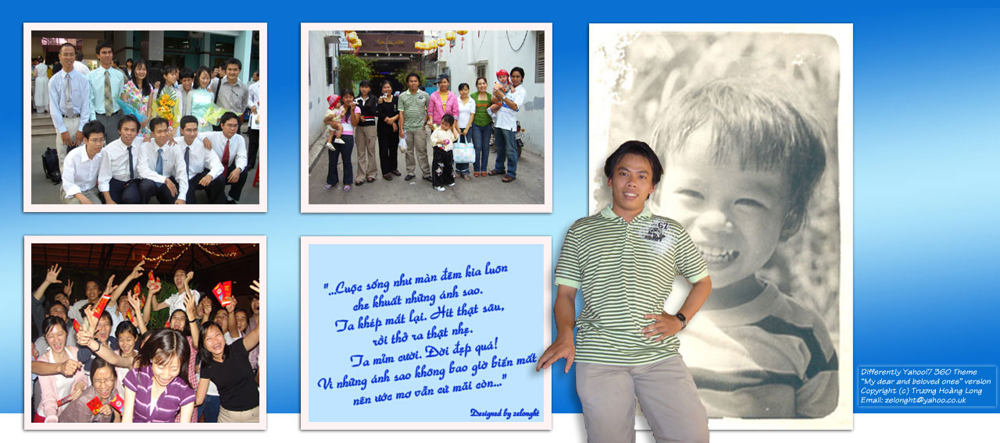
