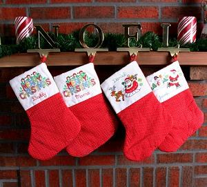

# TITLE: 1988 vs 2008 : Nhìn lại bước tiến công nghệ sau 20 năm
* DATE: 03/12/2008 21:39:27
* STATUS: publish
* BODY: 

Đắn đo về giá của iPhone ư? Bạn nghĩ sao khi biết được rằng giá của một chiếc điện thoại di động vào năm 1988 nếu so với hiện tại có thể quy đổi bằng 4.382 USD và một ổ cứng 150 MB sẽ là 8.755 USD. Hãy cùng chúng tôi điểm qua một vài khác biệt về công nghệ giữa năm 1988 và 2008 rồi thì bạn sẽ không bao giờ phàn nàn về giá của các thiết bị công nghệ ngày nay.  

 

 

 <h4>Điện thoại di động</h4> <h5><strong>1988: Motorola DynaTAC 8500XL</strong>  

 

 
</h5> <ul> <li>Giá: 2.500 USD (4.382 USD - theo tốc độ trượt giá)  <li>Công nghệ: analog  <li>Trọng lượng: 739 g  <li>Thời gian đàm thoại: 1 giờ</li></ul> <h5><strong>2008: Apple iPhone</strong>  

 

 
 </h5> <ul> <li>Giá: 399 USD  <li>Công nghệ: EDGE/GSM quad-band  <li>Trọng lượng: 141 g  <li>Thời gian đàm thoại: 8 giờ</li></ul> 
Motorola DynaTAC 8000X được giới thiệu vào năm 1984 là chiếc điện thoại thật sự di động đầu tiên trên thế giới. Mặc dù có chiều dài tới 10 inch và khiến hầu bao của bạn giảm mất 3.995 USD nhưng nó vẫn khá phổ biến trong giới chứng khoán và bất động sản. 
 
Vào cuối năm 1988 đã có khoảng 800.000 chiếc điện thoại di động được sử dụng tại Mỹ và dịch vụ chuyển vùng cho phép bạn sử dụng điện thoại ở ngoài địa phương. McCaw Cellular Communications (sau kết hợp với AT&T để trở thành AT&T Wireless) là nhà cung cấp dịch vụ di động lớn nhất.
 
Giá cước cũng khá mắc mỏ khi trung bình hàng tháng hóa đơn thanh toán ở mức từ 100 đến 150 USD với chi phí 50 xu mỗi phút.
 
Điện thoại và các dịch vụ vẫn còn rất đơn giản : không hộp thư thoại, chuyển cuộc gọi, hiện số điện thoại gọi đến, không bóng bẩy, và không Wi-Fi, Bluetooth, chụp ảnh, màn hình cảm ứng, nghe nhạc, xem phim, lướt web (tất cả đều được tích hợp trong iPhone).
 
8500XL là chiếc điện thoại có khả năng lưu 30 số điện thoại và một màn hình LED. Một vài năm sau đó, Motorola giới thiệu StarTAC - là chiếc điện thoại vỏ sò đầu tiên đánh dấu kỷ nguyên ra đời của các sản phẩm điện thoại bỏ túi.
 <h4>Ti vi màn hình rộng</h4> <h5><strong>1988: Mitsubishi Diamond Vision II 3503</strong>  

 

 
 </h5> <ul> <li>Giá: 3.000 USD (5.258 USD - theo tốc độ lạm phát)  <li>Kích thước: 35 inch  <li>Độ phân giải: 480 dòng  <li>Tín hiệu: NTSC  <li>Công nghệ màn hình: CRT</li></ul> <h5><strong>2008: Panasonic TH-50PZ77U HDTV</strong>  

 

 
 </h5> <ul> <li>Giá: 2.300 USD  <li>Kích thước: 50 inch  <li>Độ phân giải: 1080 dòng  <li>Tín hiệu: ATSC  <li>Công nghệ màn hình: plasma </li></ul> 
Mitsubishi ra mắt màn hình 35-inch Diamond Vision sử dụng bóng đèn chân không lớn nhất thế giới vào năm 1985. Mặc dù chất lượng hình ảnh mượt mà và màu sắc tuyệt hảo của CRT vẫn có thể đánh bại những gì mà Plasma và LCD thể hiện nhưng nó cũng có một vài điểm hạn chế như : một màn hình CRT 35 inch nặng xấp xỉ 90 kg và dày 60 cm.
 
Những yêu cầu về một màn hình lớn hơn đã buộc phải chuyển sang dòng ti vi phẳng. Một trong những mẫu thiết bị hàng đầu hiện nay là màn hình plasma 50-inch của Panasonic TH-50PZ77U. 
 
Sharp dự đoán vào năm 2015, kích thước trung bình của tivi sẽ tăng lên 60 inch. Công nghệ OLED sẽ tạo nên bước chuyển lớn trong tương lai với chất lượng hình ảnh hấp dẫn. Hiện màn hình OLED mới của Sony (XEL-1) có giá 2.300 USD chỉ rộng vỏn vẹn có 11 inch.
 <h4>Đầu đĩa video</h4> <h5><strong>1988: Pioneer CLD-1010 Laserdisc Player</strong>  

 

 
 </h5> <ul> <li>Giá: 1.427 USD (2.278 USD - theo tốc độ lạm phát)  <li>Độ phân giải: 420 dòng  <li>Ngõ xuất: composite  <li>Hỗ trợ: Laserdisc, CD-audio, CD-video</li></ul> <h5><strong>2008: Panasonic DMP-BD30K Blu-ray Disc Player</strong>  

 

 
 </h5> <ul> <li>Giá: 500 USD  <li>Độ phân giải: 1080 dòng  <li>Ngõ xuất: HDMI  <li>Hỗ trợ: Blu-ray 1.1, DVD, CD</li></ul> 
Laserdisc đã từng có thể được sánh như Blu-ray vào năm 1988 với chất lượng hình ảnh cao thay thế cho băng VHS. Pioneer CLD-1010 có thể đọc được đĩa CD và về sau là cả DVD. Tuy nhiên Laserdisc không có được hỗ trợ rộng rãi từ các nhà sản xuất và hãng phim cho nên kết quả là nó chỉ chiếm được khoảng 2% thị trường Mỹ.
 
Bộ phim cuối cùng phát hành trên định dạng Laserdisc là vào năm 2000, sau đó nó được thay thế bởi đĩa DVD. Thật đáng kinh ngạc rằng hiện Pioneer vẫn tiếp tục tạo ra các sản phẩm kết hợp giữa Laserdisc và DVD nhằm phục vụ cho những người hâm mộ định dạng này.
 
Hiện nay, sau khi cuộc chiến giữa Blu-ray và HD DVD kết thúc với phần thắng nghiêng về đứa con cưng của Sony thì định dạng này được hầu hết các nhà sản xuất ủng hộ. Còn về phía người tiêu dùng, trong tương lai gần hay ít nhất là vào thời điểm này Blu-ray đã giải tỏa cơn khát thưởng thức các bộ phim có độ phân giải 1080p trên những màn hình độ nét cao HDTV siêu rộng.
 <h4>Máy nghe nhạc cầm tay</h4> <h5><strong>1988: Sony Discman D-10</strong>  

 

 
 </h5> <ul> <li>Giá: 350 USD (613 USD - theo tốc độ lạm phát)  <li>Định dạng: CD-audio  <li>Dung lượng: 650 MB hay 70 phút  <li>Thời gian sử dụng pin: 4 giờ  <li>Trọng lượng: 396 g</li></ul> <h5><strong>2008: Apple iPod Touch</strong>  

 

 
 </h5> <ul> <li>Giá: 299 USD  <li>Định dạng: AAC/MP3/AIFF/WAV  <li>Dung lượng: 8 GB hay 87 giờ  <li>Thời gian sử dụng pin: 22 giờ khi nghe nhạc hay 5 giờ khi xem phim  <li>Trọng lượng: 119 g</li></ul> 
Sony Discman D-10 vào năm 1987 đã từng được mô tả như một thiết bị sử dụng công nghệ laser phức tạp cho phép người dùng dễ dàng bỏ vào túi áo mưa hay đeo trên vai. 
 
Mặc dù iPod Touch cho chất lượng âm thanh không thể sánh với những gì có trong thế hệ Discman bởi vì các định dạnh nhạc nén như MP3 và ACC phải trả giá bằng chính độ chi tiết trong những gì phát ra. Tuy nhiên Touch bổ sung nhiều chức năng phụ trội như xem phim, màn hình cảm ứng, kết nối Wi-Fi...
 
Trong tương lai chúng ta có khả năng nhận được những bản nhạc thông qua việc đăng ký hoặc nghe trực tuyến. Liệu bạn còn muốn suốt ngày mang theo một thư viện âm nhạc khi mà việc truy cập vào bất kỳ bản nhạc yêu thích nào từ Internet là điều quá đơn giản? 
 <h4>Máy ảnh</h4> <h5><strong>1988: Canon EOS 650</strong>  

 

 
 </h5> <ul> <li>Giá: 600 USD (1.052 USD - theo tốc độ lạm phát)  <li>Định dạng: phim analog 35 mm  <li>Dung lượng: 36 tấm hình  <li>Khả năng xem trước: thông qua kính ngắm quang học  <li>Tốc độ: màn chập 1/2000 </li></ul> <h5><strong>2008: Canon EOS Digital Rebel XTi</strong>  

 

 
 </h5> <ul> <li>Giá: 600 USD  <li>Định dạng: 10 MP JPEG  <li>Dung lượng: tùy thẻ nhớ CF  <li>Khả năng xem trước: thông qua màn hình LCD 2,5 inch và kính ngắm quang học  <li>Tốc độ: màn chập 1/4000 </li></ul> 
Nếu xét về giá cả thì dường như dòng SLR của Canon không mấy thay đổi trong khoảng thời gian 20 năm nhưng công nghệ thì đã được chuyển từ phim sang ảnh kỹ thuật số.
 
EOS 650 là sản phẩm đầu tiên thuộc dòng EOS của Canon và nó được giới thiệu kèm với ống kính điện tử đầu tiên. Thật đáng ngạc nhiên khi ngày nay những ống kính lấy nét điện tử (Electro Focus - EF) vẫn tỏ ra hữu dụng trong các mẫu EOS kỹ thuật số. 650 cũng có thể hệ thống đo sáng ma trận điểm (spot-matrix metering) được cho là một bước tiến vượt bậc vào thời điểm đó. 
 
Trên thực tế, máy ảnh kỹ thuật số phải cần một khoảng thời gian dài để có thể bắt kịp máy ảnh phim về khía cạnh độ phân giải và tốc độ chụp. Hiện nay, sự ngang hàng về tính năng đã được thiết lập và sự thuận tiện của máy ảnh số đang dần đẩy máy ảnh phim xuống đáy thị trường.
 
Một tính năng mới nhất khiến cho người dùng có khuynh hướng chuyển sự quan tâm qua các máy kỹ thuật số liên quan tới cảm biến ảnh full-frame to xấp xỉ bằng khổ phim 24x35 mm mà những máy SLR ngày xưa vẫn dùng
 <h4>Máy chơi game </h4> <h5><strong>1988: Nintendo NES</strong>  

 

 
 </h5> <ul> <li>Giá: 200 (351 USD - theo tốc độ lạm phát)  <li>CPU: 1,79 MHz 8 bit  <li>RAM: 2 KB  <li>Định dạng: hộp băng</li></ul> <h5><strong>2008: Sony PlayStation 3 40 GB</strong>  

 

 
 </h5> <ul> <li>Giá: 399 USD  <li>CPU: 3,2 GHz  <li>RAM: 256 MB  <li>Định dạng: sử dụng đĩa quang, ổ cứng với kết nối Internet </li></ul> 
Nintendo NES là sản phẩm máy chơi game rất thành công vào thời điểm mà nó ra mắt với khoảng 60 triệu sản phẩm được tiêu thụ trên toàn cầu. Tựa game Super Mario lập kỷ lục trò chơi bán chạy nhất mọi thời đại và nó vẫn tiếp tục được yêu thích trên hệ máy Nintendo Wii. Thậm chí nếu tính theo giá tiền của năm 2008, NES vẫn thấp hơn so với Sony PlayStation 3.
 
Nếu so về mặt chất lượng hình ảnh, NES rõ ràng không thể sánh với PS3 bởi nó bị giới hạn ở độ phân giải 8 x 8 hay 8 x 16 (hình động) và chỉ có 48 màu cùng 5 cấp độ dãy màu xám. Trong khi đó, PS3 cung cấp khả năng hiển thị màu trung thực, diễn tả đầy đủ các chuyển động của nhân vật nhờ chip cell cao cấp và bộ xử lý đồ họa.
 
Chắc chắn rằng các hệ máy game trong tương lai sẽ có chất lượng hình ảnh thật hơn tuy nhiên các khuynh hướng đang chiếm ưu thế hiện nay là những dòng game có nội dung gia đình và thế giới ảo điển hình như Wii và Second Life.
 <h4>Máy tính để bàn</h4> <h5><strong>1988 : Tandy 1000 TL  

 

 
</strong></h5> <ul> <li>Giá : 1.400 USD (2.454 USD - theo tốc độ lạm phát)  <li>CPU: Intel 80286  <li>RAM: 640 KB  <li>Lưu trữ: đĩa mềm 3,5-inch  <li>Màn hình : 14-inch, 640 x 200 RGB CRT, 16 màu</li></ul> <h5><strong>2008: Dòng HP Pavilion Elite m9100z  

 

 
</strong></h5> <ul> <li>Giá : khoảng 1.000 USD  <li>CPU: 2,8-GHz AMD Athlon 64 X2 5600+ dual-core  <li>RAM: 2 GB  <li>Lưu trữ: ổ cứng 750 GB, đầu đọc/ghi CD/DVD  <li>Monitor: 17-inch, 1440 x 900 LCD, 16,7 triệu màu</li></ul> 
Vào năm 1988, máy tính các nhân (PC) đã tìm được cách xâm nhập vào khoảng 15% các hộ gia đình tại Mỹ. PC tuy có uy thế vượt trội nhưng bên cạnh đó cũng có một vài hệ thống khác cũng phổ biến không kém như Apple II, Macintosh, Commodore 64, Atari ST, và Amiga 2000. 
 
Ngày đó PC đi kèm với hệ điều hành DOS, Windows 2.0 là một sự lựa chọn 99 USD. Giao diện đồ họa DeskMate của Tandy đã cung cấp một bộ phần mềm văn phòng, các ứng dụng chỉnh sửa âm thanh và vẽ, phần mềm trực tuyến PC-Link và một phiên bản khởi đầu cho AOL. 
 
Màn hình 16 màu, hệ điều hành đồ họa, hỗ trợ tính năng đa phương tiện nhưng mức giá 1.400 USD của Tandy chưa bao gồm chuột, modem, card mạng và ổ cứng. Khi đó ổ đĩa CD-ROM vô cùng hiếm.
 
Ở vào tình cảnh năm 2008, mọi thứ như thách đố khi so sánh với năm 1988. Với mức giá tổng cộng khoảng 1000 USD, HP Pavilion Elite m9100z đã được trang bị hệ điều hành Vista Hoem Premium, ổ cứng 750 GB, card đồ họa HDMI, Wi-Fi, thiết bị dò HDTV, âm thanh vòm và màn hình 17 inch siêu mỏng.
 <h4>Máy tính xách tay</h4> <h5><strong>1988: Toshiba T1200H  

 

 
</strong></h5> <ul> <li>Giá : 4.098 USD (7.182 USD - theo tốc độ lạm phát)  <li>CPU: 4,77-9,54 MHz Intel 80C86  <li>RAM: 1 MB  <li>Lưu trữ: ổ cứng 20 MB, ổ đĩa mềm 720 KB  <li>Màn hình: 9,4-inch supertwist LCD  <li>Trọng lượng: 6,3 kg  <li>Thời gian sử dụng pin: 2 giờ</li></ul> <h5><strong>2008: Lenovo ThinkPad X61  

 

 
</strong></h5> <ul> <li>Giá: 1.724 USD  <li>CPU: 2 GHz Intel Core 2 Duo T7300  <li>RAM: 2 GB  <li>Lưu trữ: ổ cứng 160 GB, khe cắm thẻ nhớ SD, đầu đọc ghi CD/DVD gắn ngoài  <li>Màn hình: 12,1-inch 1024 x 768 LCD, 16,7 triệu màu  <li>Trọng lượng: 1,6 kg  <li>Thời gian sử dụng pin: 6 giờ</li></ul> 
Toshiba T1200H vào thời điểm đó là sự kết hợp hoàn hảo giữa tính di động, hiệu năng thực thi và giá cả. Tất nhiên trọng lượng 6,3 kg (bao gồm cả modem và bộ sạc) có khi bằng cả chiếc máy tính để bàn ngày nay. Hơn nữa, việc sử dụng màn hình LCD đã giúp kéo giảm kích thước cũng như trọng lượng nếu so với laptop dùng màn hình CRT do Compaq đi tiên phong. T2100H cũng thật sự ấn tượng với ổ cứng 20 MB và nếu bạn chịu chi thêm 400 USD thì một modem 2400-baud sẽ được trang bị thêm.
 
Bạn nghĩ sao về sự thay đổi thần kỳ này? Khi bạn có thể đặt 3 chiếc laptop ThinkPad X61 vừa vào cùng một khoảng không gian mà T1200H đang sử dụng và thời gian hoạt động lầu hơn gấp 3 lần cũng như tốc độ xử lý vượt trội. Nếu bạn mua 3 chiếc ThinkPad thì số tiền cộng lại vẫn không nhiều bằng việc "tậu" một chiếc Toshiba vào năm 1988.
 <h4>Ổ cứng</h4> <h5><strong>1988: 150 MB Core HC150  

 

 
</strong></h5> <ul> <li>Giá: 4.995 USD (8.755 USD - theo tốc độ lạm phát)  <li>Giá trị tính trên mỗi MB: 33 USD (58 USD)  <li>Thời gian tìm dữ liệu: 17 ms  <li>Giao tiếp: ESDI (495 USD)  <li>Tốc độ truyền dữ liệu: 1,25 Mbps  <li>Số lượng đầu/đĩa : 9/5  <li>Tuổi thọ dự kiến: 50.000 giờ</li></ul> <h5><strong>2008: 1 TB Seagate Barracuda 7200.11  

 

 
</strong></h5> <ul> <li>Giá: 363 USD  <li>Giá trị tính trên mỗi MB: 0,000363 USD  <li>Thời gian tìm dữ liệu: 9 ms  <li>Giao tiếp: SATA 3 Gbps  <li>Tốc độ truyền dữ liệu: 300 Mbps  <li>Số lượng đầu/đĩa : 8/4  <li>Tuổi thọ dự kiến: 750.000 giờ</li></ul> 
Nếu lấy giá tiền trên từng MB dữ liệu vào năm 1988 thì bạn phải bỏ ra 5,8 triệu USD để có thể sở hữu không gian lưu trữ 1 TB. Quay trở lại năm 1988, chúng ta không thể cất giữ một số lượng lớn những tấm ảnh 10 Megapixel hay các đoạn phim độ nét cao nhưng với 1 TB thì việc chứa 2.500 đĩa CD là chuyện nhỏ.
 
Trong tương lai cuộc đua về dung lượng sẽ không quá khốc liệt bằng việc cạnh tranh về kích thước. Những ổ đĩa sử dụng công nghệ flash sẽ ngày cành nhỏ hơn để đáp ứng nhu cầu của các thiết bị cầm tay như máy ảnh số, điện thoại di động và máy nghe nhạc/xem phim.
 <h4>Máy in màu</h4> <h5><strong>1988: Alps ALQ300  

 

 
</strong></h5> <ul> <li>Giá: 995 USD (1.744 USD - theo tốc độ lạm phát)  <li>Đầu in: in kim (dot-matrix) 24-pin màu  <li>Tốc độ: 31 giây/trang, lên tới 10 phút/trang khi in màu  <li>Cổng giao tiếp: Serial</li></ul> <h5><strong>2008: Canon Pixma iP3500  

 

 
</strong></h5> <ul> <li>Giá: 80 USD  <li>Đầu in: 4800 x 1200 dpi màu  <li>Tốc độ: 3,5 giây/trang khi in màu  <li>Cổng giao tiếp: USB 2.0 và PictBridge</li></ul> 
Trong thế giới ma trận điểm, bạn có thể mua những hộp mực cho các kiểu chữ không bao gồm trong bộ nhớ, mỗi bộ như vây có giá chừng 55 USD. Bản điều khiển phía trước của Alps cho phép điều khiển các thiết lập về khoảng cách dòng, kích thước của một điểm ảnh (dot pitch), kiểu chữ, chế độ in.
 
Alps có thể cho ra 7 độ màu từ một dải băng 4 màu và cách thức in chồng. Bên cạnh đó, mỗi chương trình phần mềm mà bạn sử dụng phải có riêng một chương trình điều khiển máy in. Nhưng thật may mắn là Alps tương thích với Epson nền được hầu hết các phần mềm phổ biến hỗ trợ.
 
Điều thật sự gây ngạc nhiên là với mức giá 995 USD vẫn chưa bao gồm bộ phận tiếp giấy, hộp mực và cổng serial.
 
Ngày nay, chỉ với số tiền chưa đến 1/10, bạn đã có thể sở hữu một máy in phun độ phân giải cao (như Canon Pixma iP3500). Pixma thậm chí có có đến 2 khay đựng giấy vì vậy bạn có thể tự do chuyển đổi in trên các chất liệu khác nhau. Hơn thế nữa nó còn có thể được chia sẻ thông qua mạng không dây Wi-Fi với Windows Print Sharing và in trực tiếp từ máy ảnh số nhờ công nghệ PictBridge.
 <h4>Truy cập Internet</h4> <h5><strong>1988: CompuServe  

 

 
</strong></h5> <ul> <li>Giá: 6 - 47,5 USD mỗi giờ (11 - 83 USD, theo tốc độ lạm phát)  <li>Kết nối: dial-up  <li>Tốc độ: 300 đến 9600 baud  <li>Dịch vụ: 400 cơ sở dữ liệu, tin tức, mua sắm, các hoạt động tài chính, 140 nhóm thảo luận, thư điện tử</li></ul> <h5><strong>2008: AT&T Elite DSL  

 

 
</strong></h5> <ul> <li>Giá: 35 USD mỗi tháng  <li>Kết nối: Đường kỹ thuật số  <li>Tốc độ: 6 Mbps  <li>Dịch vụ: gần như bất kỳ thứ gì bạn có thể tưởng tượng ra</li></ul> 
Trong tương lai việc truy cập Internet sẽ có thể thực hiện ở khắp mọi nơi thông qua các kết nối WiMAX.
 
Thong tin cong nghe / <a href="http://www.pcworld.com/article/id,142550-page,7-c,electronics/article.html">PC World</a> 
 

 

 

 

 

 

 

 

 

 

 

 

 

 

 

 

 

 

 

 

 

 

 

 

</li></li></li></li></li></li></li></li></li></li></li></li></li></li></li></li></li></li></li></li></li></li></li></li></li></li></li></li></li></li></li></li></li></li></li></li></li></li></li></li></li></li></li></li></li></li></li></li></li></li></li></li></li></li></li></li></li></li></li></li></li></li></li></li></li></li></li></li></li></li></li></li></li></li></li></li></li></li></li></li></li></li></li></li></li></li>

[ COMMENT: ]
* AUTHOR: HungVo
* DATE: 03/12/2008 22:25:57
đ󠫨��phải l࡬�o để ch򮧠ta đắng đo khi mua một chiếc iphone m࡬࡬iệu n󠣡ڧn thiết với ch򮧠ta đến mức nᯡ gotit?

[ COMMENT: ]
* AUTHOR: 
* DATE: 03/13/2008 09:56:24
ne, loc ra cho e 1 cai trong list nay di cung dc ah

--------

# TITLE: ...Beethoven's 3rd và "The day of ...recalling"
* DATE: 03/12/2008 07:17:56
* STATUS: publish
* BODY: 

Đi lùng các mạng ngang hàng per2per khắp thế giới, Emule, Torrent, LimWare.... cuối cùng cũng tìm ra được phần 3rd này, ấy thế mà xem nó với 1 cảm giác thật lạ: 
 
<em>"Giống như vừa đánh mất 1 cái gì đó, giống như có một cái gì đó không còn nữa"</em> 
 
Beethoven's 1st và 2nd có một sự xuyên suốt giữa 2 phần, từ khi Beethoven còn bé cho đến khi trưởng thành, rồi trải qua những sóng gió cùng gia đình Newton mà lớn lên. 
 
Rồi đến lúc Beethoven biết yêu và gặp được Missy, các con ra đời, họ phải chia lìa và cuối cùng lại đến với nhau. Beethoven thật dễ thương, đi cùng nó theo năm tháng, cho đến kết thúc thật dễ thương: hạnh phúc của cả gia đình Newton và gia đình Beethoven - Missy cùng các con thật đông vui.
 
 
 
...Beethoven's 3rd không còn ai quen nữa, không còn những thành viên gia đình Newton như trước, ngoài Beethoven trông đã lớn tuổi nhiều hơn, không vợ, con, đơn độc. Xem phim nhớ đến những trận cười "ah ha, ah ha..." của những phần trước, mà lần này không còn nữa... Dường như "The day I fall in love" không nằm ở những nhân vật trong phim mà nó còn viết cho tình cảm của khán giả giành cho bộ phim ấy. 
 
Mình nghĩ đây không là cảm xúc của riêng ai, mà cho những ai đã hâm một B's 1st & B's 2nd. Phần 3, 4 và 5 đã là một bộ phim khác, không hay, không xem tiếp nữa. Beethoven dừng lại ở đó và sẽ mãi dễ thương trong tâm trí người xem. 
 
  
 
 <table cellpadding="5" border="0" style="border-collapse:collapse; "> <tbody> <tr> <td>Just an ordinary day  Started out the same old way  Then I looked into your eyes and knew  Today would be a first for me  The day I fall in love   On the day I fall in love  Sky will be a perfect blue  And I'll give my heart forever more  To someone who is just like you  The day I fall in love   People all say love is wonderful  That the bells will ring  The birds will sing  The skies will open  I wonder where's that great big symphony  Roll over Beethoven  Won't you play with me</td> <td> 
<strong>The day I fall in love</strong>
 
<em>James Ingram e Dolly Parton</em> 

 
And I'll never promise to be true to anyone  Unless it's you  Unless it's you  The day I fall in love   Just an ordinary day  Started out the same old way  Then I looked into your eyes and knew  Today will be a first for me  A first for me  The day I fall in love  I know you'll be there  Ooh....I know...  The day I fall in love
</td></tr></tbody></table> 

--------

# TITLE: ...love much "The day I fall in love" ~ Beethoven's 2nd
* DATE: 03/10/2008 09:10:45
* STATUS: publish
* BODY: 

<embed src="http://www.youtube.com/v/-odILRnHpb0" width="425" height="355" type="application/x-shockwave-flash" wmode="transparent" allowScriptAccess="none">    </embed>
 
<embed src="http://media.imeem.com/m/tzV19rYJSg" width="300" height="80" type="application/x-shockwave-flash" wmode="transparent" allowScriptAccess="none">    </embed>
 
    
 
    
 
    
 
    
 
 Xem phim mới biết "<em>The day I fall in love</em>" hay thế nào 

[ COMMENT: ]
* AUTHOR: 
* DATE: 07/13/2008 20:07:46
Thank you anh! Bai nhac hay qua, dung that la xem phim thi moi biet no hay the nao!

[ COMMENT: ]
* AUTHOR: 
* DATE: 07/13/2008 20:30:37
Tnank you anh! Bai nhac that hay, dung la xem phim moi thay bai nhac cang hay hon rat nhieu! 

--------

# TITLE: ...8/3 một ngày nhiều sắc
* DATE: 03/08/2008 21:40:35
* STATUS: publish
* BODY: 

Sáng thức giấc 6h. 7h25 ăn sáng ở một nơi thật tuyệt, đẹp, nhẹ nhàng, quán phở 24 trên đường Nguyễn Huệ. Không chỉ có phở mà còn bánh Flan nữa. Lâu rồi không được thưởng thức bánh Flan kiểu như vậy, lúc sau này toàn ăn Flan công nghiệp, làm hàng loạt trong những hộp nhựa, phát ngán. Một buổi sáng thật tuyệt. Sáng 8/3 đường phố đầy hoa --> mua 1 cái mà không biết nó là "You are number 1" ! 
 
  Tô phở ngon tuyệt, quên chụp chén bò viên và cái bánh Flan  
 

 

 
  Một ngày mưa suốt, ai cũng nói trời buồn, chỉ riêng bà chị ngành Văn chương của mình nói: <em>sao mọi người không là nhà văn mà lãng mạn quá, mình thấy mưa hay không cũng vậy</em> !?! 
 

 

 
  5h30: wedding party - đám cưới của Khôi "đen", bạn thời Đại học. Có 1 điều hay trong tiệc cưới này: cô dâu và chú rễ cười và nói chuyện với nhau suốt, ngay lúc cắt bánh, rót rượu... ít có đám cưới nào thế này, thấy cô dâu và chú rễ thường căng thẳng, hay là không được tự nhiên. 
 
<embed src="http://media.imeem.com/v/844QQN6XxO/aus=false/pv=2" width="267" height="217" type="application/x-shockwave-flash" allowScriptAccess="none"></embed>
 
   Tối, xem Phim Beethoven. <strong><em>Beethoven</em></strong> is a <a title="1992 in film" href="http://en.wikipedia.org/wiki/1992_in_film">1992</a> <a title="Comedy" href="http://en.wikipedia.org/wiki/Comedy">comedy</a> <a title="Film" href="http://en.wikipedia.org/wiki/Film">film</a> directed by <a title="Brian Levant" href="http://en.wikipedia.org/wiki/Brian_Levant">Brian Levant</a> and written by <a title="John Hughes (film director)" href="http://en.wikipedia.org/wiki/John_Hughes_%28film_director%29">John Hughes</a> (under the <a title="Pseudonym" href="http://en.wikipedia.org/wiki/Pseudonym">pseudonym</a> Edmond Dantès) and <a title="Amy Holden Jones (page does not exist)" href="http://en.wikipedia.org/w/index.php?title=Amy_Holden_Jones&action=edit&redlink=1">Amy Holden Jones</a>. The story centers on a <a title="St. Bernard (dog)" href="http://en.wikipedia.org/wiki/St._Bernard_%28dog%29">St. Bernard</a> <a title="Dog" href="http://en.wikipedia.org/wiki/Dog">dog</a> named after the composer <a title="Ludwig van Beethoven" href="http://en.wikipedia.org/wiki/Ludwig_van_Beethoven">Ludwig van Beethoven</a> [<a href="http://en.wikipedia.org/wiki/Beethoven_(film)">more</a>...]
 
 Phim vui, có một câu hỏi được đặt ra: nếu nuôi một con chó to như Beathoven thì sao ? Câu trả lời: nếu nó thông minh như B, thì cũng thích nuôi luôn 
 

 

 
 Một ngày không phải của mình nhưng lại vui vui, chỉ trừ 1 việc : mua 30k VND: xoài, dưa hấu, mận, quýt về nhà. Dưa hấu bị úng, hư cắt ra bỏ hết ! Xoài chua lè ! Quýt lại càng chua hơn!  . Đúng là chẳng biết mua đồ , sao tệ thật

[ COMMENT: ]
* AUTHOR: 
* DATE: 07/02/2008 22:49:44
em cung rat thich nuoi cho! mot con cho to de om that chat thi se tuyet lam! 

--------

# TITLE: ...happy women's day
* DATE: 03/07/2008 21:05:35
* STATUS: publish
* BODY: 

 
 
 
<strong>Chúc các bạn nữ trong my friend blog  một ngày 8/3 vui tươi !!!  </strong>

--------

# TITLE: ...một chút gọi là ~~nice~~
* DATE: 03/05/2008 21:03:03
* STATUS: publish
* BODY: 

 <table cellspacing="0" cellpadding="0" border="0"> <tbody> <tr> <td valign="top" align="middle"></td></tr> <tr> <td height="20"><em><strong>Những bức ảnh mang sắc nét nghệ thuật, sự gắn kết giữa con người & tự nhiên...   </strong></em></td></tr> <tr> <td valign="top" align="middle"></td></tr> <tr> <td height="20">  </td></tr> <tr> <td valign="top" align="middle"></td></tr> <tr> <td height="20">  </td></tr> <tr> <td valign="top" align="middle"></td></tr> <tr> <td height="20">  </td></tr> <tr> <td valign="top" align="middle"></td></tr> <tr> <td height="20">  </td></tr> <tr> <td valign="top" align="middle"></td></tr> <tr> <td height="20">  </td></tr> <tr> <td valign="top" align="middle">  Thiệt sao? Tom & Jerry 21th century</td></tr> <tr> <td height="20">  </td></tr> <tr> <td valign="top" align="middle">  Anh ấy đã từng là thủ môn...</td></tr> <tr> <td height="20">  </td></tr> <tr> <td valign="top" align="middle">  Cạm bẫy</td></tr> <tr> <td height="20">  </td></tr> <tr> <td valign="top" align="middle"></td></tr> <tr> <td height="20">  </td></tr> <tr> <td valign="top" align="middle">  Konika, cười nha!</td></tr> <tr> <td height="20">  </td></tr> <tr> <td valign="top" align="middle">  Anh yêu! Cố lên chứ</td></tr> <tr> <td height="20">  </td></tr> <tr> <td valign="top" align="middle">  Lại cạm bẫy ?</td></tr> <tr> <td height="20">  </td></tr> <tr> <td valign="top" align="middle"></td></tr> <tr> <td height="20">  </td></tr> <tr> <td valign="top" align="middle"></td></tr> <tr> <td height="20">  </td></tr> <tr> <td valign="top" align="middle"></td></tr> <tr> <td height="20">  </td></tr> <tr> <td valign="top" align="middle"></td></tr> <tr> <td height="20">  </td></tr> <tr> <td valign="top" align="middle">  Ngậm miệng lại bồ tèo, gió vô giờ</td></tr> <tr> <td height="20">  </td></tr> <tr> <td valign="top" align="middle">  Nhảy Salsa nhé bé</td></tr> <tr> <td height="20">  </td></tr> <tr> <td valign="top" align="middle"></td></tr> <tr> <td height="20">  </td></tr> <tr> <td valign="top" align="middle"></td></tr> <tr> <td height="20">  </td></tr> <tr> <td valign="top" align="middle"></td></tr> <tr> <td height="20">  </td></tr> <tr> <td valign="top" align="middle"></td></tr> <tr> <td height="20">  </td></tr> <tr> <td valign="top" align="middle"></td></tr> <tr> <td height="20">  </td></tr> <tr> <td valign="top" align="middle"></td></tr> <tr> <td height="20">  </td></tr> <tr> <td valign="top" align="middle">  Làm sao được nhỉ !</td></tr> <tr> <td height="20">  </td></tr> <tr> <td valign="top" align="middle"></td></tr> <tr> <td height="20">  </td></tr> <tr> <td valign="top" align="middle"></td></tr> <tr> <td height="20">  </td></tr> <tr> <td valign="top" align="middle"></td></tr> <tr> <td height="20">  </td></tr> <tr> <td valign="top" align="middle"></td></tr> <tr> <td height="20">  </td></tr> <tr> <td valign="top" align="middle"></td></tr> <tr> <td height="20">  </td></tr> <tr> <td valign="top" align="middle"></td></tr> <tr> <td height="20">  </td></tr> <tr> <td valign="top" align="middle"></td></tr> <tr> <td height="20">  </td></tr> <tr> <td valign="top" align="middle"></td></tr> <tr> <td height="20">  </td></tr> <tr> <td valign="top" align="middle"></td></tr> <tr> <td height="20">  </td></tr> <tr> <td valign="top" align="middle"></td></tr> <tr> <td height="20">  </td></tr> <tr> <td valign="top" align="middle">  Tấm này miễn bình luận</td></tr></tbody></table> 

 
Checking orthography.... 

[ COMMENT: ]
* AUTHOR: 
* DATE: 03/09/2008 06:04:52
X th tấm Tom & Jerry. Tấm Lại cạm bẫy nh�đứa b顣ười thấy ghꡧhꬠgiống trong mấy phim kinh dị quᮠ

--------

# TITLE: coi VN ngầu ghê chưa. Vote tiếp nha
* DATE: 03/04/2008 01:00:54
* STATUS: publish
* BODY: 
<table style="width:100%; "> <tbody> <tr> <td>Last update 04-MAR-2008 05:00 GMT</td> <td style="text-align:right; ">( ) = yesterday's ranking</td></tr></tbody></table> <table> <tbody> <tr> <td style="text-align:right; "><b style="font-size:18px; ">1.</b></td> <td> <table> <tbody> <tr> <td></td> <td>(1)</td></tr></tbody></table></td> <td><a href="http://www.new7wonders.com/nature/en/nominees/asia/c/HaLongBayBay/">Ha Long Bay , Bay</a></td> <td>VIET NAM - Asia</td> <td> 
<a style="font-weight:normal; background-color:#61a427; " href="http://www.new7wonders.com/nature/en/vote_on_nominees/?firstselect=6:97">Vote</a>
</td></tr> <tr> <td style="text-align:right; "><b style="font-size:18px; ">2.</b></td> <td> <table> <tbody> <tr> <td></td> <td>(2)</td></tr></tbody></table></td> <td><a href="http://www.new7wonders.com/nature/en/nominees/asia/c/HongNhaKeBangNationalPark/">Phong Nha - Ke Bang, National Park</a></td> <td>VIET NAM - Asia</td> <td> 
<a style="font-weight:normal; background-color:#61a427; " href="http://www.new7wonders.com/nature/en/vote_on_nominees/?firstselect=6:96">Vote</a>
</td></tr> <tr> <td style="text-align:right; "><b style="font-size:18px; ">3.</b></td> <td> <table> <tbody> <tr> <td></td> <td>(3)</td></tr></tbody></table></td> <td><a href="http://www.new7wonders.com/nature/en/nominees/asia/c/FansipanMountain/">Fansipan, Mountain</a></td> <td>VIET NAM - Asia</td> <td> 
<a style="font-weight:normal; background-color:#61a427; " href="http://www.new7wonders.com/nature/en/vote_on_nominees/?firstselect=6:100">Vote</a>
</td></tr> <tr> <td style="text-align:right; "><b style="font-size:18px; ">4.</b></td> <td> <table> <tbody> <tr> <td></td> <td>(4)</td></tr></tbody></table></td> <td><a href="http://www.new7wonders.com/nature/en/nominees/asia/c/CoxsBazarBeach/">Cox's Bazar, Beach</a></td> <td>BANGLADESH - Asia</td> <td> 
<a style="font-weight:normal; background-color:#61a427; " href="http://www.new7wonders.com/nature/en/vote_on_nominees/?firstselect=6:103">Vote</a>
</td></tr> <tr> <td style="text-align:right; "><b style="font-size:18px; ">5.</b></td> <td> <table> <tbody> <tr> <td></td> <td>(5)</td></tr></tbody></table></td> <td><a href="http://www.new7wonders.com/nature/en/nominees/asia/c/SundarbansForest/">Sundarbans, Forest</a></td> <td>BANGLADESH/ INDIA - Asia</td> <td> 
<a style="font-weight:normal; background-color:#61a427; " href="http://www.new7wonders.com/nature/en/vote_on_nominees/?firstselect=6:79">Vote</a>
</td></tr> <tr> <td style="text-align:right; "><b style="font-size:18px; ">6.</b></td> <td> <table> <tbody> <tr> <td></td> <td>(6)</td></tr></tbody></table></td> <td><a href="http://www.new7wonders.com/nature/en/nominees/asia/c/GangesRiver/">Ganges, River</a></td> <td>BANGLADESH/ INDIA - Asia</td> <td> 
<a style="font-weight:normal; background-color:#61a427; " href="http://www.new7wonders.com/nature/en/vote_on_nominees/?firstselect=6:98">Vote</a>
</td></tr> <tr> <td style="text-align:right; "><b style="font-size:18px; ">7.</b></td> <td> <table> <tbody> <tr> <td></td> <td>(7)</td></tr></tbody></table></td> <td><a href="http://www.new7wonders.com/nature/en/nominees/asia/c/MountEverestMountain/">Mount Everest, Mountain</a></td> <td>NEPAL - Asia</td> <td> 
<a style="font-weight:normal; background-color:#61a427; " href="http://www.new7wonders.com/nature/en/vote_on_nominees/?firstselect=6:88">Vote</a>
</td></tr> <tr> <td style="text-align:right; "><b style="font-size:18px; ">8.</b></td> <td> <table> <tbody> <tr> <td></td> <td>(8)</td></tr></tbody></table></td> <td><a href="http://www.new7wonders.com/nature/en/nominees/northamerica/c/CocosIslandIsland/">Cocos Island, Island</a></td> <td>COSTA RICA - North America</td> <td> 
<a style="font-weight:normal; background-color:#61a427; " href="http://www.new7wonders.com/nature/en/vote_on_nominees/?firstselect=1:188">Vote</a>
</td></tr> <tr> <td style="text-align:right; "><b style="font-size:18px; ">9.</b></td> <td> <table> <tbody> <tr> <td></td> <td>(9)</td></tr></tbody></table></td> <td><a href="http://www.new7wonders.com/nature/en/nominees/southamerica/c/AmazonRiverRiverForest/">Amazon River, River/Forest</a></td> <td>BOLIVIA/ BRAZIL/ COLOMBIA/ ECUADOR/ PERU/ VENEZUELA - South America</td> <td> 
<a style="font-weight:normal; background-color:#61a427; " href="http://www.new7wonders.com/nature/en/vote_on_nominees/?firstselect=2:197">Vote</a>
</td></tr> <tr> <td style="text-align:right; "><b style="font-size:18px; ">10.</b></td> <td> <table> <tbody> <tr> <td></td> <td>(11)</td></tr></tbody></table></td> <td><a href="http://www.new7wonders.com/nature/en/nominees/asia/c/MountFujiMountain/">Mount Fuji, Mountain</a></td> <td>JAPAN - Asia</td> <td> 
<a style="font-weight:normal; background-color:#61a427; " href="http://www.new7wonders.com/nature/en/vote_on_nominees/?firstselect=6:87">Vote</a>
</td></tr></tbody></table> 
Viva Viet nam. Kh��ng �������c ng��� qu��n tr��n chi���n th���ng. M���i ng�����i t���o th��m nhi���u email ����� <strong>Vote ti���p</strong>!!!

[ COMMENT: ]
* AUTHOR: 
* DATE: 03/04/2008 19:23:05
coi chung do', tui TQ, An Do, My~ no' chua vote thoi. Tui no' ma` he` nhau vua vote vua hack la` VN xuong hang be't lien. Dung voi mung con!!

[ COMMENT: ]
* AUTHOR: 
* DATE: 03/05/2008 19:08:02
Trời ơi, đỉnh Kilimanjaro đ㵠rồi?  
 
C��cuộc vote của ch򮧠ta giỏi thật! Potay.vn!!!  

[ COMMENT: ]
* AUTHOR: 
* DATE: 03/05/2008 20:48:13
x󡠶7 c⩠kia rồi, n뮠đ㠢mất t" :P, ko c򮠋ilimanjaro g졮ữa

--------

# TITLE: ...đơn cảm, đa cảm, nhạy cảm, vô cảm
* DATE: 03/02/2008 08:53:46
* STATUS: publish
* BODY: 

Cảm giác con người, vô hình vạn trạng, phức tạp quá. Vì mình đang tìm xem mình đang ở trạng thái cảm nào, thử liệt kê các dạng cảm thái ra xem:
 
<strong> đơn cảm</strong>:  Chỉ 1 cảm giác nào đó: vui, buồn, hụt hẩn, lo âu...
 
<strong>đa cảm</strong>:  Nhiều cảm giác trong 1 lúc: vừa buồn vừa giận, vừa tin tưởng vừa lo lắng...
 
<strong>nhạy cảm</strong>:  Là sự tiếp nhận hay nhận ra được những gì khác biệt quanh ta: một nụ hoa chớm nở, một giọt sương đọng trên lá...
 
<strong>vô cảm</strong>:  Hoặc là không có 1 chúc nhạy cảm, trở nên quá thực tế, cứng cáp với cuộc sống. Hoặc là quá đa cảm, nhiều cảm xúc quá, đến nổi không còn bộc lộ hay tiếp nhận thêm được 1 cảm giác nào nữa. 
 
 Ngồi 10' suy nghĩ, ah hoá ra mình ko còn thuộc 4 nhóm trên nữa, vì bị cảm rồi, cảm thật sự. Sống tốt cũng ko, tàn nhẫn cũng ko, ba phải, ko cảm mới lạ.
 
 1 bài viết đọc cuối ngày: <em><strong>Giáo viên dạy môn phụ trong cơn "bão giá”</strong></em>
 
<em>Tôi dạy môn Anh văn, có lần tôi thử sống bằng đồng lương của mình, vật giá lúc đó ổn định nhưng không đến nửa tháng, tôi đã cháy túi phải lấy tiền dự trữ ra xài. Tôi luôn tự hỏi những đồng nghiệp dạy môn phụ, có gia đình làm sao sống được?</em>
 
<em>Chiều qua, tôi đến thăm một người bạn học thời trung học hiện là giáo viên môn giáo dục công dân THPT. Ngay bữa cơm trưa, tôi không tin vào mắt mình. Hai vợ chồng bạn cùng hai cô con gái túm tụm với mâm cơm rau muống chấm tương hột, nước mắm tỏi ớt. Thấy tôi ngạc nhiên, bạn cười: "Lương hai đứa (chồng bạn dạy sử) trước đây còn dám vài ngày ăn thịt cá, mỗi ngày thì đậu hũ, canh khoai hay khoai xào. Giờ cái gì cũng lên, mình phải chịu khó thôi. Mỗi tuần mình phụ nấu mấy đám tiệc cũng được trăm ngàn mỗi đám, ông xã chạy thêm xe ôm cũng không đủ với hai đứa con học cấp III chi đủ thứ tiền".</em>
 
<em>Bạn tôi thử làm con tính: tiền điện, nước, điện thoại, tiền rác, tiền học hai con, tiền cho hai đứa bỏ túi để đóng quĩ lớp, photo bài vở... Quả thật, không ăn tương rau mới là lạ. Đó là chưa kể một trong bốn thành viên bị bệnh cảm sơ thôi cũng đi đứt hai chục ngàn tiền thuốc/ngày. </em>
 
<em>Chương trình giảng dạy nặng nề, giáo viên được yêu cầu dạy hết năng lực, có chất lượng, đầu tư trí tuệ nhiều... Thế nhưng giáo viên "nạp" vào chỉ toàn rau, tương thì sức đâu đứng vững trên bục giảng?</em> 
 
... tuoitre.com.vn ...
 
Tối đi trên đường về, nhìn quan sát cuộc sống quanh ta, lắc đầu, người bạn đi cùng nói với mình "nhiều khi nhìn họ mà buồn, thấy nhớ ông bà ngoại..."
 
 Ngán blog, game; viva music. Vậy thì chép nhạc vào mobile phone the "Sony S700i!" thôi (my dear friend's back after 3 years!)
 <blockquote> 
Instrumental
 <blockquote> 
Classical
 <blockquote> 
Pop
 <blockquote> 
Hiphop
 <blockquote> 
New Age
 <blockquote> 
and more.....
</blockquote></blockquote></blockquote></blockquote></blockquote></blockquote>

--------

# TITLE: ...con mèo đã sống một triệu lần
* DATE: 02/28/2008 00:01:17
* STATUS: publish
* BODY: 

 
Đây là một <strong>truyện nhi đồng</strong> nổi tiếng tại Nhật Bản, đã được đưa vào danh sách các truyện chọn lọc dành cho trẻ em. Nhưng có lẽ truyện viết dành cho cả người lớn. Các hiệu sách cho biết đây cũng là cuốn sách được các cô gái Nhật mua làm quà tặng nhân ngày lễ Tình yêu Valentine.   Truyện xuất bản lần đầu vào năm 1977, và cho đến năm 2006 đã tái bản đến lần thứ 86.   <strong></strong>
 
<strong>Con mèo đã sống một triệu lần</strong>    <em>Có một con mèo đã một triệu năm rồi mà vẫn chưa chết.   Nó đã từng chết đi một triệu lần, rồi sống lại một triệu lần.   Một con mèo vằn bảnh bao.   Có một triệu người đã yêu thương con mèo ấy, và một triệu người đã khóc khi con mèo ấy chết.   Mèo thì chưa khóc lần nào cả.   Có khi người chủ của mèo là một ông vua. Mèo ghét nhà vua lắm.   Nhà vua giỏi chiến trận, lúc nào cũng bày chuyện đao binh. Và ngài nhốt mèo vào một cái cũi thật sang trọng để đem theo mình khi ra trận.   Một ngày nọ, mèo trúng phải một mũi tên bay tới, lăn ra chết.   Nhà vua đã ôm mèo vào lòng mà khóc giữa trận chiến.   Rồi nhà vua bèn ngưng chiến, quay về thành, chôn mèo trong vườn ngự.   Có khi người chủ của mèo là một thủy thủ. Mèo ghét biển lắm.   Người thủy thủ đã đem mèo theo anh ta đi khắp các đại dương và ghé lại tất cả các hải cảng trên thế giới.   Một hôm, mèo bị rơi từ trên tàu xuống biển. Mèo không biết bơi. Người thủy thủ vội vàng thả lưới vớt mèo lên, nhưng mèo đã chết vì ướt sũng.   Người thủy thủ ôm mèo vào lòng, giờ đây bèo nhèo như chiếc giẻ rách ướt mèm, mà khóc òa lên. Rồi anh ta chôn mèo dưới gốc cây trong công viên nơi một thành phố cảng xa lạ.   Có khi người chủ của mèo là một người làm trò ảo thuật trong gánh xiếc. Mèo ghét gánh xiếc lắm.   Ngày ngày, người làm trò ảo thuật nhốt mèo vào một cái hộp, rồi dùng cưa cưa chiếc hộp ra làm đôi, sau đó lại lấy mèo từ trong hộp ra, vẫn còn nguyên vẹn, và khán giả vỗ tay tán thưởng nhiệt liệt.   Một hôm người làm trò ảo thuật đã lỡ tay cưa mèo đứt làm đôi thật. Ông ta cầm xác mèo đã bị đứt làm đôi, mỗi tay một nửa, mà khóc rống lên.   Không ai vỗ tay cả. Người làm trò ảo thuật đã chôn mèo ở đằng sau rạp xiếc bé như cái chòi .   Có khi người chủ của mèo là một tên kẻ trộm. Mèo ghét tên trộm lắm.   Tên trộm đem mèo theo bên mình khi hắn đi rón rén như mèo vòng quanh những góc phố tối tăm.   Tên trộm chỉ vào những nhà có nuôi chó. Trong lúc chó mải gầm gừ với mèo thì tên trộm cậy tủ sắt.   Một hôm, mèo bị chó cắn chết.   Tên trộm ôm mèo cùng với những viên kim cương mà hắn đã ăn trộm được, vừa khóc vừa lầm lũi đi giữa phố khuya. Rồi hắn về nhà chôn mèo trong khu vườn nhỏ.   Có khi người chủ của mèo là một bà cụ già sống cô độc một mình. Mèo ghét cay ghét đắng bà cụ già .   Bà cụ ngày ngày ôm mèo mà nhìn ra ngoài qua khung cửa sổ nhỏ.   Mèo nằm ngủ suốt ngày trên đùi của bà cụ.   Rồi mèo chết vì già yếu. Bà cụ già lụ khụ đã ngồi khóc suốt một ngày bên xác mèo đã già khụ.   Bà cụ chôn mèo dưới gốc cây trong khu vườn nhỏ.   Có khi người chủ của mèo là một cô bé. Mèo ghét cay ghét đắng cô bé.   Cô bé cõng mèo trên lưng, và ôm mèo thật chặt trong tay khi ngủ. Cô chùi mặt vào lưng mèo mỗi khi khóc.   Một hôm, mèo bị sợi dây của chiếc địu sau lưng cô bé vướng vào cổ mà chết.   Cô bé ôm mèo với cái đầu đã bị thắt gẫy nơi cổ mà khóc suốt một ngày. Rồi cô chôn mèo dưới gốc cây trong vườn.   Mèo đã chết không biết bao lần nhưng chẳng hề chi.   Một lần mèo chẳng phải là của ai cả, mà là mèo hoang.   Đó là lần đầu tiên, mèo được là của chính mình. Mèo yêu chính mình lắm.   Là vì mèo đã trở thành một con mèo vằn bảnh bao.   Mèo cái nào cũng mong được mèo để mắt tới.   Có con đem đến cho mèo một con cá lớn. Có con tặng mèo một con chuột hảo hạng.   Có con đem đến tặng mèo cả quả matatabi quý hiếm mà giống mèo rất thích. Lại có con còn liếm cả những đường lông vằn vện của mèo.   Mèo nói:   -Ta đã từng chết một triệu lần rồi chứ bộ. Đâu phải đợi tới bây giờ. Vớ vẩn !   Là vì mèo chỉ yêu chính mình hơn bất cứ ai khác.   Chỉ có một con mèo duy nhất đã không ngó ngàng tới mèo, một con mèo trắng thật đẹp.   Mèo đến bên mèo trắng, bảo:   -Ta đã từng chết một triệu lần rồi đó nghe.   Mèo trắng chỉ đáp :   -Ờ.   Mèo hơi tức mình. Vì mèo yêu chính mình mà lại.   Ngày hôm sau, rồi hôm sau nữa, mèo tới chỗ mèo trắng, hỏi :   - Chưa sống trọn một lần nào, phải không?   Mèo trắng chỉ đáp :   -Ờ.   Một hôm, mèo đến trước mặt mèo trắng, nhào lộn luôn một lúc ba vòng, rồi bảo :   -Ta đã từng ở với một người làm xiếc.   Mèo trắng chỉ đáp:   -Ờ.   -Ta đã ..một triệu lần..   Mèo ấp úng, rồi đánh tiếng hỏi mèo trắng   -Cho ở bên cạnh nghe ?   Mèo trắng đáp:   -Vâng.   Thế là mèo ở lại bên cạnh mèo trắng   Mèo trắng sinh được một đàn mèo con xinh xắn.   Mèo cũng không bao giờ còn nói:   -Ta đã ..một triệu lần..   Bây giờ mèo đã yêu mèo trắng và bầy mèo con hơn cả chính mình.   Chẳng bao lâu đàn mèo con lớn lên và đi đâu hết cả, mỗi con một ngả.   Mèo mãn nguyện bảo:   -Lũ chúng nó đã khôn lớn cả rồi.   Mèo trắng đáp :   -Vâng.   và dịu dàng kêu nho nhỏ trong cổ .   Mèo trắng đã hơi có dáng vẻ của một bà cụ. Mèo cũng kêu nho nhỏ trong cổ, ra chiều âu yếm đáp lại.   Mèo chỉ mong sẽ sống lâu, mãi mãi cùng với mèo trắng.   Rồi đến một ngày, mèo trắng nằm yên bất động bên cạnh mèo.   Lần đầu tiên trong đời, mèo khóc. Mèo đã khóc từ sáng đến tối, từ tối đến sáng, rồi lại từ sáng đến tối và rồi lại từ tối đến sáng, cứ thế ..Mèo đã khóc một triệu lần.   Trời sáng, rồi lại tối, mèo cứ khóc mãi, cho đến một hôm mèo không còn khóc nữa.   Mèo đã yên nghỉ bên cạnh mèo trắng.   <strong>Mèo không bao giờ còn sống lại một lần nào nữa</strong>.</em>
 
 <strong><em>Nguyên tác : Hyakumankai ikita neko - Copy from clearlymind.com - Referred by U.My</em></strong>

[ COMMENT: ]
* AUTHOR: Snape
* DATE: 02/28/2008 02:49:44
���ng Japan style

[ COMMENT: ]
* AUTHOR: Wang Jun
* DATE: 02/28/2008 03:44:23
C㵠chuyện thật x򣠄ҡۙng,h鮠g졮󠬡ڡi được nhiều người th đến thế.

[ COMMENT: ]
* AUTHOR: 
* DATE: 02/28/2008 20:31:50
đ򮧠lࡴhử l򮧠ki뮠nhẫn mଠnhưng hay đấy!

[ COMMENT: ]
* AUTHOR: 
* DATE: 03/12/2008 20:40:05
C㵠chuyện hay wᬠ"m鯠trắng" đọc chắc lࡸ򣠄ҡۙng lắm, mượn bản quyền để post l뮠blog V nha L ;)

--------

# TITLE: ...một chút gọi là hình
* DATE: 02/26/2008 08:09:44
* STATUS: publish
* BODY: 

  Một trong hai tấm duy nhất chụp hôm tết ! Anh chụp trước nhà mới của anh ba, vào dịp xông đất đầu năm 
 
  Chocolat được người bạn mèo Xi gửi tặng
 
  Không có chỗ treo đồ, cánh của đành chịu đựng treo các món đồ souvernir. Mới thêm vào phong linh và móc khoá Chùa Một Cột (quà có nguồn gốc từ Hà Nội )
 
Nhận thấy rằng: còn ít quá, cần đẩy mạnh hơn (....) để có nhiều đồ hơn nữa 

[ COMMENT: ]
* AUTHOR: 
* DATE: 02/26/2008 13:24:19
Pix 2: Chocolat ngon qua, chia cho em voi anh giai oi oi. :D 

[ COMMENT: ]
* AUTHOR: 
* DATE: 02/26/2008 19:35:39
share chocolate di anh oi.............

--------

# TITLE: chắc phải đi cướp Ngân hàng quá
* DATE: 02/24/2008 18:47:22
* STATUS: publish
* BODY: 

 
Dạo này lại bị thêm bệnh viêm màn túi, mô hình hiện tại single Input multi Output (SIMO), áp dụng vào điều khiển trong tự động hóa coi bộ điều khiển không được, cần chi phí để nghiên cứu lý thuyết mới. 
 
<strong>Lấy đâu ra bây giờ</strong>?
 
Vay thì phải trả lãi, lở trả chậm thì lãi nhiều uổng quá. Nhất quyết không. Mượn thì mượn nhiều ai cho. Chỉ còn 1 cách thôi.
 
Cướp vậy!  cướp người dân thì tội người ta, Ngân hàng giàu có, cướp hay hơn !
 
<strong>Vậy làm sao và làm thế nào</strong>?
 
Thật ra, cướp Ngân hàng tưởng là khó chứ khó gì đâu, dễ ợt. Chỉ cần:
 <ul> <li>Có kế hoạch  <li>Phải thật <strong>tàn nhẫn</strong>, <strong>dã tâm</strong> phải thật lớn  <li>Dám hy sinh tự do, thậm chí sinh mạng cho mục tiêu ... riêng</li></ul> 
3 yếu tố ấy là xong. Thiệt ra vẩn đề khó khăn nằm ở chỗ khác:
 <ul> <li>Cần đội ngũ, ngoài mình ra tìm người có 3 yếu tố trên đề làm equipe sao khó quá. Tìm hoài ko thấy (có ai đủ yêu cầu thì P.M nha )  <li>Chọn Ngân hàng , bây giờ nhiểu NH lắm, Vietcombanh, Sacombank, NaviBank, ACB, Techcombank... biết chọn NH nào bây giờ, chưa kể NH nào cũng có bạn bè thân quen trong đó, "lỡ tay" thì sao. Nội việc chọn 1 cái trong nhiều cái cũng khó rồi. Lại cần thêm chi phí để nghiên cứu cái này.</li></ul> 
Và như vậy chi phí lại phát sinh, chưa giải quyết đc cái này lại có thêm cái khác. Pó tay ! 
</li></li></li>

[ COMMENT: ]
* AUTHOR: Broooch
* DATE: 02/24/2008 19:09:17
TT__TT h� như a bi stress rui  @. B� tĩnh nᯠanh^_^!!!! hehe, phai dzui dze,lac quan thi mới đi đến thᯨ c��sớm được ^^

[ COMMENT: ]
* AUTHOR: HungVo
* DATE: 02/24/2008 19:33:14
single Input multi Output (SIMO) l࡭��nh điều khiển trong tự động h󡿿? sure? ch x⣠n󠣨ỉ l࡭��nh to⮠học để ai thấy cần th졤񮧠:p 

[ COMMENT: ]
* AUTHOR: 
* DATE: 02/24/2008 19:39:32
cho em đi cướp chung với?

[ COMMENT: ]
* AUTHOR: 
* DATE: 02/24/2008 19:51:14
theo t� h� cashflow th졣󠴨ể n󩠁CB trong 6 th⯧ vừa qua đ㡶ượt bậc thu h򴠄ҡڧu tư! Vote cho ACB c⩠nᯡ 
 
bạn Long nghi뮠cứu hệ thống an ninh của c⣠ng㮠hᯧ đi rồi xem m� bụp c⩠nᯠđể c󠴨ể minimize risk and maximize returns ;) 

[ COMMENT: ]
* AUTHOR: 
* DATE: 02/24/2008 20:10:34
Bạn X tuy뮠bố lࡢạn X ko quen biết g졶ới bạn L hết! :D

[ COMMENT: ]
* AUTHOR: 
* DATE: 02/24/2008 21:58:05
da~ cuop thi` ra'ng cuop ngan ha`ng na`o tam co*~ the gioi mot ti'. Co' that bai thi` nghe cung co' ly. Voi lai mau tro nen noi tieng.

[ COMMENT: ]
* AUTHOR: 
* DATE: 02/25/2008 20:22:27
* Nu, My Hien : vậy m� l뮠kế họach nha :D 
* Q, Xi: Q đ򮧠ah, nghe n󩠔echcombank thuộc HSBC, tầm cở quốc tế, lại c󠘩 lࡢạn tốt nữa, nhất cũng c󠢣on tin" c񮧠phe nội ngoại gi⯧, kiễu nṠTechcombank mất th��-))

--------

# TITLE: mot ngay buo`n
* DATE: 02/24/2008 09:04:54
* STATUS: publish
* BODY: 
Buon lam, chang viet, chang noi nen cau gi 

[ COMMENT: ]
* AUTHOR: 
* DATE: 02/24/2008 09:20:15
Thấy cười ho᩠m࡫o biết lࡢuồn :-). Bạn L cố l뮬 bạn L v��ịch, yeah yeah :P

[ COMMENT: ]
* AUTHOR: 
* DATE: 02/24/2008 14:29:21
Rang ma buon rua anh trai?

--------

# TITLE: Giải nhất cuộc thi "Trí tuệ Việt Nam 2007"
* DATE: 02/16/2008 20:16:27
* STATUS: publish
* BODY: 

 
<strong>Sản phẩm "Máy nhắn tin xếp hàng SQS" do nhóm Lá bốn cánh gồm: Ngô Chí Đức và Lê Ngọc Hiếu phát triển. Sản phẩm đã đoạt giải nhất cuộc thi "Trí tuệ Việt Nam 2007". ---- Quá hay ! ---- </strong>
 
<embed src="http://www.laodong.com.vn/Uploaded_LAODONG/thanhhaidv/20080121/SQS.swf" width="350" height="300" type="application/x-shockwave-flash" wmode="transparent" allowScriptAccess="none">
 
Ngô Chí Đức và Lê Ngọc Hiếu (TP Hồ Chí Minh) với sản phẩm “<a href="http://www.ttvn.com.vn/vi-VN/tintuc/gioithieusp/2008/1/609.ttvn">Hệ thống nhắn tin xếp hàng</a>” đã đoạt giải Nhất cuộc thi sản phẩm phần mềm “Trí tuệ Việt Nam 2007”. Lễ trao giải được tổ chức trang trọng tối 6.1 tại Cung Văn hoá Hữu nghị Việt –Xô Hà Nội. Tổng Bí thư Đảng CSVN Nông Đức Mạnh đã gửi lẵng hoa chúc mừng. Phó Chủ tịch Nước Nguyễn Thị Doan cùng nhiều vị lãnh đạo của Đảng, Nhà nước, Chính phủ và các đoàn thể đã tham dự.  
 
“Hệ thống nhắn tin xếp hàng” cho phép đăng ký xếp hàng từ xa qua tin nhắn ngắn. Khách hàng nhắn tin để xếp hàng và sẽ được hệ thống nhắn tin lại khi gần đến lượt mình. Giải pháp này có tính ưu việt là không phải tới tận nơi lấy số và cũng tránh được sự chờ đợi mất thời gian. Sản phẩm hiện đã được lắp đặt thử nghiệm tại một số bệnh viện tại TP Hồ Chí Minh. 
 
Phát biểu tại lễ trao giải, ông Vương Văn Việt, TBT báo Lao Động, Trưởng Ban Tổ chức TTVN 2007, nhấn mạnh: “Lần đầu tiên, chúng tôi thành lập Hội đồng Đầu tư với thành phần tham dự là đại diện các quỹ đầu tư đang hoạt động tại Việt Nam, nhằm tìm ra những ý tưởng, những giải pháp mới có tiềm năng thương mại hoá để đưa các sản phẩm ứng dụng vào thực tiễn. Như vậy cuộc thi “Trí tuệ Việt Nam” không chỉ dừng lại ở “phát hiện tiềm năng, thắp sáng tài năng”, mà còn là nơi “khởi đầu sự nghiệp” của các tài năng trẻ trong lĩnh vực công nghệ thông tin”.
</embed>

--------

# TITLE: ♪ ♫ Em về tóc xanh by Zelonght :-D
* DATE: 02/16/2008 19:53:06
* STATUS: publish
* BODY: 

<strong>Bài hát có âm điệu hay, lời nhạc nhẹ nhàng, cách điệu</strong>
 
♪ ♫ ♪ ♫ ♪ ♫ ♪ ♫ ♪ ♫ ♪ ♫ ♪ ♫ ♪ ♫ ♪ ♫ ♪ ♫ ♪ ♫ ♪  <embed src="http://media.imeem.com/m/VqBNRYN0-s/aus=false/" width="300" height="80" type="application/x-shockwave-flash" wmode="transparent" allowScriptAccess="none"></embed>  ♪ ♫ ♪ ♫ ♪ ♫ ♪ ♫ ♪ ♫ ♪ ♫ ♪ ♫ ♪ ♫ ♪ ♫ ♪ ♫ ♪ ♫ ♪
 
<em>Một sớm em về tóc xanh, mây trắng thương em níu vai. Một sớm em ngồi đây nói cười, mùa xuân bay ngang ghé thăm. Còn đấy chăng, đôi vai ướt thiên đường nuôi cây trái chín? Còn chăng làn môi xanh bài hát hôm nào; gửi tìm yêu dấu xa vời? </em>
 
<em>Cuộc tình dài rộng quá đôi khi lại rất buồn. Có đôi lần... một người ngủ quên lỗi hẹn. Bập bùng điệu đàn để ta đón gió lên, xin dâng người một dây đã đứt. Ngày nào khúc ca yêu xưa không còn vui, dây đàn chùng quanh giấc mộng. Này một yêu thương đã tắt đêm qua, trông chờ bàn chân em đến. Viết lên con tim câu thơ buồn để nghìn năm sau hóa đá. </em>
 
<em>Thôi nghe em tóc kia còn xanh, thì xin cứ an lành</em>

[ COMMENT: ]
* AUTHOR: 
* DATE: 02/16/2008 21:50:09
10 điểm tự tin! :D

[ COMMENT: ]
* AUTHOR: dhjklk
* DATE: 02/17/2008 00:14:52
z존h졺졥m vẫn th nghe honey h⴮..

--------

# TITLE: một chút về / quelque chose sur * Enchanted *
* DATE: 02/12/2008 16:25:32
* STATUS: publish
* BODY: 

 
<em>"<strong>Enchanted</strong> là tựa đề tiếng Anh của một bộ phim<strong> cổ tích pha lẫn hiện đại</strong>, hài hước do <strong>Walt Disney Pictures</strong> sản xuất"</em> 
 
<strong> Tiêu đề tiếng Việt</strong>: <strong><em>Chuyện thần tiên ở New York</em></strong>
<strong> 
 Sơ về nội dung</strong>: Kết hợp giữa hoạt hình 2D truyền thống và người đóng, Enchanted là một phim 'bất thường' của hãng Disney! Disney được xem là một trong những hãng phim bảo thủ nhất tại Hollywood. Các nhân vật của Disney sở hữu bản quyền được bảo vệ hình ảnh khá nghiêm ngặt. Thế nên, khi Disney tự đem các nàng công chúa của mình ra để giễu cợt trong Enchanted, bộ phim trở nên 'bất thường' so với truyền thống của hãng này. Trong phim, nàng công chúa Giselle được tổng hợp từ Lọ Lem (ca hát cùng chim, chuột và cả gián), Bạch Tuyết (bị bà hoàng hậu độc ác hãm hại) và Công chúa ngủ trong rừng (mong chờ một nụ hôn tình yêu từ chàng hoàng tử). Điều bất thường là những tính cách đáng yêu của Giselle – yêu thích ca hát, khát khao tình yêu, thân thiện với muôn thú – bỗng trở nên lố bịch trong một thế giới hiện đại. Enchanted mở màn trong thế giới hoạt hình, với tiếng hát véo von lanh lảnh của Giselle kể về nỗi khát khao tình yêu và một nụ hôn chân thật của chàng bạch mã hoàng tử. Thế rồi, chàng bạch mã hoàng tử xuất hiện. họ yêu nhau ngay từ cái nhìn đầu tiên. Tiếng chuông nhà thờ cùng điệu nhạc đám cưới vang lên. 
 
<embed src="http://www.youtube.com/v/CLdKwdGdZaI&rel=1" width="425" height="355" type="application/x-shockwave-flash" wmode="transparent" allowScriptAccess="none">  </embed><strong>Trailer - Walt Disney Pictures </strong>
 
Ngay lúc đó, bà hoàng hậu dì ghẻ độc ác của chàng hoàng tử Edward xuất hiện và rắp tâm hãm hại Giselle: mụ đẩy Giselle xuống hồ nước. Bất ngờ, đó lại là cổng thông từ thế giới hoạt hình sang thế giới thật. Giselle lóp ngóp chui ra khỏi… ống cống giữa lòng New York - một thành phố nổi tiếng với những con người vô cảm và cộc cằn. Edward cùng người hầu cận của mình đuổi theo Giselle đến New York… Bộ phim không kể về chuyện tình của Giselle và Edward, bởi có một nhân vật khác xuất hiện: Robert, một luật sư chuyên về ly dị, một người không còn tin vào tình yêu sau khi người vợ bỏ anh ra đi, để lại cô con gái cho anh chăm sóc. Giselle được Robert đưa về nhà bởi cô con gái của anh quá sửng sốt trước một cô công chúa từ trên trời rơi xuống! Họ hoàn toàn khác biệt nhau: một người quá mộng mơ, một người quá thực dụng; một người quá đắm say vào tình yêu dù chỉ gặp chàng hoàng tử của mình trong vài giây tích tắc, một người không dám chắc điều gì về tình yêu dù mối quan hệ đã gắn bó nhiều năm và ngày cưới cùng sắp đến; một người yêu ca hát bất kể nơi nào, một người nghiêm túc và khô khan…
 

 
Chỉ vài ngày ngắn ngủi bên nhau, cả hai bắt đầu học được những điều thú vị về thế giới của nhau. Họ nhận ra những điều tuyệt vời của tình yêu và cuộc sống mà họ đã vô tình bỏ sót. Khá nhiều chi tiết hài hước về sự khác biệt giữa một người từ thế giới hoạt hình đầy mơ mộng với một người từ thế giới thật lạnh lùng tẻ nhạt được khai thác: nàng Giselle yêu thích ca hát luôn được chàng Robert nhắc nhở 'làm ơn đừng hát ở nơi công cộng'; một buổi sáng Robert thức dậy và kinh hoàng khi thấy căn hộ của mình tràn ngập chim chóc, chuột và gián; những tấm rèm cửa bị nàng Giselle cắt phăng để may áo mới! Bên cạnh đó, các màn ca múa hát đặc trưng trong các phim hoạt hình của Disney được 'người-thật hoá' đã 'bỏ bùa mê' người xem! 
 
 <strong>Chú sóc nhìn giống Ratatouille </strong>
 
Nàng Giselle quá đỗi trong sáng, hồn nhiên và vô tư khiến người xem vừa bật cười vừa thương cảm. Giselle trong thế giới hiện đại bỗng trở nên lạc lõng, khi mà bầy chim, chuột gián bu quanh cô chỉ khiến cô trở nên… quái dị, khi mà niềm tin vào tình yêu bất diệt của cô trở nên ngớ ngẩn, và cả tình yêu ‘ngay từ cái nhìn đầu tiên’ chỉ là thứ tình cảm bồng bột. Khi Giselle gặp Robert, một chàng luật sư ‘gà trống nuôi con’, cô xáo trộn cuộc sống của anh, kể cả quan hệ tình cảm của anh. Thế nhưng, cả hai tưởng chừng không có điểm gì chung, nhưng lại có một điều chung trong sâu thẳm: họ thiếu thốn một tình yêu chân thật, một tình yêu đến từ sự hiểu nhau, cảm thông nhau. Cô con gái của Robert như chiếc cầu nối giữa họ, giúp Robert tìm thấy niềm tin vào những chuyện cổ tích và giúp Giselle hoà nhập vào thế giới hiện đại. Khi cả hai nhận ra tình yêu đã len lén đến quanh họ, cũng là lúc hoàng tử của Giselle tìm ra được nàng và bạn gái của Robert sẵn sàng cho đám cưới. Đó cũng là lúc mụ dì ghẻ độc ác quyết định mò đến thế giới hiện đại để ngăn cản nụ hôn giữa Giselle và hoàng tử Edwards. Và như mọi khi, kết cuộc phim có hậu bên cạnh việc có một yếu tố bất ngờ khi gần kết, cuối cùng những người yêu nhau hạnh phúc bên nhau.
 

 
<strong> Điểm đặc biệt của bộ phim</strong>:
 <ol> <li>Tham khảo đến nhiều bộ phim Walt Disney nổi tiếng "<em>Bạch Tuyết và 7 Chú lùn</em>" (Snow White and the Seven Dwarfs), <em>"Cô bé lọ lem"</em> (Cinderella), "Công chúa ngủ trong rừng" (Sleeping Beauty), "Nàng tiên cá" The Little Mermaid, "Giai nhân và quáy vật" Beauty and the Beast và 1 chút Shrek nữa.  <li>Kỷ são tuyệt, chú sóc dễ thương tội nghiệp cứ như thật, mà sắc hình ảnh hoành tráng thiết kế đẹp, 15 phút classic cartoon và phần còn lại quay trong cuộc sống thật, cả hai hình ảnh đều đẹp.  <li>Âm thanh và âm nhạc là những gì quen thuộc với phim của Walt Disney. Không thua gì với các phim như High School Music I &II. Enchanted có ká nhiều bài hát hay và mang tính đặc biệt riêng của cổ tích & hiện đại.  <li>Tính sáng tạo trong việc pha lẫn, biến tấu nội dung. Kết cục bất ngờ, kết cuộc có hậu.  <li>Một vài con số: Enchanted là bộ phim thứ hai đạt doanh số cao nhất trong năm ngày của đợt công chiếu mùa Lễ tạ ơn sau Toy story 2 cũng của Disney với doanh số 80,1 triệu USD. Phim có sự góp mặt của ca sĩ đồng quê đang lên Carrie Underwood với ca khúc Ever ever after và ca sĩ kiêm nhạc sĩ sáng tác pop/rock Jon McLaughlin với ca khúc So close </li></ol> 
<strong> Các bài nhạc hay</strong>:
 
<a href="http://eternityswords.imeem.com/video/bEChiJby/amy_adams_thats_how_you_know_music_video/">That's How You Know by Amy Adams</a>
 
<a href="http://groups.imeem.com/f0bvVZRk/video/ufXmwgcw/carrie_underwood_ever_ever_after_music_video/">Ever, Ever After by Carrie Underwood</a>
 
<a href="http://snowflykisses.imeem.com/video/jAE8lJ3l/jon_mclaughlin_so_close_enchanted_movies_video/">So Close (Enchanted) by Jon McLaughlin</a>
 
<a href="http://eternityswords.imeem.com/video/iZ4biapA/amy_adams_happy_working_song_music_video/">Happy Working Song by Amy Adams</a>
 
<a href="http://eternityswords.imeem.com/video/LvFXIhCY/amy_adams_true_loves_kiss_music_video/">True Love's Kiss by Amy Adams</a>
 
~ mùng 6 tết ~
</li></li></li></li>

--------

# TITLE: Biển vắng nhớ em - trình bày bởi Gia Vinh :D
* DATE: 02/11/2008 22:16:15
* STATUS: publish
* BODY: 

 
<strong>Biển vắng nhớ em</strong>
 
<strong><embed src="http://360.ytuongsangtaovn.com/kbmusic/mediaplayer.swf" width="280" height="19" type="application/x-shockwave-flash" flashvars="file=http://cuasotinhoc.com/giavinh/anhtrang/Bien%20vang%20nho%20em%20-%20Gia%20Vinh.mp3&autostart=false&repeat=true&displayheight=0&allowfullscreen=true&showdigits=false" allowScriptAccess="none"></strong>
 
(Nhấn vào nút play để nghe<strong>)</strong>
</embed> 
Sáng tác: Gia Vinh 
 
Trình bày: Gia Vinh
 

 
Anh dạo bước trên bờ cát và nghe sóng vỗ miên man
 
Ngàn câu thơ trao em gợi nhớ bao dấu yêu wo hoo...
 
Nhờ con sóng gửi lời đến em, tình yêu anh nồng nàn biết bao
 
Sẽ như ngàn sao trên trời soi sáng tim em rạng ngời
 
Và cơn gió nhẹ nhàng lướt qua gửi vào anh một thoáng yêu thương
 
Anh nhớ em đêm nay người ơi wo hoo...
 
(Chorus)
 
Nhìn con sóng vỗ anh nhớ em nhiều hơn
 
Bàn chân anh bước thêm một phần yêu thương
 
Vầng trăng vẫn đó soi trái tim tình si
 
Tình yêu trao em trọn đời mãi không phai.
 

 

 

 

 

 

 

 
Anh gọi em trên biển vắng, gọi em trước gió mênh mang
 
Ngàn lời ca trao em như ngàn lớp sóng xô wo hoo...
 
Nhờ con sóng gửi lời đến em, tình yêu anh nồng nàn biết bao
 
Sẽ như ngàn sao trên trời soi sáng tim em rạng ngời
 
Và cơn gió nhẹ nhàng lướt qua gửi vào anh một thoáng yêu thương
 
Anh nhớ em đêm nay người ơi wo hoo...
 
(Chorus)
 
(speech)
 
Biển vẫn hát rì rào ngoài khơi Gió vẫn về giữa khắp muôn nơi Em ở đâu người yêu dấu hỡi? Sao chưa về anh gởi lời yêu!
 
(bridge)
 
Sóng dâng cuốn trào, tình anh khát khao
 
Trên bờ cát mềm in dấu tên em
 
Xa cuối chân trời, thuyền tình ai nhấp nhô,
 
Giữa biển khơi vắng lặng, theo sóng gió lênh đênh.
 
(Chorus)
 

 
<strong> Bài này là Gia Vinh bạn thân tui sáng tác và hát, nghe hay đó chứ. Đoạn này hay "Sẽ như ngàn sao trên trời soi sáng tim em rạng ngời. Và cơn gió nhẹ nhàng lướt qua gửi vào anh một thoáng yêu thương. Anh nhớ em đêm nay người ơi wo hoo..."</strong>

[ COMMENT: ]
* AUTHOR: 
* DATE: 02/11/2008 23:29:55
em nghe lau goy`...hay lam...hihihi

[ COMMENT: ]
* AUTHOR: 
* DATE: 02/11/2008 23:35:42
anh vinh tu thu am hay wuo

--------

# TITLE: muzik --- ngôi nhà hOaHỒng
* DATE: 02/11/2008 21:57:45
* STATUS: publish
* BODY: 

  
 
 <embed src="http://360.ytuongsangtaovn.com/kbmusic/mediaplayer.swf" width="280" height="19" type="application/x-shockwave-flash" flashvars="file=http://download.kapsule.info/zingmp3/e/2a2/e2a2c2eaafb8721635e555bca33bb761.mp3&autostart=false&repeat=true&displayheight=0&allowfullscreen=true&showdigits=false" allowScriptAccess="none">  </embed><strong>Music source @ kapsule - Player by Zelonght</strong>  
 
Nữ: Em mơ ngày xưa đôi ta vẫn hay ngồi trên vườn hoa thơm ngát  Vuốt tay nhẹ dịu dàng lên tóc em thật êm,  Nói với em đây là dòng suối mơ...  Em kg quên ngày xưa đôi ta bước chung đường hai hàng cây xanh lá  Cánh hoa hồng anh cài lên tóc em thẹn thùng,  Rồi anh ôm em, vòng tay ngất ngây...  Và tim em êm ái mỗi khi nhìn thấy anh,  Em nghe trong lòng ấm êm những hạnh phúc bình yên  Đêm ngày em ước ao với muôn ánh sao ngàn  Mong tình yêu đôi ta không phôi pha ngày sau...  Vậy mà anh đi mãi chẳng quay về với nhau  Chẳng biết em cần có anh bên em lúc buồn vui  Những kỉ niệm dấu yêu ngỡ như đã ngủ vùi  Nhưng vì sao đôi khi em thấy cay khóe môi mềm...  ........................  Nam: Bao năm về lại nơi đây, vẫn êm đềm như ngày xưa năm ấy  Vẫn trong lành như tình yêu của em và anh  Vẫn ngôi nhà hoa hồng luôn ngát hương..  Anh không quên vườn hoa năm xưa, có 1 người luôn cười khi anh đến  Có 1 người luôn kề bên mỗi khi anh buồn,  Và yêu anh, một tình yêu thủy chung..  Làm sao anh quên hết những kỉ niệm đã qua,  Bóng dáng em hiền thướt tha giữa muôn sắc hồng hoa,  Cho dù ta cách xa cũng không thể phai nhòa  Câu tình yêu năm xưa anh in sâu thật sâu..  Ngàn trùng mây xa cách có ai còn nhớ nhau?  Chẳng biết em còn nhơ anh như anh nhớ ngày đêm,  Anh thầm mong thấy em cho dù chỉ một lần,  Mong là em không quên anh với câu hứa hôm nào..  ..................  Nữ: Vì sao anh đi mãi chẳng quay về với em?  Chẳng biết em cần có anh bên em lúc buồn vui!  Những kỉ niệm dấu yêu ngỡ như đã ngủ vùi,  Nhưng vì sao bên anh, con tim em bật khóc??  ..................  Nam: Đừng buồn anh em hỡi, nước mắt đừng mãi rơi,  Anh đã quay về với em như anh hứa ngày xưa,  Sau này anh với em sẽ không phải xa rời,  Vì tình yêu anh trao em khắc sâu đến muôn đời...
 
<strong>...bài này nghe dễ thương </strong>

--------

# TITLE: mùng 2 rùi mùng 3 tết
* DATE: 02/08/2008 07:26:50
* STATUS: publish
* BODY: 

<strong>Mùng 3</strong> tết voting nào 
 
<em>Khảo sát trên VNExpress: Khi nhặt được thiết bị số đắt tiền, bạn sẽ: 1. Tìm mọi cách để trả lại: 27.0% (724 phiếu) 2. Cứ giữ lấy làm của riêng. 55.9% (1,496 phiếu) 3. Không nhặt, cứ để ở chỗ cũ. 7.7% (206 phiếu) 4. Ý kiến khác. 9.4% (251 phiếu) </em>
 
<em>Tổng cộng: 2,677 phiếu Kết luận: 27% đạo đức giả, 55.9% thuần Việt, 7.7% có triệu chứng tâm thần, 9.4% không biết chữ :D. Còn bạn thì sao? Vote bên dưới cái nha</em>
 
<strong>Mùng 2</strong> tết nghe gì? 
 
22h14: <a style="font-weight:bold; " href="http://x.imeem.com/WbglBvqlRq">Em Về Tóc Xanh</a><strong></strong>     
 
<embed src="http://media.imeem.com/m/WbglBvqlRq/aus=false/" width="300" height="80" type="application/x-shockwave-flash" wmode="transparent" allowScriptAccess="none">  Một sớm em về tóc xanh  mây trắng thương em níu vai  một sớm em ngồi đây nói cười  mùa xuân bay ngang ghé thăm  còn đấy chăng? đôi vai ướt thiên đường  nuôi cây trái chín  còn chăng làn môi xanh bài hát hôm nào  gửi tìm yêu dấu xa vời  haiiiiiiizzzzzzzzzzzzz  cuộc tình dài rộng quá đôi khi lại rất buồn  có đôi lần  một người ngủ quên lỗi hẹn  bập bùng điệu đàn để ta đón gió lên  xin dâng người một dây đã đứt  ngày nào khúc ca yêu xưa không còn vui  dây đàn chùng quanh giấc mộng  này một yêu thương đã tắt đêm qua  trông chờ bàn chân em đến  viết lên con tim câu thơ buồn  để nghìn năm sau hóa đá  thôi nghe em  tóc kia còn xanh  thì  xin cứ an lành    
22h21: <strong><a href="http://profile.imeem.com/kqdyHN/music/4xgEKAxY/van_tin_minh_co_nhau_quang_vinh_ft_bao_thy/">Vẫn Tin Mình Có Nhau</a></strong>     
 <embed src="http://media.imeem.com/m/gjbG5XzLsh/aus=false/" width="300" height="80" type="application/x-shockwave-flash" wmode="transparent" allowScriptAccess="none">  Từng ngày nhẹ trôi rất nhanh  Từ lúc mình vừa quen nhau  Mà giờ anh mới hay  Rằng từ lâu đã yêu em rồi  Ngại ngùng người không nói ra  Em chẳng thể nào hay biết  Lập lờ như giấc mơ  Chỉ thầm vui lúc anh bên em   Tình yêu anh xây bằng ước vọng  Nhẹ nhàng nhưng thật ấm nồng  Và thầm mong có một ngày  Em sẽ hiểu được trái tim anh  Chờ mong anh nói một tiếng yêu  Ngày và đêm tự hỏi mình  Thật lòng em thấy buồn  Vì sao thế anh thật ngu ngơ   Bao ngày qua bên nhau  Một chuyện tình vu vơ  Không hề vu vơ đâu  Anh thật giống chàng khờ  Nhưng chàng khờ yêu em  Yêu mà chẳng nói ra  Để rồi khi xa nhau lại thấy nhớ nhau  Thôi chào em anh đi  Vậy thì người đi đi  Nhưng nhìn em không vui  Em chẳng biết làm gì  Thôi chờ anh nghe em  Bây giờ khó nói ra nhưng thật tâm trong em  Vẫn tin mình có nhau   Từng ngày trôi mãi em vẫn chờ anh  Cho đến khi người trở về   Rồi từ ngày không có anh  Em thấy đoạn đường thật xa  Một mình đi dưới mưa  Chợt nhận ra vắng anh thật buồn   Tình yêu anh xây bằng ước vọng  Nhẹ nhàng nhưng thật ấm nồng  Và thầm mong có một ngày  Em sẽ hiểu được trái tim anh  Chờ mong anh nói một tiếng yêu  Ngày và đêm tự hỏi mình  Thật lòng em thấy buồn  Vì sao thế anh thật ngu ngơ   Bao ngày qua bên nhau  Một chuyện tình vu vơ  Không hề vu vơ đâu  Anh thật giống chàng khờ  Nhưng chàng khờ yêu em  Yêu mà chẳng nói ra  Để rồi khi xa nhau lại thấy nhớ nhau  Thôi chào em anh đi  Vậy thì người đi đi  Nhưng nhìn em không vui  Em chẳng biết làm gì  Thôi chờ anh nghe em  Bây giờ khó nói ra nhưng thật tâm trong em  Vẫn tin mình có nhau   Một chuyện tình vu vơ  Không hề vu vơ đâu  Anh thật giống chàng khờ  Nhưng chàng khờ yêu em  Yêu mà chẳng nói ra  Để rồi khi xa nhau lại thấy nhớ nhau  Thôi chào em anh đi  Vậy thì người đi đi  Nhưng nhìn em không vui  Em chẳng biết làm gì  Thôi chờ anh nghe em  Bây giờ khó nói ra nhưng thật tâm trong em  Vẫn tin mình có nhau   Tình yêu anh xây bằng ước vong  Nhẹ nhàng nhưng thật ấm nồng  Và thầm mong có một ngày  Em sẽ hiểu được trái tim anh  Tình yêu anh xây bằng ước vong  Nhẹ nhàng nhưng thật ấm nồng  Để rồi em đã nhận ra  Hạnh phúc trong vòng tay ta   
   22h25: <strong><a href="http://ktun.imeem.com/music/dCQr3_H9/green_leaves_saxophone/">Green Leaves</a></strong> [saxophone version]   
 <embed src="http://media.imeem.com/m/PcH2qoZ9lO/aus=false/" width="300" height="80" type="application/x-shockwave-flash" wmode="transparent" allowScriptAccess="none"> 

</embed></embed></embed>

[ COMMENT: ]
* AUTHOR: 
* DATE: 02/08/2008 07:36:11
lần đầu ti뮠nghe Em về t󣠸anh l࡬򣠈 đang đi mua ⯠lạnh trong 1 shop ở Đࡎẵng, giữa đấu xu㮠giᡬạnh...

[ COMMENT: ]
* AUTHOR: 
* DATE: 02/08/2008 07:38:08
co c⩠c㵠"cuộc t� d᩠rộng quᡄҴi khi lại rất buồn" nghe hay hay

[ COMMENT: ]
* AUTHOR: 
* DATE: 02/08/2008 21:29:06
X l࡮gười thuần Việt, cho n뮮..:D

[ COMMENT: ]
* AUTHOR: 
* DATE: 02/09/2008 06:49:59
ai ko thuần Việt giơ tay c⩠coi :D

--------

# TITLE: hαppл nзω чзαг - 2nδ δαч
* DATE: 02/07/2008 22:27:22
* STATUS: publish
* BODY: 

 
Xuân nghe gì?       
 
<strong>Chúc Xuân 12 Con Giáp - Thiên Trường & Địa Hải</strong> (rated 4)   <embed src="http://www.youtube.com/v/8hff3D44rjs&rel=1" type="application/x-shockwave-flash" wmode="transparent" height="355" width="425" allowScriptAccess="none">
 
        Nghe <strong>Liên khúc mùa Xuân</strong> (rated 3)   <embed src="http://www.youtube.com/v/f9vi86j3Mo0&rel=1" type="application/x-shockwave-flash" wmode="transparent" height="355" width="425" allowScriptAccess="none">
 
        Và <strong>Liên Khúc Modern Talking - Việt Nam singers </strong>(rated 4.5)   (version English lyrics, người mẫu Việt, giọng ca Việt, remix with rap enhanced)   <embed src="http://www.youtube.com/v/vIs87n8cYNY&rel=1&autostart=1" type="application/x-shockwave-flash" wmode="transparent" height="355" width="425" allowScriptAccess="none">
 
 
   <strong><em></em></strong>
 

  

 
</embed></embed></embed>

--------

# TITLE: 2007 và 1 năm mới Mậu Tí 2008
* DATE: 02/06/2008 22:24:11
* STATUS: publish
* BODY: 

 Một ngày tháng 2, mùng 1 tết rồi, tết năm nay đến sao mà đến nhanh thật, có cảm nhận cũng sẽ qua nhanh, cũng bởi vì mong đến hết tết lo một số việc quan trọng. Trong tết rãnh nên cũng sẽ lo chuẩn bị trước vài thứ : gọi đây là 1 cái tết bận rộn chăng !?  

 
<strong> 52 tuần...</strong>
 
Phụ thân, phụ mẫu tóc bạc nhiều, như gần hết, thời gian cứ trôi, lúc chậm, lúc nhanh, nhưng thoáng 1 cái, hình ảnh ba mẹ giống tuổi bà nội khi mình hồi bé quá. Thời gian mà...
 
1 năm hơn, ko liên lạc với Nagimk, định 1 ngày sẽ điện hỏi thăm,. Liza liên lạc lại, một chút mâu thuẩn đc gở bỏ. Bạn bè Grenoble cũng ít liên lạc, chỉ có Thanh, chị Nhi, Thái, mà ai cũng bận... T.Hưng có 1 câu mà mình thấy đúng, "Chaque un a sa view" - mỗi người có 1 cuộc sống, đến 1 lúc nào đó ta chỉ còn 1 vài người bạn thân, có liên hệ với cuộc sống của ta. Gia đình chị Quýt, tháng 7 tới về, lần đầu tiên bé Sam và a.Hảo biết đến VN ra sao. Chưa biết chuẩn bị thế nào, chọn nào: SNhật hay chả giò?
 
Bai người bạn thân, hai người Quang, Huy đều tiến 1 bước cho trên cuộc đời mình. Quang kết hôn, Huy đính hôn với Hà, Huy còn nợ mình đầu heo đó nha, đọc cái này thì mau mau gửi chuyển phát nhanh :P. Còn mỗi Nghĩa, hóa ra cô bạn gái Saotruc thì từng gặp rồi mà dấu tên nên lúc gặp lần đầu mà lại thấy quen quen như gặp vài lần ??!
 
Một điều cũng ko biết vui hay buồn, nhưng có ai hiểu, dù trở thành ký ức đẹp hay buồn, nhưng là từ suy nghĩ tốt, có lúc nghĩ là cao thượng hay là sai lầm, có lúc nghĩ là ít kỷ, chỉ lo cho bản thân, công việc nhưng có đúng vậy ko thì có câu trả lời nào đúng hơn, khi mỗi người mỗi suy nghĩ. Chỉ thấy là mọi việc đang và dần tốt hơn đấy thôi. Vui lắm chứ. Chỉ mong những điều tốt nhất như vậy nhiều hơn, cho 1 năm mới đầy mai mắn cho nắng thêm vàng và mây thêm xanh!
 
An Nhiên... Tình cờ gặp nhau trên <em>Chuyến xe bus cuối cùng,</em> cái tên An Nhiên ấy gắn liền với 1 blog có nhiều bài viết hay và ý nghĩa về tình yêu và cuộc sống. Tinh tế và dễ mến, lại hay nhỏng nhẻo, tết này mình sẽ ghé thăm. 1 dịp đi về miền Tây Nam Bộ thân yêu, nơi của Bài Ca Đât Phương Nam, là Cà Mau nổi tiếng với nhiều món ăn ngon :P. Sạc pin máy chụp hình mới được :P 
 

 
<strong> 365.25 ngày Offy / ex-Offy & haywaa...</strong>
 
Một năm trôi qua với nhiều biến đổi trong công việc. Officience chuyển trụ sở, từ ngôi nhà bé nhỏ với 1 gia đình thân thiết sang 1 căn nhà to hơn, gia đình to hơn nhưng ít thân thiết nhau hơn. Vẫn thích ngôi nhà bé nhỏ ấy hơn, mọi người dễ chia sẽ quan tâm nhau hơn. Ho 1 tiếng ai cũng nghe, cười mim mỉm coi chừng ai cũng có thể thấy; sang trụ sở mới chỉ thân nhau ở trong project của mình mà thôi.
 
Một ngày tháng 12 mình ra đi, yêu quý các bạn Offy biết bao, viết 1 <a href="http://blog.360.yahoo.com/blog-hqMRnlsrfqoplQgx4KwjfA--?cq=1&p=358">lá thư tạm biệt</a> các bạn khó thật, vì không muốn nói lời chào, vì còn về thăm các bạn ấy mà, đâu phải không làm ở đó nữa thì ko còn bạn bè nữa đâu. ex-Offy là 1 thuật ngữ hay, ít nhất cũng biết mình từng là Offy, dù đi xa tới ngày hội, lễ thì về. Officience giống như một gia đình, các thành viên trưởng thành từ nó, có đi xa lập nghiệp đến này tụ hội thì về. Có điều, mỗi năm lại ít ex-Offy quay về hơn, có lẽ vì nhiều người mới, xa lạ hơn, nhiều người cũ cũng ra đi, và thời gian ko chừa gì, sẽ bào mòn cái mà nó có thể. Hy vọng chó chừa mình ra 
 
1 con đường phía trước để đi, đi không đơn độc, đi xong hành cùng người thân, cùng bè bạn, có "chặng đường nào trải bước trên hoa hồng" đâu, nhưng có gì là không có thể. Để xem kết quả là ghê hay là haaaywaaaa đây  
 

 
<strong> 12 tháng với Âm nhạc tôi yêu... </strong>
 
Năm này chủ yếu nghe nhạc vui, cổ động cho cuộc sống là đa phần. Năm nay ko nghe nhiều nhạc dân ca (nhạc Lý, dân ca miền Nam), có lẽ ít có những bài như vậy ra đời, do ít nghe nhạc hải ngoại của Phi Nhung, các ca sĩ chủ yếu như Cẩm Ly cũng ít nhạc hơn.
 
Những bài để lại ấn tượng trong năm nay: <a title="-== TìNH YêU DIệU Kỳ ==-" href="http://blog.360.yahoo.com/blog-hqMRnlsrfqoplQgx4KwjfA--?cq=1&p=472">Tình yêu diệu kỳ</a>, <a title="Bài hát từ câu chuyện thần thoại" href="http://blog.360.yahoo.com/blog-hqMRnlsrfqoplQgx4KwjfA--?cq=1&p=475">Bài hát từ câu chuyện thần thoại</a> , <a href="http://blog.360.yahoo.com/blog-hqMRnlsrfqoplQgx4KwjfA--?cq=1&p=466">Ngồi bên em</a> , <a title="GIẤC MƠ VỀ MỘT CUỘC TÌNH" href="http://blog.360.yahoo.com/blog-hqMRnlsrfqoplQgx4KwjfA--?cq=1&p=455">Giấc mơ về một cuộc tình</a>, <a href="http://blog.360.yahoo.com/blog-hqMRnlsrfqoplQgx4KwjfA--?cq=1&p=405">Honey!</a>, <a href="http://blog.360.yahoo.com/blog-hqMRnlsrfqoplQgx4KwjfA--?cq=1&p=431">Hoài bão</a>, <a title="Chồng xa - version 2" href="http://blog.360.yahoo.com/blog-hqMRnlsrfqoplQgx4KwjfA--?cq=1&p=389">Chồng xa - version 2</a> , <a href="http://blog.360.yahoo.com/blog-hqMRnlsrfqoplQgx4KwjfA--?cq=1&p=379">I knew I love you</a>, <a href="http://blog.360.yahoo.com/blog-hqMRnlsrfqoplQgx4KwjfA--?cq=1&p=374">Công chúa bong bóng</a> , <a href="http://blog.360.yahoo.com/blog-hqMRnlsrfqoplQgx4KwjfA--?cq=1&p=329">Lucky - Lucky Twice: "Chúc bạn mai mắn"</a>, <a href="http://blog.360.yahoo.com/blog-hqMRnlsrfqoplQgx4KwjfA--?cq=1&p=374">That Long Yeu Em</a> , <a href="http://blog.360.yahoo.com/blog-hqMRnlsrfqoplQgx4KwjfA--?cq=1&p=310">High School Musical 1 song</a> (Stick To The Status Quo, When There Was Me & You, We're All In This Together...), <a href="http://blog.360.yahoo.com/blog-hqMRnlsrfqoplQgx4KwjfA--?cq=1&p=371"><a href="http://blog.360.yahoo.com/blog-hqMRnlsrfqoplQgx4KwjfA--?cq=1&p=371"><a href="http://blog.360.yahoo.com/blog-hqMRnlsrfqoplQgx4KwjfA--?cq=1&p=371"> High School Musical 2 song</a></a></a> (You Are The Music In Me, Fabulous, What Time Is It?...) , <a href="http://blog.360.yahoo.com/blog-hqMRnlsrfqoplQgx4KwjfA--?cq=1&p=299">Song of Heaven</a> , <a href="http://blog.360.yahoo.com/blog-hqMRnlsrfqoplQgx4KwjfA--?cq=1&p=301">Clementine - new version</a> , <a href="http://blog.360.yahoo.com/blog-hqMRnlsrfqoplQgx4KwjfA--?cq=1&p=265">He Said She Said</a> , <a href="http://blog.360.yahoo.com/blog-hqMRnlsrfqoplQgx4KwjfA--?cq=1&p=219">A Never Ending Dream</a>, <a href="http://blog.360.yahoo.com/blog-hqMRnlsrfqoplQgx4KwjfA--?cq=1&p=202">Tình Yêu Con Gái</a> ...
 
<a href="http://blog.360.yahoo.com/blog-hqMRnlsrfqoplQgx4KwjfA--?cq=1&tag=music"><strong>♪♪♪ Entries tagged with `MUSIC` ♪♪♪</strong></a> <strong>
</strong> <blockquote> 
<strong>* Trò chơi và Game *</strong>
 
<em>Zelonght = Zelda Longht. </em>Năm nay <a href="http://www.zelda.com/">The Legend of Zelda</a> ra 2 trò mới, <a href="http://www.zelda.com/universe/game/twilightprincess/">TWILIGHT PRINCESS</a> và <a href="http://www.zelda.com/universe/game/phantomhourglass/">PHANTOM HOURGLASS</a> nhưng không chơi được, mà cũng không có để mà chơi (costs much $$$), và vì không có thời gian nữa, thời gian giờ dành cho những việc quan trọng hơn. 
 
<strong>* Audition *</strong>
 
Chơi với em gái trò này, chơi chung cho nó có bạn, đây là trò chuy nhất cho nó chơi hợp pháp , mượn níck nó <strong><em>zennipum</em></strong>, mới lên lv21, là nghiệp dư, có máu mặt đó nha. Game này thích chủ yếu vì âm nhạc, chứ cũng chẳng để ý lắm tới cách nhảy, mà tại có để ý được đâu, lo tập trung đánh trống gõ theo phánh là dùng gần hết "CPU & RAM" rồi 
 
Nhạc mới thì nhiều và update, có những bài mình nghe cả tháng rồi bà con mới bắt đầu nghe và thịnh hành, như bài Heaven chẳng hạn, cả tháng sau khi mình nghe và thích thì mới thấy bà con nghe và để nhạc chuông. Thật ra thì Audition là game âm nhạc, âm nhạc thì có phân biệt tuổi tác. Nhiều người cừ nghĩ game đó cho Teen, thì mình cho là ko đúng, còn mỗi người mỗi ý thì tùy, ít nhất có Xi ủng hộ mình, tuy Xi chưa *Pro* hehe  
</blockquote> 
Clip được record lại, ngày 18-08-2007. <a href="http://video.google.com/videoplay?docid=-5298540732836604373&hl=en"><strong>Clip 1 - Despre Time</strong></a>, <a href="http://video.google.com/videoplay?docid=-2311156903123615097"><strong>clip 2 - Air Plain</strong></a>  Room 101 server thứ 1 HCM, server VIP.  Trận đấu đoạt giải 2, không miss (BeatUp màu xanh da trời )
 

<strong> 
 ...và 1 năm mới
 
</strong>...là 1 năm ít game, nhiều music   ...là 1 năm cho sự nghiệp; quick planning cho thấy 10.5h /ngày - 6ngày/1tuần, ông mặt trời sắp quên ông mặt trăng rồi :D. Ahhhhhh!  ...là 1 năm của yêu thương, 1 dự định quan trọng cuối năm !  ...là 1 năm không dễ dàng nhưng nhiều tự tin, động lực, noói tuúm lại là ... là 1 năm mới . Cứ vậy đi hen 
 
<em> mùng 1 Mậu Tí 2008</em>

[ COMMENT: ]
* AUTHOR: 
* DATE: 02/06/2008 22:54:13
"Chặng đường nᯠtrải bước tr뮠hoa hồng" :D

[ COMMENT: ]
* AUTHOR: 
* DATE: 02/07/2008 00:03:41
hehe, thấy r񩠘i

[ COMMENT: ]
* AUTHOR: 
* DATE: 02/07/2008 03:05:11
Co len anh trai. Neu de dang ma co duoc tat ca thi cuoc song dau con thu vi. 
Offy, anh noi rat dung ve noi nay. Gia dinh minh o do, trai tim va ky uc cung o do. Boi vay, nhung ngay nay, gap ai cung toan on lai chuyen cu o Offy. Quy lam nhung ngay xua, no BAT TU trong tim cua moi nguoi. 
Nam moi vui ve. 
Li xi em anh trai oi.

--------

# TITLE: Bài hát từ câu chuyện thần thoại
* DATE: 02/03/2008 15:11:47
* STATUS: publish
* BODY: 

<embed src="http://www.youtube.com/v/pIIb_4cSafs&rel=1&autoplay=0" width="425" height="355" type="application/x-shockwave-flash" wmode="transparent" allowScriptAccess="none">
 
<strong></strong>
 
<strong>A song form THE MYTH - Endless love</strong>     <table cellspacing="0" cellpadding="0" border="1" style="width:85%; border-collapse:collapse; "> <tbody> <tr> <td valign="top"> 
______________________________________________   Jie kai wo zui shen mi de deng dai   Release me from this mysterious waiting     Xing xing zhui luo feng zai chui dong   The stars are falling; the wind is blowing     Zhong yu zai jiang ni yong ru huai zhong   Finally I can hold you in my arms     Liang ke xin chan dou   Two hearts beating together     Xiang xin wo bu bian de zhen xin   Believe me that my heart is never-changing     Qian nian deng dai you wo cheng nuo   Waiting a thousand years. You have my promise.     Wu lun jing guo duo shao de han dong   Despite many bitter winters     Wo Jue bu fang shou   I never let you go     Iye nae sonul japgo nunulkamayo   Close your eyes and tightly grab my hands.     Uri saranghetton nalto sengkagpayo   Please recall the past-the days we were in love,     Uri nomu sarangheso   We loved each other too much     Appossonneyo   It is sorrowful     Soro saranghandan malto mottansondayo   That we can���t even say ���I love you���     Mei yi ye bei xin tong chuan yue   Every night my heart aches     Si nian yong mei you zhong dian   I never stop thinking of you       Zao xi guan le gu du xiang sui   I am used to being along for such a long time     Wo wei xiao mian dui   And I face it with a smile     Xiang xin wo ni xuan ze deng dai   Believe me, I choose to wait     Zai duo ku tong ye bu shan duo   Even though it���s painful, I won���t leave     Zhi you ni de wen rou neng jie jiu   Only your tenderness can save me 
 </td> <td valign="top"> 
______________________________________________ Wu bian de leng mo   From the endless cold
 
Iye nae sonul japgo nunulkamayo   Close your eyes and tightly grab my hands.     Uri saranghetton nalto sengkagpayo   Please recall the past-the days we were in love, 
 
Uri nomu sarangheso   We loved each other too much     Appossonneyo   It is sorrowful     Soro saranghandan malto mottansondayo   That we can���t even say ���I love you���     Rang ai cheng wei ni wo xin zhong   Let love be a blossoming flower in our hearts     Nei yong yuan sheng kai de hua   We can pass through time     Chuan yue shi kong jue bu di tou yong bu fang qi de meng   Never bowing our heads, and never giving up on our dream.       Uri nomu sarangheso   We loved each other too much     Appossonneyo   It is sorrowful     Soro saranghandan malto mottansondayo   That we can���t even say ���I love you���     Rang ai cheng wei ni wo xin zhong   Let love be a blossoming flower in our hearts       Nei yong yuansheng kai de hua   We can pass through time     Uri sojongheto nyakso ichido marayo   We never forget out promise     Wei you zhen ai zhui sui ni wo   Only true love follows us     Chuan yue wu kin shi kong   As we pass through time     Soro saranghandan malto mottansondayo   We can���t even say ���I love you���     Ai shi xin zhong wei yi bu bian mei li de shen hua   The love we have in our hearts is the only never-changing myth
 </td></tr></tbody></table>
 

 
L��c m���i xem phim n��y thi kh��ng th��ch l���m, t��nh ti���t t���i lui, xen l���n qu�� kh��� hi���n t���i. Nh��ng nh��n chung phim hay, nh���t l�� t��nh nh��n v��n c���a n��. T��nh y��u l�� b���t di���t, qua n��m th��ng kh��ng phai, m���t l���i h���a th�� ch��� nhau su���t �����i. T��nh anh h��ng, ch�� kh��, oanh li���t, �����n ch���t v���n �����ng ng���n cao �����u.
 </embed>

[ COMMENT: ]
* AUTHOR: 
* DATE: 02/04/2008 21:57:28
Hiền cũng rất th b᩠nṡ

--------

# TITLE: Engagement Quang Huy & Ngân Hà - 31/01/2008
* DATE: 02/03/2008 14:45:43
* STATUS: publish
* BODY: 
<h4>Door to Happiness - Joanna Fuchs</h4> <h4> <h4>A wedding is a door to happiness,  When two decide to share their lives as one.  Your marriage is an adventure bright and new;  The pleasures and delights have just begun.</h4> <h4>I wish for you a lifetime full of love;  May you always keep that magical attraction.  Let your bond and your commitment grow with time,  So that all your days are filled with satisfaction.</h4> <h4></h4> <h4>Some pictures taken in Engagement day of Quang Huy & Ngân Hà 31/01/2008</h4> <table cellspacing="0"> <tbody> <tr valign="bottom"> <td> 
 <h4></h4> <h4></h4> 

 <h4>Quang Huy & Ngân Hà</h4>
</td> <td> 
 <h4>Thanh Yên</h4>
</td></tr> <tr valign="top"> <td> 
 
 
 

</td> <td> 
 
 
 

</td></tr> <tr valign="bottom"> <td> 
 <h4></h4> <h4>Trung Nghĩa</h4>
</td> <td> 
 <h4>Mỹ Hiền</h4>
</td></tr> <tr valign="top"> <td> 
 
 
 

</td> <td> 
 
 
 

</td></tr> <tr valign="bottom"> <td> 
 <h4></h4> <h4>Ai đẹp trai vậy ta. Wên tên rùi</h4>
</td> <td> 
 <h4>Cầu Mỹ thuận từ xa - chính diện</h4>
</td></tr> <tr valign="top"> <td> 
 
 
 

</td> <td> 
 
 
 

</td></tr></tbody></table></h4>

[ COMMENT: ]
* AUTHOR: 
* DATE: 02/03/2008 16:29:38
Huy vࡡۚt nh�dễ thương quᡞ^

[ COMMENT: ]
* AUTHOR: Do Khoi
* DATE: 02/09/2008 23:09:47
uh, umm

--------

# TITLE: -== TìNH YêU DIệU Kỳ ==-
* DATE: 02/03/2008 06:49:09
* STATUS: publish
* BODY: 

 
  <embed src="http://media.imeem.com/m/zuFJyYGAW_/aus=false/" type="application/x-shockwave-flash" width="300" height="80" wmode="transparent" allowScriptAccess="none"></embed> Artist: Thanh Ngọc - Music from <a href="http://profile.imeem.com/kqdyHN">http://profile.imeem.com/kqdyHN</a>   <strong><em>***</em></strong>
 
<strong><em>Đêm nay anh nhớ em,  Anh ngước lên hỏi sao trên trời.  Sao lung linh sáng tươi,  Hình bóng em trong tim anh đó.   Ta trao nhau tiếng yêu,  Nguyện mãi yêu mỗi em trong đời.  Xa xăm trong giấc mơ  Người dấu yêu có mơ về anh?   ĐK:  Yêu là sẽ bên nhau trọn đời  Chẳng bao giờ lìa xa nhau dù cho bao đổi thay.  Cho ngày sẽ trôi qua êm đềm  Và tiếng cười sẽ theo ta từng ngày.   ***  Mai đây khi nắng lên  Ta nằm tay bước trên đường dài.  Đưa nhau qua khó khăn  Đời sẽ như đôi ta mơ ước.   Nhân gian luôn đổi thay  Tình chúng ta biết bao diệu kì.  Bay đi trong ánh dương  Dìu dắt nhau đến nơi hằng mơ.   (ĐK)</em></strong>

--------

# TITLE: Forever And One: Nghe nhạc & cảm nhận
* DATE: 02/03/2008 06:35:50
* STATUS: publish
* BODY: 

<em>What can I do? Will I be getting through? Now that I must try to leave it all behind Did you see what you have done to me? So hard to justify Slowly it's passing by  Forever and one I will miss you However, I kiss you Yet again Way down in Neverland So hard I was trying Tomorrow I'll still be crying How could you hide your lies Your lies  Here I am Seeing you once again My mind's so far away My heart's so close to stay Too proud to fight I'm walking back into night Will I ever find someone to believe?  Forever and one I will miss you However, I kiss you Yet again Way down in Neverland So hard I was trying Tomorrow I'll still be crying How could you hide your lies Your lies</em>
 
  <embed src="http://www.youtube.com/v/-Dl6CLWLMzk&rel=1" type="application/x-shockwave-flash" wmode="transparent" width="425" height="355" allowScriptAccess="none"></embed>
 
Bài hát như một lời trách móc nhưng lại tràn đầy tình cảm của người con trai gửi đến cô gái mà mình yêu quý.Anh không phải là một nhà văn, nhà thơ để có thể viết được như lời lẽ đầy tình cảm như người viết bài này và cũng không chắc là mình có thể làm được như chàng trai trong bài hát này . Nhưng có 1 điều anh hứa với em rằng Forever and one I will miss you, love you and wait untill you come back to me.   "Hạnh phúc là cái cho đi để mang lại hạnh phúc cho người khác. Và ta sẽ thực sự cảm thấy điều đó khi nhìn thấy người ta yêu thương được hạnh phúc ".Tôi không tin rằng tình yêu là thứ tình cảm vị kỷ, bởi vì tình yêu là tình cảm mà người này dành cho người kia bằng tất cả tấm lòng và sự tin yêu chứ nó không thể là sự vị kỷ, áp đặt tình cảm lên nhau được. Tình yêu mà chỉ cần đến YÊU thôi thì có lẽ không toàn vẹn,với tôi có lẽ cần đến " ba phần YÊU " _ " hai phần THƯƠNG " _ một chữ nghĩa và một chữ tình mới đủ để người ta hy sinh và tha thứ bao dung cho nhau trong suốt cuộc đời. Ngày xưa mỗi lần nghe đến " Forever and one" , có lẽ tôi không đủ lớn để có thể hiểu hết những tâm sự trong đó, cả không đủ lớn để hiểu về cái gọi là tình yêu . Thế nên mỗi lần nghe đến bài này , tôi chỉ có thể mơ hồ cảm thấy một sự xót xa, một nỗi đau day dứt ẩn sau mỗi nốt nhac vang lên. Cả những từ mà tôi nghe thấy chỉ là chữ được chữ mất đã không làm tôi hiểu hết được những gì người ca sĩ truyền tải đến. Có chăng trong tôi lúc đó chỉ đủ sức cảm nhận một nỗi đau đang oằn mình bên trong mà thôi. 
 
"What can I do ? Will I be getting throught ? Now that I much try to leave it all behind..."
 Thật là khó khăn khi bỗng chốc mọi thứ đều thay đổi...khi những thương yêu mà chàng trai những tưởng sẽ tồn tại mãi mãi bỗng chốc lại tan vỡ vì sự ra đi đột ngột của cô gái...không một lời giải thích, không một lý do..." Anh còn có thể làm được gì ? Rồi cũng sẽ vượt qua được mọi thứ chăng ? Giờ đây , có lẽ anh phải cố gắng để tất cả lại đằng sau ..." Bỏ lại những tháng ngày êm đềm , bỏ lại những kỷ niệm đã một thời từng nâng niu, từng trân trong để đối diện với những sự thật trước mắt , đối diện với những tan vỡ mà có lẽ chàng trai không hề muốn xảy ra...   
"...Did you see what you have done to me?  So hard to justify  Slowly it's passing by..."
 Nếu cho rằng khi một tình yêu sâu nặng bị tổn thương sẽ dễ dàng biến thành lòng hận thù tôi e là đó là tình cảm vị kỷ trong tình yêu mà thôi, đó là một thứ tình yêu ích kỷ và mù quáng bởi chính bàn thân họ. Tôi cho rằng khi tình yêu đã không còn thì đừng nên níu kéo tất cả lại... níu kéo để làm gì khi ngươi ta không còn dành cho mình chút tình cảm nào. Đừng làm cho người ra đi phải mang cảm giác có lỗi vì đã hết yêu thương, đừng oán trách nhau bằng những lời trách móc , những lời làm tổn thương nhau...Bởi nếu trong bạn còn tình yêu với người kia thì sẽ chẳng lấy làm sung sướng gì khi làm cho người đó đau khổ, làm cho người đó đem theo mặc cảm tội lỗi đã ruồng bỏ bạn...Tình yêu đã hết thì không thể níu kéo bằng sự ích kỷ của một trong hai người được...Không một lời trách móc nặng nhẹ chỉ là một câu hỏi cũng đủ để cô gái nhận ra cô là người có lỗi, nhưng không vì thế mà chàng trai lại đang tâm đổ xuống cô tất cả . Cố tìm một lời biện minh cho kẻ ra đi, cố tìm lấy một lý do để có thể tự nhủ cho những hành động của cô gái. Xét đến cùng chàng trai vẫn còn yêu cô cơ mà, thế thì làm sao chàng có thể nhìn thấy nàng đau khổ được, dù cho người nàng yêu lúc này không còn là chàng nữa, dù cho cái tình yêu của nàng đối với chàng đã hết, thì có nghĩa gì đâu, bởi dù sao nó cũng đã là tình cảm một thời của hai người. Có lẽ sẽ đau khi nhìn thấy nàng rời bỏ mình để ra đi, nhưng tình yêu của chàng trai là mong mỏi cho cô gái được hạnh phúc kia mà, dù là hạn phúc bên một kẻ nào đó không phải là chàng thì ... chỉ cần nhìn thấy nàng hạnh phúc có lẽ cũng đủ làm chàng thấy ấm lòng rồi.   
"...Forever and one I will miss you  However, I kiss you yet again  Way down in Neverland..." 
 " Mãi mãi không hề đổi thay...anh sẽ luôn nhớ đến em ...Dù rằng nụ hôn ta chưa hề trao nhau thêm một lần nào nữa ... Trên con đường về Neverland ..."Càng cố gắng xua đi hình bóng của nàng, những ký ức ngọt ngào vẫn nào buông tha, kỷ niệm êm đềm quá , mong manh quá nên bây giờ đã vỡ tan... Nhìn thực tại, phủ nhận thực tai bằng những hình ảnh ngày xưa nay đã không thể còn có nữa... Chàng trai đã không thế làm hoen mờ mối tình của mình bằng những lời cay đắng, mà là những hình ảnh đẹp đẽ, nhưng cũng vì thế nó càng mang lại cay đắng, buồn thương mỗi lần quá khứ xưa hiện về... Vỡ oà ... trong đáy mắt của kẻ ở lại...   
"...So hard I was trying  Tomorrow I'll still be crying  How could you hide your lies  Your lies..." 
 "Thật là khó khăn anh cũng phải cố ... cố gằng gượng dậy.Dù cho ngày mai nước mắt vẫn còn thấm đẫm... lăn dài... Làm sao em có thể che dấu những lời dối trá..." Đến bây giờ đây tâm trạng mới vỡ oà, mới được bọc bạch, chàng trai chỉ có thể trách nàng đã không thể nói lên với chang sự thật, chàng không trách nàng tình yêu đã hết, chỉ trách sao nàng không một lần thẳng thắng với nhau...Để giờ này chàng bỗng chốc nhận ra thì mọi thứ đều đột ngột đổi thay...Khi tình yêu đã hết nàng không nên che dấu bằng mặc cảm tội lỗi, không nên dối trá nhau để cố gắng yêu thương...Có lẽ chàng trách nàng đã không đủ dũng khí khi nói lên sự thật, để đến giờ này tất cả là thương mang... Chàng sẽ chẳng ích kỷ đến nỗi níu léo tình yêu trong cô khi tất cả đều không còn, khi tất cả đều lụi tàn, thì làm sao có thể cứu vãn nỗi...   
"...Here I am Seeing you once again  My mind's so far away  My heart's so close to stay  Too proud to fight  I'm walking back into night  Will I ever find someone to believe?"
 
 " Đây là lần cuối anh nhìn em, một lần sau cuối rồi thôi... Bởi trong anh tất cả đã xa xôi lắm rồi, trái tim anh đã quá đóng chặt... để có thể là nơi nương náu ..." ."Chấp nhận những tình cảm đã đổi thay, chấp nhận rằng anh mất em, chấp nhận chẳng còn gì nữa giữa hai ta, anh đành phải tự tìm cho mình một nơi để có thể tự chữa lành vết thương lòng... Bây giờ mọi thứ có lẽ đều quá khó khăn đối với anh . Thế nên chàng trai chỉ còn có thể mong thời gian sẽ chữa lành tất cả...Cuộc sống sẽ vẫn cứ êm trôi , những đau thương nằm lại ở quá khứ...phía trước mong một ngày nào đó khi bình tâm trở lại, chàng trai lại có thể tiếp tục những ngày tháng dài ở tương lai, xua đi những u ám , buồn khổ đằng sau. .." Tìm lại cho chính mình một niềm tin đã đánh mất". - s/t from Tialia

--------

# TITLE: Vân Trường và ca khúc Chân Tình
* DATE: 02/03/2008 06:14:11
* STATUS: publish
* BODY: 

 
<strong>"Thất tình, nhưng tôi vẫn hát và hát hay hơn. Thậm chí, tôi đã gửi hết tâm sự vào ca khúc Chân tình, rồi thu đĩa gửi người ấy, thế mà người ấy cũng chẳng hiểu ra. Sau đó 2 năm, tấm chân tình của tôi mới được nhìn nhận. Chúng tôi hàn gắn lại quan hệ sau nhiều năm tháng chia cắt".  <embed src="http://media.imeem.com/m/uK0epQxVJx/aus=false/" width="300" height="80" type="application/x-shockwave-flash" wmode="transparent" allowScriptAccess="none"></embed>  </strong>Ngày ấy, khi còn là học sinh phổ thông, tôi đã mê hát. Nhưng thấy tôi học được, ba mẹ quyết tâm đầu tư cho tôi trở thành bác sĩ. Đó là ước nguyện duy nhất với đứa con thứ 6 trong số 7 đứa con của ba mẹ tôi. Tôi còn nhớ y nguyên những buổi sáng má tranh thủ dậy nấu đồ ăn cho con trai kịp đến trường, rồi vội vàng quảy gánh đi. Trưa về lo cho tôi ăn uống, xong lại tất bật đi bán. Tối đến má dành thời gian để ngồi bên cạnh lo nước hoặc trái cây cho tôi. Rồi má mua cả hũ to thuốc bổ, bắt tôi uống cho bổ óc. Vậy mà khi tôi thi rớt đại học, má không một lời la mắng. Vì quá buồn sau khi rớt đại học, tôi theo bạn bè đi hát kiếm tiền. Một lần đang tập hát, má đi ngang phòng, nhìn tôi, lắc đầu nhè nhẹ, rồi đi. Tôi vẫn nhớ rõ mồn một hình ảnh đó, có lẽ đến già không quên.   Còn nhớ hồi đó, tôi với Lam Trường hát chung suất từ 7 giờ đến 9 giờ tối. Một hôm, nhà hàng có tiệc mà thiếu ca sĩ, hai đứa phải hát từ 7 giờ tối đến 1 giờ sáng. Sô tiền được trả hôm đó đủ cho hai đứa ăn hai tô mỳ vịt tiềm và mua thêm mấy gói bánh. Khổ lắm nhưng được hát cho đã cũng vẫn thấy sướng.   Ngày sinh nhật má, lần đầu tiên sau một năm thi rớt đại học và đi hát, tôi xin được "đăng cai" tổ chức. Nghe tưởng ghê lắm, đến khi thực hiện thì vô cùng giản dị: một bó hoa, một cái bánh kem, sau đó cả nhà cũng đi ăn quán bình dân. Vậy mà đã vui thật nhiều.   Má tôi nói xướng ca vô loài. Má nói đúng. Khi mới bước vào làng nhạc, tôi đã phải trải qua những cám dỗ, đúng hơn là dụ dỗ. Họ bảo tôi nếu chịu về ở chung với họ, họ sẽ bỏ tiền lo cho tôi từ A đến Z. Họ là đàn ông. Tôi đâu dám và đã ngây thơ từ chối thẳng thừng. Rồi chính những người đó sau này làm mọi cách hạ nhục tôi, cản trở tôi thu âm, đi hát ở tụ điểm... Tôi đâm ra bị thần kinh, tối nào ngủ cũng mê, nói mơ.   Rồi cô ấy đến. Tôi và cô ấy yêu nhau. Yêu đến nỗi không còn nhớ má nữa. Nhiều khi mua hoa cho người yêu mà quên mua cho má. Nhưng thật lòng, trong những ngày tháng đó, nhờ tình yêu của cô ấy mà tôi vượt qua nhiều khó khăn và đau khổ. Có thời gian, tôi đặt chân lên sân khấu lớn và mặc nhiên được công nhận là ca sĩ thực thụ. Nhưng không lâu sau đó, búa rìu dư luận đổ xuống đầu tôi khi bỗng dưng có tin đồn vì Lam Trường quá nổi tiếng nên tôi lấy tên Vân Trường để ăn theo. Má tôi đặt tên tôi là Võ Văn Trường mà. Tôi đi hát và chỉ thay khác đi cho có nghệ danh giống những anh chị ca sĩ trước tôi đã làm, nên đổi Văn thành Vân. Hay tại chữ Vân mà tôi mới trôi nổi lênh đênh thế này. Đúng lúc đó, vì một sự hiểu lầm, cô ấy bỏ tôi bơ vơ.   Lặng lẽ xe thời gian, đó là tên album đầu tiên của tôi. Khi Lam Trường xuất hiện, tôi không có số may mắn như anh ấy, lại bị sao quả tạ chiếu nên không được nổi tiếng. Nhưng tôi vẫn kiên nhẫn, lặng lẽ tham gia các chương trình ca nhạc tại các sân khấu, quán bar lớn. Album đầu tiên mang lại cho tôi niềm tin để đi tiếp con đường ca hát của mình. Đâu phải ai cũng nổi tiếng khi làm ca sĩ. Nhưng tôi đã thấy rõ số phận mình, tôi vẫn hát như kiếp con ve sầu.   Sau Chân tình đến 2 năm, người ấy của tôi đã quay trở lại. Nhưng niềm vui chỉ trọn vẹn có vài tháng. Cô ấy bảo tôi: "Em sẽ ra nước ngoài sinh sống". Và đã đi thật, mặc dù trước khi đi, cô ấy vẫn còn nhắn nhủ: "Anh đợi em nhé".   Trong album Đợi em phố cũ mới phát hành đầu tháng 5, nhiều người hỏi vì sao nghe tôi hát Sang ngang lại nghèn nghẹn như vậy? Lần đầu tiên hát ca khúc này ở phòng thu, tôi đã khóc nức nở, khóc đến nỗi không thể tiếp tục được nữa mà phải thu lần khác. Đến lần hai cũng không kìm được lại khóc, người mix nhạc phải bỏ ra ngoài để tôi ngồi lại một mình trong phòng. Đến lần thứ 3 thì tự tôi mix luôn cho tôi. Khi làm lại lần cuối, mọi người hỏi tôi có muốn chỉnh sửa tiếng nghẹn ngào để bài hát tròn trịa dễ nghe hơn không? Tôi đã trả lời: "Cứ để yên vậy đi, em hát bằng cảm xúc thật mà".
 
<em>"Tôi vẫn còn nhớ rõ những ngày còn nghe bài hát này trên làn sóng xanh khi được phỏng vấn nhạc sĩ Trần Lê Quỳnh bài tỏ cảm xúc về bài hát này mà ông rất tâm đắc khi sáng tác, với ông mỗi ca khúc như một khoảnh khắc của cuộc sống. Trong ca khúc này là khoảnh khoắt của hai người yêu nhau và cuối cùng cũng được gặp lại, dù khó khăn cách xa nhưng cuối cùng rồi tấm chân tình cũng đưa họ về bên nhau . Ông rất cảm ơn ca sĩ Vân Trường người đã thể hiện thành công ca khúc này.  Khi được hỏi Vân Trường tâm sự với khán giả rằng, anh hát bài này hay bởi tất cả cảm xúc của rằng anh đã đặt mình vào tâm trạng của người đang hát để nghĩ về người mình yêu và cũng muốn nói lên với khán giả rằng "vì tôi cũng là một người chân tình"" - Zelda @ <a href="http://www.tialia.com/showthread.php?threadid=40042">tialia.com</a></em>  

--------

# TITLE: 'Ngồi bên em' ~~ `Side by side`
* DATE: 01/28/2008 15:55:12
* STATUS: publish
* BODY: 

 Ngồi bên em nghe gió ru êm đềm     Ngồi bên em mưa rơi ko ướt vai     Những kỷ niệm những nụ cười     Anh vẫn mong đừng vội tan biến       Ngồi bên em hạnh phúc sao ngọt ngào     Ngồi bên em thời gian trôi qua mau     Những yêu thương phút giây này     Anh vẫn mong đừng là giấc mơ       ĐK:     Ngồi bên anh ấm áp không rời xa nhé em     Để vòng tay anh ôm lấy em bình yên     Để anh mơ trong tình yêu của riêng đôi mình     Đánh thức vội chi hỡi em       Ngồi bên anh mãi mãi không rời xa nhé Em     Để vòng tay anh che chở em ngày đêm     Chẳng mong thêm điều chi chẳng mong thêm điều gì     Chỉ mong có em kề bên mãi tươi cười  
<embed src="http://www.youtube.com/v/0grzTN184Vk&rel=1&border=1" width="425" height="373" type="application/x-shockwave-flash" wmode="transparent" allowScriptAccess="none"></embed>
 
<em>* Bài hát này cũng có lâu rùi, nghe rõ và cảm hơn thông qua game Audition tháng 1/08 *</em> 
 

--------

# TITLE: Cách chống virus trên USB
* DATE: 01/28/2008 08:00:57
* STATUS: publish
* BODY: 
1. Lúc đút USB vào nhớ nhấn và giữ im phím Shift  2. Sau khoảng 15s khi thấy máy không Autorun cái USB thì vào trong Start -> Run -> gõ vào tên ổ đĩa USB đó, ví dụ: F:\ rồi enter   (mục đích của cái này là tránh việc nhấp đúp chuột vào đĩa USB có thể kích hoạt Autorun của USB làm virus được có dịp thực thi) 3. Vào Tools - > Folder Options -> vào tab View -> chọn View hidden files and folers đồng thời bỏ chọn (uncheck) Hide protected operating system files 4. Lúc này trong cái đĩa USB, nếu thấy có tập tin nào là Autorun.inf thì xóa nó, đồng thời có thể dùng Notepad để mở xem file autorun.inf đó, coi nó trỏ tới những tập tin nào <-- thì đó là virus đó, xóa hết những tập tin khả nghi đó (cách này luôn hoạt động tốt, cho dù máy ko có cài phần mềm diệt virus)  Ý tưởng chính là: không cho autorun chạy khi đút USB vào, sau đó vào trong USB mà xóa nó

--------

# TITLE: 103 cái tên dễ thương cho bé
* DATE: 01/26/2008 17:51:25
* STATUS: publish
* BODY: 

 
<em>"Dành cho ai sắp có bé - chắc là không ai trong bạn bè mình "</em>
 
<em> </em> 
 
<em></em>
 

 
Vừa lọt lòng mẹ, con đã được đặt cho một cái tên. Cái tên ấy theo con suốt cả cuộc đời. Tên có thể là niềm tự hào, hãnh diện, là nguồn động viên, nâng mỗi bước con đi. Nhưng cũng có người lại cảm thấy xấu hổ, tủi thân, thậm chí tức giận mỗi khi ai đó gọi tên mình, hoặc khi nghĩ đến người đã đặt tên cho mình.   Cái tên nói lên tính cách con người. Hay con người tự rèn luyện mình cho giống với cái tên mình?   hiều công trình nghiên cứu đã khẳng định: tên gọi ảnh hưởng đến tinh thần cũng như sự nghiệp sau này của đứa trẻ. Trong muôn vàn chuẩn bị khi đón bé chào đời, đừng quên nghĩ đến một cái tên.    Cho những công chúa theo mẹ lên rừng   1. DIỆU ANH - Con gái khôn khéo của mẹ ơi, mọi người sẽ yêu mến con   2. QUỲNH ANH - Người con gái thông minh, duyên dáng như đóa quỳnh   3. TRÂM ANH - Con thuộc dòng dõi quyền quý, cao sang trong xã hội   4. NGUYỆT CÁT - Hạnh phúc cuộc đời con sẽ tròn đầy   5. TRÂN CHÂU - Con là chuỗi ngọc trai quý của bố mẹ   6. QUẾ CHI - Cành cây quế thơm và quý   7. TRÚC CHI - Cành trúc mảnh mai, duyên dáng   8. XUYẾN CHI - Hoa xuyến chi thanh mảnh, như cây trâm cài mái tóc xanh   9. THIÊN DI - Cánh chim trời đến từ phương Bắc   10. NGỌC DIỆP - Chiếc lá ngọc ngà và kiêu sa   11. NGHI DUNG - Dung nhan trang nhã và phúc hậu   12. LINH ĐAN - Con nai con nhỏ xinh của mẹ ơi   13. THỤC ĐOAN - Hãy là cô gái hiền hòa đoan trang   14. THU GIANG - Dòng sông mùa thu hiền hòa và dịu dàng   15. THIÊN HÀ - Con là cả vũ trụ đối với bố mẹ   16. HIẾU HẠNH - Hãy hiếu thảo đối với ông bà, cha mẹ, đức hạnh vẹn toàn   17. THÁI HÒA - Niềm ao ước đem lại thái bình cho muôn người   18. DẠ HƯƠNG - Loài hoa dịu dàng, khiêm tốn nở trong đêm   19. QUỲNH HƯƠNG - Con là nàng tiên nhỏ dịu dàng, e ấp   20. THIÊN HƯƠNG - Con gái xinh đẹp, quyến rũ như làn hương trời   21. ÁI KHANH - Người con gái được yêu thương   22. KIM KHÁNH - Con như tặng phẩm quý giá do vua ban   23.VÂN KHÁNH - Tiếng chuông mây ngân nga, thánh thót   24.HỒNG KHUÊ - Cánh cửa chốn khuê các của người con gái   25. MINH KHUÊ - Hãy là vì sao luôn tỏa sáng, con nhé   26. DIỄM KIỀU - Con đẹp lộng lẫy như một cô công chúa   27. CHI LAN - Hãy quý trọng tình bạn, nhé con   28. BẠCH LIÊN - Hãy là búp sen trắng toả hương thơm ngát   29. NGỌC LIÊN - Đoá sen bằng ngọc kiêu sang   30. MỘC MIÊN - Loài hoa quý, thanh cao, như danh tiết của người con gái   31. HÀ MI - Con có hàng lông mày đẹp như dòng sông uốn lượn   32. THƯƠNG NGA - Người con gái như loài chim quý dịu dàng, nhân từ   33. ĐẠI NGỌC - Viên ngọc lớn quý giá   34. THU NGUYỆT - Tỏa sáng như vầng trăng mùa thu   35. UYỂN NHÃ - Vẻ đẹp của con thanh tao, phong nhã   36. YẾN OANH - Hãy hồn nhiên như con chim nhỏ, líu lo hót suốt ngày   37. THỤC QUYÊN - Con là cô gái đẹp, hiền lành và đáng yêu   38. HẠNH SAN - Tiết hạnh của con thắm đỏ như son   39. THANH TÂM - Mong trái tim con luôn trong sáng   40. TÚ TÂM - Ba mẹ mong con trở thành người có tấm lòng nhân hậu   41. SONG THƯ - Hãy là tiểu thư tài sắc vẹn toàn của cha mẹ   42. CÁT TƯỜNG - Con là niềm vui, là điềm lành cho bố mẹ   43. LÂM TUYỀN - Cuốc đời con thanh tao, tĩnh mịch như rừng cây, suối nước   44. HƯƠNG THẢO - Một loại cỏ thơm dịu dàng, mềm mại   45. DẠ THI - Vần thơ đêm   46. ANH THƯ - Mong lớn lên, con sẽ là một nữ anh hùng   47. ĐOAN TRANG - Con hãy là một cô gái nết na, thùy mị   48. PHƯỢNG VŨ - Điệu múa của chim phượng hoàng   49. TỊNH YÊN - Cuộc đời con luôn bình yên thanh thản   50. HẢI YẾN - Con chim biển dũng cảm vượt qua phong ba, bão táp. 
 
 
 
51. NGỌC ANH DUY - Là viên ngọc duy nhất, đẹp nhất  *** Những chàng trai theo cha xuống biển   1. THIÊN ÂN - Con là ân huệ từ trời cao   2. GIA BẢO - Của để dành của bố mẹ đấy   3. THÀNH CÔNG - Mong con luôn đạt được mục đích   4. TRUNG DŨNG - Con là chàng trai dũng cảm và trung thành   5. THÁI DƯƠNG - Vầng mặt trời của bố mẹ   6. HẢI ĐĂNG - Con là ngọn đèn sáng giữa biển đêm   7. THÀNH ĐẠT - Mong con làm nên sự nghiệp   8. THÔNG ĐẠT - Hãy là người sáng suốt, hiểu biết mọi việc đời   9. PHÚC ĐIỀN - Mong con luôn làm điều thiện   10. TÀI ĐỨC - Hãy là 1 chàng trai tài dức vẹn toàn   11. MẠNH HÙNG - Người đàn ông vạm vỡ   12. CHẤN HƯNG - Con ở đâu, nơi đó sẽ thịnh vượng hơn   13. BẢO KHÁNH - Con là chiếc chuông quý giá   14. KHANG KIỆN - Ba mẹ mong con sống bình yên và khoẻ mạnh   15. ĐĂNG KHOA - Con hãy thi đỗ trong mọi kỳ thi nhé   16. TUẤN KIỆT - Mong con trở thành người xuất chúng trong thiên hạ   17. THANH LIÊM - Con hãy sống trong sạch   18. HIỀN MINH - Mong con là người tài đức và sáng suốt   19. THIỆN NGÔN - Hãy nói những lời chân thật nhé con   20. THỤ NHÂN - Trồng người   21. MINH NHẬT - Con hãy là một mặt trời   22. NHÂN NGHĨA - Hãy biết yêu thương người khác nhé con   23. TRỌNG NGHĨA - Hãy quý trọng chữ nghĩa trong đời   24. TRUNG NGHĨA - Hai đức tính mà ba mẹ luôn mong con hãy giữ lấy   25. KHÔI NGUYÊN - Mong con luôn đỗ đầu   26. HẠO NHIÊN - Hãy sống ngay thẳng, chính trực   27. PHƯƠNG PHI - Con hãy trở thành người khoẻ mạnh, hào hiệp   28. THANH PHONG - Hãy là ngọn gió mát con nhé   29. HỮU PHƯỚC - Mong đường đời con phẳng lặng, nhiều may mắn   30. MINH QUÂN - Con sẽ luôn anh minh và công bằng   31. ĐÔNG QUÂN - Con là vị thần của mặt trời, của mùa xuân   32. SƠN QUÂN - Vị minh quân của núi rừng   33. TÙNG QUÂN - Con sẽ luôn là chỗ dựa của mọi người   34. ÁI QUỐC - Hãy yêu đất nước mình   35. THÁI SƠN - Con mạnh mẽ, vĩ đại như ngọn núi cao   36. TRƯỜNG SƠN - Con là dải núi hùng vĩ, trường thành của đất nước   37. THIỆN TÂM - Dù cuộc đời có thế nào đi nữa, mong con hãy giữ một tấm lòng trong sáng   38. THẠCH TÙNG - Hãy sống vững chãi như cây thông đá   39. AN TƯỜNG - Con sẽ sống an nhàn, vui sướng   40. ANH THÁI - Cuộc đời con sẽ bình yên, an nhàn   41. THANH THẾ - Con sẽ có uy tín, thế lực và tiếng tăm   42. CHIẾN THẮNG - Con sẽ luôn tranh đấu và giành chiến thắng   43. TOÀN THẮNG - Con sẽ đạt được mục đích trong cuộc sống   44. MINH TRIẾT - Mong con hãy biết nhìn xa trông rộng, sáng suốt, hiểu biết thời thế   45. ĐÌNH TRUNG - Con là điểm tựa của bố mẹ   46. KIẾN VĂN - Con là người có học thức và kinh nghiệm   47. NHÂN VĂN - Hãy học để trở thành người có học thức, chữ nghĩa   48. KHÔI VĨ - Con là chàng trai đẹp và mạnh mẽ   49. QUANG VINH - Cuộc đời của con sẽ rực rỡ, vẻ vang   50. UY VŨ - Con có sức mạnh và uy tín. 
 
 
 
51. HỮU QUANG - Người quang trọng, quan hệ tốt với mọi người 
 
 
 
52. HOÀNG LONG - Rồng vàng mạnh mẽ, tốt bụng  Theo Tiếp Thị Gia Đình

[ COMMENT: ]
* AUTHOR: 
* DATE: 01/26/2008 18:26:30
T뮠UYˎ MY lࡤễ thương nhất :D

--------

# TITLE: Gia đình
* DATE: 01/26/2008 17:02:06
* STATUS: publish
* BODY: 

Có lẽ không gia đình nào đặc biệt như gia đình tôi. Bố tôi không bao giờ nói với mẹ một lời. Mẹ không bao giờ nghe tôi nói. Thế nhưng cả ba chúng tôi có thể hiểu được tất cả những gì mà người kia muốn diễn đạt. 
 
Đã có những lúc tôi tự hỏi: “Tại sao cuộc sống lại bất công như thế với gia đình chúng tôi?”. Nhất là mỗi khi nhìn bố mẹ chật vật với cuộc sống mưu sinh. Bố mẹ đã không dễ dàng gì xua đi những mặc cảm bản thân để học hành như bao người khác, để lấy nhau và đặc biệt để quyết định sinh ra tôi trên cõi đời này... 
 
Mỗi ngày tôi trong bụng mẹ là mỗi ngày bố mẹ hi vọng và lo sợ, rất sợ… Nỗi sợ lớn duy nhất của cả hai người cho đến khi tôi ra đời khóc oa oa… Tiếng khóc ấy làm tan đi hòn đá đè nặng lên ngực của hai người trong chín tháng mười ngày qua. 
 
Tôi lớn lên, không bao giờ được nghe một lời dịu dàng của mẹ hay lời cưng nựng của bố. Tôi biết mình phải cố gắng thật nhiều, thật nhiều cho tôi và cho bố mẹ. Tôi loay hoay mãi với bài toán khó không biết phải làm sao. Bực tức với sự bất lực của bản thân, tôi vơ cả đống nằm xoài ra bàn. 
 
Một bàn tay chắc nịch đặt lên vai tôi, không cần ngoảnh lại tôi cũng có thể cảm nhận được đó là bố. Tự nhiên tôi tủi thân òa khóc. Bố xoa lên mái tóc tôi, kéo ghế ngồi bên cạnh và đưa mắt đọc bài toán. Bố mỉm cười như bảo: “Chỉ có như thế này đã nản lòng ư, con trai?”. 
 
Chờ tôi lau khô nước mắt, bố kéo tập nháp lại trước mặt, chỉ vào những hình vẽ từng nét một, đường tròn này... tam giác này... nội tiếp. Tôi ngồi lên ngay ngắn, đưa mắt nhìn lại bố tỏ ý không hiểu. Bố nhẫn nại vớ lấy cây thước và kẻ lại từ đầu. Bố cúi xuống viết viết, chỉ cho tôi xem...
 
- À, con hiểu rồi...
 
Tôi như con nước bị tảng đá chặn đứng vừa được khai thông. Khi tôi ngẩng lên, bố đã đi ra ngoài. Tôi không bao giờ kêu ca những khó khăn của mình trong học tập với bố, vì tôi nghĩ bố sẽ chẳng giúp được gì cho tôi. Thế nhưng, tôi không hiểu bằng giác quan thứ sáu nào đó mà cứ mỗi khi nản lòng, cúi xuống rồi ngẩng lên, y như rằng bố đang bên cạnh. Nhiều khi tôi ngỡ đó là những phép thần kỳ diệu, một ông bụt chứ không phải bố nữa. Bố tôi trước hết luôn luôn là nụ cười. 
 
Nụ cười của bố và mẹ tôi thật giống nhau làm sao. 
 
Tôi nhớ ngày còn nhỏ tôi vô cùng ham chơi. Một hôm, tôi mải mê theo lũ bạn rủ rê đi chơi ngoài đầm xa, tối sẩm mới về, tôi theo sau không kịp bạn nên bị bỏ lại. Tôi rất sợ hãi vì ở một nơi lạ, trời thì tối. Chắc giờ này bố mẹ đang đi tìm tôi, nhưng làm sao bố mẹ biết tôi ở đây cơ chứ… Bố mẹ không thể gọi to tên tôi, và cho dù tôi có gọi thì bố mẹ cũng đâu thể nghe tiếng. Tôi nghĩ đến mẹ, và bên tai tôi văng vẳng: “Đừng sợ con trai. Mẹ đang đến bên con đây. Dũng cảm lên nào. Đừng sợ...”. <strong>Một lát sau, người đầu tiên tôi gặp là mẹ đang cầm chiếc đèn tất tả đi tìm tôi.</strong> 
 
Tôi tin vào những ngôn ngữ phát ra từ ánh mắt và trái tim. Bởi vì chính tôi là người hơn ai hết có thể đọc và hiểu nó. Bởi vì bố mẹ đều bị câm điếc, nhưng tôi chưa bao giờ cảm thấy thiếu những lời yêu thương. <strong>Không cần phải nói…</strong> nhưng ai cũng hiểu…“Ba là cây nến vàng. Mẹ là cây nến xanh. Con là cây nến hồng, ba ngọn nến lung linh… thắp sáng cả gia đình…” - HẢI TRANG (Hà Nội)

[ COMMENT: ]
* AUTHOR: 
* DATE: 01/26/2008 17:36:02
Bai viet hay he'n. Ban dau cu tuong ban Long viet :)

--------

# TITLE: Cảm ơn giùm bạn con
* DATE: 01/26/2008 16:57:22
* STATUS: publish
* BODY: 
Cách đây bốn năm, khi đi làm về đến vòng xoay Nguyễn Cư Trinh - Cống Quỳnh (Q.1, TP.HCM), chị thấy một đám nhóc khoảng 10 tuổi băng qua đường bị một chiếc xe tông trúng một đứa. Cậu bé ngã sóng soài, xấp giấy kết quả xổ số bay lả tả và máu trên đầu chảy ra. Đám nhóc bu quanh kêu gào. 
Chị dừng xe, kêu người đàn ông gây tai nạn ôm cậu bé lên xe để chị chở đến BV Sài Gòn cấp cứu. 
 
Bỗng 5-6 đứa nhóc tràn vào phòng cấp cứu: “Lùn (tên cậu bé) ơi, mày có sao không? Mày đau không?”. Chị trấn an đám nhóc; rồi qua đó liên lạc được với gia đình Lùn. Khi mẹ Lùn đến cũng là lúc người gây tai nạn quay lại (ông nói phải về nhà lấy tiền). Khi biết tình trạng cậu bé không nghiêm trọng, chị gửi ít tiền để gia đình mua sữa - dù chị cũng không dư dả - rồi về. Chẳng ai dạy, đám nhóc đồng thanh: “Cảm ơn cô”. Chị thoáng bất ngờ, vì không nghĩ những đứa trẻ mà nhiều người vẫn gọi là bụi đời lại biết bày tỏ lòng biết ơn một cách lễ phép. 
 
Chỉ một lời đó thôi làm chị quên mất sự mệt mỏi gần bốn tiếng đồng hồ ở trong bệnh viện. 
 
Một năm sau, khi đi bộ ở khu Tây balô, một cậu bé bán kết quả xổ số chạy theo chị: “Con chào cô”. Chị ngớ người nghĩ thì thằng bé tiếp: “Cô không nhớ con hả, hồi đó cô cứu bạn con đó”, và nó gọi với theo: “Cô ơi! Con cảm ơn cô và cảm ơn giùm bạn con nữa”. 
 
Suốt đêm chị không ngủ được vì vui. Cuộc sống đâu phải đã mất đi những điều tốt đẹp, ngay cả với những đứa trẻ bụi đời. - DƯƠNG THÙY (Q.3, TP.HCM)

--------

# TITLE: 1 trưa hè
* DATE: 01/25/2008 01:08:21
* STATUS: publish
* BODY: 

Trưa, nhớ về ngày sáng,  Mái tóc gần bạc trắng Ánh mắt mờ vì khô Một câu hỏi thăm, làm tôi chạnh lòng
 
Một mình nơi đây, Nhiều người muôn phương, xa lạ xen chút nhớ Gần mà xa, ký ức làm gần lòng xích lại Đến lúc rồi, cần đổi thay...
 
Không rõ lắm...

--------

# TITLE: GIẤC MƠ VỀ MỘT CUỘC TÌNH
* DATE: 01/22/2008 06:57:51
* STATUS: publish
* BODY: 

 

 
<embed src="http://www.youtube.com/v/a2xAqNJs4TA&rel=1&color1=0xd6d6d6&color2=0xf0f0f0&border=0" width="425" height="355" type="application/x-shockwave-flash" wmode="transparent" allowScriptAccess="none"></embed>
 
<strong><em> <table cellpadding="5" border="0" style="border-collapse:collapse; "> <tbody> <tr> <td valign="top"> 
“
</td> <td valign="top" rowspan="2"><strong><em>Từ khi em đến đây trong đời,  Tôi nghe như trái tim ngã nghiên  Nụ cười em ấm môi thơm nồng,  Tôi nghe như giông bão trôi qua bình yên   Dìu tay nhau bước trên thiên đàn  Ta bên nhau đắm say đất trời đau điến  Và em trao giấc mơ hy vọng,  Em yêu ơi tôi sẽ yêu em trọn đời   Ta bên nhau quên đêm thâu,  Quên đi thương đau quên đi xót xa  Những tháng ngày xưa thật buồn,  Tình còn mãi nồng nàn, tình còn mãi ngập tràng ái ân   Về bên nhau ta xây mơ ước yêu nhau dài lâu  Cố quên ưu phiền trọn đời chung sống cho tình thêm nồng  Quên cuộc đời dối trá, lòng người phôi pha,  Tình ta còn lâu bền mãi trong cơn mộng say   Về bên nhau ta xây mơ ước cho nhau ngày mai  Nắm tay vui cười nguyện cầu ta sẽ yêu nhau suốt đời  Cho không còn buồn chán ngán, đường tình thênh thang  Và ta sẽ yêu nồng cháy quên đi ngày đêm, giấc mơ một cuộc tình... </strong></em></td> <td valign="bottom" rowspan="2">”</td></tr> <tr> <td></td></tr></tbody></table></em></strong>
 
<strong><em>Tặng Honey</em></strong>

[ COMMENT: ]
* AUTHOR: dhjklk
* DATE: 01/22/2008 21:56:41
thanks honey nhiều, y뵠honey lắm lăm, hi`

--------

# TITLE: Ấn tượng "Ai là triệu phú"
* DATE: 01/22/2008 06:04:07
* STATUS: publish
* BODY: 

Lâu rùi ko xem, mà hôm nay xem dài, dài vì chờ quảng cáo hai ba đợt. Lần đầu có người đến câu hỏi thứ 14 của cuộc chơi. 
 
<em>Trần Thị Mơ: Mệnh dang là nàng Cello Thomas Edison: thầy phù thủy xứ Menlo Park Goncourt 2006: giải nhất là nhà văn ngừời Mỹ</em>
 
Công nhận mấy câu hỏi này đánh đố thật, có lúc nghĩ nó giống như đang đánh thua người chơi. Nhưng công nhận là có nhiều người giỏi thật

--------

# TITLE: .:: Yêu em dài lâu ::. song 2 sing / sing 1 song
* DATE: 01/21/2008 09:17:41
* STATUS: publish
* BODY: 

 <strong><a href="http://www.vnmusic.com.vn/music/uploads/media/1947.wma"><strong>YÊU EM DÀI LÂU</strong></a> <--- Click to listen  Nhạc và lời: Đức Huy </strong> Em như cơn gió thu bay bay nhè nhẹ đưa anh đi tìm vần thơ. Qua công viên lá rơi trên con đường về bỗng nhiên nghe lòng đan ước mơ. Mơ ôm em trong tay đêm mưa thì thào, cho bão tố về làm chiêm bao. Mơ yêu em thiết tha như yêu lần đầu. Anh muốn yêu em dài lâu.   Anh muốn yêu em dài lâu. Anh muốn yêu em đậm sâu. Anh đã thương em từ lâu. Anh muốn yêu em dài lâu   Yêu em cho đến khi con tim ngừng đập, cho thiên thu là một giây. Yêu em cho đến khi ong thôi làm mật, đến khi loài chim quên lối bay. Khi ôm em trong tay anh nghe ngọt ngào, nếu đời là một giấc chiêm bao. Xin yêu em thiết tha như yêu lần đầu. Anh muốn yêu em dài lâu.   Anh muốn yêu em dài lâu. Anh muốn yêu em đậm sâu. Anh đã thương em từ lâu. Anh muốn yêu em dài lâu.   <strong><em>English version: </strong></em> Like an autumn breeze that beckons me. Like a softly spoken rhyme. Like a lover's park,  the leaves must fall in a sweetly shaped design.   On a night when gentle breezes blow and the rain will softly fall. I will hold you close  and love you so and my heart will say it all.   I'll always love you so. Forever isn't long enough you know. I'll never let you go. I'll always love you so.   Love you til the end of time, my love then eternity will be ours. Til the sun forgets to shine above and the day denies the hour.   Like a song that brings you peace inside. Like a wish that's just come true. Like a dream that never ends because I'm so in love with you.   I'll always love you so. Forever isn't long enough you know. I'll never let you go. I'll always love you so.

[ COMMENT: ]
* AUTHOR: Không lấy chồng
* DATE: 01/21/2008 20:56:42
Tớ rất th b᩠hⴠnṮ Ch򣠢ạn lu��u��ạnh khoẻ, vui vẻ hạnh ph򣮊
[ COMMENT: ]
* AUTHOR: dhjklk
* DATE: 01/22/2008 06:14:28
anh , em muốn y뵠anh d᩠l㵬hi`, y뵠anh nhiều >:D<

[ COMMENT: ]
* AUTHOR: 
* DATE: 01/22/2008 06:21:27
c� ai ��ang h�t... :P

--------

# TITLE: Nghèo đói là trường đại học lớn nhất
* DATE: 01/20/2008 20:54:49
* STATUS: publish
* BODY: 
<strong>Đi học bằng số tiền đi vay ngày càng lớn dần. Người ông đau yếu qua đời trong cảnh nghèo túng. Người bố ung thư hi sinh không chịu chữa chạy. Người mẹ tần tảo quần quật làm việc ngày đêm... Tất cả chỉ để cho người con có thể theo học đến nơi đến chốn. </strong> 
<strong> <table cellspacing="0" cellpadding="3" align="left"> <tbody> <tr> <td><a href="http://images.vietnamnet.vn/dataimages/200801/original/images1483048_10.jpg"><strong></strong></a></td></tr> <tr> <td align="middle"><strong></strong></td></tr></tbody></table>Và, đứa con ấy đã không phụ lòng cả gia đình để trở thành niềm tự hào của cả Trung Quốc khi đạt Huy chương Vàng tại kỳ thi IMO (Olympic Toán quốc tế) năm 1997. Câu chuyện vươn lên đầy nghị lực của An Kim Bằng sẽ là một khích lệ lớn với nhiều bạn trẻ. </strong>
 
<b style="">Tuổi thơ khốn khó</b>
 
Nhà tôi vô cùng nghèo khó.
 
Khi tôi ra đời, bà nội ngã bệnh ngay trên giường sưởi. Tôi 4 tuổi, ông nội lại mắc bệnh hẹp khí quản và bán thân bất toại, những món nợ trong nhà lớn dần theo năm.
 
Khi 7 tuổi, tôi được đi học, học phí là mẹ vay người khác.
 
Tôi thường đi nhặt những mẩu bút chì bạn bè vứt đi, dùng dây buộc nó lên một cái que rồi viết tiếp, hoặc dùng một cái dây chun xoá sạch những cuốn vở bài tập đã viết, rồi viết lại lên đó. Mẹ thương tôi đến mức, cũng có lúc đi vay vài hào của hàng xóm để mua vở và bút chì cho tôi.
 
Nhưng cũng có những khi mẹ vui vẻ, là khi bất kể bài kiểm tra nhỏ hay kỳ thi lớn, tôi luôn đứng đầu, toán thường được 100/100 điểm. Dưới sự khích lệ của mẹ, tôi càng học càng thấy ham thích. Tôi thực sự không hiểu trên đời còn có gì vui sướng hơn được học hành.
 
Chưa đi học lớp 1, tôi đã thông thạo cộng trừ nhân chia và phân số, số phần trăm. Khi học Tiểu học tôi đã tự học để nắm vững Toán Lý Hoá của bậc THPT. Khi lên trung học, thành phố Thiên Tân tổ chức kỳ thi Vật lý của bậc Trung học, tôi là đứa học trò nông thôn duy nhất của cả 5 huyện ngoại thành Thiên Tân được giải, và là 1 trong 3 người đỗ đầu.
 
Tháng 6 năm đó, tôi được đặc cách vào thẳng trường Trung học số 1 danh tiếng của Thiên Tân, tôi vui sướng chạy như bay về nhà.
 
Nào ngờ, khi tôi báo tin vui cho cả nhà, mặt bố mẹ chất chứa toàn những đau khổ. Bà nội vừa mất nửa năm, ông nội đang gần kề cái chết, nhà tôi đã mắc nợ tới hơn mười nghìn nhân dân tệ rồi. Tôi lặng lẽ quay về bàn học, nước mắt như mưa suốt 1 ngày.
 
Đến tối, tôi nghe thấy ở ngoài nhà có tiếng ồn ào. Thì ra mẹ tôi đang định dắt con lừa con của nhà đi bán, cho tôi đi học, nhưng ba tôi không chịu.
 
Tiếng ồn ào làm ông nội nghe thấy, ông đang bệnh nặng, trong lúc buồn bã ông đã lìa đời.
 
<b style="">Bán lừa, nhịn chữa bệnh cho con đi học</b>
 
Sau lễ an táng ông nội, nhà tôi lại mắc thêm vài nghìn tệ tiền nợ nữa. Tôi không còn dám nhắc đến việc đi học nữa, tôi cất "Giấy báo nhập học" thật kỹ vào vỏ gối, hàng ngày tôi ra đồng làm việc cùng mẹ.
 
Sau hai hôm, tôi và ba tôi cùng lúc phát hiện ra: con lừa con biến mất rồi.
 
Ba tôi sắt mặt lại, hỏi mẹ tôi: "Bà bán con lừa con rồi à? Bà bị thần kinh à? Sau này lấy gì kéo, lương thực hoa màu bà đẩy xe tay nhé, bà tự cõng nhé? Bà bán lừa 1, 2 trăm bạc liệu cho nó học được một hay là hai học kỳ?".
 
Hôm đó mẹ tôi khóc. Mẹ dùng một giọng rất dữ dội rất hung dữ để gào lại ba tôi: "Con cái mình đòi đi học thì có gì sai? Nó thi lên được trường số 1 của thành phố. Nó là đứa duy nhất của cả huyện này đấy, tôi không thể để cho tiền đồ của nó bị lỡ dở được. Tôi sẽ dùng tay đẩy, dùng lưng vác, để cho nó đi học...".
 
Cầm sáu trăm tệ mẹ vừa bán lừa, tôi thật sự chỉ muốn quỳ xuống dập đầu trước mẹ. Tôi đã thích được học quá rồi, mà còn học tiếp, thì mẹ sẽ khổ sở bao nhiêu, vất vả bươn chải thêm bao nhiêu?
 
Mùa thu năm đó, tôi quay về nhà lấy áo lạnh, thấy mặt ba tôi vàng như sáp, gầy da bọc xương đang nằm trên giường sưởi. Mẹ bình thản bảo: "Có gì đâu, bị cảm, sắp khỏi rồi". Ai ngờ, hôm sau tôi xem vỏ lọ thuốc của ba, thì thấy đó là thuốc ngăn ngừa tế bào ung thư phát triển.
 
Tôi kéo mẹ ra ngoài nhà, khóc hỏi mẹ mọi chuyện là thế nào. Mẹ bảo, từ sau khi tôi đi học, ba bắt đầu đi ngoài ra máu, ngày càng nặng lên. Mẹ vay sáu nghìn tệ đưa ba lên Thiên Tân, Bắc Kinh, đi khắp nơi, cuối cùng xác định là u nhu ruột bowel polyps, bác sĩ yêu cầu ba phải mổ gấp. Mẹ chuẩn bị đi vay tiền tiếp, nhưng ba kiên quyết không cho. Ông nói, bạn bè họ hàng đã vay khắp lượt rồi, chỉ vay mà không trả thì còn ai muốn cho mình vay nữa!
 
Hàng xóm kể với tôi: Mẹ dùng một phương pháp nguyên thuỷ và bi tráng nhất để gặt lúa mạch.
 
Mẹ không đủ sức gánh lúa mạch ra sân kho để tuốt hạt. Mẹ cũng không có tiền thuê người giúp. Mẹ bèn gặt dần, lúa mạch chín chỗ nào gặt chỗ đó, sau đó dùng xe cải tiến chở về nhà., Tối đến mẹ trải một tấm vải nhựa ra sân, dùng hai tay nắm từng nắm lúa mạch đập lên một hòn đá to...
 
Lúa mạch trồng trên ba mẫu đất của nhà, một mình mẹ làm. Mệt đến mức không đứng dậy nổi nữa thì mẹ ngồi xổm xuống cắt, đầu gối quỳ còn chảy máu, đi đường cứ cà nhắc...
 
Không đợi hàng xóm kể hết, tôi chạy như bay về nhà, khóc to gọi mẹ: "Mẹ, mẹ, con không thể đi học nữa đâu...". Kết quả, mẹ vẫn tống tôi lên trường.
 
<strong>"Chịu khổ được thì chả còn gì khó"</strong> 
 
 <table cellspacing="0" cellpadding="3" align="right"> <tbody> <tr> <td></td></tr> <tr> <td align="middle">An Kim Bằng (ngoài cùng bên phải) cùng gia đình</td></tr></tbody></table>Tiền sinh hoạt phí mỗi tháng của tôi chỉ 60 đến 80 tệ (tương đương 120.000-160.000 VND), thật thảm hại nếu so với những người bạn học khác mỗi tháng có 200-240 tệ. 
 
Nhưng chỉ mình tôi biết, món tiền nhỏ này mẹ tôi cũng phải tằn tiện lắm, từ ngày đầu tháng đã dành từng hào từng hào, bán từng quả trứng gà, rau xanh lấy từng đồng từng đồng, có lúc dành dụm không đủ đã phải giật tạm vài đôi chục. Mà cha tôi, em trai tôi, dường như chẳng bao giờ có thức ăn, nếu nhà ăn rau cũng chẳng dám xào mỡ, chỉ chan tí nước dưa muối ăn qua bữa.
 
Mẹ không muốn tôi đói, mỗi tháng mẹ chăm chỉ đi bộ hơn mười cây số mua mì tôm với giá bán buôn. Rồi mỗi cuối tháng, mẹ vất vả cõng một túi nặng lên Thiên Tân thăm tôi. Trong túi ấy ngoài những gói mì tôm ra, còn có nhiều xếp giấy loại mẹ phải đi bộ ra một xưởng in ngoài thị trấn cách nhà <strong>6km</strong> để xin cho tôi (đó là giấy để tôi làm nháp Toán), cả một chai tương cay rất to, cải bẹ muối thái sợi, và cả một cái tông đơ để cắt tóc. (Cắt tóc nam rẻ nhất Thiên Tân cũng phải 5 tệ, mẹ muốn tôi dành tiền cắt tóc để mua thêm lấy vài cái bánh bao mà ăn).
 
Tôi là học sinh cấp 3 duy nhất của Thiên Tân đến cả rau ở bếp ăn nhà trường cũng không mua nổi, chỉ có thể mua vài cái bánh bao, mang về ký túc ăn cùng mì sợi khô hoặc chấm với tương ớt, kẹp dưa muối để ăn qua bữa. 
 
Tôi cũng là học sinh duy nhất không có giấy kiểm tra, chỉ có thể tận dụng giấy một mặt của xưởng in để viết bài. Tôi là đứa học sinh duy nhất chưa bao giờ dùng xà phòng, khi giặt quần áo tôi thường đi nhà bếp xin ít bột kiềm nấu ăn (alkali - chất kiềm, dùng để hấp bánh bao, làm bánh nướng, làm nước sôđa) là xong. Nhưng tôi chưa bao giờ tự ti, tôi cảm thấy mẹ tôi khổ cực cả đời, như người anh hùng chống lại đói khổ, làm con của người mẹ như thế tôi rất tự hào.
 
Hồi mới lên Thiên Tân, tiết học tiếng Anh đầu tiên khiến tôi ù cạc. Khi mẹ lên, tôi kể cho mẹ nghe tôi sợ tiếng Anh thế nào, ai ngờ mẹ chỉ cười bảo: "Mẹ chỉ biết con là đứa trẻ con khổ cực nhất, mẹ không thích con kêu khó, vì chịu khổ được thì chả còn gì khó nữa".
 
Tôi hơi bị nói lắp, có người bảo, học tiếng Anh đầu tiên cần làm chủ được cái lưỡi của mình, bởi vậy tôi thường kiếm một hòn sỏi ngậm vào miệng mình, rồi gắng đọc tiếng Anh. Hòn sỏi cọ xát vào lưỡi tôi, có lúc máu chảy ra bên mép, nhưng tôi cố gắng để kiên trì.
 
Nửa năm trôi qua, hòn sỏi nhỏ đã bị mài tròn đi, lưỡi tôi cũng đã nhẵn, tiếng Anh đã thành người giỏi thứ 3 của lớp.
 
Tôi vô cùng cảm ơn mẹ, lời mẹ khích lệ tôi vượt qua khó khăn lớn trong học tập.
 <ul> <li> 
<strong><a href="http://vietnamnet.vn/giaoduc/2008/01/764972/"><strong>Trang Hạ</strong> <em>(tổng hợp và dịch từ báo chí Trung Quốc)</em></a></strong>
</li></ul> 
<strong>Kỳ 2: Huy chương Vàng dành cho người mẹ</strong>

--------

# TITLE: Đôi dép
* DATE: 01/17/2008 02:32:21
* STATUS: publish
* BODY: 

 <em>Bài thơ đầu anh viết tặng em   Là bài thơ anh viết về đôi dép   Khi nỗi nhớ ở trong lòng da diết   Những vật tầm thường cũng viết thành thơ   <embed src="http://blog-tool.haywaa.com/mp.swf" type="application/x-shockwave-flash" flashvars="file=http://blog-tool.haywaa.com/uploads/s_180108-093052.mp3&autostart=true&shuffle=true&lightcolor=0x339933&backcolor=0xEEF5F9&frontcolor=0x016191&displayheight=0&allowfullscreen=true&showdigits=false" height="19" width="280" allowScriptAccess="none">   Hai chiếc dép kia gặp gỡ tự bao giờ   Có yêu nhau đầu mà chẳng dời nửa bước   Cùng gánh vác những nẻo đường xuôi ngược   Lên thảm nhung xuống cát bụi cùng nhau     Cùng bước cùng mòn không kẻ thấp người cao   Cùng chia sẻ sức người đời chà đạp   Dẫu vinh nhục không đi cùng người khác   Số phận chiếc này phụ thuộc chiếc kia     Nếu một ngày một chiếc dép mất đi   Mọi thay thế đều trở thành khập khiễng   Giống nhau lắm nhưng người đời sẽ biết   Hai chiếc này chẳng phải một đôi đâu     Cũng như mình trong những lúc vắng nhau   Bước hụt hẫng cứ nghiêng về một phía   Dẫu bên cạnh đã có người thay thế   Mà trong lòng nỗi nhớ cứ chênh vênh     Đôi dép vô tri khắng khít bước song hành   Chẳng thề nguyền mà không hề giả dối   Chẳng hứa hẹn mà không hề phản bội   Lối đi nào cũng có mặt cả đôi     Không thiếu nhau trên những bước đường đời   Dẫu mỗi chiếc ở mỗi bên trái - phải   Như tôi yêu em bởi những điều ngược lại   Gắn bó đời nhau bởi một lối đi chung     Hai mảnh đời thầm lặng bước song song   Sẽ dừng lại khi chỉ còn một chiếc   Chỉ còn một là không còn gì hết   Nếu không tìm được chiếc thứ hai kia!</em></embed>

[ COMMENT: ]
* AUTHOR: oOReDRiVeROo
* DATE: 01/17/2008 08:55:38
C󠮧ười tự dưng sến wᮮ. c󠮧ười tự dưng giࡷᠺP ^^

[ COMMENT: ]
* AUTHOR: 
* DATE: 01/20/2008 01:38:07
sến hơn con hến lu��OMMENT:  
* AUTHOR: dhjklk
* DATE: 01/21/2008 07:07:00
bạn b衣hꡨoney sến quᡲ񩠫ia >:D< hi`hi`, nhưng em thi` th

[ COMMENT: ]
* AUTHOR: 
* DATE: 01/21/2008 09:08:26
:)

[ COMMENT: ]
* AUTHOR: ttkh_125
* DATE: 01/22/2008 02:26:01
B᩠nṠđọc bao lần r񩠭ࡶẫn thấy th:) 

--------

# TITLE: Có những điều... của cuộc sống
* DATE: 01/17/2008 02:17:30
* STATUS: publish
* BODY: 

 
<strong>Có những uớc mơ sẽ vẫn chỉ là uớc mơ dù cho ta có nỗ lực đến đâu, nhưng nhờ có nó ta mạnh mẽ hơn, yêu cuộc sống hơn và biết cố gắng từng ngaỳ. </strong>
 
<strong>Có những lời hứa cũng vẫn chỉ là lời hứa dù ta có mãi chờ đợi bởi những nguời đã hứa không còn nhớ, nhưng nhờ có nó ta biết hy vọng và mong chờ.</strong>
 
<strong>Có những uớc hẹn cũng sẽ chỉ là uớc hẹn nếu một mai một nguời đã bỏ đi, nhưng nhờ có nó đã có những giây phút thật sự tuyệt vời. </strong>
 
<strong>Có những nỗi đau vẫn mãi là nỗi đau một khi ta không thể thoát khỏi chúng, nhưng nhờ có nó ta đã truởng thành hơn.</strong>
 
<strong>Có những sai lầm sẽ mãi mãi là sai lầm, nhưng nhờ có nó ta bỗng giật mình: điều sai lầm duy nhất của ta là phủ nhận những gì trái tim ta thật sự cảm nhận. </strong>
 
<strong>Có những lần tình cờ gặp nhau đơn giản chỉ biết mặt nhau hay thậm chí chẳng để ý tới, nhưng nhờ có nó ta chợt nhận ra: vô tình gặp nhau 3 lần đó là nhân duyên.</strong>
 
<strong>Có những nguời bạn đơn giản chỉ là nguời quen, nhưng nhờ có họ ta nhận ra rằng nguời bạn thân của ta tuyệt vời lắm. </strong>
 
<strong>Có một nguời sẽ luôn chỉ là một của thế giới nhưng mãi mãi là cả thế giới của một nguời và nhờ có nguời ấy ta đã có một tình yêu.</strong>
 
<strong>Có những cuộc tìm kiếm đơn giản chỉ là tìm kiếm nhưng nhờ có nó ta hiểu rằng tình yêu là giữa một biển nguời vẫn tìm thấy nhau.</strong>
 
<em>Và sẽ có những nguời làm nên tất cả vì họ có uớc mơ; họ tin vào lời hứa; họ có những lời ước hẹn; họ đã truởng thành từ nỗi đau; họ nhận ra sai lầm; họ có một người bạn thật sự và vì bên họ còn có một tình yêu.</em>
 
<strong><em>Tất cả là ... cuộc sống</em></strong>
 
<strong>(s/t từ An Nhien blog)</strong>

--------

# TITLE: Sự bình yên
* DATE: 01/17/2008 02:13:49
* STATUS: publish
* BODY: 

 
Một vị vua treo giải thưởng cho nghệ sĩ nào vẽ được một bức tranh đẹp nhất về sự bình yên. Nhiều hoạ sĩ đã cố công. Nhà vua ngắm tất cả các bức tranh nhưng chỉ thích có 2 bức và ông phải chọn lấy một.   Một bức tranh vẽ hồ nước yên ả. Mặt hồ là tấm gương tuyệt mỹ vì có những ngọn núi cao chót vót bao quanh. Bên trên là bầu trời xanh với những đám mây trắng mịn màng. Tất cả những ai ngắm bức tranh đều cho rằng đây là một bức tranh bình yên thật hoàn hảo.   Bức tranh kia cũng có những ngọn núi, nhưng những ngọn núi này trần trụi và lởm chởm đá. ở bên trên là bầu trời giận dữ đổ mưa như trút kèm theo sấm chớp. Đổ xuống bên vách núi là dòng thác nổi bọt trắng xoá. Bức tranh này trông thật chẳng bình yên chút nào.   Nhưng khi nhà vua ngắm nhìn, ông thấy đằng sau dòng thác là một bụi cây nhỏ mọc lên từ khe nứt của một tảng đá. Trong bụi cây một con chim mẹ đang xây tổ. Ở đó, giữa dòng thác trút xuống một cách giận dữ, con chim mẹ đang an nhiên đậu trên tổ của mình ... Bình yên thật sự.   “Ta chấm bức tranh này! – Nhà vua công bố - <em>Sự bình yên không có nghĩa là một nơi không có tiếng ồn ào, không khó khăn, không cực nhọc. Bình yên có nghĩa ngay chính khi đang ở trong phong ba bão táp ta vẫn cảm thấy sự yên tĩnh trong trái tim. Đó mới chính là ý nghĩa thật sự của sự bình yên”.</em>  
 
S/t từ <a href="http://blog.360.yahoo.com/blog-ZTq1xiMndZmJ7mh8yZeU6w--?cq=1&p=140">http://blog.360.yahoo.com/blog-ZTq1xiMndZmJ7mh8yZeU6w--?cq=1&p=140</a>

--------

# TITLE: ti amo dove sei andato, amore mio, amore mio
* DATE: 01/15/2008 22:32:36
* STATUS: publish
* BODY: 

 
i remember when i saw your face  you caught me smiling, i had to look away  and i could not resist the promise of your kiss  now, dream is all i do, of paradise and you   i wanna be where the sun is shining  amore mio  i wanna have you there beside me  amore mio  now these lazy summer days  they seem so far away  but wherever you may go  ti amo   i remember sunsets on fire  endless nigth of passion  burning with desire  i close my eyes and i can see your smile  sky is clear, the ocean blue  i'm in paradise with you   take me back where the magic is  let me hold you in my arms  under the stars  rainy days and lonely nights  only darkness there's no light  without you in my life   ti amo

--------

# TITLE: Ngồi viết truyện
* DATE: 01/13/2008 08:42:37
* STATUS: publish
* BODY: 

 
Updating

--------

# TITLE: I'd Love You To Want Me
* DATE: 01/12/2008 09:01:38
* STATUS: publish
* BODY: 

 
"I'd Love You To Want Me"- Lobo    <embed src="http://media.imeem.com/m/yzb7HP6Sqh" type="application/x-shockwave-flash" width="300" height="80" wmode="transparent" allowScriptAccess="none"></embed> When I saw you standin' there I 'bout fell out of my chair And when you moved your mouth to speak I felt the blood go to my feet.  Now it took time for me to know What you tried so not to show Somethin' in my soul just cries I see the want in your blue eyes.  Baby, I'd love you to want me The way that I want you The way that it should be Umm baby, you'd love me to want you The way that I want you If you'd only let it be.  You told yourself years ago You'd never let your feelings show The obligation that you made For the title that they gave.  Baby, I'd love you to want me The way that I want you The way that it should be Umm, baby, you'd love me to want you The way that I want you If you'd only let it be.  Now it took time for me to know What you tried so not to show Now somethin' in my soul just cries I see the want in your blue eyes.  Baby, I'd love you to want me The way that I want you The way that it should be Umm, baby, you'd love me to want you The way that I want you If you'd only let it be.  Aw, I'd love you to want me The way that I want you The way that it should be Umm, baby, you'd love me to want you The way that I want to If you'd only let it be.
 
Bài này lâu lắm rồi, chắc cũng 6 7 năm rồi mới nghe kỹ lại, hay đó chứ. <em>"Baby, I'd love you to want me. The way that I want you. The way that it should be"</em>

--------

# TITLE: itz tyme ! ^___^
* DATE: 01/11/2008 23:14:17
* STATUS: publish
* BODY: 

<embed src="http://static.mp3.zing.vn/skins/zing/flash/zing.swf?data=http://mp3.zing.vn/blog/?MC83NWQvInagaMEMDmUsIC1ZGZhNGM5NWUyOGFhM2JmN2I1N2JjNGE3NDUzZjkdUngWeBXAzfEhvInagaMEw6BpIGLDo28cUIbaBIEF1ZGl0aW9dUng" width="290" height="100" type="application/x-shockwave-flash" wmode="transparent" allowScriptAccess="none">
</embed> 
khi tôi chợt nghe tôi chợt nghe tiếng hát  khúc hát mẹ ru ru lời ru ngọt ngào  ôm trong vòng tay trong vòng tay ấm êm  cho giấc ngủ say nơi tuổi thơ mãi nhớ  khi tôi nhận ra mình dường như đã lớn  hơn khi còn trong trong vòng tay của mẹ  đôi chân tự đi đi tìm bao ước mơ  trên con đường xa, chân trời xanh cao vút...  trái tim con người đã, thôi thúc ta hy vọng  môt ngày mới...   bình minh sẽ mang đến cho ta yêu cuộc sống  đến khát khao đón tia nắng chan hòa  cùng với những hòai bão mang câu ca dành mãi đến  cho nhân gian tô thắm cho đời   get down yo...c'mon  I'm K-I-M   tôi cũng có hoài bão một hòai bão như bao ai khác, mặc dù tôi biết đối với hiphop, tôi chỉ là 1 hạt cát  nhưng hòai bão tôi chắc chắn ai có thể ngăn cản và tôi biết sẽ thành công nếu ta học hỏi qua thời gian  quá khứ giúp ta nhận thức được ra nhiều điều  học hỏi nó không hẳn một sớm một chiều hay coi trọng nó mặc dù như chính bạn đã coi trọng bạn cũng giống như vậy bạn đã học hỏi được chính bạn  hòai bão ai ai cũng đều có một  KIM cũng vậy, tôi biết chắc rằng các bạn cũng vậy  trong hiên tai, tôi khuyên bạn đừng có che đậy  hãy cùng tôi tôi cùng bạn đứng dậy  trong tương lai phía trước đích của bạn ở đó  and real my name ke and yo   khi tôi chợt nghe tôi chợt nghe tiếng hát  khúc hát mẹ ru ru lời ru ngọt ngào  ôm trong vòng tay trong vòng tay ấm êm  bên giấc ngủ say nơi tuổi thơ mãi nhớ  khi tôi nhận ra mình dường như đã lớn...hơn khi còn trong trong vòng tay của mẹ  đôi chân tự đi đi tìm bao ước mơ  trên con đường xa, chân trời xanh cao vút  trái tim con người đã, thôi thúc ta hy vọng  môt ngày mới...   bình minh sẽ mang đến cho ta yêu cuộc sống  đến khát khao đón tia nắng chan hòa  cùng với những hòai bão mang câu ca dành mai đến  cho nhân gian tô thắm cho đời...   bình minh sẽ mang đến cho ta yêu cuộc sống  đến khát khao đón tia nắng chan hòa  cùng với những hòai bão mang câu ca dành mai đến  cho nhân gian tô thắm cho đời 

--------

# TITLE: Entry trên con đường lá xanh
* DATE: 01/11/2008 21:48:42
* STATUS: publish
* BODY: 

Sáng nay những hình ảnh thoáng qua trên con đường, trong suy nghĩ, sáng nay mình đi dạo:
 
Chú chó săn đen, to, dữ tợn nhưng gần gũi. Nó muốn cắn mình đó, nhưng vuốt ve nó, dụ được rồi hi`hi` 
 
Cô bé vài tuối với đứa bé trên tay bên góc đường. Không ai đoái hoài, ngơ ngác...
 
Những chú chim hót líu lo, nhanh thót, trong những thanh tre khung lồng.
 
Những hàng cây xanh thẳn lối rì rào, tiếng rì rào của cây hay tiếng của xe cộ thế này. Thành phố tấp nập bận rộn quá, thành phố rì rào lá xanh chắc chỉ có về đêm. 
 
Thoáng thấy hình bóng 1 người, gần mà xa. Khi nào sẽ bên nhau trên con đường lá xanh ấy ? Một ngày... 
 
Tòa nhà, quen nhưng giờ lạ, còn ai ko nhỉ. Rồi một ngày, sẽ ghé thăm... 
 
Cảm nhận. Nhiều. Ai hiểu? Ai care? Hỏi ngay cả chính mình ^___^ 
 
Hehe, anyway, Weekend rùi, cuối tuần vui vẽ ! 
 
 
 

 
Feeling tags : 
 
<em>* Niềm tin * Bận rộn * Xa cách * </em>
 
<em>* Nhớ thương * Vất vả * Đơn độc * Chờ mong * Mai mắn</em> 

--------

# TITLE: Giá trị
* DATE: 01/11/2008 21:14:53
* STATUS: publish
* BODY: 

 <strong>  </strong>Một nhà hùng biện nổi tiếng đã mỡ đầu buổi diễn thuyết của mình bằng cách giơ tờ 20 đôla lên và hỏi hơn 200 người tham dự rằng: "Ai muốn có tờ 20 đôla nàỷ". Rất nhiều cánh tay giơ lên.   Ông nói "Tôi sẽ đưa tờ 20 đôla này cho một người trong số các bạn nhưng đầu tiên hãy để tôi làm điều này đã... Ông bắt đầu vò nát tờ 20 đôla và sau đó lại hỏi: " Ai vẫn muốn tờ tiền nàỷ". Vẫn có những cánh tay xung phong.   "Được... Vậy nếu tôi làm thế này thì saỏ". Ông ném tờ 20 đôla xuống sàn, dùng giầy dẫm mạnh lên. Sau đó, ông nhặt nó lên. Bây giờ tờ 20 đôla đã nhàu nát và bẩn thỉụ "Nào, giờ thì còn ai muốn nó nữa không?", ông hỏị vẫn có nhiều cánh tay giơ lên, chỉ giảm đi chút xíu so với ban đầu.   " Các bạn thân mến, các bạn vừa được học một bài học về giá trị. Dù tôi có làm gì với đồng tiền này thì các bạn vẫn cần nó vì giá trị của nó vẫn không hề giảm sút. Nó vẫn có giá là 20 đola.   "Khỏe mạnh hay ốm yếu, thành công hay thất bại, đối với bạn bè, người thân, những người yêu mến bạn, bạn vẫn thật cần thiết. Giá trị của bạn là ở chính con người bạn. Bạn thật đặc biệt. Hãy luôn nhắc mình nhớ điều đó. Đừng ngồi đếm những nỗi buồn mà hãy thử đếm xem bao nhiêu lần bạn được hạnh phúc.   "Chúng ta có thể bị đánh gục, bị vò xé, bị giày xéo trong bùn đen bởi những quyết định sai lầm, những tình huống "đen đủi" bất chợt hiện ra cản con đường khiến chúng ta cảm thấy dường như mình chẳng còn giá trị. Nhưng dù điều gì đã xảy ra hoặc sẽ xảy ra, bạn hãy luôn nhớ rằng bản thân bạn thật đáng quý và giá trị ấy sẽ không bao giờ mất đi". Và hãy giữ cho những giá trị đừng bao giờ mất đi, bạn nhé.

--------

# TITLE: Anh sẽ...yêu em hơn lời anh nói
* DATE: 01/10/2008 09:39:27
* STATUS: publish
* BODY: 

 <strong><em>Anh sẽ ... khen em xinh đẹp  mỗi ngày, dù sự thật có phải thế hay không. Và anh sẽ phùng mang trợn mắt với ai  dám chê bai em của anh.            Anh sẽ ... luôn nắm tay em ở chỗ đông người, không phải vì sợ em lạc mất, mà để mọi người nhìn vào trầm trồ rằng “hai đứa nó đang yêu nhau đấy".           Anh sẽ  ... lắng nghe em huyên thuyên đủ thứ chuyện trên đời, về đủ thứ người mà anh chưa một lần nghe tên chứ đừng nói biết mặt, bằng tất cả khả năng tập trung của một thằng con trai.           Anh sẽ ... luôn thật lòng. Nếu một buổi sang thức dậy, không thấy có em trong tim nữa, anh sẽ gọi điện cho em và nói: “Này em, mình xa nhau thôi.”.           Anh sẽ ... không bao giờ hứa hẹn những điều xa xôi về 1, 2 năm nữa. Anh chỉ hứa những điều anh làm được vì anh biết con gái không thích hứa lèo.           Anh sẽ ... không bao giờ thề thốt sẽ làm  tất cả vì em. Nhưng anh sẽ làm như thế.           Và này ...  anh sẽ ... yêu em hơn lời anh nói.    </em></strong>

[ COMMENT: ]
* AUTHOR: Tuan Pham
* DATE: 01/10/2008 10:05:59
Nếu một buổi sang thức dậy, kh��thấy c󠥭 trong tim nữa, anh sẽ gọi điện cho em v࡮󩺠&ldquo;NṠem, m� xa nhau th��rdquo; --> c󠨆© gấp gⰠquᡫh�� Sợ kh��n󩠲a sớm em sẽ quay trở lại tim anh sao :D

[ COMMENT: ]
* AUTHOR: 
* DATE: 01/11/2008 01:01:17
hihi, h� như bạn Long đang ... th조hải ;)

[ COMMENT: ]
* AUTHOR: 
* DATE: 01/11/2008 06:30:05
amour..... est tres magnifique.....

[ COMMENT: ]
* AUTHOR: 
* DATE: 01/11/2008 07:57:31
* Tuan: ch𫅂�, vừa th󡴠ra, ai cũng sợ bị "giam" trở lại :D  
 
*blue_cloudet hi`hi` "..." nhiều ��hĩa quᬠko biết c󠰨ải "n󢠫o nữa :P 
 
* larose: l'amour est toujours comme ca !

--------

# TITLE: ... 1 ngày ko gặp ...
* DATE: 01/07/2008 18:23:27
* STATUS: publish
* BODY: 

 
 
Những ngày không gặp nhau  Buồn ngọn sóng bạc đầu  Da diết nhớ từng câu  Sóng vổ đâu để hỏi   Hồn lạc vào vô cõi  Vang vọng từ xa xôi  Lời chim ca hờn dỗi  Thấy đôi mình thật tội   Ta nào đã sám hối  Thoáng một lần muộn màng  Mà lòng đầy chứa chan  Ta yêu em vô vàn   Một ngày không gặp nhau  Ta nhớ đến quặn đau  Nhiều ngày không gặp nhau  Đắm say hồ khắc khoải   Yêu em nào mệt mõi  Vẫn hỏi đã đủ chưa  Lòng yêu mấy cho vừa  Sợ lũ mưa bão giận   Những ngày không gặp nhau  Em tích lũy ân cần  Anh nhận cả tri ân  Yêu em thật cần mẫn   Và rồi ta gặp nhau  Ngàn sau chẳng cách biệt ..... 
 
(S/t Walker)

[ COMMENT: ]
* AUTHOR: 
* DATE: 01/08/2008 01:15:07
hì, ghétttt honey quá >:D< love U

--------

# TITLE: Entry nhanh - tinh yeu dau hay cuoi ?
* DATE: 01/06/2008 20:22:55
* STATUS: publish
* BODY: 

 
<em>...Làm sao bạn có thể tạo dựng tương lai với ai đó nếu bạn cứ mê mải nhìn lại quá khứ? Mỗi ngày trôi qua sẽ là một ngày bị bỏ phí nếu bạn tiếp tục né tránh những người khác. Hãy làm bất cứ việc gì bạn thấy cần để vượt qua "bóng ma tình cũ” và bước tiếp. Cuộc đời không phải là một con đường yên ả, thẳng tắp mà đầy những bất ngờ, những vòng xoắn và những cú ngoặt. Hãy để quá khứ ngủ yên và bạn sẽ thấy còn bao điều khác thú vị đang chờ mình ngay bên kia góc đường.</em>
 
<em>(Theo Lovingyou)</em>
 
<strong><em>Và điều quan trọng nữa không quan trọng bạn là người đầu tiên hay người thứ n, chuyến xe bus cuối cùng mới thật sự đưa bạn đến nơi bạn cần. Vì cuộc sống không lúc nào cũng hoàn hảo. Hãy tin, yêu thương và đi xong hành cùng chuyến xe cuối cùng ấy: nó là tất cả những gì sẽ mãi bên bạn, cùng bạn đồng hành trong đến suốt cuộc đời. Đồng ý không nào? Đồng ý thì mời bạn lên xe cùng tôi, chuyến xe cuối cùng   (xe tuy cũ nhưng tiền vé khá mắc đó nha ) </em></strong>
 
<strong><em>(Theo Zelonght ) </em></strong>

[ COMMENT: ]
* AUTHOR: 
* DATE: 01/06/2008 23:13:42
Em biết Honey viết entry nṠdᯨ cho em, đ㡴ừng c󠬺c em chỉ mải mꡮh�lại quᡫhứ v࡮顴r⯨&hellip; nhưng quᡫhứ cũng đ㡬࡫ỉ niệm vࡥm tr㮠trọng hiện tại.H习để quᡫhứ ngủ y뮠vࡣ񮧠em x㹠tương lai honey nh駨ellip;em đ㡢ước l뮠chuyến xe bus cuối c񮧠,y뵠thương , tin tưởng c񮧠đồng hᯨ đến suốt cuộc đời

[ COMMENT: ]
* AUTHOR: 
* DATE: 01/07/2008 00:51:30
anh Long ui lࡡnh Long! anh chời b᩠nṠhơi bị hay nha kh衫h衣󠮧ười y뵠comment lại r񩠫� ch򣠱 chuyến xe vui vẻ cho hai anh chị nh顠tin tin quᡫhứ ơi tr⯨ đường, cho hiện tại vࡴương lai đi tới nᯊ
[ COMMENT: ]
* AUTHOR: 
* DATE: 01/07/2008 18:26:22
* comment x򣠄ҡۙng quᬠc⭠ơn honey nha 
* Nu: c⭠ơn lời ch򣠮ha, sắp tết, ch򣠥 những điều tốt đẹp nhất 

--------

# TITLE: Honey! - Hồ Quỳnh Hương (nhạc tặng ko bán :)
* DATE: 01/04/2008 21:49:20
* STATUS: publish
* BODY: 

 
 <table cellspacing="45" cellpadding="0" background="http://www.petalia.org/Loveland/heartcriscros.jpg" border="1" style="border-collapse:collapse; "> <tbody> <tr> <td align="middle"> <table cellspacing="20" cellpadding="0" background="http://www.petalia.org/Loveland/fond2.jpg" border="0" style="border-collapse:collapse; "> <tbody> <tr> <td align="middle"> <table background="http://www.petalia.org/Loveland/fond3.jpg" border="1" style="border-collapse:collapse; "> <tbody> <tr> <td> 
<embed src="http://static.mp3.zing.vn/skins/zing/flash/zing.swf?data=http://mp3.zing.vn/blog/?Mi84NWUvInagaMEMjg1ZWQyY2E3ZmMzMjFlZDQ4MmM1MWQ2YTmUsICwOTkyNmQdUngWeBXAzfEhvInagaMEWeBmV5LSBBdWRpdGlvInagaMEWeBg" width="290" height="100" type="application/x-shockwave-flash" wmode="transparent" allowScriptAccess="none"></embed>  

 
Từng giọt nắng bên hiên rơi đầy  Bình minh đến xua tan đêm dài  Sao lòng e còn nhớ a hoài???   Anh, vì đôi lúc a hay nghi ngờ  Để cho trái tim e thẩn thờ  Phải làm sao để a mãi yêu e???   Đừng giận hờn a yêu nhé  Trái tim đã thuộc về nhau  Ngọt ngào tình yêu lên tiếng  Khẽ kêu riêng a là "honey!" nè   Và thật lòng e vẫn biết  Biết e chỉ yêu mình e thôi  Vậy mà nhiều khi xa cách  Cớ sao a luôn nghi ngờ???   ĐK:  Nhớ lắm honey, e nhớ thương a vô cùng  Hãy đến bên e, xóa tan đi bao hờn ghen  Hãy nắm tay nhau, trên phố đông vui tiếng cười  Trao nhau những môi hôn, giấc mơ yêu tuyệt vời
 
________________________________________________
</td></tr></tbody></table></td></tr></tbody></table></td></tr></tbody></table> 

 
 nhạc này tặng ko bán 

 

 

 

 

[ COMMENT: ]
* AUTHOR: 
* DATE: 01/06/2008 21:48:21
thanks honey nhiều. love U >:D<

--------

# TITLE: "...Ba chúc con đủ..."
* DATE: 01/02/2008 21:44:01
* STATUS: publish
* BODY: 

 
Tôi chưa bao giờ nghĩ tôi phải mất nhiều thời gian của cuộc đời mình ở các sân bay đến thế. Tôi vừa thích vừa ghét việc đó. Tôi thích được ngắm nhiều người. Nhưng đó cũng là lý do tôi ghét: phải nhìn mọi người “chào” và “tạm biệt”. Nó làm tôi xúc động đến phát mệt.
 
Cho nên, mỗi khi gặp thử thách trong cuộc sống, tôi vẫn thường ra sân bay thành phố nhìn mọi người “tạm biệt”. Để tôi thấy rằng mình vẫn hạnh phúc khi không phải nói lời chia tay với những người thân yêu. Nhìn mọi người cố níu kéo nhau, khóc, ... tôi cảm thấy mình còn có rất nhiều thứ quí giá. Những gia đình, những người yêu nhau cuối cùng phải xa cách, nhìn họ sải rộng cánh tay để nắm tay nhau, cho đến khi chỉ còn hai đầu ngón tay chạm vào nhau ... đó là những hình ảnh mãi nằm trong tâm trí tôi.
 
Và tôi cũng học được nhiều điều từ những giây phút “tạm biệt”.
 
Có một lần, tôi nghe loáng thoáng tiếng hai cha con đang bên nhau những giây phút cuối cùng. Họ ôm nhau và người cha nói: “Ba yêu con, Ba chúc con đủ”. Rồi người con gái đáp: “Ba à, con cũng yêu ba lắm. Và con cũng chúc ba đủ.”
 
Và cô gái đi, tôi thấy người cha cứ đứng nhìn theo, thấy ông ấy muốn và cần khóc. Tôi lại gần, nhưng rồi không muốn xen vào giây phút riêng tư của ông ấy nên không nói gì. Bỗng ông ấy quay sang chào tôi và:  - Đã bao giờ anh nói tạm biệt với một người, và biết rằng mãi mãi không gặp nữa chưa?  - Xin lỗi ông cho tôi hỏi, có phải ông vừa “vĩnh biệt” với con gái ông không? Tại sao vậy?  - Tôi già rồi, mà con tôi sống cách tôi đến nửa vòng Trái đất - người cha nói - Thực tế, tôi biết lần sau con tôi quay về đây có thể tôi đã mất.  - Khi tạm biệt con gái ông, tôi nghe ông nói: “ba chúc con đủ”. Tôi có thể hỏi điều đó nghĩa là gì không?
 
Người cha già mỉm cười:  - Đó là lời chúc “gia truyền” của gia đình tôi, đã qua nhiều thế hệ rồi – Nói đoạn ông dừng lại, ngước nhìn cao như thể cố nhớ lại từng chi tiết, và ông cười tươi hơn – khi tôi nói “Ba chúc con đủ”, tôi muốn chúc con gái tôi có cuộc sống đủ những điều tốt đẹp và duy trì được nó.
 
Rồi ông lẩm nhẩm đọc: “<strong>Ba chúc con đủ ánh mặt trời để giữ cho tâm hồn con trong sáng. Ba chúc con đủ những cơn mưa để biết yêu quí ánh mặt trời. Ba chúc con đủ hạnh phúc để giữ cho tinh thần con luôn sống. Ba chúc con đủ những nỗi đau để biết yêu quí cả những niềm vui nhỏ nhất. Ba chúc con đủ những gì con muốn để con có thể hài lòng. Ba chúc con đủ mất mát để con yêu quí những gì con có. Và ba chúc con đủ lời chào để có thể vượt qua được lời “tạm biệt” cuối cùng</strong>".
 
Ông khóc rồi quay lưng bước. 
 
<a href="http://360.yahoo.com/profile-ZTq1xiMndZmJ7mh8yZeU6w--?cq=1">An Nhien's blog</a>
 
<em>Bài viết hay quá, mình tệ thật, thôi đi đây </em>

[ COMMENT: ]
* AUTHOR: 
* DATE: 01/04/2008 02:27:28
une histoire tres émouvante :D

[ COMMENT: ]
* AUTHOR: 
* DATE: 01/04/2008 06:38:44
je te souhaite aussi tout...

[ COMMENT: ]
* AUTHOR: BEL
* DATE: 01/05/2008 02:10:11
Chuc Long mot nam moi hanh phuc va thanh cong! :) 
  

[ COMMENT: ]
* AUTHOR: 
* DATE: 01/06/2008 22:52:55
interesting blog.

--------

# TITLE: Đừng hỏi tại sao anh yêu em
* DATE: 01/02/2008 20:01:43
* STATUS: publish
* BODY: 

 

 
 <table bgcolor="#ececff" border="1" style="border-collapse:collapse; "> <tbody> <tr> <td valign="top"> 
______________________________  

 
Đừng hỏi tại sao anh yêu em  Hãy hỏi vì sao trời tỏa nắng  Câu thơ ai sao mà sâu lắng  Chợt vang khi em hỏi tại sao   <em>Đừng hỏi tại sao anh yêu em  Hãy hỏi tại sao lòng trống vắng  Hỏi cả gió mây và cả nắng  Vì anh cũng chẳng biết tại sao...!  </em> ...Ừ nhỉ!Vì sao anh yêu em?  Vì sao, vì sao em yêu nhỉ?  Anh im lặng,lòng anh thầm nghĩ  Ta sinh ra là để yêu nhau... 
</td> <td valign="top"> 
______________________________
 
Đừng hỏi tại sao anh yêu em!  Để mắt anh nhìn em bối rối  Để miệng anh cười trừ thật vội  "Vì...em là...tất cả anh yêu...!"   <em>Đừng hỏi tại sao anh yêu em  Khi một ngày dài 24 tiếng  Khi em đẹp và em dễ mến  Khi anh yêu cũng chẳng biết tại sao?  </em> Đừng hỏi tại sao anh yêu em  Khi bên nhau ta cùng hạnh phúc  Khi một giờ dẫu là vài phút  Em đang buồn,anh se ở bên   <em>Đừng hỏi vì sao anh yêu em  Hãy nhìn sâu vào đôi mắt anh  Ôm lấy anh và hôn say đắm  Em sẽ cảm nhận được vì sao!</em> (s/t)
</td></tr></tbody></table> 

 
Theme's rythm . Đọc nghe hay

 

 

[ COMMENT: ]
* AUTHOR: 
* DATE: 01/07/2008 10:06:41
Hay wá!

--------

# TITLE: Đôi cánh & Tinh yêu
* DATE: 12/29/2007 22:18:16
* STATUS: publish
* BODY: 

 
<em>Ngày xưa có một cô bé sống trong rừng một mình cô đơn. Một hôm cô đi dạo trong rừng thì gặp hai con chim non đang thoi thóp vì mất mẹ trong tổ của chúng. Cô liền đem chúng về và nuôi chúng trong một cái lồng thật đẹp, hằng ngày cô chăm sóc chúng bằng cả tình thương của mình. Chẳng mấy chốc hai chú chim non ngày nào bây giờ ngày càng khỏe mạnh và xinh đẹp hơn, hàng ngày chúng vui đùa cùng cô bé, hót cho cô bé nghe những giai điệu mượt mà. </em>
 
<em>Một hôm cô bé quên đóng cửa lồng chim, tức thì một con bay ra ngoài, nó bay vòng quanh cô bé như quyến luyến, cô bé nhìn con chim buồn bã, khi con chim bay thật gần cô bé, cô bé vươn tay giữ chặt nó, con chim khó nhọc thoi thóp trong tay cô bé. Bỗng cô bé cảm thấy con chim mềm nhũng trong tay cô bé, hoảng hồn cô bé nhìn lại thì con chim mà cô quý mến đã nhắm mắt. Cô buồn bã nhìn con chim còn lại trong lồng, chợt cô bé có suy nghĩ nó cần phải được bay lên bầu trời xanh thẳm tự do. Cô tiến lại lồng và mở cửa thả con chim còn lại ra. </em>
 
<em>Con chim bay một vòng, hai vòng, ba vòng rồi n vòng như muốn quyến luyến và cảm ơn cô bé. Cô dịu dàng nhìn theo, bỗng con chim đậu nhẹ nhàng lên vai cô bé và cất tiếng hót cao vút những giai điệu mà cô chưa từng được nghe trước đó, làm cho cô bé quên hết những phiền muộn trước đó. Cô bé bỗng nhận ra rằng cách nhanh nhất để đánh mất tình yêu là hãy giữ chặt lấy nó, còn muốn giữ mãi tình yêu thì hãy chắp cho nó đôi cánh tự do.</em>

[ COMMENT: ]
* AUTHOR: 
* DATE: 01/03/2008 06:22:07
khi gặp một người tốt th졨习nắm giữ, nhưng đừng nắm quᡣhặt sẽ vuột mất họ.Em sẽ... nắm giữ honey m䩠m䩬 hi`.Love you :)

[ COMMENT: ]
* AUTHOR: 
* DATE: 01/04/2008 21:45:25
honey xem b�i h�t honey ��i, honey th�ch ko? :)

--------

# TITLE: photo với Offys, năm mới thì sắp tới
* DATE: 12/29/2007 20:38:17
* STATUS: publish
* BODY: 

Ihola... dạo này Offy thế nào rồi, sắp tết rồi có tiếc mục gì không? Năm nay có ai lì xì tui như năm trước không ta. Hehe.... Thoáng 1 cái đã 1 năm rồi hen. Định là cuối thắng này ghé về chơi, nhưng mà có lẽ trễ hơn một chút. Đọc email Rom, LUDODAY nghe coi bộ hấp dẫn đây, không lẽ lại tái xuất giang hồ hay sao  
 

 
 <table cellspacing="0"> <tbody> <tr valign="bottom"> <td> 
 <h4 title="Click to edit"><em></em>Chinh Đoan Martket watch </h4>
</td> <td> 
 <h4 title="Click to edit"><em></em>Tô Thủy Tiên </h4>
</td></tr> <tr valign="top"> <td> 
 
 
 
 
<em></em>Em ốm wá, ăn thêm chút đi nè :P

 
<a href="http://www.flickr.com/photos/22155652@N07/2137277627/">0 comments</a> 

</td> <td> 
 
 
 
 
<em></em>Sách, Tiên và nụ cười

 
<a href="http://www.flickr.com/photos/22155652@N07/2138057670/">0 comments</a> 

</td></tr> <tr valign="bottom"> <td> 
 <h4 title="Click to edit"><em></em>Dàn cảnh ? </h4>
</td> <td> 
 <h4 title="Click to edit"><em></em>Dung~ </h4>
</td></tr> <tr valign="top"> <td> 
 
 
 
 
<em></em>Ôi, giận nhau rồi, giận mà còn đứng chụp hình :P

 
<a href="http://www.flickr.com/photos/22155652@N07/2138056106/">0 comments</a> 

</td> <td> 
 
 
 
 
<em></em>Bụng cũng to đấy nhỉ :D

 
<a href="http://www.flickr.com/photos/22155652@N07/2138054688/">0 comments</a> 

</td></tr> <tr valign="bottom"> <td> 
 <h4 title="Click to edit"><em></em>Chị Trinh </h4>
</td> <td> 
 <h4 title="Click to edit"><em></em>Hùng </h4>
</td></tr> <tr valign="top"> <td> 
 
 
 
 
<em></em>hi`hi` tranh thủ giờ cuối

 
<a href="http://www.flickr.com/photos/22155652@N07/2138052928/">0 comments</a> 

</td> <td> 
 
 
 
 
<em></em>
 
<a href="http://www.flickr.com/photos/22155652@N07/2137269187/">0 comments</a> 

</td></tr> <tr valign="bottom"> <td> 
 <h4 title="Click to edit"><em></em>Thanh Hà HR </h4>
</td> <td> 
 <h4 title="Click to edit"><em></em>Hehhee Ngọc Lan </h4>
</td></tr> <tr valign="top"> <td> 
 
 
 
 
<em></em>Đầu và nón bảo hiểm, cái nào cứng hơn ?

 
<a href="http://www.flickr.com/photos/22155652@N07/2138049186/">0 comments</a> 

</td> <td> 
 
 
 
 
<em></em>Khó tính, mà dễ thương :P

 
<a href="http://www.flickr.com/photos/22155652@N07/2137264415/">0 comments</a> 

</td></tr> <tr valign="bottom"> <td> 
 <h4 title="Click to edit"><em></em>DSC00265 </h4>
</td> <td> 
 <h4 title="Click to edit"><em></em>DSC00263 </h4>
</td></tr> <tr valign="top"> <td> 
 
 
 
 
<em></em>
 
<a href="http://www.flickr.com/photos/22155652@N07/2137262887/">0 comments</a> 

</td> <td> 
 
 
 
 
<em></em>1 nè, 2 nè = 3

 
<a href="http://www.flickr.com/photos/22155652@N07/2137261077/">0 comments</a> 

</td></tr> <tr valign="bottom"> <td> 
 <h4 title="Click to edit"><em></em>DSC00261 </h4>
</td> <td> 
 <h4 title="Click to edit"><em></em>IT Team </h4>
</td></tr> <tr valign="top"> <td> 
 
 
 
 
<em></em>chi Thu của tui hi`hi`, Angel của IT :P

 
<a href="http://www.flickr.com/photos/22155652@N07/2138041222/">0 comments</a> 

</td> <td> 
 
 
 
 
<em></em>tieu doi xac thu IT Offy

 
<a href="http://www.flickr.com/photos/22155652@N07/2138039694/">0 comments</a> 

</td></tr> <tr valign="bottom"> <td> 
 <h4 title="Click to edit"><em></em>IT Team </h4>
</td> <td> 
 <h4 title="Click to edit"><em></em>Hồng Uyên </h4>
</td></tr> <tr valign="top"> <td> 
 
 
 
 
<em></em>
 
<a href="http://www.flickr.com/photos/22155652@N07/2137256189/">0 comments</a> 

</td> <td> 
 
 
 
 
<em></em>Cây Noel của ai, dành hoài !

 
<a href="http://www.flickr.com/photos/22155652@N07/2137254363/">0 comments</a> 

</td></tr> <tr valign="bottom"> <td> 
 <h4 title="Click to edit"><em></em>Sinh nhật "ké" của tui </h4>
</td> <td> 
 <h4 title="Click to edit"><em></em>Bảo Châu </h4>
</td></tr> <tr valign="top"> <td> 
 
 
 
 
<em></em>Hoài Hương Phạm Thái

 
<a href="http://www.flickr.com/photos/22155652@N07/2137252695/">0 comments</a> 

</td> <td> 
 
 
 
 
<em></em>Tại hạ nghiên nón chào 

 
<a href="http://www.flickr.com/photos/22155652@N07/2137250979/">0 comments</a> 

</td></tr> <tr valign="bottom"> <td> 
 <h4 title="Click to edit"><em></em>Cao bồi </h4>
</td> <td> 
 <h4 title="Click to edit"><em></em>OCC Team DSL Team </h4>
</td></tr> <tr valign="top"> <td> 
 
 
 
 
<em></em>Cowboy viễn Đông có khác 

 
<a href="http://www.flickr.com/photos/22155652@N07/2137249511/">0 comments</a> 

</td> <td> 
 
 
 
 
<em></em>
 
<a href="http://www.flickr.com/photos/22155652@N07/2138030100/">0 comments</a> 

</td></tr></tbody></table>
 

 
 <table cellspacing="0" cellpadding="0"> <tbody> <tr valign="top"> <td valign="top" align="middle"> <table cellspacing="0"> <tbody> <tr valign="bottom"> <td> 
 <h4 title="Click to edit"><em></em>DSC00208 </h4>
</td> <td> 
 <h4 title="Click to edit"><em></em>Lưỡng Long nhất thể </h4>
</td></tr> <tr valign="top"> <td> 
 
 
 
 
<em></em>
 
<a href="http://www.flickr.com/photos/22155652@N07/2137246409/">0 comments</a> 

</td> <td> 
 
 
 
 
<em></em>hay ah, Lâm ta chạy đi đâu vậy ? :D

 
<a href="http://www.flickr.com/photos/22155652@N07/2137244907/">0 comments</a> 

</td></tr> <tr valign="bottom"> <td> 
 <h4 title="Click to edit"><em></em>Lưỡng Long ...phá thể </h4>
</td> <td> 
 <h4 title="Click to edit"><em></em>Nóng rùi đó nha </h4>
</td></tr> <tr valign="top"> <td> 
 
 
 
 
<em></em>Songoku !!

 
<a href="http://www.flickr.com/photos/22155652@N07/2138024126/">0 comments</a> 

</td> <td> 
 
 
 
 
<em></em>
 
<a href="http://www.flickr.com/photos/22155652@N07/2137240351/">0 comments</a> 

</td></tr> <tr valign="bottom"> <td> 
 <h4 title="Click to edit"><em></em>Châu ác tú bà :PPP </h4>
</td> <td> 
 <h4 title="Click to edit"><em></em>Lâm - cô bé </h4>
</td></tr> <tr valign="top"> <td> 
 
 
 
 
<em></em>
 
<a href="http://www.flickr.com/photos/22155652@N07/2138019428/">0 comments</a> 

</td> <td> 
 
 
 
 
<em></em>
 
<a href="http://www.flickr.com/photos/22155652@N07/2137235877/">0 comments</a> 

</td></tr> <tr valign="bottom"> <td> 
 <h4 title="Click to edit"><em></em>DSC00194 </h4>
</td> <td> 
 <h4 title="Click to edit"><em></em>ah ha yeah </h4>
</td></tr> <tr valign="top"> <td> 
 
 
 
 
<em></em>
 
<a href="http://www.flickr.com/photos/22155652@N07/2138015110/">0 comments</a> 

</td> <td> 
 
 
 
 
<em></em>
 
<a href="http://www.flickr.com/photos/22155652@N07/2138013416/">0 comments</a> 

</td></tr> <tr valign="bottom"> <td> 
 <h4 title="Click to edit"><em></em>DSC00185 </h4>
</td> <td> 
 <h4 title="Click to edit"><em></em>Mon mạt tờ rờ :P </h4>
</td></tr> <tr valign="top"> <td> 
 
 
 
 
<em></em>
 
<a href="http://www.flickr.com/photos/22155652@N07/2137226415/">0 comments</a> 

</td> <td> 
 
 
 
 
<em></em>Ráng giữ phong độ tiếng A nha chú

 
<a href="http://www.flickr.com/photos/22155652@N07/2137224893/">0 comments</a> 

</td></tr> <tr valign="bottom"> <td> 
 <h4 title="Click to edit"><em></em>Nhóm này lạ lạ, OCC thì phải </h4>
</td> <td> 
 <h4 title="Click to edit"><em></em>Weeeeee, hok làm cũng được cho về :P </h4>
</td></tr> <tr valign="top"> <td> 
 
 
 
 
<em></em>
 
<a href="http://www.flickr.com/photos/22155652@N07/2137221591/">0 comments</a> 

</td> <td> 
 
 
 
 
<em></em>
 
<a href="http://www.flickr.com/photos/22155652@N07/2137219983/">0 comments</a> 

</td></tr></tbody></table> </td></tr></tbody></table>
 

 
 <table cellspacing="0" cellpadding="0"> <tbody> <tr valign="top"> <td valign="top" align="middle"> <table cellspacing="0"> <tbody> <tr valign="bottom"> <td> 
 <h4 title="Click to edit"><em></em>sis Van Anh </h4>
</td> <td> 
 <h4 title="Click to edit"><em></em>Acadomia </h4>
</td></tr> <tr valign="top"> <td> 
 
 
 
 
<em></em>chi ay we rui kia :D, lai chup tam cho chi het gian coai

 
<a href="http://www.flickr.com/photos/22155652@N07/2137998978/">0 comments</a> 

</td> <td> 
 
 
 
 
<em></em>
 
<a href="http://www.flickr.com/photos/22155652@N07/2137997616/">0 comments</a> 

</td></tr> <tr valign="bottom"> <td> <h4 title="Click to edit"><em></em>DSC00158 </h4> 

</td> <td> 
 <h4 title="Click to edit"><em></em>Lan = Thom ? :P </h4>
</td></tr> <tr valign="top"> <td> 
 
 
 
 
<em></em>
 
<a href="http://www.flickr.com/photos/22155652@N07/2137994490/">0 comments</a> 

</td> <td> 
 
 
 
 
<em></em>
 
<a href="http://www.flickr.com/photos/22155652@N07/2137210441/">0 comments</a> 

</td></tr> <tr valign="bottom"> <td> 
 <h4 title="Click to edit"><em></em>L - B - S </h4>
</td> <td> 
 <h4 title="Click to edit"><em></em>thanhhuong </h4>
</td></tr> <tr valign="top"> <td> 
 
 
 
 
<em></em>
 
<a href="http://www.flickr.com/photos/22155652@N07/2137989246/">0 comments</a> 

</td> <td> 
 
 
 
 
<em></em>
 
<a href="http://www.flickr.com/photos/22155652@N07/2137204919/">0 comments</a> 

</td></tr> <tr valign="bottom"> <td> 
 <h4 title="Click to edit"><em></em>Roi, biet roi Diem Trang can gio day ma </h4>
</td> <td> 
 <h4 title="Click to edit"><em></em>LBS whole team with 2 IT and 1 DSL guys </h4>
</td></tr> <tr valign="top"> <td> 
 
 
 
 
<em></em>
 
<a href="http://www.flickr.com/photos/22155652@N07/2137984066/">0 comments</a> 

</td> <td> 
 
 
 
 
<em></em>
 
<a href="http://www.flickr.com/photos/22155652@N07/2137199963/">0 comments</a> 

</td></tr> <tr valign="bottom"> <td> <h4 title="Click to edit"><em></em>Thủy hôm nay "lồng đèn" quá </h4> 

</td> <td> 
 <h4 title="Click to edit"><em></em>Bịch team Bao team </h4>
</td></tr> <tr valign="top"> <td> 
 
 
 
 
<em></em>
 
<a href="http://www.flickr.com/photos/22155652@N07/2137196393/">0 comments</a> 

</td> <td> 
 
 
 
 
<em></em>
 
<a href="http://www.flickr.com/photos/22155652@N07/2137194529/">0 comments</a> 

</td></tr> <tr valign="bottom"> <td> 
 <h4 title="Click to edit"><em></em>Cò rít tốp Lâm </h4>
</td> <td> 
 <h4 title="Click to edit"><em></em>Rokckck Sàigòn </h4>
</td></tr> <tr valign="top"> <td> 
 
 
 
 
<em></em>
 
<a href="http://www.flickr.com/photos/22155652@N07/2137973806/">0 comments</a> 

</td> <td> 
 
 
 
 
<em></em>
 
<a href="http://www.flickr.com/photos/22155652@N07/2137971960/">0 comments</a> 

</td></tr> <tr valign="bottom"> <td> 
 <h4 title="Click to edit"><em></em>khoảnh khắc sau giờ ăn trưa </h4>
</td> <td> 
 <h4 title="Click to edit"><em></em>Office Hong Uyen va 3 chang ngu lam can ve. </h4>
</td></tr> <tr valign="top"> <td> 
 
 
 
 
<em></em>
 
<a href="http://www.flickr.com/photos/22155652@N07/2137185673/">0 comments</a> 

</td> <td> 
 
 
 
 
<em></em>
 
<a href="http://www.flickr.com/photos/22155652@N07/2137182371/">0 comments</a> 

</td></tr></tbody></table> </td></tr></tbody></table>
 

 
 <table cellpadding="0" border="0" style="border-collapse:collapse; "> <tbody> <tr> <td> <table cellspacing="0"> <tbody> <tr valign="bottom"> <td> 
 <h4 title="Click to edit"><em></em>DSC00205 </h4>
</td></tr> <tr valign="top"> <td> 
 
 
 
 
<em></em>
 
<a href="http://www.flickr.com/photos/22155652@N07/2137243471/">0 comments</a> 

</td></tr> <tr valign="bottom"> <td> 
 <h4 title="Click to edit"><em></em>Ngoc Trang cartoooon :P </h4>
</td></tr> <tr valign="top"> <td> 
 
 
 
 
<em></em>
 
<a href="http://www.flickr.com/photos/22155652@N07/2137238829/">0 comments</a> 

</td></tr> <tr valign="bottom"> <td> 
 <h4 title="Click to edit"><em></em>Nhìn càng ngắm - ngắm rồi lặng căm ??? </h4>
</td></tr> <tr valign="top"> <td> 
 
 
 
 
<em></em>tại chê sợ người ta buồn :D

 
<a href="http://www.flickr.com/photos/22155652@N07/2137234321/">0 comments</a> 

</td></tr> <tr valign="bottom"> <td> 
 <h4 title="Click to edit"><em></em>Đường đến ngày vinh quang </h4>
</td></tr> <tr valign="top"> <td> 
 
 
 
 
<em></em>Cúp vàng cúp bạc, giực được cúp rùi

 
<a href="http://www.flickr.com/photos/22155652@N07/2137229425/">0 comments</a> 

</td></tr> <tr valign="bottom"> <td> 
 <h4 title="Click to edit"><em></em>Càphê noirrrr ;) </h4>
</td></tr> <tr valign="top"> <td> 
 
 
 
 
<em></em>eh, con ket dau rui ?

 
<a href="http://www.flickr.com/photos/22155652@N07/2138005518/">0 comments</a> 

</td></tr> <tr valign="bottom"> <td> 
 <h4 title="Click to edit"><em></em>Ôi bà chị Van Anh </h4>
</td></tr> <tr valign="top"> <td> 
 
 
 
 
<em></em>
 
<a href="http://www.flickr.com/photos/22155652@N07/2138000634/">0 comments</a> 

</td></tr></tbody></table></td> <td> <table cellspacing="0"> <tbody> <tr valign="bottom"> <td> 
 <h4 title="Click to edit"><em></em>Web dev team - PFIEV </h4>
</td></tr> <tr valign="top"> <td> 
 
 
 
 
<em></em>
 
<a href="http://www.flickr.com/photos/22155652@N07/2137213753/">0 comments</a> 

</td></tr> <tr valign="bottom"> <td> 
 <h4 title="Click to edit"><em></em>DSC00150 </h4>
</td></tr> <tr valign="top"> <td> 
 
 
 
 
<em></em>
 
<a href="http://www.flickr.com/photos/22155652@N07/2137991076/">0 comments</a> 

</td></tr> <tr valign="bottom"> <td> 
 <h4 title="Click to edit"><em></em>Romeo - Phap Viet Kieu </h4>
</td></tr> <tr valign="top"> <td> 
 
 
 
 
<em></em>
 
<a href="http://www.flickr.com/photos/22155652@N07/2137203243/">0 comments</a> 

</td></tr> <tr valign="bottom"> <td> 
 <h4 title="Click to edit"><em></em>Bid - bịch </h4>
</td></tr> <tr valign="top"> <td> 
 
 
 
 
<em></em>
 
<a href="http://www.flickr.com/photos/22155652@N07/2137198223/">0 comments</a> 

</td></tr> <tr valign="bottom"> <td> 
 <h4 title="Click to edit"><em></em>IT Ops team </h4>
</td></tr> <tr valign="top"> <td> 
 
 
 
 
<em></em>
 
<a href="http://www.flickr.com/photos/22155652@N07/2137192967/">0 comments</a> 

</td></tr> <tr valign="bottom"> <td> 
 <h4 title="Click to edit"><em></em>Ảnh nghệ thuật </h4>
</td></tr> <tr valign="top"> <td> 
 
 
 
 
<em></em>
 
<a href="http://www.flickr.com/photos/22155652@N07/2137970046/">0 comments</a> 

</td></tr> <tr valign="bottom"> <td></td></tr> <tr valign="top"> <td></td></tr></tbody></table></td></tr></tbody></table>

[ COMMENT: ]
* AUTHOR: 
* DATE: 01/03/2008 19:01:42
Vui qua ha...hehehe.

--------

# TITLE: Chồng xa - version 2
* DATE: 12/29/2007 20:19:01
* STATUS: publish
* BODY: 

<embed src="http://media.imeem.com/m/qSVQGnbmTP/aus=true/" width="300" height="80" type="application/x-shockwave-flash" wmode="transparent" allowScriptAccess="none"></embed>
 
Co lúc tôi nghe bài này, nghe vài lần vẫn chưa hiểu lắm từng câu chử nó nói gì ngoài cái tựa đề dễ hiểu Chồng xa, 1 người con gái lấy sắp chồng xa đây mà. Nhưng mà nghe nội dung lúc phải lúc không ??? Ko hiểu được thôi thì tìm hiểu vậy
 
<em>Dậy đi em đừng ngủ dây dưa   Dậy ra coi giàn mướp ra hoa   Má ơi lấy khăn cho bậu thấm cơn buồn   Người ta đi về miết nơi xa   Tìm tương lai hạnh phúc xa hoa   Cớ sao, cớ sao em còn nhớ thương ai</em> 
 
Có lẽ là một người anh hay người chị đang tâm sự với em mình, là người em gái chắc rồi. Người ta đi về miết nơi xa, cớ sao em còn nhớ thương ai. Ai ở đây là ai nhỉ? Có thể là người mà cô em áy đang yêu chăng, vậy chồng xa là người nào nửa???     <em>Dậy đi em đừng ngủ dây dưa   Dậy ra coi trời nắng lên chưa   Nắng lên má lom khom giặt áo sau vườn   Dậy đi em đừng ngủ dây dưa   Chạy ra coi từng luống rau thưa   Má đang, má đang phơi dùm áo cho em</em> 
 
Cũng là lời tâm sự của người anh hay người chị với em gái, nắng lên rồi, cuộc sống vẫn đang tiếp diễn đấy em ạ, ra giúp mẹ đi, nằm một chỗ buồn lắm em.     <em>Dậy ra coi lòng hết đau chưa   Kệ người ta đừng có hay mơ   Lấy chồng đường đời còn bao kẻ chờ   Dậy đi mua đồ nấu canh chua   Về cho ba mày bữa cơm trưa   Cớ gì mà nằm buồn thỉu, buồn thiu.</em>
 
Điệu nhạc dồn dập hơn như lời bất bình giận người nhưng thương em, dây ra coi lòng hết đau chưa , đừng <em>nằm buồn thỉu, buồn thiu</em> nữa, ngồi dậy cho nổi buồn có chỗ ra đi. Vì sao nhỉ: "<em>Lấy chồng đường đời còn bao kẻ chờ" </em>. Một lời động viên, người ta đã "<em>đi về miết nơi xa , Tìm tương lai hạnh phúc xa hoa, Cớ sao, cớ sao em còn nhớ thương ai</em> ". Quên quá khứ nhìn hiện tại nghĩ tương lai. Vậy chồng xa là một người chồng đã rời xa, người con gái ở lại buồn bả, và anh và chị cô gái đến tâm sự, an ủi, động viên em gái... Có lẽ như vậy hợp hơn. 
 
Version 2 cũng như versoin 1, mang tinh remix 1 chút, dân ca, hiện đại cũng hay :)   
 

--------

# TITLE: 29 - 12 - 2008
* DATE: 12/29/2007 09:01:31
* STATUS: publish
* BODY: 

Next 2 days, will be another year.
 
Looking back, still things that passed that can't hold. Looking forward, there's still things that may stay or may not. Who knows?
 
  <embed src="http://www.youtube.com/v/ww8wqEgFIA8&rel=1" type="application/x-shockwave-flash" wmode="transparent" width="425" height="355" allowScriptAccess="none"></embed>
 
May it be an evening star  Shines down upon you  May it be when darkness falls  Your heart will be true  You walk a lonely road  Oh! How far you are from home   Mornie utúlië (darkness has come)  Believe and you will find your way  Mornie alantië (darkness has fallen)  A promise lives within you now   May it be the shadows call  Will fly away  May it be you journey on  To light the day  When the night is overcome  You may rise to find the sun   Mornie utúlië (darkness has come)  Believe and you will find your way  Mornie alantië (darkness has fallen)  A promise lives within you now   A promise lives within you now  

--------

# TITLE: De thuong, cho^m tu*` petalia :P
* DATE: 12/28/2007 06:20:24
* STATUS: publish
* BODY: 

<strong>Có một bất ngờ nhỏ cho em này!</strong>
 
 
 
<strong>Em nhắm mắt lại nào....</strong>
 

 
 
 
 
 
 
 
 
 
<strong>Umm,</strong>
 
<strong>Em đoán ra được là gì không</strong><strong>? ^_*</strong>
 
 
 
 
 
 
 

 
<strong>Không phải kẹo sôcôla đâu ;)</strong>
 
 
 
 
 
 
 
 
 

 
<strong>Gấu bông ấy à? Anh biết em có cả tủ rồi mà! </strong>
 
 
 
 
 
 
 
 
 

 
<strong>Hihi, cũng không phải hoa </strong>
 
 
 
 
 
 
 
 
 

 
<strong>Một gói quà ư? Không, không, đâu phải ngày sinh nhật em đâu :P</strong>
 
 
 
 
 
 
 
 
 

 
<strong>Hmm, em không đoán ra được đúng không?</strong>
 
 
 
 
 
 
 
 
 

 
<strong>Chịu chưa nào? ;)</strong>
 
 
 
 
 
 
 

 
 
 
 
 
<strong>Đó là...</strong>
 
 
 
<a target="_self" href="http://www.petalia.org/Card/kisspeta.wav"></a>
 
 
 
 
 
 
 
 
 
<strong>...chỉ muốn nói với em từ lâu...</strong>
 
 
 

 
 
 
<a href="http://www.petalia.org/Songs/lovesongs.htm"></a>

[ COMMENT: ]
* AUTHOR: 
* DATE: 12/28/2007 06:45:58
ai cha`,a.L bua nay tỉnh t򠣴 nᯠthế?! hehe... gặp em lࡥ chọn từ c⩠thứ 1 rồi...haha...just 'cause I like chocolate

[ COMMENT: ]
* AUTHOR: 
* DATE: 12/28/2007 07:03:55
:D to tinh voi ai ah ? ai bit dau :PP

[ COMMENT: ]
* AUTHOR: 
* DATE: 12/28/2007 23:12:13
   tặng honey b᩠thơ lại n议.>:D<  
           Hạnh ph򣠬ࡧ졡nh c󠢩ết kh�� 
           Hạnh ph򣠬ࡄ҆ѡۣc nghĩ về anh d񠴲ong mọi l򣼢r />
           Hạnh ph򣠬࡫hi em biết t� cảm anh trao lࡣh㮠thật 
           Vࡳẽ chẳng bao giờ đổi thay... 
  
           Hạnh ph򣠬ࡧ졡nh c󠨡y? 
           Hạnh ph򣠬ࡣ󠢡۝ vai anh mỗi khi em kh󣼢r />
           Hạnh ph򣠬࡫hi em biết m� sẽ chẳng đơn độc 
           D񠥭 xa anh! 
  
           Hạnh ph򣠬ࡧ졡nh c󠨩ểu kh�� 
           Hạnh ph򣠬ࡄ҆ѡۣc gặp anh mỗi khi em nhớ nhất 
           Hạnh ph򣠬࡫hi mắt em được gặp mắt anh 
           Thấy ngọn lửa nồng nᮠtrong tr⩠tim anh... 
  
           Hạnh ph򣠬ࡧ졡nh c󠢩ết kh�� 
           Hạnh ph򣠬ࡡ۟ b뮠anh mỗi khi anh cần nhất 
           D񠩭 lặng nhưng sự đồng cảm trong em lࡣh㮠thật 
           Em đ㡆ѡۛc rằng m� g⯨ được nỗi đau... 
  
           Hạnh ph򣠣ủa em, anh chẳng thể hiểu đ㵡  
           Hạnh ph򣠬ࡢắt đầu khi gặp anh ngṠấy 
           Cho d񠣵ộc đời vẫn c򮠮hiều s󮧠dậy 
           Hạnh ph򣠶ẫn y뮠b� khi anh ở b뮠em... 

[ COMMENT: ]
* AUTHOR: 
* DATE: 12/29/2007 00:33:43
tho hay qua, cam on em nha ;)

--------

# TITLE: I knew I love you - Savage Garden
* DATE: 12/28/2007 06:13:48
* STATUS: publish
* BODY: 

<strong></strong>
 
<strong></strong><embed src="http://www.youtube.com/v/69Z9rkmEcPE&rel=1&color1=0xd6d6d6&color2=0xf0f0f0&border=1" width="425" height="373" type="application/x-shockwave-flash" wmode="transparent" allowScriptAccess="none"></embed>
 
Maybe it's intuition  But some things you just don't question  Like in your eyes  I see my future in an instant  And there it goes  I think I've found my best friend  I know that it might sound more than a little crazy  But I believe   I knew I loved you before I met you  I think I dreamed you into life  I knew I loved you before I met you  I have been waiting all my life   There's just no rhyme or reason  Only this sense of completion  And in your eyes  I see the missing pieces  I'm searching for  I think I've found my best friend   I know that it might sound more than a little crazy  But I believe   I knew I loved you before I met you  I think I dreamed you into life  I knew I loved you before I met you  I have been waiting all my life   A thousand angels dance around you  I am complete now that I've found you   I knew I loved you before I met you  I think I dreamed you into life  I knew I love you before I met you  I have been waiting all my life  

--------

# TITLE: 2 songs - song tooo
* DATE: 12/27/2007 05:29:56
* STATUS: publish
* BODY: 

Tên ca khúc: Đêm Thành Phố Đầy Sao
 
Ca sĩ: Quang Dũng
 
Nhạc sĩ: Trần Long Ẩn
 
Album: Thành Phố Mùa Xuân  <embed src="http://static.mp3.zing.vn/skins/zing/flash/zing.swf?data=http://mp3.zing.vn/blog/?NC83NGMvInagaMENDmUsIC0YzBhZWY3MDI1N2JkNDU1YmY1ZmVkMjYzMGYwZTEdUngWeBXAzfMSQw6pcUIbaBIFRow6BdUngaCBQaOG7kSDEkOG6p3kgU2FvInagaME" width="290" height="100" type="application/x-shockwave-flash" wmode="transparent" allowScriptAccess="none"></embed>
 
"Strong, strenght, a son of country..."
 

 
Tên ca khúc: Chân Tình
 
Ca sĩ: Quang Dũng
 
Nhạc sĩ: Đang Cập Nhật
 
Album: Mai Em Về Bên Ấy 2  <embed src="http://static.mp3.zing.vn/skins/zing/flash/zing.swf?data=http://mp3.zing.vn/blog/?MC85MDkvInagaMEMDkwOTmUsIC4ZmNlOTk5YWRlYjMzYmRiZWUyMDIwNzFkYjQdUngWeBXAzfENow6JdUngIFTDrG5o" width="290" height="100" type="application/x-shockwave-flash" wmode="transparent" allowScriptAccess="none"></embed>
 
"Song of love, real love = true love, faithful"
 
So với Vân Trường, sao thấy giống, ko có gì mới lắm :)

--------

# TITLE: That Long Yeu Em * coloring *
* DATE: 12/26/2007 00:11:35
* STATUS: publish
* BODY: 
<embed src="http://media.imeem.com/m/io7pwdI12_" width="300" height="80" type="application/x-shockwave-flash" wmode="transparent" allowScriptAccess="none">    
Ta quen nhau một chiều thụ  Từng đêm về thao thức anh nhớ em nhiều .  Bồi hối con tim mang theo hình bóng em,  chờ mong hòai chợt thấy bỏ quên!  Trên cây cao bao chồi non.  Tình yêu đầu tiên ngất ngây cho môi cườị  Mà người vô tư nên đâu nào biết chăng rằng sẽ…sẽ yêu người mãi thôi!   
 
Gió mang về hương sắc, mùa xuân thấp thóang sau bờ môị  Mùa xuân mang tình yêu đến cho đời rực rỡ…em ôi!  Cầm tay em đi trong nắng hồng cuối đường đón mùa xuân ngát hương,  mắt em nhung huyền  Tình yêu trong sáng ta nguyện trao cho nhau mãi bền lâụ  Người ơi hãy đến nơi này với bao hạnh phúc tràn đầy!  (Người ơi hãy đến nơi này,  ta sẽ mãi luôn bên nhau,  người ơi hãy đến nơi này với bao hạnh phúc tràn đầy…)  
</embed>

[ COMMENT: ]
* AUTHOR: 
* DATE: 12/26/2007 00:43:18
poc tem ong anh!!????

--------

# TITLE: High School Musical 2 (& 3)
* DATE: 12/22/2007 05:24:00
* STATUS: publish
* BODY: 

 
<strong>Khoảng 17 triệu người xem ngay lần phát sóng đầu tiên, hơn 10 triệu người so với phần 1, High School Musical 2 đã trở thành chương trình có nhiều người xem nhất trên truyền hình cáp tại Mỹ. Hiệu ứng High School Musical với âm nhạc của nó khiến dân teen mở miệng ra là nói tới. </strong>
 
<strong>Bộ phim với những kỷ lục của kỷ lục</strong>
 
Tiếp nối thành công rực rỡ của High School Musical 1, phần 2 của bộ phim vừa được Disney tung ra vào ngày 17 tháng 8 vừa qua đã phá hết kỷ lục này đến kỷ lục khác.   Nội dung của phần 2 vẫn là câu chuyện xung quanh tình cảm giữa đôi bạn. Một người là đội trưởng đội bóng rổ của trường, Troy và một người là thiên tài toán học và âm nhạc Gabriella. Như một câu chuyện cổ tích, cô nàng đố kị và đổng đảnh Sharpay luôn tìm mọi cách phá vỡ mối quan hệ này nhưng đều thất bại. Bối cảnh của phần này không diễn ra tại trường học như phần 1 mà là tại một câu lạc bộ đồng quê, phù hợp với không khí nghỉ hè trong phim.   Về nội dung, cả 2 phần của High School Musical không có điểm gì nổi bật. Đây là mô típ quen thuộc của dòng phim dành cho tuổi teen. Điều đã khiến các bạn trẻ hâm mộ High School Musical đến vậy là do đội ngũ diễn viên trẻ trung xinh đẹp, ca khúc trong phim rất hay đặc biệt là phần vũ đạo.   Được thực hiện theo phong cách phim ca nhạc, từ đầu đến cuối High School Musical rất nhẹ nhàng, hài hước nhưng cũng không kém phần lãng mạn. Đánh trúng vào tâm lý các bạn trẻ không thích những tình tiết quá nặng nề, các nhà làm phim đã đầu tư rất nhiều vào phần âm nhạc của phim. Album nhạc của cả 2 phần phim đều có những vị trí rất cao ở các bảng xếp hạng, thậm chí đánh bại những tên tuổi âm nhạc lừng lẫy khác.   Tuy nhiên những lý do trên chưa đủ để lý giải cho thành công của High School Musical, đặc biệt là phần 2. Yếu tố quan trọng nhất quyết định đến hiện tượng High School Musical 2 chính là “ông bầu” Walt Disney
 

 
<strong>Nhân tố quyết định thành công nằm trong tay Walt Disney</strong>
 
Disney đã ấp ủ dự định sản xuất 1 bộ phim như High School Musical từ nhiều năm nay. Đối tượng mà hãng muốn thu hút là các khán giả nhí từ 6 đến 13. Một bộ phim có cốt truyện lãng mạn và giai điệu ngọt ngào sẽ chiếm trọn trái tim của các cô cậu bé mới lớn này. Phần 1 đã ra đời năm 2006 như kế hoạch và thành công ngoài sức tưởng tượng.   Sau thành công gây sốt trong cộng đồng trẻ ở phần 1, thậm chí cả những khán giả ở độ tuổi lớn hơn và nhiều phụ huynh cũng quan tâm xem cùng con cái, các nhà làm phim của Walt Disney quyết định bắt tay sản xuất phần 2.   Ngay kể cả khi phần 2 còn nằm trên giấy, Walt Disney cũng không để hiện tượng High School Musical hạ nhiệt một giây phút nào. Đó là mục đích Disney sản xuất những dịch vụ ăn theo trong lúc chờ đợi phần 2 hoàn thành.   DVD phim và âm nhạc của phần 1 được phát hành, chương trình biểu diễn âm nhạc mang tên High School Musical – The Concert 2007 được các fan nhí khắp hành tinh đổ xô tìm vé (Tui nè), và mua đĩa DVD.   Theo một khảo sát gần đây, cứ 15 phút kênh Disney lại phát hình ảnh có liên quan đến High School Musical 2 một lần. Thêm vào đó, các chương trình hậu cảnh hay dạy các fan nhảy theo diễn viên mà Disney phát sóng gần đây làm các bạn hết sức nóng lòng chờ đợi phần 2.   Cùng thời gian, các diễn viên chính của phim còn xuất hiện tại một số show truyền hình nổi tiếng cũng như phim truyện của Disney. Anh chàng hoạt náo viên Corbin Bleu của đội bóng rổ trong phần 1 được giao cho vai chính trong bộ phim khá nổi trong thời gian vừa qua “Jump in!”
 

 
Đó là chưa kể đến việc trang web của Disney liên tục để logo, hình ảnh có liên quan đến bộ phim ở trang chủ với những cuộc trưng cầu hấp dẫn như “High School Musical đã ảnh hưởng đến bạn như thế nào?”. Thật bất ngờ khi đa số đều cho là họ thích được ăn món tráng miệng mà cô nàng đỏng đảnh Sharpay trong phim đã dùng. Các fan còn bị ảnh hưởng từ phong cách ăn mặc, sở thích... của các nhân vật trong phim.   Sau sự thành công của High School Musical 1 và 2, uy tín cũng như doanh thu của hãng Walt Disney tăng lên vượt bậc. Nhưng đó cũng là kết quả xứng đáng mà họ đã tốn nhiếu công sức tạo ra trong thời gian gần đây, đặc biệt trong lĩnh vực quảng bá cho phim.  
 
<strong>Cảm nhận về bộ phim HiSchMu II:</strong>
 
Cốt truyện: Tuy không có gì mới mẽ so với các nội dung phim ở các thể loại khác nhưng đứng về phía phim âm nhạc, thì vẫn mới, phần 2 nội dung không hay hơn phần 1
 
Về phần âm nhạc: phần 2 dùng nhiều bài nhạc dùng nhiều cách thức và ngữ cảnh cũng như hiệu ứng âm thanh khác nhau thật ấn tượng. Bài what time is it với cảnh đội bóng rỗ cầm banh vừa hát vừa nhảy thật mới lạ và không dễ để thực hiên điều này. hay baài Work this out, các dụng cụ nấu bếp được sử dụng triệt để thật ấn tượng (xem bài 4 bên dưới)
 
1. You Are The Music In Me
 

 
<a><embed src="http://www.youtube.com/v/9eWoPwuvhag" width="425" height="350" type="application/x-shockwave-flash" wmode="transparent" allowScriptAccess="none"></embed> </a>
 
2.I Don't Dance
 
<embed src="http://www.youtube.com/v/rUdqna8wd6k" width="425" height="357" type="application/x-shockwave-flash" style="width:425px; height:357px; " wmode="transparent" allowScriptAccess="none"></embed> 
 

 

 

 

 
3.Everyday
 
<embed src="http://www.youtube.com/v/MWYCYQ4rVRE" width="425" height="350" type="application/x-shockwave-flash" wmode="transparent" allowScriptAccess="none"></embed>
 
4.Work This Out
 
<embed src="http://www.youtube.com/v/u7x5Nr0h1sc&rel=1" width="425" height="350" type="application/x-shockwave-flash" wmode="transparent" allowScriptAccess="none"></embed>
 
5.Fabulous
 
<embed src="http://www.youtube.com/v/-IGxKEcA7po&rel=1" width="425" height="350" type="application/x-shockwave-flash" wmode="transparent" allowScriptAccess="none">
 
6.Gotta Go My Own Way
 
<embed src="http://www.youtube.com/v/jbKk0Ghv3a4&rel=1" width="425" height="350" type="application/x-shockwave-flash" wmode="transparent" allowScriptAccess="none">
 
7. What Time Is It?
 

 

 
<embed src="http://www.youtube.com/v/JfmGaE4ouvQ" width="425" height="350" type="application/x-shockwave-flash" wmode="transparent" allowScriptAccess="none">
 
<strong>HiSchMu III?</strong>
 
According to MSNBC, <a href="http://www.msnbc.msn.com/id/21603443/">Vanessa Hudgens has signed on for Disney's <em>High School Musical 3</em></a> reprising her role of Gabriella Montez. She's even getting a pay increase. This is despite the infamous compromising (i.e. nude) photos of her that circulated around the Internet not too long ago.
 
Như vậy, Vanessa Hudgens vẫn thăm gia bộ phim và việc her ký kết hợp đồng với Disney hứa hẹn cho phần 3 sẽ ra mắt trong năm 2008 "Haunted High School Musical" 
 
 
</embed></embed></embed>

--------

# TITLE: 24/12/2007 var $isNoel = "next";
* DATE: 12/22/2007 04:46:46
* STATUS: publish
* BODY: 

 
Next year, wish for <strong>.::S.H.M.I.L.Y::.</strong> word
 

 
Next year wish for <strong>.::F.A.M.I.L.Y::.</strong> word 
 

 
Next year wish for <strong>.::Y & 3T ::.</strong> with well planning and well organizing 
 
That's the gift I do wish to receive form père Santa Clause  . 1 year later... review again 

--------

# TITLE: Cô Bé Mùa Đông - Noel 2007
* DATE: 12/22/2007 03:55:44
* STATUS: publish
* BODY: 

<embed src="http://static.mp3.zing.vn/skins/zing/flash/zing.swf?data=http://mp3.zing.vn/blog/?NC9jY2YvInagaMENGNjZmYyMDdmMGRiMjExZDNiYzmUsICwNWYyNjAwYTRjOGIdUngWeBXAzfEPDcUIbaBCBiw6kgWeBmUsICO5YSDEkmUsICO0WeBmmUsICgmUsICmVcUIbaBaXggLSBCZWF0" width="290" height="100" type="application/x-shockwave-flash" wmode="transparent" allowScriptAccess="none">   Từng cơn gió, khẽ vô tình. 
 
Chiếc lá lìa cành, buôn xuống lòng đường 
 
Ngồi nhặt những chiếc lá tôi nhớ về, 
 
Cô bé đáng yêu của tôi. 
 
Mùa đông đến em vẫn cười. 
 
Em ước mình là , bông tuyết ngoài trời 
 
Để được bay mãi lên thiên đường, 
 
Một thiên đường tuyết rơi. 
 
Tuyết chẳng có đâu em ơi, 
 
Chỉ có tôi bên cạnh em thôi. 
 
Mùa đông đến dẫu khiến em sẽ lạnh, 
 
Đừng lo vì còn tôi đây... 
 
  Bước cùng với nhau, 
 
Dưới cơn mưa phùn vẫn lâu 
 
Tôi nhìn em, em đỏ mặt. 
 
Em không nói khiến cho lòng tôi bồi hồi 
 
Trong ngần mắt em, 
 
Thấy long lanh muôn vàng tuyết rơi . 
 
Một mùa đông em đứng đó, 
 
Một mùa đông êm đềm.
 
<embed src="http://www.youtube.com/v/Nji2mRYW7zo&rel=1&color1=0x006699&color2=0x54abd6&border=0" width="425" height="355" type="application/x-shockwave-flash" wmode="transparent" allowScriptAccess="none"></embed>
 
<strong></strong>
 
<strong>1 chút cảm nhận</strong>:   Noel, mùa đông đến, trời lạnh hơn, "Một mùa đông em đứng đó, Một mùa đông êm đềm"... có em, những gì tốt nhất trong sự hy vọng, trong niềm tin...
</embed>

[ COMMENT: ]
* AUTHOR: 
* DATE: 12/22/2007 06:52:03
....c󠡮h dường như m񡠄Ҵng ấm Ⱐhơn, hạnh ph򣠶ࡢ� y뮮..nhớ...nhớ nhiều hug

--------

# TITLE: 3 hình ảnh thoáng qua trên con đường
* DATE: 12/22/2007 03:33:50
* STATUS: publish
* BODY: 

 
hai đứa bé nhỏ xíu ngồi bên đường nói gì đó với những chiếc xe chạy qua lại tạm đậu tại ngã tư. bà già tóc bạc phơ nói gì đó với những người đi và đi ra tại siêu thị. một người da đỏ nâu vì nắng ngồi với chiếc nón ko đội đâu trên đầu nói gì đó với người qua lại gần vòng xoay bùng binh. 
 
họ nói gì ko biết nhưng 3 hình ảnh, 1 chút suy nghĩ thoáng qua rồi quên
 
Noel... cũng ko là Noel trong suy nghĩ thoáng qua ấy 

--------

# TITLE: Call Of The Unknown - trưa đi ngang chiều
* DATE: 12/18/2007 01:41:49
* STATUS: publish
* BODY: 

 
  <embed src="http://media.imeem.com/m/KkN5RCtM0g/aus=false/" type="application/x-shockwave-flash" width="300" height="80" wmode="transparent" allowScriptAccess="none"></embed>
 
blessés * trop * supporter * comprendre * loin * séparer * pourquoi?

--------

# TITLE: * Bye * Thanks * FYI * Merry Christmas letter * Offys *
* DATE: 12/17/2007 06:04:16
* STATUS: publish
* BODY: 

 
<strong>* Best wishes! OFFYs *</strong>

[ COMMENT: ]
* AUTHOR: 
* DATE: 12/17/2007 07:29:29
ch򣠡nh thᯨ c�� thᯨ c�� đại thᯨ c��! 
(nếu ko Đại Thᯨ C��th젮. Thᯨ C��Đại đi!!) :P

[ COMMENT: ]
* AUTHOR: 
* DATE: 12/17/2007 21:41:43
best wishes for you

--------

# TITLE: Hạnh phúc có né phụ nữ thành đạt? 1 bài viết khá
* DATE: 12/16/2007 02:11:57
* STATUS: publish
* BODY: 

<em>"Hạnh phúc có né phụ nữ thành đạt?"</em>
 
 <table cellspacing="0" cellpadding="0" align="right" border="0" style="border-collapse:separate; "> <tbody> <tr> <td></td></tr> <tr> <td>DƯƠNG THỤY PHƯƠNG KHANH</td></tr></tbody></table>TT - Người ta thường nói: đằng sau sự thành công của người đàn ông là bóng dáng của một phụ nữ. Thế còn đằng sau sự thành công của một phụ nữ là gì? Liệu có phải là một khoảng trống chông chênh... 
 
Một phụ nữ thành đạt đã có lời giải cho câu hỏi nói trên. 
 
Tiếp xúc với rất nhiều người nước ngoài, ai tôi cũng nghe khen: “Phụ nữ VN tuyệt vời quá!”. Không tuyệt sao được khi người phụ nữ ngoài việc quán xuyến gia đình còn làm tròn công việc trong một môi trường nhiều cạnh tranh như ngày nay. 
 
Thế nhưng, không ít phụ nữ không được tự tin cho mình cái quyền có một gia đình hạnh phúc. Họ là những phụ nữ thành đạt, giàu có, xinh đẹp. Do thành công quá sớm và trở thành ngôi sao sáng, họ không cho phép mình thất bại, phạm sai lầm hay hình ảnh mình xấu đi ít nhiều. Vậy là họ không dám yêu, không dám lập gia đình, không dám đương đầu cuộc sống với những mặt trái như nó vốn có. 
 
Một chị bạn của tôi làm việc trong ngành quảng cáo cực kỳ thành đạt. Chị hay than mình chỉ biết có công việc, vì ngoài công việc ra chị không có bất kỳ thú vui nào khác. Thế rồi thời gian cứ trôi, hết cái tết này sang cái tết khác. “Chắc phải sống đời độc thân vui tính rồi - chị rên khi đã gần 40 - nhưng mà nhiều lúc cũng thèm lắm!”. Và trong những lúc “thèm lắm” đó, chị lại tìm quên trong công việc và lấy sự thành công trong công việc bù vào sự chông chênh của mình. Lắm lúc mỏi mệt sau một ngày “cày”, chị đổ thừa sự thành đạt làm chị không hạnh phúc. 
 
Tôi còn quen nhiều người phụ nữ như thế, họ thật dễ thương và là tấm gương cho tôi soi trong công việc, nhưng cái kết luận “sự thành công không song hành cùng hạnh phúc” của họ thì còn phải bàn lại. Bởi hạnh phúc phải đi đôi với thành công thì sự thành công ấy mới có ý nghĩa. 
 
 <table cellspacing="0" cellpadding="0" align="right" border="0" style="border-collapse:separate; "> <tbody> <tr> <td></td></tr> <tr> <td>Hãy yêu bạn đời, thương con và dành thời gian cho chính mình... - Ảnh: T.T.D.</td></tr></tbody></table>
 
Một sếp Tây cũ của tôi luôn “xua” nhân viên về khi đã quá 6 giờ chiều. Ông cho rằng cuộc sống gia đình quan trọng không kém cuộc sống trong công ty. Với gần 30 năm làm sếp, kinh nghiệm cho ông biết người nào có cuộc sống gia đình hạnh phúc sẽ cống hiến càng nhiệt tình hơn cho công việc. 
 
“Những người không cân bằng giữa gia đình và công việc thường có những thái độ khó giải thích, khắc kỷ và... tửng tửng” - ông hay nói vui như thế. Câu mà ông hay nhắc với chúng tôi là: “Hãy yêu bạn đời của mình, thương con mình và dành thời gian cho chính mình!”. 
 
Để sống theo “phương châm” của người sếp này không phải là dễ vì ai cũng chỉ có 24 tiếng trong một ngày, có công việc phải hoàn thành, có gia đình phải quán xuyến và... có một cơ thể luôn đòi được chăm sóc đúng nghĩa với nào là chế độ ăn hợp lý, thể dục thể thao và ngủ đủ giấc. 
 
Vì vậy bạn đừng nên quá tham lam cho mình cái quyền có một ngày hoàn hảo: ban ngày trong công ty được sếp khen, chiều về con quấn quýt, cùng ăn một bữa cơm thịnh soạn với gia đình và có một buổi tối lãng mạn cùng đức lang quân. Đối với phụ nữ VN thời hiện đại, việc phân bổ thời gian sao cho hợp lý quá khó. Ai cũng muốn họ tươm tất khi ra đường, chuyên nghiệp trong công việc và tề gia nội trợ. Nhưng nếu đáp ứng được tất cả những điều này trong cùng một thời gian thì phụ nữ ắt phải có ba đầu sáu tay. <strong>Mọi thứ chỉ nên tạm hài lòng với hai chữ “tương đối”.</strong> 
 
Một người sếp cũ khác của tôi nay đã về hưu có câu “Tuổi nào việc đó”. Chúng ta phải phân thời gian trong một đời người cho những việc ưu tiên. <strong>Ví dụ như khi dưới 18 thì phải học cật lực, khi đã lập gia đình rồi thì dù muốn tiến thân đến đâu cũng phải quan tâm đến con cái trước, lúc về hưu thì mới được rong chơi đó đây. </strong>
 
Thế nên tôi có vài chị đồng nghiệp biết cách lên “kế hoạch cuộc đời” rất thú vị. Họ lập gia đình lúc gần 30, có đứa con đầu lòng cách đứa thứ hai ba tuổi. Khi con còn nhỏ, họ tập trung tất cả sức lực cho con, công việc chỉ ở mức trung bình. Khi con lớn chút xíu, họ lao vào làm việc rất khiếp và dễ dàng thăng tiến trong một thời gian ngắn. Lúc đã lên chức sếp, họ nghỉ ngơi đôi chút và giao công việc lại từ từ cho nhân viên. Đây là khoảng thời gian vui sướng nhất. 
 
Họ thường xuyên đi chơi cùng con cái, dạy con học, chăm sóc bản thân, hưởng thụ những thú vui tao nhã của cuộc đời. Lúc con cái đến tuổi dậy thì, cần sự quan tâm đặc biệt của mẹ, thì họ rời những công ty cạnh tranh gay gắt để tìm những nơi nhàn nhã hơn mà vẫn cần đến kinh nghiệm và năng lực cao của mình. Và lúc đến tuổi hưu, họ không có gì phải trách móc bản thân vì đã sống một cuộc đời quá đủ đầy và nhiệt huyết. 
 
Khi tôi hỏi làm cách nào có thể “điều khiển” cuộc đời theo ý mình, rất nhiều người nói rằng <strong>“Là phụ nữ không nên tham như đàn ông!”. Ông trời đã cho phụ nữ thiên chức làm mẹ quá vĩ đại, vì thế đừng quá mê sự nghiệp. Phụ nữ có thể rất thành công trong công việc, nhưng cũng nên “thắng” bớt lại để cân bằng với cuộc sống gia đình. Như thế họ mới mong biết đến hai chữ hạnh phúc. Và đã là phụ nữ, dẫu có lên “quí bà” vẫn rất cần nữ tính và sự tôn trọng người đàn ông của đời mình.</strong>
 
Hãy cho bạn đời biết mình cần yêu thương và cần hỗ trợ. Có được một người chồng cùng “nhìn về một hướng” với mình, người phụ nữ nào cũng có thể vừa thành công trong sự nghiệp, vừa chu toàn cuộc sống gia đình. Và đó là giấc mơ hạnh phúc của tất cả phụ nữ, một giấc mơ có thể thực hiện được.
 
DƯƠNG THỤY PHƯƠNG KHANH  <em>(giám đốc truyền thông Công ty Sanofi-Aventis)</em>

--------

# TITLE: Cool sms ^_________^
* DATE: 12/12/2007 05:10:10
* STATUS: publish
* BODY: 
<strong>Em!hi`hi`, press 0 4Love,9 4Friend,0 4Miss,3 4Think,0 4Hope,2 4Tender,8 4Trust,9 4Care,7 4Help,and 8 4Faith!... and for everything I for U... dial my number! ;)</strong>   Copyrighted, refer is allowed but copy is prohibited   

[ COMMENT: ]
* AUTHOR: dhjklk
* DATE: 12/12/2007 06:04:50
Hi` thi` em đ㡧ọi phone rui` đ󺭾

[ COMMENT: ]
* AUTHOR: 
* DATE: 12/16/2007 02:08:54
:D

--------

# TITLE: Quick *E* on Noel party 8/12/2007
* DATE: 12/09/2007 21:18:14
* STATUS: publish
* BODY: 

 

 

 
Noel party 2007 - Officiene. Normally this party will be held on 24-12-2007 at Youth Cultural House but since that day the house is all busy and Offys may come back to home town for vacation so organizing the party in 8-12 is quite reasonable. 
 
This time I can't find for myself a litte time to participate in the organization staff as usual but happily IT Team that i am working with having some items on it! 
 
<strong>I have a dream - IT Staff</strong>
 
<embed src="http://video.google.com/googleplayer.swf?docId=8391082628178011613&hl=en" type="application/x-shockwave-flash" style="width:400px; height:326px; " flashvars="" allowScriptAccess="none"> </embed>
 
Singing after Westlife song. Hard to express how beatuiful the song is. This song, my team has won the price for "Solidarity team" - (nhóm đoàn kết nhất - kỹ thuật "hét" bè điêu luyện )
 
<strong>Thuyền và Biển - IT.Hoàng Long</strong> (myself )
 
<embed src="http://video.google.com/googleplayer.swf?docId=-1581707584442987448&hl=en" type="application/x-shockwave-flash" style="width:400px; height:326px; " flashvars="" allowScriptAccess="none"> 
 
Sing after Quang Ly song. This is my favorite song, this show you how powerful Vietnamese words and phases. 
 
The item that people loving much is the item form the HR and BOD. It's really innovative: whole clip is record without interruption, splitting or merging *PRO* one ! <a target="_blank" href="http://clip.vn/watch/9Dw,vn,Barbie-Girl-by-Offies-HR-team">http://clip.vn/watch/9Dw,vn,Barbie-Girl-by-Offies-HR-team</a>
 
 <table cellspacing="0" cellpadding="0"> <tbody> <tr valign="top"> <td> <table cellspacing="0"> <tbody> <tr valign="bottom"> <td> 
 

 <h4 title="Click to edit" style="background-color:#ffffd3; ">Ending<em>...</em> </h4>
</td> <td> 
  

 <h4 title="Click to edit">Ending...</h4>
</td></tr> <tr valign="top"> <td> 
 
 
 
 

 
 
Offys taking photo at the end 2  
Click to enlarge it ^_^ 

 

</td> <td> 
 
 
 
 

 
Offys taking photo at the end 1. Click to enlarge it ^_^ 

</td></tr> <tr valign="bottom"> <td> 
  

 <h4 title="Click to edit">Thuyền va Biển item </h4>
</td> <td> 
 <h4 title="Click to edit"> </h4>
</td></tr> <tr valign="top"> <td> 
 
 
 
 

 
Hoang Long in action hehe ! Tuy la bối rối nhưng cũng ráng nhập tâm hhi`h`i
 
 

</td> <td> 
 

 
 

</td></tr></tbody></table></td></tr></tbody></table>
 
A very long, funny, happy party, all Offys has done a success party together. </embed>

[ COMMENT: ]
* AUTHOR: 
* DATE: 12/16/2007 02:22:35
bua do em cung lo tiet muc cua nhom kg coi aLong hat, bua nay coi lai thay cung vui vui, hihi kg nghi la anh se nghi viec o cty vi kg thay "thong bao" gi het!

--------

# TITLE: Công chúa bong bóng_Bảo Thi Ft 2B
* DATE: 12/05/2007 19:09:16
* STATUS: publish
* BODY: 

 
<embed src="http://static.mp3.zing.vn/skins/zing/flash/zing.swf?data=http://mp3.zing.vn/blog/?Ny85YWMvInagaMENzlhYzFjMDNmMWQ0MmZmNmU5NTI4YWI4Y2FiNzFkNTUdUngWeBXAzfEPDcUIbaBG5nIENow7phIEJvInagaMEWeBmmUsICgQsOzWeBmmUsICgZnQdUngIDJC" width="290" height="100" type="application/x-shockwave-flash" wmode="transparent" allowScriptAccess="none"></embed>
 
<strong>Ben:  </strong>Ngày xưa lúc thơ bé  Ta thường nhìn mưa hát  Và khi cơn mưa như nặng hạt  Lại có bóng nước chợt tan  Mẹ bảo ta rằng bong bóng mưa   <strong>Bum: </strong> Và mẹ cũng đi mãi  Trong chiều mưa bong bóng  Mẹ đi mang theo câu chuyện buồn  Cổ tích bong bóng và mưa  Chuyện mẹ ru ngày xưa thật xưa  
 

 
 <strong>Lona:</strong>  Ngày xưa rất xưa ấy  Có 1 nàng công chúa  Hồn nhiên như mây trên bầu trời  Đùa giỡn với gió và trăng  Được tự do cùng mưa hát vang  Nàng công chúa bong bóng  yêu chàng mưa lơ đãng  Dường như bên nhau quên giận hờn  Dù có những lúc mưa vô tình  Làm buồn công chúa bong bóng nhiều lần   <strong>Lona: </strong> Yêu và yêu có thế thôi  Thu về làm mưa không ngớt  Bong bóng bên mưa bong bóng không nghe giá lạnh   <strong>2B:</strong>  Nhưng nàng công chúa biết chăng  Mưa là người đàn ông dối gian  Vì mưa chỉ yêu có chính mưa mà thôi   <strong>Rap</strong>  Bên câu chuyện rất xót xa ở một nơi rất xa xa  Nàng công chúa bong bóng ước mơ  Nhưng mà sao sao sao sao cơn mưa kia lại dối gian?  Công chúa buồn nước mắt rơi như bong bóng mưa  Chuyện tình buồn vẫn chưa kết thúc nhưng sao mưa vẫn cứ rơi rơi  
 
 
 
 <strong>Lona :</strong>  Thời Gian Cứ trôi mãi mang mùa thu đi mất  Để Đông sang mưa phùn lạnh  Để bong bóng vỡ tan  Vì trời cho làn mưa giá băng  Nàng công chúa bong bóng không còn yêu mưa nữa  Dường như không yêu không giận hờn  Nàng khóc nước mắt nhạt nhòa cùng mưa vào trong niềm đau  
 
Bài buồn mà dễ thương !~

--------

# TITLE: Heaven remix - Album Audition Tháng 10
* DATE: 12/03/2007 02:59:58
* STATUS: publish
* BODY: 

<embed src="http://static.mp3.zing.vn/skins/zing/flash/zing.swf?data=http://mp3.zing.vn/blog/?MS8wNjkvInagaMEMTA2OWFiYzMzODI2OGVmYWU0N2FkYWJhNGMwN2QzMDIdUngWeBXAzfEhlYXZlWeBiByZW1peA" width="290" height="100" type="application/x-shockwave-flash" wmode="transparent" allowScriptAccess="none"></embed>
 
Nhúng vào blog của bạn? OK code:  <object width="290" height="100"><param name="movie" value="<a href="http://static.mp3.zing.vn/skins/zing/flash/zing.swf?data=http://mp3.zing.vn/blog/?MS8wNjkvInagaMEMTA2OWFiYzMzODI2OGVmYWU0N2FkYWJhNGMwN2QzMDIdUngWeBXAzfEhlYXZlWeBiByZW1peA">http://static.mp3.zing.vn/skins/zing/flash/zing.swf?data=http://mp3.zing.vn/blog/?MS8wNjkvInagaMEMTA2OWFiYzMzODI2OGVmYWU0N2FkYWJhNGMwN2QzMDIdUngWeBXAzfEhlYXZlWeBiByZW1peA</a>" /><param name="quality" value="high" /><param name="wmode" value="transparent" /><embed width="290" height="100" src="<a href="http://static.mp3.zing.vn/skins/zing/flash/zing.swf?data=http://mp3.zing.vn/blog/?MS8wNjkvInagaMEMTA2OWFiYzMzODI2OGVmYWU0N2FkYWJhNGMwN2QzMDIdUngWeBXAzfEhlYXZlWeBiByZW1peA">http://static.mp3.zing.vn/skins/zing/flash/zing.swf?data=http://mp3.zing.vn/blog/?MS8wNjkvInagaMEMTA2OWFiYzMzODI2OGVmYWU0N2FkYWJhNGMwN2QzMDIdUngWeBXAzfEhlYXZlWeBiByZW1peA</a>" quality="high" wmode="transparent" type="application/x-shockwave-flash"></embed></object>
 
 <table border="1"> <tbody> <tr> <td valign="top" align="justify">Baby you're all that I want.  When you're lying here in my arms  I'm finding it hard to believe  We're in heaven.   Oh, thinking about all our younger years,  There was only you and me,  We were young and wild and free.   Now nothing can take you away from me.  We’ve been down that road before,  But that's over now.  You keep me coming back for more.   Baby you're all that I want.  When you're lying here in my arms</td> <td valign="top" align="justify">I'm finding it hard to believe  We're in heaven.   And love is all that I need  And I found it there in your heart.  It isn't too hard to see  We're in heaven.   Now, nothing could change what you mean to me.  There's a lot that I could say  But just hold me now,  Cause our love will light the way.   Baby you're all that I want.  When you're lying here in my arms  I'm finding it hard to believe  We're in heaven.</td> <td valign="top" align="justify">And love is all that I need  And I found it there in your heart.  It isn't too hard to see  We're in heaven.   Now our dreams are coming true.  Through the good times and the bad  I'll be standing there by you.   (We’re in heaven.)   And love is all that I need  And I found it there in your heart.  It isn't too hard to see  We're in heaven.</td></tr></tbody></table>

--------

# TITLE: 22 bài hát của Thùy Chi
* DATE: 12/02/2007 11:26:32
* STATUS: publish
* BODY: 

 
1 entry yên ả cho nhạc Thùy Chi, cứ mỗi cần nghe nhạc her thì thấy phong cách mới, nhẹ nhàng và trẻ trung đến thế "...là bóng chim líu lo ban ngày..." 
 
<a href="http://www.megaupload.com/?d=MTOJLAEO">Anh</a>  <a href="http://www.megaupload.com/?d=MWYELLKG">Cây vỹ cầm</a>  <a href="http://www.megaupload.com/?d=554PGN95">Chuyện</a>  <a href="http://www.megaupload.com/?d=WIM0UJBM">Đêm cô đơn</a>  <a href="http://www.megaupload.com/?d=SD05FC8V">Đêm giao thừa</a>  <a href="http://www.megaupload.com/?d=Y4XJFP8Y">Đêm nằm mơ phố</a>  <a href="http://www.megaupload.com/?d=CJG9U754">Đêm nguyện cầu</a>  <a href="http://www.megaupload.com/?d=GM89XZWN">Giấc mơ tình yêu</a>  <a href="http://www.megaupload.com/?d=1BIFTGMG">Giấc mơ trưa</a>  <a href="http://www.megaupload.com/?d=0ILGQ575">Gió bay trên đồi</a>  <a href="http://www.megaupload.com/?d=VAV7YW5N">Gọi mãi tên anh</a>  <a href="http://www.megaupload.com/?d=VSNX36KE">Hát cho màn đêm</a>  <a href="http://www.megaupload.com/?d=5SLIBEK2">Kỉ niệm mái trường</a>  <a href="http://www.megaupload.com/?d=3FWQBAOE">Lời chưa nói</a>  <a href="http://www.megaupload.com/?d=8KIM6MQY">Lời ru mẹ hiền</a>  <a href="http://www.megaupload.com/?d=358S9RX4">Nhớ trường xưa</a>  <a href="http://www.megaupload.com/?d=78UYXBPK">Những giấc mơ dài</a>  <a href="http://www.megaupload.com/?d=KEYZ19RX">Sorry I love you</a>  <a href="http://www.megaupload.com/?d=QYBLRRJ3">Thiên đường gọi tên</a>  <a href="http://www.megaupload.com/?d=X8CFVU50">Tình cũ đã qua</a>  <a href="http://www.megaupload.com/?d=IXZ0P7EW">Tình yêu tôi hát</a>  <strong><a href="http://www.megaupload.com/?d=EQ9YCSK7">Download tất cả (zip file, megaupload)  </a></strong>
 
Music link copy từ <a href="http://nhatkyviet.com/2007/06/02/thuy-chi-dem-co-don/">http://nhatkyviet.com/2007/06/02/thuy-chi-dem-co-don/</a>
 
Cheerssssssssss 
 
Z
 

--------

# TITLE: 2h20 29-11-07 lại memory
* DATE: 11/28/2007 23:26:24
* STATUS: publish
* BODY: 

một chút vui, nhận được email em họ ở Lorient , làm nhớ tới mấy ngày ở Gre ở Pháp quá 
 
mấy bữa nay thấy vui hơn hăn, 1 vài khó khăn đang đi qua, sắp tới 1 thời đoạn tốt, tuy nhiên sau đó là 1 chuỗi ngày truân chiên (cái từ đúng viết sao ta ?)  đây 
 
hôm qua đi chợ, ăn hàng với mẹ, ac. lớn ngần này còn vào chợ, ngượng kinh, mà thôi để mẹ vui thây kệ heeh, tuy nhiên vào đấy thấy cuộc sống bình dị của những người khác. Lâu rồi toàn tiếp xúc với những người cùng trang lứa, trong công việc, về với 1 không khí mang tính chất "thởu xa xưa" thấy hay hay nhỉ . Chắc chẳng ai hiểu 
 
Lát free reply email keke

[ COMMENT: ]
* AUTHOR: 
* DATE: 11/28/2007 23:46:56
Theo nhu Tu ANh nghi thi tu dung la "truan chuyen". Cho thoi "gia bo xa luong" nhu the nao ha Long? 
Hi vong moi cong viec deu suong se nhe!

[ COMMENT: ]
* AUTHOR: GấUBôNG
* DATE: 11/29/2007 00:00:45
hihi em cũng nghĩ lࡶiết lࡴru㮠chuy뮠đấy ... 

[ COMMENT: ]
* AUTHOR: Broooch
* DATE: 12/02/2007 04:29:32
ac,lon rui ma luc nao cung me@______@

[ COMMENT: ]
* AUTHOR: 
* DATE: 12/02/2007 04:38:33
r�i th� sao em ? 

--------

# TITLE: 2 câu chuyện về Cô bé bán diêm
* DATE: 11/26/2007 22:15:30
* STATUS: publish
* BODY: 

 
NOEL 2007 tìm lại bài viết hồi nào  
 
<strong>Truyện "Cô Bé Bán Diêm" của văn hào người Đan Mạch - Andersen được rất nhiều người biết đến. Song ít người biết rằng cô bé ấy thật sự đã có mặt trên đời này và đã từng đi qua cuộc đời Andersen   </strong>Vào một buổi tối mùa thu, tại một khu phố thuộc thành phố Copenhagne - Đan Mạch.  - Chú ơi, mua hộ cháu bao diêm !  Một tiếng nói khàn khàn, mệt mỏi chợt vọng đến tai Andersen. Đằng kia, trước mặt chàng hơn mươi bước là một người đang ngồi co ro trên thềm của một ngôi nhà cao ráo. Ánh sáng đèn từ trong nhà chiếu ra cho chàng thấy đó chỉ là một đứa bé con. Hẳn nó đã phát ra những lời vừa rồi.  - Tối lắm rồi sao cháu còn chưa về nhà ngủ ?  Andersen bước đến, ái ngại. Đấy là một cô bé khoảng hơn 10 tuổi, run rẩy trong bộ quần áo vá víu bẩn thỉu. Vai áo rách để lộ đôi vai gày còm. Nhìn gương mặt hốc hác của nó, có thể đoán nó đang chịu cảnh thiếu ăn, thiếu uống từ lâu.   
<embed src="http://www.youtube.com/v/aJMxWOanOBo&rel=1&color1=0x006699&color2=0x54abd6&border=1" width="425" height="373" type="application/x-shockwave-flash" wmode="transparent" allowScriptAccess="none"></embed>
- Chú ơi, mua hộ cháu bao diêm ! - Tay cầm bao diêm, cô bé chỉ vào chiếc túi con căng phồng bên cạnh, khẩn nài- Cả ngày cháu chẳng bán được gì, cũng chẳng ai bố thí cho cháu đồng nào.  Cô bé rơm rớm nước mắt. Thân hình tiều tụy ốm yếu của em run lên khi gió lạnh thổi qua.  - Thế sao ? Andersen động lòng.  Chàng khẽ vuốt mái tóc dài xoăn thành từng búp trên lưng cô bé.  - Gia đình cháu đâu cả rồi ? Không ai lo cho cháu sao ?  Cô bé buồn bã lắc đầu. Em bùi ngùi kể lại những năm xưa khi còn sống trong ngôi nhà xinh đẹp với những dây trường xuân leo quanh. Từ khi bà em qua đời, gia sản lụn bại, gia đình em phải lìa bỏ mái nhà thân yêu đó để chui rúc trong một xó xỉnh lụp xụp, tối tăm.  - Không có tiền cháu đâu dám về nhà vì bố sẽ đánh chết thôi ! Cô bé nhìn Andersen, đôi mắt cầu khẩn.  Thực vậy, em có một người cha ác nghiệt. Hơn nữa về nhà cũng chẳng hơn gì. Hai cha con chen với nhau trên một gác xếp tồi tàn, gió rét vẫn lùa vào được dù đã bít kín những lỗ thủng trên vách. Lúc này, đôi chân cô bé đã lạnh cóng, em mang đôi giầy vải mòn cũ do mẹ em để lại.  - Cháu đừng lo ! Abdersen cho tay vào túi lấy ra một số tiền đặt vào bàn tay bé bỏng của em  - Còn bấy nhiêu chú cho cháu cả. Cháu về nhà mau kẻo chết cóng mất.  - Ôi, lạy Chúa ! Vẻ đầy mừng rỡ, cô bé hôn tíu tít lên tay chàng - Từ ngày bà cháu mất đi, chú là người thương cháu nhất trên đời này. Với món tiền này, bố con cháu sẽ được nhiều bữa no. Nhưng... cô bé bỗng đăm chiêu... Nếu chú cho cháu hết thì tiền đâu chú sống, hở chú ?  - Sao cháu khéo lo thế ? Chàng mỉm cười, nụ cười đầy hiền dịu - Chú sẽ còn cho cháu nhiều thứ nữa. Chú sắp đi xa, đầu năm tới mới trở lại nơi này, khi ấy chú sẽ tặng cháu một món quà đặc biệt.  - Ồ, thích quá ! Còn cháu, cháu cũng sẽ tặng chú một món quà. Mà chú tên gì nhỉ ?  - Chú là Andersen - Chàng âu yếm nắm đôi vai gầy của cô bé - Có bao giờ cháu nghe đến tên ấy chưa ?  - Tên chú nghe quen lắm - Cô bé nhìn đăm đăm gương mặt trầm tư có chiếc mũi khoằm của chàng  - Chú có phải là thợ mộc không ?  - Không phải ! Andersen mỉm cười lắc đầu.  - Thợ may ?  - Cũng không.  - Hay chú là bác sĩ ?  - Ồ, không phải đâu. Thế này này...  Chàng đưa ngón tay trỏ viết viêt vào không khí, vẻ hơi đùa cợt.  - A ! Cô bé reo lên - Cháu hiểu rồi, chú làm nghề bán bút !  Andersen chỉ tủm tỉm cười. Chàng thấy yêu cô bé quá. Em khiến chàng, một nhà văn thề suốt đời gắn bó với tuổi thơ, nhớ đến thời thơ ấu của mình và thành phố Odense cổ kính, nơi tuổi thơ của chàng êm ả trôi qua. Là con một trong gia đình nên dù cha chỉ là một bác thợ giày nghèo, cậu bé Andersen hầu như chẳng phải mó tay đến bất cứ một việc gì ngoài mỗi việc là mơ mộng liên miên. Cậu bé lắm khi chỉ thích bầu bạn với chiếc cối xay già nua đứn run rẩy trên bờ sông hiền lành của thành phố quê hương. ...  Sau đó Andersen đi du lịch đâu đó... và chàng đã quên luôn lời hứa với cô bé bán diêm. Khi về thăm lại khu phố năm nào, chàng tự trách mình đã quá mải mê với chuyến viễn du đến nỗi quên khuấy đi lời hứa với cô bé bất hạnh mà giờ này hẳn đang lang thang đâu đó với chiếc túi đựng đầy diêm. Phải mua ngay cho em một chiếc áo len, một chiếc áo lông cừu dày và thật ấm để em qua được cái lạnh khắc nghiệt của mùa đông...  Và Andersen sau những lần dò hỏi tin tức của em bé bán diêm, được ông chủ hiệu quần áo cho biết :  - Con bé chết rồi còn đâu. Ngày đầu năm mới người ta nhìn thấy em bé chết cóng tự lúc nào ở một góc đường giữa 2 ngôi nhà. Cái chết cứng đờ của nó ngồi giữa những bao diêm, trong đó có một bao đã đốt hết nhẳn. Có lẽ nó muốn sưởi cho ấm. Có điều lạ là hai mà nó vẫn hồng và miệng nó như đang mỉm cười. - À này, ông ta tiếp tục trước khuôn mặt chết lặng của Andersen, khi mang xác nó đi người ta thấy trong túi nó rơi ra vật gì giống như một chiếc quản bút làm bằng những bao diêm. Hẳn nó để dành tặng ai, vì trên chiếc quản bút có ghi dòng chữ : tặng chú Andersen.  Andersen quên khuấy món quà ông định tặng cho cô bé bán diêm. Nhưng cô bé, cô bé vẫn nhớ tới lời hứa của mình với vị khách tốt bụng của buổi tối mùa thu. Hơn nửa thế kỷ qua, hàng triệu con người trên trái đất đã nghe tim mình thổn thức mỗi khi đọc câu chuyện về cô bé đáng thương của văn hào Đan Mạch. Phải chăng Andersen đã viết câu chuyện ấy như một món quà để tặng hương hồn cô bé bán diêm ?  

 
<strong></strong><a href="http://www.tialia.com/showthread.php?threadid=26050"><em>Cô Bé Bán Diêm</em></a><em>, Zelonght @ Tialia.com</em>
 

 
 <table bgcolor="#ccccff" border="1"> <tbody> <tr> <td> 
<strong><em>Truyện Cô Bé Bán Diêm - </em>Andersen</strong>
 
<em><strong>chapter1: </strong> Hôm ấy, vào một buổi-chiều cuối-năm. Trời tối-đen và lạnh kinh-khủng. Tuyết rơi nhanh, rơi rất đều, dệt-thành một bức-màn trắng khổng-lồ bao-trùm trên van-vật. Sắp-sửa đến giờ giao-thừa để bước sang năm mới. Thế mà, giữa đêm-đông lạnh-lẽo, trời tối-đen mù-mịt dễ-sợ, một cô-bé đầu trần đội tuyết, chân không mang vớ, vẫn còn phải lang-thang trên hè-phố vắng-người để bán diêm kiếm-tiền phụ-giúp gia-đình.   Thực ra, khi mới rời khỏi nhà, em có đi đôi-giầy cũ đã mòn của mẹ em để-lại. Nhưng đôi-giầy lại quá lớn so với đôi chân bé-nhỏ của em, nên cứ đi được vài bước, chúng lại tuột ra. Khi em băng-qua đường, thì đột-nhiên có hai chiếc-xe phóng nhanh như bay đến gần, khiến em hoảng-hốt phải nhảy vội lên lề, làm văng mất một chiếc-giầy, tìm mãi không ra. Còn lại một chiếc nằm trên đường, thì bỗng-nhiên có một thằng bé, không biết ở đâu đến, nhặt lấy luôn.   Thế là từ lúc ấy, em phải dẫm tuyết dầm sương lạnh-lẽo trên đường với đôi chân đã bầm-tím lại không giầy không vớ. Em chỉ giữ trên tay một bao-diêm nhỏ để rao-bán, còn bao nhiêu thì em cất trong túi đeo trước ngực.    <strong>chapter2: </strong> Em đã đi lang-thang như thế suốt từ sáng đến giờ, nhưng chẳng bán được bao-diêm nào, và cũng chẳng ai buồn thí cho em một đồng-xu bhỏ. Bụng đã đói, trời lại rét. Chân tay lạnh-cóng đến tê-buốt. Em run-rẩy, lảo-đảo, cố-gắng tiếp-tục lê-bước trên các vỉa-hè. Tuyết vẫn rơi đều trên mái-tóc vàng óng-mướt, phủ trên đôi-vai thon-nhỏ của em.   ánh-sáng lộng-lẫy và ấm-cúng của những ngọn-đèn vàng đã nổi-bật lên trong đêm-tối, chiếu ra qua các khung cửa-sổ. Mùi ngỗng quay của các gia-đình trong đêm giao-thừa tỏa ra thơm phưng-phức, khiến bụng em đã cồn-cào, lòng em lại càng thêm đau-sót hơn. Cô-bé bán-diêm sực-nhớ ra là : "Bây-giờ sắp đến giao-thừa."   Lúc ấy, vì đã quá mệt-mỏi và đói-rét, em tìm đến một góc-phố, nơi có hai hông-nhà giao-nhau, tạo-thành một góc vuông kín-đáo. Em ngồi xuống, kéo-sát đôi bàn-chân nhỏ-bé vào lòng, mong cho nó được ấm-áp chút-ít. Nhưng hoàn-toàn thất-vọng, vì ngược-lại, em còn cảm-thấy lạnh hơn trước nhiều.   Tuy-nhiên, em không dám đứng lên đi về nhà, vì hôm nay, em không bán được bao-diêm nào cả. Không có đồng nào trong túi, về nhà, em sẽ bị người cha tàn-nhẫn đánh-dòn. Vả lại, trong căn-nhà, nơi em cư-ngụ, cũng chẳng ấm-áp gì hơn ngoài đường-phố. Ðúng ra, nó chỉ là một cái mái phủ-hờ trên bốn bức tường mỏng mong-manh. Khi những cơn-gió lùa qua vách, thường rít lên những tiếng thật kinh-hồn.   <strong>chapter3:</strong>  Ðôi bàn-tay nhỏ-bé xinh-đẹp của em bây-giờ đã tê-cóng, gần như không còn cử-động được nữa. Em thầm nghĩ : "Nếu bây-giờ ta có được một ít lửa-diêm để sưởi-ấm mấy đầu ngón-tay thì chắc là thích-thú lắm !" Em run-rẩy lấy ra một que-diêm, thu hết nghị-lực và bật-lửa. Ngọn-lửa xòe lên sáng-rực và tỏa-lan mùi ấm-áp quá, chẳng khác gì một ngọn-nến trên bàn-tiệc. Ðôi bàn-tay em chụm-lại bao-phủ lấy que-diêm để giữ cho ngọn-lửa được lâu-dài, đồng-thời để sưởi-ấm.   Trong khoảnh-khắc ngắn-ngủi ấy, em cảm-thấy như đang ngồi trước lò-sưởi lớn, với những ngọn-lửa ấm-áp bập-bùng. Bất-giác, em duỗi thẳng chân ra để cùng sưởi-ấm. Nhưng ngọn-lửa đã tắt-ngấm, đưa em về với thực-tại.   Em liền bật thêm một que-diêm. Lần này ngọn-lửa bừng lên, chiếu trên vách-tường, khiến em có ảo-tưởng. Em mường tượng bức-tường ấy trong suốt như pha-lê, để em có-thể nhìn thấu tận phòng-ăn. Trên mặt-bàn rộng-lớn, sang-trọng, trang-hoàng thật ấm-cúng. Em còn trông-thấy được một con-ngỗng quay to, mập-béo, mùi-vị thơm-tho ngào-ngạt trên bàn. Nhưng tất-cả những hình-ảnh đẹp ấy đều tan-biến nhanh-chóng vào trong bóng-đêm đen-tối lạnh-lẽo, lúc ngọn-lửa vụt-tắt.     <strong>chapter4: </strong> Cô-bé bán-diêm lại bật thêm que nữa. Khi ngọn-lửa vừa bừng lên, em cảm thấy mình đang đứng trước một cây-thông giáng-sinh vô-cùng đẹp-đẽ. Cây-thông này còn lộng-lẫy và to-lớn hơn của ông đại-phú trong thành-phố mà có lần em đã lén nhìn được qua khung cửa-kính. Cây-thông của em bây-giờ có hàng trăm ngọn-nến đủ mầu, gắn trên các cành lá thông xanh-mướt, cùng với những trái vàng, trái bạc sáng lóng-lánh bên các vì-sao. Thích qúa, em sung-sướng quàng vòng-tay định ôm lấy nó, thì thình-lình ngọn-lửa ngụp-tắt.   Những ngọn-nến trên cây-thông của em cũng theo đó mà bay lên đến tận các vì-sao lấp-lánh trên không-trung, kéo theo một cái đuôi dài lê-thê, tưởng chừng như khởi-sự từ chỗ em ngồi.   Nghĩ thế, em thì-thầm nói một mình : "Lại có một người vừa mới qua-đời." Em nghĩ như thế, vì lúc còn sống, bà-nội em có nói rằng : "Khi nào cháu thấy trên trời có một ngôi-sao băng, thì lúc đấy dưới trần-gian có một người vừa mới qua-đời ! "   Bà-nội em là người duy-nhất trên cõi-đời này đã yêu-thương, săn-sóc, lo-lắng, bao-bọc em, kể từ lúc em ra-chào-đời. Nhưng đáng-buồn thay, từ lâu bà đã hóa-ra người thiên-cổ, để lại em trên dương-thế côi-cút một mình.    <strong>chapter5: </strong> Cô-bé quay vào tường bật thêm một que. Khi ngọn-lửa bừng-sáng, hình-ảnh bà em bỗng-nhiên hiện-lên thật rõ-ràng linh-động, với vẻ-mặt hiền-từ, phúc-hậu, thật vui-vẻ và trìu-mến, nhìn em bằng ánh-mắt thương-yêu vô bờ-bến.   Bất giác, không đè-nén được lòng, vui-sướng quá em vội kêu lên : "Bà ơi ! Cháu đây ! Bà hãy cho cháu theo với Bà ! Bà đừng bỏ cháu lai đây một mình nữa, Bà ơi ! Cháu biết, Bà sẽ biến-mất, khi que-diêm này tắt. Bà sẽ biến-mất như cái lò-sưởi nóng, như con ngỗng quay, như cây-giáng-sinh lộng-lẫy hoa-đèn."   Ðể giữ hình-ảnh bà của em khỏi biến-mất cách nhanh-chóng, em bật liên-tiếp những que-diêm còn lại. Những đốm lửa-diêm bây-giờ tỏa-sáng lộng-lẫy như ánh-nắng ban-ngày. Trong ánh-sáng ấy, em thấy bà của em hiện-ra đẹp-đẽ và cao-lớn như chưa từng thấy bao giờ lúc còn sinh-thời. Thế rồi, bà âu-yếm bước tới, cầm lấy tay em, dịu-dàng nâng em lên, để rồi cùng bà bay-bổng nhẹ-nhàng trong không-trung cao-vút. Bay cao mãi đến một nơi mà không bao giờ con-người còn biết đến đói-rét, khổ-sở và đau-đớn gì nữa. Ðó là thiên-đàng !    <strong>chapter6: </strong> Sáng sớm hôm sau, ngày đầu năm mới, giữa bầu-trời phủ đầy tuyết trắng xóa như một tấm khăn-tang trắng rộng mênh-mông, người-ta thấy một bé-gái xinh-đẹp ngồi chết co-quắp trong một góc tường. Gương-mặt em vẫn chưa tan niềm vui-sướng hân-hoan, với nụ-cười bất-biến trên đôi-môi xinh-tươi.   Em đã chết cóng trong đêm giao-thừa, giữa lúc mọi người đang vui-mừng chào-đón năm mới trong bầu-khí gia-đình đầm-ấm, ăn-uống no-nê. Bên xác em, người-ta tìm thấy những tàn-diêm còn vương-vãi. Họ cùng nhau bàn-tán. Có người đoán : "Chắc con-bé muốn sưởi-ấm !"   Tuy-nhiên, không một người nào biết được tí gì về những hình-ảnh vô-cùng đẹp-đẽ mà cô-bé đã trông-thấy qua ánh lửa-diêm, cùng với niềm vinh-quang chói-lọi mà hai bà cháu đã chia-sẻ cho nhau trong đêm giao-thừa</em>
</td></tr></tbody></table>
 

[ COMMENT: ]
* AUTHOR: 
* DATE: 11/28/2007 16:05:05
cᯧ đọc cᯧ thấy hay :P

[ COMMENT: ]
* AUTHOR: pham ngoc nguyen
* DATE: 07/28/2008 21:27:51
Đọc truyện mࡴhấy giận A...nhưng với định mệnh của một nhࡶăn, ��ấy đ㡬᭠được điều tốt nhất.

--------

# TITLE: Ba'nh Gato đo^.c đa'o của người Russia
* DATE: 11/23/2007 16:26:46
* STATUS: publish
* BODY: 

Người Nga có những sáng tạo trên những chiết bánh thật thú vị: những chiết bánh với hình hình ảnh các hình ảnh đồ vật khác nhau. Để làm được chúng quả thật chẳng dễ                                                           
 
 

[ COMMENT: ]
* AUTHOR: 
* DATE: 11/23/2007 17:41:30
Hey, I love these cakes. 

[ COMMENT: ]
* AUTHOR: 
* DATE: 11/28/2007 07:31:29
T򡮠mᵠđộc hại

[ COMMENT: ]
* AUTHOR: 
* DATE: 11/28/2007 16:06:17
h쬠ko biết độc ko nữa nhưng nh�ko thấy ngon chỉ thấy đẹp th��P

[ COMMENT: ]
* AUTHOR: 
* DATE: 11/29/2007 03:18:51
Nhin thay dep do, nhung ma mau me qua ah, khong thay ngon :D. 

[ COMMENT: ]
* AUTHOR: 
* DATE: 12/16/2007 23:25:30
ko tin được lࡢ⯨ gat��ho tớ ăn thử đi mới tin ^^

--------

# TITLE: Lucky - Lucky Twice: "Chúc bạn mai mắn" song
* DATE: 11/21/2007 17:22:26
* STATUS: publish
* BODY: 

 <table cellspacing="0" cellpadding="5" align="center" bgcolor="#ccccff" border="1" style="border-collapse:collapse; "> <tbody> <tr> <td>male vesion</td></tr> <tr> <td><embed src="http://media.imeem.com/m/tM41F4QAtu/aus=false/" width="300" height="80" type="application/x-shockwave-flash" wmode="transparent" allowScriptAccess="none"></embed></td></tr> <tr> <td>female (original) version</td></tr> <tr> <td><embed src="http://media.imeem.com/m/5bIkN94gDR/aus=false/" width="300" height="80" type="application/x-shockwave-flash" wmode="transparent" allowScriptAccess="none"></embed></td></tr></tbody></table>
 
 <table cellpadding="5" align="center" border="0" style="border-right:3px dotted; border-collapse:collapse; "> <tbody> <tr> <td valign="top"> 
<em>(Đèn xanh)</em>
 
you can fool yourself  I promise it will help  now every single day  I just wanna hear you saying   laughing through the day  thinking you are never boring  speeding through the night  maybe you not count the morning   there's nothing you can do  to keep it out  there's nothing you can do  just scream and shout   living for today but you just  can't find tomorrow  talking 'bout the joy  but it never stops the sorrow   there's nothing you can do  to keep it out  there's nothing you can do  just scream and shout  saying   I'm, so lucky lucky  I'm, so lucky lucky  I'm so lovely lovely  I'm so lovely lovely   you can fool yourself  i promise it will help  now every single day  i just wanna hear you saying
</td> <td valign="top"> 
<em>(Đèn vàng)</em>
 
I'm so lucky lucky  I'm so lucky lucky  I'm so lovely lovely  I'm so lovely lovely 
 
you can fool yourself  i promise it will help  now every single day  i just wanna hear you saying
 
even though you said  it would never end it's over  you were smiling on my arm  now you're crying on my shoulder   there's nothing you can do  to keep it out  there's nothing you can do  just scream and shout  saying   I'm so lucky lucky  I'm so lucky lucky  I'm so lovely lovely  I'm so lovely lovely
 
you can fool yourself  i promise it will help  now every single day  i just wanna hear you saying   I'm so lucky lucky  I'm so lucky lucky  I'm so lovely lovely  I'm so lovely lovely
</td> <td valign="top"> 
<em>(Đèn đỏ)</em>
 
you can fool yourself  i promise it will help  now every single day  i just wanna hear you saying 
 
you can never be forever  good together  young and clever  you can never be forever  but keep it up  don't ever stop  through night and day  the words to say are:   I'm so lucky lucky  I'm so lucky lucky  I'm so lovely lovely  I'm so lovely lovely
 
you can fool yourself  i promise it will help  now every single day  i just wanna hear you saying   you can fool yourself  i promise it will help  now every single day  i just wanna hear you saying   I'm so lucky lucky  I'm so lucky lucky  I'm so lovely lovely  I'm so lovely lovely   you can fool yourself  i promise it will help  now every single day  i just wanna hear you saying
</td></tr></tbody></table>
 
Nghe bài này thấy dễ thương nhỉ! Tặng bài nay cho những ai đọc entry này, chúc mai mắn 
 
<a style="font-weight:bold; font-size:9pt; " href="http://profile.imeem.com/kqdyHN/music/M1XIRVip/lucky_twice_lucky_radio_edit/">Lucky (radio edit) - Lucky Twice</a> 

--------

# TITLE: 8X làm “Mạnh Thường Quân” cho sinh viên
* DATE: 11/14/2007 19:41:44
* STATUS: publish
* BODY: 

<strong><em>...Con gái cũng có những người thật đáng quý và đáng nể...</em></strong>
 
Xuất hiện trên hàng ghế khách mời tại buổi giao lưu “Hội ngộ thủ khoa” TPHCM, cô gái 25 tuổi, Nguyễn Thị Lan Anh khiến không ít người tò mò khi được giới thiệu là “ân nhân” của sinh viên. 
 
 
Lan Anh là một trong những người tham gia tài trợ học phí cho các sinh viên, nguyên là thủ khoa ĐH, theo chương trình “Học bổng khuyến tài”, do Hội Khuyến học TPHCM khởi xướng. Chương trình triển khai với hình thức cá nhân hoặc đơn vị (gọi chung là ân nhân) tài trợ cho một sinh viên suốt quá trình học ĐH. Lan Anh đang đỡ đầu cho Hồ Ngọc Thụy Trâm, thủ khoa ĐH Luật TPHCM năm 2006, với số tiền 1,5 triệu đồng mỗi năm.
 
 
 
Dịu dàng, đầy trắc ẩn là ấn tượng đầu tiên của hầu hết mọi người khi tiếp xúc với Lan Anh. Cô cũng là người “kiệm lời” nhất trong số ân nhân có mặt tại buổi giao lưu. Nhưng lời hứa ngắn gọn “Trâm yên tâm học thật giỏi, chị sẽ cùng sát cánh trên con đường em đi” của cô làm xúc động những người chứng kiến. 
 
 
 
Còn Thụy Trâm nghẹn ngào ôm chặt Lan Anh tâm sự: “Nhà em khó khăn lắm. Lương bảo mẫu và tài xế của ba mẹ không đủ nuôi hai chị em ăn học. Nếu không có chị Lan Anh tài trợ ngay từ năm thứ nhất, có lẽ em khó theo học được”. 
 
 
 
Thụy Trâm cho biết, không chỉ đơn thuần tài trợ tiền học phí, Lan Anh còn là người bạn tinh thần của em. Thụy Trâm có thể tâm sự với Lan Anh chuyện học hành, bạn bè, học hỏi kinh nghiệm sống. Có sách chuyên ngành hay, quý, Lan Anh đều giới thiệu hoặc cho em mượn đọc.
 
 
 
Lan Anh là cựu học sinh chuyên Anh, THPT chuyên Lê Hồng Phong, TPHCM. Tốt nghiệp THPT, cô du học ngành Luật tại ĐH Oxford, sau đó học tiếp thạc sĩ tại trường King’s College, ở Anh. Lan Anh cho rằng, cô không thể có ngày hôm nay, nếu không may mắn nhận được học bổng của Petrol Việt Nam. Vì thế, cô luôn nung nấu sẽ tìm cách giúp đỡ cho sinh viên vượt khó học giỏi ngay khi nhận tháng lương đầu tiên.
 
 
 
Hiện là chuyên viên tư vấn luật của Công ty khai thác thăm dò dầu khí - Tập đoàn dầu khí Việt Nam, Lan Anh thu nhập khoảng 6 triệu đồng một tháng. “Mức lương này chưa phải là quá cao, nhưng đủ để em đồng hành cùng Thụy Trâm, và các em khác sau Trâm, trên giảng đường Đại học. Sự hảo tâm của ba mẹ cũng là tấm gương khuyến khích em làm việc thiện”, cô gái trẻ có trái tim nhân hậu thổ lộ.
 
 
 
<strong>Cả nhà cùng làm ân nhân</strong>
 
<strong></strong> 
 
Đã đi làm và có bạn trai, nhưng Lan Anh vẫn “dính” mẹ như hình với bóng. Sự xuất hiện của cô cùng mẹ tại buổi giao lưu khiến mọi người hiểu nhầm cô là sinh viên cần tài trợ, chứ không phải là một ân nhân. 
 
 
 
 <table align="middle"> <tbody> <tr> <td></td></tr></tbody></table> Hai mẹ con cùng vui khi làm việc thiện.
 
 
 
Hội khuyến học TPHCM đã quá quen với mẹ của cô “ân nhân” 8X này. Đơn giản vì bà Phạm Thị Phụng, cùng chồng là ông Nguyễn Thanh Liêm, Tổng giám đốc Công ty Dịch vụ cơ quan nước ngoài Fosco, là những ân nhân đầu tiên của chương trình “Học bổng khuyến tài”. Thầy giáo Nguyễn Văn Cải, sinh viên đầu tiên được cha mẹ Lan Anh tài trợ, đã tốt nghiệp ĐH, hiện công tác tại THPT Quang Trung, Gò Vấp, TPHCM.   
 
 
 
Mẹ Lan Anh tự hào vì con gái tiếp nối truyền thống hảo tâm của gia đình. “Là con một trong gia đình nhưng Lan Anh rất tự lập. Cháu đến với chương trình Học bổng khuyến tài bằng chính trái tim mình, chúng tôi chưa bao giờ gợi ý Lan Anh phải làm từ thiện theo bố mẹ”, bà Phụng nói.
 
 
 
Cũng theo bà Phụng, Lan Anh còn vận động bạn bè, người thân tham gia chương trình hỗ trợ cho sinh viên. Cô vừa “kéo” thêm được 3 người bạn tham gia tài trợ học bổng này, trong đó có bạn trai của cô.
 
 
 
Theo <strong>Lan Hương </strong><i style="">Vnexpress</i>

--------

# TITLE: Gud news: Yahoo giữ toàn bộ nội dung blog Yahoo! 360
* DATE: 11/06/2007 20:21:14
* STATUS: publish
* BODY: 

Yahoo giữ toàn bộ nội dung blog Yahoo 360 
 
 <table cellspacing="4" cellpadding="0" align="right" border="0" style="border-collapse:separate; "> <tbody> <tr> <td></td></tr> <tr> <td></td></tr></tbody></table>
 
TTO - Hàng trăm ngàn tài khoản blog tại Yahoo! 360o của cư dân mạng Việt Nam đang bị "đe dọa" bởi sự có mặt của Yahoo! Mash. 
 
Thông tin về việc mất tất cả những bài viết (entry), hình ảnh, danh sách bạn bè... đang lan tràn khắp nơi. Liệu đó là sự thật? Yahoo! Việt Nam đã chính thức giải đáp thắc mắc trên blog của mình.
 
Theo tin tức mới nhất từ blog của Yahoo! Việt Nam, Yahoo! muốn nhấn mạnh tới các blogger đã và đang sử dụng Yahoo! 360 về tương lai blog:
 
1. Chúng tôi biết blogging là một sở thích hằng ngày của nhiều bạn, thậm chí đối với một số bạn đó còn là một đam mê. Vì vậy mà trang Yahoo! Cá nhân mới chắc chắn sẽ có tính năng blog cho các bạn. Đừng lo lắng!
 
2. Chúng tôi cam kết sẽ làm hết sức để sự chuyển dời này thật sự dễ dàng và suôn sẻ cho các blogger. Chúng tôi sẽ giữ tất cả các nội dung blog, hồ sơ, hình ảnh, danh sách bạn bè và nickname của các bạn trong và sau quá trình chuyển dời. 
 
>> <a href="http://www.tuoitre.com.vn/Tianyon/Index.aspx?ArticleID=220683&ChannelID=16">Yahoo! 3600 có thể bị thay thế bởi Yahoo! Mash</a> >> <a href="http://www.tuoitre.com.vn/Tianyon/Index.aspx?ArticleID=224865&ChannelID=16">Blogger tiến lên Masher</a> >> <a href="http://www.tuoitre.com.vn/Tianyon/Index.aspx?ArticleID=221466&ChannelID=16">Khám phá mạng xã hội Yahoo! Mash</a> >> <a href="http://www.tuoitre.com.vn/Tianyon/Index.aspx?ArticleID=224843&ChannelID=16">Đầu năm 2008: Tạm biệt Yahoo! 360</a> 
 
"Hiện tại, chúng tôi chưa có quyết định cuối cùng về thời gian chuyển đổi. Nhưng chắc chắn trước khi nâng cấp, sẽ thông báo chi tiết trên Yahoo blog 360 và các kênh khác. Ít nhất, chúng tôi sẽ thực hiện chuyển hình ảnh, nickname, nội dung blog, danh sách bạn bè", Yahoo cho biết. 
 
3. Yahoo! 360 sẽ được chuyển sang một trang Yahoo! cá nhân tích hợp hơn - một trang đồng nhất.
 
"Hiện tại có vài dịch vụ blog đang mời các blogger 360 chuyển sang dùng blog của họ. Chúng tôi muốn nhấn mạnh rằng Yahoo! không có mối liên hệ nào với các công ty này và vì thế chúng tôi sẽ không chịu trách nhiệm nếu sau khi chuyển đổi, nội dung 360 các bạn trên trang mới có vấn đề gì về nội dung", đại diện Yahoo phát biểu.
 
Một số câu hỏi, thắc mắc từ blogger cũng được Yahoo! Việt Nam giải đáp về những thay đổi trên dịch vụ Yahoo! 360.
 
Trả lời câu hỏi vì sao chuyển đổi Yahoo! 360? <strong>-</strong> Yahoo! Việt Nam cho biết đây là một trong những nỗ lực của Yahoo! nhằm tổ chức hợp lý các nguồn lực và tăng hiệu quả nhằm tập trung phát triển dịch vụ giá trị và gắn kết hơn phục vụ người dùng và các nhà quảng cáo. 
 
Như vậy là các blogger đã tạm yên tâm vì ngôi nhà 360 của mình sẽ không mất đi đâu cả. Chỉ còn hồi hộp chờ đợi một căn nhà mới với đầy đủ tiện nghi hơn.
 
<em>THANH TRỰC (Theo blog Yahoo! Việt Nam)</em>

--------

# TITLE: Tiếp giữ 1 niềm tin
* DATE: 11/04/2007 05:54:16
* STATUS: publish
* BODY: 

 

<a href="http://www3.tuoitre.com.vn/Media/Index.aspx?Comc=BookList&BookID=63&Playing=Book%3D63#Media,1842"> 
Một thước phim trên tuổi trẻ
</a> 
Soi mình trong trái tim của Thúy
 
<em>* Thật xúc động khi đọc câu chuyện của Caroline Aigle và Thanh Thúy. Căn bệnh ung thư chỉ có thể giết chết thân xác của hai người con gái dũng cảm chứ không bao giờ giết được tình yêu cao thượng và sự hi sinh tuyệt đối của họ. Tôi nghiêng mình cảm phục và tri ân những tấm lòng cao cả như vậy bởi họ đã để lại cho đời một tấm gương hữu ích. Họ đã chiến thắng tất cả, kể cả cái chết, chỉ bằng một trái tim tình yêu tuyệt vời. Chân thành kính viếng hương hồn hai bạn, và xin cầu chúc cho tinh thần cao cả mà hai bạn đã đổi bằng cái chết của mình được nhân rộng mãi không ngừng - VĂN DŨNG</em>
 
<em>* Tất cả mọi thứ trên đời đều vô nghĩa nếu không có tình yêu, không có sự yêu thương và chia sẻ. Thúy đi nhưng đã để lại cho cuộc đời một câu trả lời thật ý nghĩa về tình yêu thương bao la giữa người với người - MINH TUẤN...</em>
 
<em>** ...và hãy thắp 1 ngọn nến, cháy mãi cho tinh thần bất diệt của Thuý trong tuổi trẻ chúng ta và hãy biết quý cuộc sống, thời gian và tình yêu thương bạn ơi</em>
 
Bất chợt thấy Hải của nhunguocmoxanh trong lúc phỏng vấn, có thêm những nhóm bạn như vậy thì thật là hay nhỉ.

--------

# TITLE: Đóa hướng dương Lê Thanh Thúy đã ra đi
* DATE: 11/02/2007 07:57:07
* STATUS: publish
* BODY: 

 4g20 sáng nay, “hoa hướng dương” Lê Thanh Thúy đã mãi mãi ra đi. Bên Thúy trong những giây phút cuối cùng, ngoài người thân còn có những y bác sĩ, phóng viên, tình nguyện viên, cư dân mạng…  
<a style="vertical-align:top; " href="http://www.tuoitre.com.vn/Tianyon/Index.aspx?ArticleID=225327&ChannelID=7">"Ước mơ của Thúy": Hành trình kết nối yêu thương </a> <a style="vertical-align:top; " href="http://www.tuoitre.com.vn/Tianyon/Index.aspx?ArticleID=214545&ChannelID=7">“Cái để lại cho đời là những việc làm có ý nghĩa”</a>  <a style="vertical-align:top; " href="http://www.tuoitre.com.vn/Tianyon/Index.aspx?ArticleID=212816&ChannelID=7">Đến với tôi, đừng đi kèm nước mắt </a>  <a href="http://360.yahoo.com/annafunny">Trang blog của Lê Thanh Thúy</a>  <a title="" style="vertical-align:middle; " href="http://www.tuoitre.com.vn/Tianyon/Index.aspx?ArticleID=227473&ChannelID=7">Hướng dương" mãi sáng trong lòng mọi người </a>
 
Lễ viếng “hoa hướng dương” Lê Thanh Thúy bắt đầu từ lúc 10g45 ngày 2-11 tại nhà Tang lễ thành phố. Đã có thật nhiều đôi mắt rơm rớm khi đến bên chiếc áo quan, ngắm nhìn đóa hướng dương bình yên mãi mãi. Ngay cạnh đó, tấm ảnh Thúy với nụ cười tuổi 19 - tươi tắn như chưa từng đi qua những nỗi đau. 
 
Thủy Tiên, cô ca sĩ hát nhạc Trịnh có gương mặt không thật trọn vẹn - vội vàng đến bên “em Thúy”, thắp cho em nén nhang mà ngẹn ngào: “Mình vẫn mong em có thể đón sinh nhật 20 tuổi vào ngày 6-1-2008. Nhưng không kịp rồi"…
 
Trực tại bàn đăng ký khách viếng, Ngà, một thành viên nhóm tình nguyện Những ước mơ xanh bần thần nhớ lại ngày hôm qua: “Chúng mình còn xếp hoa hồng quanh giường Thúy, còn được trông thấy Thúy mặc áo đầm trắng, thắt nơ hồng. Mọi thứ trôi qua nhanh quá”! 
 
Rất nhiều người đã đến. Những nén nhang, những dòng chữ, những cái xiết tay an ủi người ở lại, những dòng nước mắt lặng lẽ… 
 
Vừa họp xong, bà Phạm Phương Thảo, Chủ tịch HĐND TP.HCM và bà Nguyễn Thị Thu Hà, phó chủ tịch UBND TP.HCM đã đến viếng Thanh Thúy và động viên gia đình. Bà Thảo xúc động: “Tôi tin rằng chương trình Ước mơ của Thúy sẽ được tiếp tục thực hiện để giúp các bệnh nhân ung thư như Thúy vượt qua nỗi đau bệnh tật”. 
 
Trong cuốn lưu bút tại tang lễ, bà Phạm Phương Thảo viết: “Luôn nhớ hình ảnh nụ cười và ước mơ của Thúy - công dân trẻ TP.HCM”. Bà Nguyễn Thị Thu Hà cũng bày tỏ sự thương tiếc: “Thanh Thúy là tấm gương không chỉ làm những người trẻ mà cả những người lớn ngưỡng mộ. Biết tin em Thúy yếu đi, tôi đã định cuối buổi chiều nay sang thăm em Thúy, nhưng…”.
 
 <table cellspacing="0" cellpadding="0" border="1" style="border-right:medium none; background:#99ccff; border-collapse:collapse; "> <tbody> <tr style=""> <td valign="top" style="border-right:windowtext 1pt solid; width:6.15in; background-color:transparent; "> 
Lê Thanh Thúy đã được nhập quan tại nhà lúc 9g45 ngày 2-11-2007 và quàn tại nhà Tang lễ TP.HCM, số 25 Lê Quí Đôn, quận 3. Lễ viếng bắt đầu từ 10g45 cùng ngày. 
 
<em>Đêm vi</em><em>ế</em><em>t ti</em><em>ế</em><em>p </em><em>ướ</em><em>c m</em><em>ơ</em><em> c</em><em>ủ</em><em>a Thúy</em> do báo Tuổi Trẻ và nhóm Tình nguyện những ước mơ xanh tổ chức sẽ diễn ra từ 18g30 đến 22g30, ngày 3-11 tại nhà Tang lễ TP.HCM. 6g sáng 4-1, Thanh Thúy được đưa đi an táng tại nghĩa trang TP (huyện Củ Chi). 
 
Cô gái trẻ chưa tròn 20 tuổi này đã viết nên những trang nhật ký đầy nghị lực trong hơn 4 năm dũng cảm chống chọi lại căn bệnh ung thư xương. Nụ cười thật tươi luôn nở trên môi Thúy dù bệnh tật làm Thúy phải tháo một chân đến tận khớp háng và 1/2 xương chậu. 
 
T.O. - B.D.
 
 
</td></tr></tbody></table>
 
MC Phương Thảo người đã dẫn chương trình “Hội ngộ ước mơ của Thúy” nghẹn ngào: “Cuối cùng thì ngày không mong đợi cũng đã đến. Chị tin là ở nơi nào đó xa lắm, em vẫn lạc quan tươi cười và hạnh phúc. Ước mơ của em sẽ được viết tiếp. Cuộc sống của em thật ý nghĩa và đã làm cho bao người thêm yêu cuộc sống và sống có ý nghĩa hơn”. 
 
Nhà tang lễ chìm vào xúc động khi các bạn trẻ nhóm Modern Wind (SV ĐH Mỹ Thuật TP.HCM) vẽ hoa hướng dương lên chiếc áo quan của Thúy. Nét vẽ nào cũng rưng rưng. Anh Thơ quay mặt giấu những giọt nước mắt: “Nhóm đã đến với Thúy bằng những bông hoa hướng dương nơi nhà Thúy. Và bây giờ, mọi người muốn tiễn Thúy cũng chính bằng những bông hoa ấy”. 
 
 <table cellspacing="4" cellpadding="0" align="center" border="0" style="border-collapse:separate; "> <tbody> <tr> <td></td> <td></td></tr> <tr> <td>Bà Phương Thảo - CT HĐND TP.HCM và bà Nguyễn Thị Thu Hà - phó CT UBND TP.HCM đang động viên ba mẹ Thúy - Ảnh: T.T.D</td> <td>Nhóm sinh viên của trường Đại học Mỹ Thuật vẽ các đóa hướng dương trên quan tài Thúy - Ảnh: T.T.D</td></tr></tbody></table>
 
Tạm biệt Thanh Thúy! Tạm biệt đóa hướng dương đẹp tuyệt vời của mọi người! 
 
TRUNG UYÊN 
 
 <table cellspacing="5" cellpadding="5" align="center" border="1" style="border-collapse:separate; "> <tbody> <tr> <td valign="center" bgcolor="#cfe6f9"> 
<em>20g30 ngày 1-11-2007</em>
 
<em>Thúy đã về nhà, giữa một rừng hoa hướng dương của riêng em nghiêng mình đón tia nắng ấm áp. Em mặc áo đầm dạ hội xinh xắn như công chúa. Trang điểm thật xinh. Em nói em thương ba mẹ, bé Toàn thật nhiều, thương tất cả mọi người. Em dặn sinh nhật 20 tuổi nhớ làm cho em. Em nhắn chương trình</em> Ước mơ của Thúy <em>sẽ thành công, mọi người hãy cố gắng giúp Thúy duy trì.</em>
 
<em>19g 30 phút, em chìm vào hôn mê sâu.</em>
 
<em>Em đã sống xứng đáng những giây phút quí báu của mình. </em>
 
<em>Em đang đẹp lắm, đáng yêu lắm mọi người ạ.</em>
 
<em>Hãy dành một phút lặng lại cho Thúy mọi người nhé</em>...
 
<strong>TỐ OANH - Blog của Thanh Thúy</strong>
</td></tr></tbody></table>

[ COMMENT: ]
* AUTHOR: 
* DATE: 11/02/2007 08:09:42
chu choa.. giờ anh mới bhả..seo trễ zị anh..hehehe..

[ COMMENT: ]
* AUTHOR: 
* DATE: 11/02/2007 08:10:08
chu choa.. giờ anh mới bhả..seo trễ zị anh..buzy lꭠhả .. hehehe..

[ COMMENT: ]
* AUTHOR: 
* DATE: 11/02/2007 08:26:11
uhm, hơi busy a ko đọc b⯠h��ay.  
 
Lẹ quᬠ3 th⯧ trước a c󠱠entry về Thu�� th⯧ sau th��Với nhiều người cuộc sống thật ngắn ngủi vࡄҡng qu��
[ COMMENT: ]
* AUTHOR: 
* DATE: 11/02/2007 08:37:37
thuong thay cho mot cuoc doi. kho, lop em co mot dua ten y si nhu the. nhung ma may wa, so fan cua no ko bi dat nhu vay

[ COMMENT: ]
* AUTHOR: Broooch
* DATE: 11/02/2007 09:17:22
sang som Th vua mat la e da bit tin rui. Thuong t㭠thật........

[ COMMENT: ]
* AUTHOR: Trang Chu Dai Hiep
* DATE: 11/02/2007 14:52:09
chieu y cu em, de lai comment! She's good symbol!

