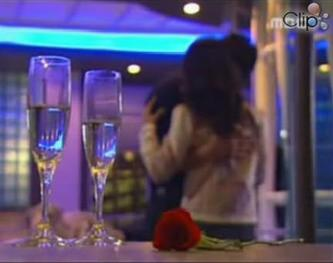
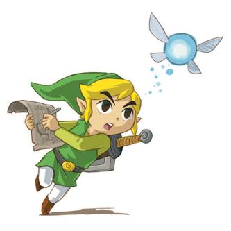
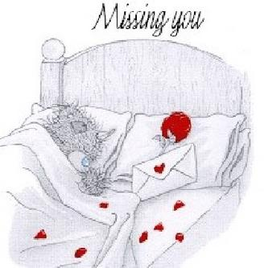

# TITLE: .:: High School Musical ::. Walt Disney 2006
* DATE: 10/26/2007 19:08:58
* STATUS: publish
* BODY: 

 
9h00 27/10/2007 <em>by Zelonght</em>
 
<strong>High School Musical I</strong> 1 phim ăn khách của hãng Disney được phát sóng vào hè 2006 qua, và gần đây được trình chiếu nhiều trên kênh Disney Channel tuy. Nội dung tuy không mới nếu so với các dạng hoạt hình hay phim với nhiều tình hướng éo le khác, nhưng cái hay mà tuổi teen, từ trẻ con cho đến người lớn đều yêu thích và đánh giá cao chính là giá trị nhân văn và nghệ thuật mà nó mang lại. Nếu các bạn đã từng xem sẽ nhận thấy rằng, để làm 1 bộ phim như vậy, nếu làm bằng hoạt cảnh trên máy tình là chuyện dễ mà 10 hay 20 năm trước người ta đã làm như trong <strong><em>Beauty and the Beast</em></strong>, <strong><em>Cô bé lọ lem</em></strong>, <strong><em>Tiểu thư và kẽ lang thang</em></strong>... vấn đề là đóng thật bằng những con người với cảm xúc, diện mạo, khung cảnh ngoài đời đâu phải làm chuyện dễ. Và cái không dễ đó họ đã làm được và thành công ! 
 
<strong>Tình nhân văn</strong>: nếu đem so với 1 bộ phim ma, kinh dị, đánh đấm thì cũng hơi khó vì khác lĩnh vực nhưng xét 1 cách khách quan những bộ phim như vậy chỉ mang đến sự tiêu khiển nhanh, tầm thường và đôi khi mang đến những kết quả tiêu cực với giới trẻ. Bộ phim HiScMu xây dựng cho người ta sự lạc quan, tin tưởng vào cuộc sống, về tình yêu trong sáng & đẹp, những khó khăn không là vấn đề nếu đồng lòng vượt qua, sự ích kỷ là điếu cấm kỵ trong 1 tập thể, kết thúc thật có hậu khi cái thiện, người tốt là người chiến thắng và những người chưa tốt cũng không bị tiêu diệt như trong Tấm Cám hay Cây Tre Trăm Đốt, mà họ dần chuyển biến hoà mình vào những người tốt ấy. 
 
<strong>Tính nghệ thuật:</strong> về nhạc, hình ảnh, âm thanh, animation thì khỏi chê, đúng là Walt Disney, những sư kiện, event, những thay đổi trong tâm lý nhân vật được lồng vào bằng những bài hát rất hợp với tâm trạng của nhân vật lẫn người xem. Đó là tính kinh điển trong những bộ phim của Walt Disney (ngoài trừ series phim Tom & Jerry!!!). Đó là sức mạnh của âm nhạc, một phương tiện diễn đạt nghệ thuật tâm nhất cảm xúc, vui buồn, bạn có thể nói "I want to make friend with you" một cách khô khan chẳng ai nghe, nghe xong rùi bỏ, nhưng một "<em><strong>Start of Something New</strong></em>" trong một hoàn cảnh đặc biệt
 
 <table cellspacing="0" cellpadding="5" bgcolor="#ccccff" border="1" style="border-collapse:collapse; "> <tbody> <tr> <td><embed src="http://www.youtube.com/v/uSurdRu5coY&rel=1&color1=0x006699&color2=0x54abd6&border=1" width="425" height="373" type="application/x-shockwave-flash" wmode="transparent" allowScriptAccess="none">  Troy Bolton và Gabriella Montez, hai học sinh không hề quen biết cùng tham dự bữa tiệc đêm giao thừa. Trong một cuộc thi hát karaoke của bữa tiệc, ánh đèn sân khấu ngẫu nhiên chiếu vào Troy và Gabriella đã buộc họ cùng nhau lên sân khấu để hát song ca bài hát "<em><strong>Start of Something New</strong></em>" - Trích wikipedia VN  

</td></tr></tbody></table>
 
"...Anh right here tonight it could be a start of something new... It feels so right to be here with you"---extracted lyrics, như một lời hẹn ước của 1 đôi bạn mới. Nghệ thuật là chổ ấy nó cho ta đi theo <em><strong>1 dòng chảy rất logic</strong></em> (quoted by Zelonght) không tạo sự phản cảm, áp đặt.
 
Một chi tiết khác khá thú vị là đoạn nhảy tập được chèn vào trong các chương của phim. Lúc đang xem có thể mình chưa hiểu ý nghĩa sâu xa của những đoạn tập nhảy ấy, 1 tiểu tiết kéo dài thời gian chăng ? Không đâu, đoạn tranining lặp lại 2 đến 3 lần cho khán giả xem và tập dần các động tác nhảy ấy trong đầu để rồi đến lúc kết, thật bất ngờ khi đó chính là một phần của bài nhạc "<em><strong>We're All in This Together</strong></em>", đã quen với những động tác ấy từ trước và bạn có thể đứng lên nhảy cùng họ. Khán giả đã thành là 1 người trong phim có thể tham gia vào nhóm nhảy lúc kết màn ấy ! Kịch bản quá "Pro"
 
<strong>Đi theo 1 dòng chảy rất logic musical ấy:</strong> (part of content taken from wekipdia.org): 
 <ul> <li>Hoàn cảnh tình huống: nội dung phim kể về <strong>Troy Bolton </strong>và <strong>Gabriella Montez</strong> quen nhau tình cờ qua bài hát <em><strong>Start of Something New </strong></em>trong một buổi party mừng năm mới---hai người đã có một bản song ca đầy ăn ý. Vì mẹ chuyển công tác nên Gabriella phải chuyển sang trường East High. thật bất ngờ, đây là một nơi mà bóng rổ được tôn sùng và cũng là nơi tỏa sáng của một tài năng bóng rổ - Troy Bolton. Trong một lần hát thử một bài hát của cô nhạc sĩ nhỏ bé trong trường là Kelsi, cô giáo Darbus đã phát hiện ra tài năng ca hát tiềm ẩn trong con người của Troy - một tài năng bóng rổ và Gabriella - một thiên tài về toán học và giới thiệu họ vào vòng 2 của buổi thử giọng cho một vở kịch của trường. Từ đây, bắt đầu cuộc cạnh tranh giữa hai cặp Troy - Gabriella và hai chị em nhà Evans: Sharpay - Ryan. Sharpay là một cô gái đầy lòng đố kị còn Ryan lại là một cậu em ngố tàu đến mức luôn để chị bắt nạt ngay cả khi biểu diễn; nhưng cả hai lại là những tài năng âm nhạc của trường, đã từng tham gia 17 buổi kịch lớn nhỏ. Đây cũng là lúc đội bóng rổ của <strong>Troy </strong>và đội khoa học (hoá học) của <strong>Gabriella </strong>có một cái bắt tay lịch sử vì đây là hai đối thủ không đội trời chung để chiếm vị trí độc tôn trong trường...  <li>Một tuần sau, mẹ của Gabriella đưa cô tới học ở trường mới vì cô là một thiên tài, trường East High, mà ngẫu nhiên là nơi mà Troy là đội trưởng đội bóng rổ và là chàng trai nổi tiếng nhất trường. Tại trường, Troy và Gabriella đã gặp nhau. Lúc này ở trường East High có buổi thử giọng để chọn ra người có thể đóng vở nhạc kịch cho lễ hội mùa đông ở trường. Troy và Gabriella phân vân không biết có nên tham gia buổi thử giọng hay không. Tình cờ đi qua bàn đăng ký, hai người gặp <strong>Sharpay</strong> Evans và <strong>Ryan</strong> Evans (hai người là chị em sinh đôi). Họ khá kiêu ngạo và không muốn ai được diễn vở kịch ngoài mình. Sharpay thích Troy. Troy vẫn tiếp tục tập bóng rổ bình thường. Tuy nhiên cậu ta không thể tập trung luyện tập vì cứ nghĩ đến Gabriella. Trong buổi thử giọng, Troy và Gabriella đều tỏ ra lo lắng cho nên họ trốn ở phía sau cửa xem các thí sinh khác biểu diễn. Khi họ đủ dũng cảm để diễn, cô <strong>Darbus</strong>, giáo viên nhạc, do không thích bố của Troy nên quyết định không cho hai người tham dự nữa. Bài hát trong buổi thử giọng là "<strong>What I've Been Looking For</strong>", sáng tác bởi cô bé Kelsi Nielson. Sharpay và Ryan đã biểu diễn diễn bài hát của Kelsi với một sự biến đổi hoàn toàn khác <== hát theo kiễu rock sôi động. Hai người đó đã được cô Darbus nhận vào buổi thử giọng vòng 2, còn Kelsi tỏ ra rất bất bình vì việc thay đổi bài hát của Sharpay và Ryan. Cô bé cãi nhau với Sharpay.Lúc chuẩn bị đi về, Kelsi trượt chân làm rơi bản nhạc bài hát. Troy và Gabriella đến nhặt bản nhạc cho Kelsi và quyết định thử hát bài hát đó. Sau khi hát xong, cô Darbus bất ngờ xuất hiện, tuyên bố cả 2 đã được nhận vào vòng tiếp theo</li></ul> 
 <table cellspacing="0" cellpadding="5" bgcolor="#d9ffd9" border="1" style="border-collapse:collapse; "> <tbody> <tr> <td align="middle"><strong>What I've Been Looking For - Sharpay & Ryan </strong></td></tr> <tr> <td align="middle"><embed src="http://www.youtube.com/v/vpH_xPKEun4&rel=1&color1=0x006699&color2=0x54abd6&border=1" width="425" height="373" type="application/x-shockwave-flash" wmode="transparent" allowScriptAccess="none"> </td></tr> <tr> <td align="middle"><strong>What I've Been Looking For - Troy & Gabriella </strong></td></tr> <tr> <td align="middle"><embed src="http://www.youtube.com/v/RuJgvULuRbc&rel=1&color1=0x402061&color2=0x9461ca&border=1" width="425" height="373" type="application/x-shockwave-flash" wmode="transparent" allowScriptAccess="none"> </td></tr> <tr> <td align="middle">Một bài hát với 2 phong cách khác nhau.Cả hai bài đều hay. Nhưng bài của <strong>Troy & Gabriella </strong>hay hơn vì diễn tả được cảm xúc bài hát nhiều hơn, và nhất là họ cũng là 1 cặp phù hợp với ý nghĩa bài hát. Giờ thì hiểu sao nó hay hơn rồi đó.</td></tr></tbody></table>
 <ul> <li>Sharpay và Ryan tỏ ra vô cùng giận dữ về việc Troy và Gabriella được nhận vào vòng 2. Để luyện tập cho vòng 2, Troy đã bỏ các buổi tập bóng rổ. Bố Troy, huấn luyện viên đội bóng rổ rất bất bình và đã ngăn cấm chuyện của Troy và Gabriella. Mẹ của Gabriella cũng vậy. Họ quyết định sắp xếp để Troy nói những lời phủ nhận việc hát hò không quan trọng và Gabriella chẳng là gì cả, những hình ảnh đó được truyền hình trực tiếp (bằng wi-fi) đến phòng khoa học của Gabriella khiến cô rất buồn rau đó đội bóng rổ ra ngoài sân vui chơi rất hoành tráng làm cho Gabriella thêm đau khổ. Gabriella đã hát bài "When There Was Me and You" <-- bài hát đỉnh theo thể loại đơn ca trong phim, giọng hát của Gabriella thật mạnh và cảm xúc cũng thật mạnh theo, giống như 1 sự dứt khoát với Troy "<em>I'am standing here but all I want is to be over here (with Troy ?) ... I found you were my fairytale. My dream when I'm not sleeping. </em><em>BUT THEN YOU WENT AND CHANGED THE WORDS. <strong>NOW MY HEART IS EMPTY</strong>. I'M ONLY LEFT WITH USED-TO-BE'S</em>". Những khó khăn giống như những loạt Giai Nhân & Quái Vật, như Lion King, như Cô bé lọ lem...</li></ul> 
 <table cellspacing="0" cellpadding="5" bgcolor="#ffecff" border="1" style="border-collapse:collapse; "> <tbody> <tr> <td align="middle"><strong>When There Was Me and You - Gabriella</strong></td></tr> <tr> <td align="middle"><embed src="http://www.youtube.com/v/kq0KEllpKqc&rel=1&color1=0xcc2550&color2=0xe87a9f&border=1" width="425" height="373" type="application/x-shockwave-flash" wmode="transparent" allowScriptAccess="none"> </td></tr></tbody></table>
 <ul> <li> 
 
 
 
Troy không hề hay biết rằng những lời mình nói đã bị Gabriella biết. Khi cố gắng bắt chuyện với Gabriella, cậu chỉ nhận được câu trả lời:"Cậu nói đúng. Hát không quan trọng. Tớ sẽ không tham gia vòng 2." Troy không hiểu tại sao lại thế. Đội bóng rổ và đội khoa học nhận thấy mình đã sai lầm Troy và Gabriella bắt đầu tập hát cùng nhau trở lại. Từ đó, phong độ bóng rổ và khoa học của hai người tăng cao rõ rêt. Sharpay và Ryan vô cùng tức giận nên đã âm mưu đổi ngày thử giọng vòng 2 từ thứ năm sang thứ sáu để trùng với cả 2 buổi thi đấu bóng rổ và khoa học. Troy, Gabriella và những người bạn đã lập kế hoạch để phá hỏng tạm thời hệ thống điện ở phòng thể dục và xả hóa chất ở phòng thi khoa học khiến cả 2 cuộc thi này đầu phải dừng lại. Họ lập tức có mặt để tham dự buổi thử giọng.

 <li>Trong buổi thử giọng vòng 2, Sharpay và Ryan hát ca khúc "<strong>Bop To The Top</strong>". Còn Troy và Gabriella thì hát ca khúc "<strong>Breaking Free</strong>" và nhận được sự ủng hộ từ tất cả học sinh trong trường.  </li></ul> 
 <table cellspacing="0" cellpadding="5" bgcolor="#ffffcc" border="1" style="border-collapse:collapse; "> <tbody> <tr> <td valign="top" align="middle"><strong>Bop to the Top - Sharpay & Ryan </strong></td></tr> <tr> <td valign="top" align="middle"><embed src="http://www.youtube.com/v/nAM-rh6B5DU&rel=1&color1=0x234900&color2=0x4e9e00&border=1" width="425" height="373" type="application/x-shockwave-flash" wmode="transparent" allowScriptAccess="none"> </td></tr> <tr> <td valign="top" align="middle">Một không khí sôi động náo nhiệt. Là nhạc nền cho những kế hoạch cam go đang được Troy & Gabriella & các bạn ráo riết thực hiện. Thiên vị với Sharpay & Ryan quá. Không đâu họ trình diễn thật sự hay. </td></tr> <tr> <td valign="top" align="middle"><strong>Breaking Free - Troy & Gabriella </strong></td></tr> <tr> <td valign="top" align="middle"><embed src="http://www.youtube.com/v/SHbj3X3LB2c&rel=1&color1=0xe1600f&color2=0xfebd01&border=1" width="425" height="373" type="application/x-shockwave-flash" wmode="transparent" allowScriptAccess="none"> </td></tr> <tr> <td valign="top">"Breaking Free" diễn tả đúng! Kế hoạch thành công, họ phải đối mặt với cả 3 cuộc thi quan trong. Điều gì giúp họ chiến thắng chính mình và vượt qua những người đang ".<em>..Creating space between us...</em>". "<em>You know the world can see us. So we’re breaking free ....More than hope. More than faith. This is true. This is fate. And together</em>"</td></tr></tbody></table>
 
<strong>Bàn về vấn để Dream</strong>: 
 
Kết thúc bộ phim là chiến thắng của cả đội tuyển bóng rổ và khoa học của trường East High. Bộ phim kết thúc bởi ca khúc "<strong>We're All in This Together</strong>". Cùng với bài hát "<strong>Stick to the Status Quo</strong>". Cả hai trở thành 2 bài nhạc hát tập thể "đỉnh" nhất của bộ phim. Hai bài này lại có tính trái ngượ nhau. "<strong>Stick to the Status Quo</strong>" thể hiện những ước mơ của những con người bình dị, cầu thủ bóng rổ muốn là một nhà làm bánh chuyên nghiệp, cô sinh viên hoá học muốn ca và nhảy break dance, mọi người thì thay nhau dập tắt ý định mới vừa "dám" manh nha ấy. Chàng cầu thủ bóng rổ hay cô sinh viên hoá học ấy chính là hình ảnh ẩn dụ của Troy và Gabriella trong phim. ...Và hoàn toàn ngược lại "<strong>We're All in This Together</strong>" là một khúc ca khải hoàn, với ý nghĩa: mọi giấc mơ đều có thể thành hiên thực, đó là ca khúc kết của bộ phim và cũng chính là lúc chi tiết dạy demo các động tác nhảy xen kẽ trong phim được tiết lộ, một kịch bản có đầu đuôi rất liền mạch:
 <blockquote> 
<em>We're all in this together  Once we know  That we are  We're all stars  And we see that  We're all in this together  And it shows  When we stand  Hand in hand  Make our dreams come</em>
</blockquote> 
 <table cellspacing="0" cellpadding="5" bgcolor="#99ccff" border="1" style="border-collapse:collapse; "> <tbody> <tr> <td align="middle"><strong>Stick to the Status Quo - Various</strong></td></tr> <tr> <td align="middle"><embed src="http://www.youtube.com/v/ymNVMSBhFHc&rel=1&color1=0x3a3a3a&color2=0x999999&border=1" width="425" height="373" type="application/x-shockwave-flash" wmode="transparent" allowScriptAccess="none"> </td></tr> <tr> <td align="middle">"...Stick to the stuff you know.  If you wanna be cool.  Follow one simple rule.  Don't mess with the flow, no no.  Stick to the status quo..."</td></tr> <tr> <td align="middle"><strong>We're All in This Together - Various</strong></td></tr> <tr> <td align="middle"><embed src="http://www.youtube.com/v/k7zzbB17Fvo&rel=1&color1=0x3a3a3a&color2=0x999999&border=1" width="425" height="373" type="application/x-shockwave-flash" wmode="transparent" allowScriptAccess="none"> </td></tr> <tr> <td align="middle">"...Wild cats everywhere  Wave your hands up in the air  That's the way we do it  Let's get to it  Come on everyone!..."</td></tr></tbody></table>
 

 
 
 
 
 <h2>Album "High School Musical"</h2> 
Tiếp sau sự thành công của bộ phim, hãng Disney đã tung ra album cùng tên gồm các bài hát trong phim, album này đã đứng ở vị trí thứ nhất trong bảng xếp hạng Billboard top 10 các album bán chạy nhất 2006.
 <h3>Các bài hát trong album</h3> <table> <tbody> <tr bgcolor="#cccccc"> <th><strong>STT</strong></th> <th><strong>Tên</strong></th> <th><strong>Thể hiện</strong></th></tr> <tr> <td align="middle">1</td> <td>Start Of Something New</td> <td>Troy & Gabriella</td></tr> <tr> <td align="middle">2</td> <td>Get'cha Head In The Game</td> <td>Troy & Đội bóng rổ</td></tr> <tr> <td align="middle">3</td> <td>What I've Been Looking For</td> <td>Sharpay & Ryan</td></tr> <tr> <td align="middle">4</td> <td>What I've Been Looking For (Hát lại)</td> <td>Troy & Gabriella</td></tr> <tr> <td align="middle">5</td> <td>Stick To The Status Quo</td> <td>Tất cả diễn viên (trừ Troy & Gabriella)</td></tr> <tr> <td align="middle">6</td> <td>When There Was Me & You</td> <td>Gabriella</td></tr> <tr> <td align="middle">7</td> <td>Bop To The Top</td> <td>Sharpay & Ryan</td></tr> <tr> <td align="middle">8</td> <td>Breaking Free</td> <td>Troy & Gabriella</td></tr> <tr> <td align="middle">9</td> <td>We're All In This Together</td> <td>Tất cả diễn viên</td></tr> <tr> <td align="middle">10</td> <td>I Can't Take My Eyes Off Of You</td> <td>Troy, Gabriella, Sharpay & Ryan</td></tr></tbody></table>

 
* bài 1 & 11 không được giới thiệu trong Entry, các bạn có thể dùng Youtube để nghe / xem
 
<strong><em>Rất thích những bộ phim của Walt Disney, trước đây theo thể loại hoạt hình và đây là bộ phim đầu tiên do người đóng rất thành công của họ. Như một sự tán dương và thay mặt các fan hâm mộ High School Musical mạng phép viết và đưa entry này lên blog. OK! Wave your hands up in the air. That's the way we do it . Let's get to it . Come on everyone! </strong></em>
 

 
<strong><em></strong></em>
 
<strong><em>Lyrics collected </strong></em><em><strong>from lyricsmania</strong></em>
 
  <table cellspacing="0" cellpadding="0" border="0"> <tbody> <tr> <td valign="top"> <table cellspacing="0" cellpadding="0" border="0"> <tbody> <tr> <td> <table cellspacing="0" cellpadding="0" border="0"> <tbody> <tr> <td valign="top" height="740"> <table> <tbody> <tr> <td> <h3>High School Musical - Start Of Something New lyrics  www.lyricsmania.com</h3>Living in my own world  Didn't understand  That anything can happen  When you take a chance  I never believed in  What I couldn't see  I never opened my heart (ooh)  To all the possibilities (ooh)  I know that something has changed  Never felt this way  And right here tonight   This could be the start  Of something new  It feels so right  To be here with you (ooh)  And now looking in your eyes  I feel in my heart (feel in my heart)  The start of something new   Now who'd of ever thought that (ooh)  We'd both be here tonight (ooh yeah)  And the world looks so much brighter (brighter)  With you by my side  I know that something has changed  Start Of Something New Lyrics on http://www.lyricsmania.com  Never felt this way  I know it for real   This could be the start  Of something new  It feels so right  To be here with you (ooh)  And now looking in your eyes  I feel in my heart  The start of something new   I never knew that it could happen  Till it happened to me  I didn't know it before  But now it's easy to see   It's the start  Of something new  It feels so right  To be here with you (ooh)  And now looking in your eyes  I feel in my heart   That it's the start  Of something new  It feels so right (so right)  To be here with you (ooh)  And now looking in your eyes  I feel in my heart  The start of something new  Start of something new  The start of something new</td></tr></tbody></table></td></tr></tbody></table></td></tr></tbody></table></td></tr></tbody></table>
 
 
 
 <table cellspacing="0" cellpadding="0" border="0"> <tbody> <tr> <td valign="top"> <table cellspacing="0" cellpadding="0" border="0"> <tbody> <tr> <td> <table cellspacing="0" cellpadding="0" border="0"> <tbody> <tr> <td valign="top" height="740"> 
 <table> <tbody> <tr> <td> <h3>High School Musical - What I've Been Looking For  www.lyricsmania.com</h3>Ryan:  It's hard to believe  That I couldn't see   Together:  You were always there beside me  Thought I was alone  With no one to hold  But you were always right beside me   Sharpay:  This feelings like no other   Together:  I want you to know   I've never had someone that knows me like you do  the way you do  I've never had someone as good for me as you  no one like you so lonely before I finally found  what i've been looking for   Sharpay:  So good to be seen  So good to be heard  What I've Been Looking For Lyrics on http://www.lyricsmania.com   Together:  Don't have to say a word   Ryan:  For so long I was lost  So good to be found   Together:  I'm loving having you around   Ryan:  This feeling's like no other   Together:  I want you to know   I've never had someone that knows me like you do  The way you do  I've never had someone as good for me as you  No one like you  So lonely before, I finally found  what I've been looking for   Together:  Doo Doo DooDoo  Doo Doo DooDoo  Do Do   Woa-ah-ah-oh   Doo Doo DooDoo  Doo Doo DooDoo  Do Do   Woa-ah-ah-oh</td></tr></tbody></table>
</td></tr></tbody></table></td></tr></tbody></table></td></tr></tbody></table>
 
 
 
 <table cellspacing="0" cellpadding="0" border="0"> <tbody> <tr> <td valign="top"> <table cellspacing="0" cellpadding="0" border="0"> <tbody> <tr> <td> <table cellspacing="0" cellpadding="0" border="0"> <tbody> <tr> <td valign="top" height="740"> <table> <tbody> <tr> <td> <h3>High School Musical Cast - When There Was Me And You lyrics  www.lyricsmania.com</h3>It's funny when you find yourself  Looking from the outside  I'm standing here but all I want  Is to be over there  Why did I let myself believe  Miracles could happen  Cause now I have to pretend  That I don't really care   I thought you were my fairytale  A dream when I'm not sleeping  A wish upon a star  That's coming true  But everybody else could tell  That I confused my feelings with the truth  When there was me and you   I swore I knew the melody  That I heard you singing  And when you smiled  You made me feel  Like I could sing along  But then you went and changed the words  Now my heart is empty  I'm only left with used-to-be's  When There Was Me And You Lyrics on http://www.lyricsmania.com  And once upon a song   Now I know you're not a fairytale  And dreams were meant for sleeping  And wishes on a star  Just don't come true  Cause now even I can tell  That I confused my feelings with the truth  Because I liked the view  When there was me and you   I can't believe that  I could be so blind  It's like you were floating  While I was falling  And I didn't mind   Cause I liked the view  Thought you felt it too  When there was me and you   </td></tr></tbody></table></td></tr></tbody></table></td></tr></tbody></table></td></tr></tbody></table>
 
 
 
 <table cellspacing="0" cellpadding="0" border="0"> <tbody> <tr> <td valign="top"> <table cellspacing="0" cellpadding="0" border="0"> <tbody> <tr> <td> <table cellspacing="0" cellpadding="0" border="0"> <tbody> <tr> <td valign="top" height="740"> <table> <tbody> <tr> <td> <h3>Ashley Tisdale - Bop To The Top lyrics  www.lyricsmania.com</h3>(feat. Lucas Grabeel)   [Sharpay:]  I believe in dreamin'  Shootin' for the stars   [Ryan:]  Baby to be number one  You've got to raise the bar   [Sharpay:]  Kickin' and a scratchin'  Grindin' out my best   [Ryan:]  Anything it takes  To climb the ladder of success   [Both:]  Work our tails off every day  Gotta bump the competition  Blow them all away   [Sharpay:]  Yeah we're gonna  Bop To The Top Lyrics on http://www.lyricsmania.com   [Both:]  Bop, bop, bop  Bop to the top   [Ryan:]  Slip and slide and ride that rhythm   [Both:]  Jump and hop hop 'til we drop   [Sharpay:]  And start again   Zip zap zop  Pop like a mop   [Ryan:]  Scoot around the corner   [Both:]  Move it to the groove  'Til the music stops  Do the bop bop, bop to the top  Don't ever stop  Bop to the top   Gimmie, gimmie  Shimmy shimmy  Shake some booty and turn around  Flash a smile in their direction   [Sharpay:]  Show some muscle   [Ryan:]  Do the hustle   [Both:]  Yeah we're gonna bop, bop, bop  Bop to the top   [Ryan:]  Wipe away your inhibitions   [Both:]  Stump, stump, stump do the rump   [Sharpay:]  And strut your stuff   [Both:]  Bop, bop, bop  Straight to the top  Going for the glory  We'll keep stepping up  And we just won't stop  'Til we reach the top  Bop to the top   (Thanks to Ruffy for these lyrics)   </td></tr></tbody></table></td></tr></tbody></table></td></tr></tbody></table></td></tr></tbody></table>
 
 
 
 <table cellspacing="0" cellpadding="0" border="0"> <tbody> <tr> <td valign="top"> <table cellspacing="0" cellpadding="0" border="0"> <tbody> <tr> <td> <table cellspacing="0" cellpadding="0" border="0"> <tbody> <tr> <td valign="top" height="740"> <table> <tbody> <tr> <td> <h3>High School Musical Cast - Breaking Free lyrics  www.lyricsmania.com</h3>Troy:  We’re soarin’, flyin’  There’s not a star in heaven  That we can’t reach   Gabriella:  If we’re trying  So we’re breaking free   Troy:  You know the world can see us  In a way that’s different than who we are   Gabriella:  Creating space between us  ‘Til we’re separate hearts   Both:  But your faith it gives me strength  Strength to believe   Chorus #1  Troy:  We’re breakin’ free  Gabriella:  Breaking Free Lyrics on http://www.lyricsmania.com  We’re soarin’  Troy:  Flyin’  Both:  There’s not a star in heaven  That we can’t reach  Troy:  If we’re trying  Both:  Yeah, we’re breaking free  Troy:  Oh, we’re breakin’ free  Gabriella:  Ohhhh  Troy:  Can you feel it building  Like a wave the ocean just can’t control  Gabriella:  Connected by a feeling  Ohhh, in our very souls  Both:  Rising ‘til it lifts us up  So every one can see   Chorus #2  Troy: We’re breakin’ free  Gabriella: We’re soarin’  Troy: Flyin’  Both:  There’s not a star in heaven  That we can’t reach  Troy:  If we’re trying  Yeah we’re breaking free  Gabriella:  Ohhhh runnin’  Troy:  Climbin’  To get to that place  Both:  To be all that we can be  Troy:  Now’s the time  Both:  So we’re breaking free  Troy:  We’re breaking free  Gabriella:  Ohhh , yeah   Troy:  More than hope  More than faith  Gabriella:  This is true  This is fate  And together   Both:  We see it comin’  Troy:  More than you  More than me   Gabriella:  Not a want, but a need  Both:  Both of us breakin’ free   Chorus #3  Gabriella: Soarin’  Troy: Flyin’  Both:  There’s not a star in heaven  That we can’t reach  If we’re trying  Troy: Yeah we’re breaking free  Gabriella:  Breaking free  Were runnin’  Troy:  Ohhhh, climbin’  Both:  To get to the place  To be all that we can be  Now’s the time  Troy: Now’s the time  Gabriella: So we’re breaking free  Troy: Ohhh, we’re breaking free  Gabriella: Ohhhh   Both:  You know the world can see us  In a way that’s different than who we are   </td></tr></tbody></table></td></tr></tbody></table></td></tr></tbody></table></td></tr></tbody></table>
 
 
 
 <table cellspacing="0" cellpadding="0" border="0"> <tbody> <tr> <td valign="top"> <table cellspacing="0" cellpadding="0" border="0"> <tbody> <tr> <td> <table cellspacing="0" cellpadding="0" border="0"> <tbody> <tr> <td valign="top" height="740"> <table> <tbody> <tr> <td valign="top"> <h3>High School Musical Cast - Stick To The Status Quo lyrics</h3> 
Zeke:  You can bet  There's nothin' but net  When I am in a zone and on a roll  But I've got a confession  My own secret obsession  And it's making me lose control   Jocks:  Everybody gather 'round   Not another sound   Jocks:  No, no, no, nooooooooooo  No, no, no  Stick to the stuff you know  If you wanna be cool  Follow one simple rule  Don't mess with the flow, no no  Stick to the status quo   Martha Cox:  Look at me  And what do you see  Intelligence beyond compare  But inside I am stirring  Something strange is occuring  It's a secret I need to share   Brainiacs:  Open up, dig way down deep   Not another peep   Brainiacs:  No, no, no, noooooooooo  No, no, no  Stick to the stuff you know  It is better by far  To keep things as they are  Don't mess with the flow, no no  Stick to the status quo   Skaterdude:  Listen well  I'm ready to tell  About a need that I cannot deny  Dude, there's no explanation  For this awesome sensation  But I'm ready to let it fly   Dudes & Dudettes:  Speak your mind and you'll be heard   Not another word   Dudes & Dudettes:  No, no, no, nooooooooooo  No, no, no  Stick to the stuff you know  If you wanna be cool  Follow one simple rule  Don't mess with the flow, no no  Stick to the status quo   No, no, no  Stick to the stuff you know  It is better by far  To keep things as they are  Don't mess with the flow, no no  Stick to the status quo    Sharpay:  This is not what I want  This is not what I planned  And I just gotta say  I do not understand  Someting is really   Ryan:  Something's not right   Sharpay:  Really wrong   Sharpay & Ryan:  And we gotta get things  Back where they belong  We can do it   Skaterdude:  Gotta play   Dudes & Dudettes:  Stick with what you know   Sharpay & Ryan:  We can do it   Martha Cox:  Hip hop hooray   Brainiacs:  She has got to go   Sharpay & Ryan:  We can do it   Zeke:  Creme Brule   Jocks:  Keep your voice down low   Jocks, Brainiacs & Dudes/Dudettes:  Not another peep  No, not another word  No, not another sound  No   Sharpay:  Everybody quiet    Jocks, Brainiacs...:  Noooooooooooooo, no, no, no  Stick to the stuff you know  If you want to be cool  Follow one simple rule  Don't mess with the flow, oh no  Stick to the status quooooooooooooo  No, no, no  Stick to the stuff you know  It is better by far  To keep things as they are  Don't mess with the flow, no no  Stick to the status  stick to the status  Stick to the status quo
</td> <td valign="top"> <h3>High School Musical Cast - We're All In This Together lyrics</h3> Together, together, together everyone  Together, together, come on lets have some fun  Together, were there for each other every time  Together together come on lets do this right   Here and now its time for celebration  I finally figured it out (yeah yeah)  That all our dreams have no limitations  That's what its all about   Everyone is special in their own way  We make each other strong (each other strong)  Were not the same  Were different in a good way  Together's where we belong   We're all in this together  Once we know  That we are  We're all stars  And we see that  We're all in this together  And it shows  When we stand  Hand in hand  We're All In This Together Lyrics on http://www.lyricsmania.com  Make our dreams come true   Together, together, together everyone  Together, together, come on lets have some fun  Together, were there for each other every time  Together together come on lets do this right   We're all here  and speaking out with one voice  we're going to rock the house (rock the house)  the party's on now everybody make some noise  come on scream and shout   We've arrived because we stuck together  Champions one and all   We're all in this together  Once we know  That we are  We're all stars  And we see that  We're all in this together  And it shows  When we stand  Hand in hand  Make our dreams come   We're all in this together  When we reach  We can fly  Know inside  We can make it  We're all in this together  Once we see  There's a chance  That we have  And we take it   Wild cats sing along  Yeah, you really got it goin' on  Wild cats in the house  Everybody say it now  Wild cats everywhere  Wave your hands up in the air  That's the way we do it  Lets get to it  Time to show the world   We're all in this together  Once we know  That we are  We're all stars  And we see that  We're all in this together  And it shows  When we stand  Hand in hand  Make our dreams come   We're all in this together  When we reach  We can fly  Know inside  We can make it  We're all in this together  Once we see  There's a chance  That we have  And we take it   Wild cats everywhere  Wave your hands up in the air  That's the way we do it  Let's get to it  Come on everyone!</td></tr></tbody></table></td></tr></tbody></table></td></tr></tbody></table></td></tr></tbody></table>
 
 
</embed></embed></embed></embed></embed></embed></embed></embed></li></li>

[ COMMENT: ]
* AUTHOR: *~$Janie$~*
* DATE: 02/28/2008 20:02:57
Hay lắm, bạn c򮠶iết cả lời b᩠hⴠnữa, vࡣ򮠰ost video l뮠để xem nữa, rất tuyệt c򠭨o!!!^_^

[ COMMENT: ]
* AUTHOR: 
* DATE: 02/29/2008 21:35:31
^__^

--------

# TITLE: A new day has come
* DATE: 10/25/2007 10:36:25
* STATUS: publish
* BODY: 

So quick, moment before is 11hPM. Zuzzut... 0h30 already, too fast.   Today is the first the I call the "revert-back" series day after a short time losing sefl control (not that bad man). In fact, just because invalid excuse -- insufficent time -- it turns out to have much trouble but 1 + 1 is always 2 so <strong>Let get it's started</strong> 
 
<strong>Let get it's starte</strong> will be the theme of this weekend and next week !!!!!!
 

 
  <embed src="http://media.imeem.com/v/kMHM8y7Q4W/aus=false/pv=2" type="application/x-shockwave-flash" width="400" height="325" allowScriptAccess="none"></embed>

--------

# TITLE: Music, kisses exist but love won't
* DATE: 10/23/2007 09:15:11
* STATUS: publish
* BODY: 

 
<strong><em>A</em></strong><strong><em>sian drama kiss scene</em></strong>. They are so cool in films. In real life it's only for true love but hard to believe that object exists  . Awy, music is cool and it's good enough already  
 
<embed src="http://clip.vn/w/Fop,vn,0" width="448" height="372" type="application/x-shockwave-flash" allowScriptAccess="none"></embed>

[ COMMENT: ]
* AUTHOR: Tuan Pham
* DATE: 10/23/2007 18:12:10
HᮠQuốc chiếm đa số! 
 
Nhờ entry nṠmࡔuấn biết được trang clip.vn. Thanks, Long!

[ COMMENT: ]
* AUTHOR: 
* DATE: 10/23/2007 18:29:32
"Yhey are so cool in films In real life it's only for true love". I've never seen this film, don't understand much.  
But I agree with u that kissing like this just only exists in real life, that's it!

--------

# TITLE: http://conganphutho.gov.vn bị hack !!!
* DATE: 10/21/2007 02:23:46
* STATUS: publish
* BODY: 

  Giới Hacker lại ra tay ! Tuy message mang ý nghĩa tốt, muốn mọi người nhận thức sâu hơn về cái tốt, cái xấu. Tuy nhiên hack như thế này quả thật là phạm tội đó, nói về phía Pháp luật là như vậy vì đây là cơ quan công an. "Vì Chúng Tôi Là Những Người Thấp Cổ Bé Họng ,Lời Nói Không Có Người Nghe ,Chúng Tôi Phải Làm Thế Này, Thì May Ra Mới Được Để Ý Tới ,Chân Thành Xin Lỗi Tất Cả Mọi Người" liệu có đủ che chắn khi bị phát hiện ra, hy vọng măn mắn cho những người tốt !   <strong>Hack message</strong>:  <em> Hỡi Các Hacker, Quay Đầu Lại Là Bờ, Nhưng Là Bờ Vực Thẳm, Ai Có Khả Năng Hãy Cùng Chúng Tôi "Đòi Lại Công Bằng"</em> <em> This Site Was Hacked By [Đòi Lại Công Bằng] - We R Comeback!!!</em>  <em> Vì Chúng Tôi Là Những Người Thấp Cổ Bé Họng ,Lời Nói Không Có Người Nghe ,Chúng Tôi Phải Làm Thế Này, Thì May Ra Mới Được Để Ý Tới ,Chân Thành Xin Lỗi Tất Cả Mọi Người</em>  <em> Chúng Tôi Chờ Đợi 1 Lời Giải Thích Từ VTV, Tại Vì Sao ? Khi Mà 53 Nạn Nhân Qua Đời Vì Tai Nạn Sập Cầu Cần Thơ, Thân Nhân Và Gia Quyến Không Được 1 Chương Trình Để Cả Nước Cùng Chia Sẻ Nỗi Đau Với Họ ??? Nhưng Với 1 Cá Nhân, 1 Cô Bé Vào vai Vàng Anh Thì Lại Được Giải Thích, Được ưu Ái ? Thật Là Quá Khâp Khiễng Khi Đưa Ra Để So Sánh , Nhưng Sự Thật Cay Đắng Là 53 Người Thiệt Mạng Đối Với VTV Cũng Không Bằng 1 Cô Bé, Mọi Người Sẽ Nghĩ Gì, Thân Nhân Và Gia Quyến 53 Người Bị Hại Sẽ Suy Nghĩ Ra Sao, Chắc Hẳn Sẽ Không Khỏi Tủi Thẹn ...</em>  <em> VTV - Đọc Và Suy Ngẫm Nhé</em>  <em> Chuyện kể rằng, dân ta kẻ chết vì sập cầu, kẻ sầu đau vì lũ lụt, kẻ lục đục vì thiên tai, kẻ mất sinh nhai vì sơ tán: VTV thoáng chút quan tâm, sau lặng câm như hến. Lại mới hay, trẻ tập làm người lớn, xớn xác làm phim heo, cả đài liền chạy theo, làm "cầu xin tha lỗi", rằng "đã hối hận rồi", mong mọi người hãy thôi, "hãy đừng quan tâm nữa" !!! => VTV không xứng đáng là 1 đài truyền hình quốc gia đại diện cho toàn thể người dân Việt Nam, nếu đồng ý thì hãy nhắn tin này cho những người trong list bạn bè!</em>  <em> 53 công nhân tử nạn trong vụ sập cầu Cần Thơ liệu có khỏi chạnh lòng với cô bé Vàng Anh khi họ ko đc VTV tổ chức 1 buỗi lễ tưởng nhớ nào trong khi vàng anh chia tay khán giả cả nước thật đình đám Pó tay nhà đài rồi, lá cải Việt Nam các nạn nhân ơi tớ thật đau xót và chạnh lòng dẫu biết chia tay là được nhưng có phải làm rùng beng lên như thế ko Đúng là có tiền có tất cả ko tiền chỉ biết mà thui chỉ khổ dân nghèo .Thật lố bịch khi dành 1 buổi phát hình VTV3 cho diễn viên đóng film cấp 3 Thuỳ Linh lên tâm sự. Giả dối quá nên diễn đi diễn lại 6 lần mới đạt. Chịu hết nổi. Thương quá Việt Nam ơi</em>  <em> Bush đang ngồi uống cafe Trung Nguyên với Binladen bàn chuyện gì đó. 1 anh bồi bàn bưng nước lại thấy bất ngờ vì dc gặp 2 người nổi tiếng nên bắt chuyện: "Có phải ngài là G.Bush? Có thể nói cho tôi biết là quý vị đang nói về vấn đề gì không ?". Bush nói: "Tôi đang bàn với binladen là năm nay sẽ quay sang tiêu diệt 80 tr dân Việt nam và Con Vàng Anh" Anh bồi bàn hỏi: "Sao lại là Vàng Anh thưa ngài ?" Lúc này Bush quay sang Binladen và nói: "Đấy ! Ông thấy chưa, tôi đã bảo là mấy thằng Việt Nam chẳng có đứa nào quan tâm đến 80 tr dân kia đâu !"</em>  <em> Cùng 1 Thân Phận, yến Vi, Hồng Nhung Phải Bỏ Xứ Mà Đi, Bị Cả Xã Hội Lên Án, Còn Thùy Linh?Báo Chí "Xin Đừng Giết Vàng Anh" - VTV "Làm Chương Trình Tạm Biệt" , Ôi, Yến Vi - Hồng Nhung Ơi , Giờ Bọn Em Lưu Lạc Nơi Đâu ????</em>       

--------

# TITLE: ♪ Clementine - 이지수 by Various Artists ♫
* DATE: 10/17/2007 10:50:00
* STATUS: publish
* BODY: 

 
<embed src="http://media.imeem.com/m/x0J8-NcOKR&autostart=false" width="300" height="80" type="application/x-shockwave-flash" wmode="transparent" allowScriptAccess="none"></embed>
 
<em>Copy từ imeem of </em><a href="http://profile.imeem.com/BFwRlL/music/DRU9-sTs/various_artists_clementine/"><em>tothuytien</em></a>
 
Bài này thật sự là 1 nhạc phẩm buồn, mà khi bé tụi mình nghe không hiều, cứ tưởng 1 bài hát cho thiếu nhi như những bài khác. Violon và Piano lại kết hợp thật hay ah ! 
 

--------

# TITLE: ♪ Song of Heaven ♫
* DATE: 10/17/2007 10:29:15
* STATUS: publish
* BODY: 

 
  <embed src="http://media.imeem.com/m/fkC98QMm0J" type="application/x-shockwave-flash" width="300" height="80" wmode="transparent" allowScriptAccess="none"></embed>
 
Oh - thinkin' about all our younger years  There was only you and me  We were young and wild and free   Now nothin' can take you away from me  We bin down that road before  But that's over now  You keep me comin' back for more   Baby you're all that I want  When you're lyin' here in my arms  I'm findin' it hard to believe  We're in heaven  And love is all that I need  And I found it there in your heart  It isn't too hard to see  We're in heaven   Oh - once in your life you find someone  Who will turn your world around  Bring you up when you're feelin' down   Ya - nothin' could change what you mean to me  Oh there's lots that I could say  But just hold me now  Cause our love will light the way   N' baby you're all that I want  When you're lyin' here in my arms  I'm findin' it hard to believe  We're in heaven  And love is all that I need  And I found it there in your heart  It isn't too hard to see  We're in heaven   I've bin waitin' for so long  For something to arrive  For love to come along   Now our dreams are comin' true  Through the good times and the bad  Ya - I'll be standin' there by you  

--------

# TITLE: The water baby: Amazing pictures that capture the moment a dolphin joins the world
* DATE: 10/06/2007 17:33:50
* STATUS: publish
* BODY: 
It is one of the rarest and most magical sights in the natural world.  
 
A bottlenose dolphin goes into labour . . . then a calf emerges, tail first. Mother guides baby gently to the surface, where they swim together for the first time.  
Very few dolphin births have been captured on film in such astonishing detail.  
 
<strong>Scroll down for more...</strong>  

 
  
Magical: Very few dolphin births have been captured on film
 

 
  
Nearly there: The dolphin is born tail first
 

 
  
In a cloud of blood the dolphin calf is free
 

 
 
This one was recorded at a wildlife park pool in Rimini, Italy, where photographer Leandro Stanzani was in exactly the right place at the right time.  
"To take good pictures is not easy," said Mr Stanzani, who has been taking photos of dolphins for 14 years.  
"Most births happen during the night when the light is very poor.  
<strong>Scroll down for more...</strong>  

 
  
Happily swimming side by side with its mother the baby dolphin is instantly at home in the sea
 

 
 
"Sometimes dolphins prefer to stay far away from windows. Sometimes water quality is poor.  
"This time I was extremely lucky. It was daytime first of all. There were three photographers, one at each of the three underwater windows - and I was at the right one!  
"The others couldn't even see the event."  
<strong>Scroll down for more...</strong>  

 
  
Follow my lead: Mother shows baby how to leap in true dolphin style 

 
  
Mother nose best: Moments after the birth, she helps the calf towards the surface 

[ COMMENT: ]
* AUTHOR: 
* DATE: 10/06/2007 22:37:31
hay wa anh Loong oi, lan dau tien em bik ca voi sinh the nay a' !! de thuong ghe di !!

--------

# TITLE: Nối dài những comment, nối dài sự chia sẻ
* DATE: 10/03/2007 19:13:12
* STATUS: publish
* BODY: 

“Một dòng comment nhỏ, một chữ ký nhỏ hòa chung với hàng ngàn dòng comment, và hàng trăm chữ ký sẽ tạo nên một tấm lòng lớn mà người dân cả nước, đặc biệt là những cư dân của cộng đồng blog chân thành gửi tới Cần Thơ ” - Đó chính là điều thôi thúc nhóm tình nguyện “Cánh Gió” tổ chức buổi offline đầy ý nghĩa tưởng nhớ và chia sẻ nỗi đau với các nạn nhân trong thảm kịch “Cầu Cần Thơ” xảy ra ngày 26/9. 
 
 Ký tên và thắp nến tưởng niệm các nạn nhân (Ảnh: Trà My) 
 
Trong buổi sáng 26/9, ngay khi báo chí và truyền hình chưa đưa những thông tin chính thức về Cần Thơ, thế giới blog đã xôn xao bởi vụ sập cầu thảm khốc. Những dòng blast ngắn ngủi và bàng hoàng trên blog nhà báo Vũ Mạnh Cường (báo Lao động) trước khi lao vào Cần Thơ tác nghiệp, những entry sửng sốt được viết vội đã làm thông tin, sự việc và nỗi đau ấy lan nhanh trên một cộng đồng lớn, để rồi những ngày sau đó, hàng trăm dòng blast, hàng trăm lời nguyện cầu và tiếc thương xuất hiện trên các blog. 2 ngày sau ngày sập cầu, kỹ sư xây dựng trẻ Lâm An đã post lên blog mình những dòng thơ đau xót và ám ảnh về sự hi sinh của những công nhân trên cầu. Anh chỉ đứng cách cây cầu ấy vài chục mét khi nó đổ sập xuống, 2 ngày vừa hiến máu vừa đợi tìm xác công nhân... 
 
Chỉ một ngày sau khi xảy ra vụ tai nạn, blogger Hoài Nghĩa đã có một entry với tựa đề “Tấm lòng gửi cầu Cần Thơ” thu hút được sự quan tâm rất lớn của cộng đồng blog Việt Nam. Tất cả đều có chung một tấm lòng, một suy nghĩ hướng về đồng bào Cần Thơ đang phải chịu đau thương mất mát. Một buổi offline quyên góp, ủng hộ cho các nạn nhân trong vụ sập cầu Cần Thơ đã được tổ chức tại quán Buzz caffe - 34 Văn Cao, Hà Nội từ 14h - 16h chiều hôm qua (30/9/2007) với sự có mặt của đại diện báo “Thể thao & Văn Hóa”. 
 
Trong vòng 2 tiếng đồng hồ từ 14h – 16h chiều ngày chủ nhật 30/9/2007, với mỗi comment chia sẻ với các nạn nhân Cần Thơ tại entry post trên blog Hoài Nghĩa: http://360.yahoo.com/hoainghiachat, nhóm tình nguyện “Cánh gió” sẽ trích quỹ 2000 VND gửi vào số tiền quyên góp - số tiền này do các nhà hảo tâm đóng góp vào quỹ Cánh gió. Thời điểm bắt đầu tính comment để ủng hộ những nạn nhân ở Cần Thơ bắt đầu từ 14h chiều ngày 30/9, thế nhưng trước đó đã có không ít những comment được gửi dồn dập đến không chỉ ở Việt Nam mà còn ở nước ngoài. Những người đồng bào xa xứ muốn góp một phần nhỏ bé để chia sẻ nỗi đau với Cần Thơ đã không quản ngại sự chênh lệch múi giờ để có thể thức suốt đêm comment trực tiếp. 14h, thời điểm entry “Tấm lòng gửi cầu Cần Thơ” tính những comment đầu tiên, chỉ trong vòng 1 giây trong một cú click “refresh”, số lượng comment đã lên đến 10. Và sau 10 phút, số lượng những blogger vào chia sẻ trong đã lên tới hơn 600, những comment đôi lúc chỉ là dòng dấu “………” đầy khắc khoải… Tất cả đã phần nào thể hiện nỗi đau và sự chia sẻ của cộng đồng blog trong và ngoài nước trước sự việc đau thương xảy đến đột ngột với những công nhân đang xây dựng tại cầu Cần Thơ. 
 
Anh Na Sơn, phóng viên ảnh tự do, người tình cờ biết được thông tin về buổi offline quyên góp, đã đem đến những tấm ảnh đen trắng, những tấm ảnh đau đớn và nhức nhối được chụp ngay trong ngày đầu tiên anh đặt chân đến Cần Thơ, sáng 27/9, chỉ 1 ngày sau khi thảm họa xảy ra. “Tôi đã không chụp cảnh hàng tấn bê tông cố thép đổ sập xuống, chừng đó chưa đủ để diễn tả nỗi đau, sự mất mát trong những người bà, người mẹ, những đứa con của các công nhân đang chìm trong đống đổ nát kia. Tôi không hiểu sao họ lại có đủ nước mắt và cả nghị lực để trụ vững ở đó 3, 4 ngày đứng chờ tin và nhận xác người thân. Tôi đã chụp, những tấm ảnh mà không có một người nhiếp ảnh nào muốn chụp, nhưng vẫn cứ phải ghi lại để đánh dấu đau thương, mất mát và để mọi người có thể cảm nhận được”. 
 
“Xã Mỹ Hòa là một xã tang tóc, nhà nào cũng có tang, không đứa trẻ nào không chít khăn tang trắng trên đầu. Tấm ảnh chụp cô bé Nguyễn Thị Kim Anh, 6 tuổi, đứng bên quan tài cha mình, tôi đã không dám đưa mắt nhìn vào khung hình mà chỉ để ống kính ở phía thấp...” – Những dòng cảm xúc của người phóng viên ảnh tận mắt chứng kiến cảnh tang thương đã khiến không khi của buổi quyên góp chùng xuống, nỗi buồn dường như thấm thía hơn, và những ngọn nến đã được thắp lên để tưởng nhớ những người công nhân đã bỏ mình trên “Cây cầu thế kỷ”, tấm vải trắng “Tấm lòng gửi cầu Cần Thơ” ghi tên “Cộng đồng blogger Hà Nội” chật kín chữ ký của những cá nhân và cả tập thể đã góp mặt trong quán cafe nhỏ chiều qua, quán nhỏ và đầy chật tấm lòng. Anh Vương Đình Hà, Công ty cổ phần Kỹ thuật Bàn tay Việt, người đã có rất nhiều hoạt động tình nguyện vì môi trường trước đây, cũng đã ngay lập tức tổ chức một cuộc quyên góp trong buổi sáng 26/9 để giúp đỡ đồng bào Cần Thơ. 
 
Blogger Hoài Nghĩa, chủ nhân của blog HoàiNghĩaChất đã nhận được hơn 2000 comment kể từ ngày thông báo về buổi lễ quyên góp, đã có những đêm không ngủ để trao đổi, đón nhận những comment và tấm lòng của blogger ở Việt Nam và cả ở nước ngoài. Anh bồi hồi chỉ trong một câu nói: “Đêm nay tất cả vì Cần Thơ. Xúc động!”. 
 
Blog, một cộng đồng “ảo” trên mạng mới chỉ tồn tại vỏn vẹn 2 năm nay, đã dần có chỗ đứng quan trọng và đáng được ghi nhận trong xã hội “thật”. Thế giới blog chưa hề đứng ngoài một sự kiện lớn nào của cuộc sống, góp tiếng nói của một bộ phận không nhỏ những thành viên đang đóng góp cho sự phát triển của đất nước: giới trẻ. Gạt sang một bên những blog “bẩn” với nội dung không lành mạnh, blog đã chứng tỏ được dấu ấn tích cực của mình trong cuộc sống, để rồi cho dù hơn 2000 comment tương ứng với số tiền không lớn, đó vẫn là tấm lòng, là cách chia sẻ của những blogger trong chính cộng đồng của họ, bằng cách của riêng họ. Một thế giới mở như vậy đã kết nối mọi người lại gần nhau hơn, để nỗi đau được san sẻ và làm rung động cả một cộng đồng lớn. 
 
<strong>VTV - Trà My</strong>

[ COMMENT: ]
* AUTHOR: 
* DATE: 10/03/2007 20:47:00
thay hay hay, cho em copi nho nhe

[ COMMENT: ]
* AUTHOR: 
* DATE: 10/04/2007 23:49:34
Ch򮧠ta x󴠴hương cho những nạn nh㮠xấu số...Ra đi, sau lưng họ l࡮hững người th㮠đang đau x󴬠vật v㡴rước nối đau mất người th㮮.. 
 
H��ua, ở c��ty, mọi người cũng đ󮧠g󰠡ۧng hộ nạn nh㮠ở Cần Thơ. Số tiền th졮hiều nhưng nhiều bao nhi뵠th졣h򮧠ta kh��biết. MỌi người cứ băn khoăn - Liệu rằng số tiền đ󠣳 tới tay những người th㮠của nạn nh㮠hay kh�� - Một c㵠hỏi thật kh󠴲ả lời!!!

--------

# TITLE: Chân dung các “nhà”
* DATE: 10/02/2007 08:20:12
* STATUS: publish
* BODY: 

<em>Cuộc sống đã khẳng định rằng làm người không quan trọng. Muốn nổi danh và đạt nhiều đỉnh cao trong xã hội, ta phải cố gắng làm “nhà”. Đó là nhà thơ, nhà họa sĩ, nhà bác học, nhà tạo mẫu, nhà đại văn hào... Để các bạn dễ hình dung, chúng tôi xin nêu rõ đặc điểm vài nhà cho các bạn biết mà phấn đấu hoặc... đề phòng.</em>   <strong>Nhà thơ:</strong> 
 
Đầu tóc phải bù xù, ánh mắt phải man dại. Đi lại hơi lảo đảo, có khả năng uống rượu. Sợ cô đơn nhưng thích nói về cô đơn. Khinh tiền bạc nhưng hay hỏi vay tiền bạc. Yêu nhiều nhưng khi yêu luôn tìm ra cớ đau khổ. Nhạy cảm, không thích tắm cho lắm. Kẻ thù của quần áo thời trang. Thích nói về di chuyển, nhưng không thích mua vé. Dùng nhà bạn bè làm khách sạn mà chả quan tâm có phòng trống hay không. Ăn ít. Ngủ còn ít hơn, nhưng đã ngủ khó đánh thức.
 
Nói về thơ người khác một cách bao dung. Ngây thơ một cách cố tình, tính toán một cách trẻ con. Luôn tiết lộ bài được đăng không phải là bài hay nhất. Thích ngồi một mình khi biết chắc có khán giả đang nhìn. Tự làm rơi bản thảo ở khắp nơi nhưng lại om sòm khi có đứa nào ăn cắp chữ. Bao dung và rất hay quên. Quen lắm danh nhân nhưng chỉ kể ra khi họ đã mất. Rất ít khi bỏ áo trong quần và nếu đi dép xăng-đan bao giờ cũng giẫm lên quai. Móc túi đến xu cuối cùng cho bạn bè nhưng sau đó lại túm cổ áo họ hỏi đã đọc bài này hay bài nọ chưa. Dễ thương, gầy gò.
 
<strong>Nhà họa sĩ:</strong>
 
Chẳng khi nào thấy vẽ nhưng tác phẩm cứ xuất hiện đều đều. Biết nhiều trường phái nhưng không bao giờ tiết lộ trường phái bản thân. Tôn trọng người mẫu một cách cực đoan nhưng lại chăm sóc mình và vợ con một cách ngẫu hứng. Có thể thay đổi giá tranh từng phút một. Căm thù máy ảnh nhưng vẫn tìm mua. Đi xem triển lãm bạn bè luôn cười bí hiểm. Hay chơi đồ cổ và hay chơi đồ giả cổ. Có khả năng vẽ trên vỏ bao thuốc lá. Nghĩ về Pi-cát-sô như một họa sĩ gặp may. Không lăng nhăng nhưng có thể bất thình lình ly dị. Tiêu rất nhiều tiền mua đồ chơi trẻ con và coi những ai không như vậy là quân man rợ. Thích tụ tập ở vài nơi cố định. Trang trí nội thất tuyệt đẹp nếu không phải nhà mình. Dừng rất lâu trước một bức tường rêu và đi vụt qua trước một tiệm vàng. Sức khỏe tốt, thậm chí quá tốt. Ít gây xáo động, ít làm ồn ào trên báo chí nhưng không phải thế lúc ở quán bia.
 
<strong>Nhà biên kịch điện ảnh:</strong>
 
Luôn có vài kịch bản chưa được duyệt. Luôn có vài trăn trở chưa được nghe. Luôn có vài hãng phim còn nợ tiền. Xem phim nhớ nhất những khúc không phải của mình. Ít yêu nhưng khi yêu thường làm thiên hạ sửng sốt vì cách lựa chọn bất ngờ. Thích nói tiếng Anh khi gặp người Pháp và tiếng Pháp khi gặp người Anh. Có một nỗi đau âm ỉ mà chẳng bao giờ lộ ra nếu biết chắc lộ ra không ai đọc. Nhiều trí tưởng tượng, nhiều khám phá về bản thân. Hay nói tới tiền tạm ứng. Thỉnh thoảng cũng mặc complet. Đi dự đám cưới bạn bè nghiêm túc và phát biểu nghiêm túc trong lúc thiên hạ đang ăn. Bất ngờ nhân nhượng một khoảng lớn nhưng có thể tranh cãi đến chết vì một câu thoại. Cho rằng các kịch bản cũ là kịch bản hay. Luôn ngạc nhiên khi mình không làm đạo diễn. 
 
<strong>Nhà đầu tư chứng khoán:</strong>
 
Trẻ đến bất ngờ. Trở thành nhà đầu tư còn bất ngờ hơn. Thỉnh thoảng lại lao vào nhà, cười phá lên hay đóng cửa đánh sầm im lặng. Tự nhiên thích đọc báo. Tự nhiên hỏi giá xe hơi sau đó lại hỏi bán đồng hồ. Đi từ sáng sớm, về lúc nửa khuya, thậm chí về lúc sáng hôm sau. Thiếu tiền điện nhưng chỉ bàn về chục tỉ. Có những khi tác phong như một đại gia nhưng sau đó lại thất thểu như một kẻ mất hồn. Tiêu thụ một lượng cà phê bằng mười người khỏe mạnh. Háo hức trước mọi tin đồn và hăng hái góp phần vào tin đồn. Coi cuộc đời là một cơ hội lớn. Coi thành phố là một thị trường. Lấp lửng rằng mình giàu nhưng lấp lửng là chưa đến lúc tiêu. Chả bồ bịch gì cả vì không còn cả sức lực lẫn thời gian.
 
Luôn cảnh giác và đề phòng thứ chả ai nhìn thấy. Nhẹ dạ và cả tin. Ranh ma và nhạy cảm. Quen nhiều nhưng không bạn với ai!   <strong>Và mình. Nhà báo ... đời</strong>
 
Vui vẽ đến khó tin, lạc quan đến khó tả, tuy có lúc nhận ra như thế chưa đủ, cần người giúp đở nhưng ko có ai. Và lại 1 mình tiếp tục làm báo ... đời 

--------

# TITLE: Tấm lòng gửi cầu Cần Thơ - Comment --- 1 tỉ ?
* DATE: 09/27/2007 18:15:29
* STATUS: publish
* BODY: 

Sáng vào nhận được IM thế này: Trong hai tiếng tớ có thể comment 1cái/1giây (mở 10 cửa sổ ra comment liên tục) => 1 tiếng = 3600 cái, hai tiếng khoảng 7000 cái = 14.000.000 VNĐ. <strong>500 người comment sẽ là khoảng 500 triệu, nửa tỉ, số tiền cũng lớn đấy chứ :)</strong>
 
Lạ nhỉ, tìm hiểu xem, mời vào xem: <a href="http://blog.360.yahoo.com/blog-ZI.E74s5dKf.56XsbAYhe3smvvfm?p=57&n=28500">http://blog.360.yahoo.com/blog-ZI.E74s5dKf.56XsbAYhe3smvvfm?p=57&n=28500</a>
 
....WOW, Rất hoan nghênh <strong>Cánh Gió</strong>
 
... nhưng sau khi <a href="http://blog.360.yahoo.com/blog-ZI.E74s5dKf.56XsbAYhe3smvvfm?p=57&n=28500#comments">test ở đây</a> => 1/2 giây 1 comment ==> 1 tỉ VND possible, <strong>Cánh Gió</strong> chắc sẽ được đưa vào viện an thần quá . Có đang tin ko nhỉ ?
 
<em>Let's see wat happy on this 30/09 14h-16h and what <strong>happen then </strong></em>

[ COMMENT: ]
* AUTHOR: 
* DATE: 09/28/2007 03:45:46
..

--------

# TITLE: Tìm được blog anh Hưng rùi : ))
* DATE: 09/27/2007 17:58:18
* STATUS: publish
* BODY: 

 
<a href="http://blog.360.yahoo.com/blog-eyGPB4Y1eqsGoHLJprqMxMOLyH_2gw--?cq=1">http://blog.360.yahoo.com/blog-eyGPB4Y1eqsGoHLJprqMxMOLyH_2gw--?cq=1</a>
 
<embed src="http://media.imeem.com/m/kIBGjmAVCj/aus=false/" width="300" height="80" type="application/x-shockwave-flash" wmode="transparent" allowScriptAccess="none"> <embed src="http://media.imeem.com/m/3zOiZmONLD/aus=false/" width="300" height="80" type="application/x-shockwave-flash" wmode="transparent" allowScriptAccess="none"> <embed src="http://media.imeem.com/m/6xj1d-MLaa/aus=false/" width="300" height="80" type="application/x-shockwave-flash" wmode="transparent" allowScriptAccess="none"> <embed src="http://media.imeem.com/m/u6GDlJvW8c/aus=false/" width="300" height="80" type="application/x-shockwave-flash" wmode="transparent" allowScriptAccess="none">  
 
Blog các ca sĩ khác, post lên share với từ từ vào "nghiên cứu". Yahoo! :D
 <table cellspacing="0" cellpadding="0" border="0"> <tbody> <tr> <td valign="top" align="left" bgcolor="#32508e"> 
Ca sĩ
 
<a style="color:#0000cc; text-decoration:none; " href="http://www.dantruong.com.vn/">Đan Trường</a>
 
<a style="color:#0000cc; text-decoration:none; " href="http://www.lamtruong.info/">Lam Trường</a>
 
<a style="color:#0000cc; text-decoration:none; " href="http://www.thebellsband.com/">The Bell</a>
 
<a style="color:#0000cc; text-decoration:none; " href="http://phuongthanhfc.com/">Phương Thanh</a>
 
<a style="color:#0000cc; text-decoration:none; " href="http://www.hoquynhhuong.info/">Hồ Quỳnh Hương</a>
 
<a style="color:#0000cc; text-decoration:none; " href="http://www.quangvinh.info/">Quang Vinh</a>
 
<a style="color:#0000cc; text-decoration:none; " href="http://www.hanthaitu.net/">Hàn Thái Tú</a>
 
<a style="color:#0000cc; text-decoration:none; " href="http://www.mytam.info/">Mỹ Tâm</a>
 
<a style="color:#0000cc; text-decoration:none; " href="http://www.buctuong.com/">Bức Tường</a>
 
<a style="color:#0000cc; text-decoration:none; " href="http://www.2thanhthao.net/">Thanh Thảo</a>
 
<a style="font-size:10pt; color:#e7bf73; font-family:Arial; text-decoration:none; " href="http://uk.360.yahoo.com/profile-OW50HGE_fKmbwnyf3.h3qOB6Au8-?cq=1">Ngoc Anh</a>
 
<a style="font-size:10pt; color:#e7bf73; font-family:Arial; text-decoration:none; " href="http://360.yahoo.com/profile-XmavH5Ehc7Pbtf2BKIHJzcpgPBBJr_8-?cq=1">Phương Anh</a>
 
<a style="font-size:10pt; color:#e7bf73; font-family:Arial; text-decoration:none; " href="http://360.yahoo.com/profile-UrleW_A1cqjM1tEVr_vZZNaymDgYqlnlCoqU">Đình Bảo (AC&M)</a>
 
<a style="font-size:10pt; color:#e7bf73; font-family:Arial; text-decoration:none; " href="http://360.yahoo.com/profile-kWqmaBE1bqn9v4opNiFsMqD5">Tùng Dương</a> 
 
<a style="font-size:10pt; color:#e7bf73; font-family:Arial; text-decoration:none; " href="http://360.yahoo.com/profile-Mg6aIjslcqOWc0MLyHxVYwg-?cq=1">Lê Tiến Đạt</a> (Gạt tàn đầy)
 
<a style="font-size:10pt; color:#e7bf73; font-family:Arial; text-decoration:none; " href="http://360.yahoo.com/profile-794Ptac1cqi2TwW3pl_3DXSV7w--?cq=1">Tiến Đạt</a> 
 
<a style="font-size:10pt; color:#e7bf73; font-family:Arial; text-decoration:none; " href="http://360.yahoo.com/profile-SdzHxxcyerKMTiAUnK0M0czOhUJaTA--?cq=1">Lưu Hương Giang</a>
 
<a style="font-size:10pt; color:#e7bf73; font-family:Arial; text-decoration:none; " href="http://360.yahoo.com/khoarock">Anh Khoa</a> 
 
<a style="font-size:10pt; color:#e7bf73; font-family:Arial; text-decoration:none; " href="http://360.yahoo.com/profile-TLk4.Cs8crKJ6Klnv8FXkrLinw--?cq=1">Đăng Khôi</a> 
 
<a style="font-size:10pt; color:#e7bf73; font-family:Arial; text-decoration:none; " href="http://360.yahoo.com/profile-nuspG0M5KaCpPmOpLdQt">Hoàng Hải</a> 
 
<a style="font-size:10pt; color:#e7bf73; font-family:Arial; text-decoration:none; " href="http://360.yahoo.com/profile-AzilAS41bqmK05dMts15iN1Df3JqO2M-?cq=1">Dương Quốc Hưng</a> 
 
<a style="font-size:10pt; color:#e7bf73; font-family:Arial; text-decoration:none; " href="http://blog.360.yahoo.com/blog-nRtr_CU_fLPOlBpkcodcI3Kz8tc4.2NS">Tuấn Hưng</a> 
 
<a style="font-size:10pt; color:#e7bf73; font-family:Arial; text-decoration:none; " href="http://360.yahoo.com/profile-eyGPB4Y1eqsGoHLJprqMxMOLyH_2gw--?cq=1">Đàm Vĩnh Hưng</a> 
 
<a style="font-size:10pt; color:#e7bf73; font-family:Arial; text-decoration:none; " href="http://360.yahoo.com/profile-rtOOZ.08aZknSP1szPyY06P7HXk-?cq=1">Lê Hiếu</a> 
 
<a style="font-size:10pt; color:#e7bf73; font-family:Arial; text-decoration:none; " href="http://uk.blog.360.yahoo.com/blog-7Qft3OQyerWcHyHytROi9xYwWgLV2w--?cq=1">Phương Linh</a> 
 
<a style="font-size:10pt; font-family:Arial; text-decoration:none; " href="http://360.yahoo.com/profile-qsRTy30lerRlF78CnQyj">The Bells</a>
</td> <td valign="top" align="left" bgcolor="#32508e"></td> <td valign="top" align="left" bgcolor="#32508e"> 
<a style="font-size:10pt; color:#e7bf73; font-family:Arial; text-decoration:none; " href="http://360.yahoo.com/profile-pyip2Xkyc6d79KOmWAReOhY-?cq=1">Phương Thanh</a> 
 
<a style="font-size:10pt; color:#e7bf73; font-family:Arial; text-decoration:none; " href="http://360.yahoo.com/profile-jQ3NnVglcqhWjBciTJKKmbaeM2c-?cq=1">Vân Quang Long</a> 
 
<a style="font-size:10pt; color:#e7bf73; font-family:Arial; text-decoration:none; " href="http://360.yahoo.com/profile-kE78PO8mdLQ1zwQKhBm2TepCqjL.vyw23LyjcNUEbw--?cq=1">Hoàng Thiên Long</a> 
 
<a style="font-size:10pt; color:#e7bf73; font-family:Arial; text-decoration:none; " href="http://360.yahoo.com/minhga_mtv">Lê Minh:</a> nhóm MTV
 
<a style="font-size:10pt; color:#e7bf73; font-family:Arial; text-decoration:none; " href="http://360.yahoo.com/profile-W8wW7oAleqiZGDoOugAjh6MkA4sUKzo36t4-?cq=1">Tấn Minh</a> 
 
<a style="font-size:10pt; color:#e7bf73; font-family:Arial; text-decoration:none; " href="http://360.yahoo.com/profile-e3ch9x0yerW86JBmYoj0TfMvY.Ly.Osu">Tô Minh Thắng</a> 
 
<a style="font-size:10pt; font-family:Arial; text-decoration:none; " href="http://360.yahoo.com/profile-RMOs6Fo8eq8WshZAKcMeqfLKjRbK0IS4">Mai Trang</a>
 
<a style="font-size:10pt; color:#e7bf73; font-family:Arial; text-decoration:none; " href="http://360.yahoo.com/profile-HIc.2JU5eqf0O96I8T3r621adwLc9ZZ5">Hà Anh Tuấn </a>
 
<a style="font-size:10pt; color:#e7bf73; font-family:Arial; text-decoration:none; " href="http://360.yahoo.com/profile-h.QuRAM4equx57fB7_tpTfAysJk0saBdSQ--?cq=1">Tăng Nhật Tuệ</a> 
 
<a style="font-size:10pt; color:#e7bf73; font-family:Arial; text-decoration:none; " href="http://360.yahoo.com/profile-SpNM.mw_erBQEypWyUhf">Nghi Văn</a>
 
<a style="font-size:10pt; color:#e7bf73; font-family:Arial; text-decoration:none; " href="http://360.yahoo.com/profile-JF75Ql8_fKmgSap5bWs0gBLfoQKG29T8">Ngô Thanh Vân</a>
 
<a style="font-size:10pt; color:#e7bf73; font-family:Arial; text-decoration:none; " href="http://360.yahoo.com/profile-K4oiINsybrK_08jPegaf1g--?cq=1">Hứa Vĩ Văn</a>
 
<a style="font-size:10pt; color:#e7bf73; font-family:Arial; text-decoration:none; " href="http://360.yahoo.com/profile-Nn6WI1Q5eqtpUGYiB5ZL">Quang Vinh</a>
 
<a href="http://www.ilovengoclan.com/">Ngọc Lan</a>
 
<a href="http://www.ngocson.com/">Ngọc Sơn</a>
 
MC
 
<a style="font-size:10pt; color:blue; font-family:Arial; text-decoration:none; " href="http://360.yahoo.com/profile-iG9xbq81eqjYAAsaxt_JwoMigzOm">Diễm Quỳnh</a>: (VTV)
 
<a style="font-size:10pt; color:blue; font-family:Arial; text-decoration:none; " href="http://blog.360.yahoo.com/blog-33PCnf8hc6f3hg2L3jv8Ozav?l=6&u=10&mx=15&lmt=5&p=66">Phan Anh</a>: (VTC)
 
<a style="font-size:10pt; color:blue; font-family:Arial; text-decoration:none; " href="http://360.yahoo.com/profile-BBPuMXY5br_7hQZr47X2bnpxpcdMMfk-?cq=1">Huyền Châu</a> 
 
<a style="font-size:10pt; color:blue; font-family:Arial; text-decoration:none; " href="http://360.yahoo.com/profile-Rr9wXtcnbqdFJuOYo8l_.zpr2KE-?cq=1">Anh Tuấn</a> (MTV)
 
<a style="font-size:10pt; color:blue; font-family:Arial; text-decoration:none; " href="http://360.yahoo.com/profile-DGuBDZUncrKKcW75i9OxRh8o">Bông Mai:</a> 
 
<strong>N</strong>hạc sĩ
 
<a style="font-size:10pt; color:blue; font-family:Arial; text-decoration:none; " href="http://360.yahoo.com/profile-UhJaZYUybrLSOpGOAvFD8PQQ">Hồ Hoài Anh</a>
 
<a style="font-size:10pt; color:blue; font-family:Arial; text-decoration:none; " href="http://uk.360.yahoo.com/profile-fmPaAlk8YrIO8ykXFeJOBEvc7g--?cq=1">Quốc Bảo</a>
 
<a style="font-size:10pt; color:blue; font-family:Arial; text-decoration:none; " href="http://360.yahoo.com/profile-nIJ6wTM_fLP.pP2xfpcNz2c739J7uMw-?cq=1">Tuấn Khanh</a>
 
<a style="font-size:10pt; color:blue; font-family:Arial; text-decoration:none; " href="http://uk.360.yahoo.com/profile-Qe0m7PcidKpfYYTMBGszGw--?cq=1">Giáng Son </a> 
<a href="http://blog.360.yahoo.com/blog-ZMOTQG87dKNqpNerKypCkL2a">Joe's Blog</a>
</td></tr></tbody></table> 
<a href="http://www.nhungtrangwebvietnam.com">http://www.nhungtrangwebvietnam.com</a> <--- thay vay ma useful lam do'
 

</embed></embed></embed></embed>

[ COMMENT: ]
* AUTHOR: 
* DATE: 09/28/2007 08:02:24
ai muon k noi,e cho,khoi phai di kiem...

--------

# TITLE: **Đứa Bé** một bài hát kỳ diệu
* DATE: 09/18/2007 03:57:43
* STATUS: publish
* BODY: 

Bài hát Đứa bé với sự thể hiện của 60 ca sĩ, nhạc sĩ, nghệ sĩ, diễn viên, nhóm hát, cầu thủ, MC đã để lại ấn tượng lớn trong lòng người nghe nhạc Việt Nam. Tuy bài hát này không còn xa lạ với các bạn vì đài, báo và các phương tiện đại chúng cũng đã đưa tin nhiều. Một bài hát mang nhiều ý nghĩa ra đời với sự đồng cảm sâu sắc của tác giả người nghe đón nhận và tôn vinh "Đứa bé" như ca khúc "We are the world" từng vang danh thế giới.   
<embed src="http://www.youtube.com/v/w8ca5L0kKLE" width="425" height="350" type="application/x-shockwave-flash" wmode="transparent" allowScriptAccess="none"></embed>
 Cũng cùng với sự đồng cảm sâu sắc đó mình muốn mọi người chia sẻ và nếu có thể hãy biến những đồng cảm đó thành những hành động thiết thực để có thể "lau khô giọt nước mắt" đang lăn trên má những em nhỏ Việt Nam bất hạnh. Bài <em>hát là một tác phẩm độc đáo và với sự tham gia của những 60 trái tim biết ca hát cho cuộc đời thì càng độc đáo hơn phải không ? </em> 

<em>Sáng tác - Hòa âm - Đạo diễn: Minh Khang   Các nghệ sĩ tham gia ghi âm trong single Đứa Bé:  </em><em>* Ca sĩ: Như Ý, Quang Vinh, Lam Trường, Quang Dũng, Thanh Thảo, Hồng Ngọc, Đàm Vĩnh Hưng, Cẩm Vân, Khắc Triệu, Lý Hải, Hồ Quỳnh Hương, Vũ Hà, Nguyễn Phi Hùng, Khánh Ngọc, Nhật Tinh Anh, Vân Quang Long, Mỹ Lệ, Cẩm Ly, Trần Tâm, Đoan Trang, Minh Thuận, Đan Trường, Thiên Trường, Địa Hải, Hoàng Châu, Phan Đinh Tùng, Quang Linh, Nghi Văn, Châu Gia Kiệt, Hàn Thái Tú, Hồng Nhung, Ngọc Sơn, Siu Black, Duy Mạnh, Việt Quang, Ngô Thanh Vân, Minh Thư, Phương Thanh, Phương Thùy, Thu Minh, Kasim Hoàng Vũ, Nam Khánh  * Nhạc sĩ: Phương Uyên, Minh Khang  * MC: Thanh Bạch, Quỳnh Hương  * Nghệ sĩ, diễn viên: Thành Lộc, Mỹ Uyên, Minh Nhí, Minh Thư, Kim Tiểu Long, Kim Khánh  * Nhóm hát: tam ca Áo Trắng, MTV, Mắt Ngọc  * Cầu thủ: Lê Huỳnh Đức   </em> <blockquote style=""> <blockquote> 
<strong>Lời bài hát:  </strong> <em>Trong đêm một bàn chân bước  Bé xíu lang thang trên đường  Ánh mắt buồn, mệt nhoài của em  Em rất buồn vì em không biết đi, đi về đâu   Cuộc sống mưu sinh chỉ làm em qua cơn đói từng ngày  Vì em không cha, vì em đã mất mẹ  Thương đau vẫn là đau thương   Em mơ một vì sao sáng  Dẫn lối em trên đường đời  Dẫu biết rằng chỉ là giấc mơ  Đã lâu rồi em đã không, không có tình thương   Nhìn thấy ai ai cũng đều vui bên mẹ cha  Giọt lệ em tuôn rơi, hòa tan với nỗi buồn  Bước đi trong chiều mưa   Hãy lau khô cuộc đời em  Bằng tình thương, lòng nhân ái của con người  Và hãy lau khô giọt nước mắt trong lòng em  Bằng tất cả trái tim con người Việt Nam</em>
</blockquote></blockquote>  <blockquote> 
<strong>Testimotional:</strong>  <em>Dòng đời trôi nỗi , những mãnh đời lanh thang, những người trẻ đang lạc loài trong thành phố đầy xa hoa , Người nghèo thì nghèo đến tột cùng .Người giàu thì ăn uống se xua , đời người nhìn lại mình đã may mắn hơn bao nhiều người. Hãy yêu thương nhau vì chúng ta phải cám ơn cuộc đời không bị lầm than. Hãy hướng về những mãnh đời nhỏ nhoi đang không ấm no, mong cuộc đời họ sẽ tươi sáng trong ngày mai. Hãy làm những điều mà chúng ta đã lãng quên trong cuộc sống hiện tại để thấy rằng đời nầy chúng ta quá được ưu đãi. Hãy yêu hết mình cho những người bên cạnh để họ biết rằng chúng ta đang sống vì tương lai tươi sáng - TrăngThu @ maiyeuem.net   giữa cuộc đời chúng ta có thể thấy qua những hình ảnh người thân , tình yêu dù nhỏ hay lớn cũng là 1 món quà quý mà ông trời đã ban cho chúng ta, 1 chiếc kẹo ngon , 1 chiếc bánh thơm , 1 vòng tay ấm áp của 1 ng` nào đó ôm chầm ta khi ta khóc , và chúng ta hãy cho lại những ai đã thiếu đi 1 chút ấm áp của cuộc đời bằng 1 đồng hổ trợ , 1 lời chúc an lành , 1 nụ cười thân thiện khi gặp phải .. đó cũng là 1 cách yêu thương, 1 sự an ủi đến với những đứa bé tội nghiệp.   </em>
 

 

 
<em>My testi: nhiều khi đi trên đường, nhìn thấy những đứa bé ăn xin mà trơ trẽn cũng thấy bực bội. Nhưng mà ai có nghĩ xa hơn, chúng nó nhỏ bé, thì người lớn và cuộc đời đây đưa chúng như vậy chứ ai nào muốn. Câu hát "hãy lau khô cuộc đời em": lau khô, không chỉ lau dòng nước mắt theo nghĩa đen!? Vì thật ra chúng chẳng khóc mà đang chay sạn với cuộc sống khắc nghiệt của chúng rồi. Lau khô bằng giáo dục, bằng các chính sách cải tạo chúng và ba mẹ chúng những người nhẫn tâm bỏ bê chúng trên đường phố mà ngồi uống càfê đâu đó. ... Cũng có những ngôi nhà mở, nuôi dại những đứa bé mồ côi nhưng nói thật chỉ cho chúng sống qua ngày, rồi khi trưởng thành là 1 sự thiếu hụt khủng khiếp về kiến thức về cuộc sống ...thì thiệt thòi và khó thể đạt những giấc mơ "một vì sao sáng " của mình. Những nhóm tình nguyện ra đời trên cơ sơ đó nhưng còn nhiều điều cần suy nghĩ về hoạt động lắm. Nhưng quay lại bài hát đã là 1 cơ sở tốt cho các nhóm ấy làm nền tản tâm hồn cho mình. Coollll!!!!</em>
</blockquote> 

 

--------

# TITLE: Từ 1 bài hát đến 1 Decision
* DATE: 09/16/2007 09:14:09
* STATUS: publish
* BODY: 

 
<strong>* Bài nhạc Em rất nhớ anh hay Anh rất nhớ em !!!</strong>
 
<strong>Câu trả lời no ai nhớ ai cả, hehe đó là vì sao GO/NO GO is setting out ^__^</strong>
 
<embed src="http://media.imeem.com/m/QBU9BaP8IL" width="300" height="80" type="application/x-shockwave-flash" wmode="transparent" allowScriptAccess="none"></embed> 
 
 <table cellspacing="3" cellpadding="15" border="5" style="border-bottom-color:rgb(7,127,149); border-top-style:dotted; border-top-color:rgb(7,127,149); border-right-style:dotted; border-right-color:rgb(7,127,149); border-bottom-style:dotted; "> <tbody> <tr> <td> 
Từ lâu em chỉ xem chúng ta như đôi bạn thân  Nhưng trong thật tâm anh vẫn mong được nhiều hơn thế  Từ lâu nay mình đã sẻ chia nhau bao buồn vui  anh sợ mình không có ngày mai.
</td> <td colspan="2">Những lúc em vui đùa cùng anh  Kể biết bao câu chuyện tình yêu  Có biết chăng trong lòng anh đang nhói đau vì yêu em.</td></tr> <tr> <td colspan="3"> 
ĐK:  Nhiều lần anh đã nói dối em  Có một cô gái đang thầm yêu anh  Vậy mà vô tâm em cứ chúc mừng  Chúc anh tìm thấy được tình yêu.
 

 
Rồi một ngày kia em đi bên anh  Ngập ngừng em nói yêu anh thật nhiều  Nói hạnh phúc chợt vỡ tan oà trong tim  Nghẹn ngào lệ rơi em ơi  anh mong đã từ lâu lắm câu yêu này  Và cũng muốn nói với em: anh thật nhớ em  Nhớ rất nhiều.
</td></tr></tbody></table>
 
Bài nhạc hay quá, đoạn cuối thật gây ấn tượng về một cuộc sống đẹp với những trái tim thật NICE. 
 
Deleted
 
  <table cellspacing="0" cellpadding="0" border="0" style="border-collapse:collapse; "> <tbody> <tr> <td valign="top" style="border-right:#d4d0c8; width:0.7in; background-color:transparent; "> 
“
</td> <td valign="top" style="border-right:#d4d0c8; width:5.45in; background-color:transparent; "> 
<em>Ngày xưa còn bé, bạn bè giận nhau chỉ cần chu miệng “bo bo xì ”, ngoảnh mặt đi là xong, chi vài phút sau là quên béng di mất, chơi với nhau rồi lại gian nhau, nhẹ nhàng như không,Người lớn giận không như trẻ con. Giận là không thèm nói chuyện, không thèm nhìn mặt. Là xóa hẳn nhau ra khỏi cuộc đời. Giận là giận thật lâu có khi là mãi mãi. Người lớn tự cho mình hiểu biết thế nhưng lại dở hơn trẻ con rất nhiều. Người lớn thậm chí không hiểu được cái ý nghĩa rất đơn sơ của tình bạn: BẠN NGHĨA LÀ LUÔN THA THỨ</em>
</td></tr></tbody></table>
 
Deleted
 
Nice day !!!

[ COMMENT: ]
* AUTHOR: Tuan Pham
* DATE: 09/22/2007 14:41:57
C󠭡ۙt chᯧ trai đang thầm y뵠anh --> mới đọc qua Tuấn cứ tưởng lࡢ᩠hⴠgiật g㮮 Th졲a l࡬ời hⴠbị lẫn lộn :D  
Bi뮠tập lại nha Long! 

[ COMMENT: ]
* AUTHOR: 
* DATE: 09/22/2007 22:11:00
thank, dung rui :D

--------

# TITLE: He Said She Said----Ashley Tisdale
* DATE: 09/16/2007 07:31:37
* STATUS: publish
* BODY: 

Một bài hát nghe được trên blog của <a title="Aqua" href="http://360.yahoo.com/profile-KFOYrdcwarNq3Nuxm1UaM.qd5.Y-?cq=1">Aqua</a>. 
 
Nghe trên imeem: <a href="http://profile.imeem.com/kqdyHN/music/fJOgy6Sa/he_said_she_said/">http://profile.imeem.com/kqdyHN/music/fJOgy6Sa/he_said_she_said/</a>
 
Nghe trên blog chủ nhân: <a href="http://blog.360.yahoo.com/blog-KFOYrdcwarNq3Nuxm1UaM.qd5.Y-?cq=1&p=210">http://blog.360.yahoo.com/blog-KFOYrdcwarNq3Nuxm1UaM.qd5.Y-?cq=1&p=210</a>
 
Nghe trên yout^u^be: <a href="http://www.youtube.com/watch?v=tqFTBeKPaIk">http://www.youtube.com/watch?v=tqFTBeKPaIk</a>
 
Nghe đâu cũng vậy, nghe dùm đây tui vui hơn  
 
<embed src="http://www.youtube.com/v/tqFTBeKPaIk" width="425" height="350" type="application/x-shockwave-flash" allowScriptAccess="none"></embed>  
Ahhh  
Boy walking the spot he so fresh and  
He got what he needs impressin  
Just look at the way that he dressin  
Ain't no question chicks like What?  
 
Girl walkin the spot she stop traffic  
She got everything you can't pass it  
so Jessica Alba fantastic  
Instant classic boys like Woooo!  
 
Baby I can see us being like that  
Baby I can see us dancing like that  
Baby I can see us chillin like that  
We don't need no more than He said She said  
 
Baby I can see us being like that  
Baby I can see us dancing like that  
Baby I can see us chilling like that  
We don't need no more than he said she said  
 
He said girl you winning  
she said boy where you been at  
stop talking for a minute  
just like that they  
 
he said you're my baby  
she said you drive me crazy  
no more deliberating  
what you doing lets get moving  
just like that they  
 
boy acting as if there's no presser  
he do anything to impress her  
he say anything to just win her  
money spent 2 diamond center  
 
girl playing cool but she winning  
she loving the fact that she's gifted  
everything he do she get lifted  
feel so wicked dancing like What?!  
 
baby I can see us being like that  
baby I can see us dancing like that  
baby I can see us chilling like that  
we don't need no more than he said she said  
 
baby I can see us being like that  
baby I can see us dancing like that  
baby I can see us chilling like that  
we don't need no more than he said she said  
 
he said girl you winning  
she said boy where you been at  
stop talking for a minute  
just like that they  
 
he said you're my baby  
she said you drive me crazy  
no more deliberating  
what you doing lets get moving  
just like that they  
 
one day with you  
boy just one day with you  
everything's so brand new  
everyday I think of  
being with you  
no one else but us two  
all our dreams would come true  
if we just get together!!!  
 
baby I can see us being like that  
baby I can see us dancing like that  
baby I can see us chilling like that  
we don't need no more than he said she said  
 
baby I can see us being like that  
baby I can see us dancing like that  
baby I can see us chilling like that  
we don't need no more than he said she said  
 
ohhh what you waiting for?  
he said girl you winning  
she said boy where you been at  
stop talking for a minute  
just like that they  
 
he said you're my baby  
she said you drive me crazy  
no more deliberating  
what you doing lets get moving  
just like that they  
 
what? uh-huh uh-huh  
we don’t need no more than he said she said  
uh-huh uh-huh pow!  
we don't need no more than he said she said!
 
* Chưa hiều hết nghĩa bài này. Sẽ quay lại nghe và tìm hiểu sau 

[ COMMENT: ]
* AUTHOR: 
* DATE: 09/16/2007 07:49:49
Boóc teme!!!

[ COMMENT: ]
* AUTHOR: 
* DATE: 09/16/2007 07:50:14
Sao nghe ở đ㹠lại hay hơn ở blog m� nhở :p

[ COMMENT: ]
* AUTHOR: 
* DATE: 09/17/2007 08:11:27
tại chất lượng n󠴡ۑt hơn m࠺) 128bks th조hải ^__^

--------

# TITLE: Vietnam_Idol -- Buồn ơi chào mi
* DATE: 09/13/2007 17:03:33
* STATUS: publish
* BODY: 

Dạo này thường ít khi xem lâu trên TV nhưng mà tình cờ dành 1 buổi tối xem Vietnam Idol, một cuộc thi thật đầy sự thú vị (nhất là khi ban giám khảo khen chê thí sinh, ko biết lúc nào sắp khen, lúc nào sắp chê luôn )
 
...và 1 bài hát nhiều cảm xúc, rất quen nhưng sao nghe như lần đầu. Vì sao ah? Lần đầu nghe từng câu, từng lời, nhập tâm cùng bài hát ... và nhận ra lời hát thật bóng bảy, nhẹ nhàng hàm xúc, quá tuyệt luôn, và hơn nữa dường như ...có mình trong đó  
 
# TITLE: <strong>Buồn ơi chào mi</strong>  
 Duration: 4:44 - Singer: Minh Quân - * AUTHOR: Nguyễn Ánh 9
 
<embed src="http://media.imeem.com/m/VN5EAdzlao/aus=false/" type="application/x-shockwave-flash" wmode="transparent" height="80" width="300" allowScriptAccess="none">
 
 <table align="center" background="http://216.77.188.54/coDataImages/p/Groups/295/295298/folders/232169/1815903bgbg.jpg" border="1" cellspacing="60"> <tbody> <tr> <td> <table align="center" background="http://216.77.188.54/coDataImages/p/Groups/295/295298/folders/232169/1815911bg.jpg" border="1" cellpadding="0" cellspacing="20"> <tbody> <tr> <td> <table align="center" background="http://216.77.188.54/coDataImages/p/Groups/295/295298/folders/232169/1815912plainbg.jpg" border="0" cellpadding="0" cellspacing="0"> <tbody> <tr> <td><strong>Buồn ơi</strong> ta xin chào mi  
 Khi người yêu ta <strong>đã bỏ</strong> ta đi  
 Buồn ơi ta <strong>xin chào</strong> mi  
 Khi tình yêu chấp cánh <strong>bay đi</strong>  <blockquote> 
<em>Buồn ơi ta <strong>đang lẽ loi  
 </strong>Buồn hỡi ta <strong>đang đơn côi  
 </strong>Buồn ơi hãy <strong>đến với ta  
 </strong>Ðể quên chuyện tình <strong>xót xa</strong></em>
 <blockquote> </blockquote></blockquote>
Nếu trên <strong>đường tình</strong> ta <strong>lẽ loi</strong> một mình  
 Thì trên <strong>đường đời</strong> ta có <strong>mi</strong> buồn ơi! ...  
 Buồn ơi <strong>thế nhân</strong> là thế  
 <strong>Sao</strong> người yêu vẫn mãi <strong>đam mê</strong> ?
<blockquote> 
<em><strong>Buồn ơi</strong> yêu đương là thế  
 Sao tình ta <strong>vẫn cứ</strong> sai mê  
 Tình yêu cho ta </em><em><strong>niềm đau</strong>  
 Buồn hỡi cho ta </em><em><strong>quên mau</strong>  
 Buồn ơi hãy <strong>đến với ta</strong></em>
 <blockquote> 
<strong>Ðể quên chuyện tình xót xa!</strong>
</blockquote></blockquote></td></tr></tbody></table></td></tr></tbody></table></td></tr></tbody></table>
 
 
<blockquote> <blockquote> <blockquote> <blockquote> 
<strong></strong>
</blockquote></blockquote></blockquote></blockquote>"That's the rainbow color of Customer Excellence Training"   
 ...and Violon & Piano are taking control all the sIlEncE inside the song   

 

 

 

 

 

</embed>

[ COMMENT: ]
* AUTHOR: 
* DATE: 09/13/2007 17:32:47
Hehe...vay ha. O VN gio cung co chuong trinh do nua ha. Cong nhan o Vietnam minh dai truyen hinh dao nay lam nhieu cai giong My y chang. Chiec non ky dieu o Vietnam thi ben nay la Wheel of Fortune. Con cai Vietnam Idol hi o ben My la American Idol (pretty famous show).

[ COMMENT: ]
* AUTHOR: 
* DATE: 09/13/2007 17:40:07
Bai nay hay do va ca Vietnam Idol nua. se tro lai mot ngay khong xa!

[ COMMENT: ]
* AUTHOR: Không lấy chồng
* DATE: 09/14/2007 04:40:50
tớ th b᩠nṮ Gu 㭠nhạc tr񮧠khớp hai b᩠r񩠄ҳ.

[ COMMENT: ]
* AUTHOR: 
* DATE: 09/14/2007 08:44:17
tối thứ 6 trời lại mưa, mưa thường buồn hơn nắng, v졳ao nhỉ?

[ COMMENT: ]
* AUTHOR: 
* DATE: 09/15/2007 04:23:46
...v졮gười buồn th졣ảnh c󠶵i đ㵠bao giờ, h�...Buồn ui, ta xin chᯠmi r񩠭࠻)

--------

# TITLE: BONJOUR VietNam ^___^
* DATE: 09/04/2007 07:49:33
* STATUS: publish
* BODY: 

 <table cellspacing="0" cellpadding="5" bgcolor="#99ccff" border="1" style="border-collapse:collapse; "> <tbody> <tr> <td bgcolor="#d7f2ff" colspan="3"><em>Phạm Quỳnh Anh, 19 tuổi, người Bỉ gốc Việt Nam đã trở thành giọng ca vàng nổi tiếng trên internet sau khi nhạc phẩm "Chào Việt Nam" (Bonjour Vietnam) của ca sĩ người Pháp Marc Lavoine sáng tác được phổ biến trên mạng luới toàn cầu. Quỳnh Anh từng đoạt giải giọng ca hay nhất trong kỳ thi "For Glory" được đài truyền hinh Bỉ RTBF tổ chức vào tháng chín năm 2000, sau đó cô ký hợp đồng trình diễn với công ty Universal năm 2002. Trong một dịp sang Bỉ lưu diễn, ca nhạc sĩ Marc Lavoine khám phá giọng hát như chim hót của Quỳnh Anh và ngay lập tức viết nên nhạc phẩm Bonjour Vietnam, năm 2005. Yêu tiếng hát của Quỳnh Anh, ca nhạc sĩ Lavoine sau đó mời cô hát chung trong đĩa hát "Summer Hour" và cùng trình diễn chung ở Pháp.</em> </td></tr> <tr> <td align="middle" bgcolor="#003300" colspan="3"><embed src="http://www.youtube.com/v/-ZDON4ugdLs" width="425" height="350" type="application/x-shockwave-flash" wmode="transparent" allowScriptAccess="none"></embed></td></tr> <tr> <td valign="top" align="left"> 
<strong>Bonjour Vietnam   </strong>Raconte moi ce nom étrange et difficile à prononcer  Que je porte depuis que je suis née.  Raconte moi le vieil empire et le trait de mes yeux bridés,  Qui disent mieux que moi ce que tu n’oses dire.  Je ne sais de toi que des images de la guerre,  Un film de Coppola, [et] des hélicoptères en colère ...   Un jour, j’irai là bas, un jour dire bonjour à ton âme.  Un jour, j’irai là bas [pour] te dire bonjour, Vietnam.   Raconte moi ma couleur, mes cheveux et mes petits pieds,  Qui me portent depuis que je suis née.  Raconte moi ta maison, ta rue, raconte moi cet inconnu,  Les marchés flottants et les sampans de bois.  Je ne connais de mon pays que des photos de la guerre,  Un film de Coppola, [et] des hélicoptères en colère ... Marc Lavoine   Un jour, j’irai là bas, un jour dire bonjour à mon âme.  Un jour, j’firai là bas [pour] te dire bonjour, Vietnam.   Les temples et les Boudhas de pierre pour mes pères,  Les femmes courbées dans les rizières pour mes mères,  Dans la prière, dans la lumière, revoir mes frères,  Toucher mon âme, mes racines, ma terre...   Un jour, j’irai là bas, un jour dire bonjour à mon âme.  Un jour, j’irai là bas [pour] te dire bonjour, Vietnam (2 fois)  
</td> <td valign="top" align="left"><strong>Hello Vietnam   </strong>Tell me this name, strange and difficult to pronounce  That I have carried since my birth  Tell me the old empire and the feature of my slanted eyes  Describing me better than what you dare not say  I only know you from the war images  A Coppola movie, (and) the angry helicopters   Someday, I will go there, someday to say hello to your soul  Someday, I will go there, to say hello to you, Vietnam   Tell me my color, my hair and my small feet  That I have carried since my birth  Tell me your house, your street, tell me this unknown entity  The floating markets and the wooden sampans  I could only recognize my country from the war photos  A Coppola movie, (and) the helicopters in anger   Someday, I will go there, someday to say hello to your soul  Someday, I will go there, to say hello to you, Vietnam   The temples and the stone-carved Buddha statues for my fathers  The stooping women in the rice fields for my mothers  Praying in the light to see my brothers again  To touch my soul, my roots, my land..   Someday, I will go there, someday to say hello to your soul  Someday, I will go there, to say hello to you, Vietnam (twice)</td> <td valign="top" align="left"><strong>Chào Việt Nam   </strong>Hãy kể cho tôi biết cái tên khó gọi mà tôi đã mang từ thuở sơ sinh  Hãy kể cho tôi về đất nước xa xưa và về đôi mắt xếch của tôi  đôi mắt biểu lộ lòng tôi hơn những lời không dám thốt lên  Tôi chỉ biết quê nhà qua những hình ảnh chiến tranh  Qua phim của Coppola với những chiếc trực thăng hung dữ...   Một ngày nào đó, tôi sẽ về chào hồn thiêng dân tộc  Một ngày nào đó, tôi sẽ về chào Việt Nam   Hãy kể tôi nghe về màu da, mái tóc và bàn chân nhỏ bé của tôi  Đã theo tôi từ lúc mới chào đời  Hãy kể tôi nghe về căn nhà, con đường và vùng đất tôi chưa biết  có chợ nhóm trên sông và thuyền tam bản  Tôi chỉ biết quê nhà qua những hình ảnh chiến tranh  Qua phim của Coppola với những chiếc trực thăng hung dữ...   Một ngày nào đó, tôi sẽ về chào hồn thiêng dân tộc  Một ngày nào đó, tôi sẽ về chào Việt Nam   Sẽ đi thăm những ngôi chùa, tượng phật, thay cho cha  Chào hỏi những người phụ nữ cấy lúa trên ruộng đồng, thay cho mẹ  Trong lời nguyện cầu, trong ánh sáng chan hòa, tôi sẽ gặp lại các anh em  Trở về sống với tiếng lòng, cội nguồn, với đất mẹ quê cha   Một ngày nào đó, tôi sẽ về gặp lại linh hồn của tôi  Một ngày nào đó, tôi sẽ về chào Việt Nam  </td></tr></tbody></table> 

 

[ COMMENT: ]
* AUTHOR: 
* DATE: 09/04/2007 08:47:20
j'aime bien aussi cette chanson. sa melodie est tres douce et merveilleuse.

[ COMMENT: ]
* AUTHOR: 
* DATE: 09/09/2007 16:17:43
il y a deja plusieur versions video-clip de cette chanson mais cela est meilleuse entre elles a mon avis. Les images sont correspondants bcp a la musique ! 

--------

# TITLE: Farewell dear friends
* DATE: 09/02/2007 00:56:42
* STATUS: publish
* BODY: 

 
<strong>2/9 một ngày của sự tiễn biệt, cũng tốt thôi bạn bè đi học mà, học cho tương lai, cho phía trước. Con đường nào cũng gồ ghề, đâu lúc nào cũng phẳng. Tự tin, quyết thắng và thanh công nhé   </strong> *Trường Minh: không biết giờ có time mà đọc không, sang ấy học tốt và nhớ sớm "giựt" các bằng Master mang về cho Offy lóe mắt nha     
 

 
*Trex: <em>"chúc Trex luôn mai mắn và mọi mong ước sớm thành hiện thực nha! Nhớ giữ liên lạc." - sms</em>     
 

 
*TA: anh bạn Hữu Quang thật tốt bụng. Sang tận USA rùi còn quan tâm bạn bè lắm, thật vui vì có TA và HQ là những người bạn tốt. Ngày này năm sau, hẹn gặp các Master H.Quang, Nguyên, TA party linh đình nhé  
 
zelonght: 1 nam khong ngan cung ko da`i  zelonght: chu'c truoc nha so lat nhan tin khong duoc : )  zelonght: thu nhat la sang Phap som on dinh  zelonght: sau do hoc tap that tot nha  zelonght: va phai nho giu gin suc khoe nu~a  TA: ở nhà mạnh giỏi  TA: làm việc tốt  TA: khi nào ổn định TA sẽ liên lạc thường xuyên hơn  zelonght: ok  TA: bye bye  zelonght: bye nha    Entry 02/09/2007

[ COMMENT: ]
* AUTHOR: 
* DATE: 09/09/2007 17:14:42
hehe, dang skim blog thay co ten mi`nh nen comment ca'i ^_^

[ COMMENT: ]
* AUTHOR: 
* DATE: 09/09/2007 22:35:06
free sao ma` comment, 1 comment 1 chau cafe, cho no do' :PPPPPPPPP ^___^

--------

# TITLE: Những bức ảnh lãng mạng, cấm trẻ em U18 :P
* DATE: 08/31/2007 11:28:33
* STATUS: publish
* BODY: 
Một loạt các ảnh lãng mạng trong cuộc sống. Hãy xem coi có thực sự như vậy không nha !   Hôn nhau               Trông về 1 hướng      Vui đùa         Biểu trưng cho tình yêu      

[ COMMENT: ]
* AUTHOR: 
* DATE: 08/31/2007 12:27:26
anh Long yeu quy, lau lam roi ko viet thu cho anh, anh oi , nh� em co' internet roi , (chu nh� em)nen em lne mang thuong lam , thoi , de em viet mail cho anh vay nhe' , anh doc amil nh�

[ COMMENT: ]
* AUTHOR: Tuan Pham
* DATE: 08/31/2007 21:10:56
They're really romantic!

[ COMMENT: ]
* AUTHOR: 
* DATE: 09/15/2007 05:40:55
May tam anh nay de thuong qua!

[ COMMENT: ]
* AUTHOR: 
* DATE: 09/15/2007 06:58:35
Anh chụp thật nghệ thuật đ򮧠ko !!

[ COMMENT: ]
* AUTHOR: 
* DATE: 01/07/2008 10:07:59
Sao ko thấy g졨ết vậy ?

--------

# TITLE: Thứ sáu ướt trời mưa
* DATE: 08/31/2007 10:52:38
* STATUS: publish
* BODY: 

 
Đêm một ngày thứ sáu ướt trời mưa  Nhìn cỏ xanh héo úa trên cánh đồng  Trời thật rộng và con người đơn độc  Đêm đã về trong tiếng lặng âm không
 
Có con sáo bay đi tìm giọt nước  Có con sáo ngôi đợi mãi chờ mông  Hai giọt nước trên tay con sáo đợi  Tặng sáo bay nhưng nở để khô rồi
 
Đêm thứ sáu trời mưa mà lặng lẽ  Bên ngoài mưa làm ước áo em hồng  Sau khung cửa là một cơn mưa khác  Quá lặng im chẳng rõ mưa hay không?
 
THL - 0h50 01/09/07

--------

# TITLE: un jour chez Fontain la Poya
* DATE: 08/27/2007 09:11:14
* STATUS: publish
* BODY: 

 
Ca fait un an... 
 
<embed src="http://media.imeem.com/m/Jmk8jYp7vs/aus=true/" width="300" height="80" type="application/x-shockwave-flash" wmode="transparent" allowScriptAccess="none">
</embed>

[ COMMENT: ]
* AUTHOR: 
* DATE: 08/27/2007 21:48:32
melodie de cette chanson est peu triste. c'est quelle chanson? 

[ COMMENT: ]
* AUTHOR: 
* DATE: 08/28/2007 23:24:13
C'est "Wanderer" une chanson de Karunesh. Ce type de musique est toujours comme ca. Mais qq'fois je me sense les chansons parlent des choses tristes plus que heureux

--------

# TITLE: Tâm trạng lúc nay ?
* DATE: 08/25/2007 18:34:34
* STATUS: publish
* BODY: 

 
Not happy, Not sad, Thinking...., Hate s.t romantic, Turning to the reality, Get doubt & if need to write a quote then "There are s.t luxury that I am so poor to go with", setting objective but being tired since it gonna be to so long (6 months at least!), s.time disapointed about nothing & angry with that nothing ???, and last want to ask a very intelligent question:
 <blockquote> 
<em>"If you've got to have every day with 12h no more no least, what should you do?". it means no 24h/day anymore, and instead, it gonna be 12h/day. :PPP The best answer will receive a chầu Kem / coffe for free ! </em>
</blockquote> 
Có ai dám nói stable là gì không? Con người ta thường thay đổi, vi dụ nha:
 <ul> <li>Hôm nay nghèo bạn ăn cơm 8k/phần, ngay mai lương tăng, lên chức ra tiệm sang sang cho nó tốn tiền chút 18k/phần chẳng hạn  <li>Hôm nay ban vui vẽ, có giờ viết Entry này nọ, ngày mai gặp chuyện ko vui, bực quá xoa hết luôn cái blog, del luôn cái nick không chừng   <li>Hôm nay cùng chia sẽ quan tâm nhau, ngày mai giận rồi trở thành kẽ thù, có khi còn làm hại nhau </li></ul> 
Đó là thứ mình thấy chứ chưa phải cái mình làm, vậy còn chờ gì mà chưa làm nhỉ ? 
 
Eh, reader đừng có tin nha, tui đang nói chơi đó (v/đề là đừng co tin chổ nào: chưa làm hay nói chơi )
 
Note: lúc này = currently, so later it may change and may not, who knows? <a href="http://www.youtube.com/watch?v=9HqvfjSVqm8">Only Time</a>
 
Finally as usual a Music hen :P  <embed src="http://www.youtube.com/v/9HqvfjSVqm8" width="425" height="350" type="application/x-shockwave-flash" wmode="transparent" allowScriptAccess="none"></embed>
</li></li>

[ COMMENT: ]
* AUTHOR: Wees
* DATE: 08/25/2007 20:53:30
Aha, tam trang luc nay co ve real hon roi do, ban Long ah :P

[ COMMENT: ]
* AUTHOR: 
* DATE: 08/25/2007 22:32:53
sẽ ổn cả th�� Long!đ��hi fải cho m� fi뵠di뵠1 ch򴬠nṠkia 1 ch򴬠kh󠨩ểu một ch򴬠xấu xa một ch򴮮.;D

[ COMMENT: ]
* AUTHOR: 
* DATE: 08/26/2007 09:43:11
it's so complicated!why must you ask many questions?the answers is yours!

[ COMMENT: ]
* AUTHOR: 
* DATE: 08/26/2007 09:54:07
and sometime the answer want to play catch&hide ;) :PPP 

[ COMMENT: ]
* AUTHOR: 
* DATE: 08/26/2007 17:53:00
Giong nhu phat thanh vien dang dan chuong trinh radio :D

[ COMMENT: ]
* AUTHOR: 
* DATE: 08/26/2007 20:44:25
Mọi việc rồi sẽ tốt đẹp hơn th��.tự tin vࡣố gắng ,zelonght nh頡

--------

# TITLE: Làm sao ? Những con người còn đây, tâm hồn đã già cỗi cả rùi!
* DATE: 08/25/2007 17:56:20
* STATUS: publish
* BODY: 
<blockquote style=""> 
Quote:
 
 <table cellspacing="0" cellpadding="3" border="0"> <tbody> <tr> <td style="border-right:1px inset; ">Thời gian rùi GT đã có nhiều trải nghiệm tại 1 số diễn đàn khác, những diễn đàn mới mà mọi thứ đều toát lên 1 vẻ đẹp nghệ thuật. Dù thành công hay thất bại, nhưng... GT ko bao giờ quên ngôi nhà của mình, thật sự chưa bao giờ...  Liệu chúng ta có phải chờ thêm nhiều năm nữa hay ko?  Những con người còn đây, tâm hồn đã già cỗi cả rùi! </td></tr></tbody></table>
</blockquote> 
Nhiều năm sau quay về thăm lại diễn đàn yêu dấu tialia của mình thì như vậy đó, mọi người ra đi vì ko còn đất vui chơi trên ấy hay vì bận rộn với công việc. An action needed ! But how ? Open question!  :P  

--------

# TITLE: ^_ New Age music! _^
* DATE: 08/24/2007 00:11:25
* STATUS: publish
* BODY: 

<strong>New Age music</strong> is a style of music originally associated with some <a title="New Age" href="http://en.wikipedia.org/wiki/New_Age">New Age</a> beliefs. It has its basis in the work of various 1960s European and American electronic and acoustic musicians, and is generally characterised as being primarily instrumental and repetitively melodic in nature. Recordings of naturally occurring sounds are sometimes used as an introduction to a track or throughout the piece.
 
Partly due to some artists' open affiliation with various <a title="New Age" href="http://en.wikipedia.org/wiki/New_Age">New Age</a> beliefs, other artists and bands have specifically stated that they do not consider their own music to be <em>New Age</em> - although their work may be labelled that way by record labels, music retailers, or radio broadcasters.
 
New Age music is largely typified by <a title="Modal" href="http://en.wikipedia.org/wiki/Modal">modal</a> and consonant harmonies, usually in conjunction with patches of sound effects or nature samples. New Age music includes both <a title="Electronic music" href="http://en.wikipedia.org/wiki/Electronic_music">electronic</a> and <a title="Instrumental" href="http://en.wikipedia.org/wiki/Instrumental">instrumental</a> forms, frequently relying on sustained <a title="Synth pad" href="http://en.wikipedia.org/wiki/Synth_pad">pads</a> or long <a title="Music sequencer" href="http://en.wikipedia.org/wiki/Music_sequencer">sequencer</a>-based runs; and acoustic forms, featuring instruments such as flutes, piano, acoustic guitar and a wide variety of non-western acoustic instruments. In many cases, high-quality samples are used instead of natural acoustic instruments. Vocal arrangements were initially rare in New Age music but as it has evolved vocals have become more common, especially vocals featuring Sanskrit, Tibetan or Native American-influenced chants, or lyrics based on mythology such as Celtic legends. Very long songs, up to 20 minutes and more, are frequent and generally expected. Some of these characteristics could equally be said to describe the closely related genres of <a title="Ambient music" href="http://en.wikipedia.org/wiki/Ambient_music">ambient music</a> and <a title="Space music" href="http://en.wikipedia.org/wiki/Space_music">space music</a>.
 
During the 1980s, the term "New Age music" was introduced more widely to the public by radio stations and then by music retailers and some record companies, as a marketing tag applied to a variety of non-mainstream instrumental music styles. Radio stations in major markets (such as "the Wave" in Los Angeles) defined themselves as "New Age", while playing some New Age music and using nature sounds in their station-id's, yet those stations also heavily featured styles musically and philosophically unrelated to New Age music, for example, <a title="Smooth Jazz" href="http://en.wikipedia.org/wiki/Smooth_Jazz">Smooth Jazz</a>.
 
<u>And more:</u>
 
<embed src="http://media.imeem.com/m/5RQCNXXzHF/aus=false/" width="300" height="80" type="application/x-shockwave-flash" wmode="transparent" allowScriptAccess="none"></embed>
 
Some listeners consider New Age music to be a branch of <a title="Electronic music" href="http://en.wikipedia.org/wiki/Electronic_music">electronic music</a>. Others consider New Age music to be defined more by the feeling it produces rather than the devices used in its creation. This is a subtle distinction but needs to be mentioned since while much of the equipment used to produce New Age music is electronic, or computer-based, much New Age music is also produced using purely acoustic instruments. For example notable New Age artists <a title="George Winston" href="http://en.wikipedia.org/wiki/George_Winston">George Winston</a>, <a title="Will Ackerman" href="http://en.wikipedia.org/wiki/Will_Ackerman">Will Ackerman</a>, <a title="Suzanne Ciani" href="http://en.wikipedia.org/wiki/Suzanne_Ciani">Suzanne Ciani</a> and many others specialize in both solo and ensemble performances using "western" instruments such as piano, acoustic guitar, flutes, harps and many others, "eastern" instruments such as sitar, tamboura, tabla; and instruments from all other parts of the world, and of course, the human voice singing in languages from all around the world as well.
 
There is a significant overlap of sectors of New Age music, <a title="Electronic music" href="http://en.wikipedia.org/wiki/Electronic_music">electronic music</a> (or <a title="Electronica" href="http://en.wikipedia.org/wiki/Electronica">electronica</a>), <a title="Ambient music" href="http://en.wikipedia.org/wiki/Ambient_music">Ambient music</a>, <a title="World music" href="http://en.wikipedia.org/wiki/World_music">World music</a> and in that area there are at least three major groups of fans with varying beliefs as to what New Age music is and which artists should be classified as New Age artists. There are more than three viewpoints on this but as a starting point for understanding the varieties, three main points of view can be seen as follows:
 <ul> <li>that New Age music is a branch of electronic music that includes melodic, non-dance pieces with miscellaneous kinds of arrangements (as opposed to typical dance styles such as <a title="Techno" href="http://en.wikipedia.org/wiki/Techno">techno</a> and its sub-genres, experimental electronic music that can be non-melodic, <a title="Noise music" href="http://en.wikipedia.org/wiki/Noise_music">noise music</a>, several sub-genres of ambient music, etc). According to this point of view, artists and bands like Michael Cretu's <a title="Enigma (musical project)" href="http://en.wikipedia.org/wiki/Enigma_%28musical_project%29">Enigma</a>, <a title="Aeoliah" href="http://en.wikipedia.org/wiki/Aeoliah">Aeoliah</a>, <a title="Enya" href="http://en.wikipedia.org/wiki/Enya">Enya</a>, <a title="Clannad" href="http://en.wikipedia.org/wiki/Clannad">Clannad</a>, <a title="Mike Oldfield" href="http://en.wikipedia.org/wiki/Mike_Oldfield">Mike Oldfield</a>, <a title="Jean Michel Jarre" href="http://en.wikipedia.org/wiki/Jean_Michel_Jarre">Jean Michel Jarre</a>, <a title="Kitaro" href="http://en.wikipedia.org/wiki/Kitaro">Kitaro</a>, <a title="Popol Vuh (German band)" href="http://en.wikipedia.org/wiki/Popol_Vuh_%28German_band%29">Popol Vuh</a>, <a title="Steve Roach" href="http://en.wikipedia.org/wiki/Steve_Roach">Steve Roach</a>, <a title="Klaus Schulze" href="http://en.wikipedia.org/wiki/Klaus_Schulze">Klaus Schulze</a>, <a title="Tangerine Dream" href="http://en.wikipedia.org/wiki/Tangerine_Dream">Tangerine Dream</a>, <a title="Vangelis" href="http://en.wikipedia.org/wiki/Vangelis">Vangelis</a>, and <a title="Yanni" href="http://en.wikipedia.org/wiki/Yanni">Yanni</a> all belong to the New Age category. This is somewhat problematic for two reasons: first, artists like Enya, Vangelis and Tangerine Dream's <a title="Edgar Froese" href="http://en.wikipedia.org/wiki/Edgar_Froese">Edgar Froese</a> stated that they do not consider their music to be <em>New Age</em>, some of them perceiving "New Age music" as a genre necessarily connected with the religious movement. Second, music by artists like Tangerine Dream and Vangelis is stylistically very varied, with many albums that cannot be classified as New Age (for instance, Vangelis' output includes musical <a title="Collage" href="http://en.wikipedia.org/wiki/Collage">collages</a> and experimental electronic music), and so it is unclear whether it would be fair to label the artists <em>New Age</em>.  <li>that New Age music is a branch of electronic music which appears mostly on the <a title="Meditation" href="http://en.wikipedia.org/wiki/Meditation">meditation</a> or relaxation <a title="CD" href="http://en.wikipedia.org/wiki/CD">CDs</a>, which are frequently seen in New Age bookshops and music stores. Artists include <a title="Anugama" href="http://en.wikipedia.org/wiki/Anugama">Anugama</a>, <a title="Cusco (band)" href="http://en.wikipedia.org/wiki/Cusco_%28band%29">Cusco</a>, <a title="David Arkenstone" href="http://en.wikipedia.org/wiki/David_Arkenstone">David Arkenstone</a>, <a title="Deuter" href="http://en.wikipedia.org/wiki/Deuter">Deuter</a>, <a title="Gandalf (new age)" href="http://en.wikipedia.org/wiki/Gandalf_%28new_age%29">Gandalf</a>, <a title="Karunesh" href="http://en.wikipedia.org/wiki/Karunesh">Karunesh</a>, Kitaro, David and Steve Gordon, <a title="Software (band)" href="http://en.wikipedia.org/w/index.php?title=Software_%28band%29&action=edit">Software</a> and <a title="Space (electronic music band)" href="http://en.wikipedia.org/wiki/Space_%28electronic_music_band%29">Space</a>. This definition's accuracy can be questioned, since virtually all the artists mentioned above have numerous pieces that are stylistically reminiscent of meditation CDs.  <li>that New Age music is electronic music that is melodic, soothing and relatively simple sound-wise, with wide pads, gentle melodies and long tracks. However, since many artists confine themselves to creating only this specific kind of music, it is widely used. According to it, some Vangelis and Tangerine Dream albums can be called New Age music, but their output as a whole cannot be called New Age since it is varied. Similarly, Suzanne Ciani's music is New Age, but Klaus Schulze's and Enya's is probably not, because both have a very distinct style, different from generic melodic, soothing electronic music. </li></ul></li></li>

--------

# TITLE: A Never Ending Dream (writing....)
* DATE: 08/21/2007 16:24:14
* STATUS: publish
* BODY: 

I'm waiting for the night drifting away  On the waves of my dreams to another day  I'm standing on a hill and beyond the clouds  The winds blowing still and catching my doubts  I'm hunting on the night the slave to my dream an illustrated seen decends in the steam  We're playing for the fights emotional games  I'm turning off my eyes and hiding my shame  <embed src="http://media.imeem.com/m/r3z3lnYf8V/aus=false/" width="300" height="80" type="application/x-shockwave-flash" wmode="transparent" allowScriptAccess="none"></embed>
 
(Chorus)x 2  A neverending dream a dream of you I believe I received a sign of you  tonight I want to hide my feelings too  as you do and I want to be with you   (Speaking)  I'm waiting for the night drifting away on the waves of my dreams to another day  I'm standing on a hill and beyond the clouds the wind's blowing still and catching my doubts   I'm watching all the flowers dyeing away  inheated breath of life at the dawning day I'm waking up in spring and kissing your face the sweet imoving thing I feel your imbrace   A neverending dream.......   (Chorus) x 2  A Neverending dream a dream of you  I beleive I received a sign of you tonight I want to hide my feelings too as you do and I want to be with you   (Chorus) x 1  

--------

# TITLE: Kỷ yếu Cần Giờ Tranining ^_______^
* DATE: 08/18/2007 19:56:08
* STATUS: publish
* BODY: 

Coi nào, nối cảnh lịch sử: 9 -10 -11 - 12 - 13 - 14 công ty mình tố chức cho nhân viên đi học Traning về Customer Excellence! Chia làm 3 nhóm, lúc đầu mình ở nhóm 1, nhưng vì cái project trong công ty đang cần gấp nên chuyển và đợt hai, vậy là mất 2 ngày S7 và CN. Không...... Traing must be turned to a interesting vacation. That's why "học thì học mà chơi thì chơi", photocamera được phát huy tối đa công suất, mọi lúc, mọi nơi và sau đây là loạt ảnh phóng sữ Cần Giờ Training được phát sóng trực tiếp qua blog, mại zdô!!!!!!!!!
 
 <table cellspacing="0"> <tbody> <tr valign="bottom"> <td> 
 <h4>Diem Trang</h4>
</td> <td> 
 <h4>Tro choi tap the</h4>
</td></tr> <tr valign="top"> <td> 
 
 
Cô gái khả ái của Offy đây nè. Diêm Trang ơi: ao cười tươi quá vậy, dùng PS trà xanh ảh hehe  

 
Uploaded on <a href="http://www.flickr.com/photos/zelonght/archives/date-posted/2007/08/18/">Aug 18, 2007</a> 
 
<a href="http://www.flickr.com/photos/zelonght/1166123950/">0 comments</a> 

</td> <td> 
 
 
Trò chơi tap the: chim và lồng. một lồng 2 chim, 2 lồng 1 chim <=== impossible nha  

 
Uploaded on <a href="http://www.flickr.com/photos/zelonght/archives/date-posted/2007/08/18/">Aug 18, 2007</a> 
 
<a href="http://www.flickr.com/photos/zelonght/1166122398/">0 comments</a> 

</td></tr> <tr valign="bottom"> <td> 
 <h4>He he, chuyen tinh Havars 2: 3 in 1</h4>
</td> <td> 
 <h4>Binh Minh</h4>
</td></tr> <tr valign="top"> <td> 
 
 
Anh oi, quay ve voi em anh lam em khoc phai che mui lai rui ne`.!!!  

 
Uploaded on <a href="http://www.flickr.com/photos/zelonght/archives/date-posted/2007/08/18/">Aug 18, 2007</a> 
 
<a href="http://www.flickr.com/photos/zelonght/1165264739/">0 comments</a> 

</td> <td> 
 
 
Chup luc 5h20 phut sang, luc mat troi vua len phia Dong, va no se lan phia Tay . buển ở đây<a href="http://www.flickr.com/photos/zelonght/1165262881/">...</a>  

 
Uploaded on <a href="http://www.flickr.com/photos/zelonght/archives/date-posted/2007/08/18/">Aug 18, 2007</a> 
 
<a href="http://www.flickr.com/photos/zelonght/1165262881/">0 comments</a> 

</td></tr> <tr valign="bottom"> <td> 
 <h4>Dieu huyen</h4>
</td> <td> 
 <h4>Gia Vinh</h4>
</td></tr> <tr valign="top"> <td> 
 
 
Co gai kha ai thu 2 trong nhom :P  

 
Uploaded on <a href="http://www.flickr.com/photos/zelonght/archives/date-posted/2007/08/18/">Aug 18, 2007</a> 
 
<a href="http://www.flickr.com/photos/zelonght/1166116550/">0 comments</a> 

</td> <td> 
 
 
Eh, co chup tui 1 tam khong thi bao :PP  

 
Uploaded on <a href="http://www.flickr.com/photos/zelonght/archives/date-posted/2007/08/18/">Aug 18, 2007</a> 
 
<a href="http://www.flickr.com/photos/zelonght/1165259541/">0 comments</a> 

</td></tr> <tr valign="bottom"> <td> 
 <h4>Action</h4>
</td> <td> 
 <h4>tien nghi</h4>
</td></tr> <tr valign="top"> <td> 
 
 
Cô chủ quán, cho em xin 1 chay cocacola nha, nhanh lên nha !  

 
Uploaded on <a href="http://www.flickr.com/photos/zelonght/archives/date-posted/2007/08/18/">Aug 18, 2007</a> 
 
<a href="http://www.flickr.com/photos/zelonght/1166110032/">0 comments</a> 

</td> <td> 
 
 
Alo, chào chị tiến tân, làm cách nào để gọi cho phòng receptionist vậy ??? :P  

 
Uploaded on <a href="http://www.flickr.com/photos/zelonght/archives/date-posted/2007/08/18/">Aug 18, 2007</a> 
 
<a href="http://www.flickr.com/photos/zelonght/1165252495/">0 comments</a> 

</td></tr> <tr valign="bottom"> <td> 
 <h4>Binh Minh</h4>
</td> <td> 
 <h4>ac.</h4>
</td></tr> <tr valign="top"> <td> 
 
 
1 chut anh hoang hon be nho  

 
Uploaded on <a href="http://www.flickr.com/photos/zelonght/archives/date-posted/2007/08/18/">Aug 18, 2007</a> 
 
<a href="http://www.flickr.com/photos/zelonght/1166104610/">0 comments</a> 

</td> <td> 
 
 
Ông Duy kep cổ tui kìa  

 
Uploaded on <a href="http://www.flickr.com/photos/zelonght/archives/date-posted/2007/08/18/">Aug 18, 2007</a> 
 
<a href="http://www.flickr.com/photos/zelonght/1165247641/">0 comments</a> 

</td></tr> <tr valign="bottom"> <td> 
 <h4>Nhom the Gerard - Group 2</h4>
</td> <td> 
 <h4>Uh, dung dung</h4>
</td></tr> <tr valign="top"> <td> 
 
 
Group 2: most active group of the week!  

 
Uploaded on <a href="http://www.flickr.com/photos/zelonght/archives/date-posted/2007/08/18/">Aug 18, 2007</a> 
 
<a href="http://www.flickr.com/photos/zelonght/1166100978/">0 comments</a> 

</td> <td> 
 
 
Biển đẹp, trời đẹp, và cười tươi hơn! @__@  

 
Uploaded on <a href="http://www.flickr.com/photos/zelonght/archives/date-posted/2007/08/18/">Aug 18, 2007</a> 
 
<a href="http://www.flickr.com/photos/zelonght/1166099178/">0 comments</a> 

</td></tr> <tr valign="bottom"> <td> 
 <h4>Karaoke day sao</h4>
</td> <td> 
 <h4>1 minh tren dao hoang</h4>
</td></tr> <tr valign="top"> <td> 
 
 
Đếm đi nào, xem có bao nhiêu cái đầu : 26 ! Keraoke lần này mang tính tập thể khá cao.Có lời<a href="http://www.flickr.com/photos/zelonght/1165241423/">...</a>  

 
Uploaded on <a href="http://www.flickr.com/photos/zelonght/archives/date-posted/2007/08/18/">Aug 18, 2007</a> 
 
<a href="http://www.flickr.com/photos/zelonght/1165241423/">0 comments</a> 

</td> <td> 
 
 
Hon dao ngay cang bi ngap nuoc, chup tui 1 tam ky niem de tui di tim hon dao khac coi...  

 
Uploaded on <a href="http://www.flickr.com/photos/zelonght/archives/date-posted/2007/08/18/">Aug 18, 2007</a> 
 
<a href="http://www.flickr.com/photos/zelonght/1166095380/">0 comments</a> 

</td></tr> <tr valign="bottom"> <td> 
 <h4>Welcome</h4>
</td> <td> 
 <h4>1 minh tren dao</h4>
</td></tr> <tr valign="top"> <td> 
 
 
And last, don't much playing! Return to class 'cause we are in training! --> This is the training room of our group! keke 

</td></tr></tbody></table>
 
Trích từ album  <a href="http://www.flickr.com/photos/zelonght/tags/cangio/">http://www.flickr.com/photos/zelonght/tags/cangio/</a>
 
he he, hình của Offy đem cho bạn bè xem ai cũng nói: công ty mày đó ah? Sao mà trẻ măng vậy! That's all for now!  
 
<strong><em>Zelonght</em></strong>

[ COMMENT: ]
* AUTHOR: 
* DATE: 08/18/2007 21:23:28
mọi người chơi vui wᡡh huhu

[ COMMENT: ]
* AUTHOR: 
* DATE: 08/19/2007 05:01:02
hinh dep qua...be trang xinh qua hahaha

[ COMMENT: ]
* AUTHOR: 
* DATE: 08/19/2007 22:01:54
Moi nguoi di choi dzui we!  Con em, khi di dzia ko nhung "om" duoc mot mo kien thuc ma con ca mot con VIRUS map nua cho.  Hong bit la chuyen dzui hay bun day *?*

[ COMMENT: ]
* AUTHOR: 
* DATE: 06/13/2008 13:49:18
anh mat troi moc va lan tren bien dep qua anh! dep den noi dau tim luon! Cty anh that vui, ha ha ... nhin cai man hat karaoke buon cuoi qua xa! 

--------

# TITLE: Chạy đua với thời gian..... :PP
* DATE: 08/18/2007 19:02:13
* STATUS: publish
* BODY: 

9h00: gọi điện bác Nguyễn Hữu, ba của anh bạn thân Hữu Quang. hehe hứa léo hết 1 tuần rùi. gọi điện bác không giận mà không khí thật vui, nếu không gọi thì sẽ tiếc lắm.
 
9h01: email to quangvp200
 
9h12: chọn lựa ảnh, process send to some friend
 
9h20: calling Trex, friendship is truely value as long as you think it is, sorry for not well welcome!
 
9h30: IM to em họ Bich Thanh
 
9h35: uploading Can Gio photo to Flickr, he he cai account nó đóng bụi tùm lum, ai là chủ nhân mà tế quá vậy 
 
9h48: kỹ yếu cho Cần Giờ bắt đầu, vì đây là 1 chuyến đi học và chơi rất thú vị, vừa mệt vừa vui nên dành 1 entry riêng cho nó vậy 
 
10h20: calling voisine, không biết triễn lảm hay không nhỉ

--------

# TITLE: Mặc định cho tình yêu
* DATE: 08/18/2007 18:30:08
* STATUS: publish
* BODY: 

Mùa thu năm đó ta trao nhau nụ hôn đầu tiên. Em ngơ ngác nhìn chiếc lá vàng tò mò nằm bên cạnh chỗ mình ngồi, bật cười với nó. Anh thì thầm:
 
- Tội nghiệp nó em nhỉ? Một mình nằm lẻ loi chắc buồn lắm!
 
Em cãi lại:
 
- Không. Em thấy nó thảnh thơi. Một mình thì chẳng phải ràng buộc điều gì cả.
 
Một cơn gió ào qua cuốn chiếc lá bay đi, như hùa theo sự bướng bỉnh của em. Anh biết em như một con diều lơ lửng. Sợi dây nối quá dài nên anh không đủ thời gian để thâu hết lại được.
 
Em đột nhiên gặp một tiếng sét ái tình. Gã đó cũng làm như yêu và có vẻ cũng rất hạnh phúc khi được em yêu. Chỉ có anh lặng lẽ với nỗi hụt hẫng khi cánh diều vụt bay mất. Trên tay anh còn lại mỗi sợi dây.
 
Em ngồi nghe anh nói trong lần cuối cùng anh dự định một cuộc hẹn hò với em. Đôi mắt em có vẻ buồn, nhưng nó lại lấp lánh, lấp lánh. Em hiểu rằng anh buồn. Anh cũng nhận ra em cố giấu giếm một nỗi niềm nào đó. Nhưng anh lại bần thần vì ánh mắt lấp lánh của em.
 
Khi tạm biệt nhau ở trước cổng nhà, em khiễng gót, lần đầu tiên chủ động hôn anh. Anh coi đó là một món quà chia tay. Nhưng em lại hỏi: “Anh có ghen không?”. Anh không kịp trả lời. Đêm quay lưng lại với giấc ngủ của anh.
 
Em và gã ấy chia tay, ngay từ khi còn chưa kịp bắt đầu quen nhau. Gã đó có vẻ buồn rũ hơn cả em. Anh ta như một cái cây mới trồng chưa kịp bám rễ vào đất. Em lại nhổ lên, để lại một chỗ trống đã được rào giậu kỹ ngay trong chính lòng mình.
 
Em hẹn anh ra để khóc, ngay trên chiếc ghế hai đứa đã ngồi trong lần đầu hôn nhau. Nước mắt chưa kịp khô em đã bất thần hỏi: “Anh có còn giữ sợi dây diều không?”. Anh ghét phải thừa nhận rằng anh còn yêu em, vì tự ái và vì những tổn thương trong lòng. Nhưng anh muốn lại được nhìn thấy ánh mắt em lấp lánh. Anh gật đầu. Nước mắt em lại rơi. <strong>“Anh buộc chặt em lại nhé! Và nếu không giữ được thì anh hãy buông tay ra. Đừng giữ lại cho mình làm gì một sợi dây đứt...”.</strong>
 
Em đã theo gió bay. Trời lặng. Em lại sà xuống trước mắt một gã khờ khạo. Anh muốn buộc lại để giữ em mãi đến hai tỉ năm sau. Nhưng em chỉ muốn yêu anh một nửa thời gian thôi. Nửa còn lại có lẽ em để dành đi chơi cùng những cơn gió lạ.
 
Em im lặng một tuần sau lần hai đứa cãi nhau về một tỉ và hai tỉ năm đó. Anh tưởng em giận. Nhưng chiều nay em đã đợi anh cùng một nụ cười. Anh thận trọng nhận lấy một lời thì thầm. <strong>“Em chỉ là của anh một tỉ năm thôi. Một tỉ năm sau là em để dành để quay về sống là chính em. Nhé! Anh nhé! Anh đồng ý đi. Em sẽ yêu anh mà, từ giờ cho đến hết hai tỉ năm đó, dù em là em hay là bất cứ ai đi nữa...”</strong>.
 
Anh không thể từ chối những vần điệu dễ thương của tình yêu. Và anh cũng chợt nhận ra ràng buộc em vào mình là điều quá vô lý. Một hay hai tỉ năm nữa, ai biết mình còn là ai cơ chứ? Điều quan trọng nhất là bây giờ. Em yêu anh. Và anh yêu em trong lúc này. Em là cánh diều. Em có quyền tung bay. Anh chỉ có nhiệm vụ cầm giữ sợi dây. Và bàn tay anh sẽ buông ra khi nào cánh diều đã no gió, để những kỷ niệm không phải đứt tung và chắp vá nhịt nhằng, để khi nào mình có gặp lại sau một vài tỉ năm nữa cũng sẽ không phải mất thời gian để bối rối với chính mình.
 
Anh hãy bắt đầu từ bây giờ, học cách bay đi như những chiếc lá vàng trong gió.
 
CÁT HẠ (ĐH KHXH&NV TP.HCM)
 
* Love sometime so beautiful, sometime it hurts. So call it beautiful hurt!  

--------

# TITLE: [12/08] Ghi chép nhanh thử hehe
* DATE: 08/10/2007 14:28:20
* STATUS: publish
* BODY: 

Sáng 4h: dậy chuẩn bị vài thứ
 
4h25 sáng: post entry này
 
4h30 soạn và để đồ vào giỏ
 
5h00: lên taxi đi lên cty
 
5h30: tiến về Cần Giờ giải phóng Cần Giuộc (viết sao ta?): giải phóng = cải tạo / training 
 
Sau đó chưa biết, hạ hồi phân giải (chỉ biết có mang theo Photocamera )
 
12/08/2007:
 
21h00: về đến nhà
 
21h00 -> 21h30: đói meo nên tìm con mèo mần thịt ăn, tìm ko được nên đành mần tô bò kho vậy 
 
22h30: update Entry. Hehe, nhạc chuông điện thoại đã được đổi. Vì sao ảh?. Nhạc trước đó chọn 1 bài lúc đầu thấy hay lúc sau thấy "xến" quá. Thôi chọn 1 bài âm hưởng classic dễ nghe, dễ chịu để người nào có lỡ gọi lúc để quên Mobile đâu đó cũng không --> lắm 
 
<embed src="http://media.imeem.com/m/lEKfd_g-Um/aus=false/" width="300" height="80" type="application/x-shockwave-flash" wmode="transparent" allowScriptAccess="none"></embed>  <em>Nhạc chuông điện thoại mới</em> 
 

 
22h53: send sms cảm ơn 1 người bạn.
 
23h -> 24h: secret nhé 
 
24h -> 24h+6: 
 
 
 
Stầm - Chúng ta hãy làm thử vài câu search tại Google và xem kết quả về con trai và con gái, khá thú vị   "Anh yêu em" 109.000 kết quả "Em yêu anh" 54.300 kết quả ~> Con gái đúng là lúc nào cũng kín đáo, chả chịu bày tỏ tình cảm gì cả, cứ để con trai nói hết!  "Anh nhớ em" 31.000 kết quả "Em nhớ anh" 13.000 kết quả ~> Kết luận: con gái ít khi nhớ người yêu!  Nhưng mà:  "Chồng nhớ vợ" 477 kết quả "Vợ nhớ chồng" 1.540 kết quả ~> Chứng tỏ đàn ông lấy vợ xong là hết nhớ vợ, phụ nữ thì ngược lại. Kể ra phụ nữ cũng vô lý nhỉ, lấy nhau rồi hàng ngày gặp nhau đến phát chán mà vẫn nhớ mới sợ chứ!  “Anh không thích” 953 kết quả "Em không thích" 9.310 kết quả ~> con gái khó tính thế, chả biết đường nào mà lần  "Anh hứa" 20.100 kết quả "Em hứa" 860 kết quả ~> sao lại có sự chênh lệch đến thế này? chứng tỏ phụ nữ rất sợ hứa hẹn để rồi phải chịu trách nhiệm! Đàn ông lúc nào cũng phải gánh vác, chẹp  “Làm vợ anh nhé” 7.580 kết quả “Làm chồng em nhé” 2 (?!) kết quả ~> Cái này thì có lý rồi, người cầu hôn lúc nào chả là con trai (thế mà có 2 bạn gái mạnh dạn thế!)  “Anh không yêu em”: 18.100 kết quả “Em không yêu anh”: 10.400 kết quả ~> Sao con gái lại bị từ chối nhiều hơn nhỉ?  “Anh không xứng đáng” 46.400 kết quả "Em không xứng đáng" 48.000 kết quả ~> Câu trả lời đây chăng?  Câu này mới là kinh khủng này "Anh có người khác" 309.000 kết quả "Em có người khác" 9 kết quả ~> Mình đã phải search đi search lại 2 cụm từ này, vì 1 kết quả công minh, và hy vọng vớt vát cho cánh mày râu. Nhưng mà sự thật đúng là thế cũng phải chịu thôi, con trai hay phụ bạc hơn con gái nhiều. (quả đúng thật như các mẹ, các chị hay kể --> không shock mấy!)  “Lỗi tại anh” 5.560 kết quả “Lỗi tại em” 7.760 kết quả ~> Con gái hay mắc lỗi nhỉ!  “Anh xin lỗi” 14.200 kết quả “Em xin lỗi” 12.600 kết quả ~> Thế nhưng mà lại cứng đầu, ít chịu nhận lỗi hơn  “Anh buồn” 19.400 kết quả “Em buồn” 35.100 kết quả ~> Có gì mà buồn nhỉ? có ai biết không  “Đừng quên anh nhé” 2.050 kết quả "Em đã quên anh" 21.200 kết quả ~> Tàn nhẫn nhỉ, ôi con gái!  “Đừng quên em nhé” 2.740 kết quả “Anh đã quên em” 8.870 kết quả ~> Tỉ lệ này rõ ràng là thấp hơn hẳn bên trên  “Đừng, em” 5.860 kết quả "Đừng, anh" 9.160 kết quả ~> Đừng làm gì nhỉ???  "anh sắp lấy vợ" 1.610 kết quả “em sắp lấy chồng” 10.400 kết quả ~> thế thì hết hi vọng rồi chứ còn chờ đợi gì nữa, xác định đi là vừa!  "anh đã có vợ" 103.000 kết qủa “em đã có chồng” 116.000 kết quả ~> giới nữ vẫn chiếm số đông  "anh muốn có con" 541 kết quả “em muốn có con” 48.500 kết quả ~> đàn ông không muốn vướng bận chuyện con cái đâu  “Đừng làm khổ anh” 1.120 kết quả "đừng làm khổ em" 3 kết quả ~> đề nghị con gái k làm khổ con trai nữa  “anh đánh em” 184 kết quả “em đánh anh” 70 kết quả ~> con trai thô bạo hơn con gái  “tha cho anh” 205.000 kết quả "tha cho em" 352 kết quả ~> trời ạ, tha cho anh em đi chị em ơi!  “Hôn anh đi” 28.700 kết quả “Hôn em đi” 30.800 kết quả ~> con gái thích hôn nhỉ,hơ hơ  "em cần tiền" 10.800 kết quả; “em cần tình” 2.130 kết quả “anh cần tiền” 7.480 kết quả; “anh cần tình” 1.410 kết quả ~> có vẻ như con người cần tiền hơn là cần tình nhỉ, mà con gái lại cần nhiều hơn chứ  “Chào anh” 51.000 kết quả “Chào em” 22.400 kết quả ~> Con gái giỏi xã giao hơn con trai  “Chào các bạn” đúng 100.000 kết quả!

[ COMMENT: ]
* AUTHOR: 
* DATE: 08/10/2007 22:28:56
TROI!  Ko ngo anh Dragon lai 'tuom tat' den dzay!!!! Chuc Anh len duong bang an (coi chung bon monkey). Nho chop thit nhiu hinh dang luc dzia khoe e hen. 
 
Ah, hom nay nho Anh ma em hoc duoc mot tu moi, "training" con co nghia la ... "giai phong"???!!!*!*

[ COMMENT: ]
* AUTHOR: 
* DATE: 08/14/2007 03:30:03
chui` ui,a Long tinh lam` nha` thong' ke ha?

[ COMMENT: ]
* AUTHOR: 
* DATE: 08/15/2007 04:01:45
e he`m, e bit a luc di ytst. Cai nay hay nhỉ

[ COMMENT: ]
* AUTHOR: 
* DATE: 08/18/2007 22:13:07
hay đấy !! cho em "mượn" nha kekeke

--------

# TITLE: Tình Yêu Con Gái
* DATE: 08/05/2007 21:12:31
* STATUS: publish
* BODY: 

 <strong>Tình Yêu Con Gái </strong>        <embed src="http://youtube.com/v/XOIQnx3D_2g" type="application/x-shockwave-flash" wmode="transparent" height="350" width="425" allowScriptAccess="none">   Vì em là con gái nên tính hay giận hờn,   Vì em là con gái nên tính hay đợi chờ.   Vì em là con gái nên rất yêu chung thủy,   Chỉ anh mà thôi.    
 Vì em là con gái nên rất hay lo sợ,   Sợ mai này em sẽ bõ rơi em theo người.   Để em buồn em khóc không có anh kề bên,   Lau nước mắt chiều mưa.  
   ĐK:  Đừng phụ em anh ơi, xin hãy yêu thật lòng,   Đừng vội trao cho ai con tim khi đã trao em.   Hãy dìu em đi qua, những đắng cay trong đời,   Nhé anh, anh, anh....    
 Một ngôi nhà hạnh phúc luôn có anh kề bên   Một lâu đài tính yêu khắc tên của chúng ta,   Có anh gần em em sẽ không lo sợ,   Sợ cô đơn hay bão giông.  
   Đừng mang lời cay đắng thay bằng lời yêu thương   Đừng yêu bằng đôi mắt hãy yêu bằng trái tim,   Thế gian đổi thay, anh sẽ không thay đổi   Để tình em sống mãi bên anh.      </embed>

--------

# TITLE: Yet a song from Secret Garden
* DATE: 08/01/2007 02:06:14
* STATUS: publish
* BODY: 

 
<strong>Piano</strong>
 <blockquote> 
<strong>+</strong>
 <blockquote> 
<strong>Violon</strong>
 <blockquote> 
<strong>= </strong>
 <blockquote> 
<strong>A song from Secret Garden</strong>
</blockquote></blockquote></blockquote> 
<strong>So finaly I found why I loved this song! ^___^</strong>  <embed src="http://media.imeem.com/m/zJA8JaMKtG" width="300" height="80" type="application/x-shockwave-flash" wmode="transparent" allowScriptAccess="none">
</blockquote> 

 
 <table cellspacing="0" cellpadding="0" border="0" style="border-collapse:collapse; "> <tbody> <tr> <td valign="top" style="border-right:#ece9d8; width:42.8pt; background-color:transparent; "> 
“
</td> <td valign="top" style="border-right:#ece9d8; width:375pt; background-color:transparent; "> 

 

 
 
 
 
<em>Hạnh phúc là những điều giãn đơn, alors le bonheur est pour les simples ! Nghe qua vậy cũng dễ hiểu mà, chiều nay về sớm đi ăn SN bạn, dẫu cho lên dĩa cũng có chết ai nào ?   Cuộc sống đúng thật đáng ghét, công việc công việc, mặc kệ, ngồi viết blog giữa lúc trời sôi (dầu sôi đúng hơn) lửa bỏng, thây kệ. Nghe nhạc cái nào sở thích từ lâu của mình. Nói về âm nhạc loại nhạc thì thật ra mình thích chơi các loại nhạc cụ hay là ca hơn là nghe hát. Có lẽ đó là lý do mình thích Game Audition với kiểu Beatup -- vì giống như đang ngồi đánh trống theo nhịp hehe    Học Oragan lâu lắm rồi, cứ thử đánh trên Piano mà không bao giờ được, hehe còn Guitar là cái muốn học và cứ học mãi trong MHXanh mà chưa bao giờ thành công, cái violon cũng cùng 1 thuyền, thật ra thì chưa học bao giờ nhưng đã chưa biết cách bấm nốt cho Guitar thì đừng mơ đến Violon hehe, === nói vậy thôi chứ chơi được 1 bài rưỡi rồi hehe, bài gi ah? Đừng hỏi nha, quê lắm                                                                                                                                                                                                             </em><em>Bài a song from Secret Garden này kết hợp của hai lọai nhạc cụ mà mình thích, cho nên thích là phải rồi. Nếu phải đưa bài này vào nhạc nền 1 hoàn cảnh nào đó thì mình sẽ suggest là: "Memory of passed love"   Đó là 1 chọn lựa trong vô số chọn lựa của nhữg người khác. Anyway just listen!</em> 

 
<strong><em></em></strong>
 
<strong><em>Zelonght</em></strong> <strong>
 
 
</strong></td></tr></tbody></table>
</embed>

--------

# TITLE: Entry for July 30, 2007
* DATE: 07/29/2007 23:19:00
* STATUS: publish
* BODY: 

 
You are Gods Gift to the blogging world, aren't you !?    <embed src="http://www.yourspaceisbest.com/upload/quiz/are-you-gods-gift-to-the-world-of-blogs.swf" width="500" height="348" type="application/x-shockwave-flash" allowScriptAccess="none">
 
Tell me about your result below!
</embed>

--------

# TITLE: tình yêu và đôi cánh
* DATE: 07/29/2007 16:00:24
* STATUS: publish
* BODY: 

 Ngày xưa có một cô bé sống trong rừng một mình cô đơn. Một hôm cô đi dạo trong rừng thì gặp hai con chim non đang thoi thóp vì mất mẹ trong tổ của chúng. Cô liền đem chúng về và nuôi chúng trong một cái lồng thật đẹp, hằng ngày cô chăm sóc chúng bằng cả tình thương của mình. Chẳng mấy chốc hai chú chim non ngày nào bây giờ ngày càng khỏe mạnh và xinh đẹp hơn, hàng ngày chúng vui đùa cùng cô bé, hót cho cô bé nghe những giai điệu mượt mà.  Một hôm cô bé quên đóng cửa lồng chim, tức thì một con bay ra ngoài, nó bay vòng quanh cô bé như quyến luyến, cô bé nhìn con chim buồn bã, khi con chim bay thật gần cô bé, cô bé vươn tay giữ chặt nó, con chim khó nhọc thoi thóp trong tay cô bé. Bỗng cô bé cảm thấy con chim mềm nhũng trong tay cô bé, hoảng hồn cô bé nhìn lại thì con chim mà cô quý mến đã nhắm mắt. Cô buồn bã nhìn con chim còn lại trong lồng, chợt cô bé có suy nghĩ nó cần phải được bay lên bầu trời xanh thẳm tự do. Cô tiến lại lồng và mở cửa thả con chim còn lại ra.   Con chim bay một vòng, hai vòng, ba vòng rồi n vòng như muốn quyến luyến và cảm ơn cô bé. Cô dịu dàng nhìn theo, bỗng con chim đậu nhẹ nhàng lên vai cô bé và cất tiếng hót cao vút những giai điệu mà cô chưa từng được nghe trước đó, làm cho cô bé quên hết những phiền muộn trước đó. Cô bé bỗng nhận ra rằng cách nhanh nhất để đánh mất tình yêu là hãy giữ chặt lấy nó, còn muốn giữ mãi tình yêu thì hãy chắp cho nó đôi cánh tự do.

--------

# TITLE: Câu chuyện về "Ba Câu Hỏi" - Lep Ton-xtoi
* DATE: 07/27/2007 19:09:18
* STATUS: publish
* BODY: 

 
<strong>"Ba Câu Hỏi" </strong> <strong>By Leo Tolstoy</strong>
 
 <table cellspacing="0" cellpadding="0" border="0" style="border-collapse:collapse; "> <tbody> <tr> <td valign="top" style="border-right:#ece9d8; width:42.8pt; background-color:transparent; "> 
“
</td> <td valign="top" style="border-right:#ece9d8; width:375pt; background-color:transparent; "> 

 

 
 
 
Ðó là chuyện ba câu hỏi khó của một nhà vua, do nhà văn hào Leo Tolstoy kể lại.   Nhà vua ấy, Tolstoy không biết tên. Một hôm đức Vua nghĩ rằng, giá mà vua trả lời được ba câu hỏi ấy thì vua sẽ không bao giờ bị thất bại trong bất cứ công việc nào. Ba câu hỏi ấy là:   <strong>1. Làm sao để biết được thời gian nào là thời gian thuận lợi nhất cho mỗi công việc?  2. Làm sao để biết được nhân vật nào là nhân vật quan trọng nhất mà ta phải chú trọng?  3. Làm sao để biết được công việc nào là công việc cần thiết nhất mà ta phải thực hiện?</strong>   Nghĩ thế, vua liền ban chiếu ra khắp trong bàn dân thiên hạ, hứa rằng sẽ ban thưởng trọng hậu cho kẻ nào trả lời được những câu hỏi đó.   Các bậc hiền nhân đọc chiếu liền tìm tới kinh đô. Nhưng mỗi người lại dâng lên vua một câu trả lời khác nhau.   Về câu hỏi thứ nhất, có người trả lời rằng muốn biết thời gian nào là thời gian thuận lợi nhất cho mỗi công việc thì phải làm thời biểu cho đàng hoàng, có ngày giờ năm tháng và phải thi hành cho thật đúng thời biểu ấy. Như vậy mới mong công việc làm đúng lúc. Kẻ khác thì lại nói không thể nào dự tính được trước những việc gì phải làm và thời gian để làm những việc ấy; rằng ta không nên ham vui mà nên chú ý đến mọi sự khi chúng xẩy tới để có thể làm bất cứ gì xét ra cần thiết.   Có kẻ lại nói rằng, dù vua có chú ý đến tình hình mấy đi nữa thì một mình vua cũng không đủ sáng suốt để định đoạt thời gian của mọi việc làm một cách sáng suốt, do đó nhà vua phải thành lập một Hội Ðồng Nhân Sĩ và hành động theo lời khuyến cáo của họ.   Lại có kẻ nói rằng, có những công việc cần phải lấy quyết định tức khắc không thể nào có thì giờ để tham khảo xem đã đến lúc phải làm hay chưa đến lúc phải làm. Mà muốn lấy quyết định cho đúng thì phải biết trước những gì sẽ xẩy ra, do đó, nhà vua cần phải cần đến những nhà cố vấn tiên tri và bốc phệ.   Về câu hỏi thứ hai, cũng có nhiều câu trả lời không giống nhau. Có người nói những nhân vật mà vua cần chú ý nhất là những ông đại thần và những người trong triều đình. Có người nói là mấy ông Giám Mục, Thượng Tọa là quan hệ hơn hết. Có người nói là mấy ông tướng lãnh trong quân đội là quan hệ hơn hết.   Về câu hỏi thứ ba, các nhà thức giả cũng trả lời khác nhau. Có người nói khoa học là quan trọng nhất. Có người nói tôn giáo là quan trọng nhất. Có người lại nói: chỉnh trang quân đội là quan trọng nhất.   Vì các câu trả lời khác nhau cho nên nhà vua không thể đồng ý với vị hiền nhân nào cả, và chẳng ban thưởng cho ai hết.   Sau nhiều đêm suy nghĩ vua quyết định đi chất vấn một ông đạo tu trên núi, ông đạo này nổi tiếng là có giác ngộ. Vua muốn tìm lên trên núi để gặp ông đạo và hỏi ba câu hỏi kia.   Vị đạo sĩ này chưa bao giờ chịu xuống núi và nơi ông ta ở chỉ có những người dân nghèo; chẳng bao giờ ông chịu tiếp người quyền quý. Vì vậy mà nhà vua cải trang làm thường dân. Khi đi đến chân núi, vua dặn vệ sĩ đứng chờ ở dưới, và một mình vua, trong y phục một thường dân, vua trèo lên am của ông đạo.   Nhà vua gặp ông đạo đang cuốc đất trước am. Khi trông thấy người lạ, ông đạo gật đầu chào rồi tiếp tục cuốc đất. Ông đạo cuốc đất một cách nặng nhọc bởi ông đã già yếu; mỗi khi cuốc lên được một tảng đất hoặc lật ngược được tảng đất ra thì ông lại thở hào hển.   Nhà vua tới gần ông đạo và nói: "Tôi tới đây để xin ông đạo trả lời giúp cho tôi ba câu hỏi. Làm thế nào để biết đúng thì giờ hành động, đừng để cho cơ hội qua rồi sau phải hối tiếc ? Ai là những người quan trọng nhất mà ta phải chú ý tới nhiều hơn cả ? Và công việc nào quan trọng nhất cần thực hiện trước tiên ?"   Ông đạo lắng nghe nhà vua nhưng không trả lời. Ông chỉ vỗ vai nhà vua và cúi xuống tiếp tục cuốc đất.   Nhà vua nói: "Ông đạo mệt lắm rồi, thôi đưa cuốc cho tôi, tôi cuốc một lát". Vị đạo sĩ cám ơn và trao cuốc cho Vua rồi ngồi xuống đất nghỉ mệt. Cuốc xong được hai vồng đất thì nhà vua ngừng tay và lập lại câu hỏi. Ông đạo vẫn không trả lời, chỉ đứng dậy và đưa tay ra đòi cuốc, miệng nói: "Bây giờ bác phải nghỉ, đến phiên tôi cuốc". Nhưng nhà vua thay vì trao cuốc lại cúi xuống tiếp tục cuốc đất.   Một giờ rồi hai giờ đồng hồ đi qua. Rồi mặt trời bắt đầu khuất sau đỉnh núi. Nhà vua ngừng tay, buông cuốc, và nói với ông đạo:   "Tôi tới để xin ông đạo trả lời cho mấy câu hỏi. Nếu ông đạo không thể trả lời cho tôi câu nào hết thì xin cho biết để tôi còn về nhà".   Ông đạo nghe tiếng chân người chạy đâu đây bèn nói với nhà vua: "Bác thử xem có ai chạy lên kìa". Nhà vua ngó ra thì thấy một người có râu dài đang chạy lúp xúp sau mấy bụi cây, hai tay ôm bụng. Máu chảy ướt đầm cả hai tay. Ông ta cố chạy tới chỗ nhà vua và ngất xỉu giữa đất, nằm im bất động miệng rên ri rỉ.   Vua và ông đạo cởi áo người đó ra thì thấy có một vết đâm sâu nơi bụng. Vua rửa chỗ bị thương thật sạch và xé áo của mình ra băng bó vết thương, nhưng máu thấm ướt cả áo. Vua giặt áo và đem băng lại vết thương. Cứ như thế cho đến khi máu ngừng chảy.   Lúc bấy giờ người bị thương mới tỉnh dậy và đòi uống nước. Vua chạy đi múc nước suối cho ông ta uống. Khi đó mặt trời đã bắt đầu khuất và bắt đầu lạnh. Nhờ sự tiếp tay của ông đạo, nhà vua khiêng người bị nạn vào trong am và đặt nằm trên giường ông đạo. Ông ta nhắm mắt nằm yên. Nhà vua cũng mệt quá vì leo núi và cuốc đất cho nên ngồi dựa vào cánh cửa và ngủ thiếp đi. Vua ngủ ngon cho đến nỗi khi Vua thức dậy thì trời đã sáng và phải một lúc sau Vua mới nhớ ra được mình đang ở đâu và đang làm gì. Vua nhìn về phía giường thì thấy người bị thương cũng đang nhìn mình chòng chọc, hai mắt sáng trưng.   Người đó thấy vua tỉnh giấc rồi và đang nhìn mình thì nói, giọng rất yếu ớt:  "Xin bệ hạ tha tội cho thần".  "Ông có làm gì nên tội đâu mà phải tha ?"  "Bệ hạ không biết hạ thần, nhưng hạ thần biết bệ hạ. Hạ thần là người thù của bệ hạ, Hạ thần đã thề sẽ giết bệ hạ cho bằng được bởi vì khi xưa, trong chinh chiến bệ hạ đã giết mất người anh của hạ thần và còn tịch thu gia sản của hạ thần nữa".  "Hạ thần biết rằng bệ hạ sẽ lên núi này một mình để gặp ông đạo sĩ, nên đã mai phục quyết tâm giết bệ hạ trên con đường về. Nhưng cho đến tối mà bệ hạ vẫn chưa trở xuống, nên hạ thần đã rời chỗ mai phục mà đi lên núi tìm bệ hạ để hành thích. Thay vì gặp bệ hạ, hạ thần lại gặp bốn vệ sĩ. Bọn nầy nhận mặt được hạ thần cho nên đã xông lại đâm hạ thần. Hạ thần trốn được chạy lên đây, nhưng nếu không có bệ hạ cứu thì chắc chắn hạ thần đã chết vì máu ra nhiều quá. Hạ thần quyết tâm hành thích bệ hạ mà bệ hạ lại cứu sống được hạ thần. Hạ thần hối hận quá. Bây giờ đây nếu hạ thần mà sống được thì hạ thần nguyện sẽ làm tôi mọi cho bệ hạ suốt đời, và hạ thần cũng sẽ bắt các con của hạ thần làm như vậy. Xin bệ hạ tha tội cho hạ thần".   Thấy mình hòa giải được với kẻ thù một cách dễ dàng nhà vua rất vui mừng. Vua không những tha tội cho người kia mà còn hứa sẽ trả lại gia sản cho ông ta, và gửi ngự y cùng quân hầu tới săn sóc cho ông ta lành bệnh.   Sau khi cho vệ sĩ khiêng người bị thương về nhà, vua trở lên tìm ông đạo để chào. Trước khi ra về vua còn lặp lại lần cuối ba câu hỏi của vua. Ông đạo đang quỳ gối xuống đất gieo những hạt đậu trên những luống đất đã cuốc sẵn hôm qua.   Vị đạo sĩ đứng dậy nhìn vua: "Nhưng ba câu hỏi của vua đã được trả lời rồi mà".   Vua hỏi: "trả lời bao giờ đâu nào ?"   "Hôm qua nếu Vua không thương hại bần đạo già yếu mà ra tay cuốc dùm mấy luống đất này thì khi ra về nhà vua đã bị kẻ kia mai phục hành thích mất rồi, và nhà Vua sẽ tiếc rằng đã không ở lại cùng ta. Vì vậy thời gian quan trọng nhất là thời gian Vua đang cuốc đất; nhân vật quan trọng nhất lúc đó là bần đạo đây, và công việc quan trọng nhất là công việc giúp bần đạo. Rồi sau đó khi người bị thương nọ chạy lên, thời gian quan trọng nhất là thời gian vua chăm sóc cho ông ta, bởi vì nếu vua không băng vết thương cho ổng thì ổng sẽ chết và vua không có dịp hòa giải với ổng; cũng vì thế mà ông ta là nhân vật quan trọng nhất, và công việc vua làm để băng bó vết thương là quan trọng nhất.  Xin vua hãy nhớ kỹ điều này: <strong>"chỉ có một thời gian quan trọng mà thôi, đó là thời gian hiện tại, là giờ phút hiện tại. Giờ phút hiện tại quan trọng bởi vì đó là thời gian duy nhất trong đó ta có thể làm chủ được ta. Và nhân vật quan trọng nhất là kẻ đang cụ thể sống với ta, đang đứng trước mặt ta, bởi vì ai biết được là mình sẽ đương đầu làm việc với những kẻ nào trong tương lai. Công việc quan trọng nhất là công việc làm cho người đang cụ thể sống bên ta, đang đứng trước mặt ta được hạnh phúc, bởi vì đó là ý nghĩa chính của đời sống." </strong>
 
<em></em>
 
<em>Thích Nhất Hạnh dịch - (P) zelda @ tialia</em>
</td></tr></tbody></table>
 

 
<strong></strong>
 
<strong>The Emperor's Three Questions  By Leo Tolstoy</strong>
 
 <table cellspacing="0" cellpadding="0" border="0" style="border-collapse:collapse; "> <tbody> <tr> <td valign="top" style="border-right:#ece9d8; width:42.8pt; background-color:transparent; "> 
“
</td> <td valign="top" style="border-right:#ece9d8; width:375pt; background-color:transparent; "> 

 

 
 
 
. One day it occurred to a certain emperor that if he only knew the answers to three questions, he would never stray in any matter.   . 1. What is the best time to do each thing?  . 2. Who are the most important people to work with?  . 3. What is the most important thing to do at all times?   . The emperor issued a decree throughout his kingdom announcing that whoever could answer the questions would receive a great reward. Many who read the decree made their way to the palace at once, each person with a different answer.   . In reply to the first question, one person advised that the emperor make up a thorough time schedule, consecrating every hour, day, month and year for certain tasks and then follow the schedule to the letter. Only then could he hope to do every task at the right time.   . Another person replied that it was impossible to plan in advance and that the emperor should put all vain amusements aside and remain attentive to everything in order to know what to do at what time.   . Someone else insisted that, by himself, the emperor could never hope to have all the foresight and competence necessary to decide when to do each and every task, and what he really needed was to set up a Council of the Wise and then to act according to their advice.   . Someone else said that certain matters require immediate decision and could not wait for consultation, but if he wanted to know in advance what was going to happen he should consult magicians and soothsayers.   . The responses to the second question also lacked accord.   . One person said that the emperor needed to place all his trust in administrators, another urged reliance on priests and monks, while others recommended physicians. Still others put their faith in warriors.   . The third question drew a similar variety of answers.   . Some said science was the most important pursuit. Others insisted on religion. Yet others claimed the most important thing was military skill.   . The emperor was not pleased with any of the answers, and no reward was given.   . After several nights of reflection, the emperor resolved to visit a hermit who lived on a mountain and was said to be an enlightened man. The emperor wished to find the hermit to ask him the three questions, though he knew the hermit never left the mountains and was known to receive only the poor, refusing to have anything to do with persons of wealth or power. So the emperor disguised himself as a simple peasant and ordered his attendants to wait for him at the foot of the mountain while he climbed the slope alone to seek the hermit.   . Reaching the holy man's dwelling place, the emperor found the hermit digging a garden in front of his hut. When the hermit saw the stranger, he nodded his head in greeting and continued to dig. The labor was obviously hard on him. He was an old man, and each time he thrust his spade into the ground to turn the earth, he heaved heavily.   . The emperor approached him and said, "I have come here to ask your help with three questions: When is the best time to do each thing? Who are the most important people to work with? What is the most important thing to do at all times?"   . The hermit listened attentively but only patted the emperor on the shoulder and continued digging. The emperor said, "You must be tired. Here, let me give you a hand with that." The hermit thanked him, handed the emperor the spade, and then sat down on the ground to rest.   . After he had dug two rows, the emperor stopped and turned to the hermit and repeated his three questions. The hermit still did not answer, but instead stood and pointed to the spade and said, "Why don't you rest now? I can take over again." But the emperor continued to dig. One hour passed, then two. Finally the sun began to set behind the mountain. The emperor put down the spade and said to the hermit, "I came here to ask if you could answer my three questions. But if you can't give me any answer, please let me know so that I can get on my way home."   . The hermit lifted his head and asked the emperor, "Do you hear someone running over there?" The emperor turned his head. They both saw a man with a long white beard emerge from the woods. He ran wildly, pressing his hands against a bloody wound in his stomach. The man ran toward the emperor before falling unconscious to the ground, where he lay groaning. Opening the man's clothing, the emperor and hermit saw that the man had received a deep gash. The emperor cleaned the wound thoroughly and then used his own shirt to bandage it, but the blood completely soaked it within minutes. He rinsed the shirt out and bandaged the wound a second time and continued to do so until the flow of blood had stopped.   . At last the wounded man regained consciousness and asked for a drink of water. The emperor ran down to the stream and brought back a jug of fresh water. Meanwhile, the sun had disappeared and the night air had begun to turn cold. The hermit gave the emperor a hand in carrying the man into the hut where they laid him down on the hermit's bed. The man closed his eyes and lay quietly. The emperor was worn out from a long day of climbing the mountain and digging the garden. Leaning against the doorway, he fell asleep. When he rose, the sun had already risen over the mountain. For a moment he forgot where he was and what he had come here for. He looked over to the bed and saw the wounded man also looking around him in confusion. When he saw the emperor, he stared at him intently and then said in a faint whisper, "Please forgive me."   . "But what have you done that I should forgive you?" the emperor asked.   . "You do not know me, your majesty, but I know you. I was your sworn enemy, and I had vowed to take vengeance on you, for during the last war you killed my brother and seized my property. When I learned that you were coming alone to the mountain to meet the hermit, I resolved to surprise you on your way back and kill you. But after waiting a long time there was still no sign of you, and so I left my ambush in order to seek you out. But instead of finding you, I came across your attendants, who recognized me, giving me this wound. Luckily, I escaped and ran here. If I hadn't met you I would surely be dead by now. I had intended to kill you, but instead you saved my life! I am ashamed and grateful beyond words. If I live, I vow to be your servant for the rest of my life, and I will bid my children and grandchildren to do the same. Please grant me you forgiveness."   . The emperor was overjoyed to see that he was so easily reconciled with a former enemy. He not only forgave the man but promised to return all the man's property and to send his own physician and servants to wait on the man until he was completely healed. After ordering his attendants to take the man home, the emperor returned to see the hermit. Before returning to the palace the emperor wanted to repeat his three questions one last time. He found the hermit sowing seeds in the earth they had dug the day before.   . The hermit stood up and looked at the emperor. "But your questions have already been answered."   . "How's that?" the emperor asked, puzzled.   . "Yesterday, if you had not taken pity on my age and given me a hand with digging these beds, you would have been attacked by that man on your way home. Then you would have deeply regretted not staying with me. Therefore the most important time was the time you were digging in the beds, the most important person was myself, and the most important pursuit was to help me."   . "Later, when the wounded man ran up here, the most important time was the time you spent dressing his wound, for if you had not cared for him he would have died and you would have lost the chance to be reconciled with him. Likewise, he was the most important person, and the most important pursuit was taking care of his wound."   . <strong>"Remember that there is only one important time and that is now. The present moment is the only time over which we have dominion. The most important person is always the person you are with, who is right before you, for who knows if you will have dealings with any other person in the future? The most important pursuit is making the person standing at your side happy, for that alone is the pursuit of life."</strong>
</td></tr></tbody></table>

[ COMMENT: ]
* AUTHOR: 
* DATE: 10/02/2008 06:13:26
cho Huy xin Long b᩠nṠnh鬠rất c󠽠nghĩa ^^

--------

# TITLE: Video tù nhân Philippine nhảy theo nhạc của anh Mike
* DATE: 07/27/2007 16:59:34
* STATUS: publish
* BODY: 

Cái tên Thriller khi được nêu đến sẽ làm người ta nghĩ đến một người lắm tật nhưng đầy tài năng. Michael Jackson. Từ 1982 đến giờ đã là 25 năm, vậy mà video clip đó lại được tái hiện lại nhưng với 1 phong cách và ý nghĩa thật khác hẵn!  
 
 <table cellspacing="0" cellpadding="0" border="0" style="border-collapse:collapse; "> <tbody> <tr> <td valign="top" style="border-right:#ece9d8; width:42.8pt; background-color:transparent; "> 
“
</td> <td valign="top" style="border-right:#ece9d8; width:375pt; background-color:transparent; "> 

 

 
 
 
<strong><em>Tiếng nhạc vang lên và hàng trăm tù nhân trong bộ quần áo tù da cam bắt đầu nhún nhảy theo điệu nhạc bài Thriller của ông vua nhạc pop Michael Jackson. </em></strong>
 
 
Đây là chế độ tập thể dục khác thường bắt buộc cho tất cả 1.600 tù nhân (trừ người già và người ốm) ở nhà giam và trại huấn luyện tỉnh Cebu, Phillippines. Nó là ý tưởng của Byron Garcia, cố vấn an ninh của chính quyền tỉnh Cebu. Theo ông, cách tập thể dục này còn giúp cải thiện cách cư xử của tù nhân rất nhiều. Cũng nhờ thế mà hai cựu tù nhân sau đó đã trở thành vũ công.
</td> <td valign="bottom" style="border-right:#ece9d8; width:42.8pt; background-color:transparent; "> 

</td></tr> <tr style="height:7.1pt; "> <td valign="top" style="border-right:#ece9d8; width:42.8pt; height:7.1pt; background-color:transparent; "> 

</td> <td valign="top" style="border-right:#ece9d8; width:375pt; height:7.1pt; background-color:transparent; "> 

</td> <td valign="bottom" style="border-right:#ece9d8; width:42.8pt; height:7.1pt; background-color:transparent; "> 

</td></tr></tbody></table>
 
<embed src="http://www.youtube.com/v/hMnk7lh9M3o" width="425" height="350" type="application/x-shockwave-flash" wmode="transparent" allowScriptAccess="none"></embed> 
 

 
<em>* Clip xem cũng thấy có kịch bản, tất nhiên không pro nhưng mang đến ý nghĩ tích cực cho những người tù nhân: đúng vậy, ít nhất họ sẽ cởi mở, thân nhiện lẫn nhau và xem cái này chắc thấy cuộc sống thú vị hơn. Good idea!!</em> 
 

--------

# TITLE: mo^.t chu't ve^` ti`nh ba.n
* DATE: 07/27/2007 16:19:56
* STATUS: publish
* BODY: 

 <strong><em>* Một trong những hạnh phúc lớn của đời sống là tình bạn và một trong những hạnh phúc lớn của tình bạn là có người để gửi gắm một bí mật, một tâm tư . (Manzôni)  ** Lòng trung thành là điều tốt đẹp nhất bạn có thể đem trao tặng một người . Sự thật ,lòng tin cậy , tình bạn và tình yêu đều tuỳ thuộc vào điều đó cả . (Elviisresley )  *** Hãy cho đi cái mà bạn có . Đối với ai đó thì món quà ấy mang một ý nghĩa sâu sắc mà bạn không ngờ .  (Hrnry Wadsworth - Longellow)   **** Chân thật và thẳng thắn là bước đầu cần thiết làm nảy nở và củng cố mối quan hệ bạn bè . (Lênin)  ***** Bạn là người chúng ta tin cậy để ta tự tin. (F.Perier)</em></strong>

--------

# TITLE: [... có những điều ...]
* DATE: 07/22/2007 04:48:59
* STATUS: publish
* BODY: 

 
<em>Có những ước mơ sẽ vẫn chỉ là ước mơ dù cho ta có nỗ lực đến đâu ... nhưng nhờ có nó, ta mạnh mẽ hơn, yêu cuộc sống hơn và biết cố gắng từng ngày. </em>
 <blockquote> 
<em>Có những lời hứa cũng vẫn chỉ là lời hứa dù ta có mãi chờ đợi ... bởi nguời hứa đã không còn nhớ ... nhưng nhờ có nó, ta biết hi vọng và mong chờ. </em>
 <blockquote> 
<em>Có những ước hẹn cũng sẽ chỉ là ước hẹn nếu một mai một người đã bỏ đi ... nhưng nhờ có nó, đã có những giây phút thật sự tuyệt vời. </em>
</blockquote> 
<em>Có những nỗi đau vẫn mãi là nỗi đau một khi ta không thể thoát khỏi chúng ... nhưng nhờ có nó ta đã trưởng thành hơn. </em>
</blockquote> 
<em>Có những sai lầm sẽ mãi là sai lầm, và ta đau khổ khi nhận ra mình sai lầm ... nhưng nhờ có nó bỗng giật mình: điều sai lầm duy nhất của ta là phủ nhận những gì trái tim ta thật sự cảm nhận. </em>
 <blockquote> 
<em>Có những lần tình cờ gặp nhau, đơn giản chỉ biết mặt nhau hay thậm chí chẳng để ý tới ... nhưng nhờ có nó ta chợt nhận ra : vô tình gặp nhau ba lần đó là nhân duyên. </em>
 <blockquote> 
<em>Có những người bạn đơn giản chỉ là người quen ... nhưng nhờ có họ, ta nhận rằng tên bạn thân của ta tuyệt vời lắm. </em>
</blockquote> 
<em>Có một nguời sẽ luôn chỉ là một của thế giới, nhưng mãi mãi là cả thế giới của một người, và nhờ có người ấy ... ta đã có một tình yêu. </em>
</blockquote> 
<em>Có những cuộc tìm kiếm đơn giản chỉ là tìm kiếm, nhưng nhờ có nó ... ta hiểu rằng tình yêu là giữa một biển người vẫn tìm thấy nhau. </em>
 <blockquote> 
<em>Và sẽ có những người làm nên tất cả vì họ có ước mơ; họ tin vào lời hứa; họ có những lời ước hẹn; họ đã trưởng thành từ nỗi đau; họ nhận ra sai lầm; họ có một người bạn thật sự và vì bên họ còn có một tình yêu</em>
 
<em></em>
 
<em>  From Piggy tiger_huong (Thanks for permission)</em> 
</blockquote>

[ COMMENT: ]
* AUTHOR: 
* DATE: 07/23/2007 09:46:13
fai yeu cuoc song nay fai k anh Long???

[ COMMENT: ]
* AUTHOR: 
* DATE: 07/24/2007 02:14:22
hỏi anh ah? Muốn trả lời sao ? ^_A

--------

# TITLE: 1 chút thời sự blog
* DATE: 07/11/2007 09:20:26
* STATUS: publish
* BODY: 

Đi một vòng dạo quanh blog bạn bè và những blog nỗi tiếng mới thấy sức mạnh của blog. Bây giờ người ta viết blog hay hơn, thời sự hơn, và một số động khác viết về những sự kiện diễn ra trong đời thường của mình, bạn bè, gia đình và xã hội. Báo chí còn cần kiểm duyệt, thông tin nhạy cảm quá thì báo chí rất e dè, trong khi càng nhạy cảm blogger càng mong muốn chia sẽ thông tin  lẫn nhau. Thế giới tự do mà, giống như Open Source trong IT vậy đó, mỗi người đóng góp 1 chút cho cái toàn diện.  
 
Phải công nhận rằng blog có cái hay của nó là không bị thu hẹp vòa một khuôn khổ nào đó, bạn viết hay người ta xem nhiều comment nhiều, viết vài ba dòng thì cũng là 1 entry chẳng chết ai, (thậm chí không viết người ta vẫn comment hỏi thăm sao không viết nữa kia :P) nhưng đôi khi vẫn truyền tải thông tin đó chứ: VD: "<em>hôm nay mệt thiệt, ah mà tối nay VTC1 có phim hay" --> </em>một dòng không hơn không kém nhưng không ít entry như thế đúng không 
 
Hầu như những người hoạt động mạnh về mặt xã hội như Erit, Mr.Comment, các bạn bên khối kinh tế, Xã hội... thường có nhiều bài viết về thời sự rất hot và hay, đây chỉ là nhận xét sơ bộ, nên sẽ có 1 Entry điều tra về vấn đề này sau. Mình tử nhỏ rất thích hoạt động phóng viên, phóng sự như thế, khi đọc những bài viết điều tra thực tế trên báo công an thật mê tít thò lò. Đôi khi cũng muốn được làm một vài việc như họ nhưng thời gian ơi, mình đâu được quá ham sẽ trở thành tham lam mất  

[ COMMENT: ]
* AUTHOR: 
* DATE: 07/13/2007 05:18:58
Kh�ng v�o blog Long n���a!

--------

# TITLE: Viết blog * Tình bạn * Tình yêu
* DATE: 07/08/2007 09:20:06
* STATUS: publish
* BODY: 

 
► <strong>Viết blog</strong> - Lại viết blog, mấy ngày này cho blog đi vào ngủ đông nhưng mà đang mùa mưa tức mùa hè mà ngũ đông sao được  cho nên đánh thức nó dậy thôi 
 
► <strong>Tình yêu</strong> - "Một câu chuyện hay tiêu thuyết về tình yêu?"
 <blockquote> 
<em></em>
 </blockquote> 
 <table cellspacing="5" cellpadding="0" background="http://musicrum.com/music/formEmail/DoiThienNga_files/swanstrip.jpg" border="1"> <tbody> <tr> <td style="font-family:arial,sans-serif; "> 
 <table cellspacing="5" cellpadding="0" background="http://musicrum.com/music/formEmail/DoiThienNga_files/swanstrip.jpg" border="1"> <tbody> <tr> <td style="font-family:arial,sans-serif; "> 
 <table cellspacing="15" cellpadding="0" background="http://musicrum.com/music/formEmail/DoiThienNga_files/swanstriplight.jpg" border="0"> <tbody> <tr> <td style="font-family:arial,sans-serif; "> 
 <table cellspacing="5" cellpadding="0" background="http://musicrum.com/music/formEmail/DoiThienNga_files/swantile.jpg" border="0"> <tbody> <tr> <td style="font-family:arial,sans-serif; "> 
 <table cellspacing="1" cellpadding="0" background="http://musicrum.com/music/formEmail/DoiThienNga_files/swanstriplight.jpg" border="0"> <tbody> <tr> <td style="font-family:arial,sans-serif; "> 
 <table cellspacing="0" cellpadding="0" background="http://musicrum.com/music/formEmail/DoiThienNga_files/swantile.jpg" border="0"> <tbody> <tr> <td style="font-family:arial,sans-serif; "> 
     
 
 <table cellspacing="0" cellpadding="0" background="http://musicrum.com/music/formEmail/DoiThienNga_files/swanstrip.jpg" border="0"> <tbody> <tr> <td style="font-family:arial,sans-serif; "> 
 <table cellspacing="0" cellpadding="0" background="http://musicrum.com/music/formEmail/DoiThienNga_files/swantile.jpg" border="0"> <tbody> <tr> <td style="font-family:arial,sans-serif; ">  
 <table cellspacing="5" cellpadding="0" background="http://musicrum.com/music/formEmail/DoiThienNga_files/swanstriplight.jpg" border="0"> <tbody> <tr> <td style="font-family:arial,sans-serif; "> 
 <table cellspacing="10" cellpadding="0" background="http://musicrum.com/music/formEmail/DoiThienNga_files/swanbkgtile.jpg" border="1"> <tbody> <tr> <td style="font-family:arial,sans-serif; "> 
 <table cellspacing="0" cellpadding="0" background="http://musicrum.com/music/formEmail/DoiThienNga_files/swantile.jpg" border="0"> <tbody> <tr> <td style="font-family:arial,sans-serif; "> 
 <table cellspacing="1" cellpadding="0" background="http://musicrum.com/music/formEmail/DoiThienNga_files/swanstriplight.jpg" border="0"> <tbody> <tr> <td style="font-family:arial,sans-serif; "><embed src="http://ytst360.com/blog/kbmusic/mp3player.swf" width="400" height="20" type="application/x-shockwave-flash" wmode="transparent" flashvars="file=http://hoanglong.truong.googlepages.com/Five-Untilthetimeisthrough.mp3&autostart=true&shuffle=true&lightcolor=0x339933&backcolor=0x008080&frontcolor=0x016191&displayheight=0" allowScriptAccess="none"></embed>
 <table cellspacing="0" cellpadding="0" background="http://musicrum.com/music/formEmail/DoiThienNga_files/swantile.jpg" border="0"> <tbody> <tr> <td style="font-family:arial,sans-serif; "> 

 

 
<strong><em>Niềm tin cho Tin yêu bất khả thành</em></strong>
 

 

 
<em>Trong cánh đồng nọ, một cộng đồng nhiều chuột sống quay quần bên nhau. Trong số ấy có hai nhân vật, anh chuột Layka Le xấu xí những rất quan tâm và thương yêu cô chuột Pety vì cô ta rất đáng yêu, quan tâm, tỉ mĩ và hòa hợp với mọi người.</em> 
 <blockquote> 
<em>Thời gian trôi qua khi cả hai dần thương và mến nhau hơn thì anh chuột Layka phát hiện ra mình bị một căn bệnh trầm trọng, sẽ ảnh hưởng đến những người thân quanh mình, quá yêu thương và không muốn ảnh đến người mình yêu quý anh quyết định ra đi khi mọi việc vẫn còn chưa muộn, anh đi để tìm một liều thuốc thần chửa bệnh cho mình quay về với Pety. </em>
 </blockquote> 
<em>Ngày anh đi, trời mùa thu lá rơi khắp cánh đồng, cô cuột Layka buồn lắm, nhưng cũng giận vì nghĩ anh bỏ ra đi để đầu hàng số phận, bỏ lại cô ta với những niềm tin và hy vọng tan vở. Đêm hôm ấy trời nhiều mây, mưa rơi tầm tả, anh ra đi trên một con đường sám xịt nặng trĩu. Cô ở lại với sự trách móc và giỗi giận không biết nói cùng ai. </em>
 <blockquote> 
<em>Những lá thư hằng ngày anh gữi không có hồi âm, và một ngày mưa gió anh nhận được tin như sét đánh dưới trời mưa, cô đã tìm được một anh chàng khác, là anh bạn cùng xóm Pathy, mạnh khỏe, giỏi giang điều mà anh đang cố sức đi tìm để dành tặng cô. </em>
 </blockquote> 
<em>Dẫu buồn đau nhưng vẫn tin vào ý chí và niềm tin vào cuộc sống anh đi khắp nới, vược bao khó khăn để tìm liều thuốc thần tiên ấy. Trên chăng đường ấy biết bao nhân vật vô tâm, lẫn nhẫn tâm gây khó khăn cản trở, cô chồn hôi nhiều chuyện, chị lừa ba hoa, anh chích chòe lãn trí... khó khăn hơn nhưng ông trời không phụ lòng của những tấm lòng kiên trì với những niềm tin hy vọng thiên tâm </em>
 <blockquote> 
<em>Và một ngày khi trời yên biển lặng anh trở về ngôi làng thân quen và tìm lại cô nàng Pety ngày nào. Anh muốn nói với cô rằng anh không hề đầu hàng nghịch cảnh, rằng mọi việc đều có thể giải quyết nếu có sự cảm thông, giúp đỡ và chia sẽ; rằng anh rất xin lỗi đã không cẩn thẩn với những nhân vật vô tâm, lẫn nhẫn tâm ấy; rằng lá thư cuối cùng nhận được thật quá đau xót; rằng hãy vẫn tin vào cuộc sống vào niêm tin và hy vọng...</em>
 </blockquote> 
<em>Ngày trời yên biển lặng ấy đúng 1 năm sau ngày anh đi, trời vẫn mùa thu, lá vẫn rơi... Pety đã không còn ở ngôi làng ấy nữa. Cô đã đi đến một nơi thật xa, xa lắm mà anh không thể nào tìm tới được. Niêm tin vẫn còn đó nhưng không còn người để trao...</em>
 <blockquote> 
<em>Đêm hôm ấy trời nhiều mây, mưa rơi tầm tả, anh lại ra đi trên một con đường sám xịt nặng trĩu... anh đi để hướng tới một ngày mai. Quá khứ sẽ là kỹ niệm, sau cơn mưa trời lại sáng, hãy bước về phía trước dẫu đêm sao dài và thật lạnh...! </em>
 

 
  Câu chuyện làm nhớ đến một khúc nhạc:
 
<strong>"Until The Time Is Through"     </strong>Now and forever, Until the time is through     I can't believe it, I don't know where to start,   No baby, So many questions deep inside my heart     Give me a moment before you go,   There's something you ought to know...[<a href="http://www.azlyrics.com/lyrics/5ive/untilthetimeisthrough.html">more</a>]
 
:  
</blockquote></td></tr></tbody></table>
</td></tr></tbody></table>
</td></tr></tbody></table>
</td></tr></tbody></table>
</td></tr></tbody></table>
</td></tr></tbody></table>
</td></tr></tbody></table>
 
 <table cellspacing="15" cellpadding="0" border="0"> <tbody> <tr> <td style="font-family:arial,sans-serif; "> 

 

</td></tr></tbody></table>
 
 
</td></tr></tbody></table>
</td></tr></tbody></table>
</td></tr></tbody></table>
</td></tr></tbody></table>
</td></tr></tbody></table>
</td></tr></tbody></table>
  
► <strong>Tình bạn</strong> - và bạn người đọc câu chuyện do tôi tự nghĩ và sáng tác hehe, hãy cùng tôi đi đến tương lai tươi sáng phía trước nhé. Có phước cùng hưởng, có họa... tự mà chia  dzot lẹ..... 
 
<strong><em>Hoàng Long</em></strong>

[ COMMENT: ]
* AUTHOR: 
* DATE: 07/11/2007 05:15:18
chời ạ, l᭠Hiền đọc quᡣhời, c㵠chuyện g졭ࡶ��y뮠quᡡ! Mᵠm表oa lᡨẹ t񭠬um m࡫ết cục trống ho⣡!!

[ COMMENT: ]
* AUTHOR: 
* DATE: 07/11/2007 10:33:38
hehe, lau lau ghe vo khen cai ah? 

[ COMMENT: ]
* AUTHOR: muoi muoi
* DATE: 07/11/2007 19:55:51
hi minh thich cau ban viet do(Co phuoc cung huong,co hoa.tu ma chia)

[ COMMENT: ]
* AUTHOR: muoi muoi
* DATE: 07/11/2007 19:56:34

[ COMMENT: ]
* AUTHOR: 
* DATE: 07/15/2007 06:00:46
ui, truyện anh tự s⯧ t⣠࿊
--------

# TITLE: Entry on trua 13h36 phut @ Cong hoa Phap
* DATE: 06/19/2007 04:55:16
* STATUS: publish
* BODY: 

 
** Trua 13h36 phut - Cong hoa Phap **
 <table cellspacing="0" cellpadding="0" border="0" style="border-collapse:collapse; "> <tbody> <tr> <td valign="top" style="border-right:#ece9d8; width:42.8pt; background-color:transparent; "> 
“
</td> <td valign="top" style="border-right:#ece9d8; width:375pt; background-color:transparent; "> 

 

 
 Cach nuoc Viet Nam than yeu nua vong trai dat. Khong co VietKey hay unkiey de go tieng Viet. OK no problem I am gonna use English.
 

 
For friends: congratulation to you Quang, hope you always happiness with Nguyen. It’s a big pity of mine can't see you at your important days. But anyway, we are going to play StarCraft again very soon :D
 

 
For my-beloveds: no play Audition anymore tttl_z, you are so lazy, you are going to have a lot of exercises if you break the law, I mean the timetable. For mm: Take care of your self, you aren't in good heath these time, I worried about it, sometime I want to do something better. Sure... it’s going to be true soon. 
 

 
For blue-cloud: miss you....r cat so much. Remember to feed it well, ‘cause I am going to see you, and I want to see the cat happy in your hand 
 

 
For Offys: try your best, if you get any gold problem don't gotget to give me a piece since I love gold very much, whatever gold except for golden... sh*t . Ok not kidding, try your best since everyday there is sunlight and future is composed of plenty of days. Got it! No.1 
</td> <td valign="bottom" style="border-right:#ece9d8; width:42.8pt; background-color:transparent; "> 

</td></tr> <tr style="height:7.1pt; "> <td valign="top" style="border-right:#ece9d8; width:42.8pt; height:7.1pt; background-color:transparent; "> 

</td> <td valign="top" style="border-right:#ece9d8; width:375pt; height:7.1pt; background-color:transparent; "> 

</td> <td valign="bottom" style="border-right:#ece9d8; width:42.8pt; height:7.1pt; background-color:transparent; "> 
”
</td></tr></tbody></table> 

[ COMMENT: ]
* AUTHOR: 
* DATE: 06/19/2007 07:24:20
gi` thi` gi`, mien co' wa` o Phap zia` la` dc ui`..;P

[ COMMENT: ]
* AUTHOR: 
* DATE: 06/19/2007 22:55:41
cảm động w頡! tụi em đang chờ ngṠanh ca kh򣠫hải hoᮠ..xuống n򩠄Ңy !! nhớ x⤨ quࡶề hꮠ!!

[ COMMENT: ]
* AUTHOR: 
* DATE: 06/20/2007 02:08:11
em qua lai roi a? Sao ko thay lien lac gi het???

[ COMMENT: ]
* AUTHOR: 
* DATE: 06/20/2007 08:03:37
Đang chờ anh về hoᮠthiện c⩠tool d񭠴ụi em n馥!  
Dạo nṠđang rối lắm đ㹮.. huhu :((

--------

# TITLE: Xóa sự tương phản, chỉ còn tản mạn
* DATE: 06/03/2007 07:16:28
* STATUS: publish
* BODY: 

 <blockquote style=""> 
Offys thay đổi nhiều quá 
</blockquote> 

 
Chị Thư đi buồn nhất, anh Huy đi ít buồn hơn, ít nói chuyện được với Miky, Yến, Trang, Vinh, anh Tuấn, anh Phong, công việc thì dồn dập mà chị Linh đầu tuần lại hưởng tuần trăng mật........... 
 

 

 

 
# 06 June 5h30 sáng
 <blockquote> 
Trời đẹp là lạ. Thấy bình yên. 
</blockquote> <blockquote> 

 
Giờ này mọi người đang ngũ, chắc ít ai đã thức dậy. Đường phố xe chạy nhiều dần, bình minh rồi, thấy 1 chút ánh dương vàng cam. 
 

 

 
Bữa nào cũng dậy sớm 5h ... 6h mà đi làm trễ hoài, tệ thiệt
</blockquote> <blockquote> 
Lát ăn sáng, ăn cơm ở nhà cho nhanh mà khỏi tốn tiền ăn sáng :p, ăn ờ nhà coi như được tài trợ kinh phí 
</blockquote> 

[ COMMENT: ]
* AUTHOR: 
* DATE: 06/05/2007 09:12:42
Sự tương phản lࡡ۟ chỗ đ󠠿 (buồn >< trăng mật?) :P

[ COMMENT: ]
* AUTHOR: 
* DATE: 06/05/2007 15:28:01
c⩠phần sự tương phản x󡠲ồi, tại thấy ko quan trọng ;)

--------

# TITLE: Tập viết một entry mới, chưa xong
* DATE: 06/03/2007 04:28:18
* STATUS: publish
* BODY: 

 
Với mình, để viết 1 entry thật theo ý nghĩa của nó (hay đúng hơn của mình) là điều ko có dễ. Có lẽ do mình đòi hỏi cao quá, nếu viết thì viết cho thật đủ, cho đúng, và có khi cho hay, nhất là nội dung đó có ỹ nghĩa gì cho mình, cho người khác, hay là sáo rỗng, ai ai cũng biết, nếu rơi vào trong trường hợp đó thì thà gửi 1 bài hát, bài mình thích, cho blog được vui tươi. 
 
Có lạ không ? Ko đâu, muốn căn phòng ấm áp, mình có thể mời bạn bè về nói chuyện, uống trà, nếu ai cũng bận thì mở lò sửa lên, thắp đèn cầy lên, mở một bài nhạc vui lên, vậy là căn phòng trở nên ấm áp rồi đó. Nhưng vẫn là một mình... sự ấm áp cùng một nội dungnhững khác ý nghĩa... 
 
Có người nói, sao anh Long ko viết blog, mà post nhạc, tin tức, có khác gì trang báo đâu. Hehe ^___~, họ đâu có sai, nhưng tự mình cũng ko thấy sai chỗ nào, ai cũng không sai vậy là huề nhau nha! :DD
 
-- -- --*-- -- ---- -- ---- -- ---- -- --*-- -- --
 
Như có người nói, <em>"Không có gì là chân lý", </em>như mình nghĩ <em>"Không có gì là hoàn hảo"</em>, cũng như kinh nghiệm cho thấy <em>"Không có gì là mãi mãi"</em> --> Một ngày nào đó mình sẽ tập viết blog, viết thật sự như 1 nhà báo, như Ngọc Trâm chẳng hạn.
 
-- -- --*-- -- ---- -- ---- -- ---- -- --*-- -- --
 
==> Điều này có nghĩ đây không phải là 1 entry, vì 2 lý do:
 <ul> <li> 
Tiêu đề của nó là "...chưa xong"
 <li> 
Nội dung thật sáo rỗng
</li></ul> 
Vậy vì sao sau khi nhấn "Post This Entry" nó trở thành Entry? Đọc lại đoạn giữa <em>"Không có gì là chân lý", "Không có gì là hoàn hảo", "Không có gì là mãi mãi", đó là lý do của Entry này! ^___~</em>
</li>

[ COMMENT: ]
* AUTHOR: 
* DATE: 06/03/2007 09:24:08
ui,co gi dau a,khoai lam sao thi lam` zi,du` gi` cung la` 1 cai entry thoi ma`, vả lại bờ lốc của anh...do anh l᭠chủ..ko 1 kẻ nᯠc󠱵yền x㭠phạm ( ha ha, c⩠nṠem học của B⣠đ󠮨a)...

[ COMMENT: ]
* AUTHOR: 
* DATE: 06/05/2007 09:10:00
Blog lࡄҡۃ thả cảm x򣠭ࡡnh. Đ㵠nhất thiết phải gượng 갠vࡄҡڷt quᡮhiều ti뵠ch�ҡۃ l᭠g쮼br />
Feel free đi anh! ;)

[ COMMENT: ]
* AUTHOR: 
* DATE: 07/09/2007 16:13:02
T��rọng người đọc n뮠mới trau chuốt entry. Ghi nhận t㭠huyết của bạn nṡ!! :D đọc blog l࡭� đang view 1 sp tr�uệ, m� l࡫h⤨ mới. Cho add blog nha. Thanks.

--------

# TITLE: Em sẽ chờ anh về
* DATE: 05/28/2007 19:40:52
* STATUS: publish
* BODY: 

 Từng câu hát dịu dàng nhẹ ru vào giấc mơ êm đềm   Ngàn vì sao đêm lung linh tựa như cùng múa vờn quanh   Kề đôi vai bên anh, ngất ngây trong đôi tay ấm nồng   Ôm tình yêu bao đam mê, nguyện muôn đời không hề xa lìa     Kìa ánh mắt tuyệt vời tựa muôn ngàn ánh sao trên trời   Hòa cùng vầng trăng đêm lung linh bừng lên tỏa sáng mọi nơi   Lời yêu thương hôm nay đã trao cho riêng em suốt đời   Cho đau buồn hôm qua phai tàn theo gió...     Tình mình nguyện mãi luôn không xa rời như trời mây bên nhau  Một ngọn lửa ấm soi đường cho ta vượt qua đêm thâu   Mong sao luôn có nhau trong đời   Như muôn tia nắng trên khung trời   Cho ân tình đôi ta luôn rực sáng rạng ngời     Tựa một vầng thái dương đang mong chờ đêm thâu dần trôi qua mau   Hẹn một bình minh mang bao hơi ấm chứa chan tình yêu thâm sâu   Mong sao luôn có nhau không rời   Xua tan bao giá băng trong đời   Xin dâng tình yêu thương   Cho dù muôn kiếp sau.

[ COMMENT: ]
* AUTHOR: 
* DATE: 05/28/2007 19:54:43
cai' ni` a.Long fai cai bien lai la` anh se cho` e ve chu,..ma a.Long cho` co nao` do???hihi

--------

# TITLE: Blue Without You...
* DATE: 05/27/2007 17:04:55
* STATUS: publish
* BODY: 

 
<strong>Blue Without You...     </strong>
 
<strong>My red heart is blue,    because I'm missing you.    Every day, I think about you,    and I imagine how great    every hour,    every minute,    and every second would be    if you were here with me.    Every night, when I lie in bed,    I dream that you're beside me,    holding me close to you.    If you were, I'd whisper in your ear,    how much I love you.    Since you came into my life    nothing has been the same.    I've experienced love to its fullest,    and I've tasted a beauty that never ends,    because you're where my happiness begins.    I'm incomplete without you, and    I'll never stop loving you.   You're the world to me,    in brilliant colors.   You're my best friend,    a favorite song that will never end.    And together is where we should be.    Someday soon, I pray,    that you'll walk through the door    and take this heartache away. (st)     </strong>

--------

# TITLE: Chung kết Hội diễn văn nghệ Sinh viên "Việt Nam Mến Yêu"
* DATE: 05/27/2007 16:59:36
* STATUS: publish
* BODY: 

 
Lâu lắm rồi mới có dịp xem những ngày hội âm nhạc sinh viên thế này... Thời mình còn sinh viên thì bận rộn quá với cũng chưa nhiều tự tin mà tham dự các tiết mục thế này... Bây giờ muốn tham gia 1 tiết mục thế này quá...
 
Chủ đề lần này "Việt Nam mến yêu" mang nhiều ý nghĩa, nhạc dân ca, nhạc đỏ, nhạc trẻ yêu nước toàn những bài hay, co nhiều bài biết mà không nhớ tên   
 
Ba bài hát theo cá nhân là hay nhất đêm đó là "Dòng Máu Lạc Hồng", Biết ơn chị Võ Thị Sáu (diễn hay lắm) và "Đại học Gài Gòn tôi yêu" (bài này hoạt cảnh rất ấn tượng) . Cá nhân thôi, còn kết quả của ban giám khảo thì sau ? Không rõ lắm chỉ biết Ngoại Ngữ với 4 tiếc mục âm nhạc khác nhau đã đoạt giải nhất.    
 
"Đất Nước"  ++++++++++++++++++++++++++++++++++++++++++++++++++  <embed src="http://video.google.com/googleplayer.swf?docId=6239898863063159639&hl=en" type="application/x-shockwave-flash" style="width:400px; height:326px; " flashvars="" allowScriptAccess="none">  ++++++++++++++++++++++++++++++++++++++++++++++++++
 
<strong>"Bác đang cùng chúng cháu hành quân"  ++++++++++++++++++++++++++++++++++++++++++++++++++</strong><embed src="http://video.google.com/googleplayer.swf?docId=-110786813067741122&hl=en" type="application/x-shockwave-flash" style="width:400px; height:326px; " flashvars="" allowScriptAccess="none">  <strong>++++++++++++++++++++++++++++++++++++++++++++++++++</strong>   <strong>"Đại học Sài Gòn tôi yêu" </strong> ++++++++++++++++++++++++++++++++++++++++++++++++++  <embed src="http://video.google.com/googleplayer.swf?docId=-93089858815977757&hl=en" type="application/x-shockwave-flash" style="width:400px; height:326px; " flashvars="" allowScriptAccess="none">  ++++++++++++++++++++++++++++++++++++++++++++++++++
 
<strong><em>"Việt Nam đất nước tuyệt vời</em>"   <em>++++++++++++++++++++++++++++++++++++++++++++++++++</em></strong>  <embed src="http://video.google.com/googleplayer.swf?docId=-6945209070753690941&hl=en" type="application/x-shockwave-flash" style="width:400px; height:326px; " flashvars="" allowScriptAccess="none">  <strong><em>++++++++++++++++++++++++++++++++++++++++++++++++++</em></strong>
</embed></embed></embed></embed>

[ COMMENT: ]
* AUTHOR: 
* DATE: 06/06/2007 19:47:01
chi may mac ao ba ba dang qua dep

[ COMMENT: ]
* AUTHOR: 
* DATE: 06/06/2007 19:48:18
ah xin loi anh long, em tuong blog cua thanh

[ COMMENT: ]
* AUTHOR: QUOL**
* DATE: 06/22/2007 03:45:11
Trui tu nhien thay minh hat trong blog cua ban bat ngo ghe!

--------

# TITLE: Nhạc chuông điện thoại mới
* DATE: 05/18/2007 00:36:12
* STATUS: publish
* BODY: 

 
Khi Tình Yêu Đến     Một lần nào anh bước chân đến   Tim em chợt xao xuyến bao êm đềm.   Ta gặp nhau lời yêu như đã trao,   Con tim em vẫn luôn khát khao.     
Này người tình ơi, có em rồi,   Tình em như ngàn tia nắng hứa cho đời.   Cho lòng anh từ nay thôi khát khao,   Em ơi đây tình anh đã trao.   
  Rồi từng chiều trên lối hẹn ước,   Bên nhau từng đêm vắng đưa nhau về.   Ôi, tình ta đẹp như muôn ý thơ,   Tim em ngây ngất bao giấc mơ.     
Này người tình ơi, mãi yêu hoài.   Tình em như vầng trăng sáng soi đêm dài.   Xin từ nay đôi ta luôn có nhau.   Tình mình tuyệt vời người yêu hỡi!   
  Dù hôm nay, ngày mai tới ...   Vẫn yêu nhau muôn đời.   Ngày tháng trôi, đời ta về đâu em hỡi   Anh vẫn yêu mãi mình em   Đường đời mình cùng chung lối     
Dù mưa rơi, dù giông tố ...   Vẫn bên nhau muôn đời.   Tình ấm em người ơi đừng quên năm tháng   Anh đã trao hết tình yêu   Đường đời mình cùng chung lối...   

  <embed src="http://media.imeem.com/m/vNqrKiJVh7/aus=false/" width="300" height="80" type="application/x-shockwave-flash" wmode="transparent" allowScriptAccess="none"> </embed>

--------

# TITLE: chi Nhi's wedding videoclips
* DATE: 04/30/2007 20:03:27
* STATUS: publish
* BODY: 

<strong>chi Nhi's wedding videoclips</strong>
 
<embed src="http://video.google.com/googleplayer.swf?docId=-921946436305990258&hl=en" type="application/x-shockwave-flash" style="width:400px; height:326px; " flashvars="" allowScriptAccess="none">
 
 
 
</embed>
 
<embed src="http://video.google.com/googleplayer.swf?docId=175522410952506028&hl=en" type="application/x-shockwave-flash" style="width:400px; height:326px; " flashvars="" allowScriptAccess="none">
 
</embed>

[ COMMENT: ]
* AUTHOR: 
* DATE: 05/07/2007 15:11:55
het hon, cu tuong la cua tui ko a!

[ COMMENT: ]
* AUTHOR: 
* DATE: 05/08/2007 01:07:38
:D :D

--------

# TITLE: Tan man ve "Hai sac hoa tigon"
* DATE: 05/18/2007 20:34:49
* STATUS: publish
* BODY:

Có một bài viết tôi chẳng bao giờ share trên Yahoo!360, nó nằm ẩn, nằm trong trí nhớ và trong con tim, mà chỉ những lúc sâu lắng, yên tĩnh, mới nghe được rõ ràng, mới có thể viết ra. Có một lần tôi nói đã nhắc đến nó, hình như một lần, ở đây https://github.com/zelonght/yahoo360archive/blob/master/Page1.md#title-ngoi-nghe-chut-nhac nhưng mà sơ xài lắm vì đâu dễ mà viết ra một cách công cộng, ai hay, ai hiểu.

Đây là bài hát tôi yêu, nhiêu nhiều vì nó có một câu chuyện riêng. Nếu các bạn muốn biết thì hãy đọc các bài viết sau nhé:
https://github.com/zelonght/yahoo360archive/blob/master/Page3.md#title-cau-chuyen-ve-ttkh--tac-gia-bai-hai-sac-hoa-tigon
https://github.com/zelonght/yahoo360archive/blob/master/Page3.md#title-cau-chuyen-ve-ttkh--tac-gia-bai-hai-sac-hoa-tigon-1

Tôi yêu bài hát vì nó gắn liền với một câu chuyện khác nữa, với người bạn của tôi, mà 10 năm, 20 năm và lâu hơn nữa tôi cũng không thể quên, nó gắn liền với những kỹ niệm như tô cơm thịt kho rất ngon, như ly trà chanh rất ngọt, như những khóa học ASP mà tôi vẫn giữ kỹ, hay câu nói cứ ngân vang "Đã xin phép chưa" thật là vừa bất ngờ lại bừa bối rối, hay một tấm hình vẽ bằng paint, chắc là không đẹp nhưng là theme của một blog có tâm hồn đẹp của bạn tôi. Mọi thứ giống như chữ LOVE có bốn ký tự khác nhau, mỗi ký tự mỗi hình, mỗi vẽ nhưng không tách rời, không mất đi mà tôi vẫn giữ.

Ấy vậy mà tôi vì quá trẻ, không đủ trưởng thành để mắc phải sai lầm và không đủ khả năng đương đầu với người lớn, với ba và mẹ, để làm đau người bạn của tôi. Tôi nhớ là, tôi vẫn dõi theo, trên Yahoo! 360, lấy bận rộn để che đậy, nhưng trong thâm tâm cũng đau, cũng xót nhưng lại nghĩ có thể vậy sẽ tốt hơn chăng (mà có thể là thật vì bạn tôi đã có một cuộc sống khác, tốt hơn nhiều), tôi thật ngây ngô và đáng tội. Khi đã trưởng thành hơn, nhìn lại, cảm thấy có lỗi lắm, nếu như ngày ấy tôi có những khả năng, bản lĩnh hay suy nghĩ như ngày nay, thì tôi chẳng phải bao giờ có một lời xin lỗi muộn màng và chẳng bao giờ nói được ra lời cho người bạn của tôi. Pardonne moi!

--------

# TITLE: Cau chuyen ve TTKh- tac gia bai "Hai sac hoa tigon"
* DATE: 04/20/2007 08:46:49
* STATUS: publish
* BODY: 

 
<em>Phần cuối: </em><strong>AI LÀ NGƯỜI YÊU CỦA T.T.Kh </strong>
 
Đến đây, chúng tôi muốm tạm gác câu chuyện hoa tigôn lại trong chốc lát để chuyển qua chuyện Bài thơ đan áo. Bài thơ này nhiều người không chịu thừa nhận là của T.T.Kh. Qủa thật sự xuất hiện của nó cũng tương đối bất thường. Thứ nhất là nó không đăng trên Tiểu thuyết thứ bảy mà lại đăng ở báo khác. Thứ hai là về hình thức, nó cũng khác ba bài thơ kia. So sánh với ba bài kia, Bài thơ đan áo có vẻ thô vụng hơn nhiều. Đặc biệt trong khi ba bài thơ của T.T.Kh đều là thơ bảy chữ thì Bài thơ đan áo thì theo thể thơ lục bát. Thật là vô lý khi T.T.Kh đang rất điêu luyện trong thể thơ bảy chữ lại nhảy qua thơ lục bát để rồi lúng túng trong lối thơ này đến nỗi đôi chỗ vần không được nhuyễn. Chính những vướng mắc trên đã khiến người ta nghi ngờ bài thơ này là của người khác giả mạo T.T.Kh.
 
<embed src="http://media.imeem.com/m/VasYksGqS5/aus=false/" type="application/x-shockwave-flash" wmode="transparent" height="80" width="300" allowScriptAccess="none">
 
Thế nhưng T.T.Kh lại không hề lên tiếng cải chính mà ngược lại trong bài thơ cuối cùng nàng lại nhắc đến nó: “Bài thơ đan áo nay rao bán/Cho khắp người đời thóc mách xem”. Hiểu thế nào cho đúng vấn đề này? Ai là người đã viết Bài thơ đan áo? Chúng ta nhớ một điều, Bài thơ đan áo ngoài những bất thường như nói trên còn có điểm khác biệt rất lớn với ba bài thơ kia. Đó là tác giả không viết cho người ấy mà viết cho một người chị nào đó: “Chị ơi, nếu chị đã yêu/Đã từng lỡ hái ít nhiều đau thương.
 
Chi tiết này lại khá khớp với Bài thơ cuối cùng. Trong bài thơ đó, T.T.Kh đã nhắc đến một người nào đó ngoài người ấy: “Chỉ có người đã đọc riêng/Bài thơ đan áo của chồng em”. Ba nguời ấy là ai? Phải chăng là có mặt cả người chị trong Bài thơ đan áo?
 
Ở trên, chúng ta có nói đến mối quan hệ giữa tác giả truyện ngắn và tác giả thơ. Qua phân tích cuộc “đối thoại”, chúng ta đã thấy được phần nào mối quan hệ “không phải người dưng” giữa họ. Tác giả truyện ngắn, tức nhà văn Thanh Châu chính là nhân vật ai mà nàng đã trách “Trách ai mang cánh tigôn ấy/Mà viết tình em được ích gì”. Chúng ta tiếp tục phân tích thêm. Trước hết khẳng định Thanh Châu chính là nhân vật ai trong các câu thơ. Nhưng trong thơ T.T.Kh, ngoài ai ra còn có thêm nhân vật anh: “Giận anh em viết dòng dư lệ/Là chút dư hương điệu cuối cùng”. Vậy nhân vật ai này và nhân vật anh trong câu thơ trên là hai người hay một người?
 
Có thể có hai trường hợp: Ai là một người bạn của nàng, hoặc ai chính là người yêu của nàng, tức ai chính là anh. Nếu xảy ra trường hợp đầu thì Thanh Châu chỉ là người bạn của T.T.Kh, được biết đến chuyện tình duyên ngang trái của nàng nên cảm hứng viết nên truyện Hoa tigôn. Nếu xảy ra trường hợp sau thì Thanh Châu chính là người yêu của T.T.Kh.
 
Chúng ta chú ý, trong ba bài thơ, chỉ có Bài thơ cuối cùng là nàng đối thoại trực tiếp với người yêu mình: “Anh hỡi, tháng ngày xa qúa nhỉ?”. Tại sao như vậy? Là vì lúc nầy nàng đang giận chàng. Nàng muốn nói chuyện “đâu ra đấy” với chàng một lần cho xong. Chúng ta đọc thêm khổ thơ thứ năm: “Từ đây anh hãy bán thơ anh/Còn để yên tôi với mọt mình”. Ta thấy lúc này nàng cự cãi với chàng một cách khá căng thẳng. Có lẽ chàng vừa gây ra một lỗi lầm gì đó khiến cho nàng giận. Liên hệ đến khổ thơ thứ ba có câu “Bài thơ đan áo nay rao bán/Cho khắp người đời thóc mách xem” thì ta sẽ hiểu nay chuyện gì. Đó là chuyện Bài thơ đan áo, chàng đã lấy nó đem “rao bán” làm cho nàng bực tức. “Rao bán” là từ mà nàng ví von cho hả tức chứ thực sự là chàng đã để bài thơ đó lọt ra ngoài. Bài thơ này vì một lẽ gì đó mà nàng không muốn cho ai đọc. Việc đăng báo bài thơ này có lẽ gây nên điều gì hệ trọng lắm nên nàng đã hết sức tức giận: “Là giết đời nhau đấy biết không”.
 
Hãy để ý thêm chút nữa. Sau khi nói xong chuyện Bài thơ đan áo, nàng liền quay sang chuyện những cánh hoa tigôn: “Những cánh hoa lòng, hừ đã ghét/Thì đem mà đổi lấy hư vinh”. Chúng ta thấy rất rõ: người gây ra chuyện Bài thơ đan áo cũng chính là người nhắc đến những cánh hoa tigôn. Trước thì nàng cố giấu nhưng bây giờ vì đang tức giận nên nhân nói chuyện này nàng nói qua chuyện kia một thể luôn.
 
Như vậy thì nhân vật ai, người liên quan đến những cánh hoa tigôn (trách ai mang cánh tigôn ấy) và nhân vật anh, người yêu của nàng (Anh hỡi tháng ngày xa qúa nhỉ) chính là một.
 
Như vậy mối quan hệ là đã rõ. Thanh Châu chính là người yêu của T.T.Kh. Điều này cũng phù hợp với lời kể của nàng ở khổ thơ đầu trong Bài thơ thứ nhất rằng người yêu nàng là một chàng văn nghệ sĩ: “Thuở trước hồn tôi phơi phới qúa/Lòng thơ nguyên vẹn một làn hương/Nhưng nhà nghệ sĩ từ đâu lại/Êm ái trao tôi một vết thương”.
 
Thật sự ta đã giải mã được vấn đề quan trọng là tìm ra người ấy của T.T.Kh. Đến đây, chúng tôi muốn trở lại vấn đề ai đã viết Bài thơ đan áo. Như trên đã phân tích, bài thơ này có một số điểm khác biệt so với ba bài thơ kia về thể loại, về giá trị nghệ thuật. Tuy nhiên, có một đặc điểm quan trọng nhất thì nó lại không khác, đó là phong cách sáng tác. Bài thơ đan áo cũng được viết bởi một ngôn ngữ dung dị rất “T.T.Kh”: “Chị ơi nếu chị đã yêu/Đã từng lỡ hái ít nhiều đau thương”. Chúng tôi cho rằng, bài thơ này cũng là của T.T.Kh nhưng được viết trước ba bài thơ kia rất lâu. Bạn đọc có thể thắc mắc: vì sao Bài thơ đan áo không hay như mấy bài thơ kia. Đó là do hoàn cảnh sáng tác. Trước đây, T.T.Kh chỉ sáng tác để gửi cho người chị nào đó của mình nên có thể cảm xúc không dâng trào bằng viết cho người mình yêu.
 
<strong>AI CÓ THỂ LÀ T.T.Kh?</strong>
 
Qúa trình lần theo dấu vết con người bí ẩn này, chúng ta đã đưa ra được một số tiêu chí để xác định ai có thể là T.T.Kh. Thứ nhất, T.T.Kh phải là một người phụ nữ. Thứ hai T.T.Kh phải là người thân thiết với nhà văn Thanh Châu. Cụ thể hơn, người đó phải là người yêu của nhà văn Thanh Châu. Như vậy, ta phải loại bỏ tất cả các “ứng viên” là nam giới như Thâm Tâm, Nguyễn Bính, J.Leiba… cùng một số “ứng viên” nữ như Trần Thị Khánh…
 

 
Vậy còn lại ai sẽ là người phù hợp với T.T.Kh? Đến đây, có lẽ ta cần cho nhân vật thật xuất hiện để đối chiếu. Trong số những người phụ nữ được giả định trước đây, chỉ có một “ứng viên” duy nhất là phù hợp với vị trí của T.T.Kh theo tiêu chí nói trên. Đó chính là bà Trần Thị Vân Chung, người được tác giả Thế Nhật phát hiện ra và tiết lộ trong cuốn sách T.T.Kh, nàng là ai? Đây là nhân vật đã gây ra nhiều tranh cãi trên công luận vào năm 1994.
 
Xin nhắc lại một số thông tin về bà Trần Thị Vân Chung. Bà sinh năm 1919 tại Thanh Hóa. Sinh trưởng trong một gia đình khá giả, lớn lên lập gia đình với một người đỗ cử nhân luật, có lúc làm quan trị huyện, về sau làm đến chức Tổng trưởng Quốc phòng trong chế độ Sài Gòn.
 
Về văn chương, bà Vân Chung là người thường hay làm thơ, viết văn với bút danh Vân Nương, Tam Nương… Bà tham gia nhóm thơ Quỳnh Dao – nhóm thơ của những phụ nữ đài các trưởng giả lúc trước ở miền Nam, thường làm thơ xướng họa với nhau như một sinh hoạt tinh thần. Nữ sĩ Mộng Tuyết cũng là một trong những chủ sóai của nhóm thơ này. Bà có một số thơ đăng trên các báo ở Sài Gòn trước năm 1975. Năm 1986, bà cùng các con xuất cảnh sang Pháp. Bà vẫn tiếp tục làm thơ đăng trên các tạp chí tiếng Việt ở nước ngoài.
 
Năm 1994, khi cuốn sách T.T.Kh, nàng là ai? ra đời, nêu đích danh tên tuổi bà Vân Chung, thì chính bà Vân Chung công khai lên tiếng phủ nhận mình là T.T.Kh. Thư của bà từ Pháp được đăng tải trên Thanh niên và một số tờ báo khác. Ngoài ra có một số độc giả cũng viết bài gửi đến báo, không tin bà Vân Chung chính là T.T.Kh. Điều này đã làm nhiều người ngờ vực tính chân thực của cuốn sách nói trên. Bởi vì cuốn sách được viết ra dựa trên sự tiết lộ vô tình của một người khác là bà Thư Linh, người quen biết với bà Vân Chung sau năm 1975 chứ tác giả không có thông tin trực tiếp.
 
Nhưng bên cạnh đó, một số tác giả lại ủng hộ việc cho rằng T.T.Kh chính là Trần Thị Vân Chung. Chẳng hạn tác giả T.N trên Báo Tuổi Trẻ chủ nhật ngày 2.10.1994 viết: “Đưa ra tên tuổi thật của T.T.Kh, với đầy đủ cuộc đời, nguồn gốc. Một nghi án văn học đã qúa lâu, nay lỡ biết rồi thì không thể không công bố”. Tác giả Ngọc Tình trên Báo Sài Gòn Giải Phóng vào ngày 9.10.1994 cũng viết: “Cuối cùng bí mật đã được phát giác, tác giả cuốn sách giải trình đầy đủ tư liệu hơn nửa thế kỷ qua”. Báo Lao Động số ra ngày 13.10.1994 viết: “Một nghi án văn học đã gần 60 năm quanh một chùm thơ nổi tiếng của tác giả T.T.Kh. Đến nay, Thế Nhật với những tư liệu và chứng cứ rõ ràng mới bật mí được câu chuyện tình lãng mạn bậc nhất trong văn học Việt Nam này”.
 
Các ý kiến của nguời quan tâm rất không thống nhất với nhau như vậy. Riêng chúng tôi, khi xem xét lại tất cả các vấn đề, thật đáng ngạc nhiên là chúng tôi thấy bà Vân Chung có một thân nhân phù hợp với T.T.Kh đến kỳ lạ.
 
Trước hết, bà Vân Chung chính là người yêu của nhà văn Thanh Châu, tác giả truyện ngắn Hoa tigôn. Đây là thông tin được chính nhà văn Thanh Châu xác nhận – một điều trước nay chưa từng tiết lộ bởi người trong cuộc. Đây là một điều tối quan trọng, đáp ứng tiêu chí cần phải có của T.T.Kh (xin nhấn mạnh lại một lần nữa, bất cứ nhân vật nào, muốn là “ứng viên” để vào vị trí T.T.Kh thì theo quan điểm của chúng tôi, người đó phải là người yêu của nhà văn Thanh Châu).
 
Nhà văn Thanh Châu cùng sinh trưởng ở thị xã Thanh Hóa như bà Vân Chung, gia đình thuộc dòng dõi quan lại nhưng đến thời của ông thì gia cảnh sa sút. Ngược lại, gia đình bà Vân Chung lúc đó làm kinh doanh buôn bán, kinh tế khá giả hơn rất nhiều.
 
Thanh Châu là bạn của người anh ruột và Vân Chung. Ông có dịp trò chuyện với cô em của người bạn mình là bà Vân Chung khi đi trên chuyến tàu từ Hà Nội về Thanh Hóa. Cuộc gặp gỡ định mệnh này đã khởi đầu cho một cuộc tình đầy nước mắt về sau.
 
Trở về Thanh Hóa, hai người tiếp tục qua lại với nhau và tình cảm ngày càng thắm thiết. Gia đình hai bên cũng đều biết việc này nhưng cuộc tình duyên không đi đến đoạn kết vì vấn đề môn đăng hộ đối. Sau cú sốc này, Thanh Châu ra Hà Nội sống, Vân Chung ở lại quê nhà, một thời gian sau thì đi lấy chồng. Chi tiết này phù hợp với câu thơ trong Bài thơ thứ nhất: “Ở lại vườn Thanh có một mình/Tôi yêu gió rụng lúc tàn canh/Yêu trang lặng lẽ rơi trên áo/Yêu bóng chim sa nắng lướt mành”.
 
Ra Hà Nội một thời gian, Thanh Châu nhận được tin tức từ gia đình nhắn ra cho biết bà Vân Chung chuẩn bị lên xe hoa về nhà chồng. Câu thơ tiếp theo của T.T.Kh viết đúng như hoàn cảnh của bà Vân Chung: “Và một ngày kia tôi phải yêu/Cả chồng tôi nữa lúc đi theo/Những cô áo đỏ sang nhà khác/Gió hỡi làm sao lạnh rất nhiều”.
 
Mối tình giữa Thanh Châu và Vân Chung là một mối tình văn chương cao đẹp vì cả hai đều có tâm hồn văn nghệ sĩ. Truyện ngắn Hoa tigôn của Thanh Châu thể hiện đầy chất lãng mạn và những bài thơ của Vân Chung viết sau này cũng thật lãng mạn mà chúng tôi sẽ giới thiệu với bạn đọc sau để tiện so sánh với thơ T.T.Kh
 
Sau khi chia tay, hai ngừoi không có điều kiện gặp nhau nữa vì đến năm 1954, hai miền Nam Bắc chia đôi, Vân Chung đã cùng chồng vào Nam còn Thanh Châu ở lại quê nhà. Mãi cho đến ốn mươi năm sau, khi miền Nam giải phóng, Thanh Châu mới tìm vào Sài Gòn để thăm lại cố nhân.
 
Nhà Văn Thanh Châu đã trực tiếp xác nhận chừng đó thông tin với chúng tôi. Nhưng ông không đồng ý khi chúng toi đặt vấn đề rằng T.T.Kh chính là bà Trần Thị Vân Chung. Vì vậy, chúng ta hãy tiếp tục so sánh đối chiếu.
 
<strong>SỰ PHÙ HỢP GIỮA TRẦN THỊ VÂN CHUNG VÀ T.T.Kh</strong>
 
Chúng ta thấy, trước hết việc giả định Trần Thị Vân Chung chính là T.T.Kh đã giải quyết được nhiều vướng mắc trong nghi án. Chẳng hạn chi tiết “vườn Thanh” làm nhiều người tranh cãi kịch liệt từ bao năm nay sẽ trở nên rất đơn giản khi đưa vào đây. Nếu chúng ta chấp nhận Vân Chung là T.T.Kh thì vườn Thanh sẽ được hiểu đơn giản hơn: đó là cách nói hoa mỹ để chỉ thị xã Thanh Hóa, nơi mà hai người có nhiều kỷ niệm trong thời gian quen biết nhau.
 
Chúng ta hãy xét về thân nhân bà Vân Chung để so sánh với T.T.Kh. Trong phần phân tích thơ T.T.Kh, chúng ta đã đưa ra nhận định, tác giả này phải là một người sinh trưởng trong một gia đình khá giả, thuộc tầng lớp tân học. Điều này rất đúng với truờng hợp của bà Vân Chung. Và Thanh Châu cũng là một người tân học: trước học cao đẳng tiểu học Vinh, sau ra Hà Nội học trường đạo.
 
Một điều quan trọng nữa là tuổi của “ứng viên”. Theo xác nhận của chính bà Vân Chung, thì bà sinh năm 1919, tính đến năm 1937 là bà đã 18 tuổi tròn. Đó là tính theo tuổi Tây. Còn theo tuổi ta thì đã 19. như vậy bà hoàn toàn có thể lấy chồng hoặc chồng đi dạm hỏi vào trước năm 1937. Vậy thì đến tháng 9 năm 1937, nếu là T.T.Kh thì bà có thể viết trong Hai sắc hoa tigôn: “Nếu biết rằng tôi dã lấy chồng/Trời ơi người ấy có buồn không”.
 
Cũng cần nhắc lại là khi bà Vân Chung lấy chồng, ông Thanh Châu ở Hà Nội chứ không ở quê nhà. Vì thế Vân Chung mới nghĩ rằng ông không biết việc bà đi lấy chồng. Chi tiết này phù hợp với câu thơ “Nếu biết rằng…”.
 
Đến đây ta tạm dừng việc so sánh đối chiếu lại một chút để đọc lại những trang viết của ông Thanh Châu. Liên quan đến nghi án này, Thanh Châu đã viết cả thảy hai tác phẩm. Một là truyện ngắn Hoa tigôn mà từ đó có thơ của T.T.Kh “họa” lại. Hai là bài tùy bút Những cánh hoa tim vào năm 1939 để kết lại câu chuyện. Ta thấy gì trong những trang viết của Thanh Châu?
 
Khi xa Vân Chung ra Hà Nội, Thanh Châu hết sức sầu thương về mối tình ấy. Trong bài tùy bút Những cánh hoa tim đăng trên Tiếu thuyết thứ bảy, ông viết: “Vì tôi cảm thấu hết được những cái gì là tê tái trong tình ái. Tôi có tất cả tâm sự của mọt người đã từng chua xót vì yêu”. Đó chính là sự chua xót về mối tình giữa ông và Vân Chung mà ngày nay ông đã xác nhận.
 
Vào thời gian này, tiểu thuyết Đoạn tuyệt của Nhất Linh cũng vừa mới ra đời. Đó là cuốn tiểu thuyết luận đề, có ý nghĩa đả phá những tập tục hôn nhân gia đình phong kiến ngự trị ngàn năm trong xã hội Việt Nam. Thế nhưng Nhất Linh cũng không sắp xếp nổi cho nhân vật Loan của mình trốn đi với Dũng mà phải để cho hai người chia tay nhau, Loan lên xe hoa về nhà chồng, Dũng cất bước ra đi chốn ải hồ. Aáy là vì lúc này hoàn cảnh xã hội chưa cho phép nhà văn thực hiện cuộc cải cách quá mạnh mẽ như vậy, dù là trong tiểu thuyết. Bởi quan niệm cổ xưa còn hết sức nặng nề. Như thế để thấy rằng, vào thời kỳ 1935-1937, những cô gái dù tân học đến mấy cũng khó có thể thoát ra được ngoài vòng cương tỏa của chế độ gia đình phong kiến. Tình cảnh của Thanh Châu và Vân Chung có lẻ cũng tương tự như tình cảnh của Dũng và Loan.
 
Trong truyện ngắn Hoa tigôn của Thanh Châu, nhân vật chính là họa sư Lê đã rủ Mai Hạnh trốn đi Nhật để cùng nhau xây cuộc đời mới. Đó là lòng khát khao của những người đang yêu trước cảnh ngang trái tình duyên. Tuy nhiên, nhân vật Mai Hạnh không đủ cam đảm thực hiện vì “em không phải là loại đàn bà có thể vượt hết được những khó khăn như anh tưởng”, vì “em bỗng sợ, em sợ gia đình tan tác, khổ thân thầy mẹ em”. Những chi tiết, hình ảnh tiếp theo trong truyện ngắn mang đầy ẩn ý. Chẳng hạn như chi tiết nhân vật Mai Hạnh chết đi, chi tiết dây hoa tigôn trong thư báo tang rơi ra, chi tiết họa sư Lê đặt bó hoa lên nấm mộ nàng… những chi tiết ấy mang đầy sự trách móc, hờn giận, đớn đau. Nửa phần muốn chôn chặt tình yêu xuống đáy mồ sâu, nửa phần nhớ thương quay quắt cuồng dại mãi không thôi. Ta tin rằng những nỗi niềm của nhân vật chính là nỗi niềm của tác giả. Những hoài niệm, u uất của nhân vật về những “cánh hoa tim vỡ” là của Thanh Châu.
 
Năm 1939, sau khi câu chuyện T.T.Kh đã đi qua, Thanh Châu cho đăng bài tùy bút Những cánh hoa tim trên Tiểu thuyết thứ bảy. Bài tùy bút này, một phần ông phủ nhận mọi thứ dính líu đến T.T.Kh, một mặt ông giải bày tâm sự của mình.
 
Chính ra Thanh Châu đã bị ám ảnh bởi những cánh hoa tigôn khi ông viết trong Những cánh hoa tim: “Một mùa thu cũ, tôi đã ngắt những bông hoa ấy trong tay và vò nát chúng nó đi trước một giàn hoa. Đó là thời kỳ tôi ốm dậy, buổi chiều thường đi thơ thẩn trong sân”. Ta nhớ rằng, tác phẩm Hoa tigôn là truyện ngắn những tác phẩm Những cánh hoa tim là tùy bút. Mà tùy bút là nói chuyện thật chú không nói chuyện hư cấu. Thanh Châu đã vò nát những cánh hoa tigôn vì lẽ gì? Phải chăng vì nó đã từng là “chứng nhân” một thời của tình yêu giữa ông và Vân Chung? Thanh Châu viết tiếp trong bài: “Bỗng nhiên, nhìn những cánh hoa đỏ trong tay, tôn nghĩ đến một qủa tim rớm máu”.
 
Trong những phần trước, chúng ta đã nhắc đến chuỵên những cánh hoa tigôn. Giờ đây ta lại thấy rõ hơn chút nữa. Như vậy chính ra Thanh Châu là người đầu tiên nhìn thấy bông hoa tigôn có hình qủa tim vỡ chứ không phải nhân vật truyện ngắn hoạ sư Lê. Giữa Thanh Châu và Vân Chung có thể đã có nhiều kỷ niệm về loài hoa “đỏ như màu máu thắm phai” này. Cho nên Thanh Châu trong một đêm buồn bã nhớ nhung hoài niệm về mối tình xưa, xót xa nghĩ lại những cánh hoa tàn úa thuở nào, đã không kìm nổi lòng mình mà cầm bút viết nên truyện ngắn để giả tỏa cảm xúc, cũng là để gửi về “vườn Thanh cho người xưa.
 
Vào thời kỳ 1937, những cô gái có tâm hồn văn chương lãng mạn đều tìm đọc tạp chí Tiểu thuyết thứ bảy. Vì thế truyện ngắn này đã đến tay Vân Chung ngay lập tức. Đọc xong truyện ngắn, Vân Chung chắc chắn cũng đau lòng không kém. Trong tình cảnh như thế, thì một người như Vân Chung hiển nhiên phải làm thơ để gửi lại cho Thanh Châu. Và những bài thơ ấy, rất có thể là những bài Hai sắc hoa tigôn, Bài thơ thứ nhất, Bài thơ cối cùng lắm chứ? Tại sao không?
 
Đến đây chúng tôi muốn trở lại với riêng bà Vân Chung. Trước đây có người đưa ra một số “ứng viên” nữ, nhưng không thấy nhắc đến lý lịch văn học của những người đó. Chúng ta nhớ rằng, nếu là T.T.Kh thì dứt khoát phải là một người cầm bút. Ít ra là phải như bà Vân Chung, có thơ in thành tập, có sinh hoạt văn học nơi này nơi kia, có thơ đăng báo…
 
Chúng tôi đã có gắng sưu tầm được một ít thơ của bà Vân Chung để bạn đọc có thể đánh giá chúng. Trước hết xin đọc vài câu thơ của bà Vân Chung viết về mùa thu:
 
<em>Nhớ những mùa thu trước</em>
 
<em>Êm cảnh thanh bình</em>
 
<em>Trăng ngà trải lụa thiên thanh</em>
 
<em>Khuôn hoa e ấp trên cành thắm tươi</em>
 
<em>Thế rồi</em>
 
<em>Bão táp mưa sa</em>
 
<em>Trăng tàn hoa tạ</em>
 
<em>Mông mênh sầu ngập biển đời</em>
 
<em>Trời thu lộng gió để người sầu thương</em>
 
<em>(Bài thơ cuối thu, 1960)</em>
 
<em>Hơi may se cả bầu trời</em>
 
<em>Hàng cây lá đã vàng phơi ít nhiều</em>
 
<em>Nhà ai một mái tịch liêu</em>
 
<em>Chìm trong làng vắng tiêu điều chiêm bao</em>
 
<em>(Vào thu, 1993)</em>
 
Bạn đọc thấy thế nào về những câu thơ này? Có chút gì là của T.T.Kh không?
 
Một điều đặc biệt, bà Vân Chung luôn luôn làm thơ về mùa thu. Mười bài thơ thì có đến năm bài bà nhắc đến mùa thu rồi. Dường như bà bị ám ảnh bởi mùa thu. Đây cũng là một điểm chung với T.T.Kh
 
Thơ của bà Vân Chung sau năm 1954 cho đến nay không phải là thơ hay. Hầu hết đều bình thường. Chính vì vậy mà nhiều người cho rằng bà Vân Chung không thể là T.T.Kh vì thơ bà không xứng tầm với thơ T.T.Kh. Lập luận như thế là không đúng. Thật ra không có nhà thơ nào có thể làm thơ hay suốt đời. Nhiều nhà thơ nổi tiếng nhưng về sau vẫn làm những câu thơ rất tầm thường.
 
Một bài thơ hay phải gắn liền với một hoàn cảnh đặc bịêt. Không có hoàn cảnh đặc bịêt thì khó có thể có thơ hay. Chẳng hạn Hàn Mặc Tử sẽ không thể nào sáng tác được bài thơ Đây thôn Vỹ Dạ nếu người đẹp Hoàng Hoa không gửi vào cho chàng một tấm hình chụp phong cảnh bến đò Vỹ Dạ lúc chàng đang tuyệt vọng chán chường trên giường bệnh. Nếu Hữu Loan không có nỗi đau về người vợ vắn số thì không thể nào có được bài thơ Màu tím hoa sim để đời. Nếu Vân Chung là T.T.Kh thì cũng thế. Chỉ trong hoàn cảnh tình duyên ngang trái lỡ làng với người yêu một cách đớn đau tột cùng thì mới sáng tác được những câu thơ viết bằng máu thịt ấy. Đó là những tác phẩm đỉnh cao của một người làm thơ. Đó là tinh hoa tinh huyết. Còn như Vân Chung sau này, sống một cuộc đời bình thường bên cạnh người chồng giàu sang của mình, làm sao sáng tác được thơ hay, dù trước đó có là T.T.Kh đi chăng nữa. Đó là chuyện bình thường và hợp lý.
 
Đến đây chúng tôi muốn thưa đôi lời với nhà thơ Vân Chung và nhà Văn Thanh Châu cùng quý bạn đọc. Loạt bài này cũng như cuốn sách Giải mã nghi án văn học T.T.Kh sắp xuất bản của chúng tôi chỉ là những giả định. Tuy nhiên, dù giả định nhưng nó vẫn gợi lại những vết thương cũ trong lòng hai người. Đó là một điều đáng tiếc. Tuy vậy chúng tôi không thể không viết lại câu chuyện này. Vì nó là khát khao của người yêu thơ, muốn biết T.T.Kh là ai, vì ai mà để lại cho đời những vần thơ xao xuyến cõi lòng ấy. Chính khi xưa, Hoài Thanh cũng đã từng nhắc trong Thi nhân Việt Nam: “Bốn năm đã qua từ ngày tờ báo vô tình hé mở cho ta một cõi lòng. Ai biết “con người vườn Thanh” bây giờ ra thế nào? Liệu rồi đây người có thể lẳng lặng “ôm nổi buồn riêng cho đến khi về chín suối?”. Cho đến nay, đã qua bảy mươi năm, có lẽ người đã quyết định “ôm nổi buồn riêng cho đến khi về chín suối” rồi. Vì thế giả định này nếu đúng chắc người cũng không lên tiếng tự nhận mình là T.T.Kh. Vậy xin hãy xem đây như là một việc làm vì lòng mến yêu con người đã để lại cho đời những vần thơ say đắm ấy để có câu chuyện này/.
 

 </embed>

[ COMMENT: ]
* AUTHOR: (¯`•♥Như Bảo♥•´¯)
* DATE: 04/21/2007 22:11:54
"hai sac hoa tigon" cua Nhu Quynh hat la bai guo^.t cua T do':D hihi...Lau qua moi nghe lai. Thanks L nha!

[ COMMENT: ]
* AUTHOR: 
* DATE: 04/22/2007 04:36:07
Hi, V cung thich bai tho nay, nhung ko viet cung co bai hat, nghe hay ghe... :D Ma sao viet gi dai the, nghe thi tuyet ma doc thi...luoi wa!! :P

[ COMMENT: ]
* AUTHOR: 
* DATE: 04/30/2007 21:24:16
V đọc kỹ đi cũng thấy hay lắm đ󮠌 ��c hết rồi nghe nhạc thấy hay hơn nhiều ;-)

--------

# TITLE: Cau chuyen ve TTKh- tac gia bai "Hai sac hoa tigon"
* DATE: 04/16/2007 08:26:21
* STATUS: publish
* BODY: 

 
<em>Phần 2: T.T.Kh CÓ THỂ LÀ THÂM TÂM HOẶC NGUYỄN BÍNH?</em>
 
Trước hết, chúng ta hãy tìm hiểu xem liệu có thể tin rằng T.T.Kh là Thâm Tâm hoặc Nguyễn Bính như một số tác giả đã khẳng định hay không.
 
Tác giả Hoài Việt, một người cầm bút truớc năm 1945, từng quen biết với hai thi sĩ này cho biết: Thâm Tâm, Nguyễn Bính, Trần Huyền Trân hồi đó là ba thi sĩ chủ chốt trong một nhóm thơ được các văn hữu mạnh danh là các nhà thơ xóm áo bào gốc liễu. Ba người tuổi tác xấp xỉ nhau, đều xuất thân từ từng lớp dân nghèo, không được học hành nhiều ở các trường lớp chính quy, vì thế ảnh hưởng của văn học phương Tây đối với họ hầu như không có gì. Ngược lại họ là những người được học nhiều chữ Hán, chữ Nôm. Cả ba người có lúc cùng ở trọ một nhà với nhau để viết văn, làm báo. Những hoàn cảnh như trên đã ảnh hưởng đến phong cách sáng tác của nhau, hình thành nên một nhóm thơ có tên gọi như trên.
 
Ngoài những nét riêng biệt trong các tác phẩm của từng người thì nhóm thơ này có một đặc điểm chung. Đó là các thành viên rất thích cái giọng văn chương hiệp sĩ, ưa dùng hình ảnh những tráng sĩ lên đường thời Xuân Thu Chiến Quốc. Những tráng sĩ mặc áo bào từ trên lưng ngựa nhảy xuống đất, buộc ngựa vào gốc liễu, nghêng ngang bước vào tửu quán. Vì thế mà thơ của họ chứa đựng cái chất tráng ca, cái khí phách ngang tàng của những trang hảo hớn: “Chí lớn chưa về bàn tay không/thì không bao giờ nói trở lại/Ba năm mẹ già cũng đừng mong” (thơ Thâm Tâm), “Kinh Kha giữa chợ sầu nghiêng chén/Ai kẻ dâng vàng, kẻ biếu tay?/Mơ gì áp Tiết thiên văn tự/Giầy cỏ gươm cùn ta đi đây” (thơ Nguyễn Bính).
 
Nhận định của Hoài Việt như thế rất đúng với trường hợp của Thâm Tâm. Chất giọng văn chương hiệp sĩ của ông tạo nên nét riêng biệt không ai có được. Thơ ông là thứ thơ hùng tráng. Nếu có bi thì cũng là hùng bi: “Ngươi chẳng thấy/Thao thao Hồng Hà vạn thuở chảy/Nước mạnh như thác, một con thuyền/Ta lênh đêng hoài sầu biết mấy!” (Can trường hành), “Sông Hồng chẳng phải xưa sông Dịch/Ta ghét hoài câu “nhất khứ hề”” (Vọng nhân hành). Chất rắn rõi này không chỉ thể hiện trong những bài thơ thuộc thể hành mà cả khi Thâm Tâm làm những loại thơ khác.
 
Với Nguyễn Bính, ngoài cái phần chung với nhóm thơ trên mà ông ít nhiều chịu ảnh hưởng của bạn bè, thể hiện trong vài trường hợp (chẳng hạn bài Hành phương nam) thì thơ Nguyễn Bính được bao trùm bởi cái chất quê, như Hoài Thanh nhận định trong Thi nhân Việt Nam: “Ở Nguyễn Bính thì không thế. Người nhà quê của Nguyễn Bính vẫn ngang nhiên sống như thường. Tôi muốn nói Nguyễn Bính vẫn còn giữ được bản chất nhà quê nhiều lắm”. Thơ Nguyễn Bính phần lớn gần gũi với đời sống lam lũ quê mùa dù ông đang ở thành thị hay thôn quê. Từ ngữ nhiều khi qúa dân dã đến nỗi một số nhà thơ thời ấy chê là ông làm hò vè: “Nuôi hai con lợn từ ngày xưa/Mẹ tôi đã tính “Tết thì vừa”/Trữ gạo nếp thơm mo gói bó/Dọn nhà, dọn cửa, rửa bàn thờ” (Tết của mẹ tôi). Ngay cả khi làm thơ tình thi Nguyễn Bính cũng quê mùa chất phát như thế: “Lòng em như quán bán hàng/Dừng chân cho khách qua đàng mà thôi/Lòng anh như mảng bè trôi/Chỉ về một bến chỉ xuôi một chiều” (Em với anh). Cái chất dân dã quê mùa, pha lẫn với một ít chất tráng ca, có lẽ ảnh hưởng từ Thâm Tâm, đã tạo nên một Nguyễn Bính khó có thể lẫn vào ai.
 
Đó là những nét đặc thù trong thơ Thâm Tâm và Nguyễn Bính, hai tác giả được nhiều người coi là T.T.Kh. Vậy còn thơ T.T.Kh. thì sao? Ta hãy đọc lại vài khổ thơ của tác giả này: “Người ấy thường hay vuốt tóc tôi/Thở dài trong lúc thấy tôi vui?Bảo rằng hoa dáng như tim vỡ/Anh sợ tình ta cũng vỡ thôi” (Hai sắc hoa ti gôn), “Anh hởi tháng ngày xa quá nhỉ/Một mùa thu cũ một lòng đau/Ba năm ví biết anh còn nhớ/Em đã câm lời có nói đâu” (Bài thơ cuối cùng).
 
Bạn đọc thấy gì trong những câu thơ này? Rõ ràng đây là những câu thơ nổi lòng của một người con gái khuê các, từ nhỏ tới lớn có lẽ quen sống trong cảnh mơ màng, không vướng bận chuyện đời thường. Nàng thích nhìn gió ngắm trăng mỗi khi cô đơn trong lòng. Nàng lại đọc tiểu thuyết mỗi khi buồn: “Buồn qúa hôm nay xem tiểu thuyết/Thấy ai cũng ví cánh hoa xưa”. Gia cảnh của nàng rõ ràng là khá giả. Không phải thuộc loại “Tết đến mẹ tôi vất vả nhiều/Mẹ tôi lo liệu đủ trăm chiều” như Nguyễn Bính hay “Sinh ta, cha ném bút rồi/Rừng nho tàn rụng cho đời sang xuân” như Thâm Tâm.
 
Ta lướt qua những bài thơ của T.T.Kh và thấy, tác giả là người có thói quen sử dụng từ ngữ hiện đại. Có lẽ tác giả được đi học trường Tây chứ không phải đi học trường làng. Ta không tìm thấy những từ ngữ làng quê hay từ ngữ có nguồn gốc Hán-Việt nhiều ở đây. Vả lại những câu thơ như câu “Người ấy thường hay vuốt tóc tôi/Thở dài trong lúc thấy tôi vui” quá là hiện đại. Tình yêu trong thơ Thâm Tâm hoặc thơ Nguyễn Bính đâu có như thế.
 
Ta cần nhớ rằng vào khoảng thời kỳ 1932-1938, văn xuôi cũng như thơ Việt Nam còn đang cố gắng tìm một sự thay đổi căn bản. Về thơ, đó là sự thay thế thể thơ đường luật gò bó bằng thể thơ tự do, tức thơ mới. Đến năm 1936, cuộc cách mạng này coi như thành công mỹ mãn. Tuy nhiên có sự phân hóa. Một số tác giả muốn cách tân một cách mạnh mẽ cả nội dung lẫn hình thức trong khi số khác lại không muốn bị “Tây hóa” quá nhiều về mặt nội dung mà chỉ muốn đổi mới chỉ hình thức thôi. Xuất hiện một lớp nhà thơ “tân” bên cạnh những nhà thơ “cựu” vốn ít học chữ Tây. Văn chương của hai tầng lớp này có một sự khác biệt rất dễ nhận ra. Nếu như Xuân Diệu đạt đến đỉnh cao của sự ảnh hưởng thơ Pháp thì Thâm Tâm lại quay về với hồn thơ Đường còn Nguyễn Bính thì chìm đắm trong kho tàng ca dao, dân ca Việt Nam để tạo nên dòng thơ Việt.
 
Còn thơ T.T.Kh? ngay cả Hoài Thanh vào năm 1942 cũng đã rất ngập ngừng không dám xếp hẳn thơ T.T.Kh vào dòng thơ Việt. Cho nên, giữa thơ Thâm Tâm, Nguyễn Bính và T.T.Kh không thể nào chung trong một dòng thơ được. Thâm Tâm và Nguyễn Bính “cựu” quá trong khi T.T.Kh thì lại rất “tân”.
 

 
<em>T.T.Kh LÀ “NÀNG” HAY LÀ “CHÀNG”</em>
 
<em></em>
 
Ta đã tìm hiểu qua về thơ T.T.Kh trong kỳ trước. Thật ra, ta thấy thơ T.T.Kh nghiêng về dòng thơ ảnh hưởng thơ Pháp mà Thế Lữ đã khơi nguồn và Xuân Diệu đẩy lên đến tận cùng hơn: “Hơn một loàn hoa đã rụng cành/Trong vườn sắc đỏ rũa màu xanh/Những luồng run rẩy rung rinh lá…/Đôi nhánh khô gầy xương mỏng manh” (Thơ Xuân Diệu); “Ở lại vườn Thanh có một mình/Tôi yêu gió rụng lúc tàn canh/Yêu trăng lặng lẽ rơi trên áo/Yêu bóng chim sa nắng lướt mành” (Thơ T.T.Kh).
 
Cũng là những câu thơ tả cảnh như thế, nhưng nó quá khác biệt khi đặt bên cạnh thơ Thâm Tâm hay Nguyễn Bính: “Thu sang trên những cành bàng/Chỉ còn hai chiếc lá vàng mà thôi/Hôm qua đã rụng một rồi/Lá theo gió cuốn ra ngoài sơn thôn (Thơ Nguyễn Bính), “Bừng sáng, xuân bay tang tảng sương/Canh gà heo hút nẻo giang thôn/Chài ai gấp gấp giăng giăng bạc/Tiếng mác qua giời, dịp sáo non” (Thơ Thâm Tâm).
 
Thơ T.T.Kh hiện đại từ ngôn ngữ cho đến hình ảnh. Nhà văn Thanh Châu đã bỏ công tìm hiểu cách sử dụng từ ngữ của những đối tượng liên quan và đi đến nhận xét: thơ T.T.Kh không có những chữ như ly khách, cửa ải xa, xóm thanh bình, trường thành, quan san, trường đình, thét roi, cô phụ, đoạn trường như Thâm Tâm, không có những chữ như vương tơ, lão bộc, vật đổi sao dời, quay tơ, guồng tơ, hận tình, buồng the như Nguyễn Bính. Nhận xét này của Thanh Châu khá tỉ mỉ và chính xác, cho ta thấy sự khác biệt về cách sử dụng từ ngữ giữa T.T.Kh và Thâm Tâm, Nguyễn Bính. Chúng ta thấy thêm, ở Nguyễn Bính thường có xu hướng sử dụng từ ngữ địa phương mỗi khi có điều kiện, chẳng hạn “giời” thay cho “trời”, “giầu” thay cho “trầu”… Như trong bài Cô gái vườn Thanh, Nguyễn Bính viết: “Vườn Thanh qua đấy năm xưa/Trọ nhờ đêm ấy giời mưa tối giời”. Đây là một thói quen mà T.T.Kh không hề có.
 
Chúng ta thấy một điều rất quan trọng nữa về mặt ngôn ngữ trong thơ T.T.Kh là tác giả hầu như chỉ sử dụng từ thuần Việt. Đây là một đặc điểm cho thấy tác giả không hề hoặc rất ít được tiếp xúc với Hán học mà chủ yếu được đào tạo theo quốc học. Về mặt sử dụng hình ảnh, cũng có những điểm cho ta thấy sự khác biệt. Một ví dụ đơn giản: hình ảnh bông hoa ti gôn. Ti gôn là một thứ hoa của Phương Tây du nhập vào Việt Nam trước đó không lâu. Vào thời ấy, nó là loài hoa của những gia đình trưởng giả. Nó có thể quen thuộc với những thi sĩ hiện đại như Xuân Diệu, Huy Cận, nhưng nó sẽ xa lạ với một nhà thơ chân quê như Nguyễn Bính hoặc một nhà thơ áo bào gốc liễu như Thâm Tâm. Nếu cần dùng hình ảnh một loài hoa nào đó để làm thơ thay cho người khác thì với Thâm Tâm, có lẽ ông sẽ dùng hoa gạo, hoa lý, hoa xoan… còn với Nguyễn Bính thì ông sẽ dùng hoa cải, hoa cà, hoa chanh, hoa mướp… để gợi cảm ứng. Thâm Tâm và Nguyễn Bính quyết không bao giờ dùng thứ hoa tigôn xa lạ ấy: “Hoa chanh nở giữa vườn chanh/Thầy u mình với chúng mình chân quê (Thơ Nguyễn Bính), “Trăm giàn lý đỏ đã lên hoa/Tâm sự in như cảnh ác tà” (thơ Thâm Tâm).
 
Thế nhưng hình ảnh trong thơ T.T.Kh thì lại khác. Nhiều hình ảnh trong thơ T.T.Kh không thể có được trong thơ của Thâm Tâm hoặc Nguyễn Bính: nhặt cánh hoa rơi, buồn qúa xem tiểu thuyết, tiếng lá thu khô… Những hình ảnh này rất “Tây”, tiêu biểu cho một tầng lớp thị dân “chính cống” chứ không phải “từ quê lên tỉnh” như Nguyễn Bính.
 
Đến đây, chúng tôi muốn đi vào điều cốt lõi hơn nữa. Một điều rất rõ là khi đọc các bài thơ của T.T.Kh, người ta có cảm giác ngay lập tức tác giả phải là một người phụ nữ. Thế nhưng như đã thấy, nhiều người vẫn cho rằng T.T.Kh là đàn ông. Bởi vậy chúng ta cần tìm hiểu xem liệu có thể xảy ra điều giả định ấy được không? Điều này cũng góp phần loại bỏ bớt những “ứng viên” là nam giới.
 
Thật ra, nhiều câu thơ của T.T.Kh thể hiện rất rõ tính nữ trong đó. Đọc kỹ những câu thơ của T.T.Kh, có những câu dường như chỉ là tác giả nữ thì mới viết như thế: “Nếu biết rằng tôi đã lấy chồng/Trời ơi người ấy có buồn không” (Hai sắc hoa Tigôn). Chúng ta phải thừa nhận điều này, đàn ông và phụ nữ có cách nói, cách nghĩ khác nhau. Có những điều, đàn ông nghĩ thế này nhưng phụ nữ sẽ nghĩ thế khác. Chẳng hạn người đàn ông thường thường lo người mình yêu bị khổ còn phụ nữ sẽ lo người mình yêu bị buồn. Cho nên là người phụ nữ thì T.T.Kh mới viết câu: “Trời ơi người ấy có buồn không”. Ta tin rằng Thâm Tâm hoặc Nguyễn Bính sẽ không bao giờ viết câu này nếu họ là tác giả của bài thơ. Trong ba bài thơ có khá nhiều câu thể hiện cách nghĩ cách nói của người phụ nữ mà đàn ông không thể nghĩ và nói: “Từ đấy, thu rồi, thu, lại thu/Lòng tôi còn giá đến bao giờ?/Chồng tôi vẫn biết tôi thương nhớ…/Người ấy cho nên vẫn hửng hờ”. Đây là những cảm nhận hết sức tinh tế của một người phụ nữ, hơn nữa là người phụ nữ đã có chồng. Đàn ông không thể làm được những câu thơ này.
 
Chúng tôi muốn nói với bạn đọc điều này: thơ là tiếng nói của tâm hồn, là sự thể hiện ra bằng ngôn ngữ những tâm tư tình cảm của con người. Nếu là một người hóa thân thành người khác để làm thơ thì rất khó, ngoại trừ đấy là thể loại truyện thơ. Đọc những vần thơ của T.T.Kh, ta thấy tràn ngập trong đó những nỗi niềm tâm sự, những xót xa ngậm ngùi, những buồn thương uất hận: “Tôi oán hờn anh mỗi phút giây/Tôi run sợ viết bởi rồi đây/Nếu không yên được thì tôi chết/Đêm hỡi, làm sao tối thế này” (Bài thơ cuối cùng), “Đâu biết lần đi một lỡ làng/Dưới trời gian khổ chết yêu đương/Người xa xăm quá tôi buồn lắm/Trong một ngày vui pháo nhuộm đường” (Hai sắc hoa tigôn).
 
Với những câu thơ này, làm sao có thể tin rằng do một người khái phái “đóng vai” để tạo ra? Làm sao từ một câu chuyện tình phụ tầm thường nhạt nhẽo giữa Thâm Tâm với một cô gái mang tên Trần Thị Khánh nào đó mà thi sĩ viết nên được những câu thơ đớn đau thế này? Thật là ngây thơ khi chúng ta tin rằng Thâm Tâm hay Nguyễn Bính có thể là tác giả của những bài thơ mang tên T.T.Kh. T.T.Kh dứt khoát phải là một tác giả nữ
 

 
<em>MỐI QUAN HỆ GIỮA T.T.Kh VÀ TÁC GIẢ TRUYỆN NGẮN.</em>
 
T.T.Kh đã sáng tác nên những bài thơ tình bất hủ vì chuyện ngang trái tình duyên. Điều này thì đã qúa rõ. Nhưng ta cần biết ai là người đã làm cho thi sĩ đớn đau đến tột cùng khiến phải thốt ra những lời thơ thấm đẫm đầy nước mắt ấy? Đây là một câu hỏi quan trọng. Giải đáp được câu hỏi này là ta có trong tay chiếc chìa khóa để có thể mở cánh cửa đi sâu vào những ngóc ngách bí ẩn bên trong câu chuyện kỳ lạ này.
 
Hãy đọc lại bài thơ đầu tiên của T.T.Kh. Hai sắc hoa tigôn là bài thơ hay nhất trong ba bài thơ và là bài thơ mà tác giả viết ngay sau khi đọc được truyện ngắn Hoa Tigôn. Điều này dể nhận thấy đầu tiên là bài thơ như “họa” lại truyện ngắn, từ hình thức cho đến nội dung. Khởi đầu là cái tựa: Hoa tigôn – Hai sắc hoa tigôn. Truyện ngắn mở đầu bằng hình ảnh một ông họa sĩ già ngày nào cũng tỉ mẩn bên những cánh hoa: “Sáng nào cũng vậy, hết giờ dạy vẽ ở trường Mỹ thuật về qua phố Tràng Tiền, họa sư Lê cũng không quên mua một bó hoa tigôn”. Chuyện tình thơ cũng bắt đầu từ những kỷ niệm êm đềm với loài hoa có tên Tây ấy: “Một mùa thu trước mỗi hoàng hôn/Nhặt cánh hoa rơi chẳng thấy buồn/Nhuộm ánh nắng tà qua mái tóc/Tôi chờ người đến với yêu đương”.
 
T.T.Kh và Thanh Châu đã lấy cùng một loài hoa để khơi dòng tâm sự. Thứ hoa dây leo có những cành nhỏ nhắn dể thương trổ ra vô số nụ, năm cánh chụm lại thành “hình qủa tim”, trong một hai ngày sẽ nở bung ra. Thế là “qủa tim vỡ”. “Người ấy thường hay vuốt tóc tôi/Thở dài trong lúc thấy tôi vui/Bảo rằng: “hoa dáng như tim vỡ/Anh sợ tình ta cũng vỡ thôi”.
 
Hoa dáng như tim vỡ là một chi tiết quan trọng. Thật ra bây giờ khi loài hoa này đã qúa nổi tiếng thì nhìn nó, người ta có thể nghĩ đến hình dáng qủa tim vỡ làm nhiều mảnh nhưng vào thời điểm câu chuyện này chưa xảy ra, khó có ai nghĩ đến điều này. Quan sát kỹ nụ hoa tigôn ta thấy rằng, thật khéo tưởng tượng thì mới nghĩ ra được như thế. Thế mà câu chuyện của Thanh Châu và câu chuyện của T.T.Kh đều xoay quanh cái chi tiết “qủa tim vỡ” ấy. Không hiểu vì sao những nhân vật trong thơ và trong truyện có cách nhìn giống nhau đến vậy? T.T.Kh nói rằng đó chẳng qua chỉ là sự trùng hợp ngẫu nhiên: “Buồn qúa hôm nay xem tiểu thuyết/Thấy ai cũng ví cánh hoa xưa”.
 
Như vậy là ta đoán nhầm? Vì T.T.Kh đã nói rõ rằng hai người không quen biết gì nhau. Chẳng qua chỉ là sự tình cờ. Nhưng chúng ta vẫn thấy có qúa nhiều băn khoăn. Vì lẽ gì cánh hoa tigôn ấy lại ám ảnh cả hai người như vậy?
 
Trong truyện ngắn, cánh hoa tigôn từ chỗ là nguồn cảm hứng bao la của chàng họa sĩ trẻ khi gặp người con gái cho đến chỗ là thông điệp của bi kịch khi chàng nhận phong thư báo tang viền đen có ép một dây hoa tigôn nhỏ rơi ra. Trong bài thơ, cánh hoa tigôn từ chỗ là niềm vui, niềm mong đợi của người con gái: “Tôi chờ người đến với yêu đương” cho đến chỗ kết thúc mối tình: “Có thầm nghĩ đến loài hoa vỡ/Tựa trái tim phai, tựa máu hồng”.
 
Bài thơ thứ nhất nối tiếp những diều mà Hai sắc hoa tigôn chưa nói hết: “Đang lúc lòng tôi muốn tạm yên/Bỗng ai mang lại cánh hoa tim/Cho tôi ép nốt dòng dư lệ/Nhỏ xuống thành thơ khóc chút duyên”.
 
Bạn đọc lưu ý đến những cánh hoa tigôn. Không chỉ trong bài thơ trước mới có mặt chúng, loài hoa này hầu như luôn hiện diện trong câu chuyện tình buồn này. Lẽ ra ta nên gọi nghi án văn học này là nghi án văn học hoa tigôn. Hoa tigôn – chính thứ hoa “sắc đỏ, sắc hồng, sắc trắng năm nào cũng vạy, một mùa tàn lại một mùa nở” như lời tả trong tiểu thuyết Gánh hàng rong của nhà văn Khái Hưng mà Thanh Châu lấy làm đề tựa cho truyện ngắn Hoa tigôn mới là đầu dây mối nhợ của mọi chuyện. Nếu không có hoa tigôn, ta sẽ không bao giờ có những bài thơ tuyệt tác của T.T.Kh, không bao giờ có được câu chuyện tình văn chương kỳ lạ này.
 
Nhưng ta hãy chú ý điều này: trong bài thơ thứ hai, T.T.Kh không còn nhìn những cánh hoa tigôn với vẻ lãng mạn u buồn của nó nữa. Nàng có vẻ như giận người nhắc đến cánh hoa tigôn: “Đang lúc lòng tôi muốn tạm yên/Bổng ai mang lại cánh hoa tim/Cho tôi ép nốt dòng dư lệ/Nhỏ xuống thành thơ khóc chút duyên”.
 
Chúng ta thấy hé lộ ra một điều không bình thường. Lúc trước nàng bảo, ngồi buồn đọc báo Tiểu thuyết thứ bảy, bắt gặp truyện ngắn hoa tigôn, thấy ai cũng có tâm trạng giống mình nên cảm xúc viết ra bài thơ gửi đăng báo cho vơi bớt nỗi lòng, thế mà bây giờ lại có ý trách người viết truyện.
 
Bạn dọc hỏi, có thấy nàng giận hờn trách móc chỗ nào đâu? Có đấy! Nàng trách nhưng mà trách khéo lắm. Trách mà không có lời trách. Ta hãy đọc tiếp: “Đẹp gì một mảnh lòng tan vỡ/Đã bọc hoa tàn dấu xác xơ”. Ý nàng muốn nói rằng, còn gì đâu nữa, giờ mọi chuyện đã lỡ làng hết cả rồi, tình tan nát như loài hoa tim vỡ rồi, người nhắc đến chuyện xưa làm gì nữa.
 
Dường như nàng đang đối thoại với người viết truyện qua bài thơ. Nhưng nàng đối thoại một cách rất khéo, khiến không ai nghi ngờ điều gì. Nhờ tài hoa, nàng đã làm được điều đó mà không ai nhận thấy trong gần cả thế kỷ qua. Đây là lời dặn của nàng: “Viết đoạn thơ đầu lo ngại quá/Vì tôi còn nhớ hẹn nhau xưa:/”Cố quên đi nhé câm mà nín/Đừng thở than bằng những giọng thơ”.
 
Nhưng thật không may. Bài thơ cuối cùng đã làm nàng lộ tẩy. Nàng không thể giữ kín cuộc đối thoại: “Đã lỡ thôi rồi chuyện biệt ly/Càng khơi càng thấy lụy từng khi/Trách ai mang cánh “tigôn” ấy/Mà viết tình em được ích gì?”.
 
Trách ai mang cánh “tigôn” ấy! Bạn đọc đã thấy chưa! Thật là dấu đầu hở đuôi. Nàng đã quên cả giữ ý tứ đi trách một người mà nàng bảo là không quen biết. Cái bọc đã không dấu nổi cây kim. Aáy là vì chuyện Bài thơ đan áo mà chúng tôi nói ở sau làm cho nàng bực bội. Đến đây, chúng ta thấy được một điều quan trọng: Hóa ra tác giả truyện ngắn Hoa tigôn không phải là người dưng. Bởi có mối quan hệ gì thì mới đi trách người chứ!...
 

 
<em>Phần 3: </em>AI LÀ NGƯỜI YÊU CỦA T.T.Kh (kỳ tới....)

[ COMMENT: ]
* AUTHOR: 
* DATE: 04/17/2007 07:49:25
qu�n mat anh cung t�n cu Den , coi nhu tang anh luon v�y ,  
hoi n�o den gio , em van nghi TTKh l� n�ng do' chu

[ COMMENT: ]
* AUTHOR: 
* DATE: 04/17/2007 07:50:41
q�en , ki koe anh L de thuong nua ,anh L dep trao oi , lam cho em may cai th�me dep dep no voi ,  
hoi anh ne , cai' atavar cua em soc ko , anh chup cau Joel do , chup h�m no nam phoi nang o Biblioth�que

--------

# TITLE: Những cái chết kỳ lạ của những người nổi tiếng
* DATE: 04/13/2007 19:16:29
* STATUS: publish
* BODY: 

<strong>Họ đã từng là những ngôi sao sáng chói, nhưng chính những cái chết oan nghiệt khi đang ở đỉnh cao danh vọng khiến tên tuổi họ trở thành huyền thoại mãi mãi sống trong lòng người hâm mộ</strong>.
 
<strong><em>Những tượng đài thế giới...</em></strong>
 
<strong><em></em></strong>
 
<strong><em></em></strong>
 

 
<strong>Cha con Lý Tiểu Long</strong>
 

 
 <table cellspacing="0" cellpadding="3" align="right" border="0"> <tbody> <tr> <td align="middle"></td></tr> <tr> <td align="middle">Huyền thoại Lý Tiểu Long</td></tr></tbody></table>Hầu hết khán giả yêu mến thể loại phim võ thuật đều không thể không biết đến ngôi sao huyền thoại Lý Tiểu Long. Người được coi là đặt nền móng cho thể loại phim võ thuật tại Hồng Kông và Mỹ.
 

 
Lý Tiểu Long tên thật là Lý Chấn Phiên, sinh ngày 27/11/1940, tại một gia đình người Mỹ gốc Hoa tại San Francisco, California. Năm 15 tuổi Lý bắt đầu học võ phái Vịnh Xuân Quyền. Sau này, Lý cũng cùng với vợ, Linda Lee, sáng lập môn phái Triệt Quyền Đạo tại Mỹ.
 

 
Năm 17 tuổi Lý Tiểu Long nhận vai chính đầu tiên trong phim truyền hình <em>Nhân Hải Cô Hồng</em>. Vai diễn này được coi là bước khởi đầu để Lý bước vào thế giới điện ảnh. 
 

 
Bộ phim màn ảnh rộng đầu tiên của anh là <em>Đường Sơn đại huynh</em> đã làm cho tên tuổi Lý vang dội. Một loạt dự án phim võ thuật liên tiếp mời mọc Lý. Cho đến bây giờ những đĩa VCD, DVD phim của anh như <em>Tinh Võ Môn, Long hổ tranh đấu, Mãnh long quá giang</em> … vẫn được khán giả săn lùng.
 

 
 <table cellspacing="0" cellpadding="3" align="right" border="0"> <tbody> <tr> <td align="middle"></td></tr> <tr> <td align="middle">Lý Quốc Hào</td></tr></tbody></table>Khi đang ở đỉnh cao danh vọng, tiếng tăm lừng lẫy, Lý Tiểu Long đột ngột ra đi khi đang đóng dở bộ phim <em>Tử vong du hý. </em>Cái chết của anh cho đến giờ vẫn là một câu hỏi còn bỏ ngỏ, có giả thiết ngôi sao chết do dùng ma túy, có người lại nói do luyện tập quá sức, bị đầu độc.. 
 

 
Nhưng chính cái chết bí ẩn đó góp phần làm tên tuổi Lý trở thành một huyền thoại mãi mãi đi vào lịch sử và lòng người hâm mộ điện ảnh.
 

 
Như một định mệnh, con trai duy nhất của Lý Tiểu Long, Lý Quốc Hào cũng ra đi trong một tai nạn phim trường đầy nghi ngờ. Quốc Hào bị giết bởi một viên đạn thật được bắn từ khẩu súng đạo cụ. Không ai biết tại sao lại có một viên đạn thật trong khẩu súng đó. Cũng như bố, Quốc Hào cũng để lại sau lưng một bức màn huyền bí không có lời giải.
 

 

 

 

 

 

 

 

 

 

 
<strong>Người đẹp huyền thoại</strong> <strong>Marilyn Monroe .</strong>
 

 
 <table cellspacing="0" cellpadding="3" align="right" border="0"> <tbody> <tr> <td align="middle"></td></tr> <tr> <td align="middle">Nhan sắc vĩnh cửu Marilyn Monroe</td></tr></tbody></table>Ngày 5/8/1962, người ta tìm thấy thi thể của người đẹp tóc vàng Marilyn Monroe trong phòng ngủ tại Brentwood, miền Tây Nam nước Mỹ. 
 

 
Nữ minh tinh màn bạc qua đời ở tuổi 36 trong tình trạng lõa thể và nằm sấp trên giường. Marilyn Monroe được chẩn đoán là chết do ngộ độc thuốc an thần. Cái chết gây tranh cãi của Marilyn một phần biến cô thành huyền thoại… 
 

 
45 năm sau khi lìa đời, Marilyn vẫn liên tục “góp mặt” trong danh sách những người đẹp quyến rũ nhất của mọi thời đại. Marilyn không chỉ là ngôi sao nóng bỏng với vẻ đẹp hiếm có mà còn với một loạt phim ghi vào lịch sử điện ảnh thế giới, và với cả mối quan hệ gây tranh cãi với hai anh em Tổng thống Mỹ J.F.Kennedy. 
 

 
Đặc biệt, những <em>Don’t Bother to Knock (1952), Niagara (1952), Gentlemen Prefer Blondes (1953), There’s No Business Like Show Business (1954), The Seven Year Itch (1955), Some Like It Hot (1959), The Misfits (1961) </em>sẽ mãi mãi ghi tên cô như một tượng đài của điện ảnh thế giới, cũng như sắc đẹp và sự quyến rũ chưa bao giờ có đối thủ mãi mãi trở thành huyền thoại.
 

 

 

 

 
<strong>Ngôi sao rock Kurt Cobain .</strong>
 
<strong></strong>
 

 
 <table cellspacing="0" cellpadding="3" align="right" border="0"> <tbody> <tr> <td align="middle"></td></tr> <tr> <td align="middle">Ngôi sao rock Kurt Cobain</td></tr></tbody></table>Kurt Cobain là một trong số những nghệ sĩ nhạc Rock lớn của mọi thời đại. Kurt (tên đầy đủ là Kurt Donald Cobain) sinh ngày 20/2/1967 tại Aberdeen, thành phố Seattle, Washington, Mỹ. 
 

 
Lớn lên trong một gia đình thượng lưu nhưng lại có một tuổi thơ buồn, cô đơn, lạc lõng và làm bạn với những viên thuốc an thần. Vào năm 1975, bố mẹ anh ly dị, năm đó Cobain lên 7 tuổi, điều này ảnh hưởng mạnh mẽ tới cuộc sống của anh sau này. 
 
 Năm 1986, Kurt tham gia ban nhạc Nirvana với tư cách là tay ghita và ca sĩ hát chính. Anh đã sáng tạo ra một phong cách chơi ghi ta và được các khán giả trẻ cuồng nhiệt đón nhận. 
 

 
Tuy nhiên, dù sống trong hào quang nhưng đời sống riêng của Kurt không hề hạnh phúc. Anh thường xuyên bị ngập sâu vào mệt mỏi, ma túy, và bệnh tật. Tuổi thơ không mấy hạnh phúc đã nhuộm đen tâm hồn Kurt. 
 

 
Ngày 5/4/1994, Kurt Cobain đã có một quyết định nghiệt ngã. Anh tự sát bằng một khẩu súng ngắn cũ đã cưa nòng và ra đi ở tuổi 27. Trong lá thư tuyệt mệnh, Kurt đã viết "Thà cháy hết mình còn hơn phải sống le lói tàn lụi” (It"s better to burn out than to fade away).
 

 

 

 

 

 

 
<strong>Huyền thoại rock John Lennon .</strong>
 

 

 <table cellspacing="0" cellpadding="3" align="right" border="0"> <tbody> <tr> <td align="middle"></td></tr> <tr> <td align="middle"> 
John Lennon trên trang bìa tạp chí <em>Time</em> tháng 12/1980.
</td></tr></tbody></table>Cùng với ban nhạc huyền thoại Beatles, John Lennon cùng các đồng sự: John, Paul George Harrison và Ringo Starr làm nên một ban nhạc có ảnh hưởng lớn nhất trong làng nhạc thế giới thập kỷ 1960. Không chỉ dừng lại ở rock, Beatles còn làm mưa gió cả ở lĩnh vực điện ảnh và chính trị.  

 
Với hơn 1,2 tỷ đĩa hát được bán ra, thành tích của Beatles có thể khiến bất kỳ ban nhạc cũng phải mơ ước và ghen tỵ. Cho đến giờ Beatles vẫn là ban nhạc có đĩa hát bán chạy nhất mọi thời đại. 
 

 
Tuy nhiên, danh vọng cũng mang tới định mệnh nghiệt ngã cho John Lennon, vào ngày 8/12/1980 một “cuồng fan” đã cướp đi sinh mạng của anh bằng mấy phát đạn ngay khi John đang ở trên sân khấu. Cái chết của John đã rúng động cả thế giới rock. 
 

 
Vào ngày giỗ hàng năm của anh, những hoạt động tưởng niệm vẫn diễn ra trên toàn thế giới.
 

 
<em>Những ngày này, các bài hát của John như Yesterday</em>, <em>Don’t Let Me Down</em>, <em>Yellow Submarine </em>hay <em>Ob-La-Di, Ob-La-Da</em> được đồng thanh cất lên từ triệu triệu trái tim hâm mộ. Tại New York, giới ái mộ John Lennon tụ tập tại địa điểm mang tên Strawberry Fields nằm trong Central Park, Strawberry Fields là tên của một trong những nhạc phẩm của John Lennon. Bản thân John sống ở phía bên kia đường đối diện với Central Park trước khi bị bắn chết.
 

 
35 năm sau, tạp chí <em>Variety</em> của Mỹ bầu The Beatles là những thần tượng nổi bật nhất thế kỷ 20.
 

 

 

 

 

 

 

 

 

 

 

 

 

 

 

 

 

 

 

 
<strong>Ngôi sao điện ảnh – ca sĩ Trương Quốc Vinh</strong>
 
<strong></strong>
 
<strong></strong>
 
<strong></strong>
 
<strong></strong>
 
<strong></strong>
 

 
 <table cellspacing="0" cellpadding="3" align="right" border="0"> <tbody> <tr> <td align="middle"></td></tr> <tr> <td align="middle">Trương Quốc Vinh</td></tr></tbody></table>Trương Quốc Vinh sinh ngày 12/9/1956, là con út trong một gia đình có 10 anh chị em. Sự nghiệp ca hát của Trương bắt đầu thăng hoa sau khi đạt giải nhì cuộc thi Âm nhạc châu Á ATV 1976. Đến năm 1981, Trương Quốc Vinh trở thành ca sĩ nổi tiếng nhất ở châu Á với album Gió thổi.   Năm 1986, Trương bắt đầu tỏa sáng ở điện ảnh với vai em trai của Châu Nhuận Phát trong bộ phim <em>Một ngày mai tươi sáng hơn</em> do Ngô Vũ Sâm đạo diễn. Nhưng phải đến vai diễn trong kiệt tác điện ảnh <em>Bá Vương biệt cơ</em> của đạo diễn Trần Khải Ca tên tuổi Trương mới thực sự được tôn vinh trên ảnh đàn quốc tế.
 

 
Trương cũng là một trong những nghệ sĩ có số phận khác thường, các vai diễn đồng tính trong <em>Bá vương biệt cơ, Cùng hạnh phúc</em>.. dường như đã “ám” vào cuộc đời anh. Bản thân Trương ngoài đời cũng là một người đồng tính, và cũng có đời sống tinh thần u ám như các nhân vật anh đóng.
 

 
Ngày 1/4/2003, Trương đã nhảy từ tầng 6 của một tòa nhà xuống đường tự tử, sau khi có những bất hòa và tổn thương với người tình đồng giới của anh, Tong Tong. Sau khi Trương chết, rất nhiều fan hâm mộ từ khắp Trung Quốc, Nhật Bản, Hàn Quốc.. đã đến nơi anh tự tử khóc than tưởng niệm. Những người đồng tính ở Hồng Kông, Đài Loan đã lấy ngày diễn viên này qua đời (1/4) làm ngày của họ.
 

 

 

 

 

 

 

 

 

 
<strong><em></em></strong>
 

 

 
<strong>Ngôi sao cải lương Thanh Nga</strong>
 

 

 
 <table cellspacing="0" cellpadding="3" align="right" border="0"> <tbody> <tr> <td align="middle"></td></tr> <tr> <td align="middle">Nghệ sĩ Thanh Nga</td></tr></tbody></table>Thanh Nga tên thật là Juliette Nguyễn Thị Nga, sinh ngày 31/ 7/1942. Cô là con gái của bà bầu Thơ nổi tiếng, là chị gái của nghệ sĩ hài Bảo Quốc.
 

 
Lúc 10 tuổi, Thanh Nga bắt đầu ca vọng cổ phụ họa và rất thành công trên sân khấu với những vai đào con trong các tuồng như <em>Phạm Công - Cúc Hoa, Đồ bàn di hận, Lửa hờn</em>; rồi các vai chính trong <em>Người vợ không bao giờ cưới</em>, <em>Bên cầu dệt lụa, Bóng tối và ánh sáng, Thái hậu Dương Vân Nga, Tiếng trống Mê Linh .. </em>
 

 
Thanh Nga được coi là ngôi sao cải lương nổi tiếng nhất, tài sắc vẹn toàn nhất trong giới cải lương trong thập niên 70. Theo lời đồn, có thể sự thành công đó cũng là nguyên nhân mang bất hạnh tới cho cô.
 

 
Ngày 26/11/1978, nghệ sĩ Thanh Nga cùng chồng là ông Phạm Duy Lân bị sát hại lúc họ đang trở về nhà, sau khi Thanh Nga vừa diễn xong vở <em>Thái hậu Dương Vân Nga</em> tại Gia Định. Khi về đến trước cửa nhà, một kẻ lạ mặt đã bắn chết hai vợ chồng trước sự chứng kiến của con trai cô. Vụ án của vợ chồng cô đến nay vẫn là một bí ẩn.
 

 

 

 

 

 

 

 

 

 

 
<strong>Vợ chồng</strong> <strong>Lưu Quang Vũ và Xuân Quỳnh</strong>
 
<strong></strong>
 
<strong></strong>
 
<strong></strong>
 

 
 <table cellspacing="0" cellpadding="3" align="right" border="0"> <tbody> <tr> <td align="middle"></td></tr> <tr> <td align="middle">Lưu Quang Vũ - Xuân Quỳnh</td></tr></tbody></table>Số phận nghiệt ngã đã không cho hai con người tài năng này kịp sống hết những năm tháng của đời mình. Anh chị mất đi vào lúc sức sáng tạo dồi dào, tài năng đang độ chín.
 

 
Lưu Quang Vũ là “cha đẻ” của hơn 50 vở kịch đình đám như <em>Sống mãi tuổi 17, Tôi và chúng ta, Cô gái đội mũ nồi xám, Nàng Si-ta, Hoa cúc xanh trên đầm lầy, Ðôi dòng sữa mẹ, Trái tim trong trắng, Lời thề thứ 9, Ðiều không thể mất..</em>
 

 
Còn Xuân Quỳnh là “mẹ ruột” của những bài thơ đi vào lịch sử thi ca Việt Nam như <em>Chồi biếc, Sóng, Thuyền và biển</em>, <em>Lời ru trên mặt đất, Tự hát, Sân ga chiều em đi…</em>
 

 
Cùng những tác phẩm để đời của mình, Xuân Quỳnh và Lưu Quang Vũ đã trở thành một cặp vợ chồng vàng của giới nghệ thuật. Tên của họ luôn được nhắc liền với nhau 
 

 
Ngày 29/8/1988 một tai nạn ô tô thảm khốc đã giáng xuống gia đình Quỳnh – Vũ. Anh chị cùng con trai Quỳnh Thơ ra đi trong sự bàng hoàng của giới nghệ thuật và người hâm mộ.
 

 

 

 

 

 

 

 

 

 

 

 

 

 

 
<strong>Diễn viên điện ảnh Lê Công Tuấn Anh.</strong>
 

 
 <table cellspacing="0" cellpadding="3" align="right" border="0"> <tbody> <tr> <td align="middle"></td></tr> <tr> <td align="middle">Lê Công Tuấn Anh</td></tr></tbody></table>Những năm đầu thập niên 1990 có thể được coi là một thời kỳ thăng hoa của dòng điện ảnh thị trường Việt Nam với một loạt phim “mì ăn liền” ra đời. 
 

 
Đó cũng là thời kỳ VN “dư dả” ngôi sao điện ảnh nhất với một loạt tên tuổi như Lê Tuấn Anh, Lý Hùng, Diễm Hương, Việt Trinh, Y Phụng, Thủy Tiên.. Lê Công Tuấn Anh cũng là một trong những ngôi sao cùng thời đó, và được nhớ nhất với vai Quang “Đông ki sốt” trong <em>Vị đắng tình yêu.</em>
 

 
Lê Công Tuấn Anh sinh ngày 02/02/1967. Anh mồ côi cha từ nhỏ, mẹ đi bước nữa và sớm phải bươn chải với cuộc sống không có người thân. Từ một đứa trẻ bụi đời, Lê Công vào trường giáo dục thiếu niên lang thang cơ nhỡ, học nghề trở thành công nhân.
 

 
Tuổi thơ vất vả này cũng có thể là lý do khiến Lê Công trở thành một người rất nhạy cảm, dễ tổn thương. Ngày 17/10/1996, Lê Công đã đột ngột ra đi sau khi uống 37 viên thuốc ngủ tự tử. Theo lời đồn đại, anh không chịu nổi cú sốc sau khi chia tay mối tình sâu nặng với người mẫu Minh Anh. Anh ra đi để lại niềm nhớ tiếc trong lòng bao khán giả điện ảnh Việt
 

 
<strong>Tialia.NET</strong> - <strong>Hoàng Hường</strong><em> (Tổng hợp)</em> 

[ COMMENT: ]
* AUTHOR: 
* DATE: 04/16/2007 07:58:02
hu hon , suyt nua thi ghi la con thiue 1 nguoi

[ COMMENT: ]
* AUTHOR: 
* DATE: 04/16/2007 16:57:06
La ai vay ? :|

--------

# TITLE: Grenoble encore une fois!
* DATE: 04/12/2007 17:02:39
* STATUS: publish
* BODY: 

 
Sang nay nhan duoc comment chi Nhi, bat ngo vi minh nghi chi ban ro cong viec, cung khong quan tam den blog, hehe hoi xua noi Nghia va minh lam blog nham nhi, ai de`... ma chi lam voi phong cach khac ma, nhe nhang, nu tinh, nhieu cam xuc rieng tu hon. 
 
Hom kia cung bat ngo thay em ho Bich Thanh bat dau viet blog, hoi do cai blog trong tron. Sieng viet len nha, nhung ma nho cai luan van con kho viet hon la cai blog do, ca Thai nua hehe. Con Hung thi con 2 nam lan ma. Lo hoc tieng Phap cho tot mot kiem viec va kiem vo o Phap luon, noi vay thoi chu biet may khong thich vay dau. Tot hon ve Sg ne`, lam bao ve cho tao nhung da noi hoi xua haha :p
 
Coi nao, trong he thong blog minh da co du chi Nhi, Thanh, Hung, Thai, Minh, anh Trang, Dat, Vinh... Duong nhu minh dang o Grenoble thi phai! ^___~
 
Ah, vao xem hinh L ne: <a href="http://www.flickr.com/photos/zelonght/">http://www.flickr.com/photos/zelonght/</a> van "quay" ko thua j` o Grenoble ca ! 

[ COMMENT: ]
* AUTHOR: 
* DATE: 04/16/2007 01:45:43
nhi cai anh cu nay, roi lai so voi cai anh moi tren blog cua chi hom qua di Vizille, moi thay su khung khiep cua thoi gian... them mot lan tro ve lai Condillac, de nghe tieng cua Thanh va Long tren hanh lang...

[ COMMENT: ]
* AUTHOR: Thai Binh
* DATE: 04/21/2007 22:34:12
Cai thang nay, o SG may co may em o ben canh roi, can gi tao "bao ve" :P, kha kha. 3 nam nua ve SG, xem chau nha may may tuoi roi nhi?

--------

# TITLE: Hai sắc hoa tigon, Bài thơ thứ nhất, Bài thơ đan áo và Bài thơ cuối cùng
* DATE: 04/05/2007 16:24:58
* STATUS: publish
* BODY: 

Hai sắc hoa tigon Thi sĩ T.T.KH   Một mùa thu trước, mỗi hoàng hôn  Nhặt cánh hoa rơi chẳng thấy buồn  Nhuộm ánh nắng tà qua mái tóc,  Tôi chờ người đến với yêu đương   Người ấy thường hay ngắm lạnh lùng  Dải đường xa vút bóng chiều phong  Và phương trời thẳm mờ sương, cát,  Tay vít dây hoa trắng cạnh lòng.   Người ấy thường hay vuốt tóc tôi  Thở dài những lúc thấy tôi vui  Bảo rằng: "Hoa, dáng như tim vỡ,  Anh sợ tình ta cũng vỡ thôi!"   Thuở đó, nào tôi đã biết gì  Cánh hoa tan tác của sinh ly  Cho nên cười đáp: "Màu hoa trắng  Là chút lòng trong chẳng biến suy"   Đâu biết lần đi một lỡ làng,  Dưới trời đau khổ, chết yêu đương.  Người xa xǎm quá! Tôi buồn lắm,  Trong một ngày vui pháo nhuộm đường...   Từ đấy thu rồi, thu, lại thu,  Lòng tôi còn giá đến bao giờ?  Chồng tôi vẫn biết tôi thương nhớ...  Người ấy, cho nên vẫn hững hờ.   Tôi vẫn đi bên cạnh cuộc đời  ái ân lạt lẽo của chồng tôi,  Mà từng thu chết, từng thu chết  Vẫn dấu trong tim bóng "một người"   Buồn quá! Hôm nay xem tiểu thuyết  Thấy ai cũng ví cánh hoa xưa  Sắc hồng tựa trái tim tan vỡ  Và đỏ như màu máu thắm pha!   Tôi nhớ lời người đã bảo tôi  Một mùa thu trước rất xa xôi...  Đến nay tôi hiểu thì tôi đã,  Làm lỡ tình duyên cũ mất rồi!   Tôi sợ chiều thu phớt nắng mờ,  Chiều thu, hoa đỏ rụng. Chiều thu  Gió về lạnh lẽo chân mây vắng,  Người ấy sang sông đứng ngóng đò.   Nếu biết rằng tôi đã lấy chồng  Trời ơi! Người ấy có buồn không?  Có thầm nghĩ tới loài hoa... vỡ?  Tựa trái tim phai, tựa máu hồng?
 
Bài Thơ Thứ Nhất  Thi sĩ : TTKH   Thuở trước hồn tôi phơi phới quá  Lòng thơ nguyên vẹn một làn hương  Nhưng nhà nghệ sĩ từ đâu lại  Êm ái trao tôi một vết thương   Tai ác ngờ đâu gió lạ qua  Làm kinh giấc mộng những ngày hoa  Thổi tan âm điệu du dương trước  Và tiễn người đi Bến cát xa   Ở lại vườn Thanh có một mình  Tôi yêu gió rụng lúc tàn canh  Yêu trăng lặng lẽ rơi trên áo  Yêu bóng chim xa nắng lướt mành   Và một ngày kia tôi phải yêu  Cả chồng tôi nữa lúc đi theo  Những cô áo đỏ sang nhà khác  Gió hỡi , làm sao lạnh rất nhiều !   Từ đấy không mong không dám hẹn  Một lần gặp nữa dưới trăng nghiêm  Nhưng tôi vẫn chắc nơi trời lạ  Người ấy ghi lòng : vẫn nhớ em ...   Đang lúc lòng tôi muốn tạm yên  Bỗng ai mang lại cánh hoa tim  Cho tôi ép nốt dòng dư lệ  Rỏ xuống thành thơ khóc chút duyên   Đẹp gì một mảnh lòng tan vỡ  Đã bọc hoa tàn dấu xác xơ  Tóc úa giết dần đời thiếu phụ  Thì ai trông ngóng chả nên chờ   Viết đoạn thơ đầu lo ngại quá  Vì tôi còn nhớ hẹn nhau xưa  Cố quên đi nhé , câm mà nín  Đừng thở than bằng những chuyện thơ !   Tôi run sợ viết lặng thinh nghe  Tiếng lá thu khô xiết mặt hè  Như tiếng chân người len lén đến  Song đời nào dám gặp ai về   Tuy thế tôi tin vẫn có người  Thiết tha theo đuổi nữa , than ôi !  Biết đâu tôi một tâm hồn héo  Bên cạnh chồng nghiêm luống tuổi rồi ....  
 
Bài Thơ Cuối Cùng  Thi sĩ : TTKH 
 
Anh hỡi tháng ngày xa quá nhỉ ?  Một mùa thu cũ, một lòng đaụ..  Ba năm ví biết anh còn nhớ,  Em đã câm lời, có nói đâu !   Đã lỡ, thôi rồi ! chuyện biệt ly,  Càng khơi càng thấy lụy từng khị  Trách ai mang cánh "ty-gôn" ấy,  Mà viết tình em, được ích gì ?   Chỉ có ba người đã đọc riêng,  Bài thơ "đan áo" của chồng em.  Bài thơ "đan áo" nay rao bán,  Cho khắp người đời thóc mách xem...   Là giết đời nhau đấy, biết không ?  ....Dưới giàn hoa máu tiếng mưa rung,  Giận anh, em viết dòng dư lệ,  Là chút dư hương : điệu cuối cùng !   Từ đây, anh hãy bán thơ anh,  Còn để yên tôi với một mình,  Những cánh hoa lòng, hừ ! đã ghét,  Thì đem mà đổi lấy hư vinh.   Ngang trái đời hoa đã úa rồi,  Từng mùa gió lạnh sắc hương rơị..  Buồng nghiêm thờ thẩn hồn eo hẹp,  Đi nhớ người không muốn nhớ lời !   Tôi oán hờn anh, mỗi phút giây,  Tôi run sợ viết, bởi rồi đây  Nếu không yên được thì tôị.. chết  Đêm hỡi ! Làm sao tối thế nầy ?   Năm lại năm qua cứ muốn yên  Mà phương ngoài gió chẳng làm quên;  Và người vỡ lỡ duyên thầm kín,  Lại chính là anh ? anh của em !   Tôi biết làm sao được hỡi trời ?  Giận anh, không nỡ ! Nhớ không thôi !  Mưa buồn, mưa hắt, trong lòng ướt...  Sợ quá đi, anh... "có một người"  
 
Đan Áo Cho Chồng  Thi sĩ T. T. Kh.   "Chị ơi! Nếu chị đã yêu.  Đã từng lỡ hát ít nhiều đau thương,  Đã xa hẳn quãng đường hương,  Đã đem lòng gởi gió sương mịt mùng.   Biết chăng chị? Mỗi mùa đông,  Đáng thương những kẻ có chồng như em,  Vẫn còn thấy lạnh trong tim,  Đan đi đan lại áo len cho chồng.   Như con chim hót trong lồng,  Hạt mưa nó rụng bên song bơ thờ.  Tháng ngày nổi tiếng tiêu sơ,  Than ôi! Gió đã sang bờ ly tan...   Tháng ngày miễn cưỡng em đan,  Kéo dài một chiếc áo len cho chồng.  Như con chim nhốt trong lồng,  Tháng ngày mong đợi ánh hồng năm nao !   Ngoài trời mưa gió xôn xao,  Ai đem khóa chết chim vào lông nghiêm ?  Ai đem lễ giáo giam em?  Sống hờ trọn kiếp trong duyên trái đời...   Lòng em khổ lắm chị ơi !  Trong bao tủi cực với lời mỉa mai.  Quang cảnh lạ, tháng năm dài,  Đêm đêm nghĩ tới ngày mai giật mình!"

[ COMMENT: ]
* AUTHOR: TTT
* DATE: 04/07/2007 19:36:09
Hai Sac Hoa Tygon hay ma buon qua, doc chuyen lai cang hieu tho hon.

--------

# TITLE: Cau chuyen ve TTKh- tac gia bai "Hai sac hoa tigon"
* DATE: 04/05/2007 09:11:10
* STATUS: publish
* BODY: 

 
<em>Phần 1: Những nghi vấn về TTKH</em>
 
T.T.Kh là một câu chuyện chưa từng có trong lịch sử văn chương. Đó là câu chuyện về một thi sĩ bí ẩn bỗng nhiên tung lên thi đàn mấy bài thơ tình tuyệt tác làm ngẩn ngơ độc giả rồi lặng lẽ biến mất trong cái bàng hoàng sửng sốt của người yêu thơ. Bảy mươi năm đã trôi qua kể từ ngày xảy ra câu chuyện kỳ lạ ấy. Rất nhiều người đã tìm cách vén lên bức màn bí ẩn của câu chuyện nhưng hầu như chưa ai làm thỏa mãn độc giả. Còn người yêu thơ vân luôn khát khao được biết sự thật: T.T.Kh là ai và đã vì ai mà sáng tác nên những áng thơ tình đặc sắc đó?
 
 Có một nhân vật được các nhà sưu tầm đưa ra để giả định rằng đó là T.T.Kh. Nam giới có, phụ nữ có. Trong số những “nghi can” có hai nhà thơ nổi tiếng là Thâm Tâm và Nguyễn Bính. Độc giả tưởng như đã lần ra được tung tích của con người kỳ lạ này nhưng thực sự không phải như vậy. Bởi tất cả những thông tin đưa ra đều do lời người khác kể lại. Còn bản thân những người như Thâm Tâm, Nguyễn Bính chưa bao giờ có phát biểu chính thức nhận mình là T.T.Kh. Vì thế, tuy người kể cũng là người có uy tín trong làng văn làng báo nhưng độc giả vẫn thấy mơ hồ khó tin. Việc tìm kiếm con người thật của T.T.Kh thành ra vẫn rơi vào vòng luẩn quẩn trong bao nhiêu năm qua, khiến câu chuyện thêm nhuốm màu huyền thoại.
 
 Bằng cách phân tích các hình ảnh, biểu tượng, tình tiết văn học, thói quen sử dụng ngôn ngữ trong thơ, trong truyện ngắn…, tác giả Trần Đình Thu đưa ra một cách làm mới: so sánh đối chiếu với những người được cho là T.T.Kh lâu nay để nhận xét xem ai là người phù hợp nhất. Đó là cách làm khá đặc biệt so với những nhà sưu tầm khác trước đây chỉ hoàn toàn dựa vào lời kể của nhân chứng. Vì thế, xin giới thiệu loạt bài viết trích từ bản thảo cuốn sách Giải mã những nghi án văn học T.T.Kh 
 
 CÂU CHUYỆN TÌNH BUỒN 70 NĂM TRƯỚC  Có thể nhiều bạn đọc đã biết, đã thuộc làu thơ T.T.Kh nhưng vẫn có một số người khác chưa nắm rõ câu chuyện như thế nào. Vì thế, trước khi bước vào phân tích lý giải, chúng tôi xin dẫn lại toàn bộ câu chuyện này một cách có hệ thống. Câu chuyện T.T.Kh bắt đầu vào tháng 7.1937, khi tuần báo Tiểu thuyết thứ bảy đang một truyện ngắn mang tên Hoa Tigôn của nhà văn Thanh Châu. Nội dung truyện ngắn được tóm tắt như sau:  Có một hoạ sĩ nghèo mới ra trường. Trong một lần đi tìm cảnh vẽ, chàng đã gặp một thiếu nữ đang hái hoa tigôn trong vườn. Từ đó, chàng đâm ra mê người đẹp, luôn đạp xe vào làng để ngắm trộm nàng hái hoa.  Năm tháng đi qua, chàng họa sĩ trở nên nổi tiếng. Tranh vẽ của chàng bán được giá cao. Họa sĩ trở nên giàu có. Một mùa đông, chàng đi vẽ ở một vùng nọ. Trong một bữa tiệc chiêu đãi, họa sĩ trong thấy một thiếu phụ. Chàng ngờ ngợ như đã từng gặp người này ở đâu. Cuối cùng nhớ ra, nàng chính là cô gái hái hoa ngày ấy. Trong khi khiêu vũ với nàng, chàng nhắc lại chuyện cũ. Nàng vô cùng ngac nhiên.  Nàng kể chuyện cuộc đời mình cho chàng nghe. Nàng lại một người chồng môn đăng hộ đối nhưng cuộc hôn nhân quá tẻ nhạt. Từ đó nàng hay lui tới chỗ họa sĩ trọ để chơi và để chàng vẽ cho một bức chân dung. Chuyện gì đến đã đến. Một buổi sáng, hai người đi chơi ở một ngôi chùa trên đỉnh núi, chàng đã tỏ nỗi lòng mình. Nàng đáp lại tình yêu của chàng.  Chàng bàn với nàng trốn đi Nhật để chung sống với nhau. Nàng nhận lời. Chàng về Hà Nội, sắp đặt xong mọi việc thì nhận được thư nàng vào giờ chót. Nàng từ chối chuyến đi vì không đủ can đảm vượt qua. Trong thư, một dây hoa ti gôn nhỏ ép rơi ra. Chàng nhìn những nụ hoa hình qủa tim vỡ, đỏ hồng như nhuộm máu, lặng lẽ hôn lên cành hoa và khóc.  Bốn năm sau, một hôm chàng nhìn thấy trên bàn mình một phong thư viền đen. Mở ra xem thì đó là của người chồng nàng báo tin nàng đã chết. Chàng đáp xe lửa đến nơi thì đặt lên mộ nàng dây hoa quen thuộc. Từ đó, chàng luôn mua hoa ti gôn về đặt trong phòng mình.  Hoa tigôn là một truyện ngắn không có gì đặc sắc nhưng nhẹ nhàng và bay bổng. Truyện ký thác một tâm sự khắc khoải, nhớ nhung hoài niệm. Hình ảnh dây hoa tigôn được lặp đi lặp lại nhiều lần như muốn khơi gợi một điều gì đó không tiện nói ra. Tác giả của nó – nhà văn Thanh Châu, khi đó là một chàng trai trẻ 25 tuổi, vừa quyết định bước vào nghiệp văn chương. Chàng cũng vừa trải qua một chuyện tình buồn.  Hai tháng sau ngày Thanh Châu đăng truyện ngắn nói trên, một sự kiện đặc biệt xảy ra. Vào tháng 9.1937, tòa soạn tuần báo Tiểu thuyết thứ bảy nhận được một bài thơ của một tác giả ký tên là T.T.Kh. Đó là bài Hai sắc hoa Ti gôn, được đăng vào ngày 23.9.1937.  Bài thơ Hai sắc hoa Ti gôn đã gây nên xúc động lớn trong lòng người yêu thơ bởi những câu thơ quá da diết. Giới văn nghệ xôn xao. Gần hai tháng sau, tòa soạn lại nhận một bài thơ nữa. Bài thơ này có tựa đề là Bài thơ thứ nhất dù đó là bài thơ thứ hai gửi đến. Bài này được đăng trên số báo ngày 20.11.1937.  Và một năm sau nữa, tòa soạn nhận thêm bài Bài thơ cuối cùng Bài này được đăng trên số báo ngày 30.10.1938.  Từ đó, tuần báo Tiểu thuyết thứ bảy không còn nhận thêm bài thơ nào của con người bí ẩn này nữa. Ngược lại, có một bài thơ cũng ký tên T.T.Kh gửi đến một tờ báo khác. Đó là Bài thơ đan áo.  Những bài thơ mang tên T.T.Kh đã làm cho độc giả bàng hoàng sửng sốt. Nhưng tác giả của nó đã lặng lẽ rời bỏ văn đàn, không bao giờ xuất hiện ở đâu nữa. Không ai biết một chút gì về con người bí ẩn này. Nghi án văn học T.T.Kh từ đó bắt đầu…  Năm 1942, Hoài Thanh – Hoài Chân xuất bản Thi nhân Việt Nam lần đầu tiên, T.T.Kh được đưa vào tập sách quan trọng này. Song song đó, nhiều người lại liên tục công bố những thông tin về T.T.Kh. Nào Thâm Tâm, nào Nguyễn Bính, nào em gái nhà thơ Tế Hanh, nào là Trần Thị Khánh… Rất nhiều “ứng viên”.  Câu chuyện về Thâm Tâm có khá nhiều người kể. Chẳng hạn Nguyễn Vỹ, một người có mặt trong Thi nhân Việt Nam đã viết một bài dài trên tạp chí Phổ Thông vào những năm 1960. Ông Vỹ cho biết, một buổi tối trên đường về nhà, ông gặp Thâm Tâm đang lang thang. Oâng mời Thâm Tâm về nhà mình uống rượu. Ngà ngà say, Thâm Tâm cao hứng kể chuyện tình của mình. Thâm Tâm cho biết, người yêu của mình là một nữ sinh tên là Trần Thị Khánh. Nàng đã có lần gợi ý Thâm Tâm đến nhà hỏi cưới nhưng chàng bảo sự nghiệp chưa có gì. Bẵng đi một thời gian, một hôm chàng nhận được phong thư báo tin nàng sắp lấy chồng. Đã bị người yêu bỏ đi lấy chồng, lại còn bị đám bạn chế nhạo, Thâm Tâm đâm ra bị quê. Vì thế đã phải thức một đêm để làm bài thơ tựa đề là Hai sắc hoa ti gôn, ký tên T.T.Kh. Thâm Tâm làm như vậy với dụng ý để các bạn của mình tin là của Khánh làm, cho khỏi mang tiếng bị tình phụ. Sau đó, T.T.Kh gửi bài thơ tới tòa soạn. Về phần cô gái đó, sau khi đọc bài thơ Hai sắc hoa ti gôn, liền viết thư phản đối Thâm Tâm kịch liệt. Thâm Tâm bèn lấy những câu chữ trong bức thư này để viết tiếp các bài thơ sau này, vẫn ký là T.T.Kh…  Ngược với Nguyễn Vỹ thì một số tác giả, chẳng hạn như Hoàng Tiến, lại cho rằng chính cô Trần Thị Khánh, cô người yêu của Thâm Tâm đã sáng tác ra những bài thơ ký tên T.T.Kh. Một số tác giả khác còn tiến thêm một bước cụ thể hơn nữa khi cho rằng Trần Thị Khánh chính là em họ của nhà thơ Tế Hanh…  Với Nguyễn Bính, không thấy có những câu chuyện cụ thể như trường hợp của Thâm Tâm. Người ta chỉ dựa vào bài thơ Cô gái vườn Thanh đề tên tác giả Nguyễn Bính để cho rằng Nguyễn Bính chính là T.T.Kh.  
 
<em>Phần 2: T.T.Kh CÓ THỂ LÀ THÂM TÂM HOẶC NGUYỄN BÍNH?  </em><em>(kỳ tới.....)  
</em>

[ COMMENT: ]
* AUTHOR: 
* DATE: 07/09/2007 16:06:51
Blog của m� cũng c󠱠b᩠về TTKH, mời bạn gh顤z�� Blog mới toanh!!! Hiii

--------

# TITLE: Can't Let Go
* DATE: 03/31/2007 03:15:13
* STATUS: publish
* BODY: 

<embed src="http://www.ytuongsangtaovn.com/kbmusic/mp3player.swf" width="356" height="19" type="application/x-shockwave-flash" flashvars="file=http://hoanglong.truong.googlepages.com/TokyoSquare-CantLetGo.mp3&autostart=true&lightcolor=0x339933&backcolor=0xD2EAFF&frontcolor=0x0033cc&displayheight=0" wmode="transparent" allowScriptAccess="none">
 
 <table cellpadding="2" background="http://i10.servimg.com/u/f10/09/00/99/05/linda_17.gif" border="0"> <tbody> <tr> <td> 
Only you know how I feel  Only you know what I miss  Can't you see you're just what I need  After all that we've been through  After all I've done for you  You should know my love is for real   Am I asking far too much  Am I waiting for too long  All I need is your tender touch  Don't you know I'm on my knees  Don't you know I'm begging please  Won't you take a look at me now   No matter how hard I tried  Can't get you off my mind  I just don't know what to do to have you back here again  I can't let go  Can't let you go  I'm hurting don't you know  All my love goes to show  I can't go on without you
 
Thanks to <a href="mailto:yapwenl@yahoo.com">Rowena Yap</a> for these lyrics
</td></tr></tbody></table>
 
 
 
<a href="http://hoanglong.truong.googlepages.com/TokyoSquare-CantLetGo.mp3">D o w n l o a d
</a></embed>

[ COMMENT: ]
* AUTHOR: God&#39;s pearl
* DATE: 03/31/2007 18:45:35
Choi, em da ngu dzi tinh rui,ma anh con cai cai gi nua dza?lam sao em coi...hic hic

--------

# TITLE: Thương Nhau Lý Tơ Hồng
* DATE: 03/29/2007 18:06:11
* STATUS: publish
* BODY: 

   <table cellspacing="2" cellpadding="6" background="http://www.nhacso.net/Images/noel/background1.gif" border="0"> <tbody> <tr> <td bgcolor="#ffffff"></td> <td><strong><a target="_blank" href="http://www.nhacso.net//Music/Song/Dan-Toc/Dan-Ca/2005/12/05F60069/Default.asp">Thương Nhau Lý Tơ Hồng</a> Sáng tác: <a target="_blank" href="http://www.nhacso.net//Music/Artist/2005/11/05F5EA84/">Trương Quang Tuấn</a> - Thể hiện: <a target="_blank" href="http://www.nhacso.net//Music/Artist/2005/09/05F5E113/">Cẩm Ly</a></strong></td></tr></tbody></table> 

--------

# TITLE: Welcome to My guest book!
* DATE: 03/28/2007 17:07:18
* STATUS: publish
* BODY: 
--== ::: ==-- --== ::: ==-- --== ::: ==-- --== ::: ==-- --== ::: ==-- --== ::: ==--         
<embed src="http://www.xatech.com/web_gear/chat/chat.swf" type="application/x-shockwave-flash" bgcolor="#000000" flashvars="id=1803641&pn=3778" align="middle" height="405" width="540" allowScriptAccess="none">
      </embed>

--------

# TITLE: Enya – bà hoàng của nhạc celtic
* DATE: 03/24/2007 01:38:28
* STATUS: publish
* BODY: 

 
<strong>Thật kỳ lạ, trong làn sóng hip-hop, alternative ồn ã của bọn nhóc những năm đầu thế kỷ 21 này, vẫn có 1 dòng dân ca truyền thống tìm được chỗ đứng trên thị trường âm nhạc thế giới vốn đã vô cùng bộn bề. Đó là Celtic, nhạc của người Ireland, nơi có những thảo nguyên xanh tươi bát ngát. Lịch sử từng ghi nhận những cuộc di cư từ châu Âu sang Bắc Mỹ hồi thế kỉ 19, điều đó cũng có nghĩa âm nhạc châu Âu, cụ thể là Celtic đã tồn tại ở Tân thế giới từ rất lâu. Cũng vì thế, ngày nay, khi Mỹ trở thành thị trường âm nhạc lớn nhất thế giới, Celtic lại càng phát triển hơn bao giờ hết. Và đại diện xuất sắc nhất của Celtic không ai khác hơn ngoài Enya.   </strong>Enya (tên thật là Eithne Ni Bhraonain) sinh ngày 17/5/1961 tại Gweedore, hạt Donagal, nằm ở phía tây bắc I rland, trong một gia đình 9 anh chị em, mà ông bố là người cầm trịch Slieve Foy Band, một ban nhạc chơi dân ca truyền thống Irish. Ngay từ khi mới chào đời, tâm hồn tôi đã thấm đẫm âm nhạc”, Enya nhớ lại. Cô thường xuyên xuất hiện trên sân khấu cùng ban nhạc của bố cho đến tuổi thiếu niênVào đại học, cô bắt đầu học thêm nhạc cổ điển ở trường. “Và tôi đã nghĩ mình sẽ đi dạy, vì cảm thấy mình không còn hứng thú đứng trên sân khấu nữa”, Enya tâm sự.   Năm 1982, Enya rời khỏi Clanned để phát triển khuynh hướng của riêng mình và may mắn thay, cô gặp cặp vợ chồng nhà sản xuất Nicky và Roma Ryan. Sau một thời gian dài cộng tác với đài BBC-TV trong mục giới thiệu âm nhạc truyền thống Ireland, ba người quyết định đã đến lúc Enya phải ra album riêng. Thập niên 80 là quãng thời gian hoàng kim của dòngHeavy metal, vì vậy, <strong>Watermark</strong>, album đầu tay của Enya tung ra năm 1988 không được kì vọng nhiều. Thế nhưng, điều kì diệu đã xảy ra.Ca khúc tuyệt hảo <strong>Oricono flow</strong> trong <strong>Watermark</strong> đã “dụ dỗ” được ngay cả những đôi tai khó tính nhất và nó đã giúp album này đạt mức tiêu thụ 9 triệu bản trên toàn cầu (một nửa trong số đó ở Mỹ), con số “trong mơ” đối với các album đầu tay (debut) khác ra mắt cùng thời điểm. Và đến lúc đó, nhiều người mới giật mình, rằng Enya là ai, rằng Celtic là dòng nhạc gì mà có sức truyền cảm lớn đến vậy.   Thực sự, nhạc Celtic rất giàu hình ảnh bởi sự phong phú trong hoà âm, phối khí, luôn mở ra những không gian rộng lớn, để lại cho người nghe nhiều suy nghĩ và ấn tượng khó phai. Các nhạc cụ cổ điển (violon, sáo, trống, thụ cầm, guitar acoustic, piano...) đã tạo ra những giai điệu đặc trưng không thể nhầm lẫn và phần nào mang âm hưởng á đông huyền hoặc. Với Enya, <strong>Oricono flow</strong> là ca khúc cực kì quan trọng. Nó đưa tên tuổi cô vượt ra khỏi lãnh thổ Vương quốc Anh và toả sáng ở Bắc Mỹ, thị trường âm nhạc quan trọng nhất đối với những ai có tham vọng toả sáng trên toàn cầu. Enya tâm sự, cô cảm thấy mình sẽ thành công khi tình cờ nói chuyện với một người bưu tá đi ngang chỗ cô ở. Enya vẫn nhớ như in lời của ông ta: “tôi ít khi nghe nhạc, nhưng hôm qua, tôi thấy các cháu nhà tôi say sưa nghe bài này (bản <strong>Oricono flow</strong> – đang vang lên từ chiếc cassette trong phòng) trên đài. Đó là thứ tuyệt vời nhất mà tôi đã từng nghe”.   Nghe <strong>Watermark</strong>, người ta sẽ nghĩ ngay tới hai từ “thoát tục”. Đó là những giai điệu của thiên đường, của cõi thần tiên. Bản <strong>Cursum perficio</strong> là hình ảnh thảo nguyên mênh mông trong đêm đông lạnh lẽo với ngọn gió bắc cuộn mình trên cao, và ẩn chứa trong nó là những tư tưởng tôn giáo sâu xa. <strong>Storm in Africa</strong> sẽ cho bạn cảm giác như đang đứng giữa một cơn bão cát ở “lục địa đen” qua nhịp trống hết sức sôi động, <strong>Exile</strong> đẹp như một bức tranh với những cảm xúc bất tận...   Enya thường xuyên sử dụng tiếng Gaelic là thứ ngôn ngữ riêng biệt của người Ireland trong các ca khúc của mình, điều đó càng làm tăng thêm sự khác biệt của Celtic với các dòng nhạc khác. Không phải ngẫu nhiên mà Enya được chọn làm người viết ca khúc và trình bày soundtrack (ca khúc chủ đề) trong bộ phim <strong>Lord of the rings: The fellowship of the rings</strong> (dựa theo tiểu thuyết cùng tên của nhà văn Tolkien) hồi năm 2001. Tolkien cũng là người Ireland và những vùng đất kì lạ được mô tả trong truyện đều mang bóng dáng của núi đồi, thảo nguyên nơi quên hương ông. Giai điệu huyền hoặc của <strong>May it be</strong> đã làm tăng thêm vẻ cổ xưa cho <strong>Lord of the rings</strong>, vốn đã là một câu chuyện thần thoại về vùng đất Middle earth (trung cầu), nơi con người, thần tiên và ma quỷ sống cạnh nhau.   Năm 1991, Enya cho ra mắt album thứ 2 với cái tên rất nên thơ: <strong>Shepherd Moons</strong> (Vầng trăng du mục). Vẫn những giai điệu Celtic truyền thống pha với phong vị Pop đậm đà hơn trước, <strong>Shepherd moons</strong> đã thắng lớn trên toàn cầu với 10 triệu đĩa tiêu thụ (trong đó hơn 5 triệu ở Bắc Mỹ). Album đoạt giải Grammy này cũng đứng vững trên bảng xếp hạng Top 200 album tới 4 năm, một quãng thời gian rất dài. Các ca khúc nổi bật trong <strong>Shepherd moons</strong> là <strong>Carribean blue, How can I keep from singging</strong> và <strong>Books of days</strong>.   4 năm sau, Enya lại có thêm một album đoạt giải Grammy, <strong>The memory of trees</strong>. Dù chất Celtic đặc trưng đã mất đi ít nhiều do có sự góp mặt của dàn nhạc giao hưởng và các nhạc cụ điện tử, <strong>The memory of trees</strong> vẫn được tạp chí Rolling Stone chấm điểm 4 sao. <strong>Anywhere is</strong> dồn dập sôi động, <strong>Athair Ar Neamh</strong> nhẹ nhàng êm ái như lời thầm thì của những người yêu nhau. <strong>China roses</strong> tràn ngập chất thơ còn bản hoà tấu <strong>Tea-House Moon</strong> như con thuyền đưa người nghe tới đất nước Nhật Bản với tiếng đàn koto nỉ non.   Năm 1997, album tổng hợp các ca khúc xuất sắc nhất của Enya ra đời. Tên của nó cũng rất đẹp, như những giai điệu Celtic huyền ảo: <strong>Pain the sky with stars</strong> (Vẽ sao trên trời). Trong <strong>Pain the sky with stars</strong>, Enya giới thiệu cho người nghe một ca khúc mới, đã trở thành bài “hit” của năm đó: <strong>Only if</strong>. Ca khúc này rất được khán giả MTV (kênh ca nhạc truyền hình lớn nhất thế giới) ưa thích vì nó như một “bản nhạc Pop mang phong cách Celtic”, tức là rất dễ nghe nhưng cũng rất kì lạ, vừa gần gũi lại vừa mơ hồ. Ngoài ra phần video clip dàn dựng cũng khá ấn tượng, thực ảo đan xen lẫn lộn, giống như lời bài hát: Only if you want to you can fly away (chỉ cần bạn muốn, bạn có thể bay xa). Với <strong>Pain the sky with stars</strong>, Enya đã chứng tỏ cho thế giới thấy mình là giọng ca Celtic hàng đầu, vượt qua những đối thủ cạnh tranh khác như Lorenna MacKennitt hay người chị Maire Brennan.      <strong>A day without rain</strong>, album tung ra năm 2000 được đánh giá là xuất sắc nhất trong sự nghiệp của Enya, và cũng là album Celtic thuần chất nhất: giai điệu du dương thoát tục và giàu hình ảnh, ca từ đa ngôn ngữ (tiếng Anh, tiếng Gaelic và tiếng La tinh), các nhạc cụ truyền thống... Wild child tươi sáng và ngập tràn ánh nắng. <strong>Tempus vernum</strong>, hát bằng tiếng La tinh lại lạnh lẽo như mùa đông trên đỉnh núi cao. <strong>Flora secrets</strong> rộn ràng như cảnh hai người khiêu vũ trong vườn hoa mênh mông, dưới bầu trời xanh ngắt. <strong>Isobella</strong> mang phong cách Nhật Bản còn <strong>Pilgrim</strong> nhẹ nhàng như dòng sông lững lờ trôi. Ca khúc đinh trong album là <strong>Only time</strong>, gợi nhớ tới một <strong>Oricono flow</strong> của 13 năm trước, bàng bạc màu sắc triết lí nhân sinh. <em>Who can say where the road goes, where the day flows, only time...</em> (ai biết những con đường rồi dẫn tới đâu, ngày dài sẽ trôi về đâu, chỉ có thời gian mới biết...). Ca khúc này đã được chọn làm nhạc nền cho <strong>Sweet november</strong>, một bộ phim rất lãng mạn ca ngợi tình yêu vĩnh hằng. Đặc biệt, <strong>Only time</strong> còn được hoà âm theo 4 phong cách khác nhau, tượng trưng cho 4 mùa quanh năm.   Với 44 triệu CD bán ra trên thế giới, Enya đã trở thành nghệ sĩ biểu diễn xuất sắc thứ 2 ở Ireland, chỉ sau nhóm Rock kì cựu U2. Cô xứng đáng được xếp vào hàng ngũ các diva hàng đầu của thời đại chúng ta, không chỉ bởi khả năng sáng tác, ngón đàn, giọng ca tuyệt vời mà còn bởi công lao giới thiệu cho thế giới biết đến một dòng nhạc đặc biệt, dòng nhạc của thiên đường.
 
<em>Sau đây là các album trong bài viết:      </em><strong>1988 - WaterMark</strong>   01. Watermark  02. Cursum Perficio  03. On Your Shore  04. Storms In Africa  05. Exile  06. Miss Clare Remembers  07. Orinoco Flow  08. Evening Falls...  09. River  10. The Longships  11. Na Laetha Geal M'óige       <strong>1991 - Shepherd Moons</strong>   01. Shepherd Moons  02. Caribbean Blue  03. How Can I Keep From Singing?  04. Ebudae  05. Angeles  06. No Holly For Miss Quinn  07. Book Of Days  08. Evacuee  09. Lothlórien  10. Marble Halls  11. Afer Ventus  12. Smaointe...       <strong>1992 - The Celts</strong>   01. The Celts  02. Aldebaran  03. I Want Tomorrow  04. March Of The Celts  05. Deireadh An Tuath  06. The Sun In The Stream  07. To Go Beyond (I)  08. Fairytale  09. Epona  10. Triad (St. Patrick, Cú Chulainn, Oisin)  11. Portrait (Out Of The Blue)  12. Boadicea  13. Bard Dance  14. Dan Y Dwr  15. To Go Beyond (II)      <strong>1995 - The Memory of Trees</strong>   01. The Memory Of Trees  02. Anywhere Is  03. Pax Deorum  04. Athair Ar Neamh  05. From Where I Am  06. China Roses  07. Hope Has A Place  08. Tea-House Moon  09. Once You Had Gold  10. La Sonadora  11. On My Way Home       <strong>1997 - Paint the Sky with Stars</strong>   01. Orinoco Flow  02. Caribbean Blue  03. Book of Days  04. Anywhere Is  05. Only If  06. The Celts  07. China Roses  08. Shepherded Moons  09. Ebudae  10. Storm in Africa  11. Watermark  12. Paint the Sky With Stars  13. Marble Halls  14. On My Way Home  15. The Memory of Trees  16. Boadicea       <strong>2000 - A Day Without Rain</strong>   01. A Day Without Rain  02. Wild Child  03. Only Time  04. Tempus Vernum  05. Deora Ar Mo Chroí  06. Flora's Secret  07. Fallen Embers  08. Silver Inches  09. Pilgrim  10. One By One  11. Lazy Days   Nhận xét: các bạn có nhận thấy nhạc của Enya thường hát về các chủ đề gắn liền với thiên nhiên pha chút romance nhưng rất triết lý: rain, water, rose, storm, memory, sun, river, trees, time, falls, moon, fairytale... Một phong cách rất lạ, hãy thử nghe và cảm nhận...    
 
<em>Synthesized by T.H.Long</em>,  <strong><em>zelonght @ tialia.com</strong></em>
 

[ COMMENT: ]
* AUTHOR: TTT
* DATE: 03/25/2007 04:10:19
Em cung da tung duoc nghe nhac cua Enya roi, thay rat nhe nhang, thich hop de thu gian. Anh thay bai nao hay thi gioi thieu cho moi nguoi nha.

--------

# TITLE: The Legend of Zelda
* DATE: 03/24/2007 01:30:27
* STATUS: publish
* BODY: 

 The Legend of Zelda. Link. Zelonght. That's it!

--------

# TITLE: Experiment #137: Mentos + Cocacola
* DATE: 03/16/2007 16:26:14
* STATUS: publish
* BODY: 

 
What happens when you mix 200 liters of Diet Coke and over 500 Mentos mints? The results are completely insane.
 
 <embed src="http://video.google.com/googleplayer.swf?docId=2755541280271963544&hl=en" type="application/x-shockwave-flash" style="width:400px; height:326px; " flashvars="" allowScriptAccess="none"> 
 
The guys from EepyBird are back, with 251 bottles of Diet Coke and over 1,500 Mentos mints. In Experiment #137, they did a mint-powered ... all » version of the Bellagio fountains. This time, it's one giant Coke & Mentos chain reaction that has to be seen to be believed 
 
 <embed src="http://video.google.com/googleplayer.swf?docId=-274981837129821058&hl=en" type="application/x-shockwave-flash" style="width:400px; height:326px; " flashvars="" allowScriptAccess="none"> </embed>
</embed>

[ COMMENT: ]
* AUTHOR: 
* DATE: 03/20/2007 07:17:38
cai zi the nay

[ COMMENT: ]
* AUTHOR: 
* DATE: 03/22/2007 07:32:16
Coca v� mentos ��� ;D

--------

# TITLE: My Hungarian Sonata - E4.09/03/2007
* DATE: 03/08/2007 12:30:20
* STATUS: publish
* BODY: 

 
Có dịp thư thả nghe nhạc rồi... 
 
<embed src="http://www.ytst360.com/blog/kbmusic/mp3player.swf" width="340" height="19" type="application/x-shockwave-flash" flashvars="file=http://hoanglong.truong.googlepages.com/RichardClayderman-HungarianSonata.mp3&autostart=false&lightcolor=0x339933&backcolor=0xD2EAFF&frontcolor=0x0033cc&displayheight=0" wmode="transparent" allowScriptAccess="none">
 

 
Hungarian Sonata - được thể hiện bởi pianist lừng danh Richard Clayderman - bản sonata của tâm hồn trong mỗi con người. Hãy lắng nghe và để cho mọi âu lo muộn phiền tan biến theo nhưng vần điệu êm ả mà bản nhạc mang tới. Hãy để cho tâm hồn được thư thái, hãy nhắm mắt lại, đung đưa theo địu nhạc...     Mở đầu bản nhạc, bạn thấy gì không... bản nhạc mở ra trước mắt bạn là khung trời bình yên rộng lớn, từ nơi ấy những kỷ niệm theo dòng nhạc dần hiện ra trước mắt dẫn dắt bạn về với những kỹ niệm cùng gia đình, bè bạn, những người dấu yêu... hãy nhớ về chúng với nụ cười trên môi... sau những phút giây bình lặng ấy, âm điệu dường như trở nên rộn ràng hơn vẫy gọi bạn hoà cùng với nhưng gợn sóng, những vũ điệu tha thiết, êm ái như trong vòng tay những người thân quen...     Bản nhạc lúc trầm lúc bổng giống như những kỷ niệm lúc vui lúc buồn và kết thúc bản nhạc là một sự thúc giục, hối hã thoáng qua rồi lại chìm dần vào những giai điệu êm ái ban đầu. Bản nhạc chính là giai điệu của cuộc sống, như là dòng hồi tưởng, âm vang từ quá khứ vang vọng đến hiện tại và tương lai, tâm hồn thư thái hướng đến nhưng điều kì diệu, những âm hưởng của một cuộc sống tràn đầy tình cảm. Bài nhạc kết thúc nhưng lại mở ra tương lai mới, một suy nghĩ và niềm tin mới     This is my favorite instrumental song. Myself, myselft, longtime longtime ago (sounds like fairy tale ah ? o__o). Đây là nhạc nền của mục "Lời hay ý đẹp" trên HTV. Hãy trao nhao những lời hay ý đẹp nhé. Chúc may mắn với những suy nghĩ và niềm tin mới =____+
 
<em>T.H.Long</em>
</embed>

[ COMMENT: ]
* AUTHOR: 
* DATE: 03/09/2007 07:35:26
anh oi , mo dio Nice ve ne , da doi luon , chu nam ngu bu ne

[ COMMENT: ]
* AUTHOR: BEL
* DATE: 03/18/2007 11:50:13
Long cung lang man. du* ha :)

[ COMMENT: ]
* AUTHOR: (¯`•♥Như Bảo♥•´¯)
* DATE: 03/19/2007 22:27:34
L co nhieu tam su the ah?! Hoi do moi lan you & me co tam su deu send email cho nhau...Bay gio thi co nhieu thay doi qua, du sao gui gam nhung tam su ay vao blog de chia se cho nhieu nguoi, ay cung la dieu hay va tot, fai ko? ;)...Anyways L, this is one of my favorite instru. melody too L! co the send it to T duoc ko huh? and this song too: TU PEUX TOUT EMPORTER. Thanks L! And best wishes for L!

--------

# TITLE: Không ngủ được rồi !
* DATE: 03/08/2007 11:22:13
* STATUS: publish
* BODY: 

Tiêu rùi, coi như trắng đêm mất, 2h22 mà chưa ngũ được nữa
 
Yên nào, có gì đâu, mọi việc bình thường, chỉ đơn giản là hồi tối uống 2 ly càfê sửa đá 
 
Giờ này cảnh vật đã yên tĩnh, mọi người đang chuẩn bị cho cảnh nhộn nhịp sáng mai, ah sáng nay chứ. Thỉnh thoảng có vài chiếc xe chay qua lại. 
 
[...delete...]
 
Ah, nhận được cái email của BT, em họ ở Grenoble, mình trả lời lại bằng 1 email dài lê thê. Họ không quên mình vì mình vẫn nhớ họ mà, hehe
 
Thư đã dài tôi xin dừng bút, sáng mai vào Offy cà gật cho coi hehe 

--------

# TITLE: Những "cung bậc" của cộng đồng blog Việt
* DATE: 02/18/2007 19:07:29
* STATUS: publish
* BODY: 

 
<strong>Giống như một xã hội thu nhỏ, thế giới blog hội tụ muôn màu của cuộc sống. Nơi đó có những con người hạnh phúc, những mảnh đời éo le, những nụ cười hồn nhiên của tuổi học trò và những giọt nước mắt của người mẹ thương con. </strong>(Ảnh đại diện: Tâm sự trên blog của nhà báo Ngô Thanh Thủy, công tác tại báo Phụ nữ TP.HCM, khi đứa con trai 3 tuổi của chị bị ung thư phải thay tủy tự thân.) <strong></strong>
 
 
Web cá nhân, như bao lĩnh vực khác trong cuộc sống và trên Internet, luôn bao hàm cả mặt tốt và xấu. Nhưng những gì mà giới blogger trong nước đã làm được 2 năm qua đủ mạnh để lấn át những mảng tối và đón nhận một năm mới đầy lạc quan.
 
<strong>Nơi tình yêu bắt đầu</strong>
 
Hầu hết, khi buồn chán, cô đơn, mọi người thường gọi điện, nhắn tin và nghe nhạc để "xả stress". Còn giờ đây, họ có thêm một nguồn an ủi mới: blog. Những ai từng đọc "<a href="http://360.yahoo.com/profile-MMyzy24laad1MSwVChagtba_0X4HqA--?cq=1">Nhật ký ung thư</a>" của Trần Tuyên, thợ cơ khí chưa đến 30 tuổi với nickname Cuoihk, luôn cảm nhận được sự yêu đời của chàng trai trẻ đang phải ngày đêm chống chọi với cái chết: "Sáng nay thấy người có vẻ khỏe hơn dù đêm qua khó ngủ, cứ chập chờn không ngon tí nào cả. Hay là mong ngóng ai đó nhỉ? Hôm qua còn phải nhờ người đẩy xe lăn sang viện còn hôm nay tự mình đẩy xe đi phăm phăm, gặp y tá cười toe toét và nói "Strongboy return". Đấy em thông báo tình hình vậy cho mọi người yên tâm và mừng cho em nha. Bây giờ em đi ngủ phát không mẹ em lại lườm hehehehee". 
 
Đoạn blog trên khiến không ít người, dù chưa một lần gặp Tuyên, cũng thở phào nhẹ nhõm. Thế nhưng, trang web này dừng cập nhật ở ngày 22/1 với lời tâm sự của mẹ anh: "Mẹ chưa có dịp ngồi viết blog vì cũng không có thời gian và luôn phải nhường máy cho con để "sáng tác", vậy mà giờ con nằm kia gần như bất động, mẹ phải thay con viết mấy dòng cho bạn bè xa gần của con biết tin về con". Những lời nhắn nhủ để lại trên blog đều mong điều kỳ diệu đến với anh - người đã thốt lên "Làm thế quái nào mà mình lại đẹp trai thế nhỉ?" khi giới thiệu về bản thân. 
 
Người ta còn xúc động trước nhật ký đắng cay nhưng ấm áp niềm tin của những bông <em>Hoa hướng dương</em> - những người phụ nữ bị nhiễm HIV từ chồng: "Một đứa trẻ ra đời, bất kể như thế nào cũng chỉ vô tội. Có thể chồng tôi, anh ấy đã từng sai lầm, có thể tôi đã thiếu hiểu biết, và việc chúng tôi phải sống trong cảm giác hàng ngày đối mặt với cái chết là xứng đáng nhưng con của chúng tôi, nó không chỉ vô tội, nó còn rất bình thường theo cái nhìn khắt khe nhất", một người mẹ tâm sự trên <a href="http://360.yahoo.com/profile-YNBFQQQ_RK5qsDS2y6SnUCq56IANNk8-?cq=1">blog Hoahuongduong</a>. "Nó không đáng bị cách xa, không đáng bị coi thường và ghẻ lạnh chỉ vì bố mẹ nó mang trong mình căn bệnh vô phương cứu chữa". 
 
Dù mới ra mắt tháng 1/2007, Hoahuongduong đã nhận được nhiều sự ủng hộ tích cực. "Mỗi người một số phận, có người đáng trách, có người đáng giận, có người đáng thương và có những câu chuyện về những tâm hồn trong sáng rơi vào đau khổ làm rơi nước mắt. Tôi muốn tất cả chúng ta có cơ hội để cùng hiểu về họ, cảm thông và hiểu thêm về một căn bệnh dễ dàng đến với chúng ta theo những con đường không ngờ tới", chủ nhân blog này chia sẻ.
 
<strong>Blog báo hiệu thời của "nhà báo công dân"</strong>
 
Nhiều ý kiến cho rằng web cá nhân với những bài viết gần gũi với đời sống sẽ đe dọa sự tồn tại của các phương tiện thông tin truyền thống. Nhưng cũng có người khẳng định hai "thế giới" này sẽ song song tồn tại và hỗ trợ mật thiết cho nhau. 
 
Các "nhà báo công dân" (citizen journalism) ra đời và lớn mạnh cùng sự xuất hiện của blog, nhưng bắt đầu được chú ý hơn sau khi nhiều báo trích dẫn nội dung blog Heocon về vụ tỏ tình chấn động Đại học Bách Khoa. Những chuyên trang blog trên các báo <em>Mực Tím, Ngôi Sao</em>… cũng mở ra sân chơi mới, tạo điều kiện cho các "blogger - reporter" thể hiện khả năng cầm bút của bản thân.
 
Nhưng trên blog còn có sự hiện diện của giới phóng viên, nhà báo, MC như <a href="http://360.yahoo.com/profile-UA0bbes5erJG..GrpjmG">Hoàng Anh Tú</a>, <a href="http://360.yahoo.com/profile-iG9xbq81eqjYAAsaxt_JwoMigzOm">Diễm Quỳnh</a>, bình luận viên thể thao <a href="http://360.yahoo.com/profile-7q8mn8Awda6wUB.UAhO0o6MgXOc-?cq=1">Anh Ngọc</a>… Một nguyên tắc báo chí là thông tin phải khách quan, tránh nêu ý kiến riêng, do đó blog trở thành diễn đàn thu nhỏ để họ chia sẻ chuyện bên lề, những kỷ niệm trong quá trình tác nghiệp và để hiểu rõ hơn nhu cầu của độc giả. 
 
<strong>Blog của "sao" và "sao" trên blog</strong>
 
<strong> <table align="center"> <tbody> <tr> <td></td></tr></tbody></table>Blog ăn khách của Phương Linh. </strong>
 
Với lượng fan đông đảo, web cá nhân của những ca sĩ, diễn viên nổi tiếng không mất nhiều thời gian để tiếp cận được với công chúng. Tại đây, người đọc có thể tìm hiểu thêm về chuyện hậu trường, lịch phát hành album và ngắm những tấm ảnh độc của người mà họ mến mộ. Sao có số pageview cao nhất hiện nay là cô ca sĩ <em>Sao mai điểm hẹn</em> <a href="http://uk.blog.360.yahoo.com/blog-7Qft3OQyerWcHyHytROi9xYwWgLV2w--?cq=1">Phương Linh</a> với lượng truy cập hơn 600.000. Những blog nổi đình đám khác là của <a href="http://360.yahoo.com/profile-nIJ6wTM_fLP.pP2xfpcNz2c739J7uMw-?cq=1">Tuấn Khanh</a>, <a href="http://360.yahoo.com/profile-UhJaZYUybrLSOpGOAvFD8PQQ">Hồ Hoài Anh</a>, <a href="http://360.yahoo.com/profile-rtOOZ.08aZknSP1szPyY06P7HXk-?cq=1">Lê Hiếu</a>, <a href="http://360.yahoo.com/profile-Nn6WI1Q5eqtpUGYiB5ZL">Quang Vinh</a>, <a href="http://360.yahoo.com/profile-kWqmaBE1bqn9v4opNiFsMqD5">Tùng Dương</a>…
 
Những trang web này thu hút sự quan tâm vì chủ nhân của nó ít nhiều đã nổi tiếng ở thế giới thực. Nhưng nhiều người "bình thường" trong cuộc sống vẫn được hâm mộ nhờ những đóng góp không nhỏ của họ trong việc giúp cộng đồng blog Việt ngày một lớn mạnh, như blogger <a href="http://360.yahoo.com/profile-.VLwFT4pcKMlsBiTkkc-?cq=1">Dementor</a> với các bài phân tích sắc sảo hay những bộ theme đẹp của <a href="http://360.yahoo.com/profile-KQw0dj08abKi7Z2kXHq74Novvg--?cq=1">Mr Tuấn Dương</a>. Cuối tháng 8/2006, Blog của Joe, tên thật là Joseph Ruelle người Canada, mới có số phản hồi nhanh trên trang chưa đầy 200. Chỉ sau 3 tháng, lượng quick comment đã tăng lên gần 8.000 và mỗi bài viết mới cũng thu hút trên dưới 200 lượt bình luận. Không phải báo chí khiến Joe nổi tiếng mà chính những nhận xét thông minh và dí dỏm của anh về đất nước, con người Việt Nam đã níu chân người đọc. 
 
<strong>Kinh doanh và kiếm tiền từ blog</strong>
 
Hiện nay chưa có nghiên cứu nào về sự hiệu quả của hoạt động kinh doanh trên blog ở Việt Nam. Nhưng một thực tế rõ ràng là với cộng đồng mở rộng như Yahoo 360, Opera Việt Nam… blog trở thành phương tiện tiếp cận và chăm sóc khách hàng hữu hiệu không chỉ cho những ai ít vốn, cần tiết kiệm chi phí xây dựng và duy trì website mà còn cả những doanh nghiệp như công ty cổ phần văn hóa và truyền thông <a href="http://360.yahoo.com/profile-.ESzTxo_c6f6ddMjiAQqOwcE">Nhã Nam</a>. 
 
Một trong những ý tưởng kinh doanh được đánh giá cao là dịch vụ lịch cá nhân hóa của Thảo Dom trên trang <a href="http://360.yahoo.com/profile-6wddg.w9cqXfK_PkiH_Kww--?cq=1">Lich2100</a> với lời giới thiệu: "Loại hình dịch vụ dành cho giới "teen" tại Việt Nam đang là một cánh cửa để ngỏ, dường như ít ai quan tâm thanh thiếu niên thực sự cần gì. Những cuốn lịch xinh xắn trên bàn làm việc hay treo tường với hình ảnh của chính chúng ta, gia đình hay bạn bè, hay người ấy sẽ khiến bạn thêm yêu không gian của chính mình".
 
<strong>Scandal và những mảng đen</strong>
 
Xung đột "nhẹ nhàng" có thể chỉ là các đợt "spam blog" của hai phe có quan điểm và sở thích trái ngược. Chẳng hạn, đội ngũ fan của câu lạc bộ Inter Milan và AC Milan công kích nhau bằng cách làm ngập lụt blog "đối phương" với những câu nói đầy khiêu khích. Nhìn chung, blog Việt chưa chứng kiến những cuộc đấu khẩu trực tiếp giữa hai blogger mà thường là một blogger đối chọi với một cộng đồng nhỏ. Như một đoạn nhận xét ngắn ngủi về Hà Nội được viết trong lúc bực bội của Be Crys đã khiến nhiều người phẫn nộ vì sự thiếu hiểu biết về văn hóa vùng miền của cô, lập nên kỷ lục bài viết có lượng phản hồi đông nhất (hơn 4.000 comment).
 
Góc tối nhất trên blog chính là nội dung đồi trụy. Dù sex chỉ chiếm một phần rất nhỏ và chưa thể làm mất đi hình ảnh đẹp của cả một cộng đồng, không ít người vẫn lo ngại tình trạng này sẽ dẫn dến việc web cá nhân có nguy cơ bị quản lý trong năm nay. Nếu chuyện đó xảy ra, blog không còn là "chốn riêng tư" của người sử dụng Internet nữa. 
 
Sau chat room, diễn đàn trực tuyến…, có thể nhật ký điện tử blog sẽ thoái trào để nhường đường cho một hình thức giải trí mới mẻ hơn. Nhưng nếu những blogger quen biết nhau qua mạng lại tiếp tục thiết lập mối quan hệ ngoài đời để giao lưu, chia sẻ và giúp đỡ nhau thì cộng đồng này sẽ còn tồn tại lâu dài. 
 
Theo <strong>Hải Nguyên</strong>
 
<em>VnExpress</em>
 

--------

# TITLE: 2k6, 2k7, qua khứ, hiện tại, tương lai
* DATE: 02/18/2007 02:30:58
* STATUS: publish
* BODY: 

<strong>Một chút tản mạn</strong>
 
Thời gian nghĩ cũng lạ, có lúc trôi nhanh tính từng ngày, có lúc trôi chậm theo từng giây. Mà các năm 2006 vừa qua là một cái đồng hồ đủ là kim giây, phút, giờ, ngày, tháng. 
 
Tính thế nào thì cũng phải trôi qua, và một năm mới lại đến. Mình thì rất thích có những lúc một mình, như lúc này ngồi suy nghĩ, suy nghĩ chuyện hôm qua, hôm kia và ngày mai. Cái tính thì hay quên nhưng những gì cần nhớ thì nhớ dai, ơi là dai, hơn con đĩa nữa! a.c.
 
Muốn viết một chút gì đó để tổng kết lại, để nhìn nhận và lập một kế hoạch cho năm 2007 này. Quá là ngạo mạn, chỉ một khoảnh khắc mà muốn điều phối cả một năm sao? Thì sao nào, để xem. Bây giờ thì lẩn lộn rồi đó anh bạn cảm xúc của tôi.
 
<strong>Năm 2006</strong>
 
Năm 2006 quá dài để kể lại. Một năm dài đăng đẳng, làm thực tập ở LAG, làm thực tập ở CEA. Học tập, thi cử, bảo vệ luận văn ở một nơi xa nhà, ăn tết xa nhà. Nghĩ lại xem, quá nhiều cho phạm vi một năm. Những người bạn nơi xa ấy, chi Nhi, Thanh, Hưng, Thái, chị Trang, anh Trang, anh Mẫn, Lisa và Nagima..., những người luôn bên mình trong những tháng ngày khó khăn, đầy kỷ niêm và vinh quang. Mình mến họ nhiều lắm, cả những anh bạn năm nào Quang, Nghĩa, Huy, Phong... nữa, giờ mỗi người mỗi nơi, ít gặp. Cũng ko wên các anh trong trường TN, giảng dị và đáng mến, mỗi nơi mỗi phong cách là vậy đó. Năm này mình sẽ giữ liên lạc thường xuyên với họ hơn, sao lại ko nhỉ. Bây giờ đi làm rồi mới thấy bạn bè cũ quý giá đến bao.
 
Và gì nữa... tốt nghiệp, nhận bằng, đi dạy, đi làm, nhiều chứ chỉ vài chữ--dài chưa tới một câu, cũng có lạ gì là lạ, giống như chớp mắt cái ra trường tốt nghiệp đại học, 5 năm ít gì. 
 
Con đường tình duyên ko hề bằng phẳng, đúng như lời tiên đoán của người thầy năm xưa. Nói vậy thôi, chứ biết kể làm sao.
 
Có thêm 1 em gái, Miky hay Marưkô, chắc là ko có người thứ hai đâu. Còn vì sao ah?, vì những gì tốt nhất mà thôi (dù nó đồng nghĩa sẽ mất những thứ ít tốt hơn, vậy là tốt rồi...) 
 
<strong>Năm 2007</strong>
 
Còn nhớ câu chuyện Ba Câu Hỏi của Lep Ton-xtoi ko nhỉ: "chỉ có một thời gian quan trọng mà thôi, đó là thời gian hiện tại, là giờ phút hiện tại. Giờ phút hiện tại quan trọng bởi vì đó là thời gian duy nhất trong đó ta có thể làm chủ được ta. Và nhân vật quan trọng nhất là kẻ đang cụ thể sống với ta, đang đứng trước mặt ta, bởi vì ai biết được là mình sẽ đương đầu làm việc với những kẻ nào trong tương lai. Công việc quan trọng nhất là công việc làm cho người đang cụ thể sống bên ta, đang đứng trước mặt ta được hạnh phúc, bởi vì đó là ý nghĩa chính của đời sống"
 
Ý nghĩa của cuộc sống, không dễ để có một khái niêm chung và đúng hết cho mọi người. Mình thì biết nên làm gì, từ rất lâu, nhưng thú thật chỉ làm được 33% trong những năm qua mà thôi. Có biết nguyên nhân ko? Có, vậy có thay đổi được con số đó ko? Có, oh, got it, just do!
 
Năm 2007 này mình sẽ busy hơn, những tháng đầu sẽ là ổn định công việc gia đình vốn đang cần nhiều thay đổi. Công việc tại công ty Offy và cả một vài dự định nhỏ đang ấp ủ. Hai công việc đầu nhìn trước được thấy đường gồ ghề lắm. Có lẽ không như 1 người bạn nói với mình khi sáng, năm nay tạm gát những gì cá nhân sang 1 bên cho đến 1 thời điểm thích hợp. Dù sao đó là 1 lời khuyên, ghi nhận, và xem xét cái đồng hồ đủ là kim giây, phút, giờ, ngày, tháng đó mà thôi... 
 
* *   *
 

 
<strong>TU PEUX TOUT EMPORTER</strong>
 
<embed src="http://www.ytuongsangtaovn.com/kbmusic/mp3player.swf" width="340" height="19" type="application/x-shockwave-flash" flashvars="file=http://hoanglong.truong.googlepages.com/HeleneSagara-TuVaMeQuitter.mp3&autostart=false&lightcolor=0x339933&backcolor=0xD2EAFF&frontcolor=0x0033cc&displayheight=0" wmode="transparent" allowScriptAccess="none">
</embed> 
J'ai tatoué ma peau à l'encre de t'aimer   J'ai tatoué le faux pour me cacher le vrai   Arraché aux oiseaux leurs ailes pour te garder   Chassé les marées hautes pour venir te chercher     Tu vas me quitter je le sais, tu vas t'en aller je le sais   Et sur les murs de ma détresse, j'ai l'envie de toi qui me reste   Tu vas me quitter je le sais, tu vas t'en aller je le sais   Mais il faudrait que tu comprennes que ton adieu coule dans mes veines     J'ai avoué ma faute sur du papier glacé   Coupable en quelque sorte d'etre par toi blessée   J'ai voulu chasser l'autre au vent de mes secrets   Mais tu conjugues sans faute l'amour à l'imparfait   Mal jugée par tes lois, sans appels ni regrets   J'ai appris sous tes doigts les maux des condamnés     Tu vas me quitter, je le sais   Tu vas t'en aller, je le sais   Et sur les murs de ma détresse, j'ai l'envie de toi qui me reste   Tu vas me quitter, je le sais   Tu vas t'en aller, je le sais   Mais il faudrait que tu comprennes que ton adieu coule dans mes veines     Tu vas me quitter, je le sais   Tu vas t'en aller, je le sais   Mais il faudrait que tu comprennes que ton adieu coule dans mes veines   Tu vas me quitter, je le sais   Tu vas me quitter, je le sais

[ COMMENT: ]
* AUTHOR: 
* DATE: 02/23/2007 06:46:24
* Hu*ng: thank for comment nha, L doc cam thay vui qua nen khong can than nhan nham nut delete thay vi view all roi, buon ghe. Nam 2006 da qua, dung roi 33% chi la 1 con so thoi, dieu trong nam qua vui nhat chinh va nhung luc o Gre do voi nhung nguoi ban tot, ma no khong the so bang con so nao ca. Nam 2007 chac chan L se viet 1 bai viet khac va Hung se xem no dau tien do ;)

--------

# TITLE: Happy Valentine's day with beautiful arts!!!
* DATE: 02/14/2007 08:00:19
* STATUS: publish
* BODY: 

^_^ *_^
 
♥If a kiss was a raindrop... I'd send you showers. ♥If hugs were a second... I'd send you hours. ♥If smiles were water... I'd send you the sea. ♥ If friendship was a person... I'd send you me. ♥If you don't send this to at least 10 people... So that they know that you appreciate them. ♥ This poem shows lots of appreciation... So send this to all of your friends and let them know you r always care 'bout them ♥ . Happy valentine 
 

 

 
Mùa Valentines lai vê .... chúc cho ai đó được hanh phúc bên nửa yêu thương, chúc cho ai đó còn cô đơn se tìm thây 1 bờ vai chia sẻ, chúc cho ai đó sẽ tìm lại được nhau sau những tháng ngày xa cách . . . Chúc cho ngày lê Valentines tràn đây hanh phúc, ko chi là nu cười mà đôi khi những giot nước măt cũng là niêm hanh phúc .... Không có Tình yêu nào vĩnh cửu, chi có những giây phút vĩnh cửu cua Tình yêu. Chúc cho những ai đã yêu, đang yêu và săp sửa yêu se mãi mãi được hanh phúc ! ! ! ! ^_^ best wish 4U 
 

 
   
 

 

 
Xin gửi đến Bạn lời cầu chúc vừa đủ, vừa đủ thôi: -Vừa đủ HẠNH PHÚC để giữ tâm hồn Bạn được ngọt ngào. -Vừa đủ THỬ THÁCH để giữ Bạn luôn kiên cường. -Vừa đủ MUỘN PHIỀN để giữ Bạn thật sự là người. -Vừa đủ HI VỌNG để cho Bạn được hạnh phúc. -Vừa đủ THẤT BẠI để giữ Bạn mãi khiêm nhường. -Vừa đủ THÀNH CÔNG để giữ Bạn mãi nhiệt tâm. -Vừa đủ BẠN BÈ để cho Bạn được an ủi. -Vừa đủ VẬT CHẤT để đáp ứng các nhu cầu cuộc sống của Bạn -Vừa đủ NHIỆT TÌNH để Bạn có thể chờ đợI trong hân hoan. -Vừa đủ NIỀM TIN để xua tan thất vọng mỗI khi Bạn chán nản ngã lòng       
 
         
 
<embed src="http://www.ytuongsangtaovn.com/kbmusic/mp3player.swf" width="340" height="180" type="application/x-shockwave-flash" flashvars="file=http://www.ytuongsangtaovn.com/kbmusic/kbsound.xspf&autostart=false&shuffle=true&lightcolor=0x339933&backcolor=0xD2EAFF&frontcolor=0x0033cc&displayheight=0" wmode="transparent" allowScriptAccess="none"></embed>

--------

# TITLE: Rescue two hundred horses, the Netherlands 2006
* DATE: 02/08/2007 16:01:24
* STATUS: publish
* BODY: 

Rescue two hundred horses, there are more than just a clip
 
<embed src="http://video.google.com/googleplayer.swf?docId=-4584913278289860160&hl=en" type="application/x-shockwave-flash" style="width:400px; height:326px; " flashvars="" allowScriptAccess="none"> </embed>

--------

# TITLE: Một bài thơ, một chúc tiếc
* DATE: 02/04/2007 04:04:47
* STATUS: publish
* BODY: 

Trời chiều vắng vẽ, một chút vắng
 
Nhớ một người, chợt tìm muốn hỏi thăm
 
Mà ôi sao nghịch cảnh, và chút bận
 
Làm chiều buồn, tiếc giận nghĩ xa xăm...    
 
 

[ COMMENT: ]
* AUTHOR: 
* DATE: 02/04/2007 05:44:50
nghe hay qua...nhung buon nhi?.....sao the?...ai vay ta???

[ COMMENT: ]
* AUTHOR: 
* DATE: 02/05/2007 15:42:09
ko co gi dau, 1s bat binh thuong ma`... sap tet roi, Tr da chuan bi gi cho no chua?

[ COMMENT: ]
* AUTHOR: 
* DATE: 02/06/2007 01:31:39
kh��ngờ anh cũng lẽng mẹn thế  :P

[ COMMENT: ]
* AUTHOR: 
* DATE: 02/06/2007 07:55:22
đột xuất th��m... thường trực th졫o ;) 

[ COMMENT: ]
* AUTHOR: 
* DATE: 02/10/2007 21:06:14
e he`m, van sai chi'nh ta? nhu thuo*? na`o hehe

[ COMMENT: ]
* AUTHOR: 
* DATE: 02/15/2007 16:10:47
;)

--------

# TITLE: Bài hát từ trái tim
* DATE: 02/04/2007 00:38:04
* STATUS: publish
* BODY: 

Có một người đàn ông tốt bụng cưới được người phụ nữ như ông hằng mơ ước. Tình yêu của họ đơm hoa kết trái và họ sinh hạ được một cô con gái rất xinh xắn, dễ thương.
 
Khi cô gái đã lớn, người cha vẫn thường ôm cô vào lòng và nói: "Bố yêu con, con gái bé bỏng của bố". Cô con gái giận dỗi: "Kìa bố, con không còn là một đứa bé nữa". Nhưng người cha luôn cười xòa và đáp: "Đối với bố, con luôn là con gái bé bỏng của bố".
 
Một ngày kia, cô-con-gái-không-còn-bé-bỏng ấy quyết định rời khỏi ngôi nhà thân yêu của mình để khám phá thế giới xung quanh. Khi cô gái thật sự hiểu về bản thân mình thì cũng là lúc cô hiểu về cha mình hơn. Một trong những điểm mạnh của ông là ông luôn bày tỏ tình thương yêu với gia đình của mình. bất kể cô đang ở đâu, cha vẫn gọi cho cô và nói rằng: "Bố yêu con, con gái bé bỏng của bố". 
 
Một ngày nọ, cô gái nhận được một cú điện thoại không mong đợi: cha cô đã bị liệt sau một cơn đột quỵ. Ông không thể nói, không thể cười, không thể đi lại... và không thể nói được với cô rằng ông rất yêu cô.
 
Cô trở về bên cha. Khi bước vào phòng, cô thấy ông nằm đó, trông thật bé nhỏ và ốm yếu. Ông gắng gượng trò chuyện cùng cô nhưng không thể. điều duy nhất mà cô có thể làm là ngồi bên cạnh ông, vòng tay ôm lấy đôi vai bất động của cha mình. Tựa đầu lên ngực cha, cô suy ngẫm nhiều điều. Cô nhớ lại rằng mình luôn cảm thấy được cha che chở, nâng niu từ tấm bé. Cô thấy lòng quặn thắt trước nỗi đau sắp mất đi người cha yêu quý. Không còn nữa rồi những lời yêu thương vỗ về của cha.
 
Và bỗng nhiên, cô nghe tiếng nhịp đập trái tim người cha. Trái tim ông vẫn đập đều đều, mạnh mẽ, như muốn vượt lên tất cả những phần cơ thể đau yếu còn lại. Và trong giây phút được bình yên trên ngực cha như thế, điều kỳ diệu đã xảy ra: Cô đã nghe được những lời yêu thương mà cô muốn nghe!
 
Trái tim của người cha phát ra những lời mà miệng ông không còn nói được nữa: "Bố yêu con, con gái bé bỏng của bố... Bố yêu con..." và cô đã được vỗ về, an ủi bởi những lời nói yêu thương vô hình ấy của cha.
 
- Patty Hansen
 
__________________
 
Heart song 
 
There was a great man who married the woman of his dreams. With their love, they created a little lovely girl.
 
When the little girl was growing up, the great man would hug her and tell her, "I love you, little girl." The little girl would pout and say, "I'm not a little girl anymore." Then the man would laugh and say, "But to me, you'll always be my little girl."
 
The little girl who-was-not-little-anymore decided to leave her home and went into the world. As she learned more about herself, she learned more about the man. One of his strengths was his ability to express his love to his family. It didn't matter where she went in the world, the man would call her and say, "I love you, little girl."
 
The day came when the little girl who-was-not-little-anymore received an 
 
unexpected phone call. The great man was damaged. He had had a stroke. He couldn't talk, smile, walk, hug, dance or tell the little girl who-was-not-little-anymore that he loved her.
 
And so she went to the side of the great man. When she walked into the room and saw him, he looked small and not strong at all. He looked at her and tried to speak, but he could not. The little girl did the only thing she could do. She sat next to the great man, and drew her arms around the useless shoulders of her father. Her head on his chest, she thought of many things. She remembered she had always felt protected and cherished by the great man. She felt grief for the loss she was to endure, the words of love that had comforted her.
 
And then she heard from within the man, the beat of his heart. The heart beat on, steadily unconcerned about the damage to the rest of the body. And while she rested there, the magic happened. She heard what she needed to hear.
 
His heart beat out the words that his mouth could no longer say... I love you, little girl... I love you, little girl... and she was comforted.
 
- Patty Hansen
 
<em>Nguồn: Condensed Chicken Soup for the Soul - Chia sẻ tâm hồn và quà tặng cuộc cuộc sống - First News và NXB Tổng hợp phối hợp ấn hành</em> 

--------

# TITLE: [UMX] - Áo mới mừng xuân & Chạm vào cổ tích
* DATE: 02/03/2007 06:40:57
* STATUS: publish
* BODY: 

 
<em></em>
 
<a href="http://www.nhunguocmoxanh.org/index.php?act=news&CODE=02&id=320"><em>http://www.nhunguocmoxanh.org/index.php?act=news&CODE=02&id=320</em></a>
 

 

--------

# TITLE: Anh chụp hôm tất niên ;)
* DATE: 01/19/2007 16:21:43
* STATUS: publish
* BODY: 

 
Mấy ngày nay sao mà bận rộn quá, có nhiều chưa làm được, chỉ sợ làm chậm quá thì lại trễ mất.
 
Công việc ở Offy giờ busy nhiều hơn, tính ra mọi người ở đó đều vui vẽ dễ mến nhưng dạo này mình sao sao đó, không hòa nhập được hết với họ, có lẽ do ít thời gian quá.
 
Sắp tết rồi, mọi năm vào những cái lúc này mình náo nức lắm, đi làm rồi quên tết luôn rồi hehe.
 
Viết cái gì thế nhỉ? Viết từa lưa mà ko vì cái gì hết, không viết nữa ;) 

[ COMMENT: ]
* AUTHOR: (¯`•♥Như Bảo♥•´¯)
* DATE: 01/28/2007 19:47:05
hi`nh na`y nhi`n L "ba~nh chay" qua di thoi hihi...Uhm T thay cai post nay L viet "tu*`a lu*a" that do'...hihi. Doc roi, hong hieu gi het;)

[ COMMENT: ]
* AUTHOR: 
* DATE: 01/30/2007 08:10:11
hieu chet' lien

[ COMMENT: ]
* AUTHOR: 
* DATE: 02/05/2007 14:46:31
co the nhung khi minh viet tu`a lua ko hieu gi het, lai la luc chinh minh dang muon wen di hay noi len 1 dieu gi do. (just come by to say hi)

--------

# TITLE: Món quà nhỏ đầu năm Jan 02, 2007
* DATE: 01/02/2007 16:55:26
* STATUS: publish
* BODY: 

Chiều về, ngày đầu tiên làm việc của năm mới. Không vội về ngay vì muốn ở lại làm cho xong việc, nhưng mà cũng trễ rồi 7h chiều, cũng mệt nên cũng chẳng làm thêm gì nhiều được, đọc báo, lướt net, nghĩ ngợi. Tự trách tôi sao về trễ vậy, 8h, về, trễ ghê, chắc không ai đi làm về trễ như tôi, đã vậy cái xe hôm nay cứ đảo qua đải lại, thôi rồi bể bánh...
 
Dắt bộ đến tiệm vá xe gần đó, nơi mà lần trước, mới nhất tôi vá xe chổ ấy. Khá ấn tượng chổ này vì chú thợ sửa xe, chú Năm mà lần này tôi để ý người ta gọi, rất nhiệt tình khi thấy tôi dắt bộ tới, ngay góc ngã tư với các máy bơm để sát vào tường, che vải ngụy trang, làm rất nhanh đến nổi tôi nghĩ rằng chỉ vài ngày là nó sẽ bung ra và quả thật vậy... 
 
Lần này có chút khác hơn, chú Năm ra giúp đẩy xe vào, thấy có chút gì đó trống trải chổ ấy, nếu không biết chắc không ai biết ngay góc đường Hai Bà Trưng - Điện Biên Phủ có một chỗ vá xe đâu vì chổ ấy chỉ có 1 chiếc xe 50 cà tàng, một người phụ nữ mang thai nằm ngũ cạnh đó, trên lề đường, trên 1 chiếc chiếu, nơi mà lần trước là các xe bơm hơi. Đồ nghề của chú Năm giờ nằm gọn trong 1 cái bao nilon, nghĩa là rất ít, rất giả chiến, tôi thật sự bất ngờ và cảm thấy ái ngại cho lần vá này, chắc là lần này một hai ngày là tiêu, cái máy bơm thay bằng cái bơm tay...
 
Lúc này sự mệt mỏi và sự bực bội về trễ dường như không còn mà tôi chăm chú theo dỏi, như một thám tử nghiệp dư công việc của một người khác, một ví dụ của những đời sống hàng ngày quanh tôi...
 
Mẹ gọi điện, "sao dạo con hay về trễ vậy", "có việc, xe bể bánh rồi", "coi mà mua ruột mới, chạy mà cứ bể bánh hoài mất thời gian, nguy hiểm lắm", "để con coi..."
 
Lần này vẫn ngay chỗ cũ, tôi hơi trách móc chú làm không tốt lần trước, nhưng cũng tự hiểu vì sao. Lần này nó rách to hơn, bằng kiến thức tôi có “thôi rồi không cách nào vá được, vá cở nào, với áp suất khí và chạy trên đường thì cũng sẽ bông ra”, với những lần trước từng bị và người ta đều khuyên thay ruột mới. 
 
Hổi chú có ruột mới không, chú trả lời “Không cần thay ruột mới đâu, có giải pháp!” y văn từ giải pháp làm tôi nghĩ đến câu nói “There is always a solution!”, giọng bác người miền Nam rất thân thiện, giống như tìm được một người bạn để tâm sự về nghề của mình, chú giảng cho tôi một mạch về các kinh nghiệm của mình, “người khác chịu thua, chứ chú thì không”, chú nhìn tôi và tôi cảm giác thấy chú nhìn ko rõ mọi thứ - đôi mắt mờ - “có dán cở nào, có dùng lửa (lửa, chắc là ko có dụng cụ đó ở đây rồi) chạy nó cũng đẩy va xé toạt ra, bây giờ mình sẽ dán 2 miếng, 2 lớp, 1 trong 1 ngoài”, tôi bắt đầu thấy có lý và theo dõi từng động tác. Mắt mờ chú nhờ tôi xé dùm lớp giấy bạc, làm cẩn thận, sử dụng chay keo thật tiết kiệm, lần trước chú “keo” đến nổi tôi nghĩ hộp keo đó chắc dùng cho 1000 cái xe!, nhưng lần này thì không, chú dùng rất nhiều, có lẽ cho một tác phầm, một sự cứu nguy thì không việc cần gì phải “keo” nữa…
 
Công việc cũng hoàn thành và chú nói “Làm gì cũng phải có lương tâm, cái ruột còn mới quá”, chưa có một lỗ vá thứ hai “đâu có gì đâu mà thay ruột mới, mình có giải pháp”, mắt chú rạng rỡ hơn…
 
Một chiếc xe máy tạt qua và xin bơm dùm cho căng thêm, tôi nghĩ chừng 1 phút là xong… không 10 phút? Cái vòi bị nghiên, “nghiêng vậy dễ bể dễ xí lắm”, 3 phút chỉnh lại vòi (chỉnh để làm cái gì nhỉ, bơm cho xong cho lẹ, tôi nghĩ!), 2 phút dùng cái bơm tay mồ hôi đổ từng giọt xuống nến đường Hai Bà Trưng, 1 phút cho 1 tiếng nổ nhỏ vì cái bơm tay sợi dây bơm bị rách một đầu, 2 phút để cắt ra dùng thun (sợi dây thun) buộc lại, và 2 phút bơm đầy nhưng ko sao căng được. Mất của tôi hết 10 phút chỉ để lấy 1 ngàn! Tôi thấy tiết cho tôi và tiếc cho mồ hôi nhiểu từng giọt dưới cái ánh đèn đường vàng sáng trưng của cửa tiệm Kinh Đô ngay phía trước… 
 
… Viết Nam mình còn nhiều người khổ lắm, SEA Games, APEC, WTO còn lâu mới đến những người này. 
 
… “có giải pháp!”, “làm gì cũng phải có lương tâm”, “nghiêng vậy dễ bể dễ xí lắm”. Đúng rồi cái câu "Ai cũng có cái hay để cho mình học hỏi"
 
… Và bạn biết gì không, lâu lắm rồi từ những ngày đi Mùa hè xanh, tôi ko thấy những giọt mồ hôi đổ và rơi rớt như vậy nữa giữa lòng thành phố. Năm mới tôi gửi tin nhắn Y!M chúc mọi sự như ý, tôi comment trên 360 chúc triệu sự như mơ nhưng muốn chúc chú Năm sớm có lại một cái máy bơm hơi, và người vợ đang nằm cạnh chiếc xe bên lề sẽ sớm sinh một câu con trai... thì không tìm đâu một nới như vậy vì chắc 10 năm nữa chú mới biết Internet và 10 năm nữa mới biết đến cái Y!360, lúc đó chắc mắt mờ đọc cũng không được, tệ thật!

[ COMMENT: ]
* AUTHOR: Thai Binh
* DATE: 01/03/2007 02:57:40
Bai viet rat hay va rat cam dong. Tao cung bat ngo truoc nhung cam xuc ma may viet ra duoc thanh loi nhu the Long a. May noi dung, Viet Nam minh con nhieu nguoi kho lam...

[ COMMENT: ]
* AUTHOR: 
* DATE: 01/03/2007 06:10:07
anh oi , em nho ba em lam , anh tin ko , hoi anh Viet Anh do' , em khoc' lun anh oi , nam� nay b�n qua' , nho nh� , em nho ba em qua' anh oi , ba em ngay truoc cung l�m nghe giong nhu bac Nam vay , em nho nh�

[ COMMENT: ]
* AUTHOR: 
* DATE: 01/05/2007 07:22:38
anh Long oi , ki nay , anh ve Vn , thay anh map ra ra , y nhu con cochon ho ho ho

--------

# TITLE: Entry for Xmas 24, 2006
* DATE: 12/24/2006 03:11:34
* STATUS: publish
* BODY: 

 
Bây giờ cái trang 123greetings chắc nghẽn mạch rồi, 1 2 3 vào đi, ko thèm vào nữa, chắc mọi người đang bận rộn tìm quà và nhận quà của nhau. 
 
Thật ra Noel là một cái dịp, rất có ý nghĩa, cho mọi người cùng chia sẽ niềm vui, đó nhận niềm vui. Từ gia đình, từ bạn bè và từ người yêu của mình. Nhưng nói gì nói đâu phải ai cũng có được cái niềm vui trọn vẹn, có người phải xa gia đình, có người bận bịu công việc ko có nhiều bạn thân, mà nhất là không có bạn trai/bạn gái thì Noel có buồn không nhỉ ? Mình có lẽ đở hơn 1 tí thôi nhưng là con trai cũng ko quá buồn, nhưng đâu phải ai cũng như mình. Sáng nay đi lang thang với cái nick langthang365 chỉ để coi không khí Noel ra sao, nhiều người type với dòng chữ bold, font size 30: "bạn chat với mình nha, mình cảm thấy buồn quá" . Hóa ra ông già Noel đã quên mất người bạn này rồi. Hay có lẽ chưa đến 24 giờ mà, ai biết được. Mà hình như khi người ta lớn cũng ít ai nghĩ tới việc xin ông một món quà hay điều ước gì đó, bời khi nhỏ thì xin nhiều rồi, xin nhiều quá nên hết số lần xin, phải vậy ko ta ? Ah nếu như ông gia Noel có thật và cho 3 điều ước thì ước gì nhỉ. Qua giờ mình nhận được nhiều Y!M khá hay: 
 
 <table border="1" style="border-right:1px dotted; border-collapse:collapse; "> <tbody> <tr> <td>"<em>Mùa đông lạnh nhưng rất lãng mạn, nắng của mùa đông yếu nhưng đủ làm ấm trái tim một ai đó. Noel là dịp bạn và những người xung quanh tận hưởng những giây phút ngọt ngào của tình yêu thương. Đừng đóng chặt trái tim mình, hãy mở cửa trái tim để biết rằng giữa mùa đông mình vẫn thấy ấm áp.Chúc tất cả những người đang yêu và sẽ yêu 1 noel tràn ngập tiếng cười</em>"  
<em>。° 。 ° ˛ ˚ ˛ ˚ ˛ ·˚ · 。 ° · 。 · ˚ ˚ ˛ ˚ ˛ 。° 。 ° 。˚ ˛ · ˚ ˚ ˛ *★MERRY★* 。 · ˚ ˚ ˛ ˚ ˛ · · 。CHRISTMAS 。* 。° 。 ° ˛ ˚ ˛ * _Π___＿*。*˚ ˚ ˛ ˚ ˛ ·˛ ·˚ */____＿/~＼。˚ ˚ ˛ ˚ ˛ ·˛ ·˚ ｜ 田田 ｜門｜ ˚ ˛ ˚ ˛ · Merry Christmas and a Happy New Year~˚</em>
 
<em>Chúc giáng sinh vui vẻ:·.(¯`°´¯).· ¤*•,¸.¸,va` một năm mới bình an •*¤*•,¸.MERRY CHIRSTMAS,•*¤*•,¸.¸,•*¤ ¸.¸,•*¤*•,¤*•,¸.¸,•*¤*•,¸.,•*¤*•,¸.¸,•*¤*•,¸.¸,• </em>
 
<em>Chúc giáng sinh vui vẻ:·.(¯`°´¯).· ¤*•,¸.¸,va` một năm mới bình an •*¤*•,¸.MERRY CHIRSTMAS,•*¤*•,¸.¸,•*HAPPY NEW YEAR *•,¸.¸,•*¤*•,¤*•,¸.¸,•*¤*•,¸.,•*¤*•,¸.¸,•*¤*•,¸.¸,•</em>
</td></tr></tbody></table>
 
Nhưng giả sử tìm một lời chúc tổng quát nhất thì sao, thử cái này ha:
 
<strong><em>+ Điều ước 1: Cầu mong gia đình luôn ở bên cạnh bạns, dù xa dù gần, có một người "dưng" yêu thương bạn hơn cả bản thân, và cùng với bạn bè thân họ sẽ không cho bạns có 1s cô đơn, 1 phút buồn tuổi... </em></strong>
 
<strong><em>+ Điều ước 2: Chúc cho bạns có một mục tiêu đẹp trong cuộc sống, trong công việc, trong học tập và thành công hướng tới tương lai</em></strong>
 
<strong><em>+ Điều ước 3: Nếu có thể xem sức khỏe, sắc đẹp, thời gian, nhiệt huyết, tiền bạc như là những người bạn thì hy vọng bạns sẽ là một người bạn tốt với họ và ngược lại</em></strong>
 
Như vậy đã đủ chưa nhỉ, tất nhiên là chưa. Thôi nhờ ông tìm những điều còn xót mà thêm giúp. 
 
Và bạn biết gì không. Lúc này có chăng một bé đang bán vé dạo như một cô bé bán diêm ? Cô bé này cần cả 3 điều ước đó chứ. Nếu nghĩ các em trong những nhà mở, nhà tình thương thì họ cũng cần cả 3 điều đó, những nhóm tình nguyện uocmoxanh nhunguocmoxanh hoa ra chính là những ông gia Noel rồi, tuy ko đủ quyền năng nhưng có tiêu chí nào để bào là đủ là thiếu ?... 
 
Nếu thay từ bạns bằng mọi người thì đó là lời chúc cho tất cả mọi người trên hành tin này, tôi nghĩ như vậy. Nếu thay từ bạns bằng tên của bạn, thì tôi đang cầu chúc cho bạn đó, rằng ông già Noel sẽ cùng bạn thực hiện các điều ước thành sự thật. Và nếu thay từ bạns thành tôi, thì mong bạn nhắn với ông, và cả bạn nữa, cùng tôi một tay thực hiên các điều ước trên nha. 
 
That's all, 24-12-2006
 
<strong><em>T.H.Long</em></strong>

[ COMMENT: ]
* AUTHOR: tulipe noire
* DATE: 12/25/2006 21:54:23
h��ay t��ũng lang thang tr뮠net.tự nhi뮠thấy c⩠blog nṮ đọc xong thấy cũng hay hay.l㵠lắm mới thấy 1 boy m࡬ại viết blog t� cảm thế (ngạc nhi뮠gh꿡) con trai ngo᩠bắc chẳng mấy ai viết tcảm thế.hay lࡣon trai miền nam sống tcảm vậy nhỉ? chắc học xong phải l뮠kế hoạch Nam tiến xem thế n᯿??

--------

# TITLE: Entry for Xmas 24, 2006
* DATE: 12/24/2006 02:39:43
* STATUS: publish
* BODY: 

 
Có bao giờ mình ngồi việt nhật ký đâu. Vì sao, chắc là không quen viết vài dòng rồi send. Hoặc có lẽ có nhiều điều muốn nói quá, nhiều đến nổi sợ viết rồi phải chạy đi mua thêm bút vì hết mực. Nói vậy thôi chứ làm gì đến nổi vậy. Hình như chính tả vẫn còn sai, ba con, bạn bè xưa hay bắt lỗi chính tả mình lằm, ngay cô nhà báo cũng phải sợ nữa là. Hehe 
 
Thôi kể về trưa nay xem, cùng cả nhà đi ăn sinh nhật em gái, út nhí nhà mình chứ ai, nhà ai cũng thương nó, nó là bé nhất nhà, nhỏ hơn mình 9 tuổi. Ngày sinh nó trùng ngay ngày 24-12-1991, cho nên năm nào dù Noel ra sao cũng có không khí vui vẽ trong nhà. Trưa nay cùng đi Trúc Lam Viên, chỗ này đẹp, món ăn cũng ngon, tính ra đến đây được hai lần, lần trước với nhóm bạn Offy. Nói thiệt mình vẫn chưa quen với việc đi ăn ở nhà hàng lớn, có lẽ do trước giờ toàn ăn cơm buội, ăn cơm nhà... Nhưng mỗi nơi có cái hay của nó, chỗ này ban đêm đẹp hơn. Ai có bạn trai bạn gái dắt vào đây là hết xảy.  Hôm nay ko ai tặng quà cho út hết, tại mấy bữa trước tặng rồi. Rút kinh nghiệm những lần trước, quà ko cần nhiều, không cần mắc mà thiết thực, hình như khi lớn hơn người ta suy nghĩ càng chính đáng, thực tế hơn. Vậy càng hay.
 
Trưa nay ba không đi được, vì ở nhà có nhiều việc quá, nhưng ba vẫn vui và chúc mọi người đi vui vẽ, giáng sinh năm sau chắc chắn phải có ba thôi. Ít nhất là sang tết khi mọi việc ổn định hơn, phải xắp xếp lại, ôi còn khối việc đó chứ  

--------

# TITLE: Vui Cùng Mr.Dee - My favorite song
* DATE: 12/22/2006 18:51:49
* STATUS: publish
* BODY: 

 
<embed src="http://hoanglong.truong.googlepages.com/DinhTienDat-VuicungMr.Dee.mp3" width="425" height="47" type="application/x-shockwave-flash" wmode="transparent" allowScriptAccess="none">
 
Music 64Kbs hosted @ zelonght. Don't copy w/o permission 
 
See here for video <a href="http://www.youtube.com/watch?v=4GPiEJaUAxE">http://www.youtube.com/watch?v=4GPiEJaUAxE</a> 
 
Sáng tác: <a href="http://www.vietnhim.com/viewartist/1857/Dinh-Tien-Dat.html">Đinh Tiến Đạt</a>   Ca sĩ: :: ::
 
<em>Hãy đến với chúng tôi hỡi nào   (Put your hands up in the air)   Đến với những giấc mơ ngọt ngào   (Let's do it when you are there)   Bạn cùng tôi cùng nhau ca vang   (Shake your body with the pitch)   Để cuộc vui đừng mau chóng tàn   (You will feel the life so sweet)   Hãy hãy hãy hãy la lên nào   (Hey hey hey hey scream OH OH)   Hãy hãy hãy hãy la lên nào   (Hey hey hey hey scream OH OH)   Và mọi người cùng la OH OH   (Then the people say OH OH)   Cuộc đời bao niềm vui bất ngờ   (And the world will be your own) </em>
  
  <em>Rap 1:     Bước vô trong CLB là tôi không thể nào STOP   Vì beat của HIPHOP làm tôi phải giật Thóp   Nào hãy nhảy thật tốt   cho mọi người phải hỏang hốt   Và bớt đi ưu phiền   cho lòng không còn muôn phiền   Này hỡi bạn hiền hãy kiếm thật nhiều TIỂN   Để cho cuộc sống ấm no không còn phải âu lo   Không còn vẻ mặt buồn so với bao nhiêu rủi ro   Với bao nhiêu đắn đo hãy quên hãy quên đi hết   Nào đứng lên hết và ta cùng nhau hét   Hãy hét lên thật to để cho mọi người cùng biết   Biết đến chúng ta là biết đến PARTY   Là biết đến ngày vui nào ta cùng nâng ly   Nào hãy mở nhạc lên vì có tôi trong CD   Để mọi người cùng nghe cùng múa và cùng nhảy   Cùng vui cùng hát và cùng hát với Mr.D   Nào hãy vui lên đi vì đã có Mr.D   </em>
 
<em>Rap 2:     Hãy mở thật to nhạc của tôi hỡi DJ   Nhạc của tôi thật hay   khiến mọi người phải ngất ngây   Và tôi đứng trên này   đứng trên này đứng trên này   Hát thật to thật to   để mọi người cùng nhau nhảy   Thưa quý ông quý bà quý cô và quý cậu   Hãy ở đây thật lâu chớ có nên bỏ đi đâu   Tôi đã đến nơi này   và quý vị không phải chờ lâu   Nào hãy làm theo tôi   để mọi người được sống lâu   Nhấc tay lên nào hãy đưa về bên trái   Nhấc tay lên nào hãy đưa về bên phải   Nhấc tay lên nào chúng ta cùng nhau nhảy   Nhấc tay lên nào trông bạn thật hết xảy   Nhảy như tôi nè mới mong được sống lâu   Nhảy như tôi nè mới không còn lo âu   Nhảy như tôi nè mới không còn đau đầu   Nhảy như tôi nè mới không còn u sầu</em>
  
  <em>Bridge:     Biết đến chúng ta là biết đến PARTY   Là biết đến ngày vui nào ta cùng nâng LY   Nào hãy mở nhạc lên vì có tôi trong CD   Nào hãy vui lên đi vì đã có Mr.D ./.   </em>
 
P.S: Sometime we need talent singer like DTD to make life like a song! 
 

 </embed>

--------

# TITLE: SMS refused
* DATE: 12/19/2006 23:07:18
* STATUS: publish
* BODY: 

<em>Một tin nhắn như thường lệ, nhưng lại trong một ngữ cảnh không bình thường. Thế nào là một người bạn, thời bây giờ người ta không sống thực tế quá. Điều quan tâm nhất của 1 người là gì nhỉ: bản thân, người yêu, gia đình và bạn bè sau chót, theo thứ tự từ cao đến thấp như vậy. Và khi cuộc sống bận rộn hơn, không có chỗ cho tình bạn nữa. </em>

[ COMMENT: ]
* AUTHOR: 
* DATE: 12/20/2006 16:07:34
"Friendship usually begins with two people 
discovering their similarities, 
but the relationship is firmly established when they 
learn to appreciate each other differences!" ~ NNT

[ COMMENT: ]
* AUTHOR: 
* DATE: 12/22/2006 10:52:44
ha ha ha ho ho ho , tu viet blog roi tu minh comment lun ha ho ho ho

--------

# TITLE: Sao pha? ddo*.i ?
* DATE: 12/15/2006 05:50:44
* STATUS: publish
* BODY: 

 Sao phải đợi một nụ cười mới trở nên thật xinh tươi? Sao phải đợi đến lúc cô đơn mới nhận ra giá trị của một người bạn? Sao phải đợi được yêu rồi mới đem lòng yêu người ? Sao phải đợi có một chỗ làm tốt mới bắt đầu công việc? Sao phải đợi có thật nhiều rồi mới chia sẻ một chút? Sao phải đợi thất bại mới nhớ đến một lời khuyên? Sao phải đợi một nỗi đau rồi mới nhớ đến một lời ước nguyện? Sao phải đợi có thời gian mới đem sức mình ra phục vụ? Bạn ơi, sao phải đợi? Bởi có thể rằng bạn không biết bạn sẽ phải đợi đến bao lâu…

[ COMMENT: ]
* AUTHOR: (¯`•♥Như Bảo♥•´¯)
* DATE: 12/16/2006 09:27:04
Sao phai hoi nhung cau hoi ma kho' tra loi den vay?! Doi khi 1 nguoi van chap nhan "sao phai doi" nhu the boi vi ho ko muon quyet dinh sai lam them 1 lan nua vi su voi vang, de roi ba?n than ho lai phai ga'nh chiu su ma^'t ma't va tuyet vong them 1 lan nua..."Boi the^' va^~n co' nhu*~ng nguoi lai chap nhan su cho doi trong su tuyet vong, boi vi ho ca?m tha^'y an toa`n, thoai ma'i, va` hanh phuc voi su choi doi ay"...! T noi the co' du'ng ko?

[ COMMENT: ]
* AUTHOR: 
* DATE: 12/19/2006 23:07:53
T noi dung, dau co gi la dung 100%, Enstein cung noi vay ma

--------

# TITLE: Nothing's Gonna Change My Love For You
* DATE: 12/07/2006 05:04:03
* STATUS: publish
* BODY: 

 
NOTHING'S GONNA CHANGE MY LOVE FOR YOU 
 
If I had to live my life without you near me  The days would all be empty  The nights would seem so long  With you I see forever oh so clearly  I might have been in love before  But it never felt this strong 
 
Our dreams are young  And we both know they'll take us  Where we want to go 
 
(Chorus 1)  Hold me now  Touch me now  I don't want to live without you 
 
(Chorus 2)  Nothing's gonna change my love for you  You ought know by now how much I love you  One thing you can be sure of  I'll never ask for more than your love 
 
(Chorus 3)  Nothing's gonna change my love for you  You ought know by now how much I love you  The world may change my whole life through  But nothing's gonna change my love for you 
 
If the road ahead is not so easy,  Our love will lead the way for us  Like a guiding star  I'll be there for you if you should need me  You don't have to change a thing  I love you just the way you are  So come with me and share the view  I'll help you see forever too 
 
(Repeat Chorus 1) 
 
(Repeat Chorus 2) 
 
(Repeat Chorus 3) 
 
(Repeat Chorus 2) (2X) 
 
(Repeat Chorus 3) 
 
(Repeat Chorus 2) 
 
 
<embed src="http://www.youtube.com/v/D-b2Bkw5-UI" width="425" height="350" type="application/x-shockwave-flash" wmode="transparent" allowScriptAccess="none"></embed> 

[ COMMENT: ]
* AUTHOR: 
* DATE: 12/15/2006 01:35:55
bai ni l� bai rout cua em do , ngay truoc o Vn , hat' hoai` , nhung m� hat' trong phong tam thui

--------

# TITLE: Thương Nhớ Người Dưng
* DATE: 11/27/2006 05:27:28
* STATUS: publish
* BODY: 

  
 <blockquote> 
Gió lay cành cây nhãn lồng  Hát câu ầu ơ nhớ mong  Chim chiều lẻ bạn ngoài sông  Em còn mong đợi người dưng . . .  Tháng năm tiếng chim buồn nhớ nhau.  (Gió ...)   Ánh trăng còn soi mái đầu  Nhớ ai buồng cau héo khô  Sông dài cá lội biệt tăm  Như bèo mây dạt về đâu  Nỡ đem trái tim mong chờ người dưng   ĐK:   Ngày nào em đứng bên song  Thương anh từ lúc lúa xa trên đồng  Chạnh lòng. nghe khúc ca dao,  Lia thia còn nhớ sông dài đã qua   Ngậm ngùi chim sáo bay xa  Chim quyên còn đứng lẻ loi một mình  Chạnh lòng đau xót chim quyên  Sao anh đành bước qua cầu quên em./.   Gió lay cành cây nhãn lồng  Hát câu ầu ơ nhớ nhau  Chim chiều lẻ bạn ngoài song  Em còn mong đợi người dưng . .  Qua không thương bậu, bậu còn buồn ơi!
</blockquote> 

 

 

 

[ COMMENT: ]
* AUTHOR: 
* DATE: 11/28/2006 00:35:15
mo hang ne, 

[ COMMENT: ]
* AUTHOR: 
* DATE: 11/28/2006 00:36:19
Cam Ly hat' phai ko anh , dao nay van binh thuong , neu ve Vn , me ko vce duoc cung thoi gian hai nguoi do , em ve Tet , hai nguoi do ve dip khat  
 sap CBCT 2 roi , em se dong kich anh a

[ COMMENT: ]
* AUTHOR: Broooch
* DATE: 11/28/2006 22:22:33
hic,bai nay mẹ e hay nghe!e th존hấy n󠳪n sến>_<. gu 㭠nhạc của a đa dạng thật, rock, vࡣả nhạc d㮠ca a cũng th lu��^

--------

# TITLE: Love Paradise, the far world of ours
* DATE: 11/21/2006 07:54:15
* STATUS: publish
* BODY: 

 
<a href="http://raven.digipower.com.vn/para.wma">http://raven.digipower.com.vn/para.wma</a>
 
 <table border="1" style="border-collapse:collapse; "> <tbody> <tr> <td background="http://raven.digipower.com.vn/bw20.jpg"><em>you're always on my mind  all day just all the time  you're everything to me  brightest star to let me see   you touch me in my dreams  we kiss in every scene  i pray to be with you  through rain and shiny days   i'll love you till i die  deep as sea wide as sky  the beauty of our love paints rainbows  everywhere we go   need you all my life  you're my hope you're my pride  in your arms i find my heaven  in your eyes my sea and sky  may life be our love paradise</em></td></tr></tbody></table>

[ COMMENT: ]
* AUTHOR: Trang Chu Dai Hiep
* DATE: 11/21/2006 08:47:49
Hi cu em, 
  Lau qua moi thay cu em.  
  Blog cua chu de thuong lam. Co tin tuc gi thi bao cho anh nhe. 
  Cac hinh dua len de thuong lam, nho giu hinh chup chung anh em tren TGV nhe, ky niem hay. 
anh Trang

[ COMMENT: ]
* AUTHOR: 
* DATE: 11/21/2006 08:55:40
Cam on anh Trang comment nha. Gio la 24h roi do, ko ngu nen len tham blog choi. Bua nao ranh goi dien noi chuyen. Tet nay anh co ve ko? Ve thi ghe em choi 

[ COMMENT: ]
* AUTHOR: 
* DATE: 11/22/2006 03:11:39
tet nay anh co ve ko , hum , tet nay anh Trang ban di coi da banh roi , ko ve dau , a� , anh rang di lam de danh tien , mai mot em ve , dan em di choi hen

[ COMMENT: ]
* AUTHOR: 
* DATE: 11/22/2006 15:42:37
Da banh gi vay a T? Luc ve ru luon chi Thanh, anh Ha... cung ve cho vui. Dang co cho ban cho toi 2 du ko ? Ba con minh tham gia dong ko ? Viec hoc e ra sao roi ? A thay em post 1 bai "ngay chan doi" voi toan la caca dedans ? Comment vas-tu tes etudes ?

--------

# TITLE: A hope to go for: P E A C E F U L
* DATE: 11/04/2006 22:11:44
* STATUS: publish
* BODY: 

 
<a href="http://nhacso.net/Music/Song/Nhac-Nhe/2005/09/05F5E329/"><strong>BÌNH YÊN 4 LOVE, JOB, FAMILY, FRIENDS& MYSELF</strong></a>

Sáng tác: Quốc Bảo  
Trình bày: Trần Thu Hà, Trần Hiếu

(Trần Thu Hà:) Bình yên một thóang cho tim mềm  
Bình yên ta vào đêm  
Bình yên để đóa hoa ra chào  
Bình yên để trăng cao  
Bình yên để sóng nâng niu bờ  
Bình yên không ngờ  
Lòng ta sẽ cầu kinh bình yên.

Bình yên để gió đưa em về  
Bình yên ta chờ nghe  
Chờ nghe tình vỗ lên tim mình  
Chờ nghe tình lung linh  
Bình yên để nắng soi môi thơm  
Bình yên ta mừng  
Mừng em đã hết đau thương về đây ấm cúng  
Mừng em đã biết xót thương tình yêu

Như từ bao la ta ra đời một kiếp nữa  
Như từ trong nhau lớn lên khôn lên cùng nhau  
Như một câu hát ứa ra từ tim  
Tặng nhau nhé tiếng nghe hồn nhiên  
Để quên hết khó khăn chia lìa

Bình yên một thóang cho tim mềm  
Bình yên ta vào đêm  
Bình yên để đóa hoa ra chào  
Bình yên để trăng cao  
Bình yên để sóng nâng niu bờ  
Bình yên không ngờ  
Lòng ta sẽ cầu kinh bình yên.

(Trần Hiếu:)Bình yên để gió đưa em về  
Bình yên ta chờ nghe  
Chờ nghe tình vỗ lên tim mình  
Chờ nghe tình lung linh  
Bình yên để nắng soi môi thơm  
Bình yên ta mừng  
Mừng em đã hết đau thương về đây ấm cúng  
Mừng em đã biết xót thương tình yêu

Như từ bao la ta ra đời một kiếp nữa  
Như từ trong nhau lớn lên khôn lên cùng nhau  
Như một câu hát ứa ra từ tim  
Tặng nhau nhé tiếng nghe hồn nhiên  
Để quên hết khó khăn chia lìa

(Trần Hiếu:) Bình yên một thoáng cho tim mềm  
(Trần Thu Hà:) Bình yên ta vào đêm  
(Trần Hiếu:) Bình yên để đóa hoa ra chào  
(Trần Thu Hà:) Bình yên để trăng cao  
(Trần Hiếu:) Bình yên để sóng nâng niu bờ  
(Trần Thu Hà:) Bình yên không ngờ  
(Trần Hiếu:)Mừng em đã hết đau thương về đây ấm cúng  
(Trần Thu Hà:) Mừng em đã biết xót thương tình yêu  
(Both:) Mừng em ta hát đầy hơn xưa

[ COMMENT: ]
* AUTHOR: 
* DATE: 11/04/2006 22:15:28
Một b᩠hⴠhay quᬠtặng t��ࡣ⣠bạn c񮧠nghe! 

[ COMMENT: ]
* AUTHOR: Broooch
* DATE: 11/08/2006 01:20:54
hic,th lới b᩠nṠnhưng ko th giai điệu buồn của n󡃡ڣm nhận sự b� y뮠của U60 vࡕ30 h� như l࡮hư nhau so với cả 8X ^_^

[ COMMENT: ]
* AUTHOR: 
* DATE: 11/10/2006 14:14:36
binh yen gi noi khi nguoi ve Vn , con nguoi o Nga khoc hu hu , binh yen gi noi khi nguoi o nga ngay noa cung mong ngong cho nguoi o Vn he he ha ha ha

[ COMMENT: ]
* AUTHOR: 
* DATE: 11/14/2006 01:42:37
he he , co may cai anh moi , mot cia la bao gom ba con o Grenoble , nhung ma ko co Minh , mot cai la cua hai con vo , heheh 

[ COMMENT: ]
* AUTHOR: 
* DATE: 11/15/2006 01:14:53
em noi anh do , anh doi may tam hinh moi , chu em dau co gap may ngauoi do thuong xuyen dau

--------

# TITLE: Which one you prefer ?
* DATE: 03/23/2006 03:59:08
* STATUS: publish
* BODY: 

 
Ok! This time for you to vote.

Don't be shy. This is our secret! 

[ COMMENT: ]
* AUTHOR: 
* DATE: 07/02/2006 06:22:47
zelonght is number one!Noone can't beat him down!Yeah yeah 

[ COMMENT: ]
* AUTHOR: jolicyclamenviolet
* DATE: 07/11/2006 11:20:47
:)

[ COMMENT: ]
* AUTHOR: 
* DATE: 07/12/2006 00:59:38
:) = (: ?

[ COMMENT: ]
* AUTHOR: 
* DATE: 10/25/2006 07:08:48
dinh vote cho zelong rui , nhung nghi lai thay ccai list nay thieu mot nguoi la minh do , them vao di , de moi nguoi lua chon chu

[ COMMENT: ]
* AUTHOR: 
* DATE: 10/25/2006 19:20:57
Ko duoc, trong dach sach do toan con trai khong thoi . Em tinh pha le sao , ko duoc ! :D

--------

# TITLE: Mot loi khuyen tu mot nguoi ban
* DATE: 03/06/2006 04:53:58
* STATUS: publish
* BODY: 

 
Chuyen da lau, mot cong ty no can tuyen 1 nhan vien. Voi dieu kien tuong doi khac khe nhung ong chu da tim duoc hai nguoi hop y de moi den phong van. Ngang tai ngang suc giong nhu Son Tinh & Thuy Tinh thoi nay...

<strong></strong>

<strong>Một câu chuyện về một KG</strong>

<em>Chuyện đã lâu, một công ty nọ cần tuyển 1 nhân viên. Với điều kiện tương đối khắc khe nhưng ông chủ đã tìm được hai người hợp ý để mời đến phỏng vấn. Ngang tài ngang sức giống như Sơn Tinh & Thủy Tinh thời nay nên ông chủ quyết định nhận cả hai vào thử việc trong 1 tháng và sẽ có quyết định sau...</em>

Một ngày nọ ông bảo hai anh đến dặn việc. Công ty sắp tổ chức một buổi tiệc nhỏ và ông nhờ mua dùm một vài thứ trái cây.

- <em>Hai anh có thể ra chợ xem dùm tôi một kg quít giá bao nhiêu không?</em> 

Sơn và Thủy đều cùng ra chợ tìm hiểu. Sơn về trước, Thủy trở về sau với cùng câu trả lời:

- <em>Thưa ông mùa này chợ không có bán quít</em>.

- <em>Thế ở đấy có gì thay thế trái quít được không</em> ?

- <em>Tôi sẽ quay lại để tìm hiểu</em> - Sơn nhanh nhảu và thực hiện

- <em>Theo tôi chúng ta có thể dùng cam hay bưởi để thay thế ông ah</em> - Thủy ở lại và ôn tồn nói. Một lúc sau Sơn về và bảo: 

- <em>Theo tôi chúng ta có thể dùng cam hay bưởi để thay thế ông ah</em>

- <em>Thế giá bao nhiêu một kg cam và một kg bưởi là bao nhiêu</em> ? 

- <em>Tôi sẽ quay lại để tìm hiểu</em> - Sơn nhanh nhảu và thực hiện ngay

- <em>Nếu tôi nhớ không lầm, giá cam chừng 10000/kg và bưởi thì mắt gấp rưỡi</em> - Thủy ở lại và ôn tồn nói. Vẫn không vội quyết, ông chờ Sơn về. Khi về đến Sơn bảo: 

- <em>Thưa ông, giá cam thì 10000/kg và bưởi thì 15000/kg</em>.

- <em>Cám ơn các anh vì thông tin. Tôi đã có quyết định, ông nói. Anh Sơn đã mệt hãy nghĩ ngơi, tôi nhờ anh Thủy mua giùm tôi 2 kg bưởi</em> ...

Một tháng sau vào ngày Thủy được chính thức nhận việc, Sơn gặp ông giám đốc lần cuồi để chào từ biệt. Ông đã tặng Sơn một lời khuyên như là một món quà hành trang cho sự nghiệp<em> : - <strong>« Trong cuộc sống, ta cần phải biết chú ý và quan sát, vì đó là những nhân tố ban đầu hướng tới mọi thành công »</strong>. </em>

<em></em>

<em><strong>From N.H.Q 2005 - Written by T.H.L 2006</strong></em>

[ COMMENT: ]
* AUTHOR: 
* DATE: 03/26/2006 17:05:49
Hi'c, truyen na`y chi dung cho dau do' thoi Long oi...  
 
O VN, thi` muon Son Tinh do' :)... gioi nhu Thuy thi` lat ngoi choi ha? Voi lai no' gioi vay lang quang. chi~a luon cai chuc giam doc thi` sao =))

[ COMMENT: ]
* AUTHOR: 
* DATE: 03/26/2006 22:58:50
Hong quan trong dau! Tai vi... L lam chu tich hoi dong quan tri ma` :)

[ COMMENT: ]
* AUTHOR: BB
* DATE: 05/27/2006 04:48:54
He he, thi ra thang Thuy Tinh gioi hon thang Son Tinh nhu vay. Kieu nay phai dieu tra lai xem hoi truoc thang Son Tinh co hoi lo ko ma thang duoc cong chua ! :d

[ COMMENT: ]
* AUTHOR: 
* DATE: 07/12/2006 00:55:32
Chac phai nho toi Bao dai nhan moi duoc do :d

[ COMMENT: ]
* AUTHOR: 
* DATE: 09/28/2006 03:09:59
bai moi di anh Long oi , ngay nao cung bai nay , thuoc long ruiiiiiiiii

[ COMMENT: ]
* AUTHOR: 
* DATE: 09/28/2006 03:11:55
ha ha ha ha. Ok cho nha

--------

# TITLE: Giai thoai dong que
* DATE: 08/14/2005 22:16:40
* STATUS: publish
* BODY: 

 <strong><em><b><em><b><em> 

Co mot giai thoai dong que: ���Cau be nhin dong suoi truoc nha va hoi cha: suoi chay ve dau, thua cha? Chay ra song con a. Con lai hoi: ra song roi chay di dau nua? Roi do ra bien con a. The het bien roi toi dau vay cha? Het bien roi hoa vao dai duong menh mong...���. Hanh trang cua nhung nguoi tre hom nay luon bat dau tu nhung dong suoi nho de roi mot ngay se vuon ra bien lon...

 
</b></em></b></em></em></strong>

--------

# TITLE: Dieu quan trong nhat trong cuoc song
* DATE: 08/05/2005 04:11:07
* STATUS: publish
* BODY: 

 
“Năm mới, nói chuyện đổi mới tư duy” có nhận xét: “Hầu hết các doanh nhân giàu có và có tiếng tăm lừng lẫy đều bắt đầu sự nghiệp của mình bằng say mê và tâm huyết tạo nên giá trị mới đặc sắc cho xã hội chứ không phải tham vọng làm giàu bằng mọi giá. Sự giàu có dường như là hệ quả chứ không phải là động lực chính yếu cho nỗ lực vươn lên của họ”.

<a href="http://www.tuoitre.com.vn/Tianyon/Index.aspx?ArticleID=88035&ChannelID=7">http://www.tuoitre.com.vn/Tianyon/Index.aspx?ArticleID=88035&ChannelID=7</a>

--------

